> ### 🎯 Bottom Line
> - **[Capital]** $3K-$25K to start in a basement / spare room; $40K-$120K for a real commercial grow room with racks + lighting + climate; SBA microloan ($50K cap) is the typical path beyond bootstrap.
> - **[Margins]** Microgreens sell **$20-$45/lb wholesale to chefs, $35-$60/lb direct-to-consumer**; gross margin **65-80%** on at-scale farms; net **20-35%** once labor + waste shrink hit.
> - **[Hardest part]** Restaurant sales cycle + perishability — you have **7-10 days from cut**, and chefs change menus weekly; CSA + farmers markets are higher-margin but linear-time.

**TL;DR (short version):** A microgreens farming business in 2027 is a **controlled-environment-agriculture (CEA) micro-operation** that grows 7-21-day-old seedlings of vegetables, herbs, and grains — sunflower, pea shoots, radish, broccoli, cilantro, basil, amaranth, beets, kohlrabi, mustard — on stacked vertical racks under T5 fluorescent or LED grow lights, in coco coir / hemp mat / biostrate / soilless mix on 10x20 trays, harvested fresh and sold within 7-10 days primarily to **restaurant chefs, farmers markets, CSA boxes, juice bars, grocery stores, and direct-to-consumer subscription customers**.

The structural appeal is honest and real: microgreens compress the seed-to-sale cycle from 60-180 days for traditional vegetables down to 7-21 days, deliver $20-$60+ per pound retail (vs $1-$3/lb for mature vegetables), and can be grown in 200-1,500 square feet without farmland, mortgage, or growing season — making this one of the few **legitimately viable food-business startups for a founder with $3K-$25K of capital and a basement / spare room / garage**.

The hard truths under the appeal: the **sales cycle dominates the economics** — finding and keeping 8-25 restaurant accounts is harder than growing the product, with **30-90 day net payment terms**, **chef turnover (15-30% annually)**, **menu changes weekly** invalidating the standing order, and **bad-batch loss** (mold, Pythium root rot, damping-off) regularly destroying 5-20% of weekly production. Realistic Year 1 single-operator microgreens revenue lands in **$15K-$65K** range with **$5K-$28K owner net income** depending on sales-channel mix and rack count; Year 3-5 mature single-operator scale reaches **$75K-$185K revenue** with **$28K-$85K owner profit** at a 200-1,500 square-foot facility serving 15-45 restaurant + 200-800 CSA / farmers-market customers. The PE-backed vertical-farming giants — **Bowery Farming, Plenty, AeroFarms, Fresh Origins, Square Roots, Smallhold** — have proven the high end of the category at $100M+ ARR scale, but the standalone microgreens-only segment remains a craft small-business format where most operators top out at single-operator owner-net-income optimization rather than venture-scale exit. Net: viable in 2027 as a **disciplined, sales-driven, restaurant-relationship-anchored craft food business** for a founder who treats it as a B2B sales operation that happens to grow plants — and a fast way to lose $20K in spoiled trays for anyone who treats it as a "passive grow business" without a chef-account pipeline.

## 🗺️ Table of Contents

**Part 1 — Foundations**
- [What microgreens are and the 2027 market](#what-microgreens-are-and-the-2027-market)
- [Regulatory & food-safety landscape](#regulatory--food-safety-landscape)
- [Business structure, insurance & licensing](#business-structure-insurance--licensing)

**Part 2 — Build-Out & Capital**
- [Facility, racks & vertical grow systems](#facility-racks--vertical-grow-systems)
- [Lighting, climate & water systems](#lighting-climate--water-systems)
- [Seeds, media, trays & input sourcing](#seeds-media-trays--input-sourcing)

**Part 3 — Operations**
- [Growing cycle: seed → blackout → light → harvest](#growing-cycle-seed--blackout--light--harvest)
- [Pest, mold & sanitation discipline](#pest-mold--sanitation-discipline)
- [Sales channels: chefs, CSA, markets, grocery](#sales-channels-chefs-csa-markets-grocery)
- [Pricing, packaging & delivery logistics](#pricing-packaging--delivery-logistics)

**Part 4 — Growth & Exit**
- [Marketing & customer acquisition](#marketing--customer-acquisition)
- [Scale milestones & unit economics](#scale-milestones--unit-economics)
- [Exit math & adjacent CEA paths](#exit-math--adjacent-cea-paths)
- [Counter-case & risks](#counter-case--risks)

---

## 📐 PART 1 — FOUNDATIONS

### What microgreens are and the 2027 market

A microgreens farming business in 2027 is a **controlled-environment-agriculture (CEA) micro-operation** producing **7-21-day-old seedlings of vegetables, herbs, grains, and edible flowers** — sunflower, pea shoots, radish, broccoli, cilantro, basil, amaranth, beets, kohlrabi, mustard, arugula, kale, chard, fenugreek, dill, fennel, sorrel, nasturtium, marigold — grown in stacked vertical racks under T5 fluorescent or LED grow lights, in **coco coir / hemp mat / jute / biostrate / Sure-To-Grow / Pro-Mix soilless** medium on standard **10x20 (10.5"x20.5") nursery trays**, harvested at the first-true-leaf stage and sold fresh within **7-10 days of cut** primarily to chefs, farmers markets, CSA subscribers, juice bars, grocery stores, and direct-to-consumer accounts. The **distinction from sprouts and baby greens matters legally and operationally**: **sprouts** (germinated seeds eaten whole including the root, like alfalfa or mung bean) are regulated as **high-risk produce under the FDA Produce Safety Rule Subpart M** (sprouts have caused 46+ outbreaks per CDC data and trigger stricter testing) and **microgreens are explicitly not sprouts** — microgreens are cut above the growing medium, eat only the stem and cotyledons (first leaves), and fall under the general FDA Produce Safety Rule rather than the sprout-specific subpart. **Baby greens** (lettuce, spinach, arugula harvested at 4-6 weeks at 2-4" leaf stage) are larger, sold by the bag in grocery, and require longer grow cycles plus more space — distinct from microgreens which are smaller, sold by the ounce or clamshell, and target chef-driven culinary use.

The 2027 US microgreens market sits in the **$150M-$280M direct retail-wholesale range** with significant variance in estimation depending on whether one includes the vertical-farming giants (Bowery Farming, Plenty, AeroFarms) whose microgreens lines overlap with broader leafy-greens portfolios. The category is structurally split into three tiers: **(1) The PE-backed vertical-farming giants** — **Bowery Farming (founded 2015 NYC, raised $700M+, vertical leafy greens including microgreens, Whole Foods national distribution), Plenty Inc. (founded 2014 SF, raised $940M+ including Walmart partnership, vertical farms in Compton CA and Richmond VA, leafy greens focus), AeroFarms (founded 2004 Newark NJ, aeroponic vertical farms, microgreens product line, Chapter 11 bankruptcy filed June 2023 and emerged August 2023, ongoing operations), Square Roots (founded 2016 Brooklyn, container-farm model in 320 sq-ft repurposed shipping containers, leafy greens and microgreens, partnerships with Gordon Food Service and Whole Foods), Smallhold (founded 2017 Brooklyn / Austin / LA, focused on mushrooms but operates adjacent CEA model serving chefs and Whole Foods)** — these operate at $20M-$300M+ scale with hundreds of employees and venture-or-PE backing. **(2) Fresh Origins** (founded 1998 San Marcos CA by Kelly Sosnowski and David Sosnowski, dominant US specialty-microgreens supplier, 150+ varieties, ships nationally to high-end restaurants and distributors like Chefs' Warehouse and Greenleaf) is the largest **microgreens-pure-play** at the mid-tier with estimated $25M-$45M revenue. **(3) The 1,500-4,500-operator small-business segment** of independent regional microgreens farms ranging from $15K hobby operations to $1.5M+ regional brands — examples include **Donny Greens (Brooklyn NY, founded by Don Schwartz aka "Donny Greens" — major YouTube educator on the format), Greens-Fix (CO), Living Earth Farm (CO), Greenwave Microgreens, Krautcrumbz, Microgreens by Leaf (Brooklyn), True Roots Microgreens, Tiny Trees Microgreens, Locally Sourced Microgreens, plus thousands of regional and metro-area operators**.

The honest 2027 demand reality: **microgreens consumption has grown from a chef-niche garnish in 2010-2015 to a mainstream culinary input plus growing DTC-health-food category 2020-2027**, driven by (a) chef-driven plating and finishing-garnish use in fine-dining and casual-upscale segments, (b) post-pandemic restaurant menu refresh emphasizing fresh / local / hyper-fresh ingredients, (c) plant-based and functional-food trends pushing microgreens into smoothie shops, juice bars, and meal-prep companies, (d) home-cook discovery via TikTok / Instagram / YouTube food content driving DTC and farmers-market demand, and (e) **the structural cost-and-space advantage of microgreens vs traditional produce** making them viable for indoor / urban / small-footprint production. The opportunity for a 2027 entrant: the chef-driven and farmers-market / CSA / DTC channels remain **fragmented at the local-supplier level** because **microgreens have a 7-10 day shelf life from cut**, requiring local delivery and inherently favoring nearby producers over national shipping (Fresh Origins ships nationally with ice packs but most local chefs and consumers prefer same-day or 24-hour-from-cut delivery). This creates **defensible local-supplier economics** for disciplined small operators willing to do the chef-account sales work. The challenge: **the sales-cycle reality dominates the economics**, with chef accounts requiring relationship-building, weekly menu coordination, and tolerance for chef turnover (15-30% annually) and menu changes that invalidate standing orders.

### Regulatory & food-safety landscape

The microgreens regulatory stack is **lighter than meat / dairy / value-added foods but heavier than most founders expect**, and the **2024-2027 FDA Produce Safety Rule enforcement intensification** has caught operators who skipped the food-safety registration step. The federal baseline: **FDA Produce Safety Rule under the Food Safety Modernization Act (FSMA)** — codified at 21 CFR Part 112 — applies to growers of "covered produce" (raw agricultural commodities consumed raw) including microgreens, with **exemptions for small farms under $25K in produce sales (full exemption), qualified-exempt farms under $500K total food sales with majority direct-to-end-user (qualified exemption with modified requirements), and farms producing only produce that is "rarely consumed raw" (exempt)**. Most microgreens operators above $25K revenue fall under either qualified-exempt or fully-covered status. **Qualified-exempt farms** must comply with **modified labeling (name and address on packaging) and basic recordkeeping** but are not subject to full Subpart B agricultural water / Subpart F biological soil amendments / Subpart I domesticated and wild animals / Subpart M sprouts requirements. **Fully covered farms** (over $500K total food sales or above the qualified-exemption threshold) must comply with the **full Produce Safety Rule** including water testing protocols, sanitation SOPs, employee training under FSMA Subpart C, biological soil amendment management, equipment / tools / buildings cleaning, and record retention for 2 years. The **FDA Produce Safety Network** (psnetwork.org) and state Departments of Agriculture provide compliance resources; **FDA inspectors are not actively inspecting small qualified-exempt operations as of 2027** but state extension and state ag inspectors do conduct routine educational outreach plus complaint-driven inspections.

**State and local food-safety registration**: most states require microgreens operators to register as a **food establishment / farm / wholesale food producer** with the state Department of Agriculture (or Department of Health in some states), with annual fees ranging from $25 to $400 depending on revenue tier and product mix. Examples: **California Department of Food and Agriculture** registration as a wholesale food producer plus county environmental-health permit; **New York State Department of Agriculture and Markets** Article 20-C food processor license ($400-$800/year) for sales beyond direct-to-consumer; **Texas Department of State Health Services** food handler permit plus county health department; **Florida Department of Agriculture and Consumer Services** food establishment permit; **Massachusetts Department of Public Health** wholesale food permit. Many states have **cottage food laws** that exempt direct-to-consumer sales at farmers markets and DTC from food-establishment permitting up to revenue thresholds ($25K-$50K typical) but typically restrict sales channels to direct-only (no wholesale to restaurants or grocery). **The disciplined operator path: register with the state Department of Agriculture as a farm / food producer from Day 1, obtain any required county environmental-health permits, comply with applicable cottage food law restrictions if going DTC-only, and graduate to full food-establishment permitting when expanding to restaurant wholesale or grocery channels**.

**Organic certification under USDA National Organic Program (NOP)** is optional but valuable for restaurant-channel premium pricing — **USDA Certified Organic** requires certification through a USDA-accredited certifying agency (CCOF, OEFFA, Oregon Tilth, Indiana Certified Organic, MOSA, Pennsylvania Certified Organic, plus 50+ others) with annual inspection, $400-$1,500/year certification cost, 3-year transition period for soil-based operations (not applicable to soilless / hydroponic — soilless operations are **provisionally allowed under NOP rules per 2017 National Organic Standards Board guidance though the policy remains contested by soil-organic advocates**). Most chef accounts at fine-dining tier prefer organic; most farmers-market and CSA customers value organic; many DTC subscription customers seek organic. **Other certifications**: **Real Organic Project** (soil-based-only sub-certification, NOT applicable to hydroponic/soilless microgreens), **Demeter Biodynamic** (rare for microgreens), **Food Justice Certified** (rare for microgreens), **GAP (Good Agricultural Practices) certification through USDA AMS** ($800-$3,500/year, often required for grocery chain placement).

**Food handler / food manager certifications**: **ServSafe Food Manager** ($150-$200, 8-hour course, 5-year cert) or **National Registry of Food Safety Professionals** certifications required for the operator and any employee handling food preparation. **HACCP plan** (Hazard Analysis Critical Control Points) becomes relevant at larger scale or when supplying institutional / grocery accounts — typically not required for small microgreens-to-restaurant operations but increasingly demanded by grocery chains and institutional buyers. **Worker safety**: small farms typically exempt from federal OSHA general industry standards but state OSHA programs in California / Washington / Oregon / Michigan / Iowa / Minnesota apply more rigorously. **Labeling**: microgreens packaging must include **producer name and address, net weight, country of origin for any retail-channel sales, lot code or grow-date for traceability**; organic-labeled product requires USDA NOP-compliant labeling. **Pesticide / fertilizer restrictions**: most microgreens operations avoid synthetic pesticides entirely (pest pressure is low in CEA / indoor environments and chef customers expect chemical-free); any pesticide use requires state pesticide-applicator licensing and product registration with the state Department of Agriculture. **Water testing**: under the FDA Produce Safety Rule Subpart E, agricultural water used for production must meet microbial criteria, with periodic testing required for fully-covered farms — most indoor microgreens operations use municipal water (which generally meets requirements without independent testing) or reverse-osmosis filtered water.

### Business structure, insurance & licensing

**Entity structure**: most microgreens operators form an **LLC** (single-member or multi-member) taxed as **disregarded entity** (default for single-member LLC, profits flow through to founder's personal Schedule C) or **S-corporation** for owner-operators paying themselves a reasonable salary plus distributions (S-corp election typically advantageous around $40K-$80K of net business income because of FICA tax savings on distributions). **Sole proprietorship** is workable for hobby-tier farmers-market-only operations but exposes owner to personal liability on food-illness lawsuits, slip-and-fall at farmers market booth, or delivery vehicle accidents. **Multi-member LLC with operating agreement** is standard for husband-wife teams or co-founder partnerships, with provisions for capital contributions, sweat equity, draw vs distribution mechanics, buy-sell, deadlock resolution.

**Insurance stack components specific to microgreens / CEA farms**: **Commercial General Liability (CGL) at $1M occurrence / $2M aggregate** as the baseline for slip-and-fall at farmers market, customer foodborne-illness claims, delivery accidents on customer property, and operational liability at the grow facility — Year 1 CGL premium for typical small microgreens operator runs **$485-$1,800 annually** depending on revenue tier and channel mix. **Product Liability** specifically for food products is often bundled with CGL but should be confirmed as **food-product-specific coverage** at $1M-$2M covering foodborne illness, contamination, allergen issues, and recall costs — premium **$385-$1,500 annually**. **Inland Marine / Equipment coverage** covers grow racks, lights, climate equipment, trays, and packaging inventory; premium **$285-$985 annually** depending on equipment value ($25K-$150K typical). **Commercial Auto** for delivery vehicle or business-use endorsement on personal vehicle if delivering to chef accounts; **$485-$1,800 annually** depending on vehicle and mileage. **Property Insurance** on grow facility (renter's commercial property if leasing space, building coverage if owned); **$385-$2,500 annually**. **Workers Compensation** required when operator has W-2 employees beyond owner-spouse (state-by-state thresholds vary, typically 1-4 employees); classified under **NCCI 0008 Farm Vegetable** or **NCCI 0083 Farm Greenhouse** depending on state — premium **$985-$3,500 annually** for typical small operator with 1-3 W-2 employees. **Business Interruption / Lost Income coverage** to cover revenue loss from facility damage, equipment failure, or contamination event; **$385-$985 annually** typically as endorsement. **Cyber Liability** modest at $500K-$1M if processing customer payment data or running CSA subscription billing; **$485-$985 annually**. **Umbrella Liability** at $1M-$2M $385-$985 annually layered above CGL. **Crop / Plant Insurance** through **USDA Risk Management Agency's Whole-Farm Revenue Protection** or **NAP (Noninsured Crop Disaster Assistance Program)** available for some specialty crop operations; premiums vary.

**Total Year 1 insurance load**: **$2,500-$8,500** for typical hobby-to-startup-tier single-operator microgreens farm doing $15K-$65K revenue, scaling to **$8,500-$22,500** for established small commercial operator with $75K-$185K revenue and 1-3 employees, scaling to **$22,500-$65,000+** for mid-scale regional operator with $200K-$1.5M revenue and dedicated facility. **Personal guarantee reality**: any equipment financing line, facility lease, or vendor credit agreement will require **personal guarantee** from founder regardless of LLC structure. The LLC entity does NOT insulate founder from personal liability on these obligations.

**Local licensing and zoning**: in addition to state food-establishment registration, operators must comply with **local zoning** — most municipalities allow microgreens production as a permitted use in agricultural / industrial / commercial-mixed-use zones but may restrict it in residential zones without specific home-occupation permits. **Home-based microgreens operations** in basements / spare rooms / garages may operate under home-occupation permits in many jurisdictions but must comply with **state cottage food laws** restricting sales channels (typically direct-to-consumer only). **Wholesale to restaurants / grocery** typically requires **commercial facility** with food-establishment permitting and is often incompatible with home-based operation unless local cottage food law explicitly allows wholesale microgreens (rare). The disciplined path: confirm local zoning and home-occupation requirements before scaling beyond hobby tier, plan facility build-out in commercial / industrial space when expanding to wholesale channels. **Farmers market permits** typically issued by the market manager (annual fee $185-$1,500 plus per-market fee $25-$185) rather than the city; **CSA box sales** typically don't require additional permitting beyond food-establishment registration; **grocery chain placement** requires GAP certification plus often vendor agreements with chain-specific food-safety requirements. **Sales tax**: microgreens sold for human consumption are generally exempt from state sales tax under grocery food exemptions, but operator should confirm state-by-state and may need to collect sales tax on non-food adjacencies (gift cards, merchandise, etc.).

---

## 🧱 PART 2 — BUILD-OUT & CAPITAL

### Facility, racks & vertical grow systems

Facility selection drives the entire microgreens operation because **square footage available × rack vertical density × lighting / climate / water capacity = total weekly production capacity**, and the **facility cost stack typically represents 25-45% of Year 1 capital investment**. The **hobby / startup tier** (200-500 sq ft, 1-15 racks, $15K-$45K annual revenue) typically uses **basement / spare room / garage / heated outdoor shed** at $0 incremental rent (using existing residential space) with utility-cost increases of $85-$285/month for added lighting, climate, and water. The **single-operator commercial tier** (500-1,500 sq ft, 15-45 racks, $45K-$185K annual revenue) typically uses **light-industrial / commercial-condo / warehouse space** at $0.85-$2.85/sq ft/month NNN ($425-$4,275/month rent for 500-1,500 sq ft) — **Class C industrial / flex space** in secondary markets and **basement / mezzanine space in urban markets** are common configurations. The **regional commercial tier** (1,500-5,000 sq ft, 45-150 racks, $185K-$685K annual revenue) requires **dedicated warehouse / commercial-grow facility** at $1.25-$3.85/sq ft/month NNN with HVAC mini-split installation, electrical upgrades (200A-400A service for lighting load), and water / drain plumbing modifications.

**Vertical rack systems** are the operational core because **rack density determines square-foot productivity** — a 4'x2' (8 sq ft) floor-footprint rack with 5-tier shelves produces 40 sq ft of grow surface (5x leverage), with 6-tier producing 48 sq ft (6x), and 7-tier producing 56 sq ft (7x). **Major rack manufacturers serving the microgreens market**: **Bootstrap Farmer** (bootstrapfarmer.com — popular among small-operator microgreens farms, food-grade stainless or coated steel racks at $385-$1,485 per rack depending on tier count and width, plus modular shelving systems), **Microgreens Farmer** (formerly Donny Greens systems, microgreensfarmer.com — popular small-operator-focused racks at $485-$1,250 per rack), **Spec Farms** (specfarms.com — light-industrial rack systems for mid-scale operators), **MetroMax / InterMetro** (metro.com — commercial NSF-certified stainless steel shelving widely used in commercial kitchen / restaurant supply at $285-$985 per rack for 5-7 tier), **Eagle Group / Quantum Storage Systems** (commercial wire shelving at $185-$685 per rack), **Vertical Tech** (custom CEA rack systems at $1,485-$4,850 per rack with integrated lighting / irrigation), **Lufa Farms** (Montreal-based commercial vertical farm operator that also sells rack systems), **AmHydro** (commercial NFT / DWC hydroponic systems including microgreens applications). **Used rack market** via Facebook Marketplace, restaurant supply liquidations, Craigslist commercial, and CEA-operator-exit auctions yields rack acquisition at $85-$485 per rack for adequate small-operator quality.

**Tray standards**: the dominant tray format is the **10x20 nursery tray (10.5"x20.5", also called 1020 trays)** which fits standard rack widths and accepts all major microgreens growing media — drainage trays (with bottom holes) used for bottom-up watering, no-drainage trays (no holes) used for top-watering and prevention of root rot in some grow methods. **Smaller 5x5 trays** for premium / specialty microgreens (microgreens for high-end plating where chef wants smaller volume per tray). **Tray sourcing**: **Bootstrap Farmer 1020 trays** (food-safe, durable, BPA-free at $4.85-$8.85 per tray vs commodity $1.25-$2.85 — but durability of BSF trays drives lower per-cycle cost), **Greenhouse Megastore** ($2.85-$4.85 per tray), **Bootstrap Farmer mesh trays for hemp mat applications** ($6.85-$12.50 per tray), **Hummert International** (commercial horticulture supplier $1.85-$4.85 per tray), **A.M. Leonard / Growers Supply** (nursery supplier with tray inventory). Initial tray inventory for 15-45 rack operation: 200-800 trays at $485-$3,850 total.

### Lighting, climate & water systems

**Lighting is the second-largest capital decision after racks** because **light quality + photoperiod + intensity determine growth rate, color, flavor profile, and yield per tray**. The two dominant lighting technologies: **(1) T5 fluorescent grow lights** — 4' length, 54W per bulb, 2-4 bulbs per fixture, **$45-$185 per fixture**, popular for legacy small-operator installations because of low capital cost and adequate spectrum for microgreens; T5 fluorescents produce **150-280 µmol/s/m² PPFD** (Photosynthetic Photon Flux Density — the measure of plant-usable light intensity) at typical 6-12" above canopy, which is **adequate for most microgreens varieties at 12-16 hour photoperiods**. **(2) LED grow lights** have dominated new installations since 2018-2020 because of **2.5-4.5x energy efficiency vs T5 fluorescent, longer fixture lifespan (50,000-80,000 hours vs 15,000-25,000 for T5), and ability to tune spectrum for different growth stages**.

**Major LED grow light brands serving microgreens**: **Mars Hydro** (marshydro.com — popular budget tier $85-$485 per fixture, TS series and FC series widely used), **Spider Farmer** (spider-farmer.com — mid-tier $185-$685 per fixture, SF / G series popular among small operators), **Fluence by OSRAM / Signify** (fluence-led.com — premium commercial tier $485-$1,850 per fixture, RAY / VYPR / SPYDR / SPYDR 2p / VYPR 3p / RAZR series used by commercial vertical farms), **California Lightworks** (californialightworks.com — premium commercial $685-$2,485 per fixture, MegaDrive series for high-bay commercial), **Black Dog LED** (blackdogled.com — premium small-operator $385-$1,485 per fixture, PhytoMAX series), **HLG (Horticulture Lighting Group)** (horticulturelightinggroup.com — DIY-friendly QB / Quantum Board fixtures $185-$685), **Gavita** (gavita.com — Hawthorne Gardening Co subsidiary, professional commercial $485-$1,850 per fixture), **Iluminar Lighting** (iluminarlighting.com — commercial LED for vertical farms). **Microgreens-specific lighting requirements**: **150-300 µmol/s/m² PPFD** is the sweet spot for microgreens (lower than the 600-900 µmol/s/m² required for flowering plants), **12-16 hour photoperiod** is standard with most operators running **16/8 (16 hours on, 8 off)**, **full-spectrum white LED** is preferred over the magenta-blue / red ratio common in cannabis cultivation because microgreens are sold visually (color matters for chef plating) and full-spectrum produces more natural appearance. **Lighting capital for 15-rack 5-tier (75 grow shelves) operation**: 75-150 fixtures at $85-$485 per fixture = **$6,375-$72,750** depending on tier selection; mid-tier LED at $185 per fixture totals approximately **$13,875-$27,750**.

**Climate control**: microgreens prefer **65-75°F ambient temperature** and **40-60% relative humidity**, with consistent air circulation to prevent mold / Pythium / damping-off. **HVAC mini-split systems** are the standard climate solution for dedicated grow rooms — Mitsubishi / Fujitsu / Daikin / LG ductless mini-splits at **$1,485-$4,850 per 12,000-24,000 BTU unit installed** typically handle 200-1,500 sq ft grow rooms. **Air circulation**: Hurricane / Active Air / Vivosun oscillating fans at **$45-$285 per fan**, typically 4-12 fans per 500-1,500 sq ft grow room. **Dehumidifiers** for high-humidity climates (Ideal-Air / Quest / Anden brands) at **$385-$2,485 per unit** for 50-200 pint/day capacity. **Humidifiers** for low-humidity climates (cool-mist or evaporative) at **$185-$685 per unit**. **CO2 enrichment systems** uncommon for microgreens (more relevant for cannabis / tomato CEA where light is high-intensity) but used by premium commercial operators — bottled CO2 + regulator + sensor at **$385-$1,485 setup**. **Climate capital for 500-1,500 sq ft operation**: **$2,500-$12,500** for mini-split + fans + dehumidifier baseline.

**Water systems**: most microgreens operations use **bottom-watering** (filling tray with water for plants to wick up through medium) rather than top-watering to prevent disease and mold; **flood-and-drain ebb-and-flow systems** in mid-scale operations automate this. **Water quality** matters for consistent germination — **municipal water** is generally acceptable but contains chlorine / chloramine that can affect germination rates; many operators use **reverse-osmosis filtered water** ($385-$1,485 for residential / light commercial RO system) or **municipal water with carbon filtration to remove chlorine** ($85-$385 for filter housing + carbon block). **pH monitoring** with handheld meter ($45-$185) — microgreens prefer slightly acidic water at **pH 5.8-6.5**; pH adjustment with food-grade phosphoric acid or potassium hydroxide if needed. **EC (Electrical Conductivity) monitoring** with handheld meter ($85-$285) — measures dissolved nutrient concentration; most microgreens are grown without added fertilizer (the seed contains adequate energy for the 7-21 day grow cycle) but some operators add dilute fertilizer for extended-cycle varieties.

### Seeds, media, trays & input sourcing

**Seeds are the largest recurring operational input cost (typically 20-40% of weekly production cost)** and the **seed selection drives crop diversity, flavor profile, color visual appeal, and grow-time consistency**. The dominant seed varieties for commercial microgreens production: **sunflower microgreens** (most-popular by volume, sweet nutty flavor, 7-12 day cycle, $4.85-$18.50/lb seed cost, yields 0.85-1.45 lb per 10x20 tray), **pea shoots** (sweet, popular for stir-fry / salads, 10-14 day cycle, $3.85-$12.50/lb, yields 0.95-1.65 lb/tray), **radish microgreens** (spicy, multiple color varieties — daikon / red rambo / china rose, 7-10 day cycle, $8.85-$28.50/lb, yields 0.45-0.85 lb/tray), **broccoli microgreens** (mild flavor, nutrient density marketing angle for sulforaphane content, 8-12 day cycle, $18.50-$45.85/lb, yields 0.35-0.65 lb/tray), **cilantro microgreens** (cilantro flavor concentrated, 14-21 day cycle slower, $24.85-$65.85/lb premium seed, yields 0.25-0.45 lb/tray), **basil microgreens** (basil flavor, 12-21 day cycle, $28.85-$85.85/lb premium, yields 0.18-0.35 lb/tray), **amaranth microgreens** (bright red color visual appeal, 8-12 day cycle, $18.85-$45.85/lb, yields 0.25-0.45 lb/tray), **beet microgreens** (red stems, earthy flavor, 10-14 day cycle, $12.85-$38.50/lb, yields 0.35-0.55 lb/tray), **kohlrabi microgreens** (mild brassica, 8-12 day cycle, $14.85-$32.50/lb), **mustard microgreens** (spicy, multiple varieties — green / red / mizuna / komatsuna, 7-10 day cycle, $8.85-$22.50/lb, yields 0.45-0.75 lb/tray), **arugula microgreens** (peppery, 7-10 day cycle, $14.85-$38.50/lb), **kale microgreens** (mild brassica, 8-12 day cycle, $12.85-$28.50/lb), **chard microgreens** (rainbow stems for visual appeal, 10-14 day cycle, $18.85-$45.85/lb), **dill / fennel / sorrel / shiso / fenugreek microgreens** (specialty / chef-driven, $28.85-$85.85/lb premium pricing).

**Major commercial microgreens seed suppliers**: **Johnny's Selected Seeds** (johnnyseeds.com — Maine-based, comprehensive microgreens-specific catalog with detailed germination / yield data, dominant US small-commercial supplier), **True Leaf Market** (trueleafmarket.com — Utah-based, microgreens-specialty supplier with extensive variety selection and bulk-pricing tiers, popular with small-to-mid operators), **Mountain Valley Seed Company** (mvseeds.com — Utah-based, related to True Leaf Market, bulk seed supplier), **Hudson Valley Seed Company** (hudsonvalleyseed.com — NY-based heirloom and organic), **High Mowing Organic Seeds** (highmowingseeds.com — Vermont-based USDA Certified Organic seeds, premium pricing, popular with organic-certified microgreens operators), **Kitazawa Seed Company** (kitazawaseed.com — Bay Area-based, Asian and specialty varieties including Japanese mustard / mizuna / komatsuna), **Baker Creek Heirloom Seeds** (rareseeds.com — Missouri-based heirloom-only, specialty appeal), **Seeds of Change** (seedsofchange.com — Mars Inc subsidiary, organic certification), **Botanical Interests** (botanicalinterests.com — Colorado-based home-gardener focus but commercial-quantity available), **Eden Brothers** (edenbrothers.com — bulk flower and vegetable seeds). **Bulk-buying discipline**: ordering seeds in **5-25 lb sacks** drops per-pound cost 35-65% vs 1 oz - 1 lb retail packages, with disciplined operators tracking germination rate (target 85%+) and rotating seed inventory to use within 12-18 months (germination rate degrades over time, especially for less-stable varieties like onion / leek microgreens).

**Growing medium options**: **coco coir** (compressed coconut husk fiber, sustainable, sterile, popular with mid-scale operators at $0.85-$2.85 per tray cost, sold as compressed bricks needing rehydration), **hemp grow mats** (Terrafibre / Hemp Mat brand from Saskatchewan, biodegradable, popular for clean-cut harvest with no medium contamination, $2.85-$8.85 per tray cost), **jute mats** (similar to hemp mats, biodegradable, slightly cheaper at $2.50-$6.85 per tray), **biostrate** (synthetic biodegradable mat from Indelco Plastics, popular with commercial operators for consistency and clean harvest, $1.85-$5.85 per tray), **Sure-To-Grow** (synthetic non-degradable mat, very clean harvest, longer-lasting, $1.85-$4.85 per tray), **Pro-Mix BX / HP soilless mix** (peat-based potting mix from Premier Horticulture, popular legacy choice at $0.45-$1.85 per tray, slightly heavier and messier than mat options), **vermiculite / perlite blends** (rarely used for microgreens but acceptable for some varieties). Most operators settle on **one or two media types** for operational simplicity — hemp / biostrate / Sure-To-Grow for "clean harvest" varieties going to chef accounts (no medium contamination on the cut microgreen), and coco coir or Pro-Mix for higher-volume / lower-margin varieties. **Tray inputs cost per cycle**: $1.50-$4.85 per tray for seed + medium + tray amortization + water + electricity (lighting) + labor allocation at small-operator scale.

---

## ⚙️ PART 3 — OPERATIONS

### Growing cycle: seed → blackout → light → harvest

The microgreens growing cycle is the **operational heartbeat of the business** and the discipline of consistent execution drives the **5-20% bad-batch loss rate that separates profitable operators from money-losing ones**. The standard 4-phase cycle: **Phase 1 — Soak / Pre-germination (24-48 hours, optional for some varieties)**. Larger seeds (sunflower, pea shoots) benefit from 8-24 hour cool-water soak before sowing to improve germination consistency and reduce mold risk. Smaller seeds (cilantro, basil, broccoli, radish) typically sown dry without pre-soak.

**Phase 2 — Sowing (Day 0)**. Seeds are spread evenly across the growing medium at variety-specific density: **sunflower at 8-12 oz per 10x20 tray**, **pea shoots at 8-14 oz per tray**, **radish at 1-2 oz per tray**, **broccoli at 0.85-1.5 oz per tray**, **cilantro at 1-2 oz per tray** depending on desired final yield density. Seeds are pressed lightly into medium and either covered (some operators use a thin layer of medium on top) or uncovered (most modern protocols). Trays are then **bottom-watered** to fully saturate medium without disturbing seed placement. **Sowing rate discipline**: under-sowing produces sparse tray with low yield; over-sowing produces dense tray with mold / damping-off risk and uneven growth.

**Phase 3 — Blackout (Days 1-3 to Days 1-7 depending on variety)**. Sown trays are covered (with another tray, dome, or in a dark room / blackout chamber) to simulate underground germination conditions. The blackout phase **drives root development before shoot emergence**, producing stronger plants. Sunflower / pea shoots typically use **2-4 day blackout with weight on top of cover tray** (5-15 lbs) to encourage strong rooting. Brassicas (broccoli, kale, cabbage, mustard, radish) typically use **2-3 day blackout without weight**. Cilantro / basil / herbs typically use **3-7 day blackout** because slower germinators. Monitor blackout for mold growth — any mold detection should trigger immediate tray discard and disinfection of nearby trays.

**Phase 4 — Light (Days 3-7 to harvest, typically Days 7-21 total cycle)**. Trays moved into lighted environment with **150-300 µmol/s/m² PPFD at 12-16 hour photoperiod**. Light triggers chlorophyll production (greens turn from yellow / white to green over 24-72 hours), accelerates growth, and develops final color / flavor / nutritional profile. **Daily check for water needs** (bottom-water as needed to maintain moisture without saturation), pest / mold inspection (early detection critical), and growth-stage monitoring. **Harvest readiness indicator**: microgreens are typically harvested at **first-true-leaf stage** (cotyledons fully expanded + first set of true leaves emerging) which produces optimal flavor / nutrient density / visual appearance. Variety-specific harvest timing: **sunflower at 7-10 days from sowing, 2-4" tall**; **pea shoots at 10-14 days, 3-5" tall**; **radish at 7-10 days, 1.5-3" tall**; **broccoli at 8-12 days, 1.5-3" tall**; **cilantro at 14-21 days, 1.5-3" tall**; **basil at 12-21 days, 1.5-3" tall**.

**Harvest mechanics**: most operators harvest with **sharp food-grade scissors or chef's knife**, cutting microgreens above growing medium and leaving roots in tray for compost. Some operators use **electric scissors or specialty microgreens harvesters** (Quick-Cut Greens Harvester, others) at $185-$985 per unit for higher-volume operations — manual scissors are adequate up to 25-45 trays per cut day. Cut microgreens immediately moved to **post-harvest processing**: visual inspection (remove discolored / damaged / mold-affected leaves), gentle spin-drying or paper-towel-blotting (remove excess moisture to extend shelf life), and packaging into delivery containers (clamshells / restaurant supply containers / consumer retail packaging). **Critical post-harvest discipline**: microgreens stored at **34-38°F with appropriate humidity** in walk-in cooler / commercial refrigeration maintains **7-10 day shelf life from cut**; temperature abuse during transport (above 45°F) accelerates decay and reduces effective shelf life by 30-65%.

### Pest, mold & sanitation discipline

Sanitation is the **single most consequential operational discipline in microgreens** because **mold (Aspergillus / Penicillium / Botrytis), Pythium root rot, damping-off, and Fusarium contamination regularly destroy 5-20% of weekly production** for undisciplined operators, with **single bad-batch events at 25-65% loss not uncommon** when sanitation protocols fail. The disease pressure stems from the **warm, humid, organic-medium environment** that microgreens require — the same conditions that grow microgreens also grow pathogens. **Pythium** (water mold causing root rot) is the most common problem, presenting as yellowing / wilting / stem rot at the soil line; thrives in over-watered trays with poor air circulation. **Damping-off** (Rhizoctonia / Pythium / Fusarium soil-borne fungi) causes seedlings to collapse at stem base just after germination; prevented by sterile growing medium, proper sowing density, adequate air circulation. **Botrytis (gray mold)** appears as gray fuzzy growth on stems / leaves; thrives in cool wet conditions. **Aspergillus / Penicillium** appear as fuzzy / colored growth on medium surface; usually from seed contamination or unsanitized trays.

**Integrated Pest Management (IPM) protocol for CEA microgreens**: **(1) Sanitation first** — trays / racks / harvesting tools / sinks washed and sanitized with **food-grade peroxide-based sanitizer (Oxine AH, BioSafe Storox 2.0, SaniDate 5.0) or chlorine bleach solution (1 tablespoon per gallon water = 100-200 ppm available chlorine)** between every grow cycle. Floors mopped weekly with quaternary ammonium / peroxide-based sanitizer. Air filters changed quarterly. **(2) Sterile medium** — purchase fresh medium from reputable supplier (avoid bulk medium from unknown sources, avoid reusing medium between cycles, store medium in sealed containers to prevent contamination). **(3) Seed quality** — purchase from reputable suppliers with quality control / germination rate testing; rinse / soak seeds in 1% hydrogen peroxide solution for 5-10 minutes before sowing for varieties prone to seed-borne contamination (some operators do this universally). **(4) Air circulation** — oscillating fans running 24/7 in grow room to keep canopy dry and reduce mold pressure. **(5) Humidity management** — keep RH at **40-60%** with dehumidifier as needed; high humidity (above 70%) dramatically increases mold pressure. **(6) Water discipline** — bottom-water only (never top-water established trays), don't over-saturate medium, use food-grade RO or filtered water to prevent microbial introduction. **(7) Inspection protocol** — daily visual check of every tray with prompt removal / disposal of any tray showing mold / discoloration / disease symptoms; affected trays disposed in sealed bag in outdoor trash (not composted on-site to prevent re-contamination). **(8) Beneficial insects rare in CEA microgreens** because pest insects rarely establish in 7-21 day grow cycles; outdoor / hoop-house operations may use **ladybugs / lacewings / predatory mites / Trichogramma wasps** but indoor CEA generally pest-insect-free.

**Bad-batch protocols**: when 25%+ of weekly production fails, immediate **root-cause analysis** (medium batch contamination, seed lot issue, environmental excursion — temp / humidity / contaminated water, sanitation failure) is required to prevent recurrence. Failed batches **never sold** — protect customer trust and food-safety position. Operator documents bad-batch incidents in **production log** with date, variety, batch size, percentage loss, suspected cause, corrective action. **Reorder discipline**: bad batches require **emergency reorder communication to affected customers** with **partial-shipment / credit-on-next-order / specific-substitute-variety** offers; chefs particularly value transparency over excuses.

### Sales channels: chefs, CSA, markets, grocery

Sales-channel mix dominates microgreens economics because **price-per-pound varies 4-7x between channels** ($15-$28/lb at low-end wholesale through Chefs' Warehouse-style distributor vs $60-$95/lb premium retail at upscale farmers market) and **labor per pound delivered varies 5-10x** (commodity wholesale requires minimal sales effort but lower margin; chef accounts require relationship work but premium pricing; CSA requires customer-acquisition but recurring revenue; farmers market requires linear-time selling but premium pricing).

**Channel 1 — Direct-to-chef (restaurants)**: The dominant channel for commercial-tier microgreens operations. Chef accounts purchase **2-15 oz per restaurant per week** of 3-8 varieties, typically delivered Tuesday-Friday for weekend menu use. **Pricing $20-$45/lb wholesale, $1.25-$3.85 per ounce, or $5-$15 per clamshell** depending on variety and market. **Account acquisition**: cold outreach to executive chefs / sous chefs / kitchen managers at fine-dining + casual-upscale + farm-to-table + hotel restaurants in service radius, sample-deliveries (drop off 4 oz of 3 varieties for chef tasting), follow-up within 5-10 days, restaurant-specific menu collaboration. **Account retention**: weekly check-in with chef for next-week order, prompt response to special requests, consistent quality / availability / on-time delivery, transparent communication during bad-batch events. **Account economics**: typical chef account purchases 6-15 oz / week at $1.50-$3.50/oz = $9-$52/week per account; profitable single-operator at 12-25 chef accounts ($110-$1,300/week revenue from chef channel). **Account turnover**: 15-30% annually due to chef job changes (chefs move restaurants), menu changes (chef removes microgreens from menu), restaurant closures, competing supplier displacement. **Net 30-90 payment terms common** in restaurant industry — operator should require **net-15 or COD for new accounts** and graduate to net-30 only after 6+ months of payment history; restaurant bankruptcies are common and operators carrying $2K-$15K of restaurant receivables can absorb meaningful loss.

**Channel 2 — Farmers markets**: Direct-to-consumer sales at weekly / weekend farmers markets. **Pricing $4-$8 per clamshell (2-3 oz) = $35-$60/lb** premium retail at upscale farmers markets in major metros; lower at smaller / suburban markets. **Operator commitment**: 4-8 hours per market (setup + selling + breakdown + drive time) for typically $185-$1,250 revenue per market, with profitable operators running 1-3 markets per week. **Pros**: highest gross margin (no middleman), direct customer feedback, cash-only or simple Square/Venmo, builds local brand. **Cons**: linear time-for-money (no scaling beyond physical capacity), weather-sensitive (rain / extreme heat / cold reduces foot traffic), seasonality (most markets May-October in northern states, year-round in southern states), low ceiling on per-customer transaction ($8-$25 typical). **Market access**: most markets require **annual booth fee $185-$1,500 + per-market fee $25-$185**, plus market-specific application process. **Marketing**: market visibility builds local brand reputation that drives chef / CSA / grocery channel growth.

**Channel 3 — CSA / Subscription boxes**: Weekly or bi-weekly delivery to home customers via **operator's own CSA program** or **third-party CSA aggregator** (Local Line, Tend, Harvest Hub, GoCSA, Barn2Door, GrazeCart). **Pricing $20-$45 per box** with 4-8 oz of mixed microgreens; recurring revenue model. **Customer acquisition**: farmers market is the dominant CSA-acquisition channel (customers try at market, sign up for CSA at booth), supplemented by website / social media / referral. **Customer retention**: 65-85% retention quarter-to-quarter for engaged CSA; **30-60 day cancellation rate** for new customers if box quality / variety / scheduling is inconsistent. **Operator economics**: 50-200 CSA customers at $25/box average = $1,250-$5,000/week recurring revenue; **labor-intensive** delivery (operator self-delivery limits scale to 25-65 boxes/route day in dense urban area). **Software**: **Local Line** (locallinedirect.com), **Tend** (tend.io), **Harvest Hub**, **GoCSA**, **Barn2Door** (barn2door.com), **GrazeCart** (grazecart.com) — typically $35-$185/month for CSA management + ordering / billing.

**Channel 4 — Grocery / retail**: Placement in independent natural-foods stores (Erewhon, regional natural grocers), regional chains (Bristol Farms, Mom's Organic, Sprouts Farmers Market, MOM's Organic Market, New Leaf Community Markets, Earth Fare, Lassens, Erewhon, Gelson's), and national chains (Whole Foods Market, Trader Joe's via consolidation). **Pricing $15-$28/lb wholesale (vs $35-$60/lb to chef)** because retail chains take 35-55% margin. **Account acquisition**: cold outreach to regional buyer at chain corporate, GAP certification typically required for chain placement, vendor agreement compliance including insurance / labeling / food-safety certifications. **Account economics**: chain accounts purchase 25-150 lb/week per store at $15-$22/lb wholesale = $375-$3,300/week per store; profitable mid-scale operator at 3-15 grocery accounts. **Cons**: longest payment terms (net 30-60 standard), strict packaging / labeling / barcode requirements, high vendor-compliance overhead, low margin vs other channels.

**Channel 5 — Juice bars / smoothie shops / meal-prep companies**: Wholesale to bowls / smoothies / meal-prep operations. **Pricing $18-$32/lb wholesale**, mid-margin between chef and grocery channels. Less common but growing 2024-2027.

### Pricing, packaging & delivery logistics

**Pricing discipline**: most operators price by the ounce or the clamshell rather than the pound because customer psychology favors smaller-unit pricing. **Standard pricing tiers 2026-2027**: **Chef wholesale $1.25-$3.85 per ounce / $20-$45/lb** depending on variety (cilantro / basil / specialty at premium); **CSA / DTC retail $5-$15 per clamshell (2-3 oz) = $35-$60/lb**; **Farmers market retail $5-$8 per clamshell**; **Grocery wholesale $15-$28/lb (chain takes 35-55% margin to retail at $35-$60/lb)**; **Premium specialty (cilantro / basil / specialty for high-end chef accounts) $60-$95/lb**. **Pricing pressure** from PE-backed CEA giants (Bowery Farming, Plenty, AeroFarms) selling at lower per-pound prices in grocery channels (scale economics) and competing for chef accounts in major metros (NYC, LA, SF, Chicago) — small operators differentiate on freshness (24-hour-from-cut delivery vs 3-5 day shipping), variety selection (15-45 varieties vs 5-10 from giants), chef relationship, and locality.

**Packaging**: **clamshells** (transparent plastic 2-8 oz capacity, $0.15-$0.45 per clamshell from Greenhouse Megastore / Uline / Amazon) standard for retail / CSA; **bulk delivery to restaurants in food-grade plastic bins or paper bags** for chef accounts (chef rebagged in restaurant); **branded labels** on retail packaging with operator name, address, variety, weight, organic certification if applicable, lot code / grow date for traceability. **Cold-chain packaging** for transport: insulated coolers with ice packs (small-operator standard), refrigerated van for larger operations.

**Delivery logistics**: most small operators **self-deliver** to chef accounts and CSA customers using personal vehicle (with business-use endorsement on auto insurance) or operator-owned cargo van (Ford Transit Connect, Mercedes Metris, Nissan NV200) typically used at 35-150 placement count. Larger operators contract with **regional delivery services** or **DoorDash / Uber Eats / Roadie for last-mile delivery** at $4.85-$15.85 per delivery. **Delivery cadence**: chef accounts typically Tuesday-Friday (weekend menu prep), CSA customers typically Friday-Saturday (weekend home use), grocery accounts typically twice-weekly with chain DC delivery requirements. **Route efficiency**: dense urban routes (NYC, SF, LA) achieve 8-15 chef accounts per delivery day; suburban routes 4-8 accounts per day; rural routes 2-5 accounts per day with longer drive times.

---

## 📈 PART 4 — GROWTH & EXIT

### Marketing & customer acquisition

Marketing for microgreens operators is **B2B-relationship-driven for chef / grocery channels** and **direct-to-consumer for CSA / farmers market / DTC subscription channels**, with very different tactics and conversion economics. **Chef account marketing**: **cold outreach via direct restaurant visits** with sample delivery (operator drops off 4 oz of 3 varieties to executive chef / sous chef / kitchen manager for tasting, follows up 5-10 days later), **chef trade events** (StarChefs ICC, Pebble Beach Food & Wine, regional chef associations, James Beard Foundation events), **chef-to-chef referrals** (existing chef accounts refer peers at other restaurants), **Instagram / TikTok content** featuring operator's product in chef-plated dishes (chef-collaborated content drives both chef visibility and consumer awareness). **Conversion economics**: 15-35% sample-delivery-to-first-order conversion at upscale chef accounts; 25-65% first-order-to-recurring-account conversion at 30-90 days. **Chef relationship retention**: weekly check-in calls / texts for next-week order, prompt response to special requests (rare variety, larger volume, custom packaging), transparent communication during quality issues, consistent on-time delivery.

**CSA / DTC / farmers market marketing**: **farmers market presence** is the dominant customer-acquisition channel (in-person taste-test + branded packaging visibility + direct-to-consumer relationship), **Instagram / TikTok / YouTube content** showcasing growing process / chef collaborations / nutritional benefits / recipes (microgreens content performs well on visual social platforms because of bright colors and "indoor farming" novelty appeal), **email newsletter / SMS subscription** for CSA customers with weekly variety updates and special offers, **referral program** ($10-$25 credit for referrer + new customer), **local food blog / press coverage** (Eater / regional food press / local newspaper food sections frequently feature local CEA operators). **Conversion economics**: 8-22% farmers-market-visitor-to-purchase conversion; 25-45% market-purchase-to-CSA-signup conversion; 65-85% CSA quarterly retention rate. **Grocery channel marketing**: B2B sales process at regional buyer level — **GAP certification + insurance + labeling compliance + sample delivery to buyer + buyer-meeting at chain corporate**; longer sales cycles (3-9 months from first contact to first purchase order) but high-volume per account.

**Brand differentiation**: most successful regional microgreens operators differentiate on **(a) variety selection (15-45 varieties vs commodity 5-10), (b) freshness commitment (24-hour-from-cut delivery vs national-shipping 3-5 day), (c) chef relationship (operator personally knows chef vs distributor middleman), (d) growing transparency (open-house tours, social media production content, customer trust from visible operations), (e) organic / regenerative positioning where applicable, (f) local-economy story (single-operator microgreens farm vs PE-backed CEA giant)**. The PE-backed giants compete primarily on **scale, price, and grocery distribution**; small operators compete on **relationship, freshness, variety, and locality**.

### Scale milestones & unit economics

**Single-operator hobby / startup tier** (Year 1): 200-500 sq ft facility, 8-25 racks at 5-tier, 100-300 trays in rotation, 15-65 trays harvested per week, **revenue $15,000-$65,000 annual** with **owner net income $5,000-$28,000** (operator typically working 25-45 hours/week including grow / sales / delivery), 5-15 chef accounts + farmers market presence + 25-75 CSA customers. **Single-operator commercial tier** (Year 2-3): 500-1,500 sq ft facility, 15-45 racks at 5-7 tier, 300-800 trays in rotation, 65-200 trays harvested per week, **revenue $75,000-$185,000 annual** with **owner net income $28,000-$85,000** (operator working 40-55 hours/week, possibly with 1 part-time helper), 15-35 chef accounts + 1-3 farmers markets + 75-250 CSA customers + 1-3 grocery accounts. **Established small commercial tier** (Year 3-5): 1,500-3,500 sq ft facility, 45-95 racks at 6-7 tier, 600-1,800 trays in rotation, 200-450 trays harvested per week, **revenue $185,000-$485,000 annual** with **owner net income $65,000-$175,000** (operator + 2-4 W-2 employees), 25-55 chef accounts + 2-5 farmers markets + 250-650 CSA customers + 3-12 grocery accounts. **Regional mid-scale tier** (Year 5-10): 3,500-12,000 sq ft facility, 95-285 racks, $485K-$1.5M annual revenue, **owner net income / distributable cash $135,000-$385,000** with dedicated facility manager / sales lead / 5-15 employees. **Multi-state / vertical-farming-scale** (Year 7-15+): 12,000+ sq ft facility, 285+ racks, $1.5M-$25M+ annual revenue, professional management team, possible PE / strategic investment. **Five-year capital-to-revenue arc**: typical $35K Year 1 capital investment in single-operator format scales to $185K-$485K annual revenue by Year 3-5 at owner-operator continuation — among the better small-business capital-to-revenue ratios in food production.

**Unit economics at 120-tray-per-week single-operator commercial scale**: **Revenue**: 120 trays × 0.65 lb average × $32/lb blended pricing = **$2,496/week = $129,792/year gross revenue**. **Variable cost per tray**: seed $0.85-$2.50 + medium $0.85-$2.85 + tray amortization $0.15-$0.35 + water / electricity $0.25-$0.65 + packaging $0.15-$0.45 + delivery cost allocation $0.45-$1.25 = **$2.70-$8.05 per tray, average $4.85**. **Variable cost per week**: 120 × $4.85 = $582/week = $30,264/year. **Gross margin**: ($129,792 - $30,264) / $129,792 = **76.7%**. **Fixed costs**: facility rent $2,500/month + utilities $585/month + insurance $185/month + software / phone / admin $185/month = $3,455/month × 12 = $41,460/year. **Labor**: 1 part-time helper at $18/hr × 22 hrs/wk = $20,592/year, plus operator owner-comp. **Operating profit before owner-comp**: $129,792 - $30,264 - $41,460 - $20,592 = **$37,476**. **Owner net income**: $37,476 minus owner-comp salary (if S-corp election, balance distributed). **Bad-batch loss** at 8-15% reduces effective revenue: $129,792 × 0.88 = **$114,217 effective revenue** assuming 12% bad-batch loss recovery — this is the line operators consistently underestimate at startup.

### Exit math & adjacent CEA paths

**Exit valuations for microgreens-pure-play operations** are modest compared to broader CEA / vertical-farming peers because the **standalone microgreens business model has limited venture-scale upside outside of the few PE-backed national operators**. **Single-operator owner-operator continuation** is the dominant exit pattern — operator continues running the business at $65K-$185K annual owner-net-income, eventually transitions to family successor or employee buyout at **1.5-2.5x annual SDE (Seller's Discretionary Earnings)** = $100K-$465K typical sale price for established single-operator farm. **Small commercial sale to local food entrepreneur** at **2-3.5x SDE / 2.5-4x adjusted EBITDA** = $250K-$1.2M typical sale price for established 1-3 employee operation with documented systems and customer book.

**Regional mid-scale acquisition** by larger CEA operator or food-distribution company at **3-5x EBITDA** = $750K-$3.5M for $1M-$5M revenue regional operator with multi-state distribution potential. **Strategic acquirers**: **Fresh Origins** (San Marcos CA, dominant US specialty-microgreens supplier, expanded through acquisition of regional operators historically), **Chefs' Warehouse / The Chefs' Warehouse Inc. NASDAQ: CHEF** (restaurant-supply distributor, occasionally acquires specialty-produce suppliers), **regional produce distributors** (Greenleaf Specialty in Bay Area, Baldor Specialty Foods in NYC / Boston / DC, FreshPoint Houston / Dallas / Atlanta from Sysco subsidiary, Premier ProduceOne in Cincinnati / Indianapolis / Louisville), **regional grocery chains** (vertical integration into supplier ownership is rare but happens). **PE-backed CEA platform acquisition** uncommon at sub-$5M revenue but possible at larger scale — **Bowery Farming, Plenty, AeroFarms** have all primarily grown organically rather than through acquisition, but **Square Roots, Smallhold, Local Roots Farms** have explored bolt-on acquisitions. **Strategic sale to non-CEA food company** rare for microgreens-pure-play but possible for diversified CEA operator (microgreens + lettuce + herbs).

**Adjacent CEA paths for founders attracted to CEA model but not to microgreens-specific economics**: **(1) Mushroom farming** (oyster mushrooms / shiitake / lion's mane / king trumpet / chestnut — different cycle (4-8 weeks), different equipment (humidity-controlled fruiting chambers), different sales channels (restaurants + farmers market + grocery), companies like **Smallhold, Mycopia / Gourmet Mushrooms, Hokto Kinoko USA, Phillips Mushroom Farms, Monterey Mushrooms, To-Jo Mushrooms** at various scales). **(2) Vertical leafy greens** (lettuce, spinach, arugula, kale — longer cycle 25-45 days, higher capital, lower price-per-pound but higher volume, companies like **Bowery Farming, Plenty, AeroFarms, Square Roots, Local Roots Farms, Eden Green Technology, Kalera, Soli Organic, Iron Ox**). **(3) Vertical herbs** (basil, cilantro, parsley, mint, oregano — similar economics to microgreens with longer cycle 30-60 days). **(4) Vertical strawberries / tomatoes** (high-margin but technically demanding, companies like **Oishii, Plenty, AppHarvest, Wholum**). **(5) Indoor edible flowers** (specialty chef-driven, low-volume / high-margin, often added to microgreens portfolios). **(6) Cannabis cultivation** (where state-legal, much higher capital + compliance burden but dramatically higher revenue per square foot, distinct regulatory framework). **(7) Aquaponics** (combining fish production with plant production, complex but sustainable, companies like **Superior Fresh in Wisconsin, Plant Chicago, Whispering Roots in Omaha**). **(8) Specialty mushroom kits** (consumer DIY kits sold via Amazon / specialty grocery — adjacent to commercial mushroom farming with different go-to-market).

### Counter-case & risks

Reserved for the dedicated counter-case section that follows.

## The Operating Journey: From Spare-Room Startup To Established Commercial Microgreens Farm

```mermaid
flowchart TD
  A[Founder Decides To Start Microgreens Farm] --> B[Capital Plus Space Plus Sales-Channel Decision]
  B --> B1{Capital Plus Space Plus Risk Tolerance}
  B1 -->|3K-25K Hobby Spare-Room 200-500 sqft| C1[Hobby Single-Operator Format]
  B1 -->|25K-65K Startup Commercial 500-1500 sqft| C2[Startup Single-Operator Commercial]
  B1 -->|65K-185K Established Small Commercial 1500-3500 sqft| C3[Established Small Commercial]
  B1 -->|185K-685K Regional Mid-Scale 3500-12000 sqft| C4[Regional Mid-Scale Multi-Employee]
  C1 --> D[FDA Produce Safety Rule Compliance Path Decision]
  C2 --> D
  C3 --> D
  C4 --> D
  D --> D1{Revenue Tier Plus Channel Mix}
  D1 -->|Under 25K Revenue Full Exemption| E1[Exempt Plus Basic Labeling]
  D1 -->|25K-500K With DTC Majority Qualified Exemption| E2[Qualified-Exempt Plus Modified Labeling Plus Records]
  D1 -->|500K Plus Or Restaurant Grocery Wholesale Fully Covered| E3[Fully Covered Plus Full Subpart Compliance]
  E1 --> F[State Plus Local Licensing]
  E2 --> F
  E3 --> F
  F --> F1[State Department of Agriculture Food Establishment Registration]
  F --> F2[Cottage Food Law Compliance For DTC-Only]
  F --> F3[County Environmental Health Permit Where Required]
  F --> F4[Local Zoning Confirmation For Home-Based Operations]
  F1 --> G[Optional USDA Organic Certification Through CCOF Or OEFFA Or Oregon Tilth]
  F2 --> G
  F3 --> G
  F4 --> G
  G --> H[Insurance Stack Setup]
  H --> H1[CGL 1M-2M 485-1800 Annual]
  H --> H2[Product Liability Food-Specific 385-1500 Annual]
  H --> H3[Inland Marine Plus Commercial Auto Plus Workers Comp]
  H --> H4[Property Plus Business Interruption Plus Cyber Plus Umbrella]
  H1 --> I[Facility Build-Out]
  H2 --> I
  H3 --> I
  H4 --> I
  I --> I1[Racks Bootstrap Farmer Or Microgreens Farmer Or MetroMax 285-1485 Per Rack]
  I --> I2[T5 Fluorescent Or LED Lighting 85-1850 Per Fixture]
  I --> I3[HVAC Mini-Split Plus Hurricane Fans Plus Dehumidifier 2500-12500]
  I --> I4[Water System RO Or Filtered Plus pH-EC Monitoring]
  I1 --> J[Input Sourcing Setup]
  I2 --> J
  I3 --> J
  I4 --> J
  J --> J1[Seeds Johnny Or True Leaf Or High Mowing Or Kitazawa Bulk]
  J --> J2[Medium Coco Coir Or Hemp Mat Or Biostrate Or Pro-Mix]
  J --> J3[Trays Bootstrap Farmer 1020 Or Hummert Or Greenhouse Megastore]
  J1 --> K[First Grow Cycles Plus Pest-Sanitation Discipline]
  J2 --> K
  J3 --> K
  K --> K1[Soak Plus Sow Plus Blackout Plus Light Plus Harvest Cycle]
  K --> K2[IPM Plus Sanitation Plus Mold Pythium Damping-Off Prevention]
  K --> K3[Daily Inspection Plus Bad-Batch Protocol]
  K1 --> L[Customer Acquisition Across Channels]
  K2 --> L
  K3 --> L
  L --> L1[Chef Cold Outreach Plus Sample Delivery Plus Follow-Up]
  L --> L2[Farmers Market Booth Plus Annual Fees Plus Weekly Setup]
  L --> L3[CSA Subscription Via Local Line Or Tend Or Barn2Door]
  L --> L4[Grocery Buyer Outreach Plus GAP Certification Plus Vendor Agreements]
  L1 --> M{Account Profitability And Retention}
  M -->|5-15 Chef Plus Farmers Market Only Bleeding| N[Reassess Pricing Or Sales Effort Or Channel Mix]
  M -->|15-35 Chef Plus CSA Plus 1-3 Markets Profitable| O[Stabilize And Reinvest]
  M -->|35-55 Chef Plus CSA Plus Markets Plus Grocery Strong| P[Premium Mature Operation Reinvest Into Scale]
  N --> L
  O --> P
  P --> Q[Facility Expansion Plus Equipment Plus Employee Hiring]
  Q --> R[Survive Bad-Batch Or Account Churn Or Compliance Audit]
  R --> S{Scale To Regional Mid-Scale Or Optimize Owner-Operator?}
  S -->|3500-12000 sqft Plus Employees Plus Multi-State Distribution| T[Regional Mid-Scale Multi-Employee]
  S -->|Single-Operator Owner-Net-Income Optimization| U[Premium Owner-Operator Lifestyle Business]
  T --> V[Strategic Sale Or PE Roll-Up Or Continued Family Operation]
  U --> V
```

## The Decision Matrix: Channel Mix And Strategic Position

```mermaid
flowchart TD
  A[Founder Has Capital Plus Space Plus Sales-Channel Preference] --> B{Primary Channel Mix And Risk Tolerance}
  B -->|DTC-Only Cottage Food Hobby| C[Farmers Market Plus CSA Plus DTC Only]
  B -->|Chef-Account Dominant B2B Sales| D[Restaurant Chef Accounts Plus Limited Retail]
  B -->|Grocery / Retail Scale Distribution| E[Grocery Chain Plus GAP Certification Plus Wholesale]
  B -->|Premium Specialty Niche| F[Premium Cilantro Basil Specialty Chef Premium Pricing]
  B -->|Diversified Multi-Channel| G[Balanced Chef Plus CSA Plus Market Plus Grocery]
  C --> C1[Hobby Spare-Room Plus 200-500 sqft Plus 8-15 Racks]
  C --> C2[Cottage Food Law Compliance Plus DTC Only]
  C --> C3[15K-65K Revenue Plus 25-65 CSA Plus 1-2 Markets]
  C --> C4[35-65% Net Margin Plus 5K-28K Owner Net]
  C --> C5[Highest Per-Pound Pricing But Linear Time-To-Scale]
  D --> D1[Commercial 500-1500 sqft Plus 15-45 Racks]
  D --> D2[State Food Establishment Plus Optional Organic Cert]
  D --> D3[75K-185K Revenue 15-35 Chef Plus 50-200 CSA]
  D --> D4[25-40% Net Margin Plus 28K-85K Owner Net]
  D --> D5[Relationship-Driven Plus Net 30-90 Payment Terms]
  E --> E1[Commercial 1500-3500 sqft Plus 45-95 Racks Plus GAP Cert]
  E --> E2[Full FDA Produce Safety Rule Plus Vendor Compliance]
  E --> E3[185K-485K Revenue 3-12 Grocery Plus Chef Plus CSA]
  E --> E4[18-28% Net Margin Plus 65K-175K Owner Net]
  E --> E5[Lower Per-Pound But Higher Volume Plus Long Sales Cycle]
  F --> F1[Premium Commercial 500-1500 sqft Plus Specialty Varieties]
  F --> F2[Premium Pricing 60-95/lb Cilantro Basil Specialty]
  F --> F3[125K-385K Revenue Premium Chef Accounts Plus Limited DTC]
  F --> F4[30-45% Net Margin Plus 55K-145K Owner Net]
  F --> F5[Defended Niche Plus Limited Competitor Pressure]
  G --> G1[Multi-Channel 1500-3500 sqft Plus 45-95 Racks]
  G --> G2[State Plus Organic Plus GAP Plus Multi-Channel Compliance]
  G --> G3[185K-485K Revenue Balanced Multi-Channel]
  G --> G4[22-35% Net Margin Plus 65K-165K Owner Net]
  G --> G5[Diversified Risk Plus Operational Complexity]
  C5 --> H{Reassess After Year 2-3}
  D5 --> H
  E5 --> H
  F5 --> H
  G5 --> H
  H -->|Hobby-Stable Add Specialty Or Premium Chef Account| I[Specialty Premium Lifestyle Business]
  H -->|Demand Exceeds Single-Operator Add Employee| J[Established Small Commercial Multi-Employee]
  H -->|Pursue Regional Scale Plus Grocery Distribution| K[Regional Mid-Scale Operator With Sales Team]
  H -->|Position For Acquisition Or PE Roll-Up| L[Strategic Exit Path Fresh Origins Or Regional Produce Distributor]
  I --> M[Sustainable Owner-Operator Lifestyle]
  J --> N[Multi-Employee Regional Operator]
  K --> O[Mid-Scale Multi-State Distribution]
  L --> P[Exit At 2-5x EBITDA To Fresh Origins Or Chefs Warehouse Or Regional Distributor]
```

## Sources

1. **FDA Produce Safety Rule under FSMA (21 CFR Part 112)** -- Federal Food Safety Modernization Act covering covered produce including microgreens, with small-farm exemptions, qualified-exempt provisions, and full Subpart compliance for larger operations. https://www.fda.gov/food/food-safety-modernization-act-fsma/fsma-final-rule-produce-safety
2. **FDA Produce Safety Network (PSN)** -- Federal-state partnership providing compliance resources, training, and outreach for the Produce Safety Rule. https://producesafetyalliance.cornell.edu
3. **USDA National Organic Program (NOP)** -- Federal organic certification program governing microgreens organic claims, with provisional allowance for soilless / hydroponic production under 2017 NOSB guidance. https://www.ams.usda.gov/about-ams/programs-offices/national-organic-program
4. **CCOF (California Certified Organic Farmers)** -- USDA-accredited organic certifying agency popular with West Coast microgreens operators. https://www.ccof.org
5. **OEFFA (Ohio Ecological Food and Farm Association)** -- USDA-accredited organic certifying agency for Midwest and broader US. https://www.oeffa.org
6. **Oregon Tilth** -- USDA-accredited organic certifying agency with national reach. https://tilth.org
7. **USDA AMS GAP (Good Agricultural Practices) Certification** -- USDA Agricultural Marketing Service certification program often required for grocery chain placement. https://www.ams.usda.gov/services/auditing/gap-ghp
8. **Bowery Farming** -- NYC-founded 2015, raised $700M+, vertical leafy greens including microgreens, Whole Foods national distribution, dominant US vertical-farming operator. https://www.boweryfarming.com
9. **Plenty Inc.** -- SF-founded 2014, raised $940M+ including Walmart partnership, vertical farms in Compton CA and Richmond VA, leafy greens focus. https://www.plenty.ag
10. **AeroFarms** -- Newark NJ founded 2004, aeroponic vertical farms, microgreens product line, Chapter 11 bankruptcy June 2023 / emerged August 2023. https://www.aerofarms.com
11. **Square Roots** -- Brooklyn-founded 2016, container-farm model in 320 sq-ft repurposed shipping containers, partnerships with Gordon Food Service and Whole Foods. https://www.squarerootsgrow.com
12. **Smallhold** -- Brooklyn / Austin / LA founded 2017, mushroom-focused but operates adjacent CEA model serving chefs and Whole Foods. https://www.smallhold.com
13. **Fresh Origins** -- San Marcos CA founded 1998 by Kelly and David Sosnowski, dominant US specialty-microgreens supplier with 150+ varieties, ships nationally to high-end restaurants and distributors. https://www.freshorigins.com
14. **Johnny's Selected Seeds** -- Maine-based comprehensive microgreens-specific seed catalog with detailed germination and yield data, dominant US small-commercial supplier. https://www.johnnyseeds.com
15. **True Leaf Market** -- Utah-based microgreens-specialty seed supplier with extensive variety selection and bulk-pricing tiers. https://www.trueleafmarket.com
16. **Mountain Valley Seed Company** -- Utah-based bulk seed supplier related to True Leaf Market. https://mvseeds.com
17. **Hudson Valley Seed Company** -- NY-based heirloom and organic seed supplier. https://hudsonvalleyseed.com
18. **High Mowing Organic Seeds** -- Vermont-based USDA Certified Organic seeds, premium pricing, popular with organic-certified microgreens operators. https://www.highmowingseeds.com
19. **Kitazawa Seed Company** -- Bay Area-based supplier of Asian and specialty varieties including Japanese mustard / mizuna / komatsuna. https://www.kitazawaseed.com
20. **Bootstrap Farmer** -- Popular small-operator microgreens supplier of food-grade stainless or coated steel racks, 1020 trays, hemp grow mats, and small-scale equipment. https://www.bootstrapfarmer.com
21. **Microgreens Farmer (formerly Donny Greens systems)** -- Small-operator-focused rack systems popular with single-operator microgreens farms. https://microgreensfarmer.com
22. **Mars Hydro** -- Popular budget-tier LED grow lights, TS and FC series widely used in microgreens operations. https://www.marshydro.com
23. **Spider Farmer** -- Mid-tier LED grow lights, SF and G series popular among small commercial microgreens operators. https://www.spider-farmer.com
24. **Fluence by OSRAM / Signify** -- Premium commercial LED grow lighting, RAY / VYPR / SPYDR series used by commercial vertical farms. https://fluence-led.com
25. **California Lightworks** -- Premium commercial LED grow lighting, MegaDrive series for high-bay commercial applications. https://www.californialightworks.com
26. **Black Dog LED** -- Premium small-operator LED grow lighting, PhytoMAX series. https://www.blackdogled.com
27. **Local Line** -- Farm-to-customer e-commerce platform popular for CSA / farmers market / chef account management. https://locallinedirect.com
28. **Tend** -- Farm management platform for CSA / farmers market / chef account ordering. https://www.tend.io
29. **Barn2Door** -- Farm e-commerce platform for direct-to-consumer and wholesale ordering. https://www.barn2door.com
30. **GrazeCart** -- Farm and food e-commerce platform for DTC and wholesale orders. https://www.grazecart.com
31. **Chefs' Warehouse (NASDAQ: CHEF)** -- Major US restaurant-supply distributor occasionally acquiring specialty-produce suppliers. https://www.chefswarehouse.com
32. **Baldor Specialty Foods** -- NYC / Boston / DC-area specialty produce distributor serving high-end restaurants. https://www.baldorfood.com
33. **CDC (Centers for Disease Control) Sprouts Outbreak Data** -- Federal foodborne illness tracking documenting sprout-specific outbreak history that informs FDA Subpart M sprout-specific regulation (distinct from microgreens). https://www.cdc.gov
34. **Donny Greens (Don Schwartz)** -- Brooklyn NY microgreens operator and major YouTube educator on commercial microgreens farming format. https://www.youtube.com/@DonnyGreens
35. **NOSB (National Organic Standards Board) 2017 Hydroponics Guidance** -- Federal organic-program governing body 2017 decision provisionally allowing soilless / hydroponic production under USDA NOP certification (contested by soil-organic advocates including Real Organic Project). https://www.ams.usda.gov/about-ams/facas-advisory-committees/nosb

## Numbers

**Market Size And Industry Reality**

| Metric | Value | Source |
|---|---|---|
| US microgreens market size | $150M-$280M | Industry estimates 2024-2026 |
| US installed CEA operator base | 1,500-4,500 microgreens operators | ATMIA / state ag estimates |
| Bowery Farming raised capital | $700M+ | Company / press 2015-2024 |
| Plenty Inc raised capital | $940M+ | Company / press 2014-2024 |
| AeroFarms Chapter 11 timing | Filed June 2023, emerged August 2023 | Bankruptcy filings |
| Fresh Origins revenue estimate | $25M-$45M | Industry estimates |
| US cash share of payments | 31% (2016) to 16% (2024) | Federal Reserve Diary 2024 |

**Build-Out Cost Stack By Operator Format**

| Format | Sq Ft | Racks | Trays | Capital | Year 1 Revenue |
|---|---|---|---|---|---|
| Hobby spare-room | 200-500 | 8-15 | 100-300 | $3K-$25K | $15K-$45K |
| Startup commercial | 500-1,500 | 15-45 | 300-800 | $25K-$65K | $45K-$125K |
| Established small commercial | 1,500-3,500 | 45-95 | 600-1,800 | $65K-$185K | $125K-$385K |
| Regional mid-scale | 3,500-12,000 | 95-285 | 1,800-5,500 | $185K-$685K | $385K-$1.5M |
| Multi-state vertical farming | 12,000+ | 285+ | 5,500+ | $685K-$25M+ | $1.5M-$25M+ |

**Variety-Specific Production Economics (Per 10x20 Tray)**

| Variety | Seed Rate (oz/tray) | Seed Cost ($/lb) | Cycle (days) | Yield (lb/tray) | Sell Price ($/lb) |
|---|---|---|---|---|---|
| Sunflower | 8-12 | $4.85-$18.50 | 7-12 | 0.85-1.45 | $20-$35 |
| Pea shoots | 8-14 | $3.85-$12.50 | 10-14 | 0.95-1.65 | $18-$32 |
| Radish | 1-2 | $8.85-$28.50 | 7-10 | 0.45-0.85 | $25-$45 |
| Broccoli | 0.85-1.5 | $18.50-$45.85 | 8-12 | 0.35-0.65 | $35-$65 |
| Cilantro | 1-2 | $24.85-$65.85 | 14-21 | 0.25-0.45 | $60-$95 |
| Basil | 0.5-1 | $28.85-$85.85 | 12-21 | 0.18-0.35 | $65-$95 |
| Amaranth | 0.5-1 | $18.85-$45.85 | 8-12 | 0.25-0.45 | $35-$65 |
| Beet | 1-2 | $12.85-$38.50 | 10-14 | 0.35-0.55 | $30-$55 |
| Kohlrabi | 1-1.5 | $14.85-$32.50 | 8-12 | 0.45-0.75 | $25-$45 |
| Mustard | 1-2 | $8.85-$22.50 | 7-10 | 0.45-0.75 | $25-$45 |

**Sales-Channel Pricing And Economics**

| Channel | Per-Pound Pricing | Per-Account Volume | Payment Terms | Annual Account Turnover |
|---|---|---|---|---|
| Chef wholesale | $20-$45 | 6-15 oz/week | Net 30-90 | 15-30% |
| Premium specialty chef | $60-$95 | 4-12 oz/week | Net 30-60 | 10-20% |
| Farmers market retail | $35-$60 | 1-3 oz/customer | Cash/Square | N/A (per-event) |
| CSA / DTC subscription | $35-$60 | 4-8 oz/box | Pre-paid | 15-35% quarterly |
| Grocery wholesale | $15-$28 | 25-150 lb/store/week | Net 30-60 | 5-15% |
| Juice bar / meal prep | $18-$32 | 2-10 lb/week | Net 15-30 | 15-25% |

**Insurance Stack (Year 1 Single-Operator)**

| Coverage | Annual Premium |
|---|---|
| Commercial General Liability $1M/$2M | $485-$1,800 |
| Product Liability food-specific $1M-$2M | $385-$1,500 |
| Inland Marine equipment coverage | $285-$985 |
| Commercial Auto delivery vehicle | $485-$1,800 |
| Property Insurance facility | $385-$2,500 |
| Workers Compensation NCCI 0008/0083 (with employees) | $985-$3,500 |
| Business Interruption | $385-$985 |
| Cyber Liability | $485-$985 |
| Umbrella Liability $1M-$2M | $385-$985 |
| **Total Year 1 insurance load** | **$2,500-$8,500** small operator / $8,500-$22,500 commercial / $22,500-$65,000+ mid-scale |

**Equipment Capital Breakdown**

| Equipment Category | Per-Unit Cost | Typical 15-Rack Operation |
|---|---|---|
| Rack systems (Bootstrap Farmer / Microgreens Farmer / MetroMax) | $185-$1,485 each | $4,275-$22,275 |
| LED grow lights (Mars Hydro / Spider Farmer / Fluence) | $85-$1,850 each | $6,375-$72,750 |
| HVAC mini-split (12-24K BTU) | $1,485-$4,850 installed | $2,500-$9,500 |
| Hurricane fans / air circulation | $45-$285 each | $385-$1,485 |
| Dehumidifier (50-200 pint/day) | $385-$2,485 | $385-$2,485 |
| Water system (RO + carbon filtration) | $385-$1,485 | $385-$1,485 |
| 1020 trays inventory (200-800 trays) | $1.25-$8.85 each | $485-$3,850 |
| Initial seed inventory | $185-$1,485 | $185-$1,485 |
| Initial growing medium | $185-$985 | $185-$985 |
| Harvesting tools / scissors / sanitation | $185-$685 | $185-$685 |
| Refrigerated storage (reach-in or walk-in) | $1,485-$8,500 | $1,485-$8,500 |
| Packaging inventory (clamshells / labels) | $0.15-$0.85 per unit | $485-$1,485 |
| **Total Year 1 equipment** | | **$17,000-$127,000** |

**Operational Benchmarks**

- Profitable single-operator threshold: 65-200 trays harvested/week
- Bad-batch loss rate: 5-20% typical, 25-65% during sanitation failures
- Shelf life from cut: 7-10 days at 34-38F refrigeration
- Photoperiod standard: 16/8 (16 hr light, 8 hr dark)
- PPFD target: 150-300 µmol/s/m² for microgreens
- Grow temperature: 65-75F ambient
- Relative humidity target: 40-60%
- Water pH target: 5.8-6.5
- Tray rotation cycle: 7-21 days variety-dependent
- Seed germination rate target: 85%+ for fresh seed
- Operator hours: 25-45 hrs/week hobby tier, 40-55 hrs commercial, 55-70+ regional
- Chef account size: 6-15 oz/week typical
- CSA subscription size: 4-8 oz/box weekly or bi-weekly
- Farmers market per-event revenue: $185-$1,250 typical small operator
- Grocery per-store volume: 25-150 lb/week typical

**Five-Year Revenue Trajectory By Format**

| Year | Hobby | Startup Commercial | Established Small | Regional Mid-Scale |
|---|---|---|---|---|
| Year 1 | $15K-$45K | $45K-$125K | $125K-$285K | $285K-$685K |
| Year 2 | $25K-$65K | $75K-$185K | $185K-$385K | $485K-$985K |
| Year 3 | $35K-$85K | $125K-$285K | $285K-$585K | $685K-$1.5M |
| Year 4 | $45K-$95K | $165K-$385K | $385K-$785K | $985K-$2.5M |
| Year 5 | $55K-$125K | $185K-$485K | $485K-$1.2M | $1.2M-$4.5M |

**Exit Multiples By Format**

| Format | Multiple | Typical Sale Price | Strategic Acquirers |
|---|---|---|---|
| Single-operator owner-operator | 1.5-2.5x SDE | $100K-$465K | Family / employee succession |
| Small commercial 1-3 employee | 2-3.5x SDE / 2.5-4x EBITDA | $250K-$1.2M | Local food entrepreneur |
| Regional mid-scale 5-15 employee | 3-5x EBITDA | $750K-$3.5M | Fresh Origins / Chefs' Warehouse / regional distributor |
| Multi-state CEA platform | 4-7x EBITDA | $3.5M-$25M+ | Bowery / Plenty / AeroFarms / Square Roots |

**Cost Stack Per 120-Tray-Week Operation**

| Line Item | Per Week | Annual |
|---|---|---|
| Seed | $102-$300 | $5,304-$15,600 |
| Growing medium | $102-$342 | $5,304-$17,784 |
| Tray amortization | $18-$42 | $936-$2,184 |
| Water / electricity | $30-$78 | $1,560-$4,056 |
| Packaging | $18-$54 | $936-$2,808 |
| Delivery cost allocation | $54-$150 | $2,808-$7,800 |
| **Variable cost per tray** | **$2.70-$8.05 avg $4.85** | |
| Facility rent | $577-$1,154 | $30K-$60K |
| Utilities (lighting / HVAC) | $135-$270 | $7K-$14K |
| Insurance | $43-$108 | $2,225-$5,600 |
| Software / phone / admin | $43-$108 | $2,225-$5,600 |
| **Gross revenue (120 × 0.65 lb × $32/lb)** | **$2,496** | **$129,792** |
| **Variable cost (120 × $4.85)** | **$582** | **$30,264** |
| **Gross margin %** | | **76.7%** |
| **Operating profit before owner-comp** | | **$37,476** |

**Wage And Labor Cost Data**

- Operator owner net income: $5K-$28K hobby / $28K-$85K commercial / $65K-$175K established / $135K-$385K mid-scale
- Part-time helper: $14-$22/hr
- Production manager: $45K-$75K salary
- Sales / chef account manager: $50K-$95K + commission
- Operations manager: $65K-$125K
- Facility manager: $75K-$145K mid-scale
- Bookkeeper / admin: $25-$45/hr or $45K-$65K salary

## Counter-Case: Why Starting A Microgreens Farming Business In 2027 Might Be A Mistake

A serious founder must stress-test the case above against the conditions that make this model a bad bet.

**Counter 1 — The restaurant sales cycle dominates economics, and chef-account turnover at 15-30% annually destroys the "build it and they will come" expectation.** Chef accounts require cold outreach, sample delivery, relationship building over 5-12 weeks before first order, then weekly check-in for next-week order, prompt response to special requests, and tolerance for menu changes that invalidate standing orders without notice. Chef job changes (executive chefs move restaurants every 18-36 months on average per industry data), restaurant closures (8-15% annual independent restaurant closure rate), menu refresh cycles (chefs change menus quarterly or seasonally), and competitor displacement all destroy 15-30% of accounts annually. The disciplined operator runs **systematic chef-acquisition pipeline (50-150 raw outreach targets + 15-35 sample-delivery follow-ups + 5-15 active conversations + 2-5 new account signings monthly)** as the route-stability engine and never assumes account stability — and operators treating microgreens as "passive grow business" with one-time customer acquisition burn out within 12-24 months.

**Counter 2 — Perishability creates 7-10 day from-cut window that punishes any logistics or sales-cycle inefficiency.** Microgreens have a strict **7-10 day shelf life from cut at 34-38F refrigeration**, with temperature abuse during transport (above 45F) reducing effective shelf life 30-65%. This means: every harvested tray must be sold and consumed within 7-10 days or it becomes waste, every customer must be located in a delivery radius compatible with same-day or 24-hour-from-cut delivery (favoring local supplier over national shipping but limiting addressable market to delivery radius), every sales-cycle delay risks tray waste, and every cold-chain logistics failure destroys product. The disciplined operator builds **production-to-order rather than production-to-inventory**, maintains a **rolling sowing schedule with multiple sow dates per week to match harvest cadence with sales velocity**, and prioritizes **dense delivery routes within 30-60 mile radius** over distant accounts. The PE-backed national operators (Bowery, Plenty, Fresh Origins national shipping) solve perishability through ice-pack shipping and 3-5 day shelf life acceptance, but small operators competing on national shipping lose against the freshness advantage they should be exploiting.

**Counter 3 — Bad-batch loss at 5-20% routine and 25-65% during sanitation failures creates persistent inventory risk that compounds with sales-cycle inefficiency.** Mold (Aspergillus, Penicillium, Botrytis), Pythium root rot, damping-off (Rhizoctonia, Fusarium), and seed-borne contamination regularly destroy 5-20% of weekly production for disciplined operators, with single bad-batch events at 25-65% loss not uncommon when sanitation protocols fail. The disciplined operator follows **IPM protocol** (sanitation between every grow cycle with food-grade peroxide / chlorine bleach sanitizer, sterile growing medium, reputable seed sources, 24/7 oscillating fans for canopy dryness, 40-60% RH humidity control, bottom-water only never top-water, daily inspection with prompt removal of affected trays, dispose in sealed bag in outdoor trash never on-site compost) and maintains **production log documenting bad-batch incidents with date / variety / batch size / loss percentage / suspected cause / corrective action**. Operators without sanitation discipline experience **bad-batch loss rates of 30-65% routine, with weekly production cratering to unsalable levels**.

**Counter 4 — PE-backed CEA giants (Bowery Farming, Plenty, AeroFarms, Fresh Origins) compete on scale economics that compress small-operator pricing power in grocery and major-metro chef channels.** **Bowery Farming** (raised $700M+, Whole Foods national distribution), **Plenty Inc.** (raised $940M+, Walmart partnership, Compton CA / Richmond VA vertical farms), **AeroFarms** (raised $400M+ pre-bankruptcy, emerged from Chapter 11 August 2023 with continued operations), **Fresh Origins** (dominant US specialty-microgreens supplier with 150+ varieties), and **Square Roots / Smallhold / Local Roots Farms** compete primarily on **scale economics (lower per-pound input costs, better grocery distribution access, professional sales / marketing capability, national delivery infrastructure)**. Small operators competing on national grocery distribution face structural disadvantage; small operators compete successfully on **locality (24-hour-from-cut delivery vs 3-5 day shipping), variety selection (15-45 varieties vs 5-10 from giants), chef relationship (operator personally knows chef vs distributor middleman), growing transparency (open-house tours, social media production content), local-economy story**. Small operators chasing national grocery distribution or major-metro head-to-head with giants typically lose; small operators differentiating on local + chef + variety + relationship typically defend their niche.

**Counter 5 — FDA Produce Safety Rule compliance burden plus state food-establishment registration creates regulatory complexity that has caught operators unprepared.** Federal **FDA Produce Safety Rule under FSMA (21 CFR Part 112)** applies with small-farm exemptions (under $25K full exemption), qualified-exempt provisions ($25K-$500K with DTC majority), and full Subpart compliance (above $500K or restaurant / grocery wholesale). State food-establishment registration ranges $25-$400/year through state Department of Agriculture or Health. **USDA Organic Certification** through CCOF / OEFFA / Oregon Tilth $400-$1,500/year + annual inspection for premium positioning (soilless / hydroponic provisionally allowed under 2017 NOSB guidance but contested by Real Organic Project). **GAP certification** $800-$3,500/year often required for grocery chain placement. **ServSafe Food Manager** $150-$200 5-year cert. **HACCP plan** at larger scale. **Local zoning** confirmation for home-based operations (cottage food law typically restricts to DTC-only). The disciplined operator confirms federal exemption tier, registers state Department of Agriculture from Day 1, obtains required county environmental-health permits, complies with cottage food law restrictions if DTC-only, and graduates to full food-establishment permitting when expanding to wholesale.

**Counter 6 — Capital intensity of facility build-out plus equipment plus working capital creates persistent cash-flow pressure that bankrupts undercapitalized operators.** A typical established small commercial 1,500 sq ft operation requires **$65K-$185K capital** ($25K-$95K equipment + $15K-$45K facility build-out + $15K-$45K working capital for first 90-180 days while sales pipeline fills + $10K-$30K insurance / licensing / certifications). Hobby-tier $3K-$25K bootstrap operations face cash-flow pressure if sales-channel ramp slower than expected. **Undercapitalized operators face equipment failure response delays, missed grow cycles, sales-channel turnover during cash-stress periods, and inability to invest in marketing / certifications / customer acquisition that drives growth**. The disciplined operator maintains **3-6 months operating reserve plus working capital line of credit** ($15K-$45K small operator, $45K-$185K commercial) to absorb seasonal demand swings, bad-batch events, and account turnover.

**Counter 7 — Seasonal demand swings (chef account slowdowns in Jan-Feb and Aug, farmers market seasonality, holiday-week disruptions) compress mid-year cash flow that hobby operators don't anticipate.** Restaurant industry experiences **January-February post-holiday slowdown (15-30% decline in covers vs Q4)**, **August summer-vacation slowdown (10-20% in many markets)**, **Thanksgiving / Christmas / New Year week disruptions**, and **regional weather-driven slowdowns**. Farmers market season is **May-October in northern states, year-round in southern states**, with weather-driven cancellations and seasonal foot traffic variability. CSA subscription customers experience seasonal cancellations during summer vacations and holidays. The disciplined operator forecasts **monthly revenue with seasonal adjustments**, maintains **diversified channel mix (chef + CSA + farmers market + grocery to smooth seasonal swings across channels)**, and uses slow periods for **facility maintenance / variety experimentation / new customer pipeline development / marketing investment** rather than burning operating reserve.

**Counter 8 — Labor intensity of microgreens (cut, pack, deliver multiple times per week) underestimates real time commitment and constrains scaling beyond single-operator format.** Despite the "indoor grow business" positioning common in microgreens marketing, the operational reality at single-operator scale is **30-55 hours/week active work** covering grow cycle (sowing / watering / monitoring 8-15 hours), harvest and packaging (8-15 hours for typical 65-150 tray harvest week), delivery routes (8-15 hours), customer communication and sales (5-10 hours), and administrative / compliance / financial (5-10 hours). Operators treating microgreens as "passive income" consistently underestimate time commitment and either underservice the business (leading to account churn) or burn out within 18-36 months. Scaling beyond single-operator requires **part-time helper hire at 35-65 tray-per-week threshold**, **dedicated harvest / pack employee at 100-185 tray-per-week threshold**, **delivery driver at 150+ tray threshold**, and **production manager at 250+ tray threshold** — each labor addition adds **$22K-$65K annual cost** that must be funded by revenue growth.

**Counter 9 — Pricing pressure from PE-backed CEA giants plus farmers market saturation in major metros plus chef-account margin compression creates persistent revenue-per-pound erosion that operators must defend against.** Major metros (NYC, LA, SF, Chicago, Boston, DC, Seattle, Austin, Denver, Portland) face **saturated farmers market scene with 8-25 microgreens vendors competing for booth space**, **PE-backed giants offering 15-35% lower grocery wholesale pricing**, **chef accounts negotiating volume discounts and net-60-90 payment terms**, and **commodity microgreens-only operators competing on price downward**. The disciplined operator differentiates on **specialty varieties (cilantro / basil / specialty rare microgreens at $60-$95/lb premium), premium chef relationships (high-end / fine-dining / hotel chef accounts paying premium for relationship), CSA / DTC retention (recurring revenue at premium pricing offsetting wholesale margin compression), and unique market positioning** (organic / regenerative / hyper-local / chef-collaboration / nutritional positioning).

**Counter 10 — Equipment failure (LED light burnouts, HVAC failure, water-system failure, refrigeration breakdown) creates operational disruption that bankrupts undercapitalized operators without spare-parts inventory and reserve.** LED grow lights have 50,000-80,000 hour lifespan but individual fixtures occasionally fail; HVAC mini-splits require seasonal maintenance and occasional refrigerant recharge; water systems need filter changes and pump replacements; refrigeration units occasionally fail during summer peaks. The disciplined operator maintains **spare-parts inventory (LED replacement bulbs, fan motors, water pump, fuses, refrigeration thermostat, $385-$1,485 inventory), service-contract relationships with local HVAC / electrical / refrigeration contractors for emergency response, backup power generator for short-duration outages, and operational reserve for unplanned equipment replacement**.

**Counter 11 — Subcontractor classification trap on harvest / delivery / sales labor creates DOL / IRS misclassification audit exposure that has produced $50K-$250K+ back-tax assessments.** Microgreens operations regularly need part-time / seasonal labor for harvest, packaging, delivery, and farmers market staffing. **DOL 2024 Final Rule, IRS 20-factor test, CA AB5** enforcement has produced significant misclassification audits with **$50K-$250K+ back-tax assessments** for operators treating regular helpers as 1099 contractors. The disciplined operator structures **W-2 employment for core operations** (harvest, packaging, delivery, market staff) and only uses 1099 for **specialty contracted services** (organic certification consultant, bookkeeper, occasional sales/marketing contractor with own business).

**Counter 12 — Adjacent CEA businesses may fit better for founders attracted to indoor-farming model but not to microgreens-specific perishability / sales / labor burden.** **Mushroom farming** (oyster / shiitake / lion's mane / king trumpet, 4-8 week cycle, similar capital, different sales channels, companies like **Smallhold / Mycopia / Hokto Kinoko / Phillips Mushroom Farms / Monterey Mushrooms / To-Jo Mushrooms**); **vertical leafy greens** (lettuce, spinach, arugula, kale at 25-45 day cycle, higher capital, lower price-per-pound but higher volume, **Bowery / Plenty / AeroFarms / Square Roots / Local Roots Farms / Eden Green Technology / Kalera / Soli Organic / Iron Ox**); **vertical herbs** (basil, cilantro, parsley, mint, oregano at 30-60 day cycle); **vertical strawberries / tomatoes** (high-margin but technically demanding, **Oishii / Plenty / AppHarvest / Wholum**); **indoor edible flowers** (specialty chef-driven low-volume high-margin); **cannabis cultivation** where state-legal (dramatically higher capital + compliance + revenue per sq ft, distinct regulatory framework); **aquaponics** combining fish + plant production (**Superior Fresh / Plant Chicago / Whispering Roots**); **specialty mushroom kits** for consumer DIY via Amazon / specialty grocery; **commercial kitchen / co-packer operation** serving multiple small food brands (different model, lower perishability risk); **value-added microgreens products** (microgreens powders, dehydrated microgreens, microgreens-infused oils / vinegars, longer shelf life and different sales channels).

**The honest verdict.** Starting a microgreens farming business in 2027 is a reasonable choice for a founder who: **(a)** has matched capital to format ($3K-$25K hobby spare-room, $25K-$65K startup commercial 500-1,500 sq ft, $65K-$185K established small commercial 1,500-3,500 sq ft, $185K-$685K regional mid-scale 3,500-12,000 sq ft); **(b)** has built **chef-account or CSA / farmers-market sales pipeline before first harvest**, with systematic 50-150 raw outreach + 15-35 sample-delivery + 5-15 active conversations + 2-5 monthly account signings discipline; **(c)** has filed **FDA Produce Safety Rule exemption-tier confirmation, state Department of Agriculture food-establishment registration, county environmental-health permits, and applicable cottage food law compliance**; **(d)** has proper insurance stack (CGL $1M/$2M, product liability food-specific, inland marine, commercial auto, workers comp where applicable, business interruption, cyber, umbrella); **(e)** has **IPM / sanitation discipline** to keep bad-batch loss under 15% (food-grade sanitizer between cycles, sterile medium, reputable seed sources, 24/7 air circulation, 40-60% RH, bottom-water only, daily inspection with prompt removal of affected trays); **(f)** has chosen geographic territory and channel mix with **demand reality (urban / suburban / farm-to-table dining scene plus active farmers market plus CSA-receptive consumer base)** — and is willing to invest **5-15 years of operational tenure to build the chef relationships, brand reputation, and customer book that produce sustainable owner-operator income**. It is a poor choice for anyone treating it as "passive income" without committing to operational time, anyone underestimating perishability and bad-batch risk, anyone without sales-pipeline discipline for chef account turnover, anyone in geographic territory without dining / CSA / farmers market density, anyone uncomfortable with FDA / state compliance burden, anyone competing head-to-head with PE-backed giants in major-metro grocery, and anyone whose real interest would be better served by **mushroom farming / vertical leafy greens / vertical herbs / aquaponics / cannabis cultivation / commercial kitchen co-packer / value-added microgreens products** adjacent formats. The model is not a scam, but it is more sales-cycle-dependent, more perishability-punishing, more labor-intensive, and more compliance-burdened than its "indoor grow business passive income" surface suggests — and in 2027 the gap between the disciplined version that works and the sales-naive, sanitation-skipping, perishability-blind, labor-underestimating version that fails is wide. q1127 q1139 q1942 q1946 q1947 q1948 q1949 q1951 q1952 q1953 q1954 q1962 q1965 q1966 q1975 q2117 q2145 q2154 q9576 q9601 q9620 q9628 q9630 q9640 q9649

## Related Pulse Library Entries

