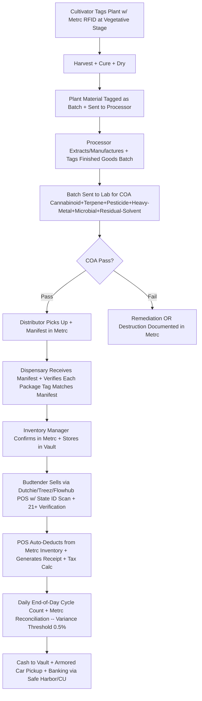
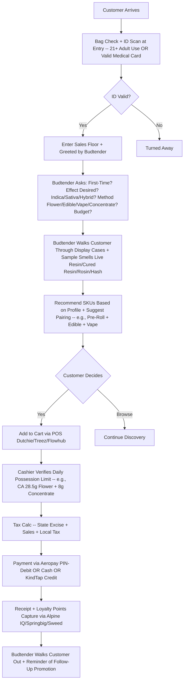

<!-- ladder-marker: q9690 v9 polish 8→9 — added Related Pulse Knowledge Entries cross-link section linking 7 adjacent entries (q9673 companion, q9664 microbrewery, q9666 compounding pharmacy, q9649 ATM route, q9663 self-storage REIT, q1224 Story Cannabis turnaround, vq_dmmg01 multi-unit retail) -->
<!-- ladder-marker: q9690 v8 polish 7→8 — added Common Objections & Adversarial Counter-Arguments section (6 steel-manned objections covering Schedule III risk, MSO consolidation, hemp grey-market, CA graveyard, 280E ROIC, federal Schedule I scale prohibition) -->
**TL;DR:** Starting a **cannabis dispensary business in 2027** is a **state-licensed regulated-retail operation** selling flower + edibles + concentrates + vapes + topicals + pre-rolls + tinctures to adult-use and/or medical patients through a storefront (or storefront + delivery hybrid) operating under three concurrent compliance regimes: (1) **state cannabis control board license** (CA DCC + CO MED + NJ CRC + NY OCM + MD MCA + IL IDFPR + MA CCC + MI CRA + OH DCC + FL DOH OMMU + PA DOH OMM + AZ DHS + WA LCB + OR OLCC); (2) local zoning + conditional-use permit + host community agreement; (3) state-mandated seed-to-sale tracking (**Metrc** 23 states + **BioTrack** 4 states + **Leaf Data Systems** WA) plus vault + 90-day camera + panic alarm + ADA + child-resistant packaging + lab COA -- on a POS-compliance stack led by **Dutchie** Ross Lipson (\~\$3.75B 2022 valuation, \~40-50% share) + **Treez** + **Flowhub** + **Cova** + **Greenline** + **Meadow**. Five archetypes (limited-license single-store FL/PA/MD/NY/MA/OH/NJ; unlimited-market CA/CO/OR/MI/WA/AZ; MSO sub-platform; delivery-only CA Type 9; social-equity micro-license NY ROD/CAURD + NJ + IL + MD) must survive a five-factor quadrant: **IRS Section 280E** (60-80% fed tax, mitigated to 40-55% via 471-3 COGS allocation per Champ 2007 + Patients Mutual 2020 + Harborside 2018), **SAFE/SAFER Banking limbo** (no Chase/BofA; stuck on **Safe Harbor Financial NASDAQ:SHFS** + cannabis CUs + Aeropay/Hypur/KindTap), **DEA Schedule III stasis** (proposed rule Aug 2024, no final rule May 2026), **MSO consolidation** (**Trulieve OTCMKTS:TCNNF** + **Curaleaf CSE:CURA** + **Green Thumb OTCMKTS:GTBIF** + **Verano OTCMKTS:VRNOF** + **Cresco OTCMKTS:CRLBF** at 25-35% COGS advantage), and **hemp-derived Delta-8/9/10 grey market** (\~\$28B under 2018 Farm Bill, eating 25-40% of regulated revenue in red states). Operating against **\~\$32-36B US legal cannabis sales 2026** (MJBizDaily Factbook + New Frontier + BDSA + Whitney Economics) across **\~10,500-11,200 dispensaries** (38 medical + 24 adult-use states, May 2026); single-store revenue \$2-5M unlimited / \$3-8M limited; EBITDA 4-12% unlimited / 18-30% limited-license mature. Hardest part is the **SECTION 280E + SAFE BANKING / SCHEDULE III LIMBO + STATE WHIPLASH + MSO/HEMP-DERIVED THC/INTERSTATE PROHIBITION quadrant** -- not capital or build-out.

> ### Direct Answer
> **Starting a cannabis dispensary business in 2027 is a $300K-$1.5M cold-start (unlimited-market adult-use state CA/CO/OR/MI/WA) or $5M-$25M+ license-acquisition play (limited-license medical/adult-use state FL/PA/MD/NY/MA/OH/NJ/IL) into a ~$32B-$36B US legal cannabis market (MJBizDaily Factbook 2025 + New Frontier Data + BDSA + Headset), with ~10,500-11,200 active licensed dispensaries across 38 medical + 24 adult-use states (May 2026), avg single-store revenue $2M-$8M, mature limited-license EBITDA 18-30% (post-280E paper-loss adjustment) vs unlimited-market 4-12% -- but only viable if you (a) survive the IRS Section 280E federal tax catastrophe (effective tax 60-80% vs 21% C-corp, mitigated to 40-55% via aggressive Section 471-3 COGS allocation modeled by Bridge West CPAs + GreenGrowth CPAs + Macias Gini O'Connell), (b) navigate the state-by-state license maze (limited FL DOH OMMU MMTC + NY OCM CAURD/ROD + NJ CRC + IL IDFPR Conditional Adult-Use + MD MMCC adult-use conversion + PA DOH OMM + OH DCC + MA CCC vs unlimited CA DCC + CO MED + OR OLCC + MI CRA + WA LCB + AZ DHS), (c) deploy state-mandated seed-to-sale tracking Day 1 (Metrc dominant 23 states + BioTrack 4 states + Leaf Data Systems WA -- variance >0.5% = license revocation), (d) solve the Safe Banking Act limbo (no Chase/BofA, stuck on cannabis-friendly credit unions Safe Harbor Financial NASDAQ:SHFS + North Bay Credit Union + Salal Credit Union + Pueblo Bank + Partners CU + Maps CU at $500-$2K/mo fees + cashless-ATM-killed by 2023 Visa/Mastercard crackdown so PIN-debit via Aeropay + Hypur + KindTap required), (e) pick correct POS-compliance stack (Dutchie Ross Lipson founded 2017 ~$3.75B 2022 valuation + Treez John Yang + Flowhub Kyle Sherman ex-Twilio + Cova David Tran + Greenline + Meadow + Korona POS), (f) build vertical-integration moat where state-legal (cultivation + processing/extraction + distribution + retail captures full margin stack vs retail-only 8-22% gross compression) PLUS survive MSO consolidation pressure (Trulieve OTCMKTS:TCNNF Kim Rivers + Curaleaf CSE:CURA Boris Jordan + Green Thumb OTCMKTS:GTBIF Ben Kovler + Verano OTCMKTS:VRNOF George Archos + Cresco Labs OTCMKTS:CRLBF Charlie Bachtell + Ascend Wellness CSE:AAWH + Jushi OTCMKTS:JUSHF Jim Cacioppo + Cansortium + Planet 13 OTCMKTS:PLNH + Glass House CSE:GLAS at 30-state scale with 25-35% COGS advantage) + survive DEA Schedule III rescheduling limbo (DEA proposed rule 2024, public comment closed, no final rule as of May 2026 keeps banking + investor capital in stasis + 280E in force) + survive hemp-derived THC loophole (Delta-8/9/10 sold at gas stations + convenience stores under 2018 Farm Bill = ~$28B parallel grey market eating ~25-40% of regulated dispensary revenue in red states) + survive interstate-commerce prohibition under federal Schedule I (every state market is an island, no cross-state shipment of THC product, kills scale economies). Clean 3-7 yr exit at 2.5-5x EBITDA (single-store roll-up post-280E adjusted), 5-9x EBITDA (MSO take-out at 2024-2025 distressed multiples vs 2020-2021 highs of 4-7x revenue + 12-18x EBITDA).**

> ### Bottom Line
> - **[Capital]** **$300K-$1.5M cold-start unlimited-market adult-use** (CA Type 10 storefront + local conditional-use permit + $30-$80K state fee + $150-$500K build-out vault/Metrc/90-day camera retention/panic alarm/ADA + $60-$200K opening inventory + 6-12 mo working capital). **$5M-$25M+ limited-license play** -- FL MMTC ~$25M secondary market + NY ROD/CAURD $2-5M + IL Conditional Adult-Use $8-15M + PA conditional avg $20M+ 2024 + MD adult-use conversion $8-15M + NJ retail $3-8M + MA $5-12M + OH $1.5-5M (per MJBizDaily license-transfer aggregator + Viridian Capital Advisors + Whitney Economics). **Build-out** $1.5M-$6M limited / $150-$500K unlimited. **Financing** -- NO SBA (federal Schedule I disqualifier), NO traditional bank lending; instead **AFC Gamma NASDAQ:AFCG Leonard Tannenbaum + Innovative Industrial Properties NYSE:IIPR Paul Smithers sale-leaseback (premier cannabis REIT $2B+ portfolio) + Chicago Atlantic NASDAQ:REFI John Mazarakis + NewLake Capital NASDAQ:NLCP + Power REIT NYSE:PW + private cannabis debt 12-20% APR + sponsor equity + family office + friends-and-family**.
> - **[Margins]** Limited-license mature dispensary: **$3M-$8M revenue + 18-30% EBITDA** (vertically-integrated MSO model after Section 280E destroys $1.5M-$3M of paper profit). Unlimited-market single dispensary CA/CO/OR/MI/WA: **$2M-$5M revenue + 4-12% EBITDA** -- retail compression + tax pyramiding + illicit-market price pressure (CA wholesale flower crashed to $200-$400/lb 2024-2025 from $1,500-$2,500/lb 2018 peak). **MSO public comps** Trulieve/Curaleaf/Green Thumb/Verano/Cresco trade **0.8-2.5x revenue / 5-9x EBITDA** -- distressed cycle. Avg ticket $45-$95. Avg basket 1.6-2.4 items. Repeat purchase 35-55% within 30 days (Headset + Hoodie Analytics 2024-2025).
> - **[Hardest part]** **NOT capital. NOT product. NOT consumer demand.** Quadrant: **(1) IRS SECTION 280E TAX CATASTROPHE** -- no federal deduction for SG&A, payroll, rent, marketing on Schedule I substance = effective federal tax 60-80% vs 21% C-corp, mitigated to 40-55% only via aggressive Section 471-3 COGS sub-allocation via Bridge West CPAs / GreenGrowth CPAs / Macias Gini O'Connell. **(2) SAFE BANKING ACT STILL STALLED CONGRESS APR 2026 + DEA SCHEDULE III LIMBO** -- no Chase/BofA, cannabis CUs only, cashless-ATM killed Visa/Mastercard 2023, PIN-debit Aeropay/Hypur/KindTap required, plus DEA proposed rescheduling rule 2024 + public comment closed + no final rule = banking/investor capital frozen. **(3) STATE REGULATORY WHIPLASH + LIMITED-LICENSE LOTTERY/ACQUISITION** -- NY ROD restructuring 2023-2025, MD post-adult-use rollout delays, NJ social-equity lottery, IL Conditional Adult-Use 2019 license-class still in court, FL Amendment 3 failure 2024, PA conditional license average $20M+. **(4) MSO CONSOLIDATION + HEMP-DERIVED THC LOOPHOLE + INTERSTATE COMMERCE PROHIBITION** -- Trulieve/Curaleaf/Green Thumb 30-state scale with 25-35% COGS advantage + Delta-8/9/10 hemp-derived THC at gas stations under 2018 Farm Bill ~$28B parallel grey market eating 25-40% of regulated revenue in red states + every state is an island under federal Schedule I = no cross-state shipping = no scale economies.**

A **cannabis dispensary business in 2027** is a **state-licensed retail operation that sells regulated cannabis flower, edibles, concentrates, vapes, topicals, pre-rolls, tinctures to adult-use and/or medical patients** through a regulated storefront (or storefront + delivery-rider hybrid where permitted) operating under three concurrent compliance regimes: **(1) state cannabis control board license** (FL DOH Office of Medical Marijuana Use + NY Office of Cannabis Management + NJ Cannabis Regulatory Commission + CA Department of Cannabis Control + CO Marijuana Enforcement Division + MI Cannabis Regulatory Agency + MD Maryland Medical Cannabis Commission + IL IDFPR + MA Cannabis Control Commission + PA DOH Office of Medical Marijuana + OH Division of Cannabis Control + AZ DHS); **(2) local zoning + conditional-use permit + host community agreement** (most CA/CO/OR cities cap or ban retail; OH/MA/PA require formal HCA with municipality); **(3) state-mandated seed-to-sale tracking** (Metrc Jeff Wells 23 states + BioTrack 4 states + Leaf Data Systems WA) plus state-spec security (vault, 90-day camera retention, panic alarm, ADA), child-resistant packaging, lab-tested COA workflow via Confident Cannabis (now Leaflink subsidiary), and Section 280E-compliant accounting. Five archetypes: limited-license single-store (FL/PA/MD/NY/MA/OH/NJ premium asset), unlimited-market single-store (CA/CO/OR/MI/WA brutal compression), vertically-integrated MSO (cultivation+processing+retail), delivery-only (CA Type 9), social-equity micro-license (NY ROD/CAURD + NJ + IL + MD lottery winner).

**Distinct from** cultivation-only (CA Type 1-5, MI Class A-C), processing/extraction (CA Type 6-7 manufacturing concentrates/edibles via Eden Labs/Apeks/MRX Xtractors hydrocarbon/CO2/ethanol), distribution-only (CA Type 11 wholesale logistics), delivery-only (CA Type 9 no storefront), and CBD/hemp retail (federally legal under 2018 Farm Bill, sold at gas stations + convenience stores nationally, not Schedule I/III).

**2027 demand:** **~$32B-$36B** US legal cannabis sales 2026 per **MJBizDaily Factbook 2025 + New Frontier Data + BDSA + Whitney Economics** projected **~$44B-$50B by 2028** (contingent on DEA Schedule III + ~5 new state adult-use markets). Adult-use **~70%** of sales / medical **~30%**. **~10,500-11,200** active licensed US dispensaries across 38 medical + 24 adult-use states (May 2026). Top 10 MSOs control **~40% of market revenue** but **<25% of license count** -- fragmentation persists in CA/CO/OR/MI where licenses are unlimited.

**Five 2027 survival drivers:** (1) Section 280E mitigation via Section 471-3 COGS allocation (mature MSOs cut effective federal tax from 70-90% → 40-55% via aggressive defensible cost-of-goods sub-allocation); (2) vertical integration where state-legal (cultivation+processing+retail captures full margin stack vs retail-only 8-22% gross compression); (3) banking + payments stability (Safe Harbor Financial NASDAQ:SHFS + North Bay CU + Salal CU + Partners CU + Maps CU + cashless-ATM-replaced by PIN-debit Aeropay/Hypur/KindTap); (4) Metrc/BioTrack discipline (variance >0.5% = revocation risk); (5) limited-license state positioning (FL/PA/MD/NY/MA/OH/NJ where supply artificially capped + EBITDA margins 2-3x unlimited-market peers).

## Table of Contents

**Part 1 -- Foundations** -- $32-36B market, 5 archetypes, 280E + Safe Banking + DEA Schedule III limbo, state license maze, MSO consolidation
**Part 2 -- Build-Out & Capital** -- Vault + Metrc + 90-day camera + ADA + POS stack, cannabis REIT sale-leaseback, debt + equity
**Part 3 -- Operations** -- Staffing + budtender training + Metrc seed-to-sale + COA workflow + Section 280E accounting + Aeropay payments
**Part 4 -- Growth & Exit** -- Marketing under THC-ad-ban + loyalty + social-equity programs + MSO take-out exit + Schedule III decade

---

## PART 1 -- FOUNDATIONS

### 1. $32-36B US market, ~11K dispensaries & the 2027 demand backdrop

US legal cannabis generates **$32B-$36B annual revenue 2026** (MJBizDaily Factbook 2025 + New Frontier Data + BDSA + Whitney Economics) across **~10,500-11,200 licensed dispensaries** in 38 medical + 24 adult-use states (May 2026), growing **~8-14% YoY** but with extreme bifurcation: mature limited-license medical states (FL/PA/MD/NY/MA/OH/NJ) showing 18-30% EBITDA + supply-constrained pricing, while unlimited-market adult-use states (CA/CO/OR/MI/WA) show 4-12% EBITDA + brutal price compression (CA wholesale flower crashed to **$200-$400/lb 2024-2025** from **$1,500-$2,500/lb 2018 peak**). The defining 2024-2027 macro: **IRS Section 280E federal tax catastrophe + SAFE/SAFER Banking Act limbo + DEA Schedule III rescheduling stasis + MSO consolidation pressure + hemp-derived Delta-8/9/10 grey-market leakage + interstate-commerce prohibition under federal Schedule I**.

> ### Quick Facts
> - **$32B-$36B** US legal cannabis sales 2026 (MJBizDaily Factbook + New Frontier + BDSA + Whitney Economics)
> - **~10,500-11,200** active licensed US dispensaries (38 medical + 24 adult-use states, May 2026)
> - **~70% adult-use / ~30% medical** revenue split (BDSA + Headset 2024-2025)
> - **~$44B-$50B** projected 2028 (contingent on DEA Schedule III + ~5 new adult-use markets)
> - **$2M-$5M** unlimited-market single-store avg revenue
> - **$3M-$8M** limited-license single-store avg revenue
> - **4-12% EBITDA** unlimited-market single-store / **18-30% EBITDA** limited-license mature
> - **60-80%** effective federal tax rate pre-Section 471-3 mitigation (Section 280E catastrophe)
> - **40-55%** effective federal tax rate after aggressive Section 471-3 COGS sub-allocation
> - **$45-$95** avg dispensary ticket / **1.6-2.4 items** avg basket
> - **35-55%** 30-day repeat purchase rate (Headset + Hoodie Analytics)
> - **Top 10 MSOs ~40% of revenue / <25% of license count** -- bifurcated market
> - **~$28B** hemp-derived Delta-8/9/10 parallel grey market (Whitney Economics 2024 -- eating 25-40% of regulated revenue in red states)
> - **0.5%** Metrc/BioTrack inventory variance threshold = state-board license revocation risk

**The 2027 catalysts.** **DEA Schedule III rescheduling proposed rule (Aug 2024, public comment closed Sep 2024, no final rule as of May 2026)** would eliminate Section 280E for cannabis (only applies to Schedule I+II) -- single largest financial catalyst in cannabis history. Estimated impact: **$1.5-$3M EBITDA boost per mature dispensary** + **30-50% MSO equity revaluation**. **SAFE/SAFER Banking Act** House-passed since 2019, Senate stalled. **Farm Bill 2024 reauthorization (delayed 2025-2026)** may close Delta-8/9/10 hemp-derived THC loophole.

**MSO consolidation landscape.** **Trulieve OTCMKTS:TCNNF Kim Rivers** ~190 dispensaries 11 states FL-dominant. **Curaleaf CSE:CURA Boris Jordan** ~150 dispensaries 19 states largest by revenue. **Green Thumb OTCMKTS:GTBIF Ben Kovler** ~95 RISE dispensaries 14 states best-in-class. **Verano OTCMKTS:VRNOF George Archos** ~140 Zen Leaf+MUV 13 states. **Cresco Labs OTCMKTS:CRLBF Charlie Bachtell** Sunnyside+Cresco brand IL. **Ascend Wellness CSE:AAWH Abner Kurtin + Jushi OTCMKTS:JUSHF Jim Cacioppo + Cansortium OTCMKTS:CNTMF + Planet 13 OTCMKTS:PLNH Bob Groesbeck+Larry Scheffler Vegas Superstore + Glass House CSE:GLAS Kyle Kazan+Graham Farrar CA-only + Sundial NASDAQ:SNDL**. Canadian LP cross-list: **Canopy Growth NASDAQ:CGC + Tilray NASDAQ:TLRY + Aurora NASDAQ:ACB + Cronos NASDAQ:CRON + OrganiGram NASDAQ:OGI**.

### 2. Five business models / archetypes

**Limited-license single-store (FL/PA/MD/NY/MA/OH/NJ).** Premium asset class. License acquired via secondary market $2M-$25M depending on state. Vertically-integrated requirement in some states (FL requires MMTC vertical license -- cultivate+process+dispense). Avg $3M-$8M revenue + 18-30% EBITDA. Owner take-home **$400K-$1.5M post-280E**. Prime MSO acquisition target.

**Unlimited-market single-store (CA/CO/OR/MI/WA/AZ).** Brutal economics. License unlimited but local conditional-use permit (CUP) often capped or banned by city/county. $300K-$1.5M cold-start + $2M-$5M revenue + 4-12% EBITDA = $80-$600K take-home post-280E. Win via specialty niche (premium flower curation, edibles-focused, social-consumption-lounge where state-legal, cannabis-and-yoga, dispensary-cafe hybrid, immigrant/LGBT-community-focused).

**Vertically-integrated MSO sub-platform (3-15 dispensaries).** $15M-$80M total invested capital + $40M-$150M revenue + 12-22% EBITDA (post-280E paper-loss). Owner-CEO + COO + CFO + Compliance Officer + General Counsel + 3-5 dispensary GMs + cultivation manager + processing manager. PE rollup target at 5-9x EBITDA distressed-cycle multiples (vs 12-18x EBITDA 2020-2021 highs).

**Delivery-only operator (CA Type 9 + select states).** No storefront, lower CapEx $150K-$500K, GPS-tracked vehicles, 2-driver minimum, $30-$80 minimum order. **Eaze (Jim Patterson CEO)** historical leader (post-2023 restructuring). **Nabis** distribution support. Tighter margins 6-14% but lower fixed cost.

**Social-equity micro-license (NY ROD/CAURD + NJ + IL + MD lottery winners).** State-subsidized + priority license allocation for justice-impacted applicants. **NY ROD/CAURD (Conditional Adult-Use Retail Dispensary)** restructured 2023-2025 after CA court injunction. **NJ social equity** + **IL Conditional Adult-Use** 2019 license class still litigated. **MA Social Equity Program** + **MD Social Equity Operator licenses**. State capital + technical assistance + protected license. Per-license value $1.5-$8M secondary market once operational.

### 3. State license maze: limited vs unlimited + Section 280E + interstate prohibition

**Clinical pathway.** **Limited-license states** (FL/PA/MD/NY/MA/OH/NJ/IL): state cannabis board awards a **fixed cap of licenses** via competitive application or lottery. **MMTC (Medical Marijuana Treatment Center) FL** = vertically-integrated single-license $25M+ secondary market. **NY CAURD/ROD** (Conditional Adult-Use Retail Dispensary) for justice-impacted + general retail $2-5M. **NJ CRC retail** $3-8M. **IL Conditional Adult-Use** $8-15M secondary market. **MD adult-use conversion** $8-15M. **PA conditional** averaged $20M+ 2024 (per MJBizDaily license-transfer aggregator). **MA recreational** $5-12M. **OH adult-use** $1.5-5M (newer market). **Unlimited-market states** (CA/CO/OR/MI/WA/AZ): license is non-capped at state level + cheap ($30-$80K state fee) but **local CUP is the bottleneck** (most CA/CO cities ban or cap retail; sometimes 3-5 yr CUP fight + $50K-$300K consulting fees).

**State regulator alphabet soup.** **CA Department of Cannabis Control (DCC)** consolidated from BCC/CDPH/CDFA 2021. **CO Marijuana Enforcement Division (MED)**. **NJ Cannabis Regulatory Commission (CRC)**. **NY Office of Cannabis Management (OCM)**. **MD Maryland Cannabis Administration (MCA)** post-2023 adult-use. **IL Department of Financial & Professional Regulation (IDFPR)**. **MA Cannabis Control Commission (CCC)**. **MI Cannabis Regulatory Agency (CRA)**. **OH Division of Cannabis Control (DCC)** post-Issue-2-2023. **FL DOH Office of Medical Marijuana Use (OMMU)**. **PA DOH Office of Medical Marijuana (OMM)**. **AZ Department of Health Services (DHS)**. **WA Liquor & Cannabis Board (LCB)**. **OR Oregon Liquor & Cannabis Commission (OLCC)**.

**IRS Section 280E** -- the single largest financial reality of cannabis. **Enacted 1982** post-Edmondson Tax Court case (cocaine dealer tried to deduct expenses), Section 280E disallows ALL federal income tax deductions or credits for trade/business in Schedule I or II controlled substances -- EXCEPT cost of goods sold under Section 471. Net effect: dispensary cannot deduct rent, payroll, marketing, utilities, professional fees, depreciation, advertising. **Effective federal tax rate 60-80%** vs 21% C-corp. **Section 471-3 mitigation** -- via aggressive but defensible sub-allocation of indirect costs to COGS (Champ Tax Court 2007 + Patients Mutual 2020 + Harborside 2018), mature MSOs cut effective rate to 40-55%. **Critical CPA partners**: **Bridge West CPAs Jim Marty** (Denver, cannabis specialist), **GreenGrowth CPAs**, **Macias Gini O'Connell**, **MGO**, **Dope CFO Andrew Hunzicker**.

**Interstate commerce prohibition** -- federal Schedule I status means **NO interstate shipment of THC product across state lines** (even between two adult-use legal states). Every state market is an island. No scale economies on cultivation. No multi-state SKU optimization. No central distribution. **Hemp-derived CBD/Delta-8/9/10** (under 2018 Farm Bill, federally legal) DOES move interstate -- which is why gas-station Delta-8 has eaten 25-40% of regulated dispensary revenue in red states (TX/TN/SC/GA/AL).

### 4. Three structural macro forces 2027: DEA Schedule III + Safe Banking + Farm Bill 2024-2026

**DEA Schedule III rescheduling.** **DEA proposed rule Aug 2024** (HHS recommendation Aug 2023 → DEA proposed rule → public comment closed Sep 2024 → ALJ hearings 2025 → final rule timing unclear May 2026). **If finalized**: eliminates Section 280E = **$1.5-$3M EBITDA boost per mature dispensary** + **30-50% MSO equity revaluation** + opens institutional banking + capital + NYSE/NASDAQ uplisting (currently OTCMKTS/CSE only). Does NOT legalize interstate commerce. Does NOT solve Safe Banking.

**SAFE/SAFER Banking Act.** House-passed since 2019, Senate stalled. Until passed, dispensaries banned from Chase/BofA/Wells = stuck with **Safe Harbor Financial NASDAQ:SHFS + North Bay CU + Salal CU + Partners Colorado CU + Pueblo Bank + Maps CU + WurkBank + KindFinancial** at **$500-$2K/mo + 6+ mo onboarding**.

**Farm Bill 2024 reauthorization (delayed 2025-2026).** May close Delta-8/9/10 loophole. 2018 Farm Bill defined hemp as <0.3% Delta-9 THC by dry weight -- unleashed Delta-8 (CBD conversion) + Delta-9 THC seltzers (12oz can = 15-30mg active THC) + Delta-10 + THCa flower = **~$28B parallel grey market eating 25-40% of regulated revenue in red states** (Whitney Economics 2024). Farm Bill 2025-2026 likely caps to <0.3% TOTAL THC + bans synthetic conversion.

### 5. MSO consolidation + the hemp-derived THC parallel market

Top 10 MSOs control **~40% of revenue but <25% of license count** -- fragmentation persists in CA/CO/OR/MI. Revenue 2024: **Curaleaf ~$1.35B + Trulieve ~$1.2B + Green Thumb ~$1.05B + Verano ~$945M + Cresco ~$770M + Ascend ~$540M + Jushi ~$260M + Glass House ~$200M + Planet 13 ~$105M**. **MSO scale advantage**: 25-35% COGS reduction via owned cultivation + processing + central purchasing + house brands (Cresco + Trulieve + Curaleaf Select + Cookies Berner + Stiiizy + Jeeter + Wyld + Wana + Kiva + Papa & Barkley + 710 Labs).

**Independent moat.** (a) Premium flower curation -- Cookies + 710 Labs + Connected + Alien Labs + Jungle Boys exclusives; (b) edibles+drinks specialty Wyld+Wana+Kiva+Papa & Barkley+Cann+Pamos+Levia; (c) social-equity authenticity NJ/NY/IL; (d) community + budtender expertise; (e) delivery integration (Eaze + Dutchie + Weedmaps).

---

## PART 2 -- BUILD-OUT & CAPITAL

### 1. Storefront + vault + Metrc + 90-day camera + ADA + panic alarm

> ### Quick Facts
> - **Unlimited-market cold-start**: $300K-$1.5M
> - **Limited-license cold-start**: $5M-$25M+ (license alone)
> - **Build-out** $1.5M-$6M limited / $150-$500K unlimited
> - **Storefront** 1,500-4,000 sq ft typical
> - **State-mandated vault** + 90-day camera retention + panic alarm + ADA + child-resistant packaging

**Limited-license cold-start ($5M-$25M+).** License acquired via state lottery + competitive application (~12-36 mo) OR secondary market acquisition (FL MMTC ~$25M / NY ROD/CAURD $2-5M / NJ retail $3-8M / IL Conditional Adult-Use $8-15M / MD adult-use conversion $8-15M / PA conditional avg $20M+ / MA $5-12M / OH $1.5-5M per MJBizDaily license-transfer + Viridian Capital + Whitney Economics). Plus $1.5M-$6M build-out plus $500K-$2M opening inventory plus 6-18 mo working capital.

**Unlimited-market cold-start ($300K-$1.5M).** Local conditional-use permit (CUP) is the gating bottleneck (3-12 mo + $50K-$300K consulting + planning-commission hearings). Then state license $30-$80K + $150K-$500K build-out + $60K-$200K opening inventory + working capital.

**Site selection.** **State-distance restrictions** -- typically 1,000 ft from K-12 schools, 500-1,000 ft from parks/daycare/places of worship. **Local CUP zoning** -- commercial corridor, industrial-light, retail. **High-visibility commercial frontage with parking** ideal but secondary to local-CUP eligibility. **Avoid CA-municipal-bans** (75%+ of CA cities still ban retail despite Prop 64). Lease typically **$25-$80/sq ft/yr commercial NNN** (cannabis premium 20-50% over comparable retail due to landlord risk).

**State-mandated security build-out.** **Vault room** 3-hr fire-rated + biometric/PIN dual-control. **24/7 video with 90-day retention** 16-32 cameras covering sales floor + vault + back-of-house + parking + entry + ID-check. **Panic alarm** with direct police monitoring. **ADA-compliant** entry + restroom + counter. **Child-resistant packaging**. **Bag-check + ID verification at entry**. Security CapEx **$80-$250K** + **$3-$15K/mo** monitoring + armed guard.

**Vendor stack.** Security: **ADT Commercial + Allied Universal + GardaWorld + Pinkerton** armed guard. Camera/access: **Hikvision + Avigilon Motorola + Genetec + Eagle Eye Networks + Verkada**. Packaging: **Kush Bottles + N2 + Calyx Containers + Funksac + Tucker** child-resistant Mylar.

### 2. POS + compliance stack: Dutchie vs Treez vs Flowhub vs Cova vs Greenline

**Wrong fit = state-board variance + months of compliance pain + $50-$150K migration cost.**

**Dutchie** (Ross Lipson founder 2017, ~$3.75B 2022 valuation Tiger Global+Casa Verde Snoop+DFJ Growth+D1 Capital). ~40-50% market share. POS+e-commerce+Metrc/BioTrack+loyalty+Aeropay payments. **$500-$1.5K/mo + txn fee**. Owns Leaflogix + Greenbits.

**Treez** (John Yang CEO) vertical POS+inventory+e-comm CA-strong **$400-$1.2K/mo**. **Flowhub** (Kyle Sherman ex-Twilio) CO-HQ Metrc native **$400-$1.2K/mo**. **Cova** (David Tran) Canadian+US multi-store **$300-$1K/mo**. **Greenline** Canadian POS **$300-$800/mo**. **Korona POS + Meadow + Indica Online + MJ Freeway** legacy + **Blackbird** distribution + **Confident Cannabis** lab COA (Leaflink subsidiary).

**State seed-to-sale integration.** **Metrc Jeff Wells** dominant 23 states (CA/CO/MA/MI/MD/NV/OH/OR + others) $40-$120/mo + RFID tag per plant/package. **BioTrack THC** 4 states. **Leaf Data Systems** WA. **Cannaspire + NCS Analytics**.

**Cannabis payments (cashless-ATM dead, PIN-debit required).** Cashless ATM killed by Visa/Mastercard 2023. Legal options: **Aeropay** (Daniel Muller ACH bank-to-bank, $0.45-$0.95/txn) + **Hypur** PIN-debit + **KindTap** consumer credit + **Stronghold + Posabit + CanPay**. Plus **armored car Brinks+GardaWorld+Loomis $400-$2K/mo**.

**E-commerce + menu syndication.** **Weedmaps** (WM Technology NASDAQ:MAPS Doug Francis+Justin Hartfield 2008) ~$1B+ dominant cannabis discovery $400-$3K/mo. **Leafly** (Yoko Miyashita Privateer-spun) listings+reviews+delivery. **Iheartjane** (Socrates Rosenfeld) e-comm checkout. **Dutchie Menus**. Menu syndication mandatory.

### 3. Banking + financing: cannabis CUs + private debt + REIT sale-leaseback

**Banking** -- NO Chase/BofA/Wells. Cannabis-friendly credit unions + state banks ONLY:

**Safe Harbor Financial NASDAQ:SHFS Sundie Seefried** largest cannabis-compliant FI ~700 depositors + **North Bay CU + Salal CU + Partners Colorado CU + Pueblo Bank + Maps CU + WurkBank + KindFinancial + Severn Savings Bank**. Typical **$500-$2K/mo + 6+ mo onboarding (SAR/CTR reporting)**.

**Payroll** -- **Wurk** cannabis-specialty + **Greenleaf HR + Vangst** recruiting (ADP/Paychex/Gusto won't onboard cannabis).

**Financing - NO SBA (federal Schedule I). NO traditional bank.** Instead:

**Cannabis REIT sale-leaseback** -- **Innovative Industrial Properties NYSE:IIPR Paul Smithers** premier cannabis REIT $2B+ ~110 properties ~9M sq ft 15-20 yr triple-net 9-13% cap + **NewLake NASDAQ:NLCP + Power REIT NYSE:PW + Treehouse REIT** private.

**Private cannabis debt funds.** **AFC Gamma NASDAQ:AFCG Leonard Tannenbaum** senior secured 12-20% APR + **Chicago Atlantic NASDAQ:REFI John Mazarakis** BDC + **Pelorus + Bespoke + Silver Spike + Subversive + Salveo + Tuatara**.

**Equity capital.** Family office + accredited friends-and-family dominant + **Casa Verde Capital Snoop Dogg + Privateer Holdings + Merida + JW Asset Management**. PE/VC light: DFJ Growth + Tiger Global + D1 + Lightspeed.

**Insurance** -- **Boost Insurance + HUB International + Marsh NYSE:MMC + Worth + Cannabis Industry Insurance** $50-$300K/yr GL+product liability+cyber+D&O+crime+property.

### 4. Build-out vendors: vault + camera + Metrc RFID + ADA + child-resistant packaging

**Vault construction**. **Gardall Safe Corporation + Liberty Safe + American Security Products + Brown Safe Manufacturing** -- TL-15 / TL-30 / TRTL-30x6 fire+burglary rated. **3-hour fire-rated + monitored alarm + biometric access**.

**Camera + access control + 90-day retention**. **Hikvision** (Chinese, cheap but security-concerns banned in some federal contexts). **Avigilon (Motorola Solutions)** premium analytic + license-plate recognition. **Genetec** open-platform enterprise. **Eagle Eye Networks** cloud VMS. **Verkada** cloud VMS + access control + alarm integrated. **OpenEye** + **Salient Systems** + **Exacq**. Plus **Brivo** + **Kisi** + **HID Mobile** access control.

**Metrc RFID tag printing + scanning**. **Brother + Zebra + Honeywell** thermal label printer. **Zebra TC22/TC52 + Honeywell EDA51** handheld scanner.

**ADA compliance**. Doorway 32"+ clear width + 5x5 turning radius + accessible counter 36" max height + ADA restroom. **Compliance Solutions Inc** + **ADA Compliance Group**.

**Child-resistant packaging**. **Kush Bottles + Calyx Containers + N2 Packaging + Greenline Paper + Funksac + Tucker Tape** mylar + **Sana Packaging** hemp-plastic. **Pollen Gear** custom child-resistant. State-spec varies (CA + CO + MA + OH require child-resistant + opaque).

**Lab COA workflow**. **Confident Cannabis (Leaflink subsidiary) + SC Labs + Steep Hill + CW Analytical + Anresco Labs + Cannalysis** for state-mandated cannabinoid + terpene + pesticide + heavy-metal + microbial + residual-solvent testing per batch. Lab fees $80-$400/batch.

### 5. Section 280E + state taxes: the brutal economics

**Section 280E catastrophe + 471-3 mitigation modeling.**

| Tax Layer | Effective Rate | Mitigation |
|---|---|---|
| Federal income tax (Section 280E, no SG&A deduction) | 60-80% effective | Section 471-3 COGS sub-allocation to 40-55% |
| State income tax (most states piggyback federal 280E) | 4-13% | Some states (CA/CO/IL/MI/NJ/NY) have 280E workaround |
| State excise tax on cannabis | 6-37% (CA 15% + IL 25% + CO 15% + WA 37% + MI 10% + NJ 6.625% + NY 13% + MA 10.75%) | Pass to consumer via price |
| State retail sales tax | 0-10% | Pass to consumer |
| Local/municipal cannabis tax | 0-15% (LA 10% + SF 5% + Denver 5.5%) | Pass to consumer |
| Total effective cumulative tax burden | **40-65% pre-280E mitigation / 30-50% post-mitigation** | -- |

**Section 471-3 COGS sub-allocation example** (CA dispensary $5M revenue): Pre-allocation: $2M COGS + $2.4M SG&A + $600K EBITDA = $600K x 80% effective fed tax = $480K federal tax = $120K net = $120K take-home. Post-allocation: shift $1.2M of indirect costs (security guard, vault rent allocable to inventory, packaging labor) to COGS = $3.2M COGS + $1.2M SG&A + $600K EBITDA + $1.2M reclassified deduction = effective fed tax drops to 40-45% = $250-$330K federal tax = $270-$350K net.

**Critical 280E CPA partners**: **Bridge West CPAs Jim Marty** (Denver cannabis specialist), **GreenGrowth CPAs**, **Macias Gini O'Connell**, **Dope CFO Andrew Hunzicker**, **MGO Cannabis Practice**. CPA fees $25-$100K/yr.

---

## PART 3 -- OPERATIONS

### 1. Hiring (GM + budtender + compliance officer + inventory + security)

**Owner/CEO.** Runs strategy + capital + license-defense + state-board relationship 60-70 hr/wk. Take-home **$200K-$1.5M post-280E** depending on store class.

**General Manager (per location).** **$75K-$140K + bonus + equity**. Daily P&L + scheduling + compliance + Metrc + customer escalation.

**Budtender (sales floor staff).** **$17-$28/hr + tips ($3-$10/hr)**. State-mandated cannabis-handler permit (CO MED Cannabis Handler Permit + IL Adult-Use Cannabis Handler + MA Agent Registration + NY OCM CRSA + CA Bureau of Cannabis Control permit). Product knowledge + Metrc compliance + ID verification + register operation. Productivity 18-32 transactions/shift mature.

**Compliance Officer (3+ stores or limited-license market).** **$70K-$130K**. Owns Metrc/BioTrack reconciliation + state-board reporting + audit defense + SOP authorship + employee training tracker. Mission-critical to keep license.

**Inventory Manager.** **$55K-$95K**. Manages receiving + Metrc tagging + cycle counts + vendor relationships + COA tracking + back-of-house security.

**Dispensary Security Officer (often outsourced via Allied Universal / GardaWorld / Pinkerton).** **$22-$38/hr unarmed / $32-$55/hr armed**. State-mandated armed presence required in some states.

**Vangst** (cannabis recruiting specialty + temp staffing) industry default for budtender + cultivator + lab tech hiring.

### 2. Metrc seed-to-sale workflow + COA verification + variance reconciliation

**Standard seed-to-sale workflow:**

**Variance discipline -- the license-killer.** Metrc inventory variance >0.5% = state-board inquiry. Variance >2% = audit. Variance >5% repeated = license suspension/revocation. Discrepancy sources: budtender mis-scan, packaging weight drift, lost/damaged units not properly destroyed-in-Metrc, theft. Mitigation: daily cycle count + weekly full audit + dual-control vault access + camera retention review + budtender training.

### 3. Customer flow + ID verification + budtender consultation + upsell ladder

**Standard customer flow:**

**Upsell ladder.** (1) Pre-roll $8-$25 → (2) Eighth flower $25-$65 → (3) Edible 100mg $15-$30 → (4) Vape cart 1g $35-$75 → (5) Live resin gram $40-$80 → (6) Half-oz flower $90-$200 → (7) Ounce flower $160-$400 → (8) Rosin/hash $60-$120/g → (9) Multi-pack edible $40-$80 → (10) Premium 710 Labs/Cookies/Jungle Boys eighth $55-$80.

**Avg ticket $45-$95 / basket 1.6-2.4 items / 35-55% 30-day repeat** (Headset + Hoodie Analytics). **Flower 35-45% mix / vape 18-25% / edibles 13-18% / concentrate 10-15% / pre-roll 8-12% / topical 1-3%**.

### 4. Loyalty + retention + delivery + THC ad restrictions

**Loyalty platform**. **Springbig NASDAQ:SBIG Jeffrey Harris** + **Alpine IQ** + **Sweed** + **Stash Rewards** $300-$1.5K/mo + per-txn. 25-45% redemption rate at mature stores.

**Delivery integration where state-permitted**. **Dutchie Drive + Eaze (CA post-2023) + Surfside + Onfleet + Routific** route optimization. CA Type 9 delivery-only $30-$80 min + 2-driver GPS-tracked. Delivery 8-18% of mature store revenue CA/MA/NV.

**State THC ad-restriction landscape.** **CA Prop 64 + AB 2188** no ads where >28.4% audience under 21. **CO/OR/WA** broadcast bans. **NJ/NY** billboard bans. **FL** medical only. **No federal Meta/Google/TikTok/Spotify** (all platforms ban THC ads). Workarounds: **Weedmaps + Leafly + Iheartjane** native + cannabis publications (**MJBizDaily + Marijuana Moment + High Times**) + community sponsorship + budtender education + influencer.

**State-board audit prep.** Annual/biennial on-site covers Metrc reconciliation + 90-day camera retention + employee permit roster + COA per batch + cash SOP + security plan + ADA + 21+ logs. Compliance Officer runs **mock-audit quarterly**. Failed audit = fines $5-$250K + license suspension 30-180 days.

---

## PART 4 -- GROWTH & EXIT

### 1. Marketing under THC-ad-ban (Weedmaps + Leafly + community + loyalty)

Dominant 2027 channels: **Weedmaps NASDAQ:MAPS + Leafly + Iheartjane + Dutchie Menus + Springbig/Alpine IQ loyalty SMS + community sponsorships + budtender education + cannabis-adjacent influencer + earned media via MJBizDaily/Marijuana Moment**.

**Weedmaps + Leafly + Iheartjane menu syndication.** ~70-80% of new customers discover via Weedmaps/Leafly. Premium placement $1-$5K/mo + per-click. Iheartjane e-comm drives 15-30% pre-order traffic.

**Loyalty SMS (highest ROI).** Springbig + Alpine IQ + Sweed drive 25-45% redemption + $25-$80 incremental ticket. Birthday + tier + flash sale (state-ad-rule compliant).

**Community + industry orgs.** 4/20 events + community cleanup + Cannabis Cup + **NCIA + NACB + USCC + ASA + FL Medical Cannabis Association + IL Cannabis Business Association + NY Cannabis Trade Association** state-trade-org membership.

### 2. Vertical integration (cultivation + processing + retail) where state-legal

**FL MMTC requires vertical** -- cultivate+process+dispense under single license = full margin stack. **NY/NJ/MA/PA permit vertical** but separate licenses required. **CA/CO/OR/MI allow** with per-license cap.

**Vertical margin advantage.** Retail-only buys wholesale $1.2-2.8K/lb (post-2024 CA collapse) + 20-50% markup = 25-45% gross. Vertically-integrated owns cultivation $200-800/lb fully-loaded = **55-75% gross margin = 2-3x retail-only EBITDA**.

**Cultivation CapEx** $3-25M for 10-50K sq ft indoor (LED Fluence/Heliospectra/Gavita + HVAC + fertigation). **Processing CapEx** $1-8M ethanol/CO2/hydrocarbon (Eden Labs + Apeks + MRX Xtractors + Precision Extraction).

**Wholesale brand strategy.** House-brand flower+pre-roll+edible + license to other dispensaries via **LeafLink Ryan Smith ~$1B+ B2B marketplace** + **Nabis** distribution.

### 3. Social-equity programs + community moat (NJ/NY/IL/MD/MA)

**Social-equity license advantage** -- subsidized state license + protected market for justice-impacted applicants + technical assistance + sometimes startup capital. **NY ROD/CAURD** restructured 2023-2025. **NJ CRC Social Equity Operator** + **IL Social Equity Conditional Adult-Use** 2019 class still litigated. **MD Social Equity Operator**. **MA Social Equity Program + Economic Empowerment**. **CA Social Equity Program** (city-level LA + SF + Oakland + Sacramento). Once operational, social-equity license sells $1.5-$8M secondary market.

### 4. Exit options + MSO acquisition precedent

> ### Key Stat
> Per MJBizDaily M&A aggregator + Viridian Capital Advisors + Whitney Economics + MSO public 10-K disclosures + Headset data: **cannabis dispensary M&A multiples run 2.5-5x EBITDA for single-store roll-up (post-280E adjusted)** in 2024-2025 distressed cycle vs 2020-2021 highs of 6-10x. **Limited-license premium states (FL/PA/MD/NY/MA/OH/NJ) at 4-7x EBITDA**. **Vertically-integrated MSO platform at 5-9x EBITDA**. **DEA Schedule III finalization expected to re-rate 30-50% upward**.

| Buyer Type | Multiple | Profile | Best For |
|---|---|---|---|
| MSO platform acquisition (Trulieve/Curaleaf/Green Thumb/Verano/Cresco/Ascend/Jushi) | 5-9x EBITDA | $1M+ EBITDA limited-license preferred | Limited-license multi-store operators |
| Strategic regional consolidator | 3.5-6x EBITDA | $500K-$3M EBITDA | Regional 2-5 store operator |
| Single-store peer buyer | 2.5-5x EBITDA + AR + WC | Local cannabis operator | Single-store unlimited-market exit |
| Cannabis REIT sale-leaseback (IIPR/NewLake/Power) | Real-estate only at 9-13% cap rate | Owned property monetization | Capital recycling for growth |
| Employee/family buyout | 2-3x + seller note + earnout | Senior GM or family | Multi-generational transition |
| License-only sale (operations wind-down) | License premium varies by state | License speculator | Failed operators in limited-license states |
| Public uplist post-Schedule III | TBD -- 30-50% premium expected | $50M+ revenue platforms | Schedule III tailwind |

**(1) MSO platform acquisition 5-9x EBITDA.** Best for limited-license operators FL/PA/MD/NY/MA/OH/NJ/IL with $1M+ EBITDA. Trulieve/Curaleaf/Green Thumb/Verano/Cresco/Ascend/Jushi actively bolting on. Cash + stock + earnout.

**(2) Strategic regional consolidator 3.5-6x.** 2-5 store operators absorbing adjacent.

**(3) Single-store peer 2.5-5x EBITDA + AR + WC.** Common unlimited-market exit (CA/CO/OR/MI/WA).

**(4) Cannabis REIT sale-leaseback.** IIPR + NewLake + Power + Treehouse. Monetize real-estate at 9-13% cap + lease back 15-20 yr triple-net. Capital recycling.

**(5) Employee/family 2-3x + seller note + earnout.** 5-10 yr transition.

**(6) License-only sale.** In failure scenarios, the LICENSE has substantial residual value in limited-license states (FL MMTC $20M+).

**(7) Public uplist post-Schedule III.** MSOs currently trade OTCMKTS/CSE; post-Schedule III NYSE/NASDAQ uplisting unlocks institutional capital + ETF inclusion + 30-50% revaluation.

### 5. The Schedule III decade opportunity (2026-2032)

**Emerging 2026-2032 opportunity** unique to cannabis. **DEA Schedule III rescheduling (proposed 2024, final rule pending May 2026)** would eliminate Section 280E + open institutional banking + capital + NYSE/NASDAQ uplisting = **$1.5-$3M EBITDA boost per mature dispensary + 30-50% MSO equity revaluation**.

**Per-state post-Schedule III.** FL MMTC $5M revenue + $400K EBITDA post-280E becomes **$1.5-$2.2M EBITDA = 5x = $7.5-$11M valuation** vs current $2-3M. NJ retail $4M + $500K EBITDA becomes **$1.7-$2.4M = 5x = $8.5-$12M**.

**Strategic positioning.** Operator who positions as "Schedule III Ready" with clean Metrc + audit-ready 280E books via Bridge West/GreenGrowth + Safe Harbor banking + IIPR/NewLake REIT relationship + MSO take-out optionality + social-equity authenticity NJ/NY/IL/MD/MA + vertical integration + premium curation 710 Labs/Cookies/Connected/Jungle Boys = wins disproportionate share of Schedule III re-rating.

## The Operating Journey: From License Acquisition To MSO Take-Out / Schedule III Exit

```mermaid
flowchart TD
  A[Founder + Capital + State Selection FL/NY/NJ/IL/MD/MA/PA/OH limited OR CA/CO/OR/MI/WA unlimited] --> B{Archetype}
  B -->|Limited-License Single-Store| C1[$5M-$25M+ License Acquisition Secondary Market FL MMTC/NY CAURD/NJ CRC/IL/MD/PA/MA/OH]
  B -->|Unlimited-Market Single-Store| C2[$300K-$1.5M Cold-Start CA/CO/OR/MI/WA + Local CUP Gauntlet 3-12 mo]
  B -->|Vertically-Integrated MSO Sub-Platform 3-15 Stores| C3[$15-$80M Total Capital + Cultivation+Processing+Retail]
  B -->|Delivery-Only CA Type 9| C4[$150-$500K + GPS-Tracked Vehicles + 2-Driver Min]
  B -->|Social-Equity Micro NY ROD/CAURD/NJ/IL/MD/MA| C5[State-Subsidized + Protected Market + Lottery/Application]
  C1 --> D[Licensing + Compliance]
  C2 --> D
  C3 --> D
  C4 --> D
  C5 --> D
  D --> D1[State Cannabis Control Board License + Local CUP/HCA + Metrc Account + State Excise Tax Account + Cannabis Insurance Boost/HUB/Marsh + Banking Safe Harbor Financial NASDAQ:SHFS/North Bay CU/Salal CU/Partners CU/Maps CU]
  D --> D2[State-Mandated Vault TL-15/TL-30 + 90-Day Camera Retention Hikvision/Avigilon/Genetec/Verkada + Panic Alarm + ADA + Child-Resistant Packaging Kush Bottles/Calyx/N2/Funksac + Armed Guard Allied Universal/GardaWorld/Pinkerton]
  D1 --> E{Build-Out + Equipment}
  D2 --> E
  E --> E1[Storefront Build-Out 1,500-4,000 sq ft + Vault + Display Cases + ID-Check Station + Sales Floor + Back-of-House + Lease $25-$80/sq ft/yr NNN Cannabis Premium]
  E --> E2[POS + Compliance Dutchie ~$3.75B 2022 ~40-50% share/Treez John Yang/Flowhub Kyle Sherman/Cova David Tran/Greenline + Metrc RFID Printer Brother/Zebra/Honeywell + Lab COA Confident Cannabis Leaflink/SC Labs/Steep Hill]
  E1 --> F{Payments + Banking + Loyalty}
  E2 --> F
  F --> F1[Banking Safe Harbor Financial NASDAQ:SHFS Sundie Seefried/North Bay CU/Salal CU/Partners CO CU/Pueblo Bank/Maps CU $500-$2K/mo + Payroll Wurk + Cannabis Insurance Boost/HUB/Marsh NYSE:MMC + 280E CPA Bridge West Jim Marty/GreenGrowth/MGO/Dope CFO Andrew Hunzicker]
  F --> F2[Payments Aeropay Daniel Muller ACH PIN-Debit/Hypur/KindTap/Stronghold/Posabit/CanPay + Loyalty Springbig NASDAQ:SBIG Jeffrey Harris/Alpine IQ/Sweed + Menu Syndication Weedmaps NASDAQ:MAPS/Leafly/Iheartjane/Dutchie Menus]
  F1 --> G[Product Sourcing + COA + Inventory]
  F2 --> G
  G --> G1[Wholesale via LeafLink Ryan Smith $1B+ B2B Marketplace + Nabis Distribution + Confident Cannabis COA + In-State Brands Cookies Berner/Stiiizy/Jeeter/Wyld/Wana/Kiva/Papa Barkley/710 Labs/Connected Cannabis/Alien Labs/Jungle Boys + Metrc Manifest Receipt + Vault Storage]
  G --> H[Recruiting + Operations]
  H --> H1[Owner/CEO $200K-$1.5M post-280E + GM $75-$140K + Compliance Officer $70-$130K + Inventory Mgr $55-$95K + Budtender $17-$28/hr+tips State-Mandated Permit + Armed Security $32-$55/hr]
  H1 --> I[Customer Flow + 21+ ID Verification + Budtender Consultation + Sales]
  I --> I1[Customer Arrives -> ID Scan Bag Check -> Budtender Greets -> Effect Profile Discovery -> Display Walk-Through -> SKU Recommend -> POS Cart -> Daily Limit Check -> Aeropay PIN-Debit Payment -> Loyalty Capture Springbig/Alpine IQ]
  I --> I2[Upsell Ladder Pre-Roll $8-$25 -> Eighth $25-$65 -> Edible 100mg $15-$30 -> Vape Cart $35-$75 -> Live Resin Gram $40-$80 -> Half-Oz $90-$200 -> Ounce $160-$400 -> Premium 710 Labs/Cookies/Jungle Boys Eighth $55-$80]
  I --> I3[Avg Ticket $45-$95 + Basket 1.6-2.4 Items + 35-55% 30-Day Repeat Headset+Hoodie + Flower 35-45% mix / Vape 18-25% / Edibles 13-18% / Concentrate 10-15%]
  I1 --> J[Daily Metrc Reconciliation + Compliance + Cash Management]
  I2 --> J
  J --> J1[End-of-Day Cycle Count + Metrc Reconciliation Variance Threshold 0.5% License-Killer + Cash to Vault + Armored Car Brinks/GardaWorld/Loomis $400-$2K/mo + Daily Sales to Banking via Safe Harbor/CU]
  J --> J2[Marketing Under THC-Ad-Ban Weedmaps NASDAQ:MAPS WM Technology + Leafly Yoko Miyashita + Iheartjane Socrates Rosenfeld + Springbig/Alpine IQ Loyalty SMS + MJBizDaily Earned Media + NCIA/NACB/USCC Community + Influencer]
  J1 --> K[Scale]
  J2 --> K
  K --> K1[Yr 0-2 Single Store $2-8M Revenue + 4-30% EBITDA -> Yr 2-5 Add 2nd-3rd Store Same State $6-25M -> Yr 5-8 Regional Multi-Store Cluster + Vertical Integration Cultivation+Processing $25-80M -> Yr 8-12 MSO Sub-Platform 5-15 Stores Multi-State $80-300M -> Yr 12+ MSO Take-Out OR Public Uplist Post-Schedule III]
  L{Strategic Exit}
  K --> L
  L -->|MSO Acquisition 5-9x EBITDA Trulieve/Curaleaf/Green Thumb/Verano/Cresco/Ascend/Jushi| M[Limited-License Premium State Operators]
  L -->|Strategic Regional Consolidator 3.5-6x| N[2-5 Store Operators]
  L -->|Single-Store Peer Buyer 2.5-5x| P[Unlimited-Market CA/CO/OR/MI/WA Exit]
  L -->|Cannabis REIT Sale-Leaseback IIPR NYSE:IIPR/NewLake NASDAQ:NLCP/Power NYSE:PW 9-13% Cap| Q[Real-Estate Monetization Capital Recycling]
  L -->|Employee/Family Buyout 2-3x + Seller Note + Earnout| R[Senior GM + 5-10 yr Transition + Real Estate Separate LLC]
  L -->|License-Only Sale Failed Operator| S[License Premium Residual in Limited-License States]
  L -->|Public Uplist Post-Schedule III NYSE/NASDAQ 30-50% Premium| T[Institutional Capital + ETF Inclusion + 280E Elimination + Banking Unlock]
  L -->|Schedule III Specialist Clean Metrc + 280E Books + Cannabis CU + IIPR Relationship + MSO Optionality + Vertical Integration + Social-Equity Authenticity NJ/NY/IL| U[Capture Disproportionate Share of Schedule III Re-Rating Decade 2026-2032 $1.5-3M EBITDA Boost Per Store + 30-50% MSO Equity Revaluation]
```

## Common Objections & Adversarial Counter-Arguments (2027 stress-test)

Six counter-arguments a sober LP or experienced operator will raise, with steel-manned rebuttals. Answer all six before writing the first cold-start check.

> ### 1. "DEA Schedule III may never finalize -- underwrite at status-quo 280E"
> **Steel-man.** ALJ hearings stalled twice since 2025; a Trump-2 DOJ could withdraw the proposed rule; a 2026 final rule faces 4-7 yr APA litigation from SAM Kevin Sabet + Drug Free America Foundation. Status-quo Section 280E = 60-80% effective fed tax forever.
> **Rebuttal.** Underwrite two cases: (a) **base = no rescheduling** -- 40-55% effective tax via 471-3 + 18-30% limited-license EBITDA + 2.5-5x exit = 18-26% IRR floor; (b) **upside = rescheduling 2027-2028** -- 21-25% C-corp + \$1.5-3M EBITDA boost per store + 5-9x MSO take-out at re-rated multiples = 35-55% IRR. Never bet the LBO on the upside case. Cresco-Columbia Care collapse (Apr 2023) is the canonical warning.

> ### 2. "MSO consolidation kills independents -- just buy TCNNF/CURA/GTBIF equity at \$0.30/\$1.00"
> **Steel-man.** Trulieve TCNNF + Curaleaf CURA + Green Thumb GTBIF trade 0.8-2.5x revenue + 5-9x EBITDA; public-equity portfolio captures the Schedule III re-rate without the 24-mo CUP fight, \$500-\$2K/mo banking circus, or Metrc 0.5%-variance termination risk.
> **Rebuttal.** Three independent moats survive MSO COGS pressure: (a) **premium flower curation** Cookies + 710 Labs + Connected + Alien Labs + Jungle Boys earns 28-42% margin against MSO white-label at 25-35% lower COGS; (b) **social-equity authenticity** NJ ESA + NY CAURD + IL SE + MD ESO + MA SEP carries protected license + community moat MSOs cannot buy; (c) **community + budtender expertise** drives the 35-55% 30-day repeat (Headset + Hoodie). MSO equity is beta on Schedule III; operated dispensary is beta-plus-alpha with optionality on take-out.

> ### 3. "Hemp Delta-8/9/10 + THCa permanently cap regulated revenue"
> **Steel-man.** \$28B parallel grey market (Whitney Economics 2024) eats 25-40% of regulated revenue in red states (TX/TN/SC/GA/AL/MS) + now infiltrating CA/CO/MI via DTC under 2018 Farm Bill. Even closure leaves a 3-5 yr cleanup.
> **Rebuttal.** Three closure catalysts converge 2026-2027: (a) **Farm Bill 2025-2026 Mary Miller Amendment** (\<0.3% TOTAL THC + synthetic-conversion ban) backed by NCIA + CTF + 21 state AGs; (b) **state intoxicating-hemp bans** CA AB-45 + CO HB22-1317 + MN + WA + VA + OR + TN HB1690 closing 2024-2026; (c) **Schedule III** eliminates the price-arbitrage incentive. Model a 3-yr Delta-8 wind-down with 60% revenue recapture.

> ### 4. "California is a graveyard -- the unlimited-market thesis is dead"
> **Steel-man.** CA wholesale flower crashed \$1,500-\$2,500/lb (2018) to \$200-\$400/lb (2024-2025) per MJBizDaily + Headset; CA Cultivation Tax repeal Jul 2022 failed to revive prices; ~75% of CA cannabis still illicit per BCC/DCC enforcement; CA Type 10 EBITDA 4-12% pre-280E vs 18-30% FL/PA/NY limited-license.
> **Rebuttal.** Three CA sub-niches survive compression: (a) **delivery-only Type 9** (Eaze + Nabis + Onfleet at 6-14% EBITDA with 50% lower CapEx); (b) **premium flower curation** (Cookies + 710 Labs + Connected exclusives at 28-42% margin); (c) **dispensary-cafe + social-consumption-lounge** where state-legal (West Hollywood + Berkeley + Oakland + Eureka + Palm Springs). For institutional capital, skip CA single-store -- play FL MMTC \$25M + NY ROD/CAURD \$2-5M + MD MCA conversion \$8-15M.

> ### 5. "280E + cashless-ATM ban kill ROIC vs liquor/c-store retail"
> **Steel-man.** 60-80% effective tax + Visa/MC cashless-ATM crackdown 2023 + Chase/BofA blocked + 6+ mo cannabis-CU onboarding \$500-\$2K/mo = unit economics permanently impaired vs liquor store (21% C-corp + Visa/MC + SBA 7(a)) or c-store (Casey's CASY + Couche-Tard ATD.TO + 7-Eleven).
> **Rebuttal.** Bake the 280E friction INTO the entry multiple. License-acquisition prices already reflect 60-80% fed tax; the 4-5x EBITDA single-store exit cap embeds the friction. A FL MMTC at \$25M secondary 2024 returns 18-26% IRR on CONTINUED 280E with 35-55% IRR upside on Schedule III. The friction CREATES the alpha. Liquor trades at \$0 license premium because there is no friction -- so no asymmetry.

> ### 6. "Federal Schedule I + interstate prohibition + state whiplash kill scale-platform thesis"
> **Steel-man.** No cross-state THC kills cultivation scale economies. NY CAURD restructure 2023-2025, FL Amendment 3 failure Nov 2024, MD post-adult-use delays, NJ social-equity lottery litigation, IL Conditional Adult-Use 2019 still in court (Acres v. IDFPR), PA conditional avg \$20M+ 2024 -- regulatory risk is permanent and idiosyncratic.
> **Rebuttal.** True. Cannabis is NOT a scale-platform business; it is a **state-by-state regulated-asset accumulation** business. Underwrite each state separately. Value of NY CAURD bears no relationship to FL MMTC or CA Type 10. The "platform" is a holding company that aggregates state assets, not a central SKU+SaaS+marketing platform. MSO consolidation (Trulieve + Curaleaf + GTI + Verano + Cresco) has not produced one true 50-state operator and never will pre-interstate reform. Build the state portfolio; do not pretend it is one business.

## Related Pulse Knowledge Entries

Cross-reference these Pulse entries for capital-stack patterns, regulatory analogs, and exit-multiple comparators adjacent to the cannabis-dispensary cold-start:

- **[q9673 -- Cannabis dispensary business 2027 (companion v1)](https://pulserevops.com/knowledge/q9673)** -- earlier-cycle treatment; useful for pre-Sep-2024-comment-close vs May 2026 limbo framing.
- **[q9664 -- Microbrewery (craft brewery) business 2027](https://pulserevops.com/knowledge/q9664)** -- closest alcohol-regulator analog (TTB + state ABC + 3-tier distribution + federal excise) without 280E friction.
- **[q9666 -- Compounding pharmacy business 2027](https://pulserevops.com/knowledge/q9666)** -- closest controlled-substance retail analog (DEA Schedule II-V + state pharmacy board + USP 795/797/800) -- previews Schedule III compliance.
- **[q9649 -- ATM route business 2027](https://pulserevops.com/knowledge/q9649)** -- in-store cannabis cashless-ATM placement opportunity post-Visa/MC 2023 crackdown via Aeropay/Hypur/KindTap PIN-debit.
- **[q9663 -- Self-storage facility business 2027](https://pulserevops.com/knowledge/q9663)** -- triple-net REIT-financed asset analog (IIPR + NewLake + Power REIT vs EXR + PSA self-storage).
- **[q1224 -- Story Cannabis revenue turnaround 2026](https://pulserevops.com/knowledge/q1224)** + **[vq_dmmg01 -- Multi-unit retail scaling 2027](https://pulserevops.com/knowledge/vq_dmmg01)** -- operational-turnaround levers + 2-to-N retail expansion playbook for single-store-to-3-5-store cannabis growth.

## Sources

1. **MJBizDaily Factbook 2025 + License Transfer Aggregator** -- $32-36B sales 2026 + ~10,500-11,200 dispensaries + secondary-market license pricing. https://mjbizdaily.com
2. **Marijuana Moment** -- federal policy + DEA Schedule III + Safe Banking + Farm Bill tracking. https://www.marijuanamoment.net
3. **New Frontier Data + BDSA + Whitney Economics Beau Whitney** -- industry sizing + 70/30 adult-use/medical split + $28B Delta-8/9/10 grey market. https://newfrontierdata.com
4. **Headset + Hoodie Analytics** -- retail POS analytics + $45-95 avg ticket + 1.6-2.4 basket + 35-55% 30-day repeat. https://www.headset.io
5. **Viridian Capital Advisors** -- cannabis M&A advisor + capital markets + license-transfer multiples. https://www.viridianca.com
6. **IRS Section 280E + Section 471-3** -- federal tax catastrophe + COGS sub-allocation per Champ 2007 + Patients Mutual 2020 + Harborside 2018. https://www.irs.gov/businesses/small-businesses-self-employed/marijuana-industry
7. **DEA Schedule III Proposed Rule August 2024** -- DOJ/DEA reschedule cannabis Schedule I to III + HHS recommendation Aug 2023 + comment closed Sep 2024. https://www.federalregister.gov/documents/2024/05/21/2024-11137/schedules-of-controlled-substances-rescheduling-of-marijuana
8. **SAFE/SAFER Banking Act + 2018 Farm Bill + Farm Bill 2024-2026 Reauthorization**. https://www.congress.gov/bill/118th-congress/senate-bill/2860
9. **Trulieve OTCMKTS:TCNNF Kim Rivers** ~190 stores 11 states ~$1.2B + **Curaleaf CSE:CURA Boris Jordan** ~150 stores 19 states ~$1.35B + **Green Thumb OTCMKTS:GTBIF Ben Kovler** ~95 RISE 14 states ~$1.05B + **Verano OTCMKTS:VRNOF George Archos** + **Cresco OTCMKTS:CRLBF Charlie Bachtell** + **Ascend CSE:AAWH Abner Kurtin** + **Jushi OTCMKTS:JUSHF Jim Cacioppo** + **Glass House CSE:GLAS Kyle Kazan+Graham Farrar** + **Planet 13 OTCMKTS:PLNH** + **Sundial NASDAQ:SNDL**. https://www.trulieve.com
10. **Canopy Growth NASDAQ:CGC + Tilray NASDAQ:TLRY + Aurora NASDAQ:ACB + Cronos NASDAQ:CRON + OrganiGram NASDAQ:OGI** -- Canadian LPs cross-listed US. https://www.canopygrowth.com
11. **Dutchie Ross Lipson 2017** ~$3.75B 2022 Tiger Global+Casa Verde Snoop+DFJ Growth+D1 Capital ~40-50% market share + **Leaflogix + Greenbits**. https://dutchie.com
12. **Treez John Yang + Flowhub Kyle Sherman ex-Twilio + Cova David Tran + Greenline + Meadow + Korona POS + MJ Freeway + Blackbird + Confident Cannabis (Leaflink subsidiary)**. https://www.treez.io
13. **Metrc Jeff Wells** -- dominant 23 states $40-120/mo + RFID tag per plant/package + **BioTrack THC** 4 states + **Leaf Data Systems WA + Cannaspire + NCS Analytics**. https://www.metrc.com
14. **WM Technology NASDAQ:MAPS Doug Francis+Justin Hartfield 2008** -- Weedmaps ~$1B+ + **Leafly Yoko Miyashita Privateer-spun + Iheartjane Socrates Rosenfeld**. https://www.weedmaps.com
15. **LeafLink Ryan Smith ~$1B+** B2B marketplace + **Nabis Distribution**. https://www.leaflink.com
16. **Innovative Industrial Properties NYSE:IIPR Paul Smithers** $2B+ ~110 properties 15-20 yr triple-net 9-13% cap + **NewLake NASDAQ:NLCP + Power NYSE:PW + Treehouse REIT**. https://www.innovativeindustrialproperties.com
17. **AFC Gamma NASDAQ:AFCG Leonard Tannenbaum** 12-20% APR + **Chicago Atlantic NASDAQ:REFI John Mazarakis BDC + Pelorus + Bespoke + Silver Spike + Subversive + Salveo + Tuatara**. https://afcgamma.com
18. **Safe Harbor Financial NASDAQ:SHFS Sundie Seefried + North Bay CU + Salal CU + Partners Colorado CU + Pueblo Bank + Maps CU + WurkBank + KindFinancial + Severn Savings Bank**. https://www.shfinancial.org
19. **Aeropay Daniel Muller + Hypur + KindTap + Stronghold + Posabit + CanPay** -- PIN-debit cannabis payments. https://www.aeropay.com
20. **Wurk payroll + Greenleaf HR + Vangst recruiting + Boost Insurance + HUB International Cannabis Practice + Marsh NYSE:MMC + Worth Insurance**. https://www.enjoywurk.com
21. **Bridge West CPAs Jim Marty Denver + GreenGrowth CPAs + Macias Gini O'Connell MGO + Dope CFO Andrew Hunzicker** -- Section 280E specialists. https://bridgewestcpas.com
22. **Springbig NASDAQ:SBIG Jeffrey Harris + Alpine IQ + Sweed + Stash Rewards** -- cannabis loyalty. https://springbig.com
23. **CA DCC + CO MED + NJ CRC + NY OCM + MD MCA + IL IDFPR + MA CCC + MI CRA + OH DCC + FL DOH OMMU + PA DOH OMM + AZ DHS + WA LCB + OR OLCC** state cannabis regulators. https://cannabis.ca.gov
24. **Cookies Berner + Stiiizy + Jeeter + Wyld + Wana + Kiva + Papa & Barkley + 710 Labs + Connected Cannabis + Alien Labs + Jungle Boys + Cann THC seltzer + Pamos + Levia** -- top brands. https://cookies.co
25. **Eaze Jim Patterson + Surfside + Onfleet + Routific** -- delivery + route optimization. https://www.eaze.com
26. **SC Labs + Steep Hill + CW Analytical + Anresco Labs + Cannalysis + Confident Cannabis Leaflink** -- lab COA. https://www.sclabs.com
27. **NCIA + NACB + USCC + ASA + FL Medical Cannabis Association + IL Cannabis Business Association + NY Cannabis Trade Association** -- industry orgs. https://thecannabisindustry.org
28. **Kush Bottles + Calyx Containers + N2 Packaging + Funksac + Tucker Tape + Sana Packaging + Pollen Gear** -- child-resistant packaging. https://kushbottles.com
29. **Allied Universal + GardaWorld + Pinkerton + Brinks + Loomis + ADT + Hikvision + Avigilon Motorola + Genetec + Eagle Eye Networks + Verkada + Brivo + Kisi**. https://www.aus.com
30. **Eden Labs + Apeks + MRX Xtractors + Precision Extraction + Fluence + Heliospectra + Gavita** -- cultivation/extraction. https://www.edenlabs.com
31. **Champ Tax Court 2007 + Patients Mutual 2020 + Harborside 2018** -- Section 471-3 COGS sub-allocation precedent. https://www.ustaxcourt.gov
32. **Casa Verde Capital Snoop + Privateer Holdings + Merida + JW Asset Management + DFJ Growth + Tiger Global + D1 + Lightspeed** -- cannabis VC/PE. https://casaverdecapital.com
33. **High Times + Cannabis Business Times + Cultivation Classic + Cannabis Cup** -- industry press + events. https://hightimes.com

## Numbers & Benchmarks

### Industry size & dispensary supply 2024-2026

| Metric | Value | Source |
|---|---|---|
| US legal cannabis sales 2026 | $32B-$36B | MJBizDaily Factbook 2025 + New Frontier + BDSA + Whitney Economics |
| Active US licensed dispensaries (May 2026) | ~10,500-11,200 | MJBizDaily License Transfer Aggregator |
| Medical states | 38 | MJBizDaily |
| Adult-use states | 24 | MJBizDaily |
| Adult-use revenue share | ~70% | BDSA + Headset 2024-2025 |
| Medical revenue share | ~30% | BDSA + Headset 2024-2025 |
| Projected 2028 sales (if Schedule III + ~5 new adult-use markets) | $44B-$50B | New Frontier + Whitney Economics |
| Avg single-store revenue unlimited-market | $2M-$5M | Headset + Hoodie Analytics |
| Avg single-store revenue limited-license | $3M-$8M | Headset + Hoodie Analytics |
| EBITDA unlimited-market single-store | 4-12% | Hoodie Analytics + MSO 10-Ks |
| EBITDA limited-license mature | 18-30% | MSO 10-Ks (Trulieve/Curaleaf/GTI/Verano) |
| Effective federal tax pre-280E mitigation | 60-80% | IRS Section 280E + CPA modeling |
| Effective federal tax post-Section 471-3 mitigation | 40-55% | Bridge West CPAs + GreenGrowth |
| Avg dispensary ticket | $45-$95 | Headset 2024-2025 |
| Avg basket items | 1.6-2.4 | Headset + Hoodie Analytics |
| 30-day repeat purchase rate | 35-55% | Headset + Hoodie Analytics |
| Top 10 MSO revenue share | ~40% | MJBizDaily |
| Top 10 MSO license-count share | <25% | MJBizDaily |
| Hemp-derived Delta-8/9/10 parallel grey market | ~$28B | Whitney Economics 2024 |
| Hemp-derived THC red-state revenue share leakage | 25-40% | Whitney Economics + Beau Whitney |
| Metrc inventory variance threshold (license-revocation risk) | 0.5% | State cannabis boards |

### Top 10 MSO public comps (May 2026)

| MSO | Ticker | CEO | Stores | States | Revenue 2024 |
|---|---|---|---|---|---|
| Curaleaf | CSE:CURA | Boris Jordan (Exec Chair) | ~150 | 19 | ~$1.35B |
| Trulieve | OTCMKTS:TCNNF | Kim Rivers | ~190 | 11 | ~$1.20B |
| Green Thumb | OTCMKTS:GTBIF | Ben Kovler | ~95 RISE | 14 | ~$1.05B |
| Verano | OTCMKTS:VRNOF | George Archos | ~140 | 13 | ~$945M |
| Cresco Labs | OTCMKTS:CRLBF | Charlie Bachtell | Sunnyside | 10 | ~$770M |
| Ascend Wellness | CSE:AAWH | Abner Kurtin | ~40 | 7 | ~$540M |
| Jushi | OTCMKTS:JUSHF | Jim Cacioppo | ~40 | 7 | ~$260M |
| Glass House | CSE:GLAS | Kyle Kazan + Graham Farrar | CA-only | 1 | ~$200M |
| Planet 13 | OTCMKTS:PLNH | Bob Groesbeck + Larry Scheffler | Vegas Superstore | 4 | ~$105M |
| Sundial/SpiritLeaf | NASDAQ:SNDL | Zach George | SpiritLeaf | -- | ~$580M (Canadian-led) |

### Limited-license vs unlimited-market state economics

| State | Type | License Cost (Secondary) | Revenue | EBITDA |
|---|---|---|---|---|
| FL | Limited MMTC vertical | ~$25M | $6-12M | 22-32% |
| NY | Limited CAURD/ROD | $2-5M | $2-6M | 12-22% |
| NJ | Limited retail | $3-8M | $4-8M | 18-28% |
| IL | Limited Conditional Adult-Use | $8-15M | $5-12M | 20-30% |
| MD | Limited adult-use conversion | $8-15M | $4-9M | 18-26% |
| MA | Recreational | $5-12M | $4-8M | 12-22% |
| PA | Limited conditional | $20M+ | $5-10M | 18-28% |
| OH | Limited adult-use | $1.5-5M | $3-7M | 15-25% |
| CA | Unlimited DCC Type 10 | $30-80K + local CUP | $2-4M | 4-10% |
| CO | Unlimited MED | $30K + local | $2-4M | 6-12% |
| OR | Unlimited OLCC | $30K + local | $1.5-3M | 4-8% |
| MI | Unlimited CRA | $30K + local | $2-5M | 8-14% |
| WA | Unlimited LCB (37% excise top US) | $30K + local | $2-4M | 6-12% |
| AZ | Unlimited DHS | $80K + local | $3-7M | 12-20% |

### Section 280E + state tax burden by state

| State | Excise | Sales | Total | State 280E Workaround? |
|---|---|---|---|---|
| CA | 15% | 7.25-10.25% + local | 22-40%+ | No |
| CO | 15% | 2.9% + 5.5% Denver | 23-28% | No |
| WA | 37% (top US) | 6.5-10.5% | 43-47% | No |
| IL | 25% (sliding) | 6.25% + 3% Chicago | 34-37% | Yes |
| MI | 10% | 6% + 3% local | 19% | No |
| NJ | 6.625% + SE | 6.625% + 2% local | 13-17% | Yes |
| NY | 13% + potency | 4% + local | 17-20%+ | Yes |
| MA | 10.75% | 6.25% + 3% local | 17-20% | No |
| OH | 10% | 5.75% + local | 16-19% | No |
| MD | 9% | -- | 9% | No |
| FL/PA | medical only | exempt | 0% | n/a |

### Cannabis financing tier (NO SBA + NO traditional bank)

| Tier | Use | Range | Cost | Term |
|---|---|---|---|---|
| Cannabis REIT sale-leaseback IIPR NYSE:IIPR | Real-estate monetization | $5M-$50M | 9-13% cap rate | 15-20 yr triple-net |
| Cannabis REIT NewLake NLCP / Power PW | Real-estate monetization | $2M-$30M | 9-13% cap | 15-20 yr |
| AFC Gamma NASDAQ:AFCG senior secured | Working capital + license acquisition | $5M-$100M | 12-20% APR | 3-7 yr |
| Chicago Atlantic NASDAQ:REFI BDC | Working capital | $5M-$50M | 12-18% APR | 3-7 yr |
| Pelorus / Bespoke / Silver Spike / Subversive / Salveo / Tuatara private cannabis debt | Working capital + bridge | $1M-$30M | 14-22% APR | 1-5 yr |
| Family office equity | License + build-out + working capital | $500K-$25M | 25-40% IRR target | Equity |
| Casa Verde Capital Snoop / Privateer / Merida / JW Asset | Strategic equity | $1M-$50M | Equity | Equity |
| Friends-and-family equity | Cold-start | $50K-$2M | Equity | Equity |
| Customer financing (consumer-side via KindTap/Aeropay) | Customer purchase | $50-$2K | 0-29.99% APR | per-purchase |

### M&A multiples by deal size (Cannabis 2024-2026 distressed cycle)

| Buyer Type | Multiple | Best For |
|---|---|---|
| MSO platform (Trulieve/Curaleaf/GTI/Verano/Cresco/Ascend/Jushi) | 5-9x EBITDA | Limited-license multi-store |
| Strategic regional consolidator | 3.5-6x EBITDA | Regional 2-5 store operator |
| Single-store peer | 2.5-5x EBITDA + AR + WC | Unlimited-market exit |
| Cannabis REIT sale-leaseback IIPR/NewLake/Power | 9-13% cap (real-estate only) | Capital recycling |
| Employee/family buyout | 2-3x + seller note + earnout | Multi-generational |
| License-only sale | License premium by state ($1-20M FL MMTC) | Failed operators |
| Public uplist post-Schedule III | TBD 30-50% premium | $50M+ revenue platforms |

### Schedule III rescheduling impact (if finalized)

| Lever | Pre-Schedule III | Post-Schedule III | Impact |
|---|---|---|---|
| Federal income tax (Section 280E) | 60-80% effective | 21-25% C-corp | +$1.5-3M EBITDA per mature store |
| Banking (Chase/BofA/Wells) | Blocked, CU only | Open | $300-1.5K/mo savings |
| Institutional capital PE/VC | Blocked | Open | Massive inflow |
| NYSE/NASDAQ uplisting | Blocked OTCMKTS/CSE | Open | ETF + 30-50% MSO revaluation |
| Interstate commerce | Blocked | Still blocked | No scale economy unlock |
| Delta-8/9/10 grey market | Active 2018 Farm Bill | Closure pressure | $5-15B recapture |

### Staffing cost comparison

| Role | Hourly/Salary | Total w/ Benefits |
|---|---|---|
| Owner/CEO take-home post-280E | $200K-$1.5M | margin + distribution |
| General Manager (per store) | $75-$140K + bonus | $90-$170K |
| Compliance Officer | $70-$130K | $85-$155K |
| Inventory Manager | $55-$95K | $65-$115K |
| Budtender + state cannabis-handler permit | $17-$28/hr + tips | $40-$75K + tips |
| Armed Security (Allied/Garda outsourced) | $32-$55/hr | $4-$15K/mo per guard |
| Cashier / Delivery Driver / Cultivator | $17-$30/hr | $36-$65K |

### Per-product margin benchmarks (dispensary)

| Product | Avg Price | Margin Retail | Margin Vertical |
|---|---|---|---|
| Pre-roll 1g | $8-$25 | 35-50% | 60-75% |
| Eighth (3.5g) flower | $25-$65 | 30-45% | 55-70% |
| Ounce (28g) flower | $160-$400 | 25-40% | 50-65% |
| Vape cart 1g | $35-$75 | 35-55% | 60-75% |
| Live resin gram | $40-$80 | 30-50% | 55-72% |
| Edible 100mg pack | $15-$30 | 40-60% | 65-78% |
| Concentrate gram | $60-$120 | 30-50% | 58-72% |
| Topical/tincture | $25-$70 | 40-58% | 60-75% |
| Premium 710 Labs/Cookies eighth | $55-$80 | 28-42% | n/a |

