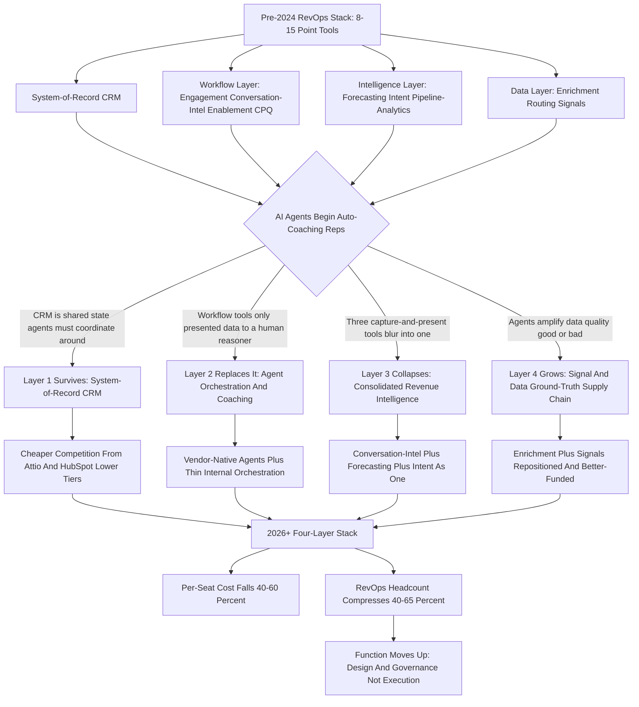
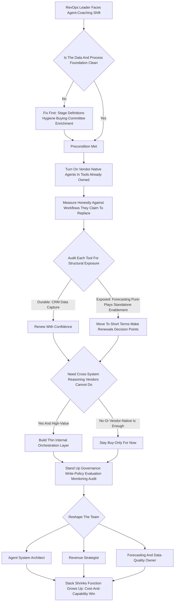

**TL;DR:** When AI agents genuinely auto-coach reps, the RevOps stack does not vanish -- it **inverts and consolidates**. The pre-2024 pattern was a sprawl of 8-15 point tools per company: Salesforce or HubSpot as system-of-record, plus Gong or Chorus for conversation intelligence, Outreach or Salesloft for engagement, Clari or BoostUp for forecasting, 6sense or Demandbase for intent, LeanData for routing, Highspot or Seismic for enablement, ZoomInfo plus Apollo plus Cognism for data, Common Room or Pocus for signals -- $1,500-$5,000 per seat per year, $150K-$500K of software for a 100-rep org, and a RevOps team of one person per 15-25 reps stitching it all together. The post-2026 stack collapses to roughly **four layers**: (1) a **system-of-record CRM** that agents read and write -- Salesforce, HubSpot, or a cheaper modern entrant like Attio; (2) an **agent orchestration and coaching layer** -- Claude, GPT-class models, and frameworks like LangGraph or vendor-native agents (Gong AI, Einstein, Outreach agents) that handle call analysis, coaching, deal-review prep, and email drafting; (3) a **collapsed revenue-intelligence layer** that merges what conversation intelligence, forecasting, and intent used to do separately; and (4) a **signal and data layer** feeding the agents fresh ground truth. Four categories instead of fifteen, $600-$1,800 per seat instead of $3,000+, a **40-60% software-cost reduction**. The deeper change is organizational: RevOps headcount compresses **40-65%** because agents absorb pipeline hygiene, forecast-data wrangling, coaching note-taking, and deal-desk prep -- but RevOps does not disappear. It moves up the stack. The surviving roles are **agent system architects** (who design, govern, and tune the agent fleet), **revenue strategists** (who own segmentation, comp, territory, and process design no agent can set), and **forecasting and data-quality owners** (because an agent coaching on bad data coaches confidently in the wrong direction). The three traps: assuming agents replace the CRM (they replace the *workflow tools around* the CRM, not the system-of-record), assuming headcount goes to zero (it goes up the value chain), and deploying coaching agents on top of dirty data and undefined process (which industrializes bad habits at scale). Net: the RevOps *stack* shrinks and the RevOps *function* gets more strategic -- the tool budget falls, the data-quality bar rises, and the human job shifts from operating the machine to designing and governing it. The single most important reframe for any RevOps leader hearing this question: agents replace the *reasoning layer* that used to be spread across a dozen workflow tools and a roomful of managers, not the *state layer* (the CRM) those tools sat on top of, and not the *strategy layer* (comp, territory, segmentation, methodology) that no agent is accountable for. Get that distinction right and the whole answer falls into place; get it wrong and you either over-cut the function or over-trust the tools.

## What "The RevOps Stack" Actually Means Before You Can Say What Replaces It

Before anyone can answer what replaces the RevOps stack, they have to be precise about what the stack *is*, because the phrase gets used loosely and the looseness hides the answer. The RevOps stack is not one thing -- it is a layered set of systems that, together, run the revenue motion of a company. At the base sits the **system-of-record CRM** -- Salesforce or HubSpot for most companies, increasingly Attio or HubSpot's lower tiers for smaller ones -- which holds the canonical record of accounts, contacts, opportunities, and activities. On top of that sits a **workflow layer** of tools that reps and managers actually touch every day: sales engagement (Outreach, Salesloft) for sequencing outbound, conversation intelligence (Gong, Chorus, Clari Copilot) for recording and analyzing calls, enablement (Highspot, Seismic) for content and coaching, and CPQ or deal-desk tooling for quoting. Above that sits an **intelligence layer**: forecasting (Clari, BoostUp, Aviso), intent and ABM (6sense, Demandbase), and pipeline analytics. Feeding all of it is a **data layer**: enrichment (ZoomInfo, Apollo, Cognism, Clay), routing (LeanData, Chili Piper), and signal capture (Common Room, Pocus, Default). When someone asks "what replaces the RevOps stack if AI agents auto-coach reps," the honest answer depends entirely on *which layer* they mean -- because agents do very different things to each layer. They do not touch the system-of-record much. They gut the workflow layer. They consolidate the intelligence layer. And they make the data layer more important, not less. Any answer that treats "the stack" as a monolith is wrong before it starts.

## What "Auto-Coach Reps" Actually Means -- The Scope Of The Premise

The second piece of precision: what does it actually mean for an AI agent to "auto-coach reps," and how much of the RevOps job does that premise really cover? Coaching, done by a human sales manager, is a bundle of distinct activities. It is **call review** -- listening to recordings, flagging missed discovery, weak objection handling, talk-time imbalances. It is **deal coaching** -- looking at a specific opportunity, asking where the champion is, whether economic buyer access exists, what the next step is. It is **skill development** -- noticing a rep is weak at multithreading and building a plan to fix it over a quarter. It is **pipeline coaching** -- is this rep's pipeline real, is it enough, is the stage distribution healthy. And it is **forecasting discipline** -- pushing reps to commit honestly. An AI agent that "auto-coaches" can plausibly do the first three well today: it can analyze every call (not the 2% a human manager samples), flag deal risks against a methodology like MEDDICC or Command of the Message, and track skill patterns over time. What it does *not* do is set the strategy that coaching operates inside -- the methodology itself, the segmentation, the comp plan that shapes behavior, the territory design, the ICP definition. So when the premise says "AI agents auto-coach reps," the realistic scope is: agents absorb the *execution* of coaching and the *analysis* underneath it, which is a large slice of front-line sales management and a meaningful slice of RevOps enablement work -- but it is not the whole RevOps job, and the part it does not touch is the strategic part that becomes *more* valuable when execution is automated.

## The Pre-2024 Baseline: The Sprawling Stack Agents Are Replacing

To see what changes, anchor on the concrete pre-2024 baseline for a mid-market SaaS company in the $50M-$500M ARR range. The CRM is Salesforce, $165-$330 per user per month depending on edition. Sales engagement is Outreach or Salesloft, roughly $100-$200 per user per month. Conversation intelligence is Gong, the category leader, commonly $1,400-$1,600 per user per year. Forecasting is Clari, frequently $1,000-$3,000+ per user per year. Intent and ABM is 6sense or Demandbase, often a $60K-$200K annual platform fee rather than per-seat. Lead-to-account matching and routing is LeanData, $40-$200 per user per month. Enablement is Highspot or Seismic, $75-$150 per user per month. Data enrichment is some combination of ZoomInfo, Apollo, and Cognism, anywhere from $15K to $200K+ a year. Signal capture is Common Room or Pocus, often $40K-$150K a year. Stack it up and a fully-equipped rep sits on $1,500-$5,000 of software per year, and a 100-rep organization is spending $150K-$500K annually on the RevOps tool stack alone -- before the RevOps salaries that integrate it. That sprawl is not an accident. Each tool exists because the CRM was bad at something specific, and the market filled every gap with a point solution. The agent era's core move is to ask whether a general-purpose reasoning layer can collapse those gaps back together -- and the answer, for the workflow layer especially, is largely yes.

## The Stack-Inversion Thesis: Why Consolidation, Not Disappearance

The central thesis is **inversion**, not disappearance, and the distinction matters because it predicts where money and headcount actually go. The pre-2024 stack was *workflow-tool-heavy and intelligence-thin*: a dozen tools that each captured or moved data, plus a thin analytical layer on top and humans doing most of the actual reasoning. The agent-era stack inverts that: it becomes *intelligence-heavy and workflow-tool-thin*. The reasoning that used to live in humans -- and in the narrow ML features bolted onto each point tool -- consolidates into an orchestration layer of general-purpose models, and the dozen workflow tools collapse because their job was mostly to present data to a human who would then reason about it. If the agent reasons, you do not need the tool whose only job was to make data legible to a person. The system-of-record survives because *something* has to be the canonical truth. The data and signal layer survives -- and grows -- because the agents are only as good as their inputs. But the middle of the old stack, the expensive workflow-and-narrow-intelligence sprawl, is exactly what gets absorbed. Inversion also explains the cost math: you are not eliminating spend, you are moving it from many per-seat workflow licenses to a smaller number of orchestration-layer and data-layer line items, and the net is lower because you stop paying a dozen vendors each marking up the same underlying CRM data.

## Layer One: The System-Of-Record CRM Survives -- And Gets Cheaper Competition

The CRM is the layer agents change *least*, and understanding why is important. An agent fleet needs a canonical, permissioned, auditable place to read the current state of every account and opportunity and to write back its conclusions. That is what a system-of-record is. You cannot have five agents and a dozen reps all operating on their own private notion of "the truth" -- the CRM is the shared state. So Salesforce and HubSpot do not get replaced by agents; if anything, they get *more* central as the agent-of-record substrate. What *does* change is the competitive pressure on price and the value of the expensive parts. Much of what enterprises paid Salesforce premium editions for was workflow automation, reporting, and the Einstein add-ons -- exactly the territory agents now contest. That opens the door for cheaper modern system-of-record entrants like Attio ($34-$179 per user per month) or HubSpot's lower tiers, because if the orchestration layer provides the intelligence, the CRM only needs to be a clean, fast, well-modeled database with good APIs. The likely 2027 picture: the CRM survives universally, but buyers get more ruthless about paying enterprise premiums for capabilities the agent layer now delivers, and the system-of-record market sees real price pressure from below.

## Layer Two: The Agent Orchestration And Coaching Layer -- The New Center Of Gravity

The genuinely new layer, and the new center of gravity, is **agent orchestration**. This is where the coaching actually happens. It has two flavors that will coexist. The first is **vendor-native agents** -- Gong's AI capabilities, Salesforce's Agentforce and Einstein, Outreach's agent features, HubSpot's Breeze. These are agents embedded inside the tools companies already own, coaching and drafting inside the existing workflow. They are the path of least resistance and most companies will start here. The second flavor is **independent orchestration** -- a layer built on general-purpose models (Claude, GPT-class, Gemini) and frameworks (LangGraph, CrewAI, vendor agent SDKs, or custom internal builds) that sits *across* tools rather than inside one. This layer reads from the CRM, the call recordings, the email system, and the data layer; reasons about deals, reps, and pipeline; and writes coaching, drafts, and updates back. The independent layer is more powerful because it is not confined to one vendor's data, but it requires more RevOps engineering to build and govern. The 2027 reality for most mid-market and enterprise companies is a hybrid: vendor-native agents for the in-tool coaching, plus a thin internal orchestration layer for the cross-system reasoning the vendors cannot do because they only see their slice. Either way, *this* is the layer that replaces the reasoning that used to be spread across a dozen tools and a roomful of managers.

## Layer Three: The Collapsed Revenue-Intelligence Layer

The revenue-intelligence layer -- conversation intelligence, forecasting, and intent, which were three separate purchases -- collapses into roughly one. The logic is straightforward. Conversation intelligence (Gong) recorded and analyzed calls so a human could extract meaning; forecasting (Clari) aggregated pipeline signals so a human could predict the quarter; intent (6sense) scored accounts so a human could prioritize. All three were *capture-and-present-to-a-reasoning-human* tools. When the reasoning human is partly an agent, and the agent can read the raw call transcripts, the raw pipeline, and the raw intent signals directly, the three tools' distinct value propositions blur into one capability: "give the agent fresh, structured ground truth about conversations, pipeline, and account behavior." That can come from one consolidated platform (Gong expanding into forecasting and intent, Clari expanding into conversation intelligence, or Salesforce absorbing all three natively) or from the orchestration layer pulling raw feeds and doing the synthesis itself. The category does not vanish -- the *capture* of calls and signals still has to happen, and that is real infrastructure -- but the three-vendor, three-budget-line structure consolidates hard. A company that paid Gong, Clari, and 6sense separately is a prime candidate to pay one consolidated revenue-intelligence vendor, or to pay for raw capture plus an orchestration layer that does what the three used to do.

## Layer Four: The Signal And Data Layer Gets More Important, Not Less

Here is the counterintuitive part that most "agents replace the stack" takes get wrong: the data and signal layer becomes *more* important. An agent that auto-coaches reps is a reasoning engine, and a reasoning engine is only as good as its inputs. If the CRM data is stale, the firmographic enrichment is wrong, the buying-committee map is incomplete, or the intent signals are noise, the agent does not coach badly in a way a human would catch -- it coaches *confidently and at scale* in the wrong direction. So the enrichment vendors (ZoomInfo, Apollo, Clay), the signal vendors (Common Room, Default, Pocus, UserGems), and the routing and data-hygiene tooling do not get absorbed the way the workflow layer does. They get repositioned as the **ground-truth supply chain** for the agent fleet. The budget here may even grow, because the marginal value of clean data rises sharply when an automated system is acting on it thousands of times a day. The 2027 stack therefore keeps a real data layer -- possibly consolidated (Clay-style platforms that unify enrichment, signals, and orchestration of data are well-positioned) but definitely present and arguably better-funded than before. The slogan: agents commoditize the workflow layer and *premium-ize* the data layer.

## The Four-Layer 2027 Stack, Concretely

Pulling it together, the concrete 2027 stack for a mid-market SaaS company looks like four categories instead of twelve-plus. **Layer one, system-of-record:** one CRM -- Salesforce, HubSpot, or Attio -- as the canonical, agent-readable-and-writable database. **Layer two, agent orchestration and coaching:** vendor-native agents inside the tools already owned, plus a thin internal orchestration layer on general-purpose models for cross-system reasoning -- this is where coaching, deal-review prep, email drafting, and pipeline hygiene happen. **Layer three, collapsed revenue intelligence:** one consolidated platform (or raw capture plus orchestration) covering what conversation intelligence, forecasting, and intent used to cover separately. **Layer four, signal and data:** enrichment plus signal capture plus routing, repositioned as the ground-truth supply chain and arguably better-funded. The honest nuance: "four layers" is the *category* count, not the *vendor* count -- a real company in 2027 still has more than four contracts, because capture infrastructure, point niches, and transition-period legacy tools persist. But the structural shift from a dozen co-equal workflow tools to four clear layers with one of them (orchestration) as the new center of gravity is the real prediction, and it is a genuine simplification of how the stack is reasoned about, budgeted, and staffed.

## The Cost Math: From $3,000+ Per Seat To $600-$1,800

The cost story is concrete enough to model. The pre-2024 fully-equipped rep carried $1,500-$5,000 of RevOps software per year, with a typical mid-market figure landing around $2,500-$3,500 once you blend CRM, engagement, conversation intelligence, forecasting, enablement, and an allocation of the platform-fee tools. The 2027 collapsed stack runs roughly $600-$1,800 per seat: a CRM seat (cheaper if Attio or HubSpot lower tiers, similar if enterprise Salesforce), an allocation of orchestration-layer cost (model usage plus the consolidated revenue-intelligence platform), and an allocation of the data layer. The headline is a **40-60% reduction in per-seat software cost**, driven not by any single tool getting cheaper but by *eliminating the redundancy* -- the dozen vendors who each marked up access to the same underlying CRM data and each charged a per-seat license for a workflow a general-purpose agent now handles. There is an important caveat: model-usage cost is *variable* in a way per-seat licenses were not. A heavy agent deployment that analyzes every call, drafts every email, and runs continuous pipeline coaching consumes real tokens, and at scale that is a meaningful line item -- so the 2027 budget trades predictable per-seat licenses for a smaller-but-variable orchestration spend, and RevOps has to actually manage that consumption. Net cost still falls, but the *shape* of the cost changes from fixed to consumption-based, which is its own operational discipline.

## What Agents Genuinely Absorb From The RevOps Job

Be specific about which RevOps tasks agents actually take over, because the headcount math depends on it. Agents credibly absorb: **pipeline hygiene** -- flagging stale opportunities, missing next steps, close-dates in the past, and either nudging the rep or updating directly; **forecast-data wrangling** -- assembling the deal-by-deal roll-up, the changes since last week, the risk flags, so the forecast call is a decision meeting not a data-gathering exercise; **call analysis and coaching note generation** -- every call, not a sample, scored against the methodology with specific timestamped feedback; **deal-review prep** -- the pre-read for every deal-desk and pipeline review, assembled automatically; **enablement surfacing** -- the right content, the right battlecard, the right competitive note delivered in-context instead of searched for; **routing and assignment** -- lead-to-account matching and territory routing as a reasoning task rather than a rules engine; and **reporting and ad-hoc analysis** -- the "can you pull me the numbers on..." requests that consumed a large share of junior RevOps time. That is a *substantial* slice of the day-to-day RevOps and front-line-management workload -- realistically the majority of the execution-and-analysis layer. It is why the headcount compression is real and large. But notice what is *not* on that list, because that omission is the rest of the answer.

## What Agents Do Not Absorb -- The RevOps Work That Becomes More Valuable

Agents do not absorb the *design* layer of RevOps, and that layer becomes more valuable precisely because execution gets automated. Agents do not set the **sales methodology** -- whether the company runs MEDDICC, Command of the Message, or something custom -- they coach *against* a methodology a human chose. They do not design the **comp plan**, which is the single most powerful behavior lever in a revenue org and a deeply political, strategic, judgment-laden artifact. They do not draw **territories** or define **segmentation** or set the **ICP** -- these require market judgment, executive alignment, and trade-off decisions no agent is accountable for. They do not own **process design** -- the stage definitions, the exit criteria, the lifecycle model that the agents then enforce. They do not run **the data-governance regime** that keeps their own inputs clean. They do not handle the **change management** of getting a sales org to adopt anything. And they do not own **the agent fleet itself** -- someone has to architect, instrument, evaluate, and govern the agents, and that someone is RevOps. So the work that survives and grows is the work that *defines the system the agents operate inside* and *governs the agents themselves*. Execution compresses; design and governance expand. That is the whole shape of the headcount answer.

## The Headcount Reality: 40-65% Compression, Not Elimination

The honest headcount number is a **40-65% compression of RevOps execution roles, not elimination of the function**. Pre-agent, a common ratio was one RevOps person per 15-25 reps, so a 100-rep org carried 4-7 RevOps people, weighted toward execution -- analysts pulling reports, ops people maintaining the tool integrations, enablement people building decks and running call reviews. Post-agent, the same org might run 2-3 RevOps people, but the *composition* changes more than the count: fewer report-pullers and integration-maintainers, more strategists and agent-architects. The compression is real and a company that pretends otherwise will be out-competed on cost. But "RevOps disappears" is wrong for three reasons. First, *someone owns the agents* -- and a fleet of coaching agents acting on revenue data is a higher-stakes system than any single tool, requiring real architecture and governance. Second, *the strategic design work is undiminished* -- comp, territory, segmentation, process, methodology still need owners, and these were always under-staffed relative to their leverage. Third, *the data-quality bar rises*, and someone has to own the ground-truth supply chain. The function gets smaller, more senior, more strategic, and more technical. The junior report-pulling RevOps role is the one genuinely at risk; the senior RevOps strategist is *more* valuable, not less.

## The Three Surviving RevOps Archetypes

Three role archetypes survive and define the 2027 RevOps team. The first is the **agent system architect** -- the person who designs the agent fleet, decides which tasks are agent-owned versus human-owned, builds or configures the orchestration layer, instruments the agents with evaluation and monitoring, manages model selection and the consumption budget, and owns the governance regime (what agents can write, what needs human approval, how errors are caught). This is a genuinely new role, part RevOps and part platform engineer, and it did not exist in 2022. The second is the **revenue strategist** -- the person who owns the design layer the agents operate inside: segmentation, ICP, territory, comp, process and stage design, methodology selection. This role existed before but was chronically under-staffed because execution work crowded it out; freed from execution, it expands. The third is the **forecasting and data-quality owner** -- the person accountable for the integrity of the forecast and, critically, for the cleanliness of the data the agents consume, because an agent coaching on bad data is worse than no agent. This role also existed but gets elevated, because its failure mode went from "the report is wrong" to "the automated coaching system is confidently wrong at scale." Three roles, all more senior and more strategic than the average pre-agent RevOps seat -- that is the team that replaces the 4-7 person execution-heavy org.

## The Vendor-Landscape Shake-Out: Who Wins, Who Is Exposed

The vendor landscape sorts into clear winners and clearly exposed categories. **System-of-record CRMs** are structurally safe -- Salesforce and HubSpot remain the substrate -- but face price pressure from below (Attio) and lose the premium they charged for workflow-and-intelligence add-ons. **Conversation-intelligence leaders** like Gong are *exposed but adaptive*: their capture infrastructure and data moat are real assets, but their "analyze calls for a human" value prop is exactly what general-purpose agents commoditize, so they have to become the consolidated revenue-intelligence platform or risk becoming a capture utility. **Forecasting pure-plays** (Clari, BoostUp, Aviso) are the *most exposed* -- forecasting is reasoning over pipeline data, which is squarely in the agent's wheelhouse, and a forecasting pure-play has to expand into capture or orchestration to survive as a standalone purchase. **Sales-engagement tools** (Outreach, Salesloft) are exposed on their "sequence and send" workflow but defensible if they become the agent execution surface. **Enablement tools** (Highspot, Seismic) are exposed -- content surfacing is a strong agent use case -- unless they become the content substrate the agents draw from. **Data and signal vendors** (ZoomInfo, Clay, Common Room) are *winners* -- they become the ground-truth supply chain and their value rises. **The new winners** are the orchestration-layer providers: the model labs themselves, the agent-framework and agent-platform companies, and whoever builds the RevOps-specific orchestration layer well. The pattern: capture infrastructure and ground-truth data win, "present-data-to-a-human" workflow tools are exposed, and orchestration is the new growth category.

## Why The CRM Is The One Thing That Cannot Be Replaced

It is worth dwelling on why the system-of-record specifically is durable, because it is the load-bearing assumption of the whole answer. A fleet of agents coaching reps, updating pipeline, drafting emails, and prepping deal reviews is a *distributed system acting on shared state*. Distributed systems acting on shared state need a single source of truth, with permissions, an audit trail, a consistent data model, and transactional integrity -- otherwise the agents and the humans diverge and the whole thing becomes incoherent. That is the definition of a system-of-record. You could imagine the system-of-record getting cheaper, getting better APIs, getting a different vendor -- but you cannot imagine it *going away*, because then there is nothing for the agents to coordinate around. The agents are not a replacement for the database; they are a replacement for the *humans and tools that read and reasoned about the database*. This is also why "agents replace Salesforce" is the most common wrong take: it confuses the reasoning layer with the state layer. The reasoning layer is what agents replace. The state layer is what they *depend on*. Any RevOps leader planning the 2027 stack should treat the CRM as the one fixed point and everything else as negotiable.

## The Transition Path: How A Real Company Gets From Here To There

The shift does not happen in one procurement cycle -- it is a multi-year transition, and the realistic path matters. **Phase one** is *vendor-native agent adoption*: companies turn on the agent features inside tools they already own -- Gong's AI coaching, Einstein, Breeze -- because it requires no new procurement and no integration work. This is where most companies are now or will be within a year. **Phase two** is *redundancy elimination*: once the vendor-native agents prove they handle a workflow, the company questions the standalone tool whose job that workflow was -- "if the agent does the coaching, why are we paying for the separate enablement seat" -- and contracts start getting cut at renewal. **Phase three** is *orchestration-layer construction*: the company hits the ceiling of vendor-native agents (each only sees its own slice) and builds or buys a thin cross-system orchestration layer for the reasoning that spans tools. **Phase four** is *re-platforming*: with the orchestration layer carrying the intelligence, the company reevaluates whether it still needs enterprise-premium CRM editions and whether the collapsed revenue-intelligence layer can be one vendor instead of three. Most companies are in phase one or two in 2026; phase three and four are 2027-2028. The strategic point for a RevOps leader: do not try to leap to the end state, but do not over-invest in tools whose category is structurally exposed -- buy the exposed categories on short terms and the durable ones (CRM, data) with more confidence.

## The Build-Versus-Buy Decision For The Orchestration Layer

The single biggest new decision RevOps owns in this era is **build versus buy for the orchestration layer**, and it is genuinely hard. *Buying* -- relying on vendor-native agents and a packaged RevOps agent platform -- is faster, lower-risk, requires less engineering, and gets governance and evaluation partly handled by the vendor. Its weakness is that vendor agents see only their vendor's data, so the cross-system reasoning (the most valuable kind) is limited, and you are betting on the vendor's roadmap. *Building* -- a custom orchestration layer on general-purpose models -- gives full cross-system reasoning, no vendor lock-in on the intelligence layer, and exact fit to the company's process. Its weakness is that it requires real engineering, ongoing maintenance, an evaluation and governance regime the company builds itself, and the discipline to manage model costs and model upgrades. The realistic 2027 answer for most mid-market companies is *hybrid*: buy vendor-native agents for in-tool coaching where they are good enough, and build a *thin* internal orchestration layer only for the specific cross-system reasoning that is both high-value and not served by vendors. Pure-build is for the largest, most sophisticated revenue orgs; pure-buy is for the smallest. The mistake at both extremes is the same: treating it as a one-time decision rather than a portfolio that shifts as vendor capabilities and internal sophistication both evolve.

## The Governance Problem: Coaching Agents Are Higher-Stakes Than Any Tool

A coaching agent fleet is a *higher-stakes system* than any tool in the old stack, and governance becomes a first-class RevOps responsibility. The old stack's failure modes were mostly *passive* -- a stale report, a missed integration sync, a dashboard nobody looked at. An agent fleet's failure modes are *active*: an agent that coaches a rep toward the wrong behavior, drafts an email that misrepresents the product, updates a deal stage incorrectly, or applies a methodology inconsistently is *acting*, at scale, thousands of times, with the authority of "the system said so." That demands a governance regime that did not exist before: a clear policy on what agents can write directly versus what needs human approval; an evaluation framework that continuously checks agent outputs against a quality bar; monitoring and alerting for drift; an audit trail of every agent action; a defined escalation path when an agent is uncertain; and a feedback loop where humans correct the agents and the corrections improve the system. This is real work and it is RevOps work -- it is the agent-system-architect role's core mandate. The companies that deploy coaching agents *without* this governance layer are the ones that will industrialize their bad habits, and the cautionary tales of the next few years will mostly be governance failures, not capability failures. The capability is arriving; the discipline to govern it is the scarce thing.

## The Data-Quality Bar: Why Dirty Data Breaks The Whole Premise

If there is one make-or-break dependency in the entire "agents auto-coach reps" thesis, it is **data quality**, and it deserves its own treatment. A human sales manager coaching off a messy CRM applies judgment -- they know the close date is fake, they know the contact is stale, they discount the bad data instinctively. An agent does not, unless it is explicitly built to. An agent coaching off a CRM where stages are inconsistently applied, next steps are missing, the buying committee is half-mapped, and enrichment is wrong will produce coaching that is *fluent, specific, confident, and wrong*. And because it is fluent and confident, reps will trust it more than they trusted the messy dashboard. That is the trap: agents do not just inherit data-quality problems, they *amplify* them, converting passive bad data into active bad guidance at scale. So the precondition for the whole stack inversion is a data-quality and process-definition foundation: consistent stage definitions with real exit criteria, enforced next-step hygiene, a maintained buying-committee model, current enrichment, and a governance owner. This is *also* why RevOps headcount does not go to zero -- the function that defines and maintains the data and process foundation is *more* load-bearing in the agent era, not less. A company that wants coaching agents has to earn them by getting its data house in order first; the ones that skip that step do not get a cheaper stack, they get an expensive way to be confidently wrong.

## Company-Size Variation: SMB, Mid-Market, And Enterprise Diverge

The answer varies sharply by company size, and a single answer hides that. **SMB** (sub-$20M ARR, small sales teams) sees the most dramatic simplification: these companies often could not afford the full pre-2024 stack anyway, and the agent era lets them run a genuinely capable revenue motion on a cheap CRM (HubSpot, Attio) plus vendor-native agents plus a light data layer -- four layers, very few vendors, minimal RevOps headcount (often zero dedicated, owned by a sales leader or a fractional resource). For SMB, agents are *democratizing* -- they get capabilities that were previously enterprise-only. **Mid-market** ($20M-$500M ARR) is where the inversion thesis is cleanest: these companies had the full sprawling stack and the 4-7 person RevOps team, and they see the real consolidation, the real cost reduction, and the real headcount compression-and-elevation. This is the population the core answer describes. **Enterprise** ($500M+ ARR) consolidates *less* in vendor count -- they have complex, multi-product, multi-region motions, regulatory and procurement constraints, and legacy systems that resist collapse -- but they invest *most* in the orchestration layer, often building substantial internal agent platforms, and their RevOps function becomes the most technical and most clearly bifurcated between agent-architects and strategists. So the same forces produce three different end states: democratization for SMB, clean inversion for mid-market, and a heavier, more-built orchestration layer for enterprise.

## The Risks And Failure Modes Of The Agent-Centric Stack

A complete answer names the failure modes, because the agent-centric stack is not free of risk -- it trades the old stack's problems for new ones. **Confident-wrong coaching** is the headline risk, already covered: agents acting fluently on bad data or bad process. **Homogenization** is subtler -- if every rep gets coached by the same agent against the same methodology, the org may lose the idiosyncratic excellence that top reps develop, regressing everyone toward a competent mean and losing the outliers. **Over-automation of judgment calls** -- letting agents own decisions (which deals to prioritize, which reps need help) that benefit from human accountability and context. **Vendor lock-in at the orchestration layer** -- if the orchestration layer is a single vendor's proprietary platform, the company has just recreated lock-in at the most critical layer. **Consumption-cost surprises** -- variable model spend that balloons without the discipline to manage it. **Governance debt** -- deploying agents faster than the governance regime can keep up, accumulating an un-monitored, un-evaluated agent fleet. **Skill atrophy** -- if agents do all the call analysis and deal coaching, do front-line managers lose the skill, and what happens when the agent is wrong and no human can tell. **Change-management failure** -- reps who do not trust or adopt the agent coaching, leaving the company paying for an orchestration layer nobody uses. None of these is disqualifying, but each is a real cost the RevOps function has to actively manage -- which is, again, why the function does not disappear. It trades integration-maintenance work for governance-and-risk-management work.

## The Honest Timeline: What Is Real In 2026 Versus 2028

Calibrate the timeline honestly, because "AI agents auto-coach reps" is partly here and partly aspirational. **Real in 2026:** every-call analysis and coaching-note generation (this works well now), automated pipeline-hygiene flagging, forecast-data assembly, deal-review pre-reads, in-context enablement surfacing, and email drafting. Vendor-native agents (Gong, Einstein, Breeze) doing in-tool coaching are shipping and improving fast. **Maturing through 2027:** cross-system orchestration layers that reason across CRM, calls, email, and signals together; the consolidation of the revenue-intelligence layer; the real contract-cutting as redundancy gets eliminated at renewal. **Still aspirational into 2028:** fully autonomous coaching that a sales org genuinely trusts more than a good human manager; agents owning the harder judgment calls; the end-state four-layer stack actually replacing the legacy sprawl at most companies rather than running alongside it. The premise of the question -- agents *auto-coaching* reps -- is therefore best read as "substantially true for the analysis-and-execution layer of coaching by 2026-2027, with the strategic layer staying human." A RevOps leader should plan for the stack inversion as a 2026-2028 transition, not a 2026 event, and should be skeptical of any vendor pitch that claims the end state is already shipping. The direction is certain; the timeline is a glide path, not a cliff.

## What A RevOps Leader Should Actually Do Right Now

The actionable answer: a RevOps leader facing this shift should do six things, in order. **First, fix the data and process foundation** -- consistent stage definitions, enforced hygiene, a maintained buying-committee model, current enrichment -- because this is the precondition for everything and it is the work that pays off regardless of how the agent question resolves. **Second, turn on vendor-native agents** in the tools already owned and measure them honestly against the workflows they claim to replace. **Third, audit the stack for structural exposure** -- mark each tool as durable (CRM, data, capture) or exposed (forecasting pure-plays, standalone enablement, narrow workflow tools) and move the exposed contracts to short terms so renewals become decision points. **Fourth, start a thin orchestration-layer experiment** -- not a big build, a small high-value cross-system reasoning use case -- to learn the build-versus-buy reality firsthand. **Fifth, stand up governance early** -- the policy on what agents can write, the evaluation framework, the monitoring -- before the agent fleet is large enough to need it urgently. **Sixth, reshape the team deliberately** -- invest in the strategist and agent-architect skills, be honest that junior report-pulling roles are compressing, and develop people toward the surviving archetypes. The throughline: do not wait for the end state to be obvious, but do not bet the budget on it arriving tomorrow either. Fix the foundation, adopt incrementally, govern early, and reshape the team toward design and governance. The RevOps leaders who do this turn the stack inversion into a cost-and-capability win; the ones who either ignore it or over-rotate on it get hurt.

## The Strategic Bottom Line: The Stack Shrinks, The Function Grows Up

The synthesis of the whole answer is a single, slightly paradoxical sentence: **the RevOps stack shrinks and the RevOps function grows up.** The stack shrinks because the workflow layer -- the dozen point tools whose job was to make data legible to a reasoning human -- collapses into an orchestration layer once the reasoning is partly done by agents; the per-seat cost falls 40-60%; the vendor count drops; the twelve-plus-category sprawl resolves into four clear layers. But the function grows up because the work that survives is the work that *defines the system the agents operate inside* -- methodology, comp, territory, segmentation, process -- and the work that *governs the agents themselves* -- architecture, evaluation, monitoring, the data-quality regime. Execution compresses; design and governance expand. Headcount falls 40-65% in raw count but rises in seniority and strategic weight. The CRM survives as the one fixed point because the agents need shared state to coordinate around. The data layer gets *more* important because agents amplify data quality, good or bad. And the three surviving archetypes -- agent system architect, revenue strategist, forecasting-and-data-quality owner -- are more valuable than the roles they replace. Anyone who hears "AI agents auto-coach reps" and concludes "RevOps is dead" has made the classic error of confusing the *tool stack* with the *function*. The tool stack is genuinely getting replaced. The function is getting promoted.

## The Stack Inversion: From Pre-2024 Sprawl To The 2026+ Four-Layer Stack

## The RevOps Decision Path: Diagnose The Stack, Reshape The Function

## Sources

1. **Gartner -- Sales Technology and RevOps Research** -- Coverage of the sales tech stack, tool consolidation pressure, and the emergence of AI in revenue operations. https://www.gartner.com
2. **Forrester -- Revenue Operations and B2B Sales Technology** -- Research on the RevOps function, the convergence of sales/marketing/CS operations, and AI's impact on revenue tech. https://www.forrester.com
3. **Gartner Magic Quadrant -- Sales Force Automation Platforms** -- Reference for the system-of-record CRM landscape (Salesforce, HubSpot, Microsoft) and competitive positioning.
4. **Gartner Magic Quadrant -- Revenue Intelligence and Conversation Intelligence** -- Reference for Gong, Clari, and the conversation-intelligence and forecasting category structure.
5. **OpenView Partners -- SaaS Benchmarks Report** -- Per-seat software spend, go-to-market efficiency, and RevOps staffing-ratio benchmarks for SaaS companies. https://openviewpartners.com
6. **Pavilion -- RevOps and GTM Operating Benchmarks** -- Community and benchmark data on RevOps team structure, headcount ratios, and operating models. https://www.joinpavilion.com
7. **The Bridge Group -- SaaS Sales and Sales Operations Benchmark Reports** -- Long-running benchmark data on sales-team structure, ramp, and the sales-ops-to-rep ratio. https://www.bridgegroupinc.com
8. **Salesforce -- Agentforce, Einstein, and Pricing Documentation** -- Vendor documentation on agent capabilities embedded in the system-of-record and edition pricing. https://www.salesforce.com
9. **HubSpot -- Breeze AI and Sales Hub Pricing** -- Vendor documentation on HubSpot's agent features and tiered pricing. https://www.hubspot.com
10. **Gong -- Revenue Intelligence and AI Capabilities** -- Vendor documentation on conversation intelligence, AI coaching, and forecasting expansion. https://www.gong.io
11. **Clari -- Revenue Platform and Forecasting** -- Vendor documentation on the forecasting and revenue-intelligence platform. https://www.clari.com
12. **Outreach and Salesloft -- Sales Engagement Platform Documentation** -- Vendor references for the sales-engagement category and its agent features. https://www.outreach.io
13. **Attio -- Modern CRM Pricing and Positioning** -- Vendor documentation for the cheaper modern system-of-record entrant. https://attio.com
14. **6sense and Demandbase -- ABM and Intent Platform Documentation** -- Vendor references for the intent and account-based-marketing layer of the stack.
15. **LeanData and Chili Piper -- Lead Routing Documentation** -- Vendor references for the lead-to-account matching and routing category.
16. **Highspot and Seismic -- Sales Enablement Platform Documentation** -- Vendor references for the enablement and content layer of the stack.
17. **ZoomInfo, Apollo, and Cognism -- B2B Data Provider Documentation** -- Vendor references for the enrichment and data layer; pricing and coverage context.
18. **Clay -- Data Orchestration and Enrichment Platform** -- Vendor documentation for the data-orchestration approach to the ground-truth supply chain. https://www.clay.com
19. **Common Room, Pocus, and Default -- Signal and PLG Platform Documentation** -- Vendor references for the signal-capture category.
20. **LangChain / LangGraph and CrewAI -- Agent Orchestration Framework Documentation** -- Reference for the agent-framework options underpinning custom orchestration layers. https://www.langchain.com
21. **Anthropic -- Claude Models, Agents, and Tool Use Documentation** -- Reference for the general-purpose model layer used in independent orchestration. https://www.anthropic.com
22. **Winning by Design -- Revenue Architecture and Process Design** -- Framework reference for the strategic process-design layer that remains human-owned. https://winningbydesign.com
23. **MEDDICC and Command of the Message -- Sales Methodology References** -- Reference for the sales methodologies that agents coach against but do not set.
24. **SaaStr -- GTM, RevOps, and Sales Tech Commentary** -- Practitioner commentary on stack consolidation, RevOps headcount, and AI in sales. https://www.saastr.com
25. **RevOps Co-op and RevGenius -- Practitioner Community Discussion** -- Community references for how RevOps practitioners are reshaping stacks and teams around agents.
26. **Bessemer Venture Partners -- State of the Cloud and AI in GTM** -- Investor research on AI-driven consolidation in the go-to-market software market. https://www.bvp.com
27. **a16z -- Enterprise AI and the Agent Stack** -- Investor research on the emerging agent orchestration layer and its effect on incumbent SaaS. https://a16z.com
28. **US Bureau of Labor Statistics -- Occupational Data for Operations and Analyst Roles** -- Reference context for operations and analyst occupational categories affected by automation. https://www.bls.gov

## Numbers

**Pre-2024 RevOps Stack -- Per-Tool Cost (Mid-Market SaaS)**

| Layer | Representative Tool | Typical Cost |
|---|---|---|
| System-of-record CRM | Salesforce / HubSpot | $165-$330 per user / month |
| Sales engagement | Outreach / Salesloft | $100-$200 per user / month |
| Conversation intelligence | Gong / Chorus | $1,400-$1,600 per user / year |
| Forecasting | Clari / BoostUp | $1,000-$3,000+ per user / year |
| Intent / ABM | 6sense / Demandbase | $60K-$200K platform / year |
| Lead routing | LeanData / Chili Piper | $40-$200 per user / month |
| Enablement | Highspot / Seismic | $75-$150 per user / month |
| Data enrichment | ZoomInfo / Apollo / Cognism | $15K-$200K+ / year |
| Signal capture | Common Room / Pocus | $40K-$150K / year |

- Fully-equipped rep, blended: $1,500-$5,000 of RevOps software per year
- 100-rep org total RevOps software: $150K-$500K per year
- Number of distinct tool categories: 8-15

**The 2026+ Collapsed Four-Layer Stack**

| Layer | What It Is | Status |
|---|---|---|
| 1. System-of-record CRM | Canonical agent-readable/writable database | Survives; price pressure from below |
| 2. Agent orchestration & coaching | Vendor-native agents + thin internal orchestration | New center of gravity |
| 3. Consolidated revenue intelligence | Conversation-intel + forecasting + intent merged | Collapses from 3 vendors toward 1 |
| 4. Signal & data | Enrichment + signals + routing as ground-truth supply | Grows; better-funded |

- 2026+ collapsed per-seat cost: $600-$1,800 per year
- Per-seat software cost reduction: 40-60%
- Tool categories: ~4 (category count, not vendor count)
- Cost shape change: fixed per-seat licenses to smaller-but-variable consumption spend

**RevOps Headcount Impact**

| Metric | Pre-Agent | Post-Agent |
|---|---|---|
| RevOps-to-rep ratio | 1 per 15-25 reps | shifts up the value chain |
| RevOps team, 100-rep org | 4-7 people | 2-3 people |
| Headcount compression | -- | 40-65% |
| Team composition | Execution-weighted (report-pulling, integration upkeep) | Strategy-weighted (architects, strategists) |

**What Agents Absorb vs. What Stays Human**
- Agents absorb: pipeline hygiene, forecast-data wrangling, every-call analysis and coaching notes, deal-review prep, enablement surfacing, routing, ad-hoc reporting
- Stays human: sales methodology selection, comp-plan design, territory and segmentation, ICP definition, process and stage design, data governance, change management, agent-fleet architecture and governance

**The Three Surviving RevOps Archetypes**
- Agent system architect: designs, instruments, governs the agent fleet, manages model selection and consumption budget (genuinely new role)
- Revenue strategist: owns segmentation, ICP, territory, comp, process, methodology (existed but was under-staffed; expands)
- Forecasting & data-quality owner: accountable for forecast integrity and the cleanliness of agent inputs (existed; gets elevated)

**Transition Timeline**
- Phase 1 (2026): vendor-native agent adoption inside tools already owned -- no new procurement
- Phase 2 (2026-2027): redundancy elimination -- exposed tool contracts cut at renewal
- Phase 3 (2027-2028): orchestration-layer construction for cross-system reasoning
- Phase 4 (2027-2028+): re-platforming -- reevaluate enterprise CRM premiums and revenue-intel consolidation

**Real vs. Aspirational (Premise Calibration)**
- Real in 2026: every-call analysis, coaching-note generation, pipeline-hygiene flagging, forecast-data assembly, deal-review pre-reads, email drafting
- Maturing through 2027: cross-system orchestration, revenue-intelligence consolidation, contract-cutting at renewal
- Aspirational into 2028: fully autonomous coaching trusted over a good human manager; agents owning hard judgment calls

## Counter-Case: Where The "Agents Replace The Stack" Thesis Breaks Down

The inversion thesis is the most likely outcome, but a serious RevOps leader has to stress-test it -- because several of its assumptions can fail, and the failure modes are expensive.

**Counter 1 -- The consolidation may be far slower than the capability.** The thesis assumes that once agents *can* do a workflow, the redundant tool gets cut. But enterprise procurement is sticky: multi-year contracts, switching costs, integration debt, internal champions of incumbent tools, and risk-averse procurement teams all slow the actual contract-cutting to a crawl. The capability can be real in 2026 and the stack can still look almost unchanged in 2028 because nobody cancelled anything. "Agents replace the stack" may be true in capability and false in budget for years.

**Counter 2 -- Vendor-native agents may be good enough that the stack never collapses.** The thesis assumes companies build a cross-system orchestration layer. But if Salesforce, Gong, and HubSpot ship agents that are 85% as good as a custom orchestration layer, most companies will never build one -- and the "stack" then just becomes the same incumbents with agents bolted on. That is not an inversion; it is the incumbents successfully defending their territory and capturing the agent value themselves. The stack would stay roughly the same shape, just more expensive and more capable.

**Counter 3 -- The data-quality precondition may never be met.** The entire thesis depends on agents having clean data and defined process to reason over. But most companies' CRM data is *chronically* dirty and their process is *chronically* undefined -- that is the normal state, not a temporary one. If the data foundation is never fixed, companies do not get the clean four-layer stack; they get coaching agents producing confident-wrong guidance, lose trust, and either rip the agents out or quietly ignore them. The thesis assumes a precondition that, empirically, most companies fail to meet.

**Counter 4 -- Coaching may be irreducibly human in ways the thesis underrates.** Coaching is not only call analysis and deal review -- it is motivation, trust, reading a rep's confidence and burnout, career conversations, and the relationship that makes a rep accept hard feedback. An agent can analyze the call; it cannot be the manager a rep wants to run through a wall for. If the human, relational core of coaching turns out to be the part that actually drives performance, then "agents auto-coach reps" is a much narrower premise than it sounds, and the headcount compression is smaller than 40-65%.

**Counter 5 -- The headcount may not compress -- it may just shift work.** The thesis says RevOps headcount falls 40-65%. But the new work -- agent architecture, evaluation, monitoring, governance, data-quality regimes, consumption-cost management -- is real, ongoing, and skill-intensive. It is plausible that the function does not shrink at all; it just stops pulling reports and starts governing agents, with roughly the same headcount doing harder work. Every prior wave of sales-tech automation was supposed to shrink ops headcount and instead grew it. This wave may rhyme.

**Counter 6 -- Orchestration-layer lock-in may be worse than the old sprawl.** The old stack's sprawl was annoying but it was *diversified* -- a dozen vendors, no single point of failure, real negotiating leverage at each renewal. If the orchestration layer consolidates onto one vendor's proprietary agent platform, the company has concentrated its most critical capability into a single dependency with maximum switching cost. That is not a better stack; it is a more fragile one. The "four clean layers" can be a worse bargaining and risk position than the messy twelve.

**Counter 7 -- Consumption-based cost may not be cheaper at scale.** The 40-60% cost-reduction figure assumes the elimination of redundant per-seat licenses outweighs the new variable model spend. But a heavy agent deployment -- every call analyzed, every email drafted, continuous pipeline coaching, cross-system reasoning running constantly -- consumes serious tokens, and at enterprise scale that bill can be large and unpredictable. For the heaviest users, the agent-centric stack might not actually be cheaper; it might just be differently expensive, with the cost moved from a predictable line item to a variable one that is harder to govern.

**Counter 8 -- Homogenized coaching may lower performance, not raise it.** The thesis treats every-call agent coaching as strictly better than sampled human coaching. But if every rep gets the same agent coaching against the same methodology, the org may regress toward a competent mean and lose the idiosyncratic excellence of its top performers -- the reps whose unconventional style the agent would "correct." A more consistent floor can come with a lower ceiling, and in sales the ceiling reps drive a disproportionate share of revenue.

**Counter 9 -- The CRM incumbents may simply absorb the orchestration layer themselves.** The thesis treats the orchestration layer as a new, contestable category. But Salesforce and HubSpot have the data, the distribution, the install base, and every incentive to make the agent layer a native feature of the system-of-record rather than a separate purchase. If Agentforce and Breeze become genuinely good, the "new center of gravity" is not a new category at all -- it is the old CRM incumbents extending their moat, and the stack does not invert so much as the incumbent at the bottom of it swallows the layer above. That is a very different competitive outcome than a fresh orchestration market, and it changes who captures the value entirely.

**Counter 10 -- The premise itself may be overstated for complex enterprise sales.** "AI agents auto-coach reps" is most credible for high-volume, relatively transactional sales motions where calls are patterned and methodology adherence is most of the game. For genuinely complex enterprise sales -- multi-year, multi-stakeholder, custom, consultative deals where each is sui generis -- the coaching value is in pattern-matching across a manager's decades of scar tissue, and an agent has far less to work with. The thesis may hold strongly for the SMB and velocity-sales end of the market and only weakly for the enterprise end, which means "what replaces the RevOps stack" has a different answer depending on what kind of revenue motion the company actually runs.

**The honest verdict.** The stack inversion is the most probable trajectory and a RevOps leader should plan for it -- but plan for it as a *contested, uneven, multi-year* shift, not a clean and certain one. The robust strategy does not bet everything on the inversion arriving fast or arriving cleanly. It does the things that pay off in *every* scenario: fix the data and process foundation (valuable whether or not agents ever consolidate the stack), keep exposed contracts short (preserves optionality), avoid single-vendor orchestration lock-in (preserves leverage), and develop the team toward strategy and governance (valuable even if headcount does not compress). The thesis is directionally right. The leaders who get hurt are the ones who treat "directionally right" as "imminent and certain" -- and the ones who get hurt the other way are the ones who use these counter-arguments as an excuse to do nothing while the foundation rots.

## Related Pulse Library Entries

- **q9501** -- A company sells $100 group workshops teaching older adults to use technology -- what's the right next move? (Benchmark entry: structured next-move reasoning for a model at a friction point.)
- **q9502** -- How do you scale a workshop-led senior tech-training business in 2027 past the single-operator ceiling? (Benchmark entry: the scaling-path reasoning pattern.)
- **q1899** -- How do you forecast revenue when AI agents are doing the deal-data entry? (The forecasting-and-data-quality-owner role in depth.)
- **q1897** -- What does a RevOps team org chart look like in 2027? (The headcount-and-archetype reshape in detail.)
- **q1900** -- Build versus buy: should you build your own AI sales orchestration layer? (The single biggest new RevOps decision, expanded.)
- **q1896** -- How do you govern a fleet of AI sales agents? (The governance regime the agent-system-architect owns.)
- **q1901** -- Which RevOps tools are most exposed to AI agent consolidation? (The vendor-landscape shake-out, tool by tool.)
- **q1895** -- What is the right CRM choice in 2027 -- Salesforce, HubSpot, or Attio? (The system-of-record layer that survives.)
- **q1902** -- How do you keep CRM data clean enough for AI agents to coach on? (The data-quality precondition, operationalized.)
- **q1894** -- What is the future of conversation intelligence after general-purpose AI? (The Gong/Clari/6sense consolidation thesis.)
- **q1903** -- How do you measure whether AI coaching actually improves rep performance? (Evaluating the coaching agents.)
- **q1893** -- What does sales enablement become when agents surface content in-context? (The enablement-layer exposure.)
- **q1904** -- How should RevOps budget for consumption-based AI spend? (The fixed-to-variable cost-shape change.)
- **q1892** -- What sales methodology should you run in 2027 -- MEDDICC, Command of the Message, or custom? (The methodology agents coach against but do not set.)
- **q1905** -- How do you design a comp plan in the age of AI-coached reps? (The strategic lever no agent owns.)
- **q1891** -- How do you do territory and segmentation design well? (The revenue-strategist's core mandate.)
- **q1906** -- What happens to junior RevOps roles as agents absorb reporting? (The honest headcount-compression conversation.)
- **q1890** -- How do you run a forecast call when the data is pre-assembled by agents? (The decision-meeting shift.)
- **q1907** -- What is the role of signal data in an agent-centric GTM stack? (The ground-truth supply chain.)
- **q9601** -- How do you start a fractional RevOps consulting business in 2027? (Advising companies through exactly this transition.)
- **q9602** -- How do you price a RevOps consulting engagement? (Commercial context for the advisory motion.)
- **q9701** -- What is the best revenue-intelligence platform in 2027? (Deep dive on the collapsed layer-three category.)
- **q9702** -- How do you build SOPs for a revenue operations function? (Process design that becomes more, not less, important.)
- **q9801** -- What is the future of B2B sales in 2030? (Long-horizon context for the agent-centric revenue motion.)

