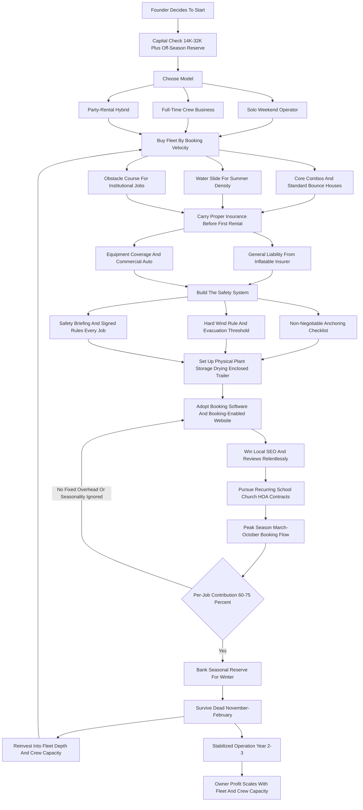
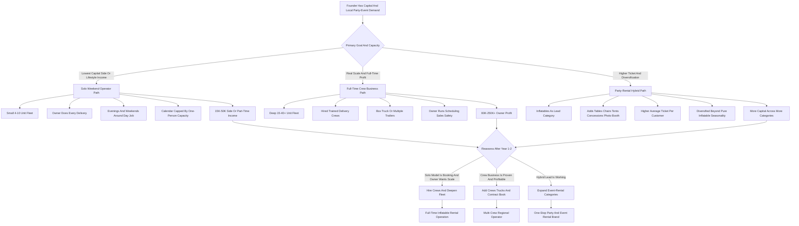

**TL;DR:** To start a bounce house rental business in 2027, you buy commercial-grade inflatables -- bounce houses, combo units with slides, water slides, obstacle courses, and interactive games -- store them in a garage or small warehouse, haul them in a van or trailer, and rent them out for backyard birthday parties, school carnivals, church festivals, HOA events, and corporate family days on a per-day basis. The model is **real, durable, and unusually beginner-friendly compared to most equipment-rental businesses**, but it is brutally seasonal, liability-heavy, and far more physical than the "buy one unit and collect checks" pitch on YouTube and TikTok suggests. The entire business rests on one number most beginners never calculate -- **bookings per unit per season**, the number of times each inflatable rents across a roughly March-to-October window. A commercial bounce house bought for $1,800-$4,500 that rents for $150-$275 per day and books 35-70 times a season grosses **$6,000-$15,000 per unit per year** against per-rental costs (delivery fuel, labor, cleaning, booking-platform fees, wear reserve) of **$45-$95**, leaving a **per-unit contribution of $4,500-$11,000** before fixed overhead. The honest 2027 economics: a credible 4-6 unit launch runs **$14,000-$32,000 all-in** -- inventory, a used cargo trailer or van, general liability insurance, booking software, blowers, dollies, sandbags and stakes, cleaning gear, an LLC, and a real marketing budget. Year-1 realistic owner profit is **$8,000-$28,000 working weekends and evenings**; a focused operator scales to **15-30 units by Year 3** generating **$70,000-$190,000 in owner profit**, then chooses between staying a solo lifestyle operator, hiring delivery crews to go full-time, or rolling inflatables into a broader party-rental brand (tables, chairs, tents, concessions like popcorn and cotton candy machines, photo booths). The two existential risks unique to this business: **(a) one serious injury on an improperly anchored or unsupervised inflatable can produce a lawsuit larger than the entire business is worth -- insurance and ironclad anchoring and operating discipline are non-negotiable**, and **(b) extreme seasonality and weather mean a rained-out spring or a cold April can erase a third of the year's revenue, so the business must be capitalized and priced to survive a bad season**. The operators who win treat this as a **logistics, safety, and reliability business** -- clean equipment, on-time delivery, correct anchoring every single time, and a calendar packed by repeat customers and recurring school, church, and HOA contracts. Net: viable and genuinely accessible in 2027 as a focused, safety-first, weekend operation that can grow into a real full-time business -- a poor fit for anyone unwilling to do physical setup work, carry proper insurance, or weather a seasonal income swing.

## What A Bounce House Rental Business Actually Is In 2027

A bounce house rental business owns a fleet of commercial-grade inflatable amusement equipment and rents that equipment, almost always by the day, to customers throwing parties and events. The customer pays a flat rental fee; you deliver the unit, set it up on grass or pavement, anchor it with stakes or sandbags, run the blower, demonstrate safe operation, leave it for the rental window -- usually four to eight hours -- then return to tear it down, deflate it, roll it, clean it, and haul it away. You never sell the inflatable. You rent the same unit dozens of times across its multi-year life, and the entire business is the math of buying a durable asset once and monetizing it repeatedly until it pays for itself many times over. In 2027 the model sits in a comfortable middle zone. It is far more accessible than most equipment-rental businesses -- a few thousand dollars buys a rentable unit, demand exists everywhere there are children, and the customer-acquisition problem is well understood -- but it is also more demanding than the "passive side hustle" framing that fills social media. It is a real operating business with real physical labor, real liability exposure, real seasonality, and real logistics. The single most important reframe for a 2027 founder: this is a logistics, safety, and reliability business wearing a birthday-party costume. The party belongs to the customer; your business is a trailer, a fleet of folded vinyl, a blower inventory, a calendar, an insurance policy, and an anchoring checklist you execute identically every single time.

## The Equipment Categories: What You Actually Buy And Why

The fleet is the business, and a founder must understand every category before spending a dollar, because the mix you buy in Year 1 sets your booking velocity and your margin for years. **Standard bounce houses** -- the classic open-jump castle, typically 13x13 or 15x15 -- are the entry workhorse: $1,500-$3,000 commercial-grade, the most-requested unit for backyard birthday parties of younger kids, and the easiest to deliver and set up. **Combo units** -- a bounce area plus a slide, basketball hoop, and climbing obstacle in one inflatable -- are the booking-velocity champions: $2,500-$4,500, they out-book a plain bounce house because they entertain a wider age range, and most operators make combos the core of the fleet. **Water slides** -- single and double-lane inflatable slides with a splash pool -- are the summer revenue engine: $2,500-$6,000, they command higher rental prices ($225-$400/day), and they are booked solid June through August, which is exactly when you need revenue density. **Dry slides** -- tall standalone slides without water -- extend the slide demand into spring and fall. **Obstacle courses** -- long inflatable courses, often 40-plus feet -- are the school, church, and corporate-event anchor: $4,000-$10,000, they require more space and labor, but they win the larger institutional jobs that a backyard-only fleet cannot bid. **Interactive games and inflatables** -- jousting, bungee runs, gaga ball pits, inflatable axe throwing, mechanical-style competitive units -- serve the older-kid, teen, school, and corporate market and differentiate you from every operator carrying only castles. **Toddler units** -- smaller, soft, low-wall inflatables -- serve daycares and very young birthday parties. **Concessions and add-ons** -- popcorn machines, cotton candy machines, snow cone machines, tables and chairs, generators for venues without power -- are low-cost, high-margin attach-ons that lift the average ticket without adding a delivery. A founder should think of the fleet as a portfolio: combos and standard bounce houses as the high-velocity core that fills the calendar, water slides as the summer density engine, obstacle courses and interactive games as the institutional anchors that win schools and churches, and concessions as the cheap margin lift on top. The Year-1 mistake is buying five identical castles -- a fleet with no slide for summer, no obstacle course for the school carnival, and no interactive unit for the teen party turns away the bookings that pay the best.

## The Three Models: Solo Weekend Operator, Full-Time Crew Business, And Party-Rental Hybrid

There are three distinct ways to build this business, and choosing deliberately is one of the most consequential early decisions. **The solo weekend operator model** runs a small fleet -- often four to ten units -- delivered by the owner alone or with one helper, on evenings and weekends, alongside a day job or as a lifestyle business. Its advantage is the lowest capital, the lowest overhead, and a genuine path to $15,000-$50,000 in side or part-time income; its challenge is that the owner is the entire delivery capacity, so the calendar is capped by how many setups one person can physically do on a Saturday. **The full-time crew business model** runs a larger fleet -- fifteen to forty-plus units -- with hired delivery crews, a box truck or multiple trailers, and the owner running scheduling, sales, and operations rather than humping vinyl. Its advantage is real scale and $80,000-$250,000-plus in owner profit; its challenge is that it requires the capital for a deep fleet, the management skill to run crews, and enough booking volume to keep paid labor productive across a seasonal calendar. **The party-rental hybrid model** uses inflatables as the lead category and expands into the broader event-rental world -- tables, chairs, tents, linens, concessions, photo booths, soft-play, and games -- becoming the one-stop call for a kid's party or a school event. Its advantage is a higher average ticket, more bookings per customer, and diversification beyond pure inflatables; its challenge is more capital across more categories and a more complex operation. Many successful operators start as solo weekend operators to prove the model and build cash, then choose between scaling into a crew business or broadening into a party-rental hybrid. The wrong move is launching as a full crew business with no booking history, or sprawling into tables and tents before the inflatable core is even turning.

## The 2027 Market Reality: Demand, Competition, And What Changed

A founder needs an accurate read of the 2027 landscape, because this business is neither the recession-proof goldmine some claim nor a saturated dead end. **Demand is structurally healthy and broad.** Children's birthday parties are not discretionary the way many purchases are -- parents will cut other spending before they cancel a kid's party -- and the demand base extends well beyond birthdays into school field days and carnivals, church festivals, HOA and neighborhood events, daycare functions, corporate family days, grand openings, and graduation parties. The customer base regenerates constantly because there is always a new cohort of five-year-olds. **The competition is fragmented and uneven.** Most markets have a handful of established operators with deep fleets and strong reviews, plus a long tail of one-and-two-unit side hustlers, many of them under-insured or uninsured and competing purely on a low price. The opportunity for a disciplined new entrant is to be visibly more professional than the long tail -- properly insured, clean equipment, reliable on-time delivery, real reviews, correct anchoring -- without needing the capital of the regional leader. **What changed by 2027:** customers book and compare online and expect real-time availability, instant quotes, online booking, and digital contracts; reviews on Google and Facebook are now the primary trust signal and effectively gate the business; venues, schools, and parks increasingly require a certificate of insurance before they will allow an inflatable on the property, which quietly pushes uninsured operators out of the best jobs; and software made it far easier for a small operator to run a professional booking and routing operation. The net market reality: demand is real, broad, and durable; the business is more accessible than most but harder than the social-media pitch; and the winning 2027 entrant competes on professionalism, safety, reviews, and reliability rather than on being the cheapest castle in town.

## The Core Unit Economics: Bookings Per Unit Per Season

This is the single most important section in the guide, because the entire business lives or dies on one calculation beginners almost never run. Every inflatable you own has a **bookings per season** number -- how many separate rentals it generates across the roughly March-to-October window -- and that number, multiplied by the rental price, against the purchase cost and per-rental costs, tells you whether the unit is an asset or idle vinyl. Consider the math concretely. A **standard bounce house** costs roughly $1,500-$3,000, rents for $150-$200 per day, and books **30-55 times a season**: at 40 bookings and $175, it grosses $7,000 a year against a $2,200 cost -- it pays for itself in its first season and then earns several times its cost annually for the five-to-eight-year life of commercial vinyl. A **combo unit** costs $2,500-$4,500, rents for $200-$300, and books **40-70 times** -- the highest-velocity asset in the fleet because it serves a wider age range. A **water slide** costs $2,500-$6,000, rents for $225-$400, and books **25-45 times** but concentrated into the high-summer months when you can run a full schedule. An **obstacle course** costs $4,000-$10,000, rents for $300-$600, and books **15-35 times** -- fewer bookings, larger tickets, and it wins the institutional jobs. The discipline this imposes: before buying any unit, estimate its realistic seasonal bookings and rental price, subtract per-rental costs of $45-$95 (fuel, labor, cleaning, platform fees, wear reserve), and compare the seasonal contribution to the cost. High-velocity combos and standard bounce houses should dominate the early fleet because they recover capital fast and fill the calendar. Water slides earn their place by densifying the summer. Obstacle courses and interactive games earn theirs by unlocking the larger institutional tickets. A founder who buys by booking velocity builds a fleet that compounds; a founder who buys the biggest, flashiest unit at the trade show builds a warehouse with one impressive obstacle course and an empty Saturday calendar.

| Equipment Type | Purchase Cost | Day Rate | Bookings/Season | Gross/Unit/Year |
|---|---|---|---|---|
| Standard bounce house (13x13-15x15) | $1,500-$3,000 | $150-$200 | 30-55 | $5,000-$10,000 |
| Combo unit (bounce + slide) | $2,500-$4,500 | $200-$300 | 40-70 | $9,000-$18,000 |
| Water slide (single/double lane) | $2,500-$6,000 | $225-$400 | 25-45 | $7,000-$15,000 |
| Dry slide (standalone) | $2,000-$5,000 | $200-$325 | 20-40 | $5,000-$11,000 |
| Obstacle course (40ft+) | $4,000-$10,000 | $300-$600 | 15-35 | $6,000-$18,000 |
| Interactive game (joust, bungee, gaga) | $1,500-$5,000 | $150-$350 | 15-35 | $3,000-$10,000 |
| Toddler unit | $1,200-$2,500 | $125-$175 | 20-40 | $3,000-$6,500 |
| Concession (popcorn, cotton candy) | $300-$1,200 | $40-$85 | 25-60 attach | $1,500-$4,000 |

## The Line-By-Line Unit Economics And P&L

Beyond booking velocity, a founder must internalize the operating P&L of a single job and of the business, because the per-rental costs and the fixed overhead determine whether revenue becomes profit. Take a representative backyard birthday rental: one combo unit at $250 for a six-hour Saturday window. From that, the costs stack in an order beginners consistently underestimate. **Delivery and setup labor** -- if you pay a helper or value your own time, a typical delivery-plus-pickup is one to two hours of round-trip drive plus 30-60 minutes of setup and the same for teardown, easily $20-$50 of real labor cost per job. **Fuel** -- a loaded van or a vehicle towing a trailer burns real money across a delivery radius, $10-$30 per job depending on distance. **Booking platform and payment processing fees** -- the rental software subscription amortized per job plus 2.9%-plus card processing, $10-$20 on a $250 job. **Cleaning and sanitizing** -- every unit is wiped down and sanitized between rentals, a real consumable and time cost. **Wear and replacement reserve** -- vinyl, seams, blowers, stitching, and stakes wear out, and a disciplined operator reserves 5-10% of revenue against eventual repair and replacement. Net the job out and a healthy bounce house rental operation runs a **60-75% contribution margin per job after these per-rental costs** -- higher than most equipment-rental businesses because the asset is cheap relative to its rental price. But the fixed overhead is the other half of the story: insurance, storage rent, the vehicle, the website and marketing, the LLC and licenses, and the owner's phone and admin time are fixed costs that exist whether or not anyone booked this weekend, and they are spread across the whole season's jobs. At the business level, seasonality dominates the annual P&L: revenue concentrates heavily into roughly March-October, and a disciplined operator treats the peak summer as the period that must fund the entire year, building a reserve that carries fixed costs and the owner through the dead winter. The founders who fail at the P&L level made the same two errors: they treated the high per-job contribution margin as if it were net profit and ignored fixed overhead and seasonality, and they spent the summer cash instead of reserving it for the winter that was always coming.

## Equipment Selection And The Initial Capex Plan

With the booking-velocity discipline established, a founder needs a concrete plan for what to buy first and in what order, because the initial capex is the largest single decision and the easiest to get wrong. The principle is **buy a balanced high-velocity core before breadth.** A disciplined Year-1 fleet for a solo launch prioritizes, in rough order: two to three **combo units** in popular themes and gender-neutral or broadly appealing designs, because combos book the most; one or two **standard bounce houses** to cover the simpler younger-kid parties and to have backup inventory; one **water slide** to capture the summer demand that otherwise walks to a competitor; and one **interactive game or obstacle course** only once the core is funded, to be able to bid school and church events. The capex math: a lean four-unit launch can start around **$10,000-$16,000** in inventory; a fuller six-unit launch with a water slide and an interactive unit runs **$16,000-$28,000**. Sourcing discipline matters enormously. Buy **commercial-grade only** -- from established US manufacturers built for hundreds of rental cycles, never the consumer-grade units sold for backyard home use, which fail fast and are not built or insured for commercial rental. The major sourcing channels are commercial inflatable manufacturers (companies like Magic Jump, Ninja Jump, Cutting Edge Creations, Happy Jump, and similar US makers), industry distributors, and the genuine secondary market -- operators upgrading or exiting often sell good used commercial units at a real discount, a legitimate way to build depth affordably if the vinyl, seams, and blowers are inspected carefully. Buy in themes and styles that your local market actually requests, not the one design that caught your eye at the trade show. The sequencing rule: every additional dollar should go to the unit type with the best booking-velocity-adjusted return until that category is deep enough to serve your typical Saturday, and only then move to the next.

| Startup Line Item | Lean 4-Unit Launch | Fuller 6-Unit Launch |
|---|---|---|
| Inflatable inventory (commercial-grade) | $10,000-$16,000 | $16,000-$28,000 |
| Blowers (one per unit plus spares) | $600-$1,200 | $1,000-$1,800 |
| Vehicle / cargo trailer (used) | $2,500-$8,000 | $4,000-$12,000 |
| General liability insurance (first payment) | $500-$1,500 | $800-$2,000 |
| Booking / rental software (setup + months) | $200-$700 | $300-$1,000 |
| Anchoring gear (stakes, sandbags, dollies) | $400-$900 | $600-$1,400 |
| Cleaning and sanitizing supplies | $150-$400 | $200-$500 |
| Website, logo, photography | $400-$2,000 | $800-$3,000 |
| Initial marketing budget | $500-$2,000 | $1,000-$3,500 |
| LLC, licenses, permits, contracts | $150-$800 | $200-$1,000 |
| Working capital / off-season reserve | $1,500-$5,000 | $3,000-$8,000 |
| **Total all-in** | **~$14,000-$32,000** | **~$28,000-$50,000** |

## Storage, The Vehicle, And The Physical Plant

The bounce house rental business is unusually light on physical infrastructure compared to most equipment-rental businesses, which is a real part of its accessibility -- but a founder still must plan the physical plant deliberately. **Storage** is the first question. A small fleet of four to eight folded inflatables, their blowers, and the anchoring gear genuinely fits in a one-car or two-car garage, which is how most operators start and a meaningful cost advantage over party-rental businesses that need a warehouse from day one. As the fleet grows past ten or fifteen units, the operation graduates to a small self-storage unit, a portion of a warehouse, or a dedicated shop. The non-negotiable storage discipline: inflatables must be **completely dry before they are folded and stored**, because vinyl that is rolled up damp grows mold, which permanently damages a unit and is a health and reputation disaster -- so the physical plant must include space and a way to fully dry units after a water-slide weekend or a rained-on job. **The vehicle** is the other half of the physical plant. A startup typically begins with one of three setups: an enclosed cargo trailer towed behind a truck or SUV (the most common starting choice -- secure, weatherproof, and it keeps the personal vehicle usable), a cargo van, or a box truck for larger fleets. The vehicle must have the cubic capacity to carry a full Saturday's worth of units, blowers, and gear, and it should be enclosed so equipment stays dry and secure. Many operators start with a used trailer to keep capital low and upgrade as volume grows. The infrastructure point: the low physical-plant requirement is one of the genuine reasons this business is more accessible than party rental or most equipment rental -- but the drying discipline and a properly sized enclosed vehicle are not optional, and skipping either creates mold losses or a Saturday where you cannot fit the jobs you booked.

## Delivery, Setup, Anchoring, And Teardown: The Operational Core

This is the operational heart of the business and the place where safety and profitability are both decided, and a founder who does not master it will either get hurt by liability or have revenue without profit. Every job has a logistics arc: load the units, blowers, and anchoring gear in the right sequence, drive to the address, assess the setup surface, lay out and inflate the unit, **anchor it correctly**, demonstrate safe operation to the customer, leave it for the rental window, then return to deflate, clean, roll, reload, and haul away. **Anchoring is the single most important physical skill in the business and the one with genuine life-safety stakes.** On grass, commercial inflatables are anchored with long metal stakes driven through the unit's anchor points; on pavement or indoor surfaces where stakes cannot be used, they are anchored with heavy sandbags or water weights -- and the manufacturer and industry guidance specifies how many anchor points and how much weight each unit requires. The catastrophic failures in this industry -- inflatables lifting or tumbling in wind with children inside -- are almost always anchoring failures or a failure to evacuate the unit when wind picked up. The discipline is an **anchoring checklist executed identically on every single job**, no exceptions, plus a hard wind rule: industry guidance is to evacuate and deflate inflatables when sustained winds reach roughly 15-25 mph (manufacturers specify the exact threshold), and a professional operator monitors weather and instructs the customer to shut the unit down in high wind. **Labor is the cost beginners underestimate** -- setup, drive time, and teardown add up, and a solo operator's Saturday capacity is capped by it. **Scheduling is a routing puzzle** -- birthday parties cluster on Saturdays, the season compresses demand, and a smart operator clusters deliveries geographically and staggers windows. The operators who win treat the operational core as a designed, repeatable system: load sequences, a non-negotiable anchoring checklist, a wind rule, customer safety instructions, and realistic time estimates -- because in this business the logistics is the real work, and the anchoring is the part that, done wrong once, can end the business.

## Safety, Supervision Rules, And The Operating Discipline

Safety in a bounce house rental business is not a compliance afterthought -- it is the core operating discipline that separates a durable business from a lawsuit waiting to happen, and a founder must build it in from day one. The injury data is real: emergency rooms treat tens of thousands of inflatable-related injuries a year, the large majority of them from collisions between children, falls, and improper use rather than equipment failure -- which means the operator's job is both to deliver safe equipment and to set the customer up to supervise it correctly. The operating discipline has several pillars. **Anchoring** -- covered above -- correct on every job, every time. **The wind rule** -- monitor weather, specify the evacuation threshold, and instruct the customer to deflate in high wind. **Capacity and age rules** -- every unit has a manufacturer occupancy limit and an age-appropriateness, and the operator communicates both clearly: no mixing of large and small children, no overcrowding, no flips or roughhousing. **Adult supervision** -- the single most important safety message to deliver to every customer is that an adult must actively supervise the inflatable the entire time it is in use, and a professional operator makes this a written and verbal requirement, not a suggestion. **A safety briefing and signed rules** -- the customer receives clear written safety rules and an operating demonstration at setup, and signs acknowledging them. **Equipment inspection** -- every unit is inspected before and after every rental for seam integrity, blower function, and damage. **Wet-unit rules** -- water slides have their own slip and supervision considerations. **Operator training** -- in some states inflatable rental is a regulated amusement-device activity requiring registration, inspection, or operator training, and a founder must check their specific state's amusement-ride regulations before launching. The throughline: the operators who get sued are usually the ones who anchored carelessly, ignored wind, skipped the safety briefing, or carried no insurance. The operators who build durable businesses treat safety as the product -- they sell reliable, correctly anchored, properly explained equipment, and the safety discipline is the thing that lets them sleep at night and keeps the business insurable.

## Insurance: The Non-Negotiable Foundation

Insurance is not optional in this business and it is not a line a founder can defer -- it is the foundation the entire operation stands on, because the core risk is a child injured on an inflatable and a lawsuit that exceeds the value of everything the founder owns. A 2027 bounce house rental operator needs several coverages. **General liability insurance** is the essential, non-negotiable core -- it covers bodily injury and property damage claims arising from the rented equipment, and a typical inflatable-rental policy carries limits commonly in the $1 million per occurrence range; specialized inflatable and amusement-rental insurers underwrite this category specifically because general small-business insurers often will not. Annual cost commonly runs **$500-$2,500-plus** depending on fleet size, units carried (water slides and obstacle courses can raise premiums), and state. **Inland marine or equipment coverage** protects the inflatables themselves -- the core asset -- against theft, fire, and damage, important because the fleet is the balance sheet. **Commercial auto** covers the delivery vehicle, which a personal auto policy will typically exclude once it is used commercially. **A certificate of insurance (COI)** is also a commercial necessity, not just a protection: schools, churches, parks, municipalities, and many venues require a COI naming them as additional insured before they will allow an inflatable on the property -- which means insurance is simultaneously the thing that protects the business and the thing that unlocks the highest-value institutional jobs. The uninsured side-hustler competing on price is structurally locked out of school carnivals, church festivals, and park events because they cannot produce a COI. The discipline: a founder budgets for proper general liability from before the first rental, works with an insurer that specializes in inflatable and amusement rental, keeps the COI process fast and easy for institutional customers, and never -- not once, not for one job -- puts a unit out uninsured. The math is simple: the premium is a few thousand dollars a year; a single serious-injury lawsuit is a business-ending, possibly life-altering, multi-hundred-thousand-dollar event.

## Booking Software, The Website, And Online Distribution

In 2027 a bounce house rental operation runs on software, and a founder should choose the stack early because customers now expect a digital booking experience and retrofitting one later is painful. **Rental booking software** purpose-built for the party and inflatable rental industry is the central system -- platforms like Inflatable Office, Goodshuffle Pro, Event Rental Systems, and similar tools hold the unit catalog with real-time availability, prevent double-booking, generate quotes and digital contracts with e-signature, take deposits and payments online, manage the delivery calendar and routing, and automate customer reminders. This is the first paid tool a serious operation adopts, because the failure mode it prevents -- double-booking a unit on a Saturday and having to call a customer to cancel a child's party -- is reputationally catastrophic. **The website** is the modern storefront and effectively the entire sales front door: 2027 customers find bounce house rentals through Google, land on the website, and expect to see the units with photos and prices, check availability for their date, and book online in minutes. A website that forces a phone call and a wait loses bookings to the competitor whose site lets the customer book at 9pm on their phone. **Online distribution** for this business is dominated by a few channels: **local SEO and Google Business Profile** -- ranking for "bounce house rental [city]" and having a strong Google profile with reviews is the highest-leverage channel; **reviews** on Google and Facebook, which are the primary trust signal and which a smart operator actively and systematically requests after every job; **social media**, especially Facebook and Instagram, where photos of real setups and local-parent groups drive bookings; and **paid search** for the high-intent "bounce house rental near me" queries. **Repeat and referral business** compounds -- a parent who had a smooth experience books again next year and tells the other parents at the party. The discipline: adopt the booking software early, build a website that lets customers book online, win local SEO and reviews relentlessly, and treat the digital storefront as the system that lets a one-person operation look and run like a professional company.

## Pricing And The Seasonality Engine

Pricing in a bounce house rental business has two layers -- the per-unit rate and the seasonal strategy -- and a founder must get both right because the business earns most of its money in a compressed window. **Per-unit pricing** is anchored to the booking-velocity math: the day rate must, across the unit's seasonal bookings, return its cost plus a margin well above per-rental and wear costs, plus a contribution to fixed overhead. In practice a standard bounce house rents for $150-$200, a combo for $200-$300, a water slide for $225-$400, and an obstacle course for $300-$600, with regional variation -- higher-cost metros support higher rates. **Delivery** is sometimes bundled and sometimes a separate fee for longer distances; **add-ons** -- concessions, tables and chairs, generators, extended hours, overnight rentals, and multi-unit packages -- lift the average ticket meaningfully. The pricing temptation to resist is racing the uninsured side hustler to the bottom: a professional, insured, well-reviewed operator competes on reliability and trust, not on being five dollars cheaper. **The seasonal layer is where the business is won or lost.** In most of the US the season runs roughly March through October, with a hard peak in late spring and summer; water slides concentrate demand into June-August; and the November-February stretch is thin to dead in most climates, carried only by indoor venue rentals, holiday events, and warmer-region operators. The disciplined operator does several things with this: prices the peak season firmly because Saturdays are scarce and demand is dense; builds a cash reserve during the peak that explicitly funds fixed costs -- insurance, storage, the vehicle -- and the owner through the dead winter; pursues indoor and off-season demand where the climate and venues allow; and resists deep discounting in peak season when the calendar, not the price, is the constraint. The founders who misjudge seasonality spend the summer money and cannot cover the winter; the ones who get it right treat the peak as the engine that must be deliberately throttled to fund the whole year.

## Startup Cost Breakdown: The Honest All-In Number

A founder needs a clear-eyed total of what it costs to launch, and the genuinely good news is that a bounce house rental business is one of the more accessible equipment-rental businesses to start -- but "accessible" is not "free," and under-capitalization is still a top killer. The all-in startup cost breaks down as: **inflatable inventory** -- the largest line by far -- $10,000-$28,000 depending on whether the launch is a lean four-unit fleet or a fuller six-unit fleet with a water slide and an interactive unit; **blowers** -- one per unit plus spares, $600-$1,800; **vehicle or cargo trailer** -- usually a used enclosed trailer to start, $2,500-$12,000; **general liability insurance** -- the first payment to a specialized inflatable insurer, $500-$2,000; **booking and rental software** -- setup and first months, $200-$1,000; **anchoring gear** -- stakes, sandbags, water weights, dollies, hand truck, $400-$1,400; **cleaning and sanitizing supplies** -- $150-$500; **website, logo, and photography** -- a professional booking-enabled site and good photos of the units, $400-$3,000; **initial marketing budget** -- local SEO setup, Google Business Profile, initial paid search, $500-$3,500; **business formation, licenses, and contracts** -- LLC, any local business license, any state amusement-device registration, contract templates, $150-$1,000; and a **working capital and off-season reserve** -- the buffer that covers fixed costs through the first winter and the gap before peak-season cash arrives -- $1,500-$8,000. Totaled, a lean focused launch comes in around **$14,000-$32,000**, and a fuller six-unit launch runs **$28,000-$50,000**. This is genuinely lower than starting a party rental, a moving company, or most equipment-rental businesses, and it is part of why the model is real and accessible -- but the founder still needs real cash for the reserve, because the business has a built-in seasonal cash gap, and launching with the fleet but no insurance, no software, and no reserve is how an accessible business still fails in its first winter.

## The Year-One Operating Reality

A founder should walk into Year 1 with accurate expectations, because the gap between the social-media pitch and the real business is where most quitting happens. Year 1 is **fleet-calibration and reputation-building mode, not profit-extraction mode.** The first season is spent learning which units actually book in the local market, discovering the real labor and time cost of delivery and setup, building the Google and Facebook reviews that make the business credible, establishing the local SEO position, and finding out where the operation is fragile -- the rained-out Saturday, the blower that fails, the double-booking the software should have caught, the unit that came back wet and grew mold. A disciplined Year-1 solo operator, launched with a real four-to-six-unit fleet, proper insurance, and a booking-enabled website, can realistically generate **$20,000-$60,000 in revenue**, heavily concentrated in the spring and summer, against **$8,000-$28,000 in owner profit** -- meaningful side or part-time income, but earned through physical weekend work and back-loaded into the peak season. The first winter is the test: a founder who built the summer reserve carries the fixed costs and emerges ready for a stronger Year 2; one who spent the summer cash scrambles. Year 1 is also when the founder discovers whether the fleet mix was right -- five identical castles and no water slide shows up as turned-away summer bookings, and no obstacle course shows up as a school carnival that went to a competitor. The work is genuinely hands-on: the founder is loading the trailer, driving, setting up, anchoring, doing the safety briefing, tearing down, and drying and cleaning units. The founders who succeed treat Year 1 as paid tuition in a real logistics-and-safety business; the ones who fail expected passive income and were unprepared for the weekends, the physical labor, and the seasonality.

## The Multi-Year Trajectory: From Side Hustle To Real Business

Mapping a realistic multi-year arc helps a founder size the opportunity honestly. **Year 1:** a lean four-to-six-unit fleet, the owner doing every delivery, $20K-$60K revenue, $8K-$28K owner profit, the first winter as the survival test, and the season spent calibrating the fleet and building reviews. **Year 2:** the fleet deepens to roughly eight to fifteen units using Year-1 cash flow, the review base and local SEO position start generating reliable inbound bookings, the owner may add a part-time helper for peak Saturdays, and the operation books recurring school, church, and HOA jobs; revenue climbs to roughly **$50K-$130K** with owner profit around **$25K-$70K**. **Year 3:** the operation is a real business -- fifteen to thirty units, a hired delivery crew or two, possibly a box truck, a documented operating system; revenue lands around **$120K-$300K** with owner profit roughly **$70K-$190K**, and the owner is increasingly scheduling and selling rather than humping vinyl on every job. **Years 4-5:** continued fleet expansion, possible expansion into the party-rental hybrid (tables, chairs, tents, concessions, photo booths), multiple crews, and a more managerial owner role; a well-run operation reaches **$250K-$600K-plus in revenue** with **$120K-$300K-plus in owner profit**. These numbers assume disciplined booking-velocity buying, proper insurance, real safety discipline, strong reviews, and a respected seasonal reserve; they do not assume exponential growth, because the business scales with fleet depth, delivery-crew capacity, and the local booking market, not magically. The founder should be honest that this is a business with a real ceiling tied to a geographic market and a season -- but a genuinely good outcome: a tangible, asset-backed small business built from a weekend side hustle.

## Five Named Real-World Operating Scenarios

Concrete scenarios make the model tangible. **Scenario one -- Marcus, the disciplined solo operator:** launches with $19,000 into five units -- three combos, one standard bounce house, one water slide -- proper general liability from day one, a booking-enabled website, and a relentless focus on Google reviews; works evenings and Saturdays around a day job, hits $44,000 revenue in Year 1, reinvests into an obstacle course and two more combos, and by Year 3 is at $165,000 with a part-time crew, having quit the day job. **Scenario two -- the cautionary tale, Brianna:** spends $22,000 but buys five nearly identical themed bounce houses because they were on sale, carries no water slide and no interactive unit, and -- the fatal error -- skips insurance to save the premium; she turns away every summer water-slide booking and every school carnival that demands a COI, and when a child is hurt at a backyard party her uninsured business is exposed to a lawsuit that ends it. **Scenario three -- the Ortega family, full-time crew business:** starts with eight units, deliberately reinvests every dollar of profit into fleet depth and a box truck, hires and trains two delivery crews by Year 2, and by Year 4 runs a 35-unit operation at $420,000 revenue with the owners running scheduling, sales, and safety oversight rather than deliveries. **Scenario four -- Priya, the party-rental hybrid:** runs inflatables as the lead category for two years, then layers in tables, chairs, tents, concessions, and a photo booth, becoming the one-stop call for kids' parties and school events; her average ticket roughly doubles and she diversifies beyond pure inflatable seasonality, reaching $310,000 by Year 5. **Scenario five -- Devon, the seasonality casualty:** builds a solid eight-unit fleet and a good Year-1 summer grossing $58,000, but treats the high per-job margin as net profit, spends the summer cash, enters winter with no reserve and no off-season income, cannot cover insurance and storage and the trailer payment, and sells units at a loss in February -- the canonical illustration of disrespecting the seasonal reserve. These five span the realistic distribution: disciplined solo success, the uninsured wrong-mix failure, the full-time crew scale-up, the hybrid expansion, and the seasonality wipeout.

## Lead Generation: Reviews, Local SEO, And Recurring Institutional Contracts

A bounce house rental business is found, not advertised into existence, and a founder must understand that the lead-generation engine is online discovery and reputation far more than traditional advertising. **Local SEO and Google Business Profile** are the highest-leverage channel: the customer who needs a bounce house searches "bounce house rental near me," and the operator who ranks in the local map pack with a strong profile and many reviews captures that high-intent demand essentially for free. Building that position -- a complete Google Business Profile, a locally optimized website, consistent business listings -- is core early work. **Reviews are the trust currency of this business.** A parent choosing who to trust with their child's party reads reviews, and a business with eighty five-star reviews beats one with six every time -- so the disciplined operator builds review generation into the operating system, requesting a review after every single job. **Social media** -- Facebook and Instagram, and especially local parent and neighborhood groups -- drives meaningful booking volume; photos of real, clean setups at real local parties are the content that converts. **Paid search** captures the high-intent "near me" queries the operator does not yet rank for organically. And then the channel that separates a lifestyle side hustle from a real business: **recurring institutional contracts.** Schools (field days, fall carnivals, fundraisers), churches (festivals, vacation Bible school, community events), HOAs and neighborhood associations (summer kickoffs, block parties), daycares, parks departments, and corporate HR teams (family fun days) all run recurring events -- and an operator who is properly insured, can produce a COI, and delivers reliably can lock in repeating annual jobs that fill the calendar with high-value, predictable bookings the backyard-birthday-only operators cannot reach. The discipline: win local SEO and reviews relentlessly for the birthday-party base, use social and paid search to fill the gaps, and deliberately pursue the recurring school, church, and HOA contracts that turn a seasonal side hustle into a business with a backbone.

## Risk Management Beyond Insurance

Insurance is the foundation, but a 2027 operator manages a wider set of risks deliberately rather than hoping. **Injury and liability risk** -- the existential one -- is managed by the layered system already described: correct anchoring on every job, the hard wind rule, capacity and age rules, the mandatory adult-supervision message, signed safety acknowledgments, equipment inspection before and after every rental, and proper general liability coverage behind all of it. **Weather risk** is structural and severe: a single rained-out Saturday in peak season is lost revenue that does not come back, and a cold or wet spring can erase a meaningful slice of the year. It is managed by a clear weather and cancellation policy in the rental contract (rain-date rescheduling rather than refunds where possible), by capitalizing the business to absorb bad-weather variance, and by carrying dry-weather-flexible units. **Seasonality risk** -- the built-in winter cash gap -- is managed by the disciplined off-season reserve and by pursuing indoor and warmer-season demand. **Equipment risk** -- a blower that fails on a Saturday, a unit with a seam failure, a unit stored wet that grew mold -- is managed by spare blowers, pre- and post-rental inspection, the absolute drying discipline, and a wear-and-replacement reserve. **Double-booking risk** -- the reputational disaster of canceling a child's party -- is managed by disciplined use of the booking software's availability tracking. **Vehicle and breakdown risk** -- the trailer or van is the delivery capacity, and a breakdown on a peak Saturday cancels multiple jobs -- is managed by vehicle maintenance and, at scale, redundancy. **Regulatory risk** -- some states regulate inflatables as amusement devices with registration, inspection, or operator-training requirements -- is managed by checking and complying with the specific state's rules before launch. **Theft and storage risk** -- the fleet is the balance sheet -- is managed by secure storage and equipment coverage. The throughline: every major risk in this business has a known mitigation built from insurance, contracts, operating discipline, and capitalization, and the operators who fail are usually the ones who carried no insurance, anchored carelessly, ignored wind, stored units wet, or spent the seasonal reserve.

## Competitor Landscape: Who You Are Up Against

A founder should understand the competitive field clearly. **The established local operators** -- a handful in most metros with deep fleets, box trucks, crews, hundreds of reviews, and strong local SEO -- set the professional standard; they are hard to out-resource but can be out-hustled on responsiveness and beaten in underserved sub-areas or niches. **The long tail of side hustlers** -- one-and-two-unit operators, many uninsured, competing purely on a low price -- is the largest group and the easiest to out-professionalize: they cannot produce a COI for institutional jobs, their equipment and reliability are inconsistent, and a properly insured, well-reviewed entrant beats them on every dimension except sticker price. **Party-rental and event-rental companies** that carry some inflatables alongside tables and tents compete at the edges, especially for school and corporate events. **Trampoline parks, entertainment centers, and venue-based play** are an indirect substitute for the at-home party, but the convenience and exclusivity of a bounce house in your own backyard remains a distinct, durable preference. The strategic reality for a 2027 entrant: you generally cannot out-capitalize the established local leader or out-cheap the uninsured side hustler, so you win by being the most professional, most reliable, best-reviewed, properly insured operator in the underserved part of the market -- responsive booking, clean and well-maintained equipment, on-time delivery, correct anchoring, real reviews, and the COI that unlocks institutional jobs. The competitive moat is not the inflatables themselves -- anyone with a few thousand dollars can buy a castle -- it is the **review base, the local SEO position, the recurring institutional contracts, the safety record, the reliability reputation, and the operating system**, all of which take seasons to build and are genuinely hard for a new entrant to copy quickly.

## Financing The Business And Bootstrapping

Because a bounce house rental business is relatively low-capital to start, most founders bootstrap it -- and that is often the right call -- but a founder should understand the options that soften the launch and the growth. **Bootstrapping** -- starting lean with four to six units, a used trailer, and personal savings, often while keeping a day job -- is the most common and lowest-risk path, and the business's modest startup cost ($14K-$32K) makes it genuinely achievable without outside financing. **Equipment financing and vendor financing** -- some inflatable manufacturers and equipment lenders will finance the units and the trailer, spreading the cost over time and matching the payment to the earning life of the asset; reasonable for the inventory and vehicle lines, which earn from the first rental. **Reinvested cash flow** funds most healthy growth past Year 1 -- the disciplined peak-season cash buys the next combo and the next water slide, and most operators scale this way rather than through debt. **Used inventory** from exiting or upgrading operators is a form of cheap capital that builds fleet depth affordably, provided the vinyl, seams, and blowers are inspected carefully. **SBA microloans and small-business loans** can fund a larger launch including a box truck and a deeper fleet, more relevant for a founder intentionally launching as a crew business than for a solo weekend start. **Buying an existing business** -- acquiring an established operation with a fleet, reviews, a local SEO position, and recurring contracts already in place -- is a real entry path, sometimes seller-financed, and it skips the slow reputation-building years. The financing discipline: it is reasonable to finance the units and the trailer because they are productive assets, but the founder must still hold real cash for the off-season reserve and the insurance, because no lender covers a thin winter or a rained-out spring -- and the dangerous move is financing a big fleet, skipping the reserve and the insurance, and getting caught by the first bad season or the first claim.

## Taxes And Business Structure

A founder should set up the tax and legal structure deliberately, because the liability profile of this business makes structure unusually important. **Entity:** virtually every serious bounce house rental operator forms an **LLC** -- the liability protection genuinely matters in a business whose core risk is a child-injury lawsuit, and the LLC is the entity that holds the insurance policy, signs the rental contracts, and separates business liability from personal assets. Operating uninsured as a sole proprietor is the worst-case structure and a genuine path to personal financial ruin from one claim. Some larger operations elect S-corp taxation as profit grows. **Depreciation** is a meaningful part of the tax picture -- the inflatables, blowers, and trailer are depreciable business assets, and the depreciation schedule (and any available first-year expensing) materially shapes taxable income, especially in heavy-capex years. **Sales tax** on rentals applies in most jurisdictions and must be collected and remitted correctly -- rental transactions are taxable in ways a founder must get right from day one. **Self-employment tax** applies to the owner's profit, and **estimated quarterly taxes** are the operator's responsibility. **Payroll taxes** apply once delivery crew is hired -- and the employee-versus-contractor classification for delivery help is an area to get right. **Deductible expenses** -- insurance, storage, vehicle and fuel, software, marketing, repairs, and the equipment itself -- are all legitimate business deductions a clean bookkeeping system captures. The discipline: form the LLC before the first rental, separate business banking from day one, run a bookkeeping system that tracks the fleet as assets and the jobs as revenue, stay current on sales tax and estimated taxes, and use an accountant who understands equipment-heavy seasonal businesses. Skipping the structure does not save money -- it converts a manageable compliance function into a year-end scramble and, far worse in this business, leaves personal assets exposed to the lawsuit the whole operation is built to survive.

## Owner Lifestyle: What Running This Business Actually Feels Like

A founder should know what daily life in this business is like before committing, because the lived reality is physical, seasonal, and weekend-bound. In **Year 1**, running a lean solo operation, the founder is genuinely in the business -- loading the trailer Friday night, delivering and setting up across Saturday morning, anchoring units, giving safety briefings, tearing down Saturday evening, and drying and cleaning units on Sunday. It is physical work -- inflatables are heavy and bulky folded, setup is a workout, and the peak-season Saturdays are long. The season is intense and compressed: spring and summer are packed weekends and constant phone calls, while the winter is quiet, spent on maintenance, marketing, planning, and rest. By **Year 2-3**, with a part-time helper or a delivery crew, the owner's role shifts toward scheduling, sales, customer communication, review management, and safety oversight, though the business is never desk-only and the owner is still hands-on in peak season. By **Years 4-5**, with multiple crews and a mature system, the owner can run a larger operation with a more managerial rhythm -- though a bounce house rental business never becomes fully hands-off, because the seasonality, the physical equipment, the weather dependence, and the Saturday concentration are permanent features. The emotional texture: there is real satisfaction in a smoothly run season, a calendar full of repeat customers, a wall of five-star reviews, and the genuine pleasure of a business built around kids having fun; and real stress in the rained-out Saturday, the blower that fails mid-season, the wind that forces an evacuation, and the constant low-grade awareness that one anchoring mistake or one uninsured job could end everything. The income is real and can become substantial, but it is earned through physical, weekend, seasonal work, not extracted passively. A founder who enjoys physical work, the rhythm of a season, logistics, and a customer base of families will find it genuinely rewarding; a founder who wanted a quiet passive asset business will be surprised and exhausted.

## Common Year-One Mistakes That Kill The Business

A founder can avoid most failure modes simply by knowing them in advance, because the mistakes in this business are remarkably consistent. **Operating without proper insurance** -- the single most dangerous mistake, exposing personal assets to a child-injury lawsuit and locking the business out of every institutional job that requires a COI. **Buying consumer-grade instead of commercial-grade units** -- backyard-home inflatables fail fast under rental cycles and are not built or insured for commercial use. **Buying a wrong-mix fleet** -- five identical castles with no water slide for summer and no obstacle course for schools, turning away the best-paying bookings. **Anchoring carelessly or inconsistently** -- the mistake with genuine life-safety stakes, and the one behind the catastrophic wind-related failures. **Ignoring the wind rule** -- failing to monitor weather and evacuate units in high wind. **Storing units wet** -- folding a damp inflatable grows mold, permanently ruining the unit and creating a health and reputation disaster. **Treating per-job margin as net profit** -- ignoring fixed overhead and seasonality and spending money that needed to cover the winter. **Under-reserving for the off-season** -- the classic seasonality wipeout, unable to cover insurance, storage, and the vehicle through a dead winter. **Skipping the booking software** -- running off a paper calendar and double-booking a unit, then canceling a child's party. **No website or a website that cannot take bookings** -- losing the customer who wanted to book at 9pm on their phone. **Neglecting reviews and local SEO** -- staying invisible in the channel where customers actually search. **Racing the uninsured side hustler to the bottom on price** -- competing on the one dimension where the professional operator should not. **Skipping the safety briefing and signed rules** -- leaving the operator exposed when a customer overcrowds a unit or lets it run unsupervised. Every one of these is avoidable; the founders who fail almost always made three or four of them -- and very often the insurance one -- and the founders who succeed treated this list as a pre-launch checklist.

## A Decision Framework: Should You Actually Start This In 2027

A founder deciding whether to commit should run a structured self-assessment, because this model fits a specific person and badly misfits others. **Capital:** do you have $14,000-$32,000 for a lean disciplined launch -- a real commercial fleet, a trailer, proper insurance, software, and an off-season reserve -- or financing plus cash for the reserve and the insurance? If no, this is not your business yet; it is accessible but not free. **Physical temperament:** are you willing to load, haul, set up, anchor, tear down, dry, and clean heavy inflatables on evenings and weekends, on the truck yourself in Year 1? If you want a light-touch business, this is the wrong model. **Seasonality tolerance:** can you operate a business that earns most of its money in a compressed spring-and-summer window and demands the discipline to reserve summer cash for a dead winter? If steady year-round income is a requirement, the seasonality will be painful. **Safety and liability seriousness:** will you anchor correctly every single time, enforce the wind rule, deliver the safety briefing, and -- non-negotiably -- carry proper general liability insurance? If you would cut the insurance corner, you should not start this business. **Reliability and reputation discipline:** will you show up on time every Saturday, keep equipment clean, never double-book, and build reviews relentlessly? Corner-cutters get buried in a review-driven market. **Local market fit:** is there enough party and event demand -- families, schools, churches, HOAs -- in your service radius, and is the professional middle genuinely underserved? If a founder answers yes across capital, physical temperament, seasonality tolerance, safety seriousness, reliability discipline, and local market fit, a bounce house rental business in 2027 is a legitimate and genuinely accessible path -- from a $15,000-$50,000 weekend side hustle to a $70,000-$190,000 full-time business by Year 3. If they answer no on capital or on safety and insurance seriousness, they should not start. If they answer no on physical temperament or seasonality tolerance specifically, a less physical or less seasonal business may fit better. The framework's purpose is to convert the social-media attraction to "passive party income" into an honest, structured decision about the physical, seasonal, safety-critical logistics business underneath.

## Niche And Specialty Paths Worth Considering

Beyond the general model, a founder should understand the specialty paths, because for some operators a focused angle is the better business. **The water-park specialist** goes deep on water slides, slip-n-slides, and water-play units, owning the high-summer demand in a warm-climate market where that season is long. **The school and institutional specialist** builds a fleet of obstacle courses, interactive games, and large-format units, gets the insurance and COI process airtight, and focuses on recurring school field days, carnivals, fundraisers, and corporate family events -- a higher average ticket and more predictable, contract-driven calendar than the backyard-birthday churn. **The toddler and daycare specialist** carries soft-play and small low-wall units and serves daycares, preschools, and very-young-child parties. **The teen and adult interactive specialist** carries jousting, bungee runs, mechanical-style competitive units, and inflatable games, serving the older-kid party, the school event, the church youth group, and the corporate team-building market that the castle-only operators cannot. **The party-rental hybrid** -- discussed as one of the three core models -- treats inflatables as the lead category and expands into tables, chairs, tents, concessions, photo booths, and soft-play, becoming the one-stop event-rental call. **The premium and themed specialist** invests in higher-end, distinctively themed, or licensed-look units and a polished brand, competing on experience rather than price. The strategic point: the general fleet is the most resilient and the most common starting point, but a deliberate niche can deliver a better calendar, higher tickets, or less price competition for a founder with the right focus -- and the mistake is not choosing a niche, it is being mediocre and undifferentiated across everything in a crowded local market.

## Scaling Past The First Season

The jump from a proven solo Year-1 operation to a multi-crew, deep-fleet business is its own distinct challenge, and a founder should approach it deliberately. The prerequisites for scaling: the Year-1 fleet must be genuinely booking (do not scale on top of a wrong-mix fleet), the operating system -- load sequences, the anchoring checklist, the safety briefing, the cleaning and drying routine -- must be documented well enough that a hired crew can execute it identically, the review base and local SEO position must be generating reliable inbound demand, and the cash flow plus reserve must absorb the next capex and the next winter. The scaling levers: **deepen the high-velocity core first** -- more combos, more standard bounce houses, more water slides -- because depth lets you book more units on the same Saturday and stop turning away the peak-day demand; **add institutional-anchor units** -- obstacle courses, interactive games -- to win the recurring school and church contracts; **add delivery-crew capacity** -- hired and trained crews -- in step with booking volume, because a job you cannot deliver is a job you cannot take, and a box truck or additional trailers to carry the volume; **build the recurring-contract book** -- the schools, churches, HOAs, and corporate accounts that fill the calendar with predictable, high-value jobs; **systematize the safety training** so every crew anchors and briefs identically, because scaling the fleet without scaling the safety discipline scales the liability; and **consider the party-rental hybrid expansion** once the inflatable core is solid. The constraints on scaling: capital is the first (solved by reinvested peak-season cash and sensible equipment financing), founder attention is the second (solved by crews and a documented system), delivery-crew and vehicle capacity is the third (solved by adding in step with demand), and storage space is the fourth (solved by graduating from a garage to a storage unit or shop). The founders who scale well share one trait -- they treated Year 1 as a system-building and fleet-calibrating exercise, so that growth was the repetition of a proven, safe, well-reviewed machine rather than a series of expensive experiments.

## Exit Strategies And The Long-Term Picture

Bounce house rental businesses can be exited, and a founder should build with the eventual exit in mind. **Sell the operating business** -- an operation with a deep, well-maintained fleet, a strong review base, a top local SEO position, a book of recurring institutional contracts, a delivery vehicle, documented systems, and a clean safety record is a saleable asset; valuations typically run as a multiple of stabilized earnings, with the multiple driven by the condition of the fleet, the strength of the online reputation, the durability of the recurring contracts, and how owner-dependent the operation is. **Sell the assets** -- even absent a going-concern sale, the commercial inflatables and the trailer have real resale value on the active secondary market, and a fleet can be sold to an operator expanding or entering the market; this is a genuine floor under the business that pure-service businesses lack. **Roll into or sell to a party-rental company** -- an established event-rental business is a natural acquirer of an inflatable fleet, reputation, and contracts. **Transition to family or a key employee** -- the operational, system-driven nature of the business makes an internal transition viable when a trained successor exists. **Wind down gracefully** -- because the assets hold value, an operator can sell the fleet, let the listings lapse, and exit with the proceeds. The honest long-term picture: bounce house rental is a durable, real business -- children's parties and school and community events are not going away, the equipment holds value, and a well-run operation produces real owner profit for years -- but it is a business, not a passive holding; it demands ongoing capital for fleet refurbishment and replacement, ongoing review and SEO work, ongoing safety discipline, and the physical and logistical work of every season. A founder should think of a 2027 launch as building a tangible, asset-backed small business with multiple genuine exit paths -- sale of the going concern, sale of the fleet, acquisition by a party-rental company, internal transition, or graceful wind-down -- which, because the inflatables themselves retain resale value, makes it a more exit-flexible business than many service ventures.

## The 2027-2030 Outlook: Where This Model Is Heading

A founder committing capital should have a view on where the business goes next, and several trends are reasonably clear. **Demand stays structurally healthy** -- children's birthday parties, school field days and carnivals, church and community festivals, and HOA events are durable, recession-resilient categories, and the customer base regenerates with every new cohort of kids; the seasonality persists but the underlying volume is reliable. **Online discovery keeps consolidating** -- local SEO, the Google Business Profile, and reviews keep getting more decisive as the channel where the booking is won, which structurally rewards the professional operator who invests in reputation and punishes the invisible side hustler. **The insurance and COI requirement keeps tightening** -- schools, parks, municipalities, and venues increasingly require certificates of insurance, which steadily pushes uninsured operators out of the best jobs and rewards the properly insured professional. **Safety scrutiny and regulation likely increase** -- continued attention to inflatable injuries and wind-related incidents makes the disciplined, well-anchored, properly insured operator the durable one and raises the risk for the careless. **Booking software keeps professionalizing the small operator** -- real-time availability, online booking, digital contracts, and automated routing keep getting better and more accessible, letting a one-or-two-person operation run like a much larger company. **Customer expectations keep rising** -- clean equipment, on-time delivery, easy online booking, and a polished experience become the baseline, pushing the commodity end toward price competition. **Consolidation continues at the local level** -- well-run operators and party-rental companies absorb the share that under-capitalized, uninsured side hustlers vacate. The net outlook: bounce house rental is **viable and durable through 2030 in its professional, safety-first, well-reviewed, properly insured, reliability-driven form.** The version that thrives is a professional operation that buys commercial-grade by booking velocity, anchors correctly every time, carries real insurance, wins local SEO and reviews, and builds a book of recurring institutional contracts. The version that struggles is the uninsured, wrong-mix, careless-anchoring, price-racing side hustler. A 2027 founder who builds the former is building a real, accessible, asset-backed business with a genuine multi-year runway.

## The Final Framework: Building It Right From Day One

Pulling the entire playbook into a single operating framework: a founder who wants to start a bounce house rental business in 2027 and actually succeed should execute in this order. **First, get honest about capital, temperament, and the season** -- confirm you have $14K-$32K for a lean disciplined launch with a real reserve, that you will do the physical weekend work, and that you can survive a seasonal income swing. **Second, choose your model deliberately** -- solo weekend operator to prove the model and build cash, full-time crew business for real scale, or party-rental hybrid for a higher ticket and diversification; do not launch as a full crew business with no booking history. **Third, buy commercial-grade by booking velocity** -- a balanced high-velocity core of combos and standard bounce houses, a water slide for summer density, and an obstacle course or interactive unit to win institutional jobs; never consumer-grade, never five identical castles. **Fourth, carry proper insurance before the first rental** -- general liability from a specialized inflatable insurer, equipment coverage, commercial auto, and an easy COI process; this is non-negotiable and it both protects the business and unlocks the best jobs. **Fifth, build the safety system** -- a non-negotiable anchoring checklist, a hard wind rule, capacity and age rules, a mandatory adult-supervision message, signed safety acknowledgments, and pre- and post-rental inspection -- executed identically every job. **Sixth, set up the physical plant** -- a way to fully dry units before storage, garage or storage-unit space, and an enclosed trailer or van sized to a full Saturday. **Seventh, adopt the booking software and build a booking-enabled website** so customers can check availability and book online and you never double-book. **Eighth, win local SEO and reviews relentlessly** -- a complete Google Business Profile and a review request after every single job. **Ninth, pursue recurring institutional contracts** -- the schools, churches, HOAs, and corporate accounts that give the seasonal business a backbone. **Tenth, price like a professional** -- firm peak-season pricing, add-ons to lift the ticket, and no racing the uninsured side hustler to the bottom. **Eleventh, respect the seasonal reserve** -- treat the high per-job margin as something that must fund the winter, not as spending money. **Twelfth, keep the exit options open** -- a maintained fleet, a strong review base, recurring contracts, a clean safety record, and documented systems make the business sellable. Do these twelve things in this order and a bounce house rental business in 2027 is a legitimate, genuinely accessible path -- from a weekend side hustle to a real $70K-$190K-plus small business. Skip the discipline -- especially the insurance, the anchoring, and the seasonal reserve -- and an accessible business still becomes a fast way to get hurt, get sued, or run out of cash in January. The business is neither passive party income nor a saturated dead end. It is a real, accessible, physical, seasonal, safety-critical logistics-and-asset business, and in 2027 it rewards exactly one kind of founder: the disciplined, safety-first, reliability-obsessed operator who treats it as the logistics-and-safety business it actually is.

## The Operating Journey: From Equipment Plan To Stabilized Operation

## The Decision Matrix: Solo Operator Vs Crew Business Vs Party-Rental Hybrid

## Sources

1. **U.S. Consumer Product Safety Commission (CPSC) -- Inflatable Amusement Injury Data and Safety Guidance** -- Federal data on bounce house and inflatable-related injuries and safety recommendations. https://www.cpsc.gov
2. **ASTM International -- F2374 Standard Practice for Design, Manufacture, Operation, and Maintenance of Inflatable Amusement Devices** -- The industry safety standard governing inflatable operation, anchoring, and maintenance. https://www.astm.org
3. **Safe Inflatable Operators Training Organization (SIOTO)** -- Industry safety training and certification body for inflatable rental operators. https://sioto.org
4. **American Rental Association (ARA) -- Industry Data and Operating Benchmarks** -- Trade association for the equipment and event rental industry; rental rates and operating benchmarks. https://www.ararental.org
5. **U.S. Small Business Administration -- Business Structures, Licensing, and Microloans** -- Reference for entity selection, licensing, and SBA financing. https://www.sba.gov
6. **IRS -- Depreciation, Section 179, and Self-Employment Tax Guidance** -- Tax treatment of inflatables and vehicles as depreciable assets and owner self-employment obligations. https://www.irs.gov
7. **State Amusement Ride and Device Regulatory Agencies** -- State-level registration, inspection, and operator-training requirements for inflatable amusement devices (varies by state).
8. **Magic Jump Inc. -- Commercial Inflatable Manufacturer** -- US manufacturer of commercial-grade bounce houses, combos, slides, and obstacle courses; product and pricing references. https://www.magicjump.com
9. **Ninja Jump -- Commercial Inflatable Manufacturer** -- US manufacturer of commercial inflatable amusement equipment. https://www.ninjajump.com
10. **Cutting Edge Creations -- Commercial Inflatable Manufacturer** -- Manufacturer of large-format custom inflatables, obstacle courses, and slides.
11. **Happy Jump -- Commercial Inflatable Manufacturer** -- US manufacturer of commercial bounce houses, combos, and water slides.
12. **Inflatable Office -- Party and Inflatable Rental Booking Software** -- Purpose-built rental management, online booking, and routing software for inflatable operators. https://www.inflatableoffice.com
13. **Goodshuffle Pro -- Event Rental Management Software** -- Rental software for inventory, quoting, contracts, and logistics. https://www.goodshuffle.com
14. **Event Rental Systems -- Rental Booking and Website Software** -- Online booking, website, and management platform for party rental businesses. https://www.eventrentalsystems.com
15. **Insureon / Specialty Inflatable and Amusement Rental Insurance Resources** -- General liability, inland marine, and commercial auto coverage references for inflatable rental businesses. https://www.insureon.com
16. **Britton Gallagher / XINSURANCE and Specialty Amusement Insurers** -- Specialized inflatable and amusement-device liability insurance underwriters.
17. **National Association of Amusement Ride Safety Officials (NAARSO)** -- Safety inspection and training standards for amusement devices including inflatables. https://www.naarso.com
18. **Outdoor Amusement Business Association (OABA)** -- Industry association covering amusement-device operation and safety.
19. **Google Business Profile -- Local Search and Reviews Documentation** -- Reference for local SEO and review management central to rental-business lead generation. https://www.google.com/business
20. **U.S. Census Bureau -- Household and Children Population Data** -- Demand-base reference for the children's-party customer market. https://www.census.gov
21. **U.S. Bureau of Labor Statistics -- Amusement and Recreation Industry Data** -- Labor, wage, and industry-segment context for the recreation sector. https://www.bls.gov
22. **IBISWorld -- Party and Event Rental Industry Reports** -- Industry revenue, growth, and competitive-structure data for the party rental category. https://www.ibisworld.com
23. **NFIB -- Small Business Operating and Seasonality Resources** -- Small-business operating, cash-flow, and seasonality-management context. https://www.nfib.com
24. **SCORE -- Small Business Mentoring and Planning Resources** -- Business planning, cash-flow, and seasonality-management guidance. https://www.score.org
25. **Cargo Trailer and Commercial Vehicle Buyer Guides** -- Enclosed trailer, cargo van, and box truck specification and capacity references for rental delivery.
26. **Commercial Blower Manufacturers (B-Air, XPOWER, and similar)** -- Blower specification, sizing, and pricing references for inflatable operation.
27. **State and Local Sales Tax Authorities -- Rental Transaction Taxability** -- Reference for sales tax collection and remittance on rental transactions.
28. **U.S. Department of Labor -- Employee vs Independent Contractor Classification Guidance** -- Reference for classifying delivery crew labor. https://www.dol.gov
29. **BizBuySell -- Business Valuation and Sale Listings (Party and Inflatable Rental)** -- Reference for going-concern valuations and exit multiples in the rental category. https://www.bizbuysell.com
30. **Inflatable Rental Operator Forums and Industry Communities** -- Practitioner discussion of booking velocity, fleet mix, anchoring, insurance, and seasonality.
31. **National Weather Service -- Wind Advisory and Severe Weather Resources** -- Reference for the wind monitoring and evacuation discipline central to inflatable safety. https://www.weather.gov
32. **Manufacturer Operating Manuals -- Anchoring, Occupancy, and Wind Specifications** -- Unit-specific anchor-point counts, weight requirements, occupancy limits, and wind thresholds.
33. **Used Inflatable Equipment Marketplaces and Liquidation Listings** -- Sourcing references for commercial used inflatables from exiting and upgrading operators.
34. **School, Church, and Municipal Event Procurement and COI Requirements** -- Reference for the certificate-of-insurance requirements that gate institutional jobs.
35. **CPSC -- Anchoring and Wind Safety Alerts for Inflatables** -- Federal safety alerts specifically addressing inflatable anchoring failures and wind-related incidents. https://www.cpsc.gov

## Numbers

**Booking Velocity Per Unit Per Season (The Core Metric)**

| Equipment Type | Purchase Cost | Day Rate | Bookings/Season | Per-Rental Cost | Gross/Unit/Year |
|---|---|---|---|---|---|
| Standard bounce house | $1,500-$3,000 | $150-$200 | 30-55 | $45-$80 | $5,000-$10,000 |
| Combo unit (bounce + slide) | $2,500-$4,500 | $200-$300 | 40-70 | $50-$90 | $9,000-$18,000 |
| Water slide | $2,500-$6,000 | $225-$400 | 25-45 | $60-$95 | $7,000-$15,000 |
| Dry slide | $2,000-$5,000 | $200-$325 | 20-40 | $50-$85 | $5,000-$11,000 |
| Obstacle course (40ft+) | $4,000-$10,000 | $300-$600 | 15-35 | $70-$110 | $6,000-$18,000 |
| Interactive game | $1,500-$5,000 | $150-$350 | 15-35 | $45-$85 | $3,000-$10,000 |
| Toddler unit | $1,200-$2,500 | $125-$175 | 20-40 | $40-$70 | $3,000-$6,500 |

**Per-Job Economics (Representative Combo Rental)**
- Day rate (combo, 6-hour Saturday window): ~$250
- Delivery and setup labor: $20-$50
- Fuel: $10-$30
- Booking platform + payment processing: $10-$20
- Cleaning, sanitizing, wear reserve: $15-$35
- Contribution margin per job after per-rental costs: 60-75%

**Startup Cost Breakdown**

| Line Item | Lean 4-Unit Launch | Fuller 6-Unit Launch |
|---|---|---|
| Inflatable inventory (commercial-grade) | $10,000-$16,000 | $16,000-$28,000 |
| Blowers (one per unit plus spares) | $600-$1,200 | $1,000-$1,800 |
| Vehicle / used cargo trailer | $2,500-$8,000 | $4,000-$12,000 |
| General liability insurance (first payment) | $500-$1,500 | $800-$2,000 |
| Booking / rental software | $200-$700 | $300-$1,000 |
| Anchoring gear (stakes, sandbags, dollies) | $400-$900 | $600-$1,400 |
| Cleaning and sanitizing supplies | $150-$400 | $200-$500 |
| Website, logo, photography | $400-$2,000 | $800-$3,000 |
| Initial marketing budget | $500-$2,000 | $1,000-$3,500 |
| LLC, licenses, permits, contracts | $150-$800 | $200-$1,000 |
| Working capital / off-season reserve | $1,500-$5,000 | $3,000-$8,000 |
| **Total all-in** | **~$14,000-$32,000** | **~$28,000-$50,000** |

**Multi-Year Revenue Trajectory (Owner Profit)**

| Year | Fleet Size | Revenue | Owner Profit | Notes |
|---|---|---|---|---|
| Year 1 | 4-6 units | $20,000-$60,000 | $8,000-$28,000 | Solo, peak-season concentrated, first winter is the test |
| Year 2 | 8-15 units | $50,000-$130,000 | $25,000-$70,000 | Part-time helper, recurring institutional jobs begin |
| Year 3 | 15-30 units | $120,000-$300,000 | $70,000-$190,000 | Hired crew, owner scheduling and selling |
| Years 4-5 | 30-40+ units | $250,000-$600,000+ | $120,000-$300,000+ | Multiple crews, possible party-rental hybrid |

**Seasonality**
- Peak revenue window: roughly March-October (spring and summer parties, school and church events)
- Water-slide demand concentrated June-August
- Thin to dead window: November-February in most US climates (indoor venues, holiday events, warm regions only)
- Majority of annual revenue concentrated in spring and summer
- Seasonal reserve must cover fixed costs (insurance, storage, vehicle) through the trough

**Operational and Safety Benchmarks**
- Per-job contribution margin (after per-rental costs): 60-75%
- Wear and replacement reserve: 5-10% of revenue
- Commercial inflatable service life: roughly 5-8 years with proper care
- Wind evacuation threshold: roughly 15-25 mph sustained (manufacturer-specified per unit)
- Anchoring: stakes on grass, sandbags or water weights on hard surfaces, per manufacturer anchor-point count
- General liability coverage: commonly $1M per occurrence; annual premium roughly $500-$2,500+
- Tens of thousands of US emergency-room visits per year are inflatable-related (CPSC) -- mostly collisions, falls, and improper use

**Fleet Mix Discipline**
- High-velocity core (combos, standard bounce houses): bought to depth FIRST
- Summer-density engine (water slides): added to capture June-August demand
- Institutional anchors (obstacle courses, interactive games): added to win school/church/corporate jobs
- Concessions (popcorn, cotton candy, snow cone): cheap, high-margin attach-ons that lift the ticket
- Commercial-grade only -- never consumer/backyard-home units

**Exit**
- Going-concern sale: multiple of stabilized earnings, driven by fleet condition, online reputation, recurring contracts, owner-dependence, safety record
- Asset sale: commercial inflatables and trailer retain real resale value on an active secondary market
- Other paths: sale to a party-rental company, internal transition, graceful wind-down

## Counter-Case: Why Starting A Bounce House Rental Business In 2027 Might Be A Mistake

The case above describes a viable, genuinely accessible business, but a serious founder must stress-test it against the conditions that make this model a bad bet. There are real reasons to walk away.

**Counter 1 -- The liability exposure can end you personally.** The core risk of this business is a child seriously injured on an inflatable and a lawsuit that exceeds the value of everything you own. The operator who skips insurance to save the premium, or who anchors carelessly, or who fails to evacuate in wind, is one bad afternoon away from a business-ending and possibly life-altering financial event. No other accessible side hustle carries this specific tail risk, and a founder who is not prepared to be rigorous about insurance and safety should not be in this business at all.

**Counter 2 -- It is far more physical than the pitch admits.** The social-media framing is "buy a unit, collect checks." The reality is loading heavy folded vinyl, towing a trailer, setting up and anchoring in the heat, giving safety briefings, tearing down, and drying and cleaning units -- on evenings and weekends, on your own body, in Year 1. Anyone imagining passive income has misunderstood the model; it is a physical logistics business.

**Counter 3 -- The seasonality is brutal and weather-exposed.** The business earns the large majority of its money in roughly March-October and then faces a thin-to-dead November-February while insurance, storage, and the vehicle keep costing money. Worse, the peak itself is weather-exposed: a rained-out Saturday is revenue that never comes back, and a cold or wet spring can erase a third of the year. A founder who needs steady income, or who cannot capitalize the business to absorb a bad season, will struggle.

**Counter 4 -- The market is crowded with price-cutting side hustlers.** Most metros have a long tail of one-and-two-unit operators, many uninsured, competing purely on a low price. A new entrant who tries to win on price joins a race to the bottom against people with almost no overhead. Winning requires being visibly more professional -- insured, well-reviewed, reliable -- which takes seasons to establish, during which the price competition is real.

**Counter 5 -- The wrong fleet mix quietly caps the business.** Five identical bounce houses feels like a fleet, but with no water slide the operator turns away the entire summer demand peak, and with no obstacle course or interactive unit the operator cannot bid the school carnival or the corporate event. The mistake is invisible until the booking calendar shows the holes, and by then the capital is committed.

**Counter 6 -- Storage and equipment care are unforgiving.** An inflatable folded away damp grows mold and is permanently ruined -- a real, common, expensive failure mode. Blowers fail, seams go, stakes bend. The operator who does not have a disciplined drying and inspection routine loses units, and a unit lost is capital lost and bookings turned away.

**Counter 7 -- Regulation varies and can surprise you.** Some states regulate inflatables as amusement devices with registration, inspection, or operator-training requirements; some venues and municipalities have their own rules. A founder who launches without checking their specific state's amusement-device regulations can find the business non-compliant from day one.

**Counter 8 -- The income has a real ceiling tied to a market and a season.** A solo operator's calendar is capped by how many setups one person can do on a Saturday in a compressed season. Scaling past that requires hiring and managing crews, deeper capital, and more booking volume than a smaller market may support. This is a good small business, not an uncapped one, and a founder expecting unlimited scale will be disappointed.

**Counter 9 -- Reviews can be brutal and a few bad ones hurt.** The business is gated by online reputation. A double-booked party, a late delivery, a dirty unit, or one unhappy parent can produce a review that costs real bookings -- and the operator is one bad Saturday from a reputation dent in a channel where customers are actively comparing.

**Counter 10 -- The customer base is price-sensitive and one-time-skewed.** Many customers book once a year for one birthday and shop hard on price. Building the repeat-and-referral base and the recurring institutional contracts that give the business a backbone takes time, and until then the operator is constantly re-acquiring price-sensitive one-time customers.

**Counter 11 -- The vehicle is a single point of failure.** The trailer or van is the entire delivery capacity. A breakdown on a peak Saturday cancels multiple jobs, damages reviews, and refunds revenue. Until the operation has redundancy, one mechanical failure is a bad weekend.

**Counter 12 -- Adjacent businesses may fit better.** A founder drawn to the events world but not to the liability, the physical labor, or the seasonality might be better suited to a less risk-exposed event business. Bounce house rental specifically rewards the safety-rigorous, physically willing, seasonally tolerant operator; for the founder who wants the events world without those three things, this is the wrong expression of that interest.

**The honest verdict.** Starting a bounce house rental business in 2027 is a reasonable choice for a founder who: (a) has $14K-$32K of genuine launch capital plus a real off-season reserve, (b) will carry proper general liability insurance and treat safety and anchoring as non-negotiable, (c) will do the physical, weekend, seasonal work, (d) will buy commercial-grade equipment by booking velocity rather than by what looks impressive, (e) will win reviews and local SEO and pursue recurring institutional contracts, and (f) can capitalize and price the business to survive a rained-out spring. It is a poor choice for anyone who would cut the insurance corner, anyone who wants passive income, anyone who cannot stomach the seasonality and weather exposure, and anyone whose interest in events would be better served by a less liability-exposed business. The model is genuinely accessible -- one of the more achievable equipment-rental businesses to start -- but accessible is not safe or easy, and in 2027 the gap between the disciplined, insured, safety-first version that works and the uninsured, careless, wrong-mix version that fails or gets sued is wide.

## Related Pulse Library Entries

- **q1965** -- How do you start a party rental business in 2027? (The broader event-rental model; the natural expansion path for the party-rental hybrid.)
- **q1967** -- How do you start a catering business in 2027? (The event-vendor referral-web partner who works the same parties.)
- **q1968** -- How do you start a florist business in 2027? (Event-vendor referral-web partner.)
- **q1969** -- How do you start a DJ business in 2027? (Event-vendor referral-web partner serving the same kids' parties and events.)
- **q1970** -- How do you start a photo booth business in 2027? (Adjacent lighter-capital event-rental category; a natural hybrid add-on.)
- **q1958b** -- How do you start a junk removal business in 2027? (Truck-and-trailer logistics business with similar physical operating bones.)
- **q1959b** -- How do you start a moving company in 2027? (Closest logistics-and-labor cousin; crew, vehicles, and physical operations.)
- **q1959** -- How do you start a handyman business in 2027? (Skills-and-logistics adjacency; truck-and-tools operating model.)
- **q1960** -- How do you start a real estate photography business in 2027? (The visual-catalog photography a rental fleet website needs.)
- **q1961** -- How do you start a pressure washing business in 2027? (Equipment-based, seasonal, local-SEO-driven service business with parallel economics.)
- **q1962** -- How do you start a lawn care business in 2027? (Seasonal, route-based, equipment-and-vehicle local service business.)
- **q1963** -- How do you start a mobile car wash business in 2027? (Mobile, equipment-based, local-demand service model.)
- **q1964** -- How do you start a vending machine business in 2027? (Asset-utilization business with its own per-unit booking-velocity-style economics.)
- **q1946** -- How do you start an ATM business in 2027? (Per-unit asset economics and placement parallels.)
- **q1947** -- How do you start a laundromat business in 2027? (Equipment-heavy local business; depreciation and utilization parallels.)
- **q1949** -- How do you start a self-storage business in 2027? (Local asset-based business; storage and capital-utilization parallels.)
- **q1971** -- How do you start an event venue business in 2027? (A venue relationship and a potential recurring institutional customer.)
- **q1972** -- How do you start a children's entertainment business in 2027? (Closest demographic cousin; same kids'-party customer base.)
- **q1973** -- How do you start a face painting business in 2027? (Lighter-capital kids'-party vendor; referral-web partner.)
- **q1974** -- How do you start a petting zoo business in 2027? (Adjacent kids'-event attraction with overlapping seasonality and liability themes.)
- **q9501** -- How do you start a bookkeeping business in 2027? (The bookkeeping and depreciation tracking every rental operator must build or buy.)
- **q9502** -- How do you scale a workshop-led business past the single-operator ceiling? (The scaling-past-solo logic that applies to going from solo operator to crew business.)
- **q9601** -- How do you start a fractional CFO business in 2027? (Financial discipline for managing seasonality and capex.)
- **q9701** -- What is the best inventory and rental management software in 2027? (Deep dive on the booking-software stack central to a rental operation.)
- **q9801** -- What is the future of the events industry in 2030? (Long-term outlook context for demand, expectations, and the events economy.)

