### Direct Answer

**To start a bookkeeping firm in 2027, you (1) decide which of three operating models fits your skill + capital + market — solo virtual bookkeeper serving 20-60 small business clients at $300-$1,200/mo each ($5K-$25K startup all-in, working from home with [QuickBooks Online Accountant](https://quickbooks.intuit.com/accountants/) + [Karbon](https://karbon.com/) + [TaxDome](https://www.taxdome.com/)), Client Accounting Services (CAS) firm offering full-stack bookkeeping + bill-pay + payroll + cash-flow advisory + fractional CFO to 30-120 small + mid-sized clients at $800-$8,000/mo each ($20K-$75K startup with 1-4 team members), or vertical-niche bookkeeping practice specializing in real estate / e-commerce / restaurants / dental / agencies / SaaS / construction / law firms / nonprofit ($15K-$50K startup), (2) clear the credentialing + licensing stack — no state license required to do bookkeeping in 47 states (anyone can hang a "bookkeeper" shingle), but most successful 2027 operators carry [AIPB Certified Bookkeeper (CB)](https://www.aipb.org/) or [NACPB Certified Public Bookkeeper (CPB)](https://www.nacpb.org/) credential ($400-$700 exam fees + 2-year experience requirement) to signal trust + command premium pricing, with [IRS Preparer Tax Identification Number (PTIN)](https://www.irs.gov/tax-professionals/ptin-requirements-for-tax-return-preparers) ($19.75 annual fee) mandatory if you sign any tax returns, and [Enrolled Agent (EA) credential via IRS Special Enrollment Exam](https://www.irs.gov/tax-professionals/enrolled-agents/become-an-enrolled-agent) ($259 per exam part x 3 parts + $140 PTIN renewal) recommended if you plan to do tax-resolution + IRS representation work, plus [QuickBooks ProAdvisor certification](https://quickbooks.intuit.com/accountants/proadvisor/) (free, online), [Xero Advisor Certified](https://www.xero.com/us/partner-programs/partners/) (free), [Sage Intacct Implementation Specialist](https://www.sage.com/en-us/sage-business-cloud/intacct/partners/) (paid course), and state-specific requirements only in 3 outlier states — **Connecticut, Maryland, and Oregon require registration or licensure to use the title "tax preparer" or operate a public-facing accounting practice**, and California requires [California Tax Education Council (CTEC) registration](https://www.ctec.org/) ($33 annual fee + 60-hr education) for paid tax preparers, (3) build the technology + workflow stack — general-ledger platform ([QuickBooks Online (QBO) Plus or Advanced](https://quickbooks.intuit.com/), [Xero (NYSE:XRO listed Sydney/ASX:XRO)](https://www.xero.com/), [Sage Intacct (Sage Group LON:SGE)](https://www.sage.com/en-us/sage-business-cloud/intacct/), [NetSuite (Oracle NYSE:ORCL)](https://www.netsuite.com/) for $5M-$50M clients, [Wave](https://www.waveapps.com/) free-tier for micro-businesses, [FreshBooks](https://www.freshbooks.com/) for service-business sole-props, [Zoho Books (Zoho Corp private)](https://www.zoho.com/books/)), practice management ([Karbon](https://karbon.com/) $59-$89/user/mo, [TaxDome](https://www.taxdome.com/) $50-$80/user/mo, [Canopy](https://www.getcanopy.com/) $45-$75/user/mo, [Financial Cents](https://financial-cents.com/) $39-$59/user/mo, [Jetpack Workflow](https://jetpackworkflow.com/) $30-$45/user/mo, [Liscio](https://www.liscio.me/) client communication + document portal), AP / spend management ([Bill.com (NYSE:BILL)](https://www.bill.com/), [Ramp](https://ramp.com/), [Brex](https://www.brex.com/), [Mercury](https://mercury.com/), [Relay Financial](https://relayfi.com/), [Divvy (now Bill Spend & Expense)](https://www.bill.com/product/spend-and-expense)), payroll ([Gusto](https://gusto.com/), [Rippling](https://www.rippling.com/), [ADP RUN (NASDAQ:ADP)](https://www.adp.com/), [Paychex (NASDAQ:PAYX)](https://www.paychex.com/), [OnPay](https://onpay.com/), [QuickBooks Online Payroll](https://quickbooks.intuit.com/payroll/)), sales tax compliance ([Avalara (NYSE:AVLR taken private 2022 by Vista Equity Partners)](https://www.avalara.com/), [TaxJar (Stripe acquisition 2021)](https://www.taxjar.com/), [Sovos](https://sovos.com/), [Anrok](https://www.anrok.com/) for SaaS), advisory / FP&A ([Fathom](https://www.fathomhq.com/), [Jirav](https://www.jirav.com/), [LiveFlow](https://liveflow.com/), [Reach Reporting](https://www.reachreporting.com/), [Spotlight Reporting](https://www.spotlightreporting.com/), [Mosaic](https://www.mosaic.tech/), [Cube](https://www.cube.dev/)), AI-automation layer ([Vic.ai (Series C $52M, Costanoa + GGV)](https://www.vic.ai/), [Trullion (Series B $35M)](https://trullion.com/), [Booke AI](https://www.booke.ai/), [Truewind (YC W23)](https://www.truewind.ai/), [Digits](https://digits.com/), [Keeper](https://keeper.app/), [Uncat](https://www.uncat.com/)), document collection ([Hubdoc (Xero acquired 2018)](https://www.hubdoc.com/), [Dext (formerly Receipt Bank)](https://dext.com/), [AutoEntry (Sage)](https://www.autoentry.com/)), and CPA-firm-grade security ([1Password Business](https://1password.com/business/), [LastPass](https://www.lastpass.com/), [Drata SOC 2 monitoring](https://drata.com/) for firms growing past $1M ARR, [Vanta](https://www.vanta.com/) for SOC 2 prep, [TitanFile](https://www.titanfile.com/) or [SmartVault](https://www.smartvault.com/) for encrypted client portals replacing email attachments), and (4) build the customer-acquisition engine — niche-vertical content marketing (the #1 growth lever for 2027 — "bookkeeper for [niche]" Google search positioning beats "bookkeeper in [city]" by 5-15x conversion rate per [HubSpot State of Marketing 2024](https://www.hubspot.com/state-of-marketing) + practitioner reporting), strategic partnerships with CPA firms ([AICPA](https://www.aicpa-cima.com/) + [State CPA Society directories](https://www.aicpa-cima.com/cpe-learning/state-cpa-societies)) handing off bookkeeping work to focus on tax + audit, [BNI](https://www.bni.com/) + [LeTip](https://www.letip.com/) + chamber of commerce + local SBDC referrals, **fractional CFO + advisory upsell as the moat** (per [CPA.com Client Accounting Services Benchmark Survey 2024](https://www.cpa.com/) the average CAS engagement is **$2,500-$8,000/mo** with 40-65% gross margins, vs $300-$600/mo for compliance-only bookkeeping at 55-70% margins), and outsourced-offshore staffing model — many 2027 US-based firms use **[QXAS (QX Global Group)](https://qxaccounting.com/)**, **[Entigrity](https://entigrity.com/)**, **[Boldly](https://boldly.com/)**, **[Belay](https://belaysolutions.com/)**, **[RemoteCFO](https://remotecfo.com/)**, **[Outsourced Philippines](https://outsource-philippines.com/)**, **[Toptal Finance](https://www.toptal.com/finance)** for $8-$25/hr offshore bookkeeping labor while the US-based owner does advisory + client management at $150-$400/hr — and (5) build around the **dominant 2027 structural shift** — the convergence of (a) **AI-automation of transaction categorization** (per [Karbon AI Accounting Trends Survey 2024](https://karbon.com/) and [Intuit AI announcements 2024](https://www.intuit.com/) tools like [QuickBooks Live Assist](https://quickbooks.intuit.com/live/), [Vic.ai](https://www.vic.ai/), [Booke AI](https://www.booke.ai/), [Truewind](https://www.truewind.ai/), [Digits](https://digits.com/) reduce data-entry labor by **50-85%**), (b) the **massive CPA-firm partner-shortage** (per [AICPA Trends Report 2023](https://www.aicpa-cima.com/) US accounting graduates fell **17% from 2016-2022**, CPA Exam candidates fell **33%**, and **75% of CPAs are eligible to retire in the next 5 years**) driving CPA firms to outsource compliance bookkeeping to specialist firms, (c) the [PE-backed accounting firm roll-up wave](https://www.accountingtoday.com/) led by **[Aprio (Charlesbank + Warburg Pincus)](https://www.aprio.com/)**, **[BDO USA (Apollo + PE recap 2023)](https://www.bdo.com/)**, **[CBIZ (NYSE:CBZ acquired Marcum 2024 for $2.3B)](https://www.cbiz.com/)**, **[Citrin Cooperman (New Mountain Capital)](https://www.citrincooperman.com/)**, **[Springline Advisory (PE-backed)](https://www.springlineadvisory.com/)**, **[Ascend Partners (PE-backed)](https://www.ascend.io/)**, **[Whitman-Smith-Reed (PE roll-up vehicle)](https://www.whitmansmithreed.com/)**, **[Avantax (acquired Cetera 2023)](https://www.avantax.com/)**, **[GHJ (Charlesbank)](https://www.ghjadvisors.com/)**, and (d) the post-pandemic **virtual-firm normalization** (per [Going Concern surveys](https://goingconcern.com/) + [Karbon Future of Professional Services 2024](https://karbon.com/) 70%+ of new accounting practices are remote-first, eliminating the office overhead that constrained 1990-2015 firm economics) — means the 2027 bookkeeping firm that wins is the one that (a) picks a **vertical niche** instead of generic "all small business," (b) layers **CAS advisory + fractional CFO** on top of compliance bookkeeping, (c) uses **AI + offshore staffing** to keep delivery cost low while charging US-firm prices, and (d) builds a **subscription-recurring-revenue model** instead of hourly billing. Year-1 solo virtual bookkeeper handles 15-40 clients at $400-$900/mo = $6K-$36K/mo = **$72K-$430K Year-1 revenue with $50K-$280K owner take-home** at 70-85% gross margin; Year-1 CAS firm with 1-2 staff handles 25-60 clients at $1,500-$5,000/mo = **$450K-$3.6M Year-1 revenue with $150K-$900K owner take-home** at 45-65% gross margin; Year 5 with 50-200 clients + active CFO advisory book reaches **$1.5M-$8M revenue and $400K-$2.5M owner profit** at 18-32% EBITDA — and the firms PE consolidators pay **6-12x EBITDA** for in 2027 are those with (i) **75%+ recurring revenue**, (ii) **vertical niche specialization**, (iii) **CAS / advisory mix above 40% of revenue**, (iv) **no single client over 10% of book**, and (v) **owner not the sole rainmaker**. Industry reference: [AICPA (American Institute of CPAs)](https://www.aicpa-cima.com/), [NACPB (National Association of Certified Public Bookkeepers)](https://www.nacpb.org/), [AIPB (American Institute of Professional Bookkeepers)](https://www.aipb.org/), [CPA.com](https://www.cpa.com/), [CPA Practice Advisor](https://www.cpapracticeadvisor.com/), [Accounting Today](https://www.accountingtoday.com/), [Karbon](https://karbon.com/), [TaxDome](https://www.taxdome.com/), [Intuit (NASDAQ:INTU)](https://www.intuit.com/), [Xero](https://www.xero.com/), [Sage Group (LON:SGE)](https://www.sage.com/), [Bill.com (NYSE:BILL)](https://www.bill.com/), [Pilot (Sequoia + Index)](https://pilot.com/), [Bench (acquired by Employer.com 2024 after collapse)](https://www.bench.co/), [Botkeeper (Series C)](https://www.botkeeper.com/), [Aprio](https://www.aprio.com/), [BDO USA](https://www.bdo.com/), [CBIZ (NYSE:CBZ)](https://www.cbiz.com/), [Live Oak Bank (NASDAQ:LOB) — leading SBA 7(a) lender for accounting practices](https://www.liveoakbank.com/). The three things that kill new bookkeeping firms: (a) building a **generalist all-small-business** practice without a niche — gets stuck at $200K-$500K revenue ceiling because client acquisition cost is unsustainable, (b) refusing to **fire bad clients** — high-touch, low-paying, scope-creep clients (typically the cheapest 25% of book) consume 60%+ of capacity and burn out the owner, and (c) **hourly billing** instead of monthly subscription — destroys client trust + caps revenue at owner-hours + creates payment-collection drama; the firms that scale price by **value + complexity tier** (Bronze $400/mo + Silver $1,500/mo + Gold $4,000/mo) with fixed monthly invoicing.**

The bookkeeping firm in 2027 is a **technology-leveraged professional services business** in the middle of the most consequential disruption since the 1981 introduction of personal-computer accounting software. The **convergence of AI-automation reducing data-entry labor 50-85% per [Karbon AI Accounting Trends 2024](https://karbon.com/) and [Intuit AI announcements](https://www.intuit.com/), the CPA-pipeline shortage (per [AICPA Trends Report 2023](https://www.aicpa-cima.com/) US accounting graduates down 17% from 2016-2022, CPA exam candidates down 33%, and 75% of practicing CPAs eligible to retire within 5 years), the [PE-backed accounting firm roll-up wave](https://www.accountingtoday.com/) led by [Aprio (Charlesbank)](https://www.aprio.com/), [Citrin Cooperman (New Mountain Capital)](https://www.citrincooperman.com/), [CBIZ-Marcum (NYSE:CBZ) $2.3B 2024 merger](https://www.cbiz.com/), [BDO USA Apollo recap 2023](https://www.bdo.com/), [Springline Advisory](https://www.springlineadvisory.com/), [Ascend Partners](https://www.ascend.io/), and [Whitman-Smith-Reed](https://www.whitmansmithreed.com/), the high-profile collapse of [Bench (acquired by Employer.com out of insolvency December 2024)](https://www.bench.co/) reshaping the venture-backed bookkeeping-platform thesis, the [2024 Beneficial Ownership Information (BOI) reporting requirements under the Corporate Transparency Act](https://www.fincen.gov/boi) (temporarily enjoined as of late 2024 but still creating client demand), the post-pandemic virtual-firm normalization eliminating $50K-$200K/yr office overhead, and the rapidly expanding Client Accounting Services (CAS) advisory market** means the 1990-2020 "shoebox-and-receipt-bookkeeper at $50/hr" playbook is structurally dead and the operator who wins is **(a) niche-vertical, (b) subscription-priced, (c) AI-leveraged, (d) advisory-attached, and (e) recurring-revenue-built**. Supplier ecosystem anchored by [Intuit (NASDAQ:INTU) — QuickBooks Online + Live + Mailchimp + Credit Karma + Mint](https://www.intuit.com/) (~$16B revenue), [Xero (ASX:XRO)](https://www.xero.com/) (~$1.3B revenue, 4M+ subscribers), [Sage Group (LON:SGE)](https://www.sage.com/) (~$2.5B revenue), [Oracle NetSuite (NYSE:ORCL)](https://www.netsuite.com/) (mid-market dominant), [Bill.com (NYSE:BILL)](https://www.bill.com/) (~$1.3B revenue), [ADP (NASDAQ:ADP)](https://www.adp.com/), [Paychex (NASDAQ:PAYX)](https://www.paychex.com/), and a fast-growing AI-automation layer led by [Vic.ai](https://www.vic.ai/), [Booke AI](https://www.booke.ai/), [Truewind (YC W23)](https://www.truewind.ai/), [Digits](https://digits.com/), [Keeper](https://keeper.app/), [Trullion](https://trullion.com/). High-end advisory wedge anchored by [Pilot](https://pilot.com/) (Sequoia + Index Ventures, $1.6B last valuation), [Botkeeper](https://www.botkeeper.com/) (Series C), [FloQast](https://floqast.com/) (close-management). The PE consolidator playbook anchored by [Aprio](https://www.aprio.com/), [Citrin Cooperman](https://www.citrincooperman.com/), [CBIZ-Marcum (NYSE:CBZ)](https://www.cbiz.com/), [BDO USA](https://www.bdo.com/), [Whitman-Smith-Reed](https://www.whitmansmithreed.com/), [Springline](https://www.springlineadvisory.com/), [GHJ (Charlesbank)](https://www.ghjadvisors.com/), [Ascend](https://www.ascend.io/) — all paying 6-12x EBITDA for advisory-rich, recurring-revenue accounting practices in 2024-2027.

The macro numbers that frame the 2027 opportunity: per [IBISWorld Bookkeeping Services in the US 2024](https://www.ibisworld.com/), the US bookkeeping + payroll + tax preparation services industry is approximately **$70-$78B in annual revenue growing at 3.2% CAGR through 2029**; per [BLS Occupational Outlook 2024](https://www.bls.gov/ooh/) there are **~1.6M bookkeeping + accounting + auditing clerks** employed in the US with median wage **$47,440/yr** (firm-side typically $55K-$95K) but the role is projected to **decline 5% by 2032** as AI-automation displaces routine data entry — while **demand for higher-value advisory + CAS work grows 6-10% annually**; per [CPA.com Client Accounting Services Benchmark Survey 2024](https://www.cpa.com/) the CAS market grew from $4.5B in 2018 to **~$12B in 2024** with median CAS engagement at **$3,200/mo** and top-quartile firms billing **$6,000-$15,000/mo per client**; per [AICPA Trends in the Supply of Accounting Graduates Report 2023](https://www.aicpa-cima.com/) US accounting bachelor's degrees fell from ~57,500 in 2016 to ~47,500 in 2022 (**-17%**) and CPA exam candidates fell from ~74,800 in 2016 to ~50,000 in 2023 (**-33%**); per [Karbon Future of Professional Services Survey 2024](https://karbon.com/) of ~1,800 accounting firm respondents, **52% are now fully remote, 33% hybrid, and only 15% fully in-office** (vs ~85% in-office pre-2020); per [Accounting Today Top 100 Firms 2024](https://www.accountingtoday.com/) the top 100 US accounting firms generate ~$95B revenue collectively with the **Big 4 (Deloitte + PwC + EY + KPMG)** holding ~$80B and 38 of the top 100 having received PE investment since 2021; per [SBA 7(a) lending data 2024](https://www.sba.gov/) and [Live Oak Bank investor reports](https://www.liveoakbank.com/) accounting practice acquisition financing has grown from ~$180M in 2018 to **~$650M in 2024** as the buyer pool expanded from individual CPAs to PE platforms; per [Karbon Bookkeeping Industry Pricing Report 2024](https://karbon.com/) the median monthly bookkeeping fee for a small business client (under $1M revenue) is **$650/mo**, mid-tier ($1M-$5M revenue) **$1,800/mo**, and CAS-with-advisory ($5M-$25M revenue) **$5,500/mo**.

This entry is structured into H2 banner sections covering the landscape, credentialing + capital, technology + workflow stack, customer acquisition + advisory upsell + pricing, numbers + tables, and counter-case + exit reality. A Mermaid 90-day launch flowchart visualizes the build-out sequence.

---

## 1. The 2027 Bookkeeping Firm Landscape

### 1. The AI-Automation Productivity Step-Change

The single most consequential 2027 operating reality. Per **[Karbon AI Accounting Trends Survey 2024](https://karbon.com/)**, **[Intuit AI product announcements](https://www.intuit.com/)**, and **[Accounting Today AI in Accounting 2024 special report](https://www.accountingtoday.com/)**:

- **AI-driven transaction categorization** now classifies **75-92% of routine transactions with >95% accuracy** within [QuickBooks Online (Intuit NASDAQ:INTU)](https://quickbooks.intuit.com/), [Xero](https://www.xero.com/), [Booke AI](https://www.booke.ai/), [Truewind (YC W23)](https://www.truewind.ai/), [Vic.ai](https://www.vic.ai/), and [Digits](https://digits.com/). The remaining 8-25% require human review.
- **Bank-feed reconciliation labor** has dropped from **~40 hours/month per $1M-client** in 2018 to **~8-15 hours/month in 2024** for a firm using a modern stack — a **70-80% labor productivity gain**. Per [Karbon practitioner survey 2024](https://karbon.com/), top-quartile firms report **<6 hours/month per $1M-client**.
- **Invoice + bill capture** via [Hubdoc (Xero)](https://www.hubdoc.com/), [Dext (formerly Receipt Bank)](https://dext.com/), [AutoEntry (Sage)](https://www.autoentry.com/), [Bill.com (NYSE:BILL) bill ingestion](https://www.bill.com/), and [Ramp receipt OCR](https://ramp.com/) eliminates **80-95% of manual data entry**.
- **Month-end close** that took **15-25 days** in a 2015 bookkeeping firm now closes in **3-7 days** with a modern automated stack — making **5-day-close** a marketable service tier.
- **The structural implication.** A solo bookkeeper in 2024 can profitably service **30-60 small business clients** with the right stack vs **10-18 clients** in 2014. **Per-client revenue requirement falls** but **per-firm revenue capacity rises 3-5x**.
- **The risk.** AI also enables clients to do basic bookkeeping themselves via [QuickBooks Live (Intuit's direct-to-consumer bookkeeping service)](https://quickbooks.intuit.com/live/) starting at **$200-$400/mo** — direct competition to the bottom of the bookkeeping market. The 2027 operator who wins **prices above QuickBooks Live's commodity tier** with advisory, tax-coordination, payroll, vertical-specific reporting.

### 2. The CPA Pipeline Shortage — Tailwind for Bookkeepers

The structural force shifting bookkeeping economics:

- **US accounting graduates fell 17% from 2016-2022** per **[AICPA Trends in the Supply of Accounting Graduates 2023](https://www.aicpa-cima.com/)** — from ~57,500 to ~47,500 annual bachelor's-degree recipients.
- **CPA exam candidates fell 33%** in the same window — from ~74,800 in 2016 to ~50,000 in 2023.
- **75% of practicing CPAs are eligible to retire within 5 years** per [AICPA workforce reporting](https://www.aicpa-cima.com/) and [Bloomberg Tax CPA pipeline coverage](https://news.bloombergtax.com/).
- **CPA firms are aggressively outsourcing compliance bookkeeping** to specialist firms in order to focus partner-and-staff time on higher-margin tax + audit + advisory. Per [Accounting Today 2024 Firm Outlook Survey](https://www.accountingtoday.com/), **62% of US CPA firms now refer bookkeeping work out to bookkeeping specialists**, up from 31% in 2018.
- **Strategic implication.** A 2027 bookkeeping firm that builds **CPA-firm referral partnerships** captures a structurally growing flow of work with **low customer-acquisition cost** (CPA hands off the client; bookkeeper handles books; CPA handles tax). Best in class operators have **40-70% of new client flow from CPA referrals**.
- **Geographic concentration matters.** The CPA shortage is most acute in **Texas, Florida, North Carolina, Georgia, Arizona, Tennessee, Colorado** sunbelt + growth-demographic states where business formation has outpaced new CPA licensure. These are also the highest-growth markets for new bookkeeping firms.

### 3. The PE Roll-Up Wave — Both Threat and Exit

The structural force reshaping competitive dynamics:

- **[Aprio (Charlesbank Capital Partners + Warburg Pincus)](https://www.aprio.com/)** — Atlanta-based; took PE investment 2022; revenue grew from ~$200M to **~$600M+ by 2024** through aggressive M&A. ~25 acquisitions 2022-2024.
- **[BDO USA (Apollo Global Management — recapitalization 2023)](https://www.bdo.com/)** — fifth-largest US accounting firm; **~$2.5B revenue**; converted from partnership to corporate structure to receive PE capital. Active acquirer 2023-2024.
- **[CBIZ (NYSE:CBZ)](https://www.cbiz.com/)** — acquired Marcum LLP **November 2024 for $2.3B**, creating the **largest public accounting firm by revenue (~$2.8B)** outside the Big 4. Active acquirer of bookkeeping + CAS practices.
- **[Citrin Cooperman (New Mountain Capital, PE investment 2021)](https://www.citrincooperman.com/)** — **~$900M revenue** post-PE; closed 12+ acquisitions 2022-2024.
- **[Springline Advisory (PE-backed by Trinity Hunt Partners)](https://www.springlineadvisory.com/)** — Texas-based roll-up specifically targeting small CPA + bookkeeping firms; 30+ acquisitions by 2024.
- **[Ascend Partners (Alpine Investors)](https://www.ascend.io/)** — Bay Area-headquartered roll-up; ~25 acquisitions of regional firms by 2024.
- **[Whitman-Smith-Reed (PE-backed)](https://www.whitmansmithreed.com/)** — regional accounting firm rollup vehicle.
- **[Avantax (acquired Cetera Holdings 2023)](https://www.avantax.com/)** — tax + wealth-management consolidator.
- **[GHJ (Charlesbank Capital Partners)](https://www.ghjadvisors.com/)** — Los Angeles-based; PE-backed 2024.
- **Acquisition multiples.** Per **[Accounting Today M&A reporting](https://www.accountingtoday.com/)** + **[Poe Group Advisors](https://poegroupadvisors.com/)** + **[Allan D. Koltin / Koltin Consulting Group](https://www.koltin.com/)**, bookkeeping + CAS firms trade at: **3-5x EBITDA** for compliance-only generic small firms; **6-9x EBITDA** for niche-vertical firms with 70%+ recurring revenue + 30%+ advisory mix; **9-12x EBITDA** for high-growth CAS firms with multi-million ARR + diverse client book + owner-not-rainmaker. The differential is the strategic mandate: **build to sell at 9-12x by being niche + advisory + recurring**.
- **The strategic implication.** A 2027 startup is competing against **$600M+ PE-backed platforms** with cost-of-acquisition + technology + cross-sell advantages, but also has **a clear exit pathway**: 38 of the top 100 US accounting firms have received PE investment since 2021 per Accounting Today, and **active acquirer demand exceeds supply of acquirable firms 4-6x** per Koltin advisory reporting. **The PE wave is both a competitive threat to bottom-end generic firms AND a structural exit at premium multiples for niche-advisory operators.**

### 4. The Bench Collapse and the Lesson for Venture-Backed Bookkeeping Platforms

The most consequential 2024 industry event:

- **[Bench](https://www.bench.co/)** — Vancouver-based venture-backed bookkeeping platform; raised ~$110M from [Bain Capital Ventures](https://www.baincapitalventures.com/), [Shopify](https://www.shopify.com/), [Inovia Capital](https://www.inovia.com/); served ~12,000 small-business clients at flat-fee monthly pricing ($249-$499/mo). **Shut down operations December 27, 2024** citing inability to reach profitability; acquired by **[Employer.com](https://employer.com/)** out of insolvency 4 days later.
- **The structural lessons** per [TechCrunch coverage](https://techcrunch.com/) + [Going Concern post-mortem](https://goingconcern.com/): (a) **flat-fee high-volume bookkeeping is structurally unprofitable** without aggressive AI-automation + offshore-staffing, (b) **proprietary software stack overhead** crushed Bench's gross margins (vs an independent firm using QuickBooks/Xero off-the-shelf), (c) **client churn was 25-35% annually** because Bench's compliance-only product had no advisory stickiness, (d) **commodity pricing positioning** trapped Bench against [QuickBooks Live (Intuit)](https://quickbooks.intuit.com/live/) + [Xero Books](https://www.xero.com/) lower-priced direct competitors.
- **The opposite playbook works.** [Pilot](https://pilot.com/) — Sequoia + Index Ventures-backed at **$1.6B valuation 2021** — pivoted toward **CFO services + tax + multi-product** ($2,500-$25,000/mo) and remains operating. Per [TechCrunch Pilot coverage](https://techcrunch.com/), Pilot crossed **$100M ARR in 2023** and reached **80%+ recurring revenue**.
- **2027 implication.** Avoid the Bench model: don't compete on flat-fee commodity bookkeeping below $400/mo without a clear path to advisory upsell. The structurally sound model is **subscription + tiered + advisory-attached** like Pilot, not **commodity flat-fee** like Bench.

### 5. Vertical-Niche Specialization — The 2027 Moat

Where independent firms beat both PE rollups and venture-platforms:

- **Per [Karbon Niche Practice Research 2024](https://karbon.com/) + [CPA.com CAS Benchmark 2024](https://www.cpa.com/)**, niche-specialized bookkeeping firms achieve: **2-4x higher per-client revenue**, **40-60% lower customer-acquisition cost**, **15-25% higher gross margins**, and **3-5x faster organic growth** than generalist competitors.
- **The 12 highest-margin 2027 verticals** (per practitioner reporting + [CPA Practice Advisor benchmarks](https://www.cpapracticeadvisor.com/)):
  - **Real estate investors + property management** — IRS Schedule E + 1031 exchanges + cost segregation + depreciation strategy. Average $1,200-$5,000/mo per client.
  - **E-commerce + Shopify / Amazon FBA sellers** — multi-state sales tax via [Avalara](https://www.avalara.com/) + [TaxJar](https://www.taxjar.com/), inventory + COGS, A2X integration. Average $800-$3,500/mo.
  - **Restaurants + hospitality + bars** — tip reporting + COGS + restaurant-specific KPIs via [Restaurant365](https://www.restaurant365.com/). Average $1,200-$3,000/mo.
  - **Dental practices** — production + collection + PPO management + buy-in/sell-out work. Average $1,500-$5,000/mo.
  - **Law firms** — IOLTA trust accounting compliance + state bar reporting. Average $1,500-$6,000/mo.
  - **Marketing + creative agencies** — project profitability + utilization + multi-currency. Average $1,200-$4,000/mo.
  - **SaaS + venture-backed startups** — deferred revenue + ARR/MRR reporting + investor-ready financials + R&D tax credit. Average $2,500-$10,000/mo.
  - **Construction + trades + contractors** — job costing + WIP + lien waiver tracking + bonded surety reporting. Average $1,500-$5,000/mo.
  - **Nonprofit + 501(c)(3) organizations** — fund accounting + Form 990 + grant compliance. Average $1,000-$4,000/mo.
  - **Healthcare practices (dental, optometry, vet, med spa)** — practice-management integration + insurance reconciliation. Average $1,500-$5,000/mo.
  - **Cannabis + CBD + 280E** — IRS Section 280E expense restriction navigation + state-specific licensing accounting. Average $2,500-$10,000/mo (premium for 280E expertise).
  - **Trucking + transportation + logistics** — IFTA fuel tax + driver settlement + factoring reconciliation. Average $1,200-$4,000/mo.

### 6. CAS — Client Accounting Services as the Margin Lever

The single most important strategic shift since 2018:

- **CAS (Client Accounting Services)** is the bundled service model combining bookkeeping + bill-pay + payroll + sales tax + financial reporting + cash-flow forecasting + KPI dashboards + monthly business advisory calls + fractional CFO services. **Single monthly subscription**, **single point of contact** (the "CAS account manager"), and **tiered pricing**.
- **Market growth.** Per **[CPA.com Client Accounting Services Benchmark Survey 2024](https://www.cpa.com/)**, the US CAS market grew from **$4.5B in 2018 to ~$12B in 2024** — a **~22% CAGR**. Per the same survey: median CAS engagement **$3,200/mo**, top-quartile firms billing **$6,000-$15,000/mo per client**, average **42% gross margin** at firm level, **18% net margin**.
- **Why CAS works strategically.** It (a) **converts hourly billing to subscription**, (b) **adds advisory revenue** at 60-80% margin on top of 50-60%-margin bookkeeping, (c) **deepens client stickiness** (annual churn falls from 18-25% to 5-9% for CAS clients), (d) **commands premium valuation multiple** at exit (CAS-rich firms sell at 9-12x EBITDA vs 3-5x for compliance-only).
- **The CAS staffing model.** Senior CAS Manager / fractional CFO handles client relationship + advisory + monthly review; offshore or junior staff handles transaction processing; AI handles routine categorization. **Effective revenue per billable hour: $200-$450** vs $50-$100 for compliance-only.
- **The CAS pricing tier example** (typical 2027 progression):
  - **Bronze (compliance only):** monthly close + bank reconciliation + basic P&L + balance sheet. **$400-$900/mo**.
  - **Silver (CAS Lite):** Bronze + bill-pay + AR follow-up + payroll oversight + sales tax filing + quarterly advisory call. **$1,200-$3,000/mo**.
  - **Gold (Full CAS + CFO):** Silver + monthly advisory call + KPI dashboard + 13-week cash flow + budget vs actual + ad-hoc CFO availability. **$3,500-$9,000/mo**.
  - **Platinum (Fractional CFO):** Gold + board pack + investor reporting + financial modeling + capital strategy + 4-6 monthly hours direct CFO time. **$8,000-$20,000/mo**.

---

## 2. Credentialing, Capital, and Structure

### 1. The Bookkeeper Credentialing Stack

Unlike CPA practice, bookkeeping has **no state licensing requirement in 47 states**, but credentials still drive trust + pricing power:

- **[AIPB Certified Bookkeeper (CB) — American Institute of Professional Bookkeepers](https://www.aipb.org/)** — the senior bookkeeping credential. 4-part exam (Adjusting Entries, Error Correction, Payroll, Depreciation/Inventory/Internal Controls). Requires **2 years (4,000 hours) bookkeeping experience**. Exam fees: **~$500-$700 total**. Maintenance: 60 CPE hours per 3 years.
- **[NACPB Certified Public Bookkeeper (CPB) — National Association of Certified Public Bookkeepers](https://www.nacpb.org/)** — alternative bookkeeping credential. Requires associate degree OR 1 year bookkeeping experience. Exam: 100-question multiple-choice. Fees: **~$400-$600 total**. Maintenance: 24 CPE hours/year.
- **[IRS Preparer Tax Identification Number (PTIN)](https://www.irs.gov/tax-professionals/ptin-requirements-for-tax-return-preparers)** — mandatory if you sign or are compensated for preparing federal tax returns. **$19.75 annual fee**. Anyone with a PTIN can prepare returns; only EAs / CPAs / attorneys can represent clients before the IRS.
- **[Enrolled Agent (EA) credential — IRS Special Enrollment Exam](https://www.irs.gov/tax-professionals/enrolled-agents/become-an-enrolled-agent)** — IRS-administered tax credential. 3-part exam (Individuals + Businesses + Representation, Practice, Procedures). Each part **$259**. **No degree requirement.** Total cost typically **$800-$1,500**. Grants IRS-representation authority equal to CPA + attorney. Maintenance: 72 CPE hours per 3 years.
- **[QuickBooks ProAdvisor Certification (Intuit NASDAQ:INTU)](https://quickbooks.intuit.com/accountants/proadvisor/)** — free online certification. Required to access the ProAdvisor program (discounts + wholesale subscription pricing + referral lead-generation listing). Advanced ProAdvisor certification ranks firms in Intuit's "Find an Accountant" directory.
- **[Xero Advisor Certified + Xero Migration Certified](https://www.xero.com/us/partner-programs/partners/)** — free online certification. Required for Xero Partner Program tiers (Bronze → Silver → Gold → Platinum) which unlock subscription discounts + co-marketing.
- **[Sage Intacct Implementation Specialist](https://www.sage.com/en-us/sage-business-cloud/intacct/partners/)** — paid certification program ~$1,500-$5,000 depending on tier; required for firms offering Sage Intacct implementation services to mid-market clients ($5M-$50M revenue).
- **[Bill.com BAS (Bill.com Accountant Specialist) Certification](https://www.bill.com/)** — free; required for the Bill.com Partner Program.
- **[CTEC California Tax Education Council Registration](https://www.ctec.org/)** — **California-specific requirement** for paid tax preparers. **$33 annual fee + 60-hour qualifying education + 20 CE hours/year**.

### 2. State-Specific Licensing — The Three Outlier States

Three states have unique requirements bookkeepers must navigate:

- **Connecticut, Maryland, and Oregon** require **registration or licensure to use the title "tax preparer"** or to operate a public-facing accounting practice that prepares returns. Per [Maryland Comptroller](https://www.marylandtaxes.gov/), [Oregon Board of Tax Practitioners](https://www.oregon.gov/obtp/), and [Connecticut Department of Revenue Services](https://portal.ct.gov/DRS) — registration involves background check + exam + annual renewal.
- **New York, California** — restrictions on using the title "accountant" or "CPA" if not licensed; bookkeeper title is unrestricted.
- **42 other states** — no licensing requirement to practice bookkeeping or to use the title "bookkeeper."
- **Operational implication.** Confirm state-specific requirements with the state Department of Revenue + state CPA society before launching. The default is **no licensure required**, but the title used + services offered determines compliance.

### 3. Capital Requirements by Operating Model

The startup-capital reality:

- **Solo virtual bookkeeper (home office, 1-person operation).** **$5K-$25K all-in**: $200-$500 LLC formation + EIN + state registration; $300-$800 in initial software subscriptions (QuickBooks Online Accountant free + Karbon $59/user/mo + Bill.com $39/mo + Hubdoc $12/user/mo); $500-$2,000 in errors & omissions insurance; $1,500-$5,000 in website + branding + marketing collateral; $1,000-$3,000 in legal (operating agreement + client engagement letter template + privacy policy); $1,000-$5,000 in working capital for the first 60-90 days; optional $2,000-$10,000 for AIPB / EA exam fees + initial CPE.
- **CAS firm (1-4 staff in addition to owner).** **$20K-$75K all-in**: above + $5K-$15K in staff salary buffer for first 60-90 days + $3K-$10K in additional software seats (per-user costs scale) + $2K-$8K in additional E&O insurance coverage + $5K-$25K in marketing + website investment + $2K-$10K in office equipment (laptops + dual monitors + ergonomic chairs).
- **Acquisition of existing bookkeeping practice.** **$50K-$2M+** depending on revenue. Per [Poe Group Advisors](https://poegroupadvisors.com/) and [Live Oak Bank SBA 7(a) financing for accounting practices](https://www.liveoakbank.com/), small bookkeeping practice acquisitions typically priced at **0.8-1.4x annual revenue** for compliance-only firms; **1.2-2.0x annual revenue** for CAS / advisory-rich firms. SBA 7(a) loans up to **$5M for practice acquisitions**, typically 10-year amortization, **10-15% down**.

### 4. Insurance + Compliance Stack

The risk-management requirements:

- **Errors & Omissions (Professional Liability) Insurance.** Essential. Per [CPAI (CNA's accountant professional liability program)](https://www.cpai.com/) + [Markel](https://www.markel.com/) + [Hanover Insurance](https://www.hanover.com/), typical premium **$500-$3,000/yr** for a solo bookkeeper, **$2K-$15K/yr** for a 5-15 person CAS firm. Coverage typically **$1M-$3M per claim**.
- **Cyber Liability Insurance.** Increasingly required by client engagement letters. Per [Coalition](https://www.coalitioninc.com/) + [Beazley](https://www.beazley.com/) + [Travelers](https://www.travelers.com/), typical premium **$800-$4,000/yr** for a small firm with proper security controls.
- **General Liability Insurance.** Standard $1M/$2M limits. Typical premium **$300-$800/yr** for a virtual firm.
- **Workers Comp Insurance.** Required in most states once you hire W-2 employees. NCCI class code **8810 (Clerical Office Employees NOC)** is the typical accounting-firm classification at **~$0.20-$0.40 per $100 of payroll** — among the lowest WC rates of any industry.
- **Surety Bond.** Required in specific states (e.g., Oregon, Maryland for tax preparer registration).
- **State + Federal Tax Registrations.** Federal EIN (free, IRS); state employer registration (if hiring); state sales tax (typically not required for bookkeeping services in most states but verify).
- **Beneficial Ownership Information (BOI) reporting.** Per **[FinCEN BOI requirements under the Corporate Transparency Act](https://www.fincen.gov/boi)** — currently in legal flux (Texas court enjoined enforcement late 2024) but a structural client-service opportunity (many small business owners need help filing BOI reports; bookkeepers in good position to assist).

### 5. Why 2027 Is The Window

The structural factors creating an unusually-good 2027 launch window:

- **AI-automation tooling has stabilized + matured.** The 2019-2022 generation of accounting AI tools was unreliable; the 2024-2026 generation (Vic.ai + Booke + Truewind + Digits + Intuit's native Live Assist + Xero AI) achieves production-grade reliability.
- **PE wave creates exit pathway.** The 38+ PE-backed accounting firm platforms each running multi-year acquisition strategy means a 2027 startup that hits $1.5M-$5M revenue + 70%+ recurring + niche + advisory book has a **realistic 5-7 year exit at 6-12x EBITDA**.
- **CPA pipeline shortage drives referral flow.** CPA firms outsourcing compliance bookkeeping at the highest rate in industry history (62% per Accounting Today 2024).
- **Remote-first normalization eliminates fixed overhead.** A 2017 startup needed $30K-$120K/yr in office costs; a 2027 startup operates entirely virtual.
- **Subscription pricing has gone mainstream.** Per [CPA.com 2024 Pricing Survey](https://www.cpa.com/) **78% of firms now use subscription pricing** for at least part of their book vs 31% in 2017. Client expectation shifted; the friction to charge $1,500-$4,500/mo is dramatically lower.
- **Bench's collapse pruned the venture-backed commodity-pricing competition.** Bench's exit removes 12,000-client overhang from the commodity-pricing tier.

---

## 3. Technology Stack, Workflow, and Service Delivery

### 1. The General Ledger Platform Selection

The core decision:

- **[QuickBooks Online (QBO) — Intuit NASDAQ:INTU](https://quickbooks.intuit.com/)** — the dominant small-business GL in the US (~80% market share for under-$5M revenue clients per Intuit investor reporting). **QBO Plus $99/mo, QBO Advanced $235/mo**. ProAdvisor wholesale discounts available.
- **[Xero (ASX:XRO)](https://www.xero.com/)** — the modern second-place option in the US (~15% market share growing). **Xero Established $80/mo**. Cleaner UI than QBO; stronger international + multi-currency.
- **[Sage Intacct (Sage Group LON:SGE)](https://www.sage.com/en-us/sage-business-cloud/intacct/)** — mid-market GL for $5M-$50M-revenue clients. **$15K-$50K/yr typical implementation + per-user subscription**. Multi-entity + multi-currency + advanced revenue recognition.
- **[NetSuite (Oracle NYSE:ORCL)](https://www.netsuite.com/)** — mid-market + lower-enterprise GL ($10M-$250M revenue clients). **$25K-$200K/yr typical**. Robust but complex.
- **[Wave (acquired by H&R Block 2019)](https://www.waveapps.com/)** — free-tier GL for micro-businesses. Limited features.
- **[FreshBooks](https://www.freshbooks.com/)** — small-business GL strong for service-business sole-props with time-tracking + project profitability.
- **[Zoho Books (Zoho Corp private)](https://www.zoho.com/books/)** — cost-effective small-business GL; strong international.
- **Strategic implication.** Most 2027 startup bookkeeping firms standardize on **QBO + Xero** for under-$5M clients (familiarity + ecosystem) and add **Sage Intacct or NetSuite competence** as they move up-market into $5M-$50M-revenue clients where advisory + CFO services drive $5K-$15K/mo engagements.

### 2. Practice Management Platform

The workflow + client-management system:

- **[Karbon](https://karbon.com/)** — modern collaborative practice management; email + task + workflow + time-tracking + client portal. **$59-$89/user/mo**. Per [Karbon Practice Excellence Awards](https://karbon.com/), used by ~10,000+ accounting firms globally.
- **[TaxDome](https://www.taxdome.com/)** — practice management + client portal + e-signature + secure document exchange. **$50-$80/user/mo**.
- **[Canopy](https://www.getcanopy.com/)** — tax-firm-focused practice management. **$45-$75/user/mo**.
- **[Financial Cents](https://financial-cents.com/)** — workflow-focused practice management. **$39-$59/user/mo**.
- **[Jetpack Workflow](https://jetpackworkflow.com/)** — simple workflow-only practice management. **$30-$45/user/mo**.
- **[Liscio](https://www.liscio.me/)** — client communication portal + document collection.
- **[Aiwyn](https://www.aiwyn.com/)** — modern revenue + billing automation.
- **Operational implication.** Most modern 2027 bookkeeping firms standardize on **Karbon or TaxDome** as the central practice management system, with Liscio or TaxDome handling the client-facing portal.

### 3. Accounts Payable, Spend, and Cash Management

The bill-pay + cash-flow stack:

- **[Bill.com (NYSE:BILL)](https://www.bill.com/)** — dominant US AP automation platform. ~$1.3B revenue. Used by **~70% of CAS firms** per CPA.com Benchmark 2024. **$45-$79/user/mo + transaction fees**.
- **[Ramp](https://ramp.com/)** — corporate card + AP automation + expense management. Free for AP-only; revenue from interchange. Aggressive accountant partner program.
- **[Brex](https://www.brex.com/)** — corporate card + cash management. Originally venture-startup-focused; expanded to broader SMB.
- **[Mercury](https://mercury.com/)** — banking + treasury for startups + e-commerce. Native QBO integration.
- **[Relay Financial](https://relayfi.com/)** — multi-account business banking purpose-built for the "Profit First" + envelope-budget methodology.
- **[Bill Spend & Expense (formerly Divvy, acquired by Bill.com 2021)](https://www.bill.com/product/spend-and-expense)** — Bill.com's expense + corporate card product.
- **[Expensify (NASDAQ:EXFY)](https://www.expensify.com/)** — expense management; T&E focused.
- **[Plate IQ (now Ottimate)](https://www.ottimate.com/)** — AP automation for hospitality.
- **Operational implication.** Most 2027 firms standardize on **Bill.com + Ramp** as the default AP + spend stack, with Mercury / Brex / Relay added based on client preference.

### 4. Payroll Platform Stack

The payroll outsource decision:

- **[Gusto](https://gusto.com/)** — leading SMB payroll platform; ~300,000 customers per company data. **$40/mo + $6/employee** + benefits + workers comp.
- **[Rippling](https://www.rippling.com/)** — payroll + HRIS + IT + identity management; ~$13B last valuation 2024.
- **[ADP RUN (NASDAQ:ADP)](https://www.adp.com/)** — incumbent small business payroll. **$50-$120/mo + per-employee**.
- **[Paychex (NASDAQ:PAYX)](https://www.paychex.com/)** — incumbent small business payroll.
- **[OnPay](https://onpay.com/)** — simple SMB payroll; **$40/mo + $6/employee**.
- **[QuickBooks Online Payroll (Intuit)](https://quickbooks.intuit.com/payroll/)** — native QBO payroll integration.
- **[Justworks](https://www.justworks.com/)** — PEO + payroll.
- **[Paylocity (NASDAQ:PCTY)](https://www.paylocity.com/)** — mid-market HRIS + payroll.
- **Operational implication.** Most 2027 bookkeeping firms standardize on **Gusto + ADP RUN + Rippling** as their primary three payroll partners. Firms typically earn **$50-$200/mo per client in payroll referral revenue** plus billing for payroll oversight.

### 5. Sales Tax, AI Automation, and FP&A / Advisory Layer

The specialized stack:

- **Sales tax compliance.** **[Avalara (taken private 2022 by Vista Equity Partners)](https://www.avalara.com/)** — dominant US sales tax automation. **[TaxJar (Stripe acquired 2021)](https://www.taxjar.com/)** — e-commerce focused. **[Sovos](https://sovos.com/)** — enterprise. **[Anrok](https://www.anrok.com/)** — SaaS-focused sales tax.
- **AI-automation layer (transaction categorization + reconciliation + AP).** **[Vic.ai](https://www.vic.ai/)** — Series C $52M (Costanoa + GGV); AI invoice processing. **[Booke AI](https://www.booke.ai/)** — AI bookkeeping co-pilot embedded in QBO + Xero. **[Truewind (YC W23)](https://www.truewind.ai/)** — AI bookkeeping for startups. **[Digits](https://digits.com/)** — AI ledger automation. **[Keeper](https://keeper.app/)** — practice-management + AI categorization. **[Trullion (Series B $35M)](https://trullion.com/)** — AI revenue recognition + lease accounting. **[Uncat](https://www.uncat.com/)** — uncategorized-transaction follow-up automation.
- **FP&A + reporting + advisory.** **[Fathom](https://www.fathomhq.com/)** — financial dashboards + analysis. **[Jirav](https://www.jirav.com/)** — FP&A + budgeting + forecasting. **[LiveFlow](https://liveflow.com/)** — QBO → Google Sheets / Excel live financial reporting. **[Reach Reporting](https://www.reachreporting.com/)** — financial reporting + dashboards. **[Spotlight Reporting](https://www.spotlightreporting.com/)** — management reporting + forecasting. **[Mosaic](https://www.mosaic.tech/)** — modern FP&A for SaaS. **[Cube](https://www.cube.dev/)** — FP&A for finance teams.
- **Document collection.** **[Hubdoc (Xero acquired 2018)](https://www.hubdoc.com/)** — receipt + document capture. **[Dext (formerly Receipt Bank)](https://dext.com/)** — leading independent receipt + document automation. **[AutoEntry (Sage)](https://www.autoentry.com/)** — Sage-owned document capture.
- **Security + client portal.** **[1Password Business](https://1password.com/business/)** + **[LastPass](https://www.lastpass.com/)** — password management. **[SmartVault](https://www.smartvault.com/)** + **[TitanFile](https://www.titanfile.com/)** + **[ShareFile (Citrix)](https://www.sharefile.com/)** — secure document portals. **[Drata](https://drata.com/)** + **[Vanta](https://www.vanta.com/)** — SOC 2 compliance automation (for firms growing past $1M ARR + serving mid-market clients).

### 6. Outsourced + Offshore Staffing

The cost-leverage decision:

- **[QXAS (QX Global Group)](https://qxaccounting.com/)** — leading offshore accounting services provider (India + Philippines); serves 1,000+ US/UK/AU accounting firms. **$8-$18/hr** offshore staff.
- **[Entigrity](https://entigrity.com/)** — India-based; dedicated team model for US accounting firms. **$10-$22/hr**.
- **[Boldly](https://boldly.com/)** — premium US-based remote staffing.
- **[Belay Solutions](https://belaysolutions.com/)** — US-based remote bookkeepers + assistants. **$30-$55/hr**.
- **[RemoteCFO](https://remotecfo.com/)** — US-based remote CFO + controller staffing.
- **[Outsourced Philippines](https://outsource-philippines.com/)** — Philippines-based dedicated staff. **$8-$15/hr**.
- **[Toptal Finance](https://www.toptal.com/finance)** — premium US + global freelance finance talent. **$60-$200/hr**.
- **[Magic](https://getmagic.com/)** — virtual-assistant staffing including bookkeeping.
- **Operational implication.** A typical 2027 CAS firm uses **70-85% offshore staff for transaction processing + reconciliation** at $10-$18/hr and **15-30% US-based senior staff for client relationship + advisory + reviewer role** at $80-$200/hr. **Effective blended labor cost: $25-$45/hr** vs **all-US cost of $75-$120/hr** — a **45-65% cost-of-delivery reduction**.

### 7. The 90-Day Launch Flowchart

The integrated build-out sequence:

```mermaid
flowchart TD
    A[Day 0 Decision to Start] --> B[Day 1-30 Foundation]
    B --> B1[LLC PLLC formation + EIN]
    B --> B2[Engagement letter + ICA template]
    B --> B3[E&O + cyber liability insurance bind]
    B --> B4[AIPB CB or NACPB CPB study start]
    A --> C[Day 1-45 Technology Stack]
    C --> C1[QBO Accountant + Xero Partner setup]
    C --> C2[Karbon or TaxDome practice mgmt]
    C --> C3[Bill.com + Ramp + Gusto partner accounts]
    C --> C4[Hubdoc Dext document capture]
    C --> C5[1Password + SmartVault client portal]
    A --> D[Day 15-60 Niche + Positioning]
    D --> D1[Pick vertical niche real estate ecom SaaS etc]
    D --> D2[Website + LinkedIn + Google Business Profile]
    D --> D3[Pricing tiers Bronze Silver Gold]
    D --> D4[Service catalog + scope template]
    A --> E[Day 30-75 Customer Acquisition]
    E --> E1[CPA firm referral partnership outreach]
    E --> E2[BNI LeTip chamber SBDC introduction]
    E --> E3[Niche content marketing 8-12 articles]
    E --> E4[LinkedIn + niche community engagement]
    E --> E5[Referral fee structure for partners]
    A --> F[Day 60-90 First Clients + Delivery]
    F --> F1[First 3-5 client engagement letter signed]
    F --> F2[Onboarding sequence + chart of accounts]
    F --> F3[Month-end close workflow Karbon templates]
    F --> F4[QBO ProAdvisor + Xero Advisor certification]
    F --> F5[Offshore staff partnership QXAS or Entigrity]
    B4 --> G[Day 90 Operational Cadence]
    C5 --> G
    D4 --> G
    E5 --> G
    F5 --> G
    G --> H[Year 1 Target 15-50 clients $400-$2500 mo recurring]
```

### 8. The Service Delivery Cadence — Monthly Close + Advisory Rhythm

The operational rhythm:

- **Weekly: bank-feed + AP processing.** All client transactions reviewed + AP bills approved-and-paid via Bill.com. **2-6 hours per $1M-revenue client per month** depending on transaction volume.
- **Mid-month: bill-pay + payroll oversight.** Bill.com bill batches; payroll review via Gusto / ADP / Rippling. **1-3 hours per client per month**.
- **Month-end: close + reporting (Days 1-7 of following month).** Reconcile all accounts, post adjusting journal entries, generate P&L + balance sheet + cash flow + KPI dashboard (Fathom / LiveFlow). **3-8 hours per client per month** depending on complexity.
- **Month-end advisory call (Days 8-15).** 30-90 minute monthly client meeting; review financials, KPIs, cash position, upcoming priorities. **0.5-1.5 hours per client per month** including prep + delivery.
- **Quarterly: tax planning + estimated taxes.** Coordinate with client's CPA / EA on quarterly estimated tax payments + planning.
- **Annual: year-end close + 1099 prep + tax-return support.** Coordinate workpapers + trial balance + 1099s + support tax return preparation by client's CPA / EA.

---

## 2. Customer Acquisition, Pricing, and Advisory Upsell

### 1. The Niche Vertical Content Marketing Engine

The #1 growth lever for 2027:

- **Niche positioning beats geographic positioning 5-15x in conversion.** Per [HubSpot State of Marketing 2024](https://www.hubspot.com/state-of-marketing) + [Karbon Niche Practice Research 2024](https://karbon.com/), "bookkeeper for real estate investors" or "Shopify bookkeeper" converts 5-15x better than "bookkeeper in [city]".
- **Content cadence.** 1-2 long-form niche-specific articles per week (1,500-3,000 words each) covering the exact tax + accounting + operational questions that a [specific-niche] business owner Googles. SEO + LinkedIn distribution.
- **Niche-community engagement.** Each vertical has its own communities: real estate (BiggerPockets), e-commerce (eCommerceFuel + Operators Guild), SaaS (SaaStr + Pavilion), restaurants (R365 community), dental (Dental Town), construction (BuildPros), law (Above the Law). Show up with niche-specific knowledge + answer questions.
- **Lead magnet strategy.** Niche-specific tax + bookkeeping checklists / templates / calculators. "Real Estate Investor Tax Deduction Checklist" or "Shopify Quarterly Sales Tax Filing Calendar" — deeply specific to the niche.
- **The economics.** A well-executed niche content strategy generates **20-80 inbound qualified leads per month** at **$5-$35 CAC per lead** vs **$120-$400 CAC** for paid Google search ads.

### 2. CPA Firm Referral Partnerships

The highest-quality lead source:

- **Per [Accounting Today 2024 Firm Outlook Survey](https://www.accountingtoday.com/)**, **62% of US CPA firms refer bookkeeping work to specialist bookkeeping firms** — up from 31% in 2018.
- **Why CPAs refer out:** they want to focus partner-and-staff time on higher-margin tax + audit + advisory; bookkeeping is operationally complex but lower-margin; clients with messy books create scope-creep + lower realization.
- **The partnership structure.** (a) **Pure referral** — CPA refers client; bookkeeper handles books; CPA handles tax; no fee-share. (b) **Tiered referral fee** — bookkeeper pays 5-15% of first-year revenue to referring CPA for set duration. (c) **Reciprocal referral** — bookkeeper refers clients needing tax/audit work back to CPA partner. (d) **White-label / sub-contractor** — bookkeeper does the work; CPA invoices client; revenue-share.
- **Cultivation cadence.** Monthly check-in + quarterly lunch + annual gifting + CPA-firm-team appreciation events. Maintain 10-25 active CPA partner relationships.
- **The yield.** A well-cultivated CPA referral partnership generates **3-12 new client referrals per year per CPA partner** at **near-zero CAC**.

### 3. BNI, Chamber, SBDC, and Local Network Building

The community-based channels:

- **[BNI — Business Network International](https://www.bni.com/)** — structured weekly-meeting referral network. ~10,000 chapters globally. **One bookkeeper per chapter** typically (category exclusivity). Annual cost ~$700-$1,200.
- **[LeTip International](https://www.letip.com/)** — alternative structured referral network.
- **[Local Chamber of Commerce](https://www.uschamber.com/co/)** — established local-business network.
- **[Small Business Development Centers (SBDC)](https://americassbdc.org/)** — federally-funded small business advisory centers; refer new business owners needing bookkeeping help.
- **[SCORE Mentors](https://www.score.org/)** — retired-executive volunteer mentoring; refer mentees to bookkeepers.
- **The local-network channel typically generates 3-15 new clients per year** for a relationally-active solo bookkeeper.

### 4. Pricing Strategy — Subscription + Tiered + Value-Based

The pricing discipline that separates scale from stagnation:

- **Reject hourly billing.** Hourly billing caps revenue at owner-hours + creates payment-collection drama + destroys client trust ("why did that 10-minute call cost $50?").
- **Build subscription tiers based on transaction volume + complexity + advisory.** Bronze (compliance only) + Silver (CAS Lite) + Gold (Full CAS + CFO) + Platinum (Fractional CFO). Single monthly invoice; auto-billed via Bill.com or Stripe.
- **Sample pricing grid (2027 market rates per [Karbon Bookkeeping Pricing Report 2024](https://karbon.com/) + [CPA.com CAS Benchmark](https://www.cpa.com/))**:
  - Micro business <$500K revenue, <50 monthly transactions: **$400-$700/mo Bronze**
  - Small business $500K-$2M revenue, 50-200 monthly transactions: **$800-$1,800/mo Silver**
  - Mid-small $2M-$10M revenue, 200-600 transactions, multi-state: **$2,000-$5,000/mo Gold**
  - Mid-market $10M-$50M revenue: **$5,000-$15,000/mo Platinum (CAS + CFO)**
- **Reprice annually.** 3-5% annual price increase is industry-standard; price the existing book up each anniversary.
- **Scope-creep guardrails.** Engagement letter explicitly defines included scope; any out-of-scope work is billed separately at $150-$300/hr or as a fixed-fee project.

### 5. The Fractional CFO + Advisory Upsell

The single biggest margin lever:

- **The fractional-CFO market.** Per **[CFO.com fractional CFO market research 2024](https://www.cfo.com/)** + **[Vena Solutions 2024 CFO Survey](https://www.venasolutions.com/)**, the US fractional CFO market is approximately **$3-$4B annually** growing at **25-35% CAGR**. Pricing ranges from **$3,000-$15,000/mo retainer** for **5-15 hours/month** of CFO-level work.
- **The advisory upsell pattern.** Start as Bronze compliance bookkeeper; deliver flawlessly for 6-12 months; identify cash-flow + strategic + KPI gaps; propose monthly advisory addition (Silver tier); deliver advisory value for 6-12 more months; identify capital + growth + acquisition strategy gaps; propose fractional CFO addition (Gold or Platinum tier).
- **Why this works.** The first 6-12 months of clean books builds the trust + data foundation for higher-value advisory. The client cannot get fractional CFO value without clean books; the bookkeeper is uniquely positioned.
- **The fractional CFO competence requirement.** This is the boundary where bookkeeping firm meets traditional advisory + CPA territory. Successful 2027 firms either (a) hire a credentialed fractional CFO (CPA + 15+ years operating experience), (b) the owner-bookkeeper has the credentials + experience to deliver CFO, or (c) partner with a fractional-CFO specialty firm like **[Acuity (CFO services for SMB)](https://acuity.co/)**, **[Preferred CFO](https://preferredcfo.com/)**, **[The CFO Suite](https://thecfosuite.com/)**, **[Driven Insights](https://driveninsights.com/)**, **[Now CFO](https://www.nowcfo.com/)**.

### 6. Failure Modes — How New Bookkeeping Firms Die

Per **[Karbon Practice Failure Mode Research 2024](https://karbon.com/)** + **[Going Concern firm-failure post-mortems](https://goingconcern.com/)** + practitioner reporting:

- **(1) Building a generalist all-small-business practice.** Operator says yes to every prospect; no niche; differentiation = none; customer-acquisition cost spirals; gets stuck at **$200K-$500K revenue ceiling**. **Fix:** pick a niche by Month 3 and reject prospects outside the niche.
- **(2) Refusing to fire bad clients.** The cheapest 25% of book consumes **60%+ of capacity** with scope-creep, slow-pay, and complaints. **Fix:** annual client review + price-up or fire the bottom 20% every year. Per [Karbon practitioner reporting](https://karbon.com/), firms that systematically fire bottom-quartile clients achieve **30-60% higher revenue per remaining client** within 24 months.
- **(3) Hourly billing instead of subscription.** Caps revenue at hours; creates collection drama; destroys client trust. **Fix:** convert to subscription tiers by Year 2.
- **(4) No engagement letter or scope discipline.** Verbal scope; client adds work; bookkeeper does it; no additional invoice. **Fix:** signed engagement letter with explicit scope; any out-of-scope work is a Change Order with a Statement of Work + price.
- **(5) Founder-as-sole-rainmaker.** Owner does all sales + all delivery; cannot scale; burns out; cannot sell the firm (PE buyer wants owner-not-rainmaker). **Fix:** build sales + marketing infrastructure (content + CPA partnerships + referrals + LinkedIn) so 70%+ of new clients come inbound through repeatable channels.
- **(6) Skipping the AI-automation + offshore staffing leverage.** Operator does every transaction manually; cannot grow past 15-20 clients before burnout. **Fix:** integrate AI categorization (Booke / Truewind / Vic.ai) by Month 6 + offshore staffing partnership by Month 12.
- **(7) Cyber + data-security incident.** Client tax data or financials breached; reputational + legal damage; insurance claim. **Fix:** SOC 2 controls + 1Password Business + secure document portals (SmartVault / TitanFile) + cyber liability insurance + multi-factor authentication enforced firm-wide + no email transmission of tax docs or client financial data.
- **(8) Non-compliant or non-licensed tax preparation.** Bookkeeper prepares tax returns without PTIN, EA credential, or state registration where required. **Fix:** obtain PTIN + AIPB CB + (optionally) EA before signing any tax returns; partner with licensed CPA / EA for tax work otherwise.

---

## Sources

1. **[AICPA — American Institute of Certified Public Accountants](https://www.aicpa-cima.com/)** — primary US CPA trade association; Trends Report on accounting graduates + workforce.
2. **[AICPA Trends in the Supply of Accounting Graduates Report 2023](https://www.aicpa-cima.com/)** — US accounting graduates -17% 2016-2022; CPA exam candidates -33%.
3. **[NACPB — National Association of Certified Public Bookkeepers](https://www.nacpb.org/)** — CPB credential + bookkeeper licensing advocacy.
4. **[AIPB — American Institute of Professional Bookkeepers](https://www.aipb.org/)** — Certified Bookkeeper (CB) credential.
5. **[CPA.com Client Accounting Services Benchmark Survey 2024](https://www.cpa.com/)** — CAS market growth + pricing + margin benchmarks; $12B market.
6. **[CPA Practice Advisor](https://www.cpapracticeadvisor.com/)** — trade publication; firm benchmarking.
7. **[Accounting Today](https://www.accountingtoday.com/)** — leading industry trade publication; Top 100 Firms annual report.
8. **[Going Concern](https://goingconcern.com/)** — accounting industry news + post-mortems.
9. **[Bloomberg Tax](https://news.bloombergtax.com/)** — CPA pipeline + accounting industry coverage.
10. **[IBISWorld Bookkeeping Services in the US 2024](https://www.ibisworld.com/)** — industry size $70-$78B; 3.2% CAGR.
11. **[BLS Occupational Outlook for Bookkeeping + Accounting + Auditing Clerks 2024](https://www.bls.gov/ooh/)** — workforce + wages.
12. **[IRS Preparer Tax Identification Number (PTIN)](https://www.irs.gov/tax-professionals/ptin-requirements-for-tax-return-preparers)** — mandatory tax preparer ID; $19.75/yr.
13. **[IRS Enrolled Agent Special Enrollment Exam](https://www.irs.gov/tax-professionals/enrolled-agents/become-an-enrolled-agent)** — EA credential; 3-part exam.
14. **[CTEC — California Tax Education Council](https://www.ctec.org/)** — California-required tax preparer registration; $33/yr + 60-hr education.
15. **[FinCEN Beneficial Ownership Information (BOI) Reporting](https://www.fincen.gov/boi)** — Corporate Transparency Act reporting requirements.
16. **[SBA — US Small Business Administration](https://www.sba.gov/)** — 7(a) lending data for accounting practice acquisition.
17. **[Live Oak Bank (NASDAQ:LOB)](https://www.liveoakbank.com/)** — leading SBA 7(a) lender for accounting + bookkeeping practice acquisitions.
18. **[Poe Group Advisors](https://poegroupadvisors.com/)** — accounting practice M&A brokerage; valuation multiples + acquisition multiples.
19. **[Koltin Consulting Group / Allan D. Koltin](https://www.koltin.com/)** — accounting industry M&A advisory.
20. **[Intuit (NASDAQ:INTU)](https://www.intuit.com/)** — QuickBooks + QuickBooks Live + ProAdvisor program.
21. **[QuickBooks Online + QuickBooks Online Accountant](https://quickbooks.intuit.com/accountants/)** — dominant US small-business GL + accountant tools.
22. **[QuickBooks Live (Intuit DTC bookkeeping)](https://quickbooks.intuit.com/live/)** — direct-to-consumer bookkeeping competitor.
23. **[Xero (ASX:XRO)](https://www.xero.com/)** — modern cloud GL; ~4M subscribers; ~$1.3B revenue.
24. **[Sage Group (LON:SGE) + Sage Intacct](https://www.sage.com/)** — mid-market GL; Sage Intacct dominant for $5M-$50M clients.
25. **[Oracle NetSuite (NYSE:ORCL)](https://www.netsuite.com/)** — mid-market + lower-enterprise GL.
26. **[Wave Apps (acquired by H&R Block 2019)](https://www.waveapps.com/)** — free-tier small business GL.
27. **[FreshBooks](https://www.freshbooks.com/)** — service-business sole-prop GL with time tracking.
28. **[Zoho Books (Zoho Corp private)](https://www.zoho.com/books/)** — cost-effective small business GL.
29. **[Karbon](https://karbon.com/)** — modern practice management platform; serves ~10,000 firms.
30. **[Karbon AI Accounting Trends Survey 2024](https://karbon.com/)** — AI productivity impact + remote work data.
31. **[TaxDome](https://www.taxdome.com/)** — practice management + client portal + e-signature.
32. **[Canopy](https://www.getcanopy.com/)** — tax-firm-focused practice management.
33. **[Financial Cents](https://financial-cents.com/)** — workflow-focused practice management.
34. **[Jetpack Workflow](https://jetpackworkflow.com/)** — simple workflow practice management.
35. **[Liscio](https://www.liscio.me/)** — client portal + communication.
36. **[Bill.com (NYSE:BILL)](https://www.bill.com/)** — dominant US AP automation; ~$1.3B revenue.
37. **[Ramp](https://ramp.com/)** — corporate card + AP automation + expense management.
38. **[Brex](https://www.brex.com/)** — corporate card + cash management; venture-startup focus.
39. **[Mercury](https://mercury.com/)** — banking + treasury for startups + e-commerce.
40. **[Gusto](https://gusto.com/)** — leading SMB payroll platform; ~300,000 customers.
41. **[Rippling](https://www.rippling.com/)** — payroll + HRIS + IT identity; ~$13B 2024 valuation.
42. **[ADP (NASDAQ:ADP) RUN](https://www.adp.com/)** — incumbent SMB payroll.
43. **[Paychex (NASDAQ:PAYX)](https://www.paychex.com/)** — incumbent SMB payroll.
44. **[Avalara (private since 2022, Vista Equity Partners)](https://www.avalara.com/)** — dominant US sales tax automation.
45. **[TaxJar (Stripe acquired 2021)](https://www.taxjar.com/)** — e-commerce sales tax.
46. **[Anrok](https://www.anrok.com/)** — SaaS sales tax compliance.
47. **[Vic.ai](https://www.vic.ai/)** — AI invoice processing; Series C $52M (Costanoa, GGV).
48. **[Booke AI](https://www.booke.ai/)** — AI bookkeeping co-pilot for QBO + Xero.
49. **[Truewind (YC W23)](https://www.truewind.ai/)** — AI bookkeeping for startups.
50. **[Digits](https://digits.com/)** — AI ledger automation.
51. **[Keeper](https://keeper.app/)** — practice management + AI categorization.
52. **[Trullion (Series B $35M)](https://trullion.com/)** — AI revenue recognition + lease accounting.
53. **[Fathom](https://www.fathomhq.com/)** — financial dashboards + analysis.
54. **[Jirav](https://www.jirav.com/)** — FP&A + budgeting + forecasting.
55. **[LiveFlow](https://liveflow.com/)** — QBO → Google Sheets / Excel live reporting.
56. **[Hubdoc (Xero acquired 2018)](https://www.hubdoc.com/)** — document + receipt capture.
57. **[Dext (formerly Receipt Bank)](https://dext.com/)** — leading independent document capture.
58. **[Pilot](https://pilot.com/)** — venture-backed bookkeeping + CFO platform; Sequoia + Index; $1.6B valuation.
59. **[Bench (collapsed Dec 2024, acquired by Employer.com)](https://www.bench.co/)** — failed flat-fee bookkeeping platform.
60. **[Botkeeper](https://www.botkeeper.com/)** — Series C bookkeeping automation platform.
61. **[Aprio (Charlesbank + Warburg Pincus)](https://www.aprio.com/)** — PE-backed CPA + advisory rollup; ~$600M revenue.
62. **[BDO USA (Apollo recap 2023)](https://www.bdo.com/)** — fifth-largest US accounting firm.
63. **[CBIZ (NYSE:CBZ) — acquired Marcum LLP $2.3B 2024](https://www.cbiz.com/)** — largest non-Big-4 by revenue.
64. **[Citrin Cooperman (New Mountain Capital)](https://www.citrincooperman.com/)** — PE-backed accounting firm.
65. **[Springline Advisory (Trinity Hunt Partners)](https://www.springlineadvisory.com/)** — Texas-based small-firm rollup.
66. **[Ascend Partners (Alpine Investors)](https://www.ascend.io/)** — Bay Area-based rollup.
67. **[GHJ (Charlesbank)](https://www.ghjadvisors.com/)** — Los Angeles-based PE-backed firm.
68. **[QXAS (QX Global Group)](https://qxaccounting.com/)** — leading offshore accounting services.
69. **[Entigrity](https://entigrity.com/)** — India-based offshore accounting staffing.
70. **[Belay Solutions](https://belaysolutions.com/)** — US-based remote bookkeeping staffing.

## Numbers and Tables

### Startup Capital by Operating Model

| Model | Year-1 Startup Capital | Notes |
|---|---|---|
| Solo virtual bookkeeper (home office, 1 person) | $5K-$25K | LLC + software + insurance + marketing + working capital |
| CAS firm (1-4 staff + owner) | $20K-$75K | Above + staff salary buffer + additional software seats + marketing |
| Niche-vertical specialty (real estate / SaaS / cannabis) | $15K-$50K | Above + vertical-specific tooling + niche content marketing |
| White-label / sub-contractor to CPA firms | $10K-$40K | Mostly software + minimal marketing (CPA refers clients) |
| Acquisition of existing $250K-$500K revenue book | $200K-$600K | 0.8-1.4x revenue for compliance, 1.2-2.0x for CAS, SBA 7(a) 10-15% down |
| Acquisition of existing $1M-$3M revenue book | $1M-$5M+ | Live Oak Bank SBA 7(a) up to $5M loan; PE platform acquisitions higher |

### Credentialing + Licensing Stack

| Credential | Cost | Time | Notes |
|---|---|---|---|
| AIPB Certified Bookkeeper (CB) | $500-$700 | 6-18 months | 4-part exam + 2 yr experience |
| NACPB Certified Public Bookkeeper (CPB) | $400-$600 | 3-12 months | Associate degree OR 1 yr experience |
| IRS PTIN | $19.75/yr | Same day | Required to sign tax returns for compensation |
| IRS Enrolled Agent (EA) | $800-$1,500 | 6-18 months | 3-part exam; grants IRS representation authority |
| QuickBooks ProAdvisor | Free | 8-20 hours | Required for ProAdvisor program + Find an Accountant directory |
| Xero Advisor Certified | Free | 6-12 hours | Required for Xero Partner Program |
| Sage Intacct Implementation | $1,500-$5,000 | 2-6 months | Required for Intacct partner status |
| CTEC California Tax Preparer | $200-$500 | 60 hr education | Required only in California |
| State Bookkeeper License (OR / MD / CT) | $200-$600 | 30-90 days | Outlier state requirements |

### 2027 Pricing Tiers (Per Karbon + CPA.com Benchmark 2024)

| Tier | Service Scope | Monthly Price | Margin |
|---|---|---|---|
| Bronze (Compliance only) | Monthly close + bank rec + P&L + balance sheet | $400-$900 | 55-70% |
| Silver (CAS Lite) | Bronze + AP + AR + payroll oversight + sales tax + quarterly advisory | $1,200-$3,000 | 50-65% |
| Gold (Full CAS + advisory) | Silver + monthly advisory call + KPI dashboard + 13-wk cash flow + budget vs actual | $3,500-$9,000 | 45-60% |
| Platinum (Fractional CFO) | Gold + board pack + investor reporting + financial modeling + 4-6 monthly CFO hrs | $8,000-$20,000 | 40-55% |

### CAS Market Growth Trajectory (Per CPA.com Benchmark Surveys)

| Year | Total US CAS Market | Median Engagement | Top-Quartile Engagement |
|---|---|---|---|
| 2018 | $4.5B | $1,800/mo | $4,200/mo |
| 2020 | $6.8B | $2,300/mo | $5,500/mo |
| 2022 | $9.5B | $2,800/mo | $6,800/mo |
| 2024 | ~$12B | $3,200/mo | $7,500-$15,000/mo |
| 2027 (proj.) | ~$18-$22B | $3,800-$4,500/mo | $9,000-$22,000/mo |

### Year-1 to Year-5 P&L (Disciplined CAS Firm)

| Year | Clients | Avg Revenue/Client/Mo | Total Revenue | Owner Take-Home | EBITDA Margin | Notes |
|---|---|---|---|---|---|---|
| Year 1 | 15-50 | $700-$1,800 | $130K-$1.1M | $80K-$400K | 22-38% | Solo or 1-2 staff; building niche + referral engine |
| Year 2 | 30-90 | $900-$2,400 | $325K-$2.6M | $120K-$700K | 20-32% | First 2-4 hires; CPA partnerships maturing |
| Year 3 | 50-140 | $1,200-$3,200 | $720K-$5.4M | $180K-$1.2M | 18-28% | Advisory mix climbing to 30%+ |
| Year 4 | 70-180 | $1,500-$4,200 | $1.3M-$9.0M | $300K-$1.8M | 18-28% | Fractional CFO offerings established |
| Year 5 | 90-220 | $1,800-$5,500 | $1.9M-$14.5M | $400K-$2.5M | 18-32% | Recurring 75%+; ready for first acquisition or PE exit |

### Bookkeeper Productivity by Stack Maturity

| Stack Maturity | Hours/Mo per $1M-Client | Clients per Bookkeeper | Notes |
|---|---|---|---|
| Manual (2010-era) | 35-50 hrs | 5-10 | Manual data entry + spreadsheet reconciliation |
| Cloud GL + bank feeds (2018-era) | 18-28 hrs | 10-18 | QBO + Hubdoc + Bill.com |
| AI-augmented (2024-era) | 8-15 hrs | 18-32 | Above + Booke / Truewind / Vic.ai categorization |
| AI + offshore-leveraged (2027 best-in-class) | 4-9 hrs | 30-60 | Above + QXAS / Entigrity processing layer |

### Practice Acquisition Multiples (Per Poe Group + Koltin + Accounting Today 2024)

| Firm Profile | Revenue Multiple | EBITDA Multiple | Notes |
|---|---|---|---|
| Generic compliance-only solo, no recurring discipline | 0.8-1.2x | 3-4x | Owner-dependent; low recurring; low retention |
| Compliance-focused 1-5 staff, modest recurring | 1.0-1.4x | 3.5-5x | Some operational systems but no niche |
| Niche-vertical, 70%+ recurring | 1.4-1.8x | 5-7x | Differentiated; transferable client relationships |
| CAS-rich, 30%+ advisory mix, owner-not-rainmaker | 1.6-2.0x | 7-9x | Premium operational discipline; PE-attractive |
| High-growth advisory + fractional CFO, $3M-$10M ARR | 2.0-2.8x | 9-12x | Top-quartile PE buyer target |

### Cost of Delivery — All-US vs Offshore-Leveraged Comparison

| Component | All-US Bookkeeping Firm | Offshore-Leveraged 2027 Firm |
|---|---|---|
| Junior bookkeeper / clerk fully loaded | $55K-$75K | $18K-$35K (QXAS / Entigrity) |
| Senior bookkeeper / reviewer fully loaded | $80K-$110K | $80K-$110K (US-based, supervises offshore) |
| Effective blended hourly cost | $75-$120/hr | $25-$45/hr |
| Gross margin on $2K/mo CAS engagement | 35-50% | 60-75% |
| Year-3 EBITDA margin at $1.5M revenue | 12-18% | 22-32% |

## Counter-Case: When Starting A Bookkeeping Firm In 2027 Is Wrong

A real cluster of practitioners, industry analysts, and recent failed founders argues that **starting a bookkeeping firm in 2027 is structurally weaker than at any point since 2008** — and the counter-arguments deserve direct engagement.

**Counter 1 — AI is going to eat the entire bottom of the bookkeeping market.** Per [Karbon AI Trends 2024](https://karbon.com/) + [Intuit's QuickBooks Live Assist rollout](https://quickbooks.intuit.com/live/), AI categorization + reconciliation will continue compressing the labor required for compliance bookkeeping. By 2028-2030, [QuickBooks Live](https://quickbooks.intuit.com/live/) + [Xero AI](https://www.xero.com/) + native-AI competitors will offer **$99-$249/mo full automated bookkeeping** that's "good enough" for 60-70% of micro-businesses currently paying $400-$900/mo for human bookkeeping. The bottom of the market is structurally evaporating. **The counter to the counter:** AI compression applies to **commodity compliance bookkeeping**, not to **niche-vertical + CAS + advisory + fractional CFO** work. The 2027 firm that positions **at $1,500-$8,000/mo with vertical expertise + advisory** is not in the AI replacement zone — they're using AI as a productivity weapon. The operator who tries to compete with QuickBooks Live at $400/mo loses; the operator who positions above is fine.

**Counter 2 — The Bench collapse proves the venture-platform model is broken — independent firms can't scale either.** Per [TechCrunch Bench coverage](https://techcrunch.com/) + [Going Concern post-mortem](https://goingconcern.com/), Bench raised $110M, served 12,000 clients, and still couldn't reach profitability. If a venture-funded platform with proprietary tech + scale can't make it work, how does a solo founder with $25K? **The counter to the counter:** Bench's collapse was **specifically** about commodity flat-fee pricing + proprietary tech overhead + lack of advisory upsell — the exact opposite of the 2027 winning playbook. Independent firms using off-the-shelf QBO + Xero + Bill.com + niche positioning + subscription tiers + advisory upsell don't carry Bench's structural disadvantages. The collapse pruned commodity competition rather than confirming structural infeasibility. [Pilot](https://pilot.com/) — same venture-backed category but with advisory-attached + CFO-services model — is operating + growing.

**Counter 3 — PE roll-ups saturate the strategic-buyer market and depress exit multiples.** Per **[Accounting Today M&A reporting](https://www.accountingtoday.com/)** + practitioner observation, the 30+ active PE-backed platforms ([Aprio](https://www.aprio.com/), [Citrin Cooperman](https://www.citrincooperman.com/), [CBIZ-Marcum (NYSE:CBZ)](https://www.cbiz.com/), [BDO](https://www.bdo.com/), [Springline](https://www.springlineadvisory.com/), [Ascend](https://www.ascend.io/), [Whitman-Smith-Reed](https://www.whitmansmithreed.com/), [Avantax](https://www.avantax.com/), [GHJ](https://www.ghjadvisors.com/)) are bidding against each other for acquirable firms, but as the platforms mature they become more selective + the multiples tighten. By 2030, multi-arbitrage may compress to **5-7x EBITDA** from current 6-12x. **The counter to the counter:** even at compressed multiples, **7x EBITDA on a $1M EBITDA practice = $7M exit value** versus near-zero exit value for a generalist solo with no recurring discipline. The arbitrage compression hurts the marginal seller; the differentiated seller still receives premium. And the alternative — selling to another independent firm or to a CPA partner — has always priced at **0.8-1.4x revenue** which is fine.

**Counter 4 — CPA pipeline shortage means CPAs are bringing bookkeeping back in-house to retain margin.** A reverse case: as junior CPA labor becomes scarce + expensive, CPA firms may stop referring bookkeeping out + start charging for it themselves at premium rates. **The counter to the counter:** the **opposite is happening**. Per [Accounting Today 2024 Firm Outlook Survey](https://www.accountingtoday.com/), the share of CPA firms that refer bookkeeping out **rose** from 31% in 2018 to 62% in 2024 specifically because partner-and-staff time is too valuable to allocate to lower-margin bookkeeping work. The labor shortage **accelerates** referral-out, not reverses it.

**Counter 5 — Multi-state nexus + remote service delivery creates 50-state regulatory exposure.** A virtual bookkeeping firm serving clients in 30 states must understand state-by-state sales tax, payroll tax registration, state-specific tax preparer rules ([CTEC California](https://www.ctec.org/), [Oregon Board of Tax Practitioners](https://www.oregon.gov/obtp/), [Maryland Comptroller](https://www.marylandtaxes.gov/), [Connecticut DRS](https://portal.ct.gov/DRS)), and state-specific data privacy / breach notification laws. The compliance overhead crushes the operational simplicity narrative. **The counter to the counter:** modern stacks ([Avalara](https://www.avalara.com/) + [Gusto](https://gusto.com/) + [Anrok](https://www.anrok.com/)) handle the multi-state mechanics. Tax preparer registration is required only in **3 outlier states + California** (with CTEC). State data-privacy regulations are real but standardized cyber liability insurance + SOC 2 controls cover them. The compliance burden is real but operationally manageable.

**Counter 6 — Offshore staffing is increasingly under regulatory + reputational fire.** Some clients (particularly law firms + healthcare + government contractors) require **US-only** data handling per HIPAA / state regulations / engagement-letter requirements. The cost-of-delivery edge from offshore staffing is narrowing as clients audit their service providers + offshore firms raise rates. **The counter to the counter:** addressable through hybrid models — keep US-only delivery for niches requiring it (legal, healthcare, government) while using offshore for niches without restriction (e-commerce, real estate, SaaS, general SMB). Or compete on US-based premium positioning.

**The honest verdict.** The **generic, all-small-business, hourly-billing, founder-as-sole-rainmaker, no-niche bookkeeping firm** is **materially weaker** than 2008-2018 — **structurally non-viable at any scale beyond ~$300K revenue**, on a glide path to AI compression + price collapse. **The 2027 bookkeeping firm that builds around (a) vertical-niche specialization + (b) subscription + tiered pricing + (c) CAS / advisory / fractional CFO upsell + (d) AI + offshore staffing leverage + (e) CPA-firm referral engine + (f) recurring-revenue + owner-not-rainmaker model is real and structurally advantaged**. Choose between (1) **solo virtual niche specialist** building toward $300K-$700K Year-2 owner take-home, (2) **CAS firm with 5-15 staff** building toward $5M-$15M revenue + PE exit at 7-12x EBITDA, or (3) **acquire an existing $250K-$2M revenue practice** at 1.0-1.6x revenue + reposition with niche + advisory + offshore stack to triple revenue + EBITDA in 36 months. Avoid the cold-start generic compliance-only solo competing on price with [QuickBooks Live](https://quickbooks.intuit.com/live/) at $99-$249/mo.

## Related Pulse Library Entries

- **q9676** — How do you start a solar installer business in 2027? (Adjacent small-business + regulated-trade + same Year-1 customer-acquisition + niche-vertical positioning comparison.)
- **q9677** — How do you start a trucking / OTR business in 2027? (Adjacent regulated-small-business + IFTA + compliance-heavy operational comparison; bookkeeping niche.)
- **q9678** — How do you start a landscaping company in 2027? (Adjacent home-services + community-trust-driven small-business + recurring-revenue subscription comparison.)
- **q9680** — How do you start a funeral home business in 2027? (Adjacent licensed-professional + community-trust + compliance-heavy operations + preneed-recurring-revenue moat comparison.)
- **q9681** — How do you start a real estate brokerage in 2027? (Adjacent licensed-professional + state-board-regulated + community-trust + recurring-revenue-from-relationships comparison.)
- **q9691** — How do you start an HVAC contracting business in 2027? (Adjacent skilled-trade + multi-state-licensing + small-business + customer-acquisition + recurring-service comparison.)
- **q1982** — How do you start an ice cream truck business in 2027? (Sister 2027 starts series — first gold-format entry of the format_v 2026-05 system; reference structural template.)
- **st0011** — Life Insurance Needs Analysis Sales Training (Adjacent licensed-professional-services + discovery-conversation + multi-year-relationship-driven sales process.)
- **st0014** — Financial Advisor Discovery Meeting Sales Training (Adjacent professional-services + fiduciary-relationship + recurring-revenue book-building comparison.)
- **st0016** — Retained Executive Search Pitch Sales Training (Adjacent professional-services + retainer-based-pricing + advisory-positioning comparison.)

