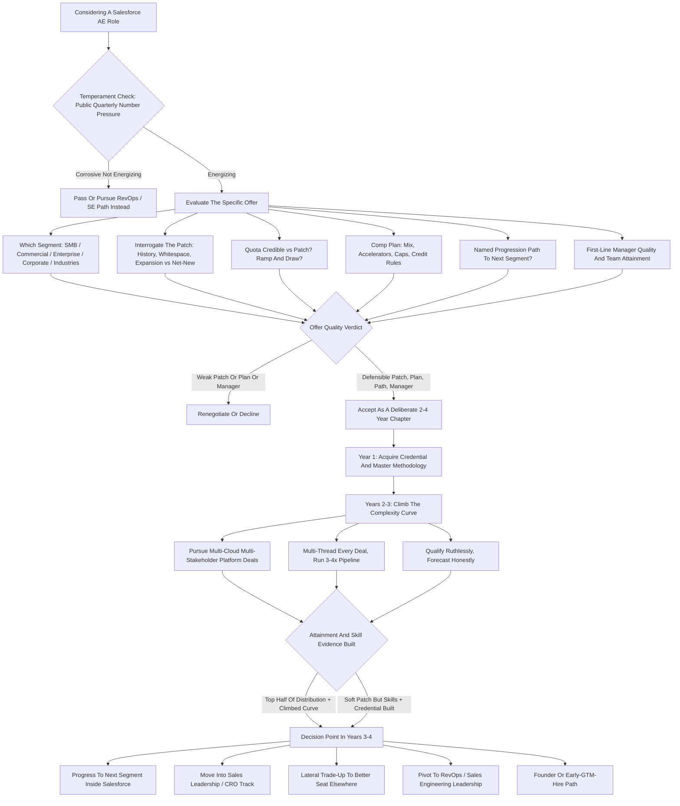
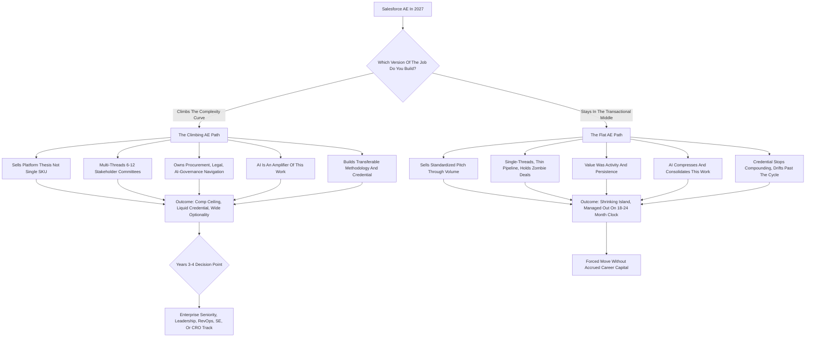

**TL;DR:** A Salesforce Account Executive role is still a genuinely good career bet in 2027 -- but only if you read it correctly as what it actually is: **the most credentialed, highest-paying, and most transferable enterprise software sales job in the market, sitting on top of a platform that is simultaneously the industry's training ground and its hardest comp plan to make money on.** A Salesforce AE in 2027 carries an on-target earnings package of roughly **$240K-$340K at the corporate/enterprise tiers and $150K-$220K in the commercial and SMB segments**, against a quota that has risen faster than win rates, a deal cycle that AI tooling has compressed at the top of the funnel but lengthened in legal and procurement, and an attainment distribution where **roughly 40-55% of reps hit quota in a normal year** and the top decile earns multiples of plan while the bottom third is managed out inside 18-24 months. The role is good for your career for three durable reasons: **(a) the brand and methodology transfer** -- "Salesforce AE" on a resume is a liquid, universally legible credential that opens doors at every other enterprise software company and at every Salesforce partner in a multi-hundred-billion-dollar ecosystem; **(b) the comp ceiling is real** -- a strong enterprise AE clearing $400K-$600K+ in a good year is not a fantasy, it is a documented outcome; and **(c) the skill it forces** -- multi-threaded enterprise selling, MEDDIC/MEDDPICC discipline, executive-stakeholder orchestration, and platform-not-product selling -- is the exact skill the rest of the software industry is converging on. The three things that make it a *bad* bet for the wrong person: **(a) the quota-and-territory lottery** -- your W-2 is set more by the patch you are handed and the macro than by your effort, and a bad territory is a lost year; **(b) the AI-driven compression of the transactional middle** -- the volume-closer version of the AE job is being automated and offshored, and a rep who does not move up the complexity curve is on a shrinking island; and **(c) the burn rate** -- ramped enterprise AEs churn on roughly a 2-4 year cycle, and the role rewards a specific tolerance for public, quarterly, number-or-out pressure. Net: in 2027 a Salesforce AE role is an excellent career *accelerant* and a poor career *destination* -- take it to acquire the credential, the methodology, and the comp, treat it as a 2-4 year compounding move toward enterprise AE leadership, RevOps, sales engineering leadership, or a CRO track, and go in clear-eyed that you are joining the most legible and most pressure-tested seat in software sales, not a safe one.

## What A Salesforce AE Role Actually Is In 2027

A Salesforce Account Executive owns a book of business -- a "patch" or "territory" of named accounts, or a segment defined by employee count and revenue -- and is measured, quarter after quarter, on one number: new and expansion Annual Recurring Revenue closed against a quota. You are not a product specialist and you are not a customer success manager; you are the person accountable for the commercial outcome, the one who builds the pipeline, qualifies it, multi-threads into the buying committee, runs the deal, negotiates the contract, and signs it. In 2027 the job is shaped by realities that did not exist a decade ago. Salesforce sells a sprawling platform -- Sales Cloud, Service Cloud, Marketing Cloud, Data Cloud, the Agentforce agentic-AI layer, Slack, Tableau, MuleSoft, Commerce Cloud, and the Industries verticals -- and the AE is increasingly expected to sell the *platform thesis*, not a single SKU. The buyer has changed: enterprise software purchases now route through a procurement and finance gauntlet, a security review, and often a dedicated AI-governance check, which means the AE orchestrates six to twelve stakeholders rather than charming one economic buyer. The tooling has changed: Salesforce's own AI, plus Gong, Clari, Outreach, and Salesloft, now handle a large share of the prospecting, call analysis, forecasting, and coaching that used to be the AE's craft -- which simultaneously makes the rep more productive and compresses the part of the job that was pure activity. And the comp plan has changed: quotas have ratcheted up, accelerators have flattened, and the gap between the top decile and the median has widened. The honest one-line description of a Salesforce AE role in 2027: it is the best-known, best-paying, most-transferable seat in enterprise SaaS sales, attached to a platform that will teach you to sell at the highest level in the industry -- and a comp plan and quota structure that will test, quarter by quarter, whether you can.

## The Segment Map: Where The AE Job Actually Lives

"Salesforce AE" is not one job; it is at least five, and the segment you sit in determines your comp, your quota, your deal size, your cycle length, and your career velocity. **The SMB / Small Business segment** sells to companies under roughly 100-200 employees, runs high-velocity transactional cycles measured in days to weeks, carries a lower quota and a lower OTE (roughly $110K-$150K), and is the entry tier -- it is where Salesforce trains raw closing talent and where AI automation pressure is heaviest. **The Commercial / Mid-Market segment** sells to companies of roughly 200-2,000 employees, runs cycles of one to three months, carries an OTE in the rough $150K-$220K band, and is the proving ground -- the segment that decides whether you advance to enterprise. **The Enterprise segment** sells to large companies, runs three-to-nine-month cycles, carries six-and-seven-figure deals, and pays an OTE in the rough $240K-$340K band with realistic upside well beyond it. **The Corporate / Strategic / Named-Account tier** owns a tiny number of the largest accounts in a region or industry, runs nine-to-eighteen-month motions, and is where the genuinely large earnings and the CRO-track visibility live. **The Industries / vertical AE roles** -- Financial Services, Healthcare & Life Sciences, Public Sector, Manufacturing, Retail -- overlay segment with deep domain specialization and are increasingly where Salesforce concentrates its highest-value selling. A career-minded person should understand this map cold, because the single most consequential thing about a Salesforce AE offer is not "Salesforce" -- it is *which segment, which patch, and which trajectory between segments*, and an offer that does not come with a credible path from commercial to enterprise is a materially weaker offer than one that does.

## The Compensation Reality: OTE, Pay Mix, And What Reps Actually Take Home

A career decision rests on real numbers, and the Salesforce AE comp picture in 2027 has a structure a candidate must internalize. **OTE -- on-target earnings -- is the headline**, and it ranges from roughly $110K-$150K in SMB to $150K-$220K in commercial to $240K-$340K in enterprise, with corporate/strategic above that. **The pay mix matters as much as the OTE**: enterprise AE plans typically run a roughly 50/50 to 60/40 base-to-variable split, meaning a $300K OTE enterprise AE has a $150K-$180K base and the rest is at-risk commission. **The distinction between OTE and W-2 is where careers are made and broken.** OTE is what you earn *if you hit 100% of quota*; the actual W-2 is a distribution. In a normal year a plurality of reps land somewhere in the 60-110% attainment band, the top decile clears 150-300%+ of plan and earns the eye-catching numbers, and the bottom roughly third lands under 50% and is on a performance clock. **Accelerators** -- the higher commission rate paid on every dollar above quota -- are the mechanism behind the top-decile outcomes, and they are the single most important line in a comp plan to read carefully, because flattened accelerators cap your upside. **Ramp** matters: a newly hired enterprise AE typically gets a ramped (reduced) quota for the first one to three quarters, and a guarantee or draw that protects early commission while pipeline builds. The honest summary: a Salesforce AE role offers a genuinely high *expected* income and an even higher *possible* income, but it is a variable, distribution-driven income, and a candidate should price the job off a realistic 70-90% attainment scenario, not off the OTE on the offer letter.

## The Quota And Territory Lottery: The Single Biggest Variable

This is the section a career-minded candidate must understand most clearly, because it is the factor that most determines outcomes and the one candidates most underweight. A Salesforce AE's results are a function of three things: the rep's skill and effort, the macro environment, and **the territory** -- the specific set of accounts or the specific segment patch the rep is handed -- and the territory is frequently the largest of the three and the one entirely outside the rep's control. A "good patch" -- accounts with budget, expansion whitespace, existing Salesforce footprint to grow, and a healthy renewal base -- can make a median rep look like a star. A "bad patch" -- saturated accounts, no whitespace, a region in a downturn, a book of logos that just bought and will not buy again for two years -- can make a genuinely excellent rep miss quota through no fault of their own, and a missed year on a bad patch still counts against you. This is why **the territory conversation is the most important conversation in the interview process** and why a candidate should ask, specifically: how is the patch defined, what is its history, what did the prior rep do against it, how much of the quota is expansion of existing accounts versus net-new logos, and how often are territories re-cut. The quota itself is the other half: quotas at Salesforce have ratcheted upward over time, and a quota set above what the territory can realistically bear is a structural setup for failure. The career discipline here is blunt: **you cannot out-work a bad territory and a bad quota**, the assignment is substantially a lottery, and the best protection is to (a) interrogate the patch hard before signing, (b) build the kind of pipeline and multi-threading discipline that survives a soft patch, and (c) understand that one bad territory year is recoverable but two in a row is a signal to move.

## The AI Compression Thesis: What Is Actually Happening To The Role

The loudest question about a Salesforce AE career in 2027 is whether AI is destroying it, and the honest answer is more precise and more useful than either the doom or the dismissal. AI is not eliminating the AE role; it is **compressing the transactional middle of it and raising the bar at the top**. Concretely: the prospecting, list-building, sequencing, initial qualification, call note-taking, CRM hygiene, and first-draft outreach that used to consume a large share of an AE's week are now substantially automated by Salesforce's own AI layer and by the engagement and intelligence tools around it. The forecasting and deal-inspection that used to be a manager's craft is now tooled. The coaching that used to require a ride-along is now extracted from call recordings. The effect of all this is a fork. For the **transactional, volume-closer version of the AE job** -- the rep whose value was activity, persistence, and running a standardized pitch through a high volume of similar deals -- the AI compression is genuinely threatening, because that is exactly the work that automates and that gets consolidated into fewer, more productive seats or pushed to lower-cost geographies. For the **complex, enterprise, platform-selling version of the job** -- multi-threading a twelve-stakeholder buying committee, architecting a multi-cloud platform deal, navigating procurement and AI-governance review, orchestrating solution engineers and partners, and translating a business problem into a revenue thesis -- AI is an amplifier, not a replacement, because that work is judgment, relationship, and orchestration, not activity. The career implication is the throughline of this entire guide: **the Salesforce AE role is a good 2027 career bet specifically to the extent that you use it to climb the complexity curve toward the part of the job AI amplifies, and a bad bet to the extent you stay in the part AI compresses.**

## The Skills The Role Forces You To Build -- And Why They Transfer

The strongest argument for a Salesforce AE role as a career move is not the comp; it is the **skill curriculum the role imposes**, because those skills are the most transferable and most durable assets in enterprise software. A Salesforce AE is forced to become fluent in **a qualification methodology** -- MEDDIC, MEDDPICC, or a Salesforce-internal variant -- which is the discipline of knowing, for every deal, the Metrics, Economic buyer, Decision criteria, Decision process, Paper process, Identified pain, Champion, and Competition; this is the lingua franca of enterprise sales and it transfers to every other serious software company. The role forces **multi-threaded enterprise selling** -- the ability to build and maintain relationships across an entire buying committee rather than depending on a single contact -- which is the single highest-leverage sales skill there is. It forces **platform and value selling** -- selling a business outcome and a platform thesis rather than a feature list -- which is where the entire industry is heading. It forces **executive-stakeholder fluency** -- the ability to hold a credible conversation with a CFO, a CIO, and a line-of-business VP in the same deal. It forces **forecasting discipline and CRM rigor** -- because at Salesforce, of all places, your pipeline lives in the system and is inspected. And it forces **negotiation and commercial structuring** -- multi-year terms, ramped deals, platform bundles. Every one of these skills is portable: they are exactly what every other enterprise SaaS company hires for, what every Salesforce partner needs, and what RevOps, sales leadership, and CRO roles are built on. This is the core of why the role is a good career bet -- you can have a hard quota year and still walk away with a skill set that is worth more on the open market than when you started.

## The Brand And Credential Value Of "Salesforce AE" On A Resume

Beyond the skills, the role confers a credential, and in a labor market full of illegible signals, a legible one is worth real money. "Salesforce AE" -- particularly "Salesforce Enterprise AE" -- is a **liquid, universally understood credential**. Every hiring manager in enterprise software knows what it means: this person was hired and retained by the company with the most rigorous sales hiring bar and the most-studied sales methodology in the industry, carried a real quota, and survived the comp plan. That signal opens doors at every other enterprise SaaS company -- a Salesforce enterprise AE is a default-credible candidate at a HubSpot, a ServiceNow, a Workday, a Snowflake, a Databricks, an Adobe. It opens doors across the **Salesforce partner ecosystem** -- the consultancies, the ISVs, and the implementation partners that collectively employ enormous numbers of people and that specifically value people who came from the mothership. It carries weight into **RevOps, sales enablement, and sales leadership** roles, because those functions trust someone who carried the bag at Salesforce. And it carries into **founder and early-GTM-hire** paths, because investors and founders treat Salesforce sales pedigree as a de-risking signal. The practical career point: even in a year where your number is hard, you are accruing a credential that compounds. A candidate weighing a Salesforce AE offer against a similar-comp offer at an unknown company should weight the credential heavily -- the brand on the resume is a real, bankable asset, and it is one of the three pillars of why this role remains a good 2027 career bet.

## The Attainment Distribution: Who Actually Wins In This Role

A candidate must understand that the AE role does not pay everyone the OTE; it pays a *distribution*, and understanding the shape of that distribution is essential to an honest career decision. In a normal year, roughly 40-55% of AEs hit or exceed 100% of quota -- meaning roughly half do not. The distribution has a long right tail: the top decile of reps routinely clears 150-300%+ of plan, and because of accelerators they earn dramatically more than 1.5-3x the OTE -- this is the cohort that produces the $500K-$700K+ stories. The middle of the distribution -- the 60-110% attainment band -- is where most reps actually live, earning a meaningful but sub-OTE-to-modestly-above-OTE income. The bottom roughly third lands under 50% of quota, and in a high-accountability culture that cohort is on a performance-improvement clock and is frequently managed out within 18-24 months. What separates the cohorts is partly territory luck and partly skill, and the skill factors are knowable: the winners multi-thread relentlessly, qualify out bad deals early instead of hoping, build pipeline 3-4x their quota so a few slipped deals do not sink the quarter, run a disciplined methodology, and partner aggressively with their solution engineers and their ecosystem. The losers single-thread, hold onto zombie deals, run thin pipeline, and improvise. The career-honest framing: **a Salesforce AE role is a good bet if you have evidence you can be in the top half of that distribution -- and the way you generate that evidence is the methodology discipline the role itself teaches.** Going in, a candidate should assume the median outcome, plan their personal finances off a 70-90% attainment year, and treat the right tail as upside, not as the plan.

## The Career Paths Out Of The Role: Where A Salesforce AE Goes Next

The clearest evidence that a Salesforce AE role is a good career bet is the **breadth and quality of the paths out of it**, because a role is a good accelerant precisely when it opens many doors. The most common upward path is **segment progression inside Salesforce** -- SMB to commercial to enterprise to corporate/strategic -- each step a meaningful jump in deal size, OTE, and prestige. From senior AE the path forks into **sales leadership** -- first-line manager, then second-line, then RVP/AVP, then VP of Sales, then CRO -- the management track that turns a strong individual contributor into a leader of revenue. A second fork is **RevOps and sales strategy** -- AEs who understand the comp plan, the territory model, and the forecasting machinery from the inside are valuable in the function that designs all of it. A third is **sales engineering and solutions leadership** for AEs with a technical bent. A fourth is the **lateral move to another enterprise SaaS company** at a higher segment or a better territory -- using the Salesforce credential to trade up. A fifth is the **Salesforce partner ecosystem** -- moving to a consultancy or ISV in a senior GTM role. A sixth is **the founder / early-GTM-hire path** -- being the first or second sales hire at a startup, or founding one, on the strength of the pedigree and the network. And the network itself is an asset: the relationships built with customers, partners, and colleagues become a durable professional graph. The career math is favorable: a 2-4 year stretch as a Salesforce AE, executed well, does not narrow your options -- it widens them, and that optionality is the third pillar of the "good career bet" case.

## The Burn Rate And Tenure Reality: How Long People Actually Stay

A candidate owes themselves an honest look at how long people actually last in the role, because the tenure data tells you what kind of bet you are making. Enterprise AE tenure at a given company tends to run on a roughly **2-4 year cycle** -- a year-ish to fully ramp and learn the patch, a couple of strong years if the territory cooperates, and then a move, either upward, laterally to a better seat, or out under quota pressure. This is not unique to Salesforce; it is the structural rhythm of the high-accountability enterprise sales role. The implication for a career decision is not that the role is bad -- it is that the role should be **planned as a chapter, not a career**. The reps who get the most out of a Salesforce AE role treat the 2-4 years deliberately: year one is ramp and credential acquisition, years two and three are the earning-and-evidence-building window, and somewhere in years three to four is the decision point -- progress to the next segment, move into leadership, trade up to a better seat elsewhere, or pivot to RevOps or another GTM function. The reps who get the *least* out of it are the ones who drift -- who stay in the same segment on a soft patch for five years, never climb the complexity curve, and find that the credential has stopped compounding. The burn rate is real and a candidate should respect it, but the right response is not to avoid the role; it is to enter it with a clock and a plan, extract the comp, the credential, and the skills inside the cycle the role naturally runs on, and make the next move on your own timing rather than the comp plan's.

## The Day-To-Day: What The Job Actually Feels Like

A career decision should be grounded in the lived texture of the work, not just the comp table. A Salesforce AE's day is a constant negotiation between two clocks: the pipeline-building clock (the work that pays you in two quarters) and the deal-closing clock (the work that pays you this quarter), and the chronic failure mode is letting this quarter's deals crowd out next quarter's pipeline. A typical week is a mix of: discovery and qualification calls, multi-threading outreach to widen the buying committee, internal deal reviews and forecast calls where you defend every number, working sessions with solution engineers to build the technical case, partner coordination, proposal and pricing construction, procurement and legal navigation on the deals in late stage, and the CRM hygiene that keeps it all inspectable. The rhythm is **quarterly and public** -- your number is visible, your forecast is challenged, and the end of quarter is a genuine crunch. The emotional texture is specific: there is real exhilaration in a large deal closing, in a quarter landed, in a buying committee won over; and real, recurring stress in a slipped deal, a quiet pipeline, a quarter that comes down to one signature, and the standing knowledge that the number resets to zero every ninety days. The role rewards a particular temperament -- comfort with public accountability, resilience to a "no," the discipline to do the unglamorous pipeline work when the quarter looks fine, and the emotional regulation to not ride the deal-by-deal rollercoaster. A candidate who finds that rhythm energizing will thrive; a candidate who finds quarterly number-or-out pressure corrosive should know that going in, because no comp number compensates for a temperament mismatch with the core rhythm of the job.

## How To Evaluate A Specific Salesforce AE Offer

Because "Salesforce AE" is five jobs and a lottery, the most important career skill is evaluating a *specific* offer, and a candidate should run a structured diligence on any offer before signing. **First, the segment and the patch:** which segment, and exactly how is the territory defined -- named accounts, geographic, or hybrid; what is its history; what did the last one to three reps do against it; how much is expansion versus net-new; how recently and how often is it re-cut. A vague answer here is itself a red flag. **Second, the quota relative to the patch:** is the quota credible against what the territory has historically produced, and what is the ramp -- ramped quota for how many quarters, and is there a draw or guarantee. **Third, the comp plan mechanics:** the base-to-variable mix, the commission rates, the accelerator structure above quota (flat or escalating), the caps if any, and how expansion and multi-year deals are credited. **Fourth, the path:** is there a credible, named progression from this segment to the next, and what is the typical timeline. **Fifth, the manager and the team:** the first-line manager is the single biggest predictor of an AE's success -- ask about their tenure, their team's attainment distribution, and their coaching style. **Sixth, the team's recent reality:** what percentage of the team hit quota last year, and what is the team's tenure pattern -- a team where most reps miss and churn fast is telling you something. **Seventh, the product moment:** are you selling into momentum or headwind. The discipline: treat the offer like the enterprise deal it is -- multi-thread it, qualify it hard, and do not let the brand and the OTE headline substitute for diligence on the patch, the plan, and the path.

## The 2027 Salesforce Context: Selling Inside The Company's Own Transition

A Salesforce AE in 2027 is not selling in a vacuum; they are selling inside Salesforce's own strategic transition, and that context shapes the job. Salesforce has pivoted hard toward **agentic AI** -- the Agentforce layer that sells autonomous AI agents on top of the CRM and Data Cloud foundation -- and that pivot changes what an AE carries and how they sell. The upside for the AE: a genuinely new, high-interest product category to sell into, expansion whitespace in the installed base, and a platform story that is larger and more strategic than "CRM seats," which pushes the role toward the high-complexity, high-judgment selling that AI amplifies rather than compresses. The complication for the AE: a new category means longer education cycles, more proof-of-concept work, more AI-governance and trust review in the buying process, and a quota that may be set on optimistic adoption assumptions. The broader Salesforce context also matters: the company is large, mature, and under real scrutiny on growth and margins, which translates downstream into quota pressure, periodic territory re-cuts, and headcount discipline -- the structural reasons the territory lottery and the burn rate exist. The career read: selling at Salesforce in 2027 means selling at the front edge of the industry's AI transition, which is genuinely good for skill-building and credential value, while also meaning you are inside a company managing its own maturity, which is the source of the comp and quota pressure. A candidate should see both halves clearly -- the role gives you a front-row seat to where enterprise software is going, and it asks you to perform under the pressure of a company working hard to keep growing.

## Salesforce AE Versus The Alternatives

A career decision is comparative, and a candidate should weigh the Salesforce AE role against its realistic alternatives. **Versus an AE role at a high-growth, mid-stage SaaS company:** the startup AE role can offer more territory whitespace, faster individual visibility, equity upside, and a less ratcheted quota -- but it carries company risk, a less legible credential, and a less developed methodology and enablement machine. The trade is brand and training versus whitespace and equity. **Versus an AE role at another large enterprise SaaS incumbent** -- ServiceNow, Workday, SAP, Oracle, Microsoft, Adobe: these are genuinely comparable in comp and credential, and the choice comes down to the specific segment, patch, product momentum, and manager rather than the logo -- a great patch at ServiceNow beats a bad patch at Salesforce. **Versus moving into RevOps or sales engineering directly:** these are less variable, less publicly pressured, and still well-paid, but they forgo the comp ceiling and the specific credential of having carried a bag at the top. **Versus staying in a current sales role:** the question is whether the current role is still building skills, credential, and comp, or whether it has plateaued. The honest comparative verdict: the Salesforce AE role is not categorically better than every alternative, but it is the **highest-floor, most-legible, most-transferable** option in the set -- the alternative that most reliably leaves you with a credential and a skill set worth more than when you started, even in a hard year. The candidates for whom it is *not* the best choice are those who specifically value equity upside (favor the startup), those who want lower variance (favor RevOps/SE), and those who already have an equivalent credential and a better patch elsewhere.

## The Failure Modes: How A Salesforce AE Career Goes Wrong

A candidate can avoid most bad outcomes by knowing the failure modes in advance, because they are consistent. **Failure mode one -- taking the brand and ignoring the patch:** signing for the logo and the OTE without interrogating the territory, then losing a year to a saturated, no-whitespace book. **Failure mode two -- staying transactional:** never climbing the complexity curve, remaining in the volume-closer version of the job that AI is compressing, and finding the seat shrinking underneath you. **Failure mode three -- single-threading:** depending on one champion per deal, then watching deals die when that person leaves or goes quiet -- the most common deal-level killer. **Failure mode four -- thin pipeline:** running pipeline coverage barely above quota, so a normal slip rate produces a missed quarter; the disciplined rep runs 3-4x. **Failure mode five -- holding zombie deals:** refusing to qualify out dead deals because the pipeline looks better with them in it, then forecasting on fiction. **Failure mode six -- drifting past the cycle:** staying in the same segment on a soft patch for five years, letting the credential stop compounding, and missing the window to progress or trade up. **Failure mode seven -- pricing life off the OTE:** taking on personal financial commitments sized to the OTE rather than to a realistic 70-90% attainment year, then being financially fragile in a down quarter. **Failure mode eight -- temperament mismatch:** taking the role for the comp despite a genuine aversion to public quarterly pressure, and burning out. **Failure mode nine -- neglecting the manager question:** ending up under a weak first-line manager, the single biggest controllable predictor of failure. Every one of these is avoidable, and the avoidance is the same discipline the role rewards -- diligence the patch, climb the complexity curve, multi-thread, build deep pipeline, qualify honestly, run a clock, and plan finances conservatively.

## A Decision Framework: Is This Role Right For You Specifically

A candidate should run a structured self-assessment, because the Salesforce AE role fits a specific profile and badly misfits others. **Temperament:** do you find public, quarterly, number-or-out accountability energizing or corrosive -- and be honest, because this is the core rhythm and no comp offsets a deep mismatch. **Stage and goal:** are you at a point where acquiring a top-tier credential, a rigorous methodology, and a high comp ceiling materially advances your trajectory -- the role is a strong accelerant and a weak destination, so it fits best as a deliberate 2-4 year chapter. **Risk tolerance:** can you operate with a 40-60% variable, distribution-driven income, and can you absorb a soft-patch year financially and emotionally. **Skill base:** do you have evidence -- from a prior sales role, or adjacent experience -- that you can land in the top half of the attainment distribution, or a credible plan to build that capability fast. **Complexity orientation:** are you drawn to the multi-threaded, multi-stakeholder, platform-selling, judgment-heavy version of the job (the part AI amplifies) rather than the transactional version (the part AI compresses). **Specific offer quality:** does the actual offer in front of you come with a defensible patch, a credible quota, a clean comp plan, a named progression path, and a strong manager. If a candidate answers well across temperament, stage-and-goal fit, risk tolerance, skill base, complexity orientation, and offer quality, a Salesforce AE role in 2027 is a genuinely good career bet -- a high-floor, high-ceiling, high-transferability move. If they answer poorly on temperament or offer quality specifically, they should pass or renegotiate. If they answer poorly on risk tolerance, a RevOps or sales engineering path captures much of the upside with less variance. The framework's job is to convert "Salesforce sounds prestigious" into an honest, structured decision about a specific seat.

## Maximizing The Role: How To Make It A Genuinely Good Bet

For the candidate who takes the role, the difference between a good career outcome and a wasted chapter is a set of deliberate behaviors. **Treat year one as credential-and-methodology acquisition** -- learn the patch, master the methodology cold, build the relationships, and do not panic about the number while ramping. **Climb the complexity curve on purpose** -- actively pursue the larger, multi-cloud, multi-stakeholder deals, because that is the part of the job that builds the transferable skill and that AI amplifies. **Multi-thread every deal from the start** -- never let a deal depend on one person; build a map of the buying committee and a relationship in every box. **Run pipeline at 3-4x quota** -- the single most reliable protection against a missed quarter and a soft patch. **Qualify ruthlessly** -- kill zombie deals early, forecast honestly, and earn a reputation for a clean pipeline, which is itself career capital. **Partner aggressively** -- with solution engineers, with the partner ecosystem, with marketing -- because enterprise selling is a team sport and lone wolves underperform. **Build the relationship graph deliberately** -- customers, partners, colleagues, and managers become your durable professional network. **Run a clock** -- know that the role is a 2-4 year chapter, set the decision point in advance, and make the next move (progression, leadership, lateral trade-up, or RevOps pivot) on your timing. **Manage the manager relationship** -- your first-line manager controls your patch, your deals' air cover, and your internal advocacy. And **price your life conservatively** -- live off the base-plus-conservative-commission, bank the upside, and stay financially un-fragile so a down quarter is a setback, not a crisis. Do these, and the role delivers all three of its promises -- comp, credential, and skill -- and becomes exactly the accelerant the "good career bet" case describes.

## The Ecosystem Dividend: Why The Salesforce Network Outlasts The Job

A factor that career-minded candidates consistently underweight is that a Salesforce AE role plugs you into the single largest professional ecosystem in enterprise software, and that ecosystem keeps paying you long after you leave the seat. Consider the scale of what surrounds the role. There is a vast partner economy -- the global system integrators, the boutique consultancies, the independent software vendors building on the platform, the implementation shops -- and that economy hires aggressively for people who carried a Salesforce bag, because an ex-Salesforce AE understands the product, the buyer, and the sales motion from the inside. There is the customer base itself -- every account you sell to is a building full of operators who now know you, trust you if you sold them well, and represent future employers, future references, and future buyers when you land somewhere new. There is the colleague network -- the solution engineers, the other AEs, the managers, the marketers, the customer success leaders -- who scatter across the industry over the following decade and become your warm-intro graph into a hundred other companies. And there is the certification and community layer -- Trailhead, the Trailblazer community, the user groups and Dreamforce orbit -- which keeps your name and your competence legible in a way few other employers can match. The career implication is concrete: when you eventually leave the AE seat, you do not leave cold. You leave with a relationship graph that spans the partner economy, the customer base, and a diaspora of former colleagues, and that graph is the mechanism by which the next role, and the one after that, finds you. A candidate weighing the role should count the ecosystem dividend as a real, if deferred, part of the compensation -- it is one of the quieter reasons the role functions as an accelerant rather than a dead end.

## The Macro Sensitivity: Reading The Cycle You Are Signing Into

A candidate should also understand that a Salesforce AE's outcomes are unusually sensitive to the macroeconomic and software-spending cycle, and that the timing of when you enter the role is itself a variable worth thinking about. Enterprise software budgets expand and contract with the broader economy, with corporate IT-spending sentiment, and with the specific narrative around AI investment in any given year. In an expansionary year -- budgets loose, buyers confident, expansion deals flowing -- a median rep on a median patch can hit quota and a good rep can have a career year, because the macro is doing some of the work. In a contractionary year -- budgets frozen, deals stuck in finance, procurement scrutinizing every renewal -- the same rep on the same patch can miss, because deals that would have closed simply do not, and no amount of multi-threading conjures budget that does not exist. This matters for a career decision in two ways. First, it is another reason to price the role off a conservative attainment scenario and to keep your personal finances un-fragile -- you cannot predict which kind of year you are signing into, and you may get the bad one first. Second, it reframes what a missed quarter means: in a genuinely contractionary stretch, a missed number is partly a macro artifact, and a clear-eyed rep separates "I executed poorly" from "the cycle was against everyone," learns from the first, and does not internalize the second as a personal verdict. The disciplined candidate treats macro sensitivity not as a reason to avoid the role but as a reason to enter it with a financial cushion, a long enough time horizon to ride through at least one full cycle, and the judgment to read their own results against the backdrop of the year they actually got.

## The Verdict: Accelerant, Not Destination

Pulling the whole analysis together: is a Salesforce AE role still good for your career in 2027? **Yes -- as an accelerant, with eyes open.** It is good because it offers the three things that genuinely compound a sales career: a high and high-ceilinged comp opportunity, the single most legible and transferable credential in enterprise software sales, and a forced curriculum in the exact methodology and selling motion the rest of the industry is converging on. It is *not* a safe or passive seat: it is a variable-income, quarterly-accountability role; the territory you are handed is substantially a lottery that you cannot out-work; the transactional version of the job is being compressed by AI and consolidation; and the role naturally runs on a 2-4 year burn cycle. The synthesis that resolves the tension: a Salesforce AE role is a poor career *destination* and an excellent career *accelerant*. The candidate who takes it as a deliberate 2-4 year chapter -- to acquire the credential, master the methodology, climb the complexity curve toward the AI-amplified part of the job, extract the comp, and then move on their own timing toward enterprise AE seniority, sales leadership, RevOps, sales engineering leadership, or a CRO track -- is making one of the best available moves in software sales. The candidate who takes it for the brand alone, ignores the patch, stays transactional, drifts past the cycle, and prices their life off the OTE is making a mistake. The role has not gotten worse in 2027; it has gotten *more bifurcated* -- better than ever for the rep who climbs, worse than ever for the rep who stays flat. Choose it as a chapter, work it as a climb, and it is still, in 2027, a genuinely good thing to have on your career.

## The Career Decision Journey: From Offer To Next Move

## The Bifurcation Matrix: The Climbing AE Versus The Flat AE

## Sources

1. **RepVue -- Salesforce Account Executive Compensation and Ratings** -- Crowd-sourced OTE, quota-attainment, and culture data for Salesforce AE roles by segment. https://www.repvue.com
2. **Salesforce Investor Relations -- 10-K and Quarterly Filings** -- Official revenue, operating income, and segment disclosures providing the company-context backdrop. https://investor.salesforce.com
3. **Gartner -- The Future of Sales** -- Research on AI-assisted selling, buyer behavior shifts, and the evolving structure of the seller role. https://www.gartner.com
4. **The Bridge Group -- SaaS AE / Sales Development Metrics Reports** -- Benchmark data on AE quota, ramp time, tenure, attainment, and pipeline coverage. https://bridgegroupinc.com
5. **Pavilion -- GTM Compensation and Benchmarks Reports** -- Compensation, pay-mix, and quota-attainment benchmarks across GTM roles. https://www.joinpavilion.com
6. **levels.fyi -- Salesforce Sales Compensation Data** -- Self-reported total-compensation data points for Salesforce sales roles. https://www.levels.fyi
7. **Glassdoor -- Salesforce Account Executive Salary and Review Data** -- Self-reported base, OTE, and qualitative role reviews. https://www.glassdoor.com
8. **US Bureau of Labor Statistics -- Sales Representatives, Wholesale and Manufacturing / Software Publishers** -- Occupational employment, wage, and outlook data for sales occupations. https://www.bls.gov
9. **Salesforce Newsroom and Agentforce Product Announcements** -- Official material on the agentic-AI pivot shaping what AEs sell in 2027. https://www.salesforce.com/news
10. **MEDDIC Academy -- MEDDIC / MEDDPICC Methodology Documentation** -- Reference for the enterprise qualification methodology the AE role forces. https://www.meddic.academy
11. **Gong -- Sales Reality / Revenue Intelligence Reports** -- Analysis of sales-conversation data on win-rate drivers and AI-coaching impact. https://www.gong.io
12. **Clari -- Revenue Operations and Forecasting Research** -- Material on forecasting discipline and the tooling of deal inspection. https://www.clari.com
13. **HubSpot -- State of Sales Reports** -- Survey data on sales-cycle length, buyer behavior, and rep productivity trends. https://www.hubspot.com
14. **Outreach -- State of Sales Engagement Reports** -- Data on prospecting automation and the share of pipeline creation shifting off the AE. https://www.outreach.io
15. **Alexander Group -- Sales Compensation Trends Surveys** -- Enterprise sales-comp structure, segmentation, and role-bifurcation research. https://www.alexandergroup.com
16. **Korn Ferry -- Sales Talent and Compensation Studies** -- Research on sales-role tenure, turnover, and talent benchmarks. https://www.kornferry.com
17. **CSO Insights / Korn Ferry Sales Performance Research** -- Historical and ongoing data on quota attainment distributions. https://www.kornferry.com
18. **LinkedIn -- State of Sales Report** -- Survey data on seller workflows, buyer relationships, and tool adoption. https://www.linkedin.com
19. **Salesforce State of Sales Report** -- Salesforce's own survey research on seller time allocation and AI adoption. https://www.salesforce.com
20. **Sales Hacker / Pavilion Community Practitioner Discussion** -- Practitioner commentary on territory design, comp plans, and AE career paths. https://www.saleshacker.com
21. **Built In -- Salesforce and Enterprise SaaS Role and Salary Pages** -- Role descriptions and compensation references for AE positions. https://builtin.com
22. **Comparably -- Salesforce Compensation and Culture Data** -- Self-reported compensation and workplace-culture data. https://www.comparably.com
23. **Forrester -- B2B Buying Study / Future of B2B Sales** -- Research on the expanding buying committee and lengthening procurement processes. https://www.forrester.com
24. **McKinsey -- B2B Sales and the Future of Selling** -- Analysis of AI's impact on sales productivity and role structure. https://www.mckinsey.com
25. **ZoomInfo / DealRoom GTM Benchmark Data** -- Pipeline-coverage and sales-cycle benchmark references.
26. **Salesforce Trailblazer Community and Trailhead** -- Reference for the Salesforce ecosystem, certification, and partner-network scale. https://www.salesforce.com/trailblazer
27. **Salesforce Partner Program Documentation** -- Material on the consultancy and ISV ecosystem that hires ex-Salesforce AEs. https://partners.salesforce.com
28. **The Information -- Coverage of Enterprise SaaS GTM and Sales-Tooling Vendors** -- Reporting on the sales-tech vendors automating the AE workflow. https://www.theinformation.com
29. **Crunchbase -- Enterprise SaaS Company and Funding Data** -- Reference for the alternative-employer landscape AEs trade into. https://www.crunchbase.com
30. **Repvue and Bridge Group Quota-Attainment Trend Data** -- Combined reference for the roughly 40-55% quota-attainment thesis.
31. **G2 -- Sales Tools Category and Adoption Data** -- Reference for the AI sales-tooling stack reshaping the role. https://www.g2.com
32. **Sales Management Association -- Research on Territory Design and Quota Setting** -- Material on how territory and quota assignment drives rep outcomes. https://salesmanagement.org
33. **Harvard Business Review -- Articles on Sales Compensation and Territory Design** -- Conceptual references on comp-plan and territory mechanics. https://hbr.org
34. **OpenView / SaaS Operational Benchmarks (historical)** -- Historical SaaS GTM and sales-efficiency benchmark references.
35. **First-Hand AE Practitioner Accounts -- Sales Community Forums and Career Discussions** -- Practitioner accounts of tenure, burn rate, territory experience, and career paths.

## Numbers

**Salesforce AE On-Target Earnings By Segment (2027, approximate USD)**

| Segment | Typical OTE | Base/Variable Mix | Deal Size | Cycle Length |
|---|---|---|---|---|
| SMB / Small Business | $110K-$150K | ~60/40 | Low five figures | Days to weeks |
| Commercial / Mid-Market | $150K-$220K | ~55/45 to 60/40 | Five to low six figures | 1-3 months |
| Enterprise | $240K-$340K | ~50/50 to 60/40 | Six to seven figures | 3-9 months |
| Corporate / Strategic / Named | $320K-$450K+ | ~50/50 | Seven figures+ | 9-18 months |
| Industries / Vertical (overlay) | Segment OTE + domain premium | Varies | Varies by segment | Often longer |

**Quota Attainment Distribution (Representative Normal Year)**

| Cohort | Share Of Reps | Attainment Band | Earnings Reality |
|---|---|---|---|
| Top decile | ~10% | 150-300%+ of quota | 1.5-3x+ OTE; the $400K-$700K+ outcomes |
| Solid performers | ~30-45% | 100-150% of quota | At or modestly above OTE |
| Middle band | ~20-30% | 60-100% of quota | Meaningful but sub-OTE income |
| Bottom third | ~30-35% | Under 50-60% of quota | On a performance clock; managed out in 18-24 months |

- Overall, roughly **40-55% of AEs hit or exceed 100% of quota** in a normal year

**Offer-Evaluation Checklist (The Seven Diligence Questions)**

| Area | The Question To Ask |
|---|---|
| Segment & patch | How is the territory defined, what is its history, what did the last 1-3 reps do against it? |
| Expansion vs net-new | What share of quota is expansion of existing accounts vs net-new logos? |
| Quota vs patch | Is the quota credible against what the patch has historically produced? |
| Ramp | Ramped quota for how many quarters; is there a draw or guarantee? |
| Comp mechanics | Base/variable mix, accelerator structure, caps, multi-year credit rules? |
| Path | Is there a named, credible progression to the next segment, on what timeline? |
| Manager & team | Manager tenure and style; what % of the team hit quota last year? |

**Career Timeline (The Deliberate 2-4 Year Chapter)**
- Year 1: ramp, credential acquisition, methodology mastery, learn the patch
- Years 2-3: earning-and-evidence window; climb the complexity curve
- Years 3-4: decision point -- progress, lead, trade up, or pivot
- Enterprise AE tenure at one company: typically a 2-4 year cycle

**Pipeline And Deal Discipline Benchmarks**
- Pipeline coverage target: roughly 3-4x quota
- Buying committee size (enterprise): roughly 6-12 stakeholders
- Single-threading: the most common deal-level failure mode
- Zombie-deal discipline: qualify out early rather than forecast on fiction

**The AI Compression Split**
- Compressed (threatened): prospecting, list-building, sequencing, initial qualification, call notes, CRM hygiene, first-draft outreach, transactional volume closing
- Amplified (durable): multi-threading, platform/value selling, executive-stakeholder orchestration, procurement and AI-governance navigation, solution-engineer and partner orchestration

**Paths Out Of The Role**
- Segment progression inside Salesforce (SMB -> commercial -> enterprise -> corporate/strategic)
- Sales leadership track (first-line -> RVP/AVP -> VP Sales -> CRO)
- RevOps and sales strategy
- Sales engineering and solutions leadership
- Lateral trade-up to another enterprise SaaS incumbent
- Salesforce partner ecosystem (consultancies, ISVs)
- Founder / early-GTM-hire path

## Counter-Case: Why A Salesforce AE Role Might Be A Mistake For You In 2027

The case above describes a genuinely good career bet, but a serious candidate must stress-test it against the conditions that make this role the wrong move. There are real reasons to pass.

**Counter 1 -- The territory lottery can cost you a year you cannot get back.** Your W-2 and your internal reputation are set substantially by the patch you are handed, and the patch is assigned, not earned. A saturated, no-whitespace, just-bought book in a soft region can make an excellent rep miss quota, and a missed year still counts against you regardless of cause. You are accepting a job where a large share of the outcome is outside your control.

**Counter 2 -- The transactional version of the job is genuinely being compressed.** If you land in -- or get stuck in -- the SMB or lower-commercial volume-closer version of the role, you are in exactly the work that AI automation and geographic consolidation are eating. Not every rep climbs the complexity curve, and the ones who do not are on a shrinking island, doing work that is being designed out of the org chart.

**Counter 3 -- The income is variable and distribution-driven, and the distribution is unforgiving.** The OTE on the offer letter is what you make at exactly 100% of quota, and only roughly 40-55% of reps get there. A meaningful third of reps land under 50% of plan and are on a performance clock. If you need income stability, a 40-60% variable comp plan with a long left tail is a poor structural fit.

**Counter 4 -- The burn rate is real and the role is not a place to settle.** Enterprise AE tenure runs on a roughly 2-4 year cycle. This is fine if you plan it as a chapter, but it means the role is structurally not a stable long-term home -- you are signing up for a seat you will need to move out of, on a clock, and the move is not always on your timing.

**Counter 5 -- The quarterly pressure is public, relentless, and resets to zero.** Your number is visible, your forecast is challenged in front of peers, and every ninety days the counter goes back to zero regardless of last quarter. For a candidate whose temperament does not fit that rhythm, no comp number compensates -- the role will be corrosive, not energizing, and that mismatch is the most common reason talented people burn out of sales.

**Counter 6 -- Quotas have ratcheted faster than win rates.** Salesforce, as a large and mature company under growth and margin scrutiny, has structural reasons to set aggressive quotas and re-cut territories. You may be handed a number that the patch genuinely cannot bear, and "the quota was unrealistic" is not a defense that shows up on your attainment record.

**Counter 7 -- The brand can lull you into skipping diligence.** The single most common career mistake with this role is signing for the logo and the OTE headline without interrogating the patch, the plan, the path, and the manager. The brand is real, but it is not a substitute for diligence, and the prestige of the name is exactly what makes candidates underwrite a bad specific offer.

**Counter 8 -- A great patch at another incumbent can beat a bad patch at Salesforce.** ServiceNow, Workday, SAP, Microsoft, Adobe, and others offer comparable comp and comparable credential value. The Salesforce name does not, by itself, make a specific Salesforce offer the best offer -- and treating it as automatically superior can lead you to decline a genuinely better seat elsewhere.

**Counter 9 -- It forgoes equity upside.** A mature public company's AE comp is salary and commission, not meaningful equity. A candidate who specifically wants ownership upside is better served by an AE seat at a high-growth, mid-stage company -- accepting more company risk and a less legible credential in exchange for an equity stake that can matter.

**Counter 10 -- It is the wrong move if you want lower variance and still-good pay.** RevOps, sales enablement, and sales engineering roles are well-compensated, build durable and transferable skills, and carry far less public quarterly variance. A candidate who values stability over the comp ceiling can capture much of the career upside of the SaaS-GTM world without the quota rollercoaster.

**Counter 11 -- A weak first-line manager can sink the whole experience.** The first-line manager controls your patch, the air cover on your deals, and your internal advocacy -- and you do not pick them. Land under a weak or churning manager and even a good patch and a fair quota can turn into a bad chapter.

**Counter 12 -- "Good for your career" assumes you actually climb.** Every pillar of the positive case -- comp, credential, skills -- compounds only if you climb the complexity curve and move on the cycle. The candidate who drifts in the same segment on a soft patch for five years gets the pressure without the payoff: the credential stops compounding and the skills plateau. The role is good *conditionally*, and the condition is real work.

**Counter 13 -- The role can quietly narrow you if you let it.** The positive case rests on the AE seat being broadening -- credential, methodology, network. But a role can also narrow a person: years of pure quota-carrying can leave a rep fluent in closing and illiterate in everything adjacent -- product strategy, finance, operations, building rather than selling. The candidate who never deliberately reaches outside the deal -- never learns the comp-plan math, never sits in on a RevOps conversation, never builds anything -- can emerge after four years as a narrower professional than they went in, with a strong but single-dimensional resume. The role broadens or narrows depending entirely on whether you treat it as a platform for learning the wider GTM machine or as a treadmill of deals; the treadmill version is a real and common outcome.

**The honest verdict.** A Salesforce AE role in 2027 is a strong choice for a candidate who: (a) finds public quarterly accountability energizing rather than corrosive, (b) is at a career stage where a top-tier credential, a rigorous methodology, and a high comp ceiling materially advance their trajectory, (c) can absorb a variable, distribution-driven income and a soft-patch year, (d) is oriented toward the complex, multi-stakeholder, platform-selling version of the job that AI amplifies, (e) will do real diligence on the specific patch, plan, path, and manager rather than signing for the brand, and (f) will treat the role as a deliberate 2-4 year climbing chapter and move on their own timing. It is a poor choice for anyone who needs income stability, anyone who wants a stable long-term home, anyone whose temperament rejects public quarterly pressure, anyone who specifically wants equity upside, and anyone who would take the role for the logo and then drift. The role is not worse in 2027 -- it is more bifurcated, and the gap between the climbing version that pays off and the flat version that does not is wider than it has ever been.

## Related Pulse Library Entries

- **q1896** -- Is an Apollo AE role still good for your career in 2027? (Comparable AE-role analysis at a high-velocity sales-engagement vendor; contrast in segment and credential.)
- **q1897** -- Is an Outreach Solutions Engineer role still good for your career in 2027? (The SE counterpart to the AE seat; the lower-variance adjacent path.)
- **q1898** -- What replaces the RevOps stack if AI agents auto-coach reps? (The downstream tooling implication of the AI-compression thesis.)
- **q1904** -- How does Salesforce make money in 2027? (The parent-company economics behind the quota pressure and the platform thesis the AE sells.)
- **q1906** -- Outreach vs Salesloft -- which should you buy in 2027? (The engagement-layer tooling that automates the transactional middle of the AE job.)
- **q1910** -- Should Gong acquire Avoma in 2027? (The revenue-intelligence and AI-coaching layer reshaping how AE performance is measured.)
- **q1946** -- How do you start a real estate investing business in 2027? (Adjacent high-variable-income career with a similar distribution-driven outcome profile.)
- **q9501** -- How do you start a bookkeeping business in 2027? (The lower-variance, owner-controlled alternative to a quota-carrying seat.)
- **q9502** -- How do you scale a workshop-led training business past the single-operator ceiling? (Scaling logic relevant to the founder / early-GTM path out of an AE role.)
- **q9601** -- How do you start a fractional CFO business in 2027? (A senior, advisory career path that values the commercial fluency an AE builds.)
- **q1947** -- How do you build a RevOps function from scratch in 2027? (The RevOps pivot path out of the AE seat, in depth.)
- **q1948** -- What does a modern enterprise sales stack look like in 2027? (The tooling context the AE operates inside.)
- **q1949** -- How do you design a sales compensation plan in 2027? (The mechanics behind the comp plan a candidate must evaluate.)
- **q1950** -- What is the future of the SDR role in 2027? (The upstream role most directly compressed by AI; context for the AE compression thesis.)
- **q1951** -- How do you break into enterprise SaaS sales in 2027? (The on-ramp to the segment map this entry describes.)
- **q1952** -- Sales engineering as a career in 2027. (The technical-track alternative and the partner the AE orchestrates.)
- **q1953** -- What does a CRO actually do in 2027? (The destination at the top of the sales-leadership path out of the AE role.)
- **q1954** -- How do you evaluate a startup sales job offer in 2027? (The diligence framework for the high-growth-company alternative to Salesforce.)
- **q1955** -- Is a Microsoft enterprise sales role good for your career in 2027? (The closest incumbent-alternative comparison.)
- **q1956** -- Is a ServiceNow AE role good for your career in 2027? (The closest incumbent-alternative comparison.)
- **q1957** -- How do you negotiate a SaaS sales offer in 2027? (Practical negotiation guidance for the offer-evaluation step.)
- **q1958** -- What is MEDDIC / MEDDPICC and why does it matter in 2027? (Deep dive on the qualification methodology the AE role forces.)
- **q1959** -- How do you build a personal pipeline as an enterprise AE? (Tactical depth on the 3-4x pipeline-coverage discipline.)
- **q1960** -- What is the future of B2B selling in 2027? (The macro context for the AI-compression and bifurcation thesis.)
- **q9701** -- What is the best sales engagement and CRM stack in 2027? (The tooling stack the AE works inside daily.)

