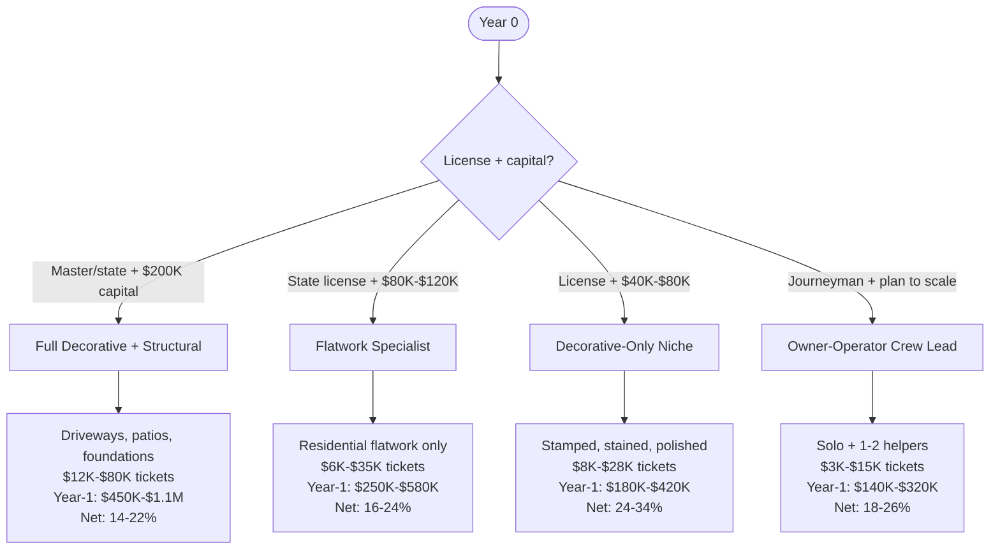
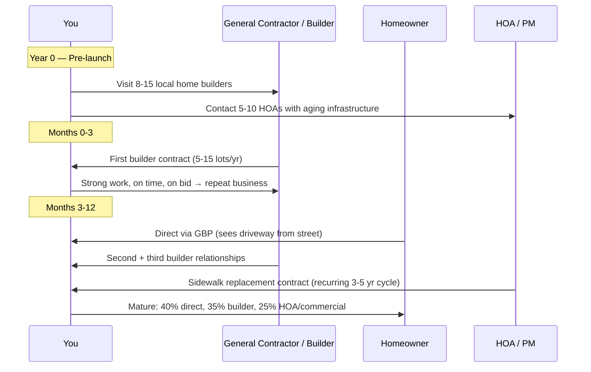

## Why Concrete Contracting Is The Capex-Heaviest But Most Defensible Trade

Concrete contracting is the heaviest-capex residential/light-commercial trade you can start in 2027, and that's exactly why the operators who get over the capex wall print money for 15+ years. The barrier to entry — $80K–$220K of forms, mixers (or ready-mix relationships), finishing tools, vehicles, and 1099 finishers — keeps the unlicensed competitor pool out. The barrier to exit is high enough that good operators stay competitive for decades.

The 2027 picture: BLS projects 5% job growth for cement masons and concrete finishers through 2032 with about 22,500 openings annually, plus the cohort hard-truth — **the median concrete finisher in the US is 44 years old and 28% of the skilled cement-masonry workforce is past 55** (per the Portland Cement Association 2024 workforce report). Labor scarcity is brutal in this trade specifically, and it's translated into per-cubic-yard labor pricing that's risen 38–52% in the past 5 years in Sunbelt metros (American Concrete Pumping Association 2024 data).

For the operator who can get over the capex wall and recruit/retain a 3–5 person finishing crew, the unit economics in 2027 are arguably better than any other residential trade. Tickets are large ($8K–$45K residential, $35K–$250K commercial), payments are typically draws on percentage-complete (so cash flow is workable), and once you have a reputation, builders come back project after project.

## The Four Real Business Models — Pick Honestly

**Model 1 — Full Structural + Decorative.** State contractor license (most states require it for concrete over a certain $ threshold), ACI (American Concrete Institute) certification for the lead, $120K–$200K in equipment (forms, finishing tools, screeds, power trowels, mixer if not using ready-mix), and a crew of 4–6 finishers. You do driveways, patios, sidewalks, foundations, garage slabs, and decorative work. Highest revenue ceiling but highest capital + labor management complexity.

**Model 2 — Residential Flatwork Specialist.** State license + ACI + $80K–$120K capex. You focus on driveways and patios — the "easy" concrete that builds out fast and doesn't require structural engineering involvement. This is the most replicable model and the one I'd recommend for most new operators. You can run it with a 3-person crew and clean out a Sunbelt metro neighborhood by neighborhood.

**Model 3 — Decorative-Only Niche (Stamped / Stained / Polished).** Stamped concrete patios, acid-stained interior floors, polished concrete commercial floors. Equipment is specialty (stamps, color hardeners, polishing rigs $20K–$45K) but capex is lower than Model 1. Margins are higher because you're competing on artistry, not bid price. This is the operator-friendly path for someone who wants the design-build positioning.

**Model 4 — Owner-Operator Solo + Helper(s).** You're the foreman and the finisher. 1–2 part-time helpers for pours. Capex $40K–$80K. You're capped at maybe 80–120 jobs per year (smaller residential work, garage slabs, sidewalks, RV pads). This is the lifestyle plumbing-trade equivalent — good $150K SDE income, no scaling path beyond owner hours.

## Year-1 / Year-3 Unit Economics

| Lever | Model 1 (Full Service) | Model 2 (Flatwork) | Model 3 (Decorative) | Model 4 (Solo Op) |
|---|---|---|---|---|
| License + cert | State contractor + ACI | State contractor + ACI | State + ACI + decorative training | State + ACI + journeyman work history |
| Startup capex | $120K-$220K | $80K-$120K | $40K-$80K | $40K-$80K |
| Truck + trailer | $45K-$80K | $35K-$60K | $25K-$45K | $25K-$40K |
| Forms + finishing | $25K-$60K | $20K-$40K | $10K-$25K | $8K-$18K |
| Specialty equipment | $25K-$50K (power trowel, screed) | $15K-$25K | $20K-$45K (stamps, polisher) | $5K-$15K |
| Avg ticket | $12K-$80K | $6K-$35K | $8K-$28K | $3K-$15K |
| Year-1 revenue | $450K-$1.1M | $250K-$580K | $180K-$420K | $140K-$320K |
| Year-1 owner pay | $130K-$280K | $90K-$200K | $90K-$180K | $80K-$160K |
| Net margin mature | 14-22% | 16-24% | 24-34% | 18-26% |
| Year-3 scaleable | $1.5M-$3.5M | $700K-$1.6M | $500K-$1.2M | $250K-$450K (ceiling) |
| Crew size needed | 4-7 | 3-4 | 2-3 + specialty | 1 + 1-2 helpers |
| Season length | 8-9 months in N, 11+ in S | 8-11 months | 9-11 months (interior helps) | 8-10 months |

The seasonal piece kills more Model 1 operators than anything else. In Northern climates, concrete season is 8 months hard-stop (the season ends when overnight lows hit 40°F consistently — concrete doesn't cure properly below that). That means your annual revenue happens in 60–65% of the calendar but your overhead (truck payments, insurance, shop rent) runs 12 months. **Operators in Buffalo or Minneapolis need to be running 30–40% higher gross margins than operators in Phoenix to absorb the dead winter quarter.**

## How To Land The First 25 Customers

The plain operator playbook for new concrete contractors:

1. **Visit local home builders in person — not email.** Concrete subcontractors are picked by relationship, not by lowest bid. Walk into 8–15 builder offices in your zip codes with portfolio photos and a clean truck. Builders who hire you for one home will hire you for 12 if you're reliable.
2. **Get on at least one HOA / property management vendor list.** Concrete repairs (sidewalks, curbs, parking lots) for aging HOA communities are recurring 3–5 year revenue. $20K–$80K per annual cycle, predictable.
3. **Photograph everything.** Drone footage of driveways, before/after of decorative stamps, time-lapse of large pours. Concrete is a visual sell — Instagram + Google Business Profile photos drive direct homeowner inquiries.
4. **Skip the lowest-bid race.** Concrete operators who chase the cheapest quote on every job are running 0–6% net margins and going bankrupt. Position on quality + warranty + ACI cert. Bid 12–20% above the cheapest competitor. Win on credibility, not price.
5. **HomeAdvisor / Angi / Thumbtack rarely work for concrete.** The lead cost ($50–$150 per lead) plus low close rate (8–15% on price-shopping leads) plus low margin per job kills the math. Skip these. GBP + builder relationships are the real channels.

## The Decorative Layer — Why It Doubles Margins

Decorative concrete (stamped, stained, polished, exposed aggregate) is the single highest-leverage move a flatwork operator can make. The unit economics:

- Plain broom-finish driveway, 600 sqft: $4,800 ticket, $1,800 materials + crew, **$3,000 gross margin (62%)**
- Stamped + colored 600 sqft patio: $11,200 ticket, $2,800 materials + crew + dye, **$8,400 gross margin (75%)**
- Acid-stained interior 1,200 sqft (existing slab): $7,800 ticket, $1,400 materials + labor, **$6,400 gross margin (82%)**
- Polished commercial 4,000 sqft: $32,000 ticket, $9,600 materials + labor + diamond-grinding, **$22,400 gross margin (70%)**

The decorative specialization layer requires $20K–$45K in additional equipment (stamps, color hardeners, sealers, polishing rigs, dye applicators) plus 40–80 hours of training (Bomanite, Decorative Concrete Institute, or manufacturer-specific). For Model 2 operators, adding decorative as a 30% revenue mix typically boosts overall net margin by 4–8 percentage points.

## What's Changing 2025-2027 That Matters

**Ready-mix supplier consolidation is squeezing pricing power.** US Concrete + Vulcan + Eagle + Holcim now dominate most metros. If you're a small contractor pulling 80–200 yards a week, you're getting list pricing while large competitors get 8–15% discounts. Strategy: get a credit account with at least 2 ready-mix suppliers (creates leverage), negotiate volume-based discounts at year-end review.

**Pervious / permeable concrete is mandatory in some jurisdictions.** Stormwater runoff rules in CA, OR, WA, parts of CO and MA require permeable concrete for new commercial parking lots and many residential driveways. Permeable mix is technical (water-cement ratio, void content, curing) and operator-screw-ups cause $30K–$150K of remediation. Get trained or refuse permeable work.

**Carbon-capture concrete is the 2027–2030 differentiator.** CarbonCure, Solidia, and Carbon Limestone admixtures are entering mainstream supply. Commercial projects (especially LEED-certified, GSA, university) are increasingly spec'ing low-carbon mixes. Operators who know how to handle these (slightly different cure profiles, different finishing windows) are winning commercial bids they otherwise wouldn't. Get on the supplier-trainee programs from CarbonCure or Solidia.

**Power trowel + laser screed automation is widening the productivity gap.** A laser screed ($35K–$70K) lets a crew of 4 place 100% more cubic yards per day than a 6-person crew with manual screeds. ROI is 18–30 months. If you can't get to laser screed economics, you can't compete on commercial bid pricing.

## The Bear Case — What Kills Concrete Contractors

Four failure modes, ranked by frequency:

1. **Weather destroys margin** (38% of failures). Operator quotes a fixed-price 8-pour week in spring. Two days of rain delay. Crew sits but is on payroll. Materials are already delivered. Net margin collapses by 30–50%. Mitigation: weather contingency built into bids; reschedule clauses; backup interior work (decorative staining) during weather delays.

2. **Crew turnover at scaling stage** (28% of failures). Operator hits $700K revenue with a 4-person crew. One key finisher quits. Pour days require 4+ finishers. Operator can't fulfill bookings, refunds deposits, damages reputation. Mitigation: pay top-quartile + spiffs + Saturday-shift premium; cross-train every position; maintain pipeline of 1–2 trained helpers as bench depth.

3. **Underestimating remediation cost** (20% of failures). Operator finishes a $14K patio. 8 weeks later, hairline cracks appear (curing issue, wrong slope, or sub-grade prep failure). Homeowner demands tear-out + repour. Remediation eats the entire job's profit + 60% of the original ticket. Mitigation: ACI cert on every lead finisher; checklist-based sub-grade inspection; documented water-cement ratio compliance.

4. **Cash flow on commercial work** (14% of failures). Operator takes on a $180K commercial parking lot job with 30/30/30/10 draw schedule. GC pays slow (90+ days). Operator's $25K in materials is gone, crew payroll is due, no draw cleared. Bridge loan ensues. Mitigation: mechanic's lien rights protection; deposits with material delivery; never carry >$50K AR with single GC.

## Tools, Vendors, And Where The Real Money Flows

| Need | Vendor / Resource | Why |
|---|---|---|
| Certification | ACI (https://www.concrete.org/) — Concrete Field Testing Tech Grade 1 + ACI Flatwork Finisher | Industry-recognized; commercial bid requirement |
| Decorative training | Bomanite (https://www.bomanite.com/), Decorative Concrete Institute (https://www.decorativeconcreteinstitute.com/) | Stamped + polished credentials |
| Forms + tools | Symons (https://www.symons.com/), Stego Industries for vapor barriers | Industry-standard |
| Power trowel + screed | Allen Engineering, Multiquip, Wacker Neuson | Required at $500K+ revenue |
| Ready-mix suppliers | US Concrete, Vulcan, Holcim, regional firms (eg, Cemex) | Negotiate credit + volume |
| Workers comp + GL | Federated Insurance, FCCI, Builders Mutual — trade-specialty | Class codes critical (3729-ish) |
| Industry data | PCA (https://www.cement.org/), ACI, BLS construction data | Cite in pitch + price memos |
| Permeable concrete training | NRMCA (https://www.nrmca.org/) | Avoid $30K-$150K remediation |
| Carbon-capture admixtures | CarbonCure (https://www.carboncure.com/), Solidia | Future commercial bid edge |
| Estimating software | PlanSwift, On-Screen Takeoff, Buildertrend | Required for bid accuracy at scale |

## Bottom Line For The 2027 Operator

If you have **$80K+ of capital + a state license + 3+ years of finishing experience**, Model 2 (residential flatwork specialist) in a Sunbelt metro is the highest-probability path. Aim for $400K revenue year 1, $800K year 3, then decide whether to add Model 1 structural or Model 3 decorative layer based on which is selling better in your market.

If you have **lower capital ($40K–$80K) and a decorative-arts inclination**, Model 3 (decorative-only) lets you start lighter and run higher margins. Position on Instagram-worthy stamped patios and polished interior floors. Year-1 path to $200K+ owner pay is realistic.

If you have **journeyman-level skill but no capital**, work as a 1099 lead finisher for an established operator at $35–$55/hour cash-equivalent. Save the truck + tools money for 18–24 months. Then transition to Model 4 (owner-operator) and grind toward Model 2 over 3–5 years.

The unifying truth: concrete is one of the few trades where the capex barrier is also the moat. Operators who can survive the first 24 months of capital-intensive building (forms, trucks, crew) emerge into a competitive landscape that's surprisingly thin. The operators with ACI certs, weather-flexible bidding, decorative layer, and 4-person crew retention own their metro for decades.
