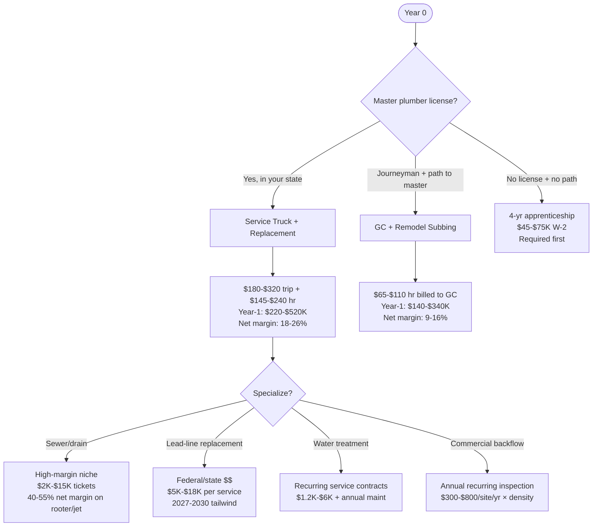
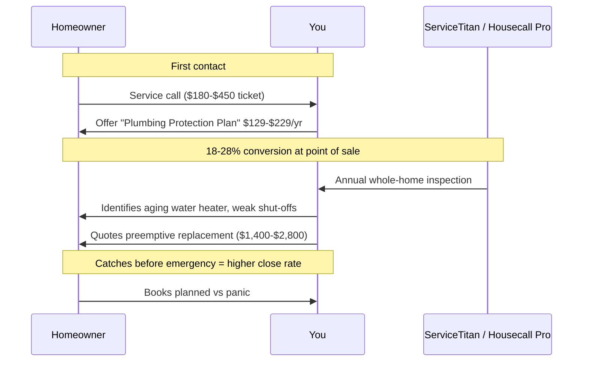

## The Plumbing Business In 2027 — Better Math Than People Realize

Plumbing has a reputation problem. People hear "trades" and think the margins are similar across plumbing, HVAC, and electrical. They're not. **Plumbing in 2027 is structurally the highest-margin per labor hour of the residential trades** — and the gap is widening, not closing. Three forces drive it: BLS projects 6% job growth for plumbers through 2032 with 42,600 openings annually against a labor pool where the median age is 41 and the apprenticeship pipeline has run thin for a decade. The American Society of Plumbing Engineers estimates a **shortfall of 550,000 plumbers nationally by 2027**, which translates directly into pricing power.

Add to that two regulatory tailwinds: most states have tightened licensing reciprocity (good for incumbents, bad for new entrants), and water-quality concerns (lead-pipe replacement under the Bipartisan Infrastructure Law, PFAS remediation under the 2024 EPA rule) are creating $48B in federally-funded residential plumbing work over the next decade. The operator who's licensed, on a service-call truck, and ready for the lead-line replacement boom is in the best demand position any trade has ever offered.

## The Four Real Business Models — Pick Honestly

**Model 1 — Service Truck With Replacement Capability.** Master plumber license + EPA cert (for any water heater work or refrigerant lines) + state contractor license. You handle service calls (clogged toilet, leaking faucet, water heater failure) and the bigger ticket replacement work (water heaters, repipes, sewer service line replacement). This is where the money is — and the licensing barrier is high enough that competition is constrained.

**Model 2 — GC / Remodel Subcontractor.** Journeyman or master plumber working as a subcontractor for general contractors doing kitchen/bath remodels and new construction. Margins are thinner because you're bidding against other subs and dealing with GC payment terms (30–90 days). This is the right path if you can't yet get to master license, but it's a transition stage — not a destination.

**Specialization layers (added on top of Model 1):**
- **Sewer/drain (rooter + jetting + camera).** Highest-margin specialization in residential plumbing. Equipment is moderately expensive ($15K–$40K for jetter + camera setup) but per-job profitability is 40–55% net margin and call volume is recession-resistant (clogs don't care about the economy).
- **Lead service-line replacement.** The 2021 Bipartisan Infrastructure Law allocated $15B specifically to lead pipe replacement, with the EPA's 2024 LCRI (Lead and Copper Rule Improvements) mandating municipal inventory completion by 2027 and replacement plans by 2034. Operators with state DEP/EPA certification in lead-line replacement are getting per-job tickets of $5K–$18K with much of the cost reimbursed by utility/state programs.
- **Water treatment.** Whole-home filtration, water softeners, PFAS remediation systems. Equipment-and-install tickets of $3K–$9K with $200–$600/year recurring service contracts.
- **Commercial backflow inspection.** Annual recurring inspections required by most municipalities for commercial buildings, restaurants, irrigation systems. $300–$800/site/year. With route density of 100+ sites, this is a $40K–$200K/year recurring revenue layer on top of regular plumbing work.

## Year-1 / Year-3 Unit Economics

| Lever | Model 1 (Service+Replace) | Model 2 (GC Sub) | + Sewer/Drain Spec | + Lead-Line Spec |
|---|---|---|---|---|
| License required | Master + state | Journeyman OK | Master + drain | Master + EPA/state lead cert |
| Startup capex | $80K-$180K | $35K-$80K | +$25K-$50K | +$15K-$35K |
| Truck setup | $55K-$95K | $25K-$45K | +$5K (camera/jetter mount) | +$8K (specialty fittings) |
| Inventory float | $12K-$25K | $5K-$12K | +$10K-$20K | +$5K-$12K |
| Trip charge / billed rate | $180-$320 / $145-$240 hr | $65-$110 hr to GC | $250-$450 + jet rate $325-$525 hr | $200-$350 + reimbursement |
| Avg ticket | $400-$2,400 | $4K-$18K (project) | $850-$6,500 (clog to sewer replace) | $5K-$18K (line replace) |
| Year-1 revenue | $220K-$520K | $140K-$340K | $280K-$680K | $200K-$480K |
| Year-1 owner pay | $90K-$180K | $50K-$110K | $120K-$240K | $90K-$190K |
| Net margin mature | 18-26% | 9-16% | 28-38% (drain), 22-30% (mixed) | 24-32% |
| Year-3 scaleable | $700K-$1.6M | $350K-$850K | $1.2M-$2.8M (2-3 trucks) | $600K-$1.4M |
| Cash conversion | <7 days | 30-90 days | <5 days (homeowner direct) | 30-120 days (municipal reimb) |

The Model 2 → Model 1 transition is where most plumbing operators leak the most value. The day you get your master license, the rate you can charge homeowners jumps from $65-$110/hr (as a GC sub) to $180-$320 trip charge + $145-$240/hr. **Most operators wait too long to transition because they're risk-averse — every month delayed costs $5K-$15K in foregone margin.**

## The Maintenance / Service Plan Math (Mostly Underused In Plumbing)

Plumbing maintenance plans are massively under-leveraged in 2027. HVAC has trained homeowners to expect a $200/year service plan — plumbing hasn't. ServiceTitan's 2024 contractor benchmarks show **median plan conversion at the service call is 18–28%** for plumbing operators who actually pitch it (vs HVAC's 30–40%). The math:

- 250 active plans × $179/yr = $44,750 recurring revenue base
- Each plan visit (annual whole-home inspection) catches an average of $340 in addressable repair work
- Plan customers buy water heater / repipe replacements from the incumbent service provider at 70–80% rate vs 25–35% for non-plan customers (Service Titan data)
- Plan retention year-over-year: 82% (higher than HVAC because plumbing emergencies are scarier)

**Operators with 200+ active plans have a structural advantage over plan-less competitors** — they have a smoother revenue floor through slow months, a warmer pipeline for replacement work, and customer loyalty that's hard to displace.

## The Lead Service Line Replacement Boom (2025-2030)

The Lead and Copper Rule Improvements (LCRI) finalized by EPA in October 2024 mandate that **every water utility in America must replace every lead service line within 10 years (most by 2037)**. The federal funding is real: $15B from the Bipartisan Infrastructure Law specifically for lead pipe replacement, plus state-level matching funds in MA, NJ, IL, MI, OH, PA, WI, NY (the states with the most lead lines).

What this means commercially:

1. **Most service lines (the pipe from the water main to the house) are owned by the homeowner, not the utility.** Replacement is a plumbing contractor job, not a utility job. The contractor digs the trench, replaces the line (copper or PEX), connects to the meter, restores the property.
2. **Per-job revenue is $5K–$18K depending on length and excavation complexity.** Materials are $400–$1,200; labor + equipment is $2K–$5K; the rest is margin + contingency.
3. **Many programs cover 80–100% of homeowner cost via federal/state grants.** The plumber gets paid (often direct from the utility); the homeowner has no out-of-pocket. This dramatically improves close rates.
4. **Geographic concentration matters.** Chicago, Newark, Pittsburgh, Cleveland, Milwaukee, Detroit, and dozens of mid-size cities have lead-line densities of 20–40% of homes. Operators in these metros who get certified (often a 2-day state DEP course) are looking at $400K–$900K of revenue per truck per year just from this work.

If you're in a high-lead metro, get the cert and the EPA training in 2025. This is the closest thing to a guaranteed revenue boom that the trades have seen in a generation.

## How To Land The First 50 Customers

| Channel | Strategy | Year-1 Pipeline Contribution |
|---|---|---|
| Google Business Profile + reviews | First 25 jobs at fair margin, ask for review at the truck | 30-45% |
| Local Service Ads (LSA) | Pay-per-lead, Google-screened, $35-$95 per qualified plumbing lead | 15-25% (after 30+ reviews) |
| Property managers | 8-15 PMs in zip codes, 24-hr response guarantee | 15-25%, recurring |
| Real estate agents | Pre-listing inspections, water heater age checks | 8-12%, lumpy |
| Manufacturer dealer programs | Rinnai / Navien / Bradford White tankless dealer rebates | 8-15% of replacement |
| Lead-line cert + utility partnership | Get on city/county replacement contractor list | 20-40% in lead-density metros |
| Yelp + Thumbtack | Test small, kill if ROI < 1.5x | 5-10% if at all |
| Truck wrap + uniform | Photogenic truck = mobile billboard | 3-8% drive-by |

Plumbing service calls have a unique characteristic: **emergency calls (burst pipe, sewer backup, no hot water) are 60% of inbound and they're price-insensitive**. The homeowner with sewage on the basement floor is not comparison-shopping. They're calling the first reasonable result on Google. Operators who rank top-3 on GBP for "emergency plumber [your city]" capture this disproportionately.

## What's Changing 2025-2027 You Need To Plan Around

**PEX is winning the rough-in market.** Copper is still spec'd in some high-end builds and most commercial, but residential repipes are 70%+ PEX in 2027 (vs 35% in 2018). The operator who's fast with PEX-A (Uponor, Rehau) does whole-home repipes in 2 days vs 4–5 days for copper. Margin: 25–35% better per repipe.

**Tankless water heaters are now mainstream for replacement.** Rinnai, Navien, Noritz tankless gas units run $4,000–$8,000 installed vs $1,800–$3,200 for traditional tank. Margin per ticket: $1,200–$3,000 higher. The dealer programs include manufacturer training, lifetime parts warranties (if installed by certified dealer), and 15–25% rebate kickbacks. Get certified on at least one brand.

**Heat pump water heaters are the wild card.** IRA tax credit (25C) covers 30% up to $2,000 on a heat pump water heater. The technology works but installation is tricky (needs proper venting + ambient temperature considerations). Operators who learn the install spec correctly are commanding $4,500–$7,500 tickets — but ones who botch the install have 18–24% callback rates which destroy margin.

**Trenchless sewer technology is gating market share.** Cured-in-place pipe (CIPP) lining and pipe bursting equipment lets you replace a residential sewer line without trenching the front yard — $8K–$22K tickets vs $4K–$12K for trench, and the homeowner pays the premium because they don't lose their lawn/driveway. Equipment is $35K–$120K but it pays back in 18–24 months in markets with mature trees and concrete drives.

## The Bear Case — What Kills Plumbing Contractors

Four failure modes:

1. **Underpricing service calls** (32% of failures). Operator quotes $95/hour because that's what they were paid as an employee. Fully-loaded cost is $115/hour. Every hour loses $20. Mitigation: flat-rate pricing book (Profit Rhino, Coolfront, ServiceTitan price book), never deviate.

2. **Cash flow collapse on GC subbing** (24% of failures). Operator does 60 days of net-60 work for a remodel GC. GC goes bankrupt. Operator has $80K in unpaid invoices and $40K in payroll due Friday. Bankruptcy follows. Mitigation: never carry >$15K AR with a single GC; demand mechanic's lien rights protection; deposits up front on new construction work.

3. **Licensing lapse** (18% of failures). Master plumber forgets to renew CE; lapses 30 days; insurance carrier audits; coverage suspended; all work stops. Mitigation: calendar reminder + auto-pay on CE provider; redundant cert with state-recognized backup org.

4. **Workers comp surprise** (15% of failures). Plumbing workers comp is 2.5–7% of payroll depending on state. Operator hires first employee, gets quoted 9% from wrong-class carrier, eats the margin. Mitigation: 3 quotes from trade-specialty carriers (Federated, FCCI, NEXT) before hiring number 1.

## Tools, Vendors, And Where The Money Flows

| Need | Vendor / Resource | Why |
|---|---|---|
| Master license + CE | State plumbing board + IAPMO (https://www.iapmo.org/) or PHCC (https://www.phccweb.org/) | Industry-recognized CE; required |
| Flat-rate pricing book | Profit Rhino (https://profitrhino.com/), Coolfront, ServiceTitan price book | Doubles average ticket |
| CRM + dispatch | ServiceTitan (https://www.servicetitan.com/), Housecall Pro, FieldEdge | Required at $300K+ revenue |
| Tankless / water heater dealer programs | Rinnai, Navien, Bradford White, Rheem Pro Partner | Premium leads + rebates |
| Lead-line cert | Your state DEP + EPA WaterSense (https://www.epa.gov/watersense) | Required for federal-funded replacement work |
| Trenchless sewer training | Perma-Liner, Pow-r Mole, T-Doctor | Pays for itself in 18-24 mo |
| Workers comp + GL | Federated Insurance, FCCI, NEXT, Hiscox | Trade-specialty rate classes |
| Industry data | BLS (https://www.bls.gov/ooh/construction-and-extraction/plumbers-pipefitters-and-steamfitters.htm), PHCC contractor surveys | Cite in pitch decks + pricing |
| Apprentice pipeline | UA (United Association) for unionized; PHCC + local trade schools | Pay bottleneck on scaling |

## Bottom Line For The 2027 Operator

If you're **starting from zero**, get into a state-recognized apprenticeship NOW (UA via union or PHCC via merit-shop ABC). The 4-year clock is brutal but the master license at the end is worth $80–$150K/year in additional billing rate vs unlicensed work.

If you're **already a master plumber**, you're sitting in the highest-leverage trade position in 2027. Build Model 1 with a sewer/drain specialization layer for highest margins. In a lead-density metro, add lead-line replacement certification — this is a 5-year guaranteed revenue tailwind.

If you're **a journeyman with 4+ years**, Model 2 (GC subbing) for the next 18–24 months while studying for master exam. The day you pass: transition to Model 1. The rate jump pays back the truck + license investment in 90 days. Don't drag your feet.

The unifying truth: plumbing is the most operator-friendly trade in 2027 because the licensing barrier protects margins. The operators who specialize (sewer, lead-line, water treatment) layer additional 8–15% margin on top of the base service business. The operators who don't are running commodity service trucks and competing on $59 trip charges — race to the bottom.
