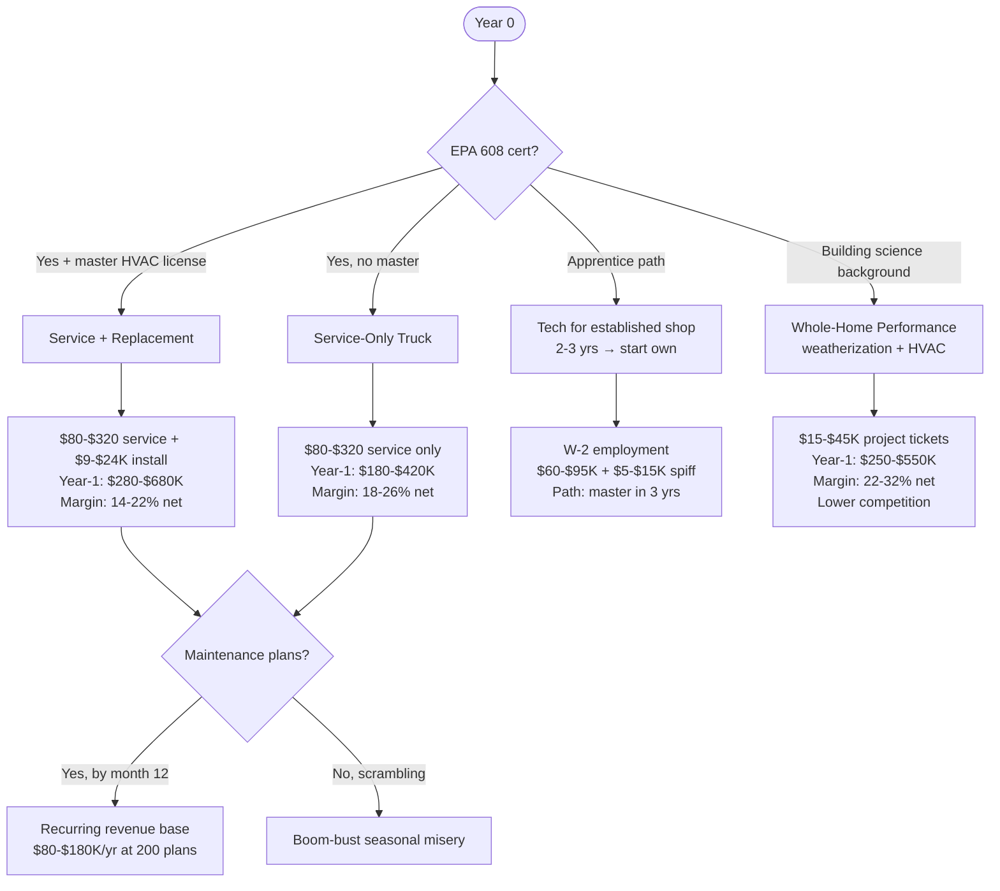
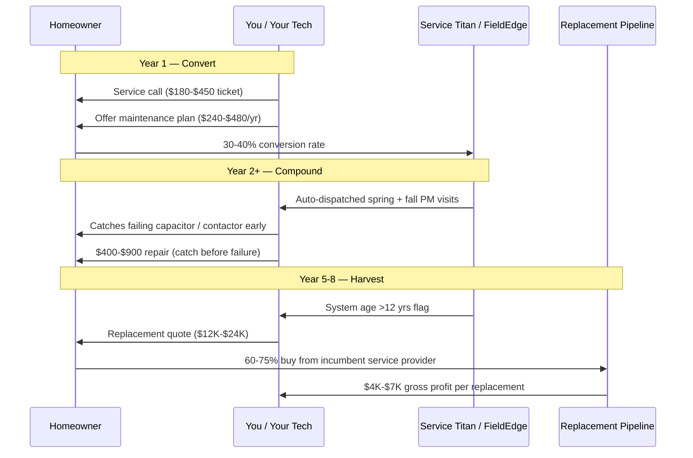

## Why HVAC Is The Highest-Ceiling Skilled Trade Of The Decade

The HVAC business in 2027 is structurally the best capex-to-revenue ratio in the trades, and the gap is widening every quarter. Three converging forces explain it: **the Inflation Reduction Act tax credits** (up to $2,000/year for heat pumps + $1,200 for envelope work, extended through 2032), **the R-410A → R-454B/R-32 refrigerant transition** (forcing equipment replacement on a forced timeline starting January 2025), and **climate-driven cooling demand** in metros that historically barely needed AC. The BLS projects **9% job growth for HVAC techs through 2032 with 37,700 openings per year**, against a workforce where the median age is 40 and AHRI estimates 60,000 net technician shortages by 2027.

Translation: residential service calls are running $180–$320 trip-charge in major metros (was $89–$140 in 2020), new-system replacement tickets are landing at $9K–$24K (was $4K–$12K), and the constraint on growth is your truck count and EPA-certified tech count, not demand. The operator who can run a clean truck fleet with disciplined flat-rate pricing and one maintenance-plan flywheel is staring at the highest-margin trade business available in 2027.

## The Four Real Business Models — Pick By Capex And Speed-To-Cash

**Model 1 — Full-Service Replacement Shop.** EPA 608 universal + state HVAC license + business license. Tickets range from a $180 trip charge for a capacitor swap up to a $22,000 dual-zone heat pump replacement. The unit economics are great when you do it right and brutal when you don't. Capex is meaningful: $90K–$220K to get one truck on the road with proper tools, lift, recovery machine, vac pumps, and starting inventory.

**Model 2 — Service-Only Truck.** Same EPA cert but you don't do new-system installs. You diagnose, repair, replace components, do maintenance. Capex is lower ($55K–$110K). Margins are higher per labor hour because you're not eating the supplier markup chain on equipment. Ceiling is lower per ticket but you can serve more customers per week.

**Model 3 — W-2 Tech at Established Shop.** Skip the capex entirely, work for someone else, learn the business while earning $70K–$130K total comp (base + spiffs + overtime). Three years here teaches you what doesn't show in YouTube videos: how to actually quote replacements, how distributors price equipment, how to dispatch routes profitably.

**Model 4 — Whole-Home Performance / Weatherization.** This is the asymmetric play in 2027. Building Performance Institute (BPI) cert + RESNET HERS rater + HVAC license gets you doing energy audits, blower door tests, insulation upgrades, AND HVAC replacement as a connected package. Tickets are larger ($15K–$45K is normal), IRA tax credits are richer, competition is materially thinner because most HVAC contractors don't have the building-science background.

## Year-1 / Year-3 Unit Economics

| Lever | Model 1 (Full Service) | Model 2 (Service Only) | Model 4 (Whole-Home Performance) |
|---|---|---|---|
| EPA 608 + state license | Required (universal cert) | Required | Required + BPI/RESNET |
| Startup capex | $90K-$220K | $55K-$110K | $120K-$280K |
| Truck setup | $55K-$95K | $35K-$60K | $65K-$110K |
| Equipment inventory | $25K-$70K | $8K-$20K | $35K-$90K |
| Trip charge / service rate | $180-$320 / $145-$210 hr | $180-$320 / $145-$210 hr | $250-$450 site visit |
| Replacement ticket | $7K-$24K | N/A | $15K-$45K bundled |
| Year-1 revenue | $280K-$680K | $180K-$420K | $250K-$550K |
| Year-1 owner pay | $120K-$220K | $80K-$160K | $130K-$240K |
| Net margin mature | 14-22% | 18-26% | 22-32% |
| Year-3 scaleable | $1.5M-$4.5M (3-6 trucks) | $600K-$1.4M (2-3 trucks) | $850K-$2.2M (specialist crew) |
| Maintenance-plan ARR | $80K-$300K (at scale) | $50K-$200K | $40K-$120K |

The Year-3 number for Model 1 is what makes HVAC unique among the trades. A well-run 4-truck residential HVAC shop in a Sunbelt metro with 600 active maintenance plans is a $2.5M–$4M revenue business that exits at 4–7x SDE — the highest exit multiple in trades. **Operators who build to that profile cleanly are routinely selling to private equity roll-ups at $3M–$8M total enterprise value by year 6–8.**

## The Maintenance Plan Flywheel Is The Entire Game

The math: **a $360/year maintenance plan customer typically generates $1,800–$3,200/year in lifetime annual revenue** when you include repair work caught during plan visits and the eventual system replacement that goes to the incumbent service provider 60–75% of the time. ServiceTitan's 2024 contractor benchmarks put the median maintenance-plan retention at 78% year-over-year. So 200 plans at year 2 → 156 still active at year 3, plus the new conversions = compounding ARR base that smooths the seasonal boom-bust.

**Stop everything else and build maintenance plans first.** Operators who chase replacement work without a maintenance-plan flywheel are running a feast-or-famine business where July's good week and January's terrible week average out to mediocre. Operators with 300+ plans have a $90K+/year service-revenue floor that pays the shop's overhead through the slow months.

## The R-454B / R-32 Transition Is Your 2025-2027 Cash Engine

January 1, 2025 ended manufacturer production of new R-410A systems for most residential applications. The replacement refrigerants (R-454B from Carrier/Trane/Goodman and R-32 from Daikin/Mitsubishi) require different installation procedures, different leak detection equipment, different recovery practices, and have a mildly flammable (A2L) classification that requires updated training.

What this means commercially:

1. **Every R-410A system in service is now in a "no new equipment available" state.** Repair parts are still available (and will be for 5–10 years), but the homeowner doing a major repair on a 10+ year-old R-410A system increasingly hears the "you should replace instead" pitch and converts. Replacement volumes are running 18–32% higher YoY in Sunbelt metros (per ACCA 2024 industry data).
2. **Manufacturer dealer programs are paying premium installer rebates for early R-454B/R-32 certification.** Goodman, Carrier, Trane, and Daikin all run $500–$1,500/system installer rebates for the first 25–100 systems installed by a certified dealer.
3. **CE-current operators are taking market share from older operators.** Older HVAC techs who don't get R-454B/A2L certified are essentially capped at servicing the legacy R-410A fleet. That fleet shrinks 8–12% per year. The certified operator captures the replacement pipeline and the legacy service work.

## How To Land The First 50 Customers (Model 1 or 2)

The local-search playbook for HVAC is similar to electrical but with two material differences: emergency calls (no AC in July) are pricier and more reactive, and maintenance plans are the long game.

| Channel | Strategy | Expected Year-1 Contribution |
|---|---|---|
| Google Business Profile + reviews | First 25 jobs at fair margin, ask for review at truck-side | 25-40% of inbound calls |
| Property managers | Visit 8-15 PMs in your zip codes, offer 24-hr response guarantee | 15-25% of revenue, recurring |
| Real estate agents | Pre-listing inspection partnerships (find issues before listing) | 8-15% of revenue, lumpy |
| Manufacturer dealer program | Lennox, Carrier, Trane, Goodman — get on at least one | 10-20% of replacement leads |
| Google Local Service Ads (LSA) | Pay-per-lead, Google-screened, $40-$120 per qualified lead | 15-25% once GBP reviews >50 |
| Facebook geo-targeted ads | Maintenance plan offers ("$159 spring tune-up") | 5-12% of plan conversions |
| Truck wrap + uniform | Photogenic truck = mobile billboard; expect 1-3 calls/wk from drive-by visibility | 3-8% of revenue |

The first 6 months: focus relentlessly on review velocity and PM relationships. Skip paid ads until your GBP has 30+ reviews — you'll burn ad budget without converting. Hit the PM circuit hard because one good PM relationship at a 40-unit complex = guaranteed $30K–$80K/year in repair and replacement work that's largely seasonally smooth.

## What's Actually Changing 2025-2027 That Matters

**Heat pump electrification is creating the biggest residential replacement boom in 40 years.** The IRA 25C tax credit (up to $2,000/year on heat pumps) is real money to homeowners, and many states (CA, MA, NY, ME, WA, OR) layer additional rebates of $1,500–$8,000 per system. Mass deployment is creating a learning curve — heat pumps require different sizing methodology (you need real Manual J load calcs, not rules-of-thumb), different ductwork sizing, and proper cold-climate models with auxiliary heat strategies. Operators who learn to do this correctly are winning $20K–$35K tickets while competitors quote $12K replace-in-kind jobs.

**Energy-rebate paperwork is becoming a contractor service.** EnergyStar, Inflation Reduction Act, and state-level rebates require documentation that homeowners hate. Operators who handle the rebate filing as part of the install service (and bake the cost into pricing) are seeing 18–28% higher close rates per Energy Vanguard's 2024 contractor survey. Get good at the paperwork or partner with a rebate-processing firm like Energy Federation.

**Smart-home integration is no longer optional for premium installs.** Ecobee, Honeywell T-Series, Nest, and Sensi smart thermostats are the table-stakes finish for any installation over $15K. Add zoning controls (Honeywell TrueZone, Ecobee with smart sensors) for an extra $1,200–$3,500 in profitable upsell on premium projects.

## The Bear Case — What Kills HVAC Contractors

Four failure modes, ranked by frequency:

1. **Underpricing in seasonal panic** (35% of failures). Operator quotes 15% under cost during a slow March because cash is tight. Books their May/June at unprofitable prices. Hits summer fully booked but losing money on every job. End state: bankruptcy or sale to a roll-up at 0.4x revenue. Mitigation: flat-rate pricing book (Profit Rhino, FieldEdge), never deviate, never quote hourly.

2. **No maintenance plans** (25% of failures). Operator runs feast-or-famine on service calls and replacement work, has no recurring revenue base, gets crushed in the November–February slow period. Goes into debt to pay payroll. Mitigation: every service call gets the maintenance plan pitch; aim for 30% conversion in year 1, 250+ active plans by end of year 2.

3. **Tech retention failure** (22% of failures). Operator pays $60K base when the market is at $75K. Loses senior tech to competitor. Replacement tech costs $8K–$15K in recruiting + 6 months ramp. Mitigation: pay top-quartile + spiffs + truck + clean uniforms + Saturday-shift premium. The math of paying $10K more annually beats losing the tech.

4. **R-454B / A2L training lag** (18% of failures). Operator doesn't get certified on A2L refrigerants, can't quote new equipment, loses replacement pipeline to competitor. Mitigation: ESCO Group / AHRI certifications, $400–$1,200, complete in Q1 of every transition year.

## Tools, Vendors, And Where The Real Money Flows

| Need | Vendor / Resource | Why |
|---|---|---|
| EPA 608 + A2L cert | ESCO Group (https://www.escogroup.org/), HVAC Excellence | Industry-recognized |
| Flat-rate pricing book | Profit Rhino (https://profitrhino.com/), Coolfront (https://coolfront.com/) | Doubles average ticket vs hourly |
| CRM + dispatch + invoicing | ServiceTitan (https://www.servicetitan.com/), FieldEdge, Housecall Pro | Required at $400K+ revenue |
| Manufacturer dealer program | Carrier Factory Authorized (CFAD), Lennox Premier, Trane Comfort Specialist | Premium leads + rebates |
| Industry data + benchmarks | ACCA (https://www.acca.org/), AHRI (https://www.ahrinet.org/) | Cite in pitch decks |
| Workers comp + GL | NEXT, Hiscox, Federated Insurance (trade-specialty) | Generic carriers misclassify |
| BPI / RESNET certification | Building Performance Institute (https://www.bpi.org/), RESNET (https://www.resnet.us/) | Model 4 specialization |
| Heat pump training | NEEP Cold Climate Heat Pump training, Mitsubishi/Daikin factory schools | Required for Northeast/Midwest |
| Rebate processing partner | Energy Federation (https://www.efi.org/), trade-association rebate desks | Offload IRA/state paperwork |

## Bottom Line For The 2027 Operator

If you're **starting from zero with EPA 608 and 2-3 years in the trade**, Model 2 (service-only) in a metro with hot summers (anywhere in TX, FL, AZ, NV, GA, NC, SC, TN, OK, CA Central Valley) is the highest-probability path to $200K+ owner pay by year 2. Build maintenance plans aggressively, add replacement capability in year 2 with retained earnings (or SBA 7(a) for the truck + inventory).

If you're **a journeyman or master in a strict-license state (CA, NY, IL, MA)**, the licensed-operator scarcity is on your side. Go straight to Model 1 with a focused replacement strategy + maintenance plan flywheel. Year-3 path to $1M+ revenue is realistic if you can clear 4 trucks.

If you have **building science background (engineering, weatherization, energy audits)**, Model 4 (whole-home performance) is your asymmetric play. The IRA tax-credit-funded homeowner is your ideal customer, and the competition from generic HVAC contractors is materially thinner. $250K–$550K year-1 revenue at higher net margins than the other models.

The unifying truth: HVAC in 2027 is one of the few skilled trades where you can build a $2M+ revenue business that exits at a real multiple to a roll-up buyer. The operators who understand that are building toward exit-readiness from day 1 — clean books, ServiceTitan-tracked metrics, 300+ maintenance plans, top-quartile tech retention. The ones who don't are running lifestyle businesses that have no exit value beyond the trucks and inventory.
