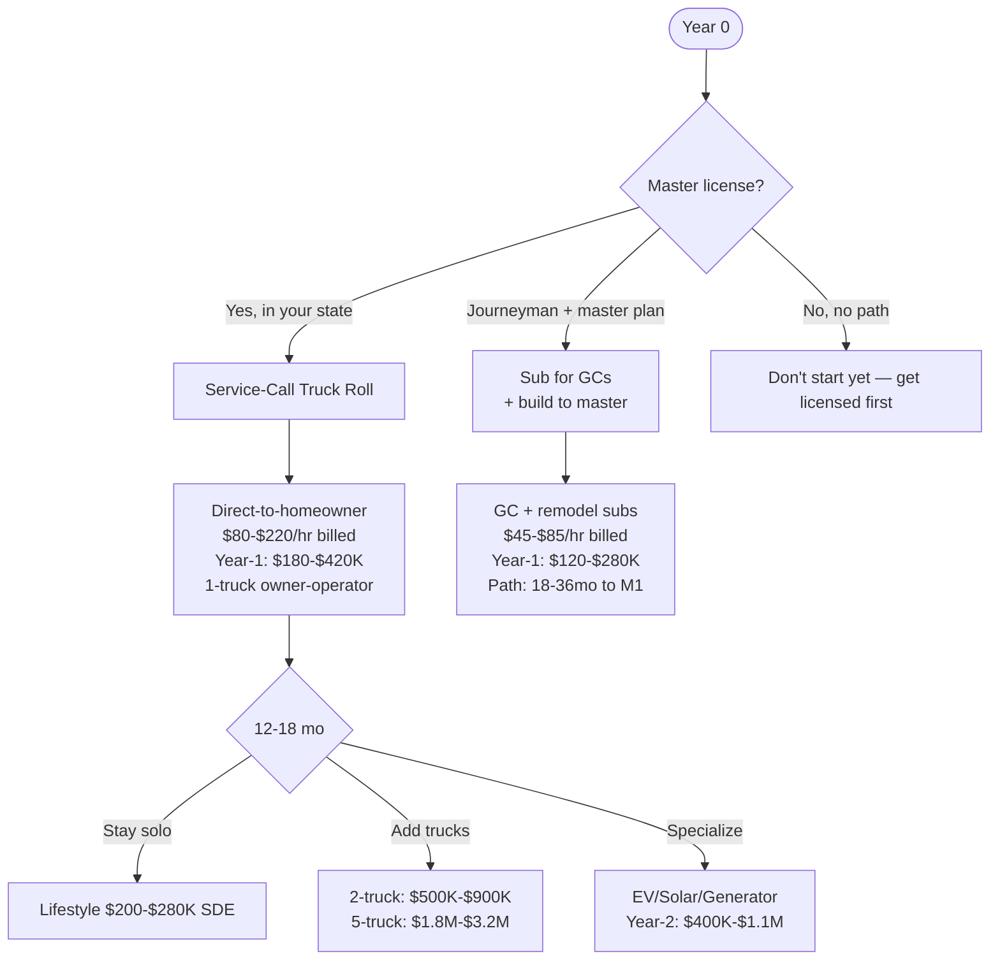
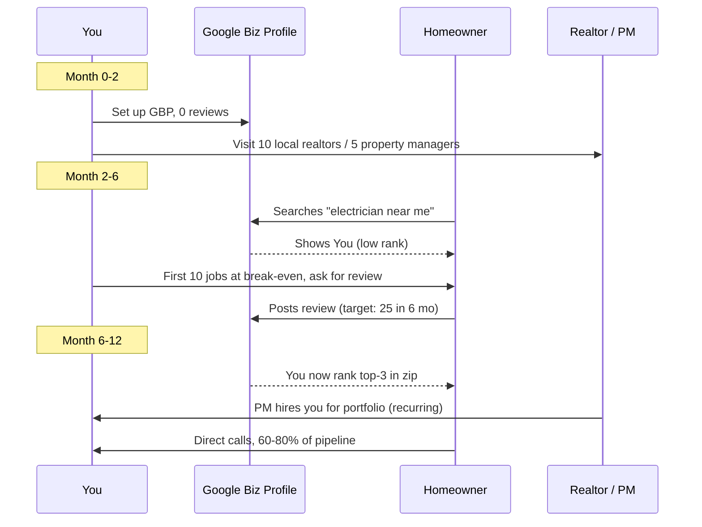

## Why Electrical Is The Best Skilled-Trade Business Math In 2027

The math on residential/light-commercial electrical contracting in 2027 is structurally better than HVAC, plumbing, or general contracting, and the gap is widening. Three forces are converging: the BLS projects **6% job growth for electricians through 2032 (about 73,500 openings per year)** against a labor pool where **the median electrician age is 41 and 25% of the workforce will retire by 2030** (per the Independent Electrical Contractors 2024 workforce report). At the same time, **electrification demand is exploding** — EV chargers, heat pumps, solar tie-ins, panel upgrades to 200A/400A service — at a rate that's pulling per-job revenue 35–60% higher than the 2019 baseline.

Translation: you can charge more, you can fill the truck calendar in any metro with >250K population, and you don't compete on price the way handymen and lawn-care operators do. The constraint is licensing — and that's also the moat.

## The Three Real Business Models — Pick Honestly

**Model 1 — Direct-to-Homeowner Service Truck.** You're a master electrician with a wrap-truck, a service-call business, flat-rate pricing (Profit Rhino, Service Titan price book). Customers call, you go, you fix. This is the highest-margin model and the one most likely to clear $500K SDE within 4 years if executed well.

**Model 2 — GC / Remodel Subcontractor.** You're a journeyman (or master) working as a 1099 sub for general contractors and remodel companies. They bring the work, you do the rough-in and trim, they pay net-30 or net-60 (the cash flow is rough). This is the right model if you can't get to master license fast and you need to build technical chops.

**Model 3 (specialization layer) — EV / Solar / Generator / Smart-Home.** You can specialize on top of Model 1 once it's stable. EV charger installs alone are a $1.5B+ residential market (Wood Mackenzie 2024 EV charging infrastructure report), and the technical bar is "competent licensed electrician who also follows the Eaton/ChargePoint/Tesla install playbook." Most general electricians are too busy to chase it, which is the operator's edge.

## Year-1 / Year-3 Unit Economics

| Lever | Model 1 (DTC Service) | Model 2 (GC Sub) | Model 3 (EV/Solar Specialist) |
|---|---|---|---|
| Licensing path | Master required | Journeyman OK | Master + EV cert recommended |
| Startup capex | $40K-$90K | $15K-$35K | $50K-$120K |
| Truck setup | $35K-$65K (used to new) | $15K-$25K | $40K-$70K + lift |
| Inventory float | $8K-$18K | $2K-$5K | $12K-$25K |
| Billed rate | $80-$220/hr | $45-$85/hr | $90-$250/hr (job-priced) |
| Avg ticket | $400-$1,800 | $2K-$12K (project) | $800-$8K (EV) / $4K-$25K (solar) |
| Year-1 revenue | $180K-$420K | $120K-$280K | $200K-$520K |
| Year-1 owner pay | $80K-$160K | $55K-$110K | $90K-$190K |
| Year-3 revenue scaleable | $500K-$1.2M (2 trucks) | $300K-$650K | $600K-$1.5M |
| Net margin (mature) | 18-28% | 8-15% | 22-35% |
| Cash conversion cycle | <7 days (homeowner pays at job) | 30-90 days (GC net terms) | 7-30 days |

The cash conversion piece is what kills Model 2 operators. A GC who takes net-60 on your work means you're effectively financing the GC's business. If they pay slow or go under, you eat receivables. The IRS isn't sympathetic when payroll is due Friday and the GC's check hasn't cleared. **Model 1's cash-on-the-truck or 50%-deposit pricing is a massive defensive moat against this.**

## The Licensing Reality In 2027 (State By State, Roughly)

Electrical licensing is state-by-state with reciprocity that's improving but still partial. The 2025–2027 picture, rough:

| Tier | States | Path to Master | Notes |
|---|---|---|---|
| **Fast-track** | TX, GA, NC, SC, TN, FL | 4 yrs apprentice + journeyman + 2 yrs as journeyman → master exam | Reciprocity strong in Southeast |
| **Standard** | OH, AZ, NV, IN, KY | 4-yr apprenticeship → journeyman → 2-4 yrs → master | Per-county variances |
| **Strict** | CA, NY, IL, MA, WA, NJ | 8,000+ hours documented apprenticeship → journeyman → 4+ yrs → master + business law exam | Hardest path; biggest opportunity once cleared |
| **Quirky** | OR, CO, MN | State-specific quirks (Oregon's "Limited Energy Technician" is separate); check Department of Labor sites | Read the rules carefully |

If you're starting from zero: aim for one of the Southeast fast-track states if you have geographic flexibility, or commit to the 7–10 year path in a strict state where master electricians get $250+/hour billed rates because supply is constrained. The strict-state path is harder but the eventual margin is materially better.

**Critical 2027 wrinkle:** the 2026 NEC code cycle introduces several changes that are tripping up older operators — GFCI requirements on more circuits, ground-fault and arc-fault rules around EV chargers, and updated load calculation methods for whole-home electrification scenarios. **CE-current operators have a real advantage in the next 24 months** — old-school electricians are doing rough-ins that fail inspection and burning their GC relationships.

## How To Find The First 50 Customers (Model 1)

The mechanical playbook for a new Model 1 electrician:

1. **Get the Google Business Profile dialed in first.** 84% of local-services calls in 2024 started with a Google "near me" search (BrightLocal Local Consumer Review Survey). You won't rank without reviews. So:
2. **First 25 jobs: do them at break-even or low margin, ask for the review immediately while at the truck.** "Hey, the work's done — if you're happy, the highest-value thing you could do for me is a Google review. Here's the QR code." 60–70% of customers will do it if you ask at the right moment.
3. **Visit 5–10 property management companies in person** in your first month. PMs need a reliable on-call electrician and will pay $80–$140/hr for predictability. One good PM relationship = $30K–$80K/year recurring.
4. **Get on Yelp ($50–$300/mo for Yelp ads is sometimes worth it in dense metros)** and Thumbtack/Angi (lower ROI but works for some). Test, don't commit big budget early.
5. **Skip Google Ads until month 6.** New GBP profiles without review velocity burn ad budget at $25–$60 CPC for "emergency electrician" without converting.

## What's Changing 2025-2027 That Matters For Your Plan

**EV charger installs are no longer a "specialty" — they're routine.** A Level 2 install (60A circuit + smart charger + permit) bills $800–$2,200. With 2.8M EVs sold in the US in 2024 (per Cox Automotive 2024 year-end report), every metro is seeing 200–600 install requests per month. Even capturing 1% of your metro's flow is real revenue.

**Heat pump electrification is creating panel-upgrade work.** Most pre-2000 houses have 100–125A panels that can't carry a heat pump + EV charger + induction range. A panel upgrade to 200A is $2,500–$5,500 standalone, or $4,500–$9,000 if you're doing a service-mast change. The 2022 Inflation Reduction Act tax credits ($150–$600 for panel upgrades, $500–$8,000 for heat pumps) are pushing homeowner demand into 2027.

**Generator backup is a growth segment in storm-prone metros.** Generac and Kohler both pay strong dealer margins (15–25%) for licensed-installer partners. The 2024 hurricane and ice-storm cycles drove permit volumes up 40%+ YoY in Texas, Florida, and the Carolinas (US Census permit data).

**Apprentice labor is the bottleneck for scaling.** Plan to pay $22–$32/hour for a strong second-year apprentice in 2027 — up from $15–$22 in 2020. The shop that can attract and retain apprentices is the shop that scales beyond one truck.

## The Bear Case — What Kills Electrical Contractors

Three failure modes I see most often:

1. **Underpricing service calls** (38% of failures). Operator quotes $65/hour because that's what they were paid as a journeyman, but their fully-loaded cost (truck, insurance, materials, payroll tax, overhead) is $58/hour. Margin is 11% before any owner profit. Service Titan's 2024 contractor benchmarks show the median residential service electrician is at $145/hour billed for break-even — quote below that and you're losing on every job.

2. **Workers comp surprise** (25% of failures). Electrical workers comp rates are 1.8–4.2% of payroll depending on state. Operator hires their first employee, doesn't shop carriers, gets quoted 6%+ from an unsuited carrier, eats the margin. Mitigation: get 3 quotes via NEXT, Hiscox, and a local independent broker before hiring number 1.

3. **NEC code lag** (20% of failures). Operator does rough-ins to the 2020 NEC standard when the AHJ has adopted 2023 or 2026. Inspections fail, GCs lose trust, the brand corrodes. Mitigation: annual CE through IAEI or your state's CE provider, $400–$800/year, mandatory not optional.

## Tools, Vendors, And Where The Money Actually Flows

| Need | Vendor / Resource | Why |
|---|---|---|
| Continuing education + NEC code | IAEI (https://www.iaei.org/) and Mike Holt (https://www.mikeholt.com/) | The two recognized standards; CE-credit-bearing |
| Flat-rate pricing book | Profit Rhino (https://profitrhino.com/) or Service Titan price book | Stop quoting hourly — flat-rate doubles ticket size |
| CRM + dispatch | Service Titan (https://www.servicetitan.com/) for 5+ trucks; Housecall Pro for 1-4 trucks | Stop using spreadsheets at $250K+ revenue |
| Workers comp + GL | NEXT Insurance, Hiscox, or local trade-specialized broker | Don't use State Farm or USAA — wrong class codes |
| Apprentice recruitment | NJATC / IBEW for unionized; ABC merit shops for non-union; local trade schools | Pipeline matters more than salary at scaling stage |
| Industry data | BLS (https://www.bls.gov/ooh/construction-and-extraction/electricians.htm) and IEC Annual Workforce Report (https://www.ieci.org/) | Cite in pitch decks and pricing memos |
| EV charger partnerships | Eaton, ChargePoint, Tesla Wall Connector, Wallbox certification programs | Each pays installer referrals + protects pricing |
| Generator partnerships | Generac PWRcell, Kohler Whole-Home dealers | 15-25% installer margin |

## Bottom Line For The 2027 Operator

If you're **starting from zero with full geographic flexibility**, move to a Southeast fast-track state, start your apprenticeship now, target master license by year 5–6. Plan to clear $200K+ owner pay by year 7 in a Model 1 service business in a metro >300K population.

If you're **already licensed master in a strict state (CA, NY, IL, MA, WA)**, you're sitting on the highest-margin position available in the trades. Don't dilute it with low-bid GC subbing. Build Model 1 with EV/solar specialization on top, aim for $500K+ SDE by year 4.

If you're **a journeyman with 4+ years and a clear master path**, run Model 2 (GC subbing) for the next 18–36 months while studying for master exam. The day you pass the master test, transition immediately to Model 1 — the rate jump alone (often $30–$60/hr higher billed rate) pays back the truck/license investment in 90 days.

The unifying truth: this is one of the few skilled-trade businesses where the constraint (licensing) is also the moat. Operators who fast-track through the licensing pipeline AND get NEC-current AND learn flat-rate pricing AND target homeowner direct over GC subbing run away with the market. The journeyman-for-life crowd doesn't compete.
