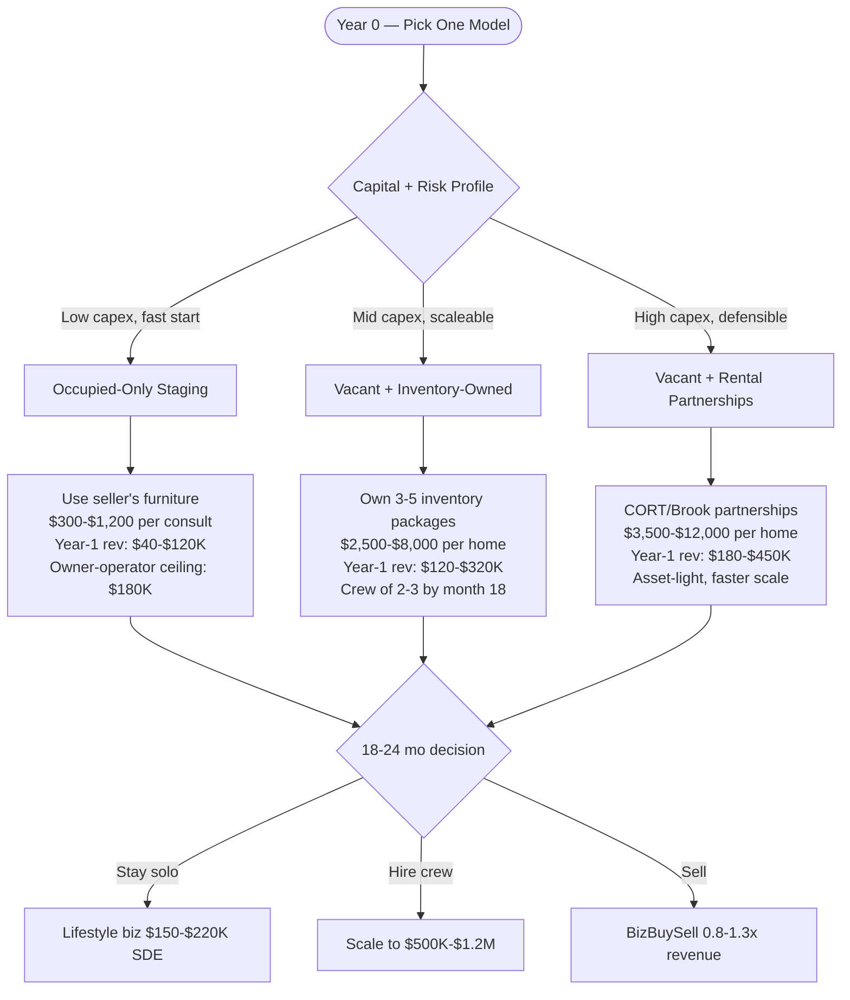
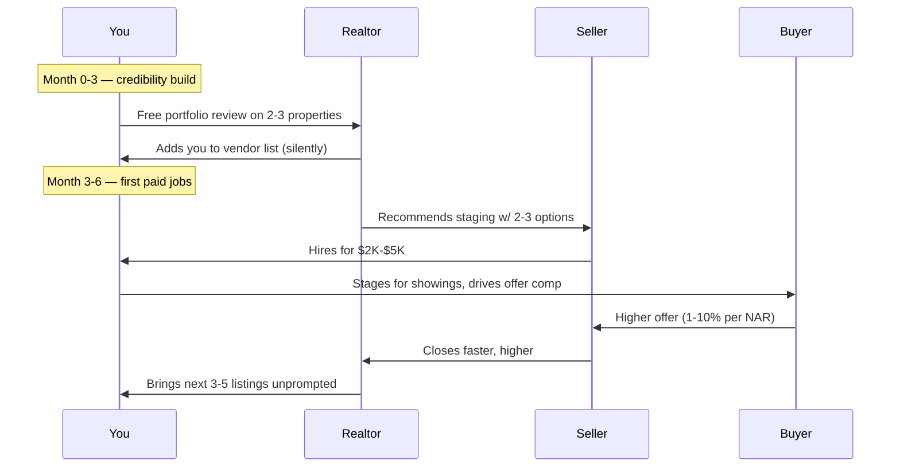

## The Market In Plain Operator Terms

Home staging in 2027 is no longer optional in the listings that matter — it's table stakes for any home over $500K, and a real differentiator below it. NAR's 2024 Profile of Home Staging found that **81% of buyers' agents said staging made it easier for a buyer to visualize the property as a future home**, and **20% reported staging increased the dollar value offered by buyers by 1–10%** vs. a comparable unstaged home. On a $600K home, that's $6K–$60K of seller upside on a $2,500–$8,000 staging spend — math that closes itself once a realtor has seen it work twice.

But the structural reality of operating this business has shifted. The single-stager-with-a-storage-unit model that worked in 2018 hits a hard wall by month 14 when furniture replacement cycles, warehouse rent inflation, and the truck/driver cost stack catch up to revenue. The 2027 playbook is meaningfully different from what was taught in StagedHomes/RESA cert classes five years ago. Below is what's actually working.

## The Three Operator Models — Pick One

**Model 1 — Occupied Staging Only.** You walk into a seller's home, use what they own, rearrange it for photos and showings. Capital: $5K–$15K (camera, basic accent inventory, transit). Pricing: $300–$1,200 per consult depending on home size. This is where 70% of new stagers start because the barrier is low. Ceiling is also low — you're capped at owner hours, ~120 consults/year solo, ~$120K gross.

**Model 2 — Vacant Staging With Owned Inventory.** You buy 3–5 "look packages" — modern, transitional, traditional — typically $30K–$80K of furniture per package. You truck it to vacant listings, set it for 30–60 days, pull it. Pricing $2,500–$8,000 per home depending on sqft. This is the operator-margin sweet spot and the model that 60% of $500K+ revenue stagers run.

**Model 3 — Vacant Staging With Rental Partnerships.** You skip the capex of owning inventory. You partner with CORT Furniture Rental, Brook Furniture Rental, or regional equivalents (look up "furniture rental for staging + [your metro]"). Your margin is thinner per job (you're paying CORT $800–$1,800 for what you'd own outright in Model 2), but you can scale to 8–15 simultaneous projects without a warehouse.

## Year-1 Unit Economics By Model

| Lever | Model 1 (Occupied) | Model 2 (Vacant + Own) | Model 3 (Vacant + Rent) |
|---|---|---|---|
| Startup capital | $5K-$15K | $40K-$120K | $15K-$40K |
| Inventory capex | None | $30K-$80K per package | $0 (CORT/Brook covers) |
| Avg ticket | $300-$1,200 | $2,500-$8,000 | $3,500-$12,000 |
| Avg gross margin | 70-80% | 55-65% | 35-45% |
| Year-1 revenue band | $40K-$120K | $120K-$320K | $180K-$450K |
| Year-1 SDE | $30K-$80K | $50K-$140K | $60K-$180K |
| Year-3 scaleable to | $180K solo cap | $600K-$1.2M | $1.2M-$3M |
| Truck/transit needs | Sedan/SUV | Box truck + driver | Box truck + driver |
| Warehouse needs | None | 800-2,400 sqft | None |
| Crew size yr-1 | 1 (you) | 1-2 + helper | 1-3 + helper |

A few things the back-of-napkin doesn't show: in Model 2, inventory damage and theft eat 3–7% of revenue annually (real number from RESA member surveys 2024). In Model 3, CORT's terms typically include damage waivers but require 14-day minimum rentals — if your listings are selling faster than that, the math breaks. In Model 1, you can never charge realtor commission percentages, only flat fees, because the bar is "operator-recommended" not "operator-required."

## How To Land The First 25 Realtors

The mechanical truth: realtors pick stagers the way they pick title companies — based on three references and zero comparison shopping. Your first job is to BE one of those three references for 25 agents in your metro. That's the entire year-one growth funnel. Skip the Instagram strategy; you get there by:

1. **Identify the top 10% of agents in your zip codes via Realtor.com or HomeLight rankings** (their "Top Agent" search filters by recent volume). Aim for agents averaging 30+ transactions/year.
2. **Offer two free portfolio reviews — virtual is fine** — in exchange for a phone intro after the first paid job.
3. **Get on 2–3 brokerage vendor lists** (Coldwell Banker, Compass, Berkshire Hathaway local affiliates). Each has a "preferred vendor program" that gates referrals.
4. **Always quote 3 tiers (good/better/best)** — the data from BIA Advisory Services on home services shows 3-tier pricing closes 27% more deals than single-quote, because buyers feel they "chose" the middle option.

## What's Actually Changed In 2025–2027 You Need To Plan Around

**AI-generated virtual staging is now table stakes for marketing photos.** Tools like BoxBrownie, Virtual Staging AI, and Apply Design produce realistic staged photos for $25–$50 per image, and 78% of buyers under 35 still convert from those alone (NAR 2024 buyer survey, p. 41). This is NOT a threat to physical staging — it's a complement. Sellers who do virtual photos still need physical staging for in-person showings, and the physical stager who *includes virtual photos in the package* differentiates from the staging-only competitor.

**Furniture rental margins are getting squeezed.** CORT raised its Las Vegas/Phoenix/Austin/Tampa rates 12–18% in 2024, and Brook has signaled similar for 2025. Model 3 operators in those markets are seeing margin compression that's narrowing the gap with Model 2. If you're starting in a hot Sunbelt metro, Model 2 has moved back into favor vs. 18 months ago.

**Insurance has tightened.** Commercial inland marine policies (covering inventory in transit + at jobsite) have hardened across the board. Year-over-year premium hikes of 15–25% are normal, and several carriers (Hartford, Chubb) have pulled out of new staging accounts in CA, FL, TX. Get quotes from RESA's insurance partner program or InsureMyEquipment.com before committing to Model 2.

## The Bear Case — What Kills Staging Businesses

Three failure modes, ranked by frequency:

1. **Capex creep without revenue catch-up** (45% of failures). Operator buys inventory package 4, 5, 6 chasing "more variety" before pricing power has been earned. The warehouse fills, the truck fleet grows, but the per-job margin doesn't move. End state: $40K/month in fixed costs against $32K/month in revenue. Mitigation: never buy a new inventory package until the current package is rotating at 4+ active jobs per month for 90 consecutive days.

2. **Realtor concentration** (30% of failures). One realtor accounts for 60%+ of revenue. They leave their brokerage, retire, or just decide their cousin does staging now. Revenue drops 60% in a month. Mitigation: no single referral source >20% of revenue by month 12. Force diversification by tracking the realtor concentration KPI weekly.

3. **Damage / loss costs hidden in P&L** (20% of failures). Operator doesn't separately track damage and depreciation. Inventory looks "worth" $80K on the books but the actual usable resale value is $18K because of wear. Mitigation: book inventory depreciation on a 36-month schedule (matches what insurers will replace at) and rotate aggressively — sell-off via Facebook Marketplace at the 30-month mark, never year 4+.

## Tools, Vendors, And Where To Actually Learn The Craft

| Need | Vendor / Resource | Why |
|---|---|---|
| Certification | RESA (Real Estate Staging Association) — https://www.realestatestagingassociation.com/ | Industry-recognized, opens commercial doors |
| Alternative cert | StagedHomes ASP (Accredited Staging Professional) — https://stagedhomes.com/ | Pioneered the cert; some realtors prefer it |
| Furniture rental partners | CORT (https://www.cort.com/), Brook (https://www.brookfurniture.com/) | Backbone of Model 3 |
| Insurance | The Hartford via RESA — https://www.thehartford.com/ | Industry-aware underwriting |
| Inventory liquidation | Facebook Marketplace, AptDeco, OfferUp | Move aged inventory at 18-30 months |
| Industry data | NAR Profile of Home Staging (annual) — https://www.nar.realtor/research-and-statistics | Cite this in pitch decks |
| Inventory tracking | StagerCloud (https://stagercloud.com/) or Asset Panda | Required at Model 2 scale |
| Photo enhancement | BoxBrownie (https://www.boxbrownie.com/) | Pair with physical staging |

A note on certifications: realtors over 50 still ask about ASP/RESA letters; realtors under 40 generally don't. But brokerage vendor programs (Coldwell Banker Global Luxury, Sotheby's affiliates) often require one. Get the cheaper of the two if you're starting cold — ASP runs around $1,995 and includes the testing.

## Bottom Line For The 2027 Operator

If you have **$10K of capital and 12 months of W-2 runway**, start with Model 1 (occupied). Get to 25 paid consults in 12 months. Use that book to land 5–8 repeat-referring realtors. Then decide between staying solo at $150K SDE or graduating to Model 2 with the proven realtor relationships funding the inventory capex.

If you have **$60K+ of capital and a partner who can stage while you sell**, go directly to Model 2 in a metro with a healthy $500K+ median home price (Raleigh, Boise, Charlotte, suburban Twin Cities, exurban Atlanta — markets where the volume justifies inventory but the cost basis hasn't fully caught up to coastal). Aim for $200K revenue in year 1, $500K in year 2.

If you have **operational background and $25K of capital**, Model 3 in a top-15 metro is your asymmetric play. Lean on CORT, partner with a Compass or Coldwell Banker top team, and capture the high-end vacant inventory you couldn't afford to own. Year-2 path to $400K+ revenue is realistic if you can keep the warehouse out of your P&L.

The unifying truth across all three: this is a relationships business pretending to be a furniture business. The operator who treats it as a furniture business gets crushed by capex. The operator who treats it as a relationships business gets to choose their exit.
