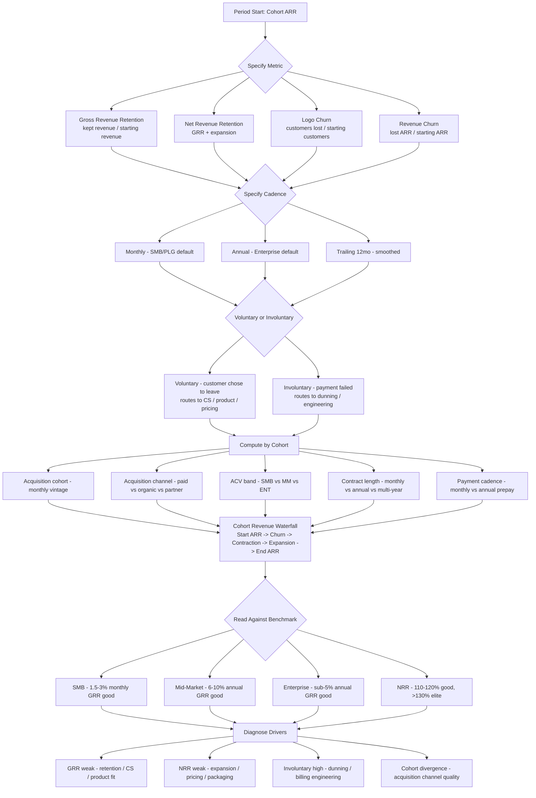
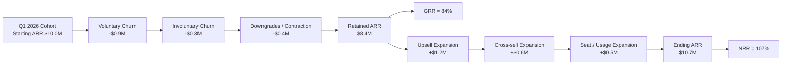

**TL;DR:** There is no single "acceptable" churn rate — there is a **stage-and-segment-adjusted band** and a **vocabulary you must speak with precision** or the number means nothing. The healthy bands, computed correctly, are: **SMB SaaS (sub-$1K ACV) — 3-7% monthly gross revenue churn is the operating reality, 1.5-2.5% is good, sub-1.5% is best-in-class**; **Mid-Market ($1K-$50K ACV) — 10-15% annual gross revenue churn is normal, 6-10% is good, sub-6% is best-in-class**; **Enterprise ($50K+ ACV) — sub-5% annual gross revenue churn is the bar, sub-2% is elite, anything over 10% is a real problem.** **Net Revenue Retention** is the second axis and matters more for valuation: **>120% NRR is best-in-class, 110-120% is good, 100-110% is acceptable, <100% means the installed base is shrinking — a structural problem regardless of how fast new-logo sales are running.** The taxonomy you must use: **Gross Revenue Retention (GRR)** measures what you kept; **Net Revenue Retention (NRR)** is GRR plus expansion (upsell, cross-sell, seat growth). **Logo churn** counts customers; **revenue churn** weights by dollars — for a business with ACV variance, revenue churn is almost always the more important number. **Monthly vs annualized** distinction is critical: 5% MONTHLY gross revenue churn compounds to ~46% annually — that is a business losing nearly half its book every year. **Voluntary** churn (customer chose to leave) vs **involuntary** churn (payment failure, expired card) routes to entirely different fix teams. The structural drivers: SMB churns because **the customer business fails (~20% of small businesses fold each year per BLS), the buyer leaves, the spend is sub-$1K and not load-bearing in the customer's wallet, and the product is one of fifteen un-defended SaaS subscriptions**; enterprise churns less because **procurement cycles are multi-year, switching costs are real, the buyer is institutional not personal, and the contract has auto-renew with notice provisions**. The valuation translation: a SMB business at 4% monthly gross churn cannot scale past $30-50M ARR without leaking the bucket faster than sales can fill it; an enterprise business at 95% NRR is a feature factory disguised as a SaaS company. The diagnostic stack: never read churn as one number — always decompose by **cohort, segment, ACV band, contract length, payment cadence, and acquisition channel** because the Simpson's-paradox traps are real (a "stable" 8% monthly hides a 15% bleeding cohort and a 2% expanding cohort canceling out). Tools: **ChartMogul, ProfitWell/Paddle, Recurly, Stripe Sigma, Mixpanel cohort tables** for the analytics; **SaaS Capital, OpenView SaaS Benchmarks, Bessemer State of the Cloud, ChartMogul SaaS Retention Report, KeyBanc SaaS Survey** for the benchmarks. The single rule that matters most: **decide your definition of churn — gross vs net, logo vs revenue, monthly vs annualized, voluntary vs involuntary — write it down, and never change it**; switching definitions to flatter the number is the fastest way to lose board credibility and the slowest way to actually fix the leak.

## The Churn Taxonomy You Must Speak

Before any benchmark conversation is meaningful, you have to commit to a vocabulary. The single most common reason "what's our churn?" produces a confused answer in a board meeting is that three different people in the room are computing four different numbers and calling each of them "churn." There are at least eight legitimate, distinct churn metrics, and they are not interchangeable. A discussion that conflates them is not a discussion about retention; it is a discussion about whose definition is winning this quarter.

**Gross Revenue Retention (GRR)** measures the percentage of recurring revenue you retained from an existing cohort over a period, excluding any expansion. If you started a year with $10M of ARR from a cohort of customers, and a year later that same cohort is paying you $8.7M (some churned, some downgraded), your GRR is 87%. The complement — 13% — is **Gross Revenue Churn**. GRR is the cleanest measure of "did we keep what we had?" because expansion cannot mask losses inside it. GRR has a hard ceiling of 100%.

**Net Revenue Retention (NRR)** measures the percentage of recurring revenue you retained from an existing cohort *including* expansion (upsell, cross-sell, seat growth, usage-based growth). Same cohort, same $10M start, same $8.7M of retained base, but with $2.0M of expansion within the surviving customers — your NRR is 107%. NRR can and frequently does exceed 100%; for best-in-class businesses it exceeds 130% or even 150%. NRR is the metric the public markets and growth-equity investors anchor on for valuation, because it captures the compounding power of the installed base.

**Logo churn** counts customers, not dollars. If you start a year with 1,000 customers and lose 80 of them, your logo churn is 8%, regardless of whether those 80 were your largest accounts or your smallest. Logo churn is what marketing, support, and CS teams instinctively reach for — it is the number of relationships you lost.

**Revenue churn** weights by dollars. The same 80 lost customers might represent 4% of revenue (if they were small) or 25% of revenue (if they were large). For a business with any meaningful variance in ACV, revenue churn is almost always the more important number, because revenue is what the P&L runs on and what investors value. Logo churn matters most for product-market-fit and word-of-mouth signal; revenue churn matters most for financial outcomes.

**Monthly vs annualized** is the distinction that breaks the most board meetings. SMB and product-led-growth businesses naturally report churn monthly because their billing cadence is monthly and their cohorts behave monthly. Enterprise businesses naturally report annually because contracts and renewals are annual. The two are not directly comparable: a 5% monthly gross revenue churn does not "annualize" to 5% — it compounds. The conversion is **annual churn = 1 − (1 − monthly churn)^12**. So 5% monthly = 46% annual. 2% monthly = 21.5% annual. 1% monthly = 11.4% annual. A founder casually saying "we have 5% churn" needs to be asked, immediately, "monthly or annual?" — because the two answers describe two completely different businesses.

**Voluntary vs involuntary** churn routes to different fix teams. Voluntary churn is the customer making a decision to leave — they cancelled, they didn't renew, they downgraded. Involuntary churn (sometimes called "passive" or "delinquent" churn) is the customer's payment failing — expired credit card, declined transaction, address mismatch, bank fraud-flag. In SMB and PLG businesses, involuntary churn often accounts for **20-40% of total gross revenue churn**, which is the single largest revenue leak that can be fixed with engineering work (dunning logic, card-updater services, retry windows) instead of customer-success work. Lumping them together hides a fixable problem.

**Contraction (downgrades)** vs full churn. A customer who drops from a $5,000 plan to a $1,000 plan has contracted 80% — they are still a customer, but they've reduced spend. Some companies treat contraction as a partial churn event; others only count full cancellations. Both treatments are defensible; what is *not* defensible is treating contraction differently in different periods to flatter the number.

The taxonomy matters because the segment-specific benchmarks below only mean something when you specify which metric you are quoting. "We're at 7%" is meaningless. "We're at 7% annualized gross revenue churn, voluntary only, weighted by MRR, on enterprise cohorts $50K+ ACV with one-year contracts" is a sentence you can benchmark.

## The Segment-Specific Benchmarks

With the vocabulary fixed, here is what "acceptable" actually means by segment. The dividing line between segments is **Annual Contract Value (ACV)**, not company size — a startup buying a $200K enterprise platform is an enterprise customer, and a Fortune 500 buying a $99/month seat is a SMB customer.

**SMB SaaS — sub-$1,000 ACV.** This is the segment that lives or dies on monthly metrics. The Pacific Crest SaaS Survey, ChartMogul's SaaS Retention Report, and SaaS Capital's private-company data all converge on roughly the same band: **3-5% monthly gross revenue churn is normal, 1.5-2.5% is good, sub-1.5% is best-in-class, anything over 6% monthly is bleeding**. Annualized, those bands are roughly 30-46% (normal), 17-26% (good), under 17% (best), over 52% (bleeding). The reason "normal" is so painful is structural: SMB customers churn for reasons largely outside the vendor's control. Per BLS data, roughly 20% of small businesses fold in their first year and about half are gone within five years. A SMB SaaS vendor inherits that mortality rate as a hard floor on retention. The other structural drivers — buyer turnover, sub-$100 spend not being load-bearing in the wallet, low-touch sales motion that produces lukewarm relationships — compound it. The PLG self-serve subset (Slack at the small-team tier, Notion personal, Calendly, Loom free-to-paid) tends to run hotter on monthly churn because there is even less commitment friction; the SMB-with-CSM subset (Gusto, HubSpot Starter with an onboarding specialist) tends to run colder because the human touch buys six to twelve extra months of retention.

**Mid-Market — $1,000 to $50,000 ACV.** Mid-market straddles the SMB and enterprise worlds and has the noisiest benchmarks because of it. The KeyBanc/OpenView SaaS Survey puts the middle of the band at **10-15% annual gross revenue churn for mid-market, with good operators at 6-10% and best-in-class under 6%**. Mid-market customers are typically signing annual contracts with auto-renew, which compresses the timing of churn into a renewal window (90 days before contract end) rather than spreading it across the year. The implication: a mid-market business with "stable monthly churn" is misreading its own data — churn lumps at renewal, and the true measure is **gross renewal rate by cohort by quarter of renewal**. Mid-market also has the highest definitional drift, because companies in this band are most tempted to quote either the SMB metric (monthly) or the enterprise metric (annual NRR) depending on which makes them look better.

**Enterprise — $50,000+ ACV.** Enterprise is where the math gets favorable and the procurement cycles obscure the timing. **Sub-5% annual gross revenue churn is the bar; sub-2% is elite; anything over 10% is a serious problem.** The lower churn is structural: enterprise customers sign multi-year contracts (typical: three years with annual escalators), procurement processes make switching expensive, the buyer is institutional rather than personal, and switching costs include data migration, retraining, change management, and SOC2/security re-review. The catch is that **multi-year contracts mask annual decisions**. A three-year contract signed in 2024 will not "churn" in 2025 or 2026 even if the customer has decided they don't want the product anymore — the churn event is the 2027 non-renewal. Enterprise businesses with heavy multi-year contracting can show beautiful gross retention numbers for two years and then experience a "churn cliff" in year three. The discipline: track **renewal rate by contract cohort by year of renewal**, not aggregate annual churn — the latter will lie to you by exactly the multi-year contracting cadence of your book.

**Top-of-enterprise / strategic — $500,000+ ACV.** At the very top of the enterprise band, churn rates collapse toward zero in any given year, because the contracts are typically three to five years, the customers are typically a handful of named accounts that the entire company knows by name, and a single-logo loss is a board-level event. **Sub-2% annual gross revenue churn is unremarkable here; sub-1% is the expectation.** But the rare loss is enormous — a single strategic-account loss can be 5-10% of total ARR, which is why these accounts are managed by named-account CS, executive sponsors, and quarterly business reviews rather than by aggregate retention metrics.

## Net Revenue Retention: The Second Axis

If GRR tells you what you kept, NRR tells you what the installed base became after a year of operating motion — kept plus expanded minus contracted. NRR is the single most predictive metric for SaaS enterprise value, and the benchmarks are stage-and-motion-specific.

**NRR best-in-class (>130%).** Snowflake at its peak posted NRR north of 170% — a number so high it bent the SaaS rules entirely, because their consumption-pricing model meant existing customers grew usage faster than they churned. Datadog has posted NRR in the 130%+ range consistently. Twilio, MongoDB Atlas, and other usage-based or product-led-with-expansion businesses cluster in the 120-150% band when they're firing. Anything north of 130% NRR is best-in-class, and it always indicates the business has a structural expansion engine — either consumption pricing that grows with customer usage, seat-based pricing in a category where seat counts naturally expand, or a true land-and-expand multi-product motion.

**NRR good (110-120%).** This is the band most healthy growth-stage SaaS companies live in. HubSpot, Atlassian, ServiceNow at maturity, and most strong enterprise SaaS companies cluster here. NRR in this band typically combines GRR in the 90-95% range with 15-25% gross expansion. A 110-120% NRR business compounds installed-base ARR meaningfully even with zero new logos — which is why investors weight it so heavily.

**NRR acceptable (100-110%).** This is the cohort where the business is keeping pace — expansion is offsetting churn but not by much. The risk profile is asymmetric: if churn ticks up or expansion stalls, the company falls below 100% quickly. Many mid-market SaaS businesses live in this band and treat it as a problem to solve, not a steady state to accept.

**NRR below 100%.** This is the bleeding zone. NRR under 100% means the installed base is shrinking — every dollar of new ARR has to first fill the leak before it grows the business. A company at 95% NRR growing 30% on new logos is actually only growing the *total* book at about 25% — and growth deceleration as the business scales will hit it harder than peers because every additional dollar of installed base is a slightly larger leak. NRR under 90% is a structural problem that no amount of new-logo selling can outrun past a certain scale.

**The expansion lever vs the retention lever.** NRR's most dangerous property is that it can **hide a retention problem with an expansion story**. A business at 110% NRR could have 95% GRR plus 15% expansion (healthy) or 80% GRR plus 30% expansion (catastrophic). The first is sustainable; the second is a business propping up gross losses with frantic upsell on the surviving accounts, which is unsustainable and tends to burn out the customer-success team. Always look at GRR and NRR together. A board that sees only NRR is being shown the flattering half of a two-number truth.

## Why SMB Has Structural Churn

The single most consequential thing to understand about SMB SaaS retention is that **the floor is not in your control**. A SMB SaaS vendor selling a $99-$499/month product to small businesses inherits a churn rate from forces that have nothing to do with product quality, customer success, or pricing — and recognizing that floor is the difference between setting realistic retention targets and chasing benchmarks designed for a different segment.

**Business mortality.** BLS data shows about 20% of small businesses close in their first year, and roughly 50% are gone by year five. A SMB SaaS vendor whose customer base skews toward 0-3-year-old businesses inherits that mortality directly: a meaningful share of every monthly churn cohort is "the customer no longer exists." There is no save motion for a business that has shut down. The implication: SMB SaaS vendors who target slightly older, more established small businesses (5-20 employees, 3+ years in operation) will see structurally lower churn than vendors targeting freshly-founded micro-businesses, even if everything else about the product and the motion is identical.

**Buyer turnover.** In a small business, the person who bought your software is often the owner, an office manager, or a small-team lead. When that person leaves the business — and small-business turnover is high — the institutional memory of why your product was chosen leaves with them. Their replacement, encountering a recurring charge on the bank statement, frequently asks "what is this?" and cancels. The "owner left" cancellation reason shows up on every SMB SaaS exit-survey dataset as a top-three driver.

**Sub-$1,000 spend is not load-bearing on the wallet.** A $99/month subscription is real money to a small business, but it is not a strategic line item. When the small business hits a cash-flow crunch — and small businesses hit cash-flow crunches all the time — the $99 subscription gets cut in the first round, before harder cost categories. Enterprise spend, by contrast, is procurement-managed and survives short-term cash-flow pain because cutting it requires a process. SMB spend is one bad week away from being cut by a single human decision.

**Fifteen un-defended SaaS subscriptions.** The average small business is paying for somewhere between 10 and 25 SaaS tools, most of which the buyer doesn't fully remember signing up for and few of which have a renewal-defense motion. Every quarter, the small-business owner does a "what am I paying for?" cull, and any subscription that hasn't proven itself in the last 90 days is at risk. This drives a real, structural churn floor that no amount of CSM heroics can fully overcome — the only durable defense is making the product genuinely indispensable to a daily workflow, which is a product-strategy answer, not a CS answer.

## Why Enterprise Churns Less

The mirror image: enterprise churn rates are low for structural reasons that have nothing to do with the product being objectively better. Understanding these structural advantages is essential for setting realistic expectations and for spotting when an enterprise number is good for the wrong reasons (and therefore fragile).

**Multi-year contracts.** Enterprise contracts are typically two to five years with annual escalators and auto-renew. A customer who internally decided in year two that they don't want the product anymore will not show up in the churn data until year three or year five — whenever the contract finally comes up for non-renewal. This produces beautiful aggregate retention numbers that can mask a building wave of dissatisfaction. The diagnostic: every enterprise SaaS finance team should be running a **renewal cohort waterfall by year of renewal**, not aggregate retention, to see the real picture.

**Switching costs.** Migrating off an enterprise system is expensive — data migration, retraining hundreds or thousands of users, change management, security and compliance re-review, and the cost of running both systems in parallel during cutover. These costs are real and large enough that enterprise customers stay with mediocre vendors for years because the leaving cost exceeds the staying cost. This is good for the vendor's retention number and bad for the vendor's product-quality feedback loop.

**Institutional vs personal buyer.** The enterprise buyer is a committee, a procurement function, and a champion — not a person. Replacing the human champion doesn't trigger an immediate cancellation the way it does in SMB; the institutional commitment outlives any one career-stage. The downside is that the *next* buying decision is made by a different cast of characters than the original one, so the original sales narrative can lose its grip across a renewal cycle.

**Auto-renew with notice provisions.** Most enterprise contracts auto-renew unless the customer affirmatively gives 30, 60, or 90 days' notice. This converts churn from "did the customer choose to stay?" to "did the customer remember to choose to leave?" — a smaller, slower-moving population. Many enterprise renewals happen by default rather than by active choice, which is great for retention metrics and a warning sign about engagement quality.

## The Cohort Discipline

The single most important analytical discipline for any churn conversation is **cohort decomposition** — never read aggregate churn without decomposing it by acquisition cohort, segment, ACV band, contract length, payment cadence, and acquisition channel. Aggregate churn is almost always lying to you, and the lie has a name in statistics: **Simpson's paradox**. An aggregate metric can look stable or even improving while every underlying cohort is deteriorating — because the mix of cohorts is shifting and a stable aggregate is the mathematical accident of two opposing trends canceling out.

**The classic Simpson's-paradox churn trap.** A SaaS business shows aggregate monthly gross revenue churn holding steady at 4% for six straight quarters. Management celebrates. Then in quarter seven, churn jumps to 7% and stays there. What actually happened: a new low-quality acquisition channel was contributing 30% of new logos over the previous six quarters, with 9% monthly churn. The old high-quality channel had 2% monthly churn. The aggregate stayed at 4% by mathematical coincidence — until the new channel grew to 50% of new logos and pulled the aggregate. The deterioration was visible in the cohort data the whole time, and invisible in the aggregate.

**The right cohort breakdowns.** At minimum, decompose churn by: **acquisition cohort** (customers who signed up in a specific month or quarter — tracks whether retention is improving or degrading over time), **acquisition channel** (paid search vs organic vs partner vs outbound — channels have wildly different retention profiles), **ACV band** ($0-$1K vs $1K-$10K vs $10K-$50K vs $50K+ — retention is roughly proportional to ACV), **contract length** (monthly vs annual vs multi-year — longer contracts have lower observed churn because the renewal events are less frequent), **payment cadence** (monthly vs annual prepay — annual prepay customers churn meaningfully less), **segment / persona** (SMB vs mid-market vs enterprise — segment drives nearly everything), and **product mix** (single-product vs multi-product — multi-product customers churn far less). A churn dashboard that shows only the aggregate is a dashboard that is hiding the truth.

**Reading cohort retention curves.** A healthy cohort retention curve drops fastest in the first 30-90 days (the "honeymoon churn" of customers who realized the product wasn't right for them) and then flattens — the flatter the asymptote, the healthier the business. An unhealthy curve never flattens; it keeps decaying. A great curve actually **bends upward** in the later periods because expansion outweighs churn within the surviving cohort — that is the NRR>100% signature visible at the cohort level.

## The Failure Modes That Hide The Truth

Eight specific failure modes routinely produce a churn number that looks better — or worse — than the underlying business reality. A serious operator learns to recognize all of them, because every one of them is a place where management can either fool itself or be fooled by its own reporting.

**Failure mode 1 — Averaging cohorts (Simpson's paradox).** Already named, worth restating: aggregate churn that holds steady while underlying cohorts diverge is the single most common analytical failure in SaaS retention reporting. The fix is mechanical: never present an aggregate churn number to a board without simultaneously presenting the cohort decomposition. If the cohort decomposition isn't ready, the headline number isn't ready.

**Failure mode 2 — Counting day-1 cancellations as voluntary churn.** Some customers cancel within hours of signing up — they signed up to evaluate, decided immediately the product wasn't for them, and bailed. Counting these as "voluntary churn" pollutes the metric with what is really just trial-stage friction. The fix: implement a 30-day cliff and exclude any cancellation within the first 30 days from the recurring-customer churn metric (or report it separately as "onboarding attrition"). A SaaS company that doesn't separate these is conflating two completely different problems — product-fit-and-onboarding (a CX/product issue) and durable-retention (a CS/value issue) — and trying to solve them with one motion.

**Failure mode 3 — Ignoring downgrades (contraction).** A customer who drops from $5K/month to $1K/month is an 80% revenue loss event, but if you only count full cancellations, you miss it entirely. Some companies define their retention metric as "logo retention" specifically because it lets them ignore contraction, and the resulting number can be perfectly healthy while revenue is bleeding. The fix: always include contraction in the revenue-retention math; report logo retention as a separate, secondary metric.

**Failure mode 4 — The "soft churn" trap (dormant accounts still paying).** A meaningful share of any mature SMB SaaS book is composed of accounts that are still paying but haven't logged in for 60-90 days. They are zombie accounts — the buyer has effectively churned but the credit card hasn't caught up. The churn metric looks great until the next renewal cycle, when these accounts cancel in waves. The fix: track "engaged ARR" alongside total ARR, and flag the gap as forward churn risk. Mature SMB SaaS routinely runs 8-15% of ARR in dormant accounts; mature enterprise SaaS runs 3-8%.

**Failure mode 5 — Multi-year contracts masking annual decisions.** Enterprise companies with heavy multi-year contracting will show beautiful aggregate retention for two years and then experience a "churn cliff" in year three as the deferred non-renewals all surface at once. The fix: report renewal rate by contract cohort by quarter of renewal, not aggregate retention. The aggregate is a lagging indicator; the cohort-by-renewal-quarter is the leading indicator.

**Failure mode 6 — Treating NRR as a substitute for GRR.** A company that reports only NRR is hiding the retention half of the story behind the expansion half. Expansion is real value creation, but it cannot fix a broken retention motion — it can only mask it. NRR above 100% with GRR below 85% is a flashing red light: the surviving customers are growing fast enough to offset losses, but the losses are structural and the expansion treadmill cannot be run forever. The fix: always present GRR and NRR side by side; never let either one substitute for the other.

**Failure mode 7 — Currency translation effects misread as churn or expansion.** A global SaaS book with significant non-USD revenue will show "churn" and "expansion" that are really just FX moves. A weak euro quarter shows up as contraction; a strong yen quarter shows up as expansion. Neither has anything to do with the operating business. The fix: report retention in constant currency, with FX effects called out separately. A board that sees a "retention problem" that is actually a FX problem will misdiagnose and misallocate.

**Failure mode 8 — Acquisition-cohort blending.** When a SaaS company makes a strategic acquisition, the acquired customer base has a different retention profile than the native base. Blending them into one aggregate retention number for the consolidated entity hides what is really happening in each. The fix: report retention for the native base and the acquired base separately for at least four quarters post-close.

## Reactivation and Win-Back Motions

Churn is not always permanent. A structured **win-back motion** can recover 5-15% of churned ARR within six months at favorable economics — typically 20-40% of the original CAC — and most SaaS businesses leave this revenue on the table because no one owns the motion.

**The mechanics.** A win-back program targets customers who voluntarily churned within the last 6-12 months with a structured outreach sequence: a "what happened?" exit-survey at month one, a "we've shipped X" product-update email at month three, a discounted-return offer at month six, and a "your data is still here" notification at month nine before deletion. The conversion rate by stage is typically 1-3% at each touch, compounding to a 5-15% total recovery within 12 months.

**The ROI math.** If your monthly cohort loses 100 customers worth $200/month each, that's $240K of annualized lost revenue. A win-back motion recovering 10% of that is $24K/year in recovered ARR, at a cost of (typically) 25% of original CAC — call it $5-10K depending on the original acquisition cost. The ratio is favorable enough that any SaaS business above $5M ARR should have someone owning win-back as a named responsibility.

**The exclusions.** Don't win-back customers who churned for non-recoverable reasons (the business shut down, the buyer left and the new buyer cancelled, the product genuinely wasn't a fit). The win-back motion only works for customers who churned for fixable reasons — they had a bad onboarding, they hit a pricing pinch, they switched to a competitor that has since fallen behind. Exit-survey data is the gating mechanism for which churned cohorts get the win-back motion and which don't.

## The Engagement-Retention Leading Indicator

Revenue retention is a lagging indicator — by the time a customer cancels, the disengagement decision was usually made months earlier. The leading indicator is **product engagement retention**: are customers using the product? In what frequency? Doing what?

**The engagement-to-churn pipeline.** Mature SaaS businesses track an engagement health score per account — typically combining login frequency, feature breadth (number of features actively used), data depth (volume of data in the system), and team breadth (number of seats actively logging in). The score correlates strongly with churn risk, typically with a 60-120 day leading window. A customer whose engagement score drops 40% over a quarter has a 3-5x higher churn probability at the next renewal, and the operational intervention (a CSM outreach, a product nudge, a usage-based pricing change) is most effective when triggered by the engagement signal, not the cancellation event.

**The implementation pattern.** Engagement-retention systems (Gainsight, Catalyst, Totango, ChurnZero, or homebuilt on Mixpanel/Amplitude data) typically score every account weekly, flag the bottom decile for CS intervention, and route the top decile to expansion outreach. The orchestration is more important than the score itself — a beautifully calibrated health score with no operational workflow attached produces no retention lift. A noisy score wired to a tight CS-intervention process can recover 2-5 points of GRR.

## Tools and Instrumentation

The retention tooling stack has matured into a clear set of categories, each with one or two dominant vendors and a long tail of alternatives.

**Subscription metrics platforms.** ChartMogul, ProfitWell (now Paddle), and Baremetrics are the dominant SMB/PLG choices — they connect directly to Stripe, Recurly, or Chargebee and produce cohort retention, MRR movement, and churn breakdown out of the box. For mid-market and enterprise, Maxio (formerly SaaSOptics + Chargify), Subscript, and Mosaic provide deeper financial-grade reporting with revenue recognition, multi-currency, and audit-trail capabilities.

**Billing and dunning.** Stripe (with Smart Retries, card-updater services, and Sigma), Recurly (with Revenue Recovery), Chargebee, and Maxio handle the involuntary-churn-recovery side. A well-configured dunning system on a SMB book recovers 15-30% of payment-failure events, which is typically 4-12% of total gross revenue churn — meaningful enough that engineering work on dunning has the highest ROI of any retention investment in SMB SaaS.

**Customer success platforms.** Gainsight is the enterprise standard; Catalyst, Totango, and ChurnZero compete in the mid-market band. These platforms ingest product-engagement data, account-financial data, and CS-activity data to produce health scores, playbooks, and CS-rep workflows. They are most valuable for organizations with >10 CSMs managing >500 accounts; below that scale, a well-instrumented spreadsheet often does the same work.

**Cohort and engagement analytics.** Mixpanel and Amplitude are the dominant choices for product-engagement cohort tracking; Heap and PostHog compete in the auto-capture space; for finance-grade cohort revenue analysis, Looker, dbt, and warehouse-native modeling (Snowflake, BigQuery, Redshift) often produce more flexible and auditable cohort tables than the off-the-shelf products.

**Renewal forecasting.** Maxio, Subscript, Mosaic, and Causal provide renewal-forecasting workflows for enterprise SaaS books, ingesting contract cohorts and producing renewal probability by account by quarter. For SMB and mid-market, the math is simple enough to handle in dbt or a spreadsheet; for enterprise with hundreds of named accounts and complex multi-year contracts, the platforms earn their keep.

## The Board Reporting Discipline

How retention shows up in a board deck is itself a discipline worth getting right. The same number presented poorly destroys credibility; presented well, builds it.

**Commit to a definition and put it in writing.** The board deck should state, every time, the exact churn and retention definitions in use: "GRR = gross revenue retention computed on a trailing-twelve-month basis, voluntary plus involuntary, including contraction, weighted by MRR, on cohorts >30 days from sign-up." This definition should be agreed with the board once and then treated as fixed. Any change requires a footnote, a restated prior period on the new basis, and an explicit board acknowledgment.

**Show the trend, not just the point.** A single quarter's churn figure is nearly useless; the trajectory across eight to twelve quarters tells you whether the business is improving, deteriorating, or stable. Board charts should show GRR and NRR over time, decomposed by segment, with the trend line and the variance both visible.

**Present the cohort decomposition alongside the aggregate.** Never present an aggregate retention number without the cohort breakdown. A board that sees only the aggregate is being shown a single dimension of a multi-dimensional reality, and the cohort breakdown is what makes the conversation diagnostic instead of cosmetic.

**Show GRR and NRR side by side.** Neither one substitutes for the other. A deck that shows only NRR is hiding the retention story behind the expansion story; a deck that shows only GRR is hiding the expansion story behind the retention story. Both belong on the page.

**Honesty about a bad number is worth more than flattery about a good one.** A management team that presents a disappointing churn figure, on the same definition as always, with a clear diagnosis and a credible fix plan, builds enormous board credibility. A team that presents a flattering figure achieved by quietly changing the definition will eventually get caught, and when they do, the credibility loss is not bounded — the board starts discounting everything else in the deck.

## The Churn Computation Decision Tree

## The Cohort Revenue Waterfall

## Sources

1. **SaaS Capital — Private SaaS Company Retention Survey (annual)** — Large-sample empirical work on private-company GRR/NRR by ACV band and ARR scale. https://www.saas-capital.com/
2. **SaaS Capital — "What's a Good Retention Rate?" research series** — Benchmark distributions and the case for stage-segmented reading. https://www.saas-capital.com/blog
3. **OpenView Partners — Annual SaaS Benchmarks Report** — Growth, retention, and efficiency benchmarks segmented by ARR scale and ACV. https://openviewpartners.com/expansion-saas-benchmarks/
4. **KeyBanc Capital Markets — Annual SaaS Survey (with OpenView)** — Public and private SaaS company metrics including GRR, NRR, and CAC payback by segment. https://www.key.com/businesses-institutions/industry-expertise/saas-survey.jsp
5. **Bessemer Venture Partners — State of the Cloud reports** — Cloud and SaaS company benchmark data including retention by stage and category. https://www.bvp.com/atlas
6. **Bessemer — Cloud Index and NRR research** — Public-software NRR distribution and valuation-multiple correlation work.
7. **ChartMogul — SaaS Retention Report (annual)** — Cohort-level retention data across thousands of SMB and mid-market SaaS businesses. https://chartmogul.com/reports/
8. **ChartMogul — SaaS Benchmark Index** — Live benchmark data on growth, retention, ARPA, and churn by ARR band. https://chartmogul.com/benchmarks/
9. **ProfitWell / Paddle — Recurring Revenue Benchmarks** — Subscription-business retention and pricing benchmarks across SMB and mid-market. https://www.paddle.com/
10. **Pacific Crest Securities — Annual SaaS Survey (historical, archived via OpenView)** — Original benchmark survey series that established many of the segment churn bands.
11. **Recurly — State of Subscriptions Report** — Subscription churn and involuntary-churn benchmarks across consumer and B2B SaaS. https://recurly.com/research/
12. **Stripe — Subscription business benchmarks** — Payment-failure and involuntary-churn data across the Stripe Sigma dataset. https://stripe.com/atlas
13. **a16z — "16 Startup Metrics" and "16 More" essays** — Canonical SaaS metric definitions including GRR, NRR, and churn taxonomy. https://a16z.com/16-startup-metrics/
14. **a16z — SaaS metrics framework writing** — Situating churn within the broader unit-economic dashboard.
15. **Tomasz Tunguz — Theory Ventures / blog (formerly Redpoint)** — Venture-side analysis of churn benchmarks, including the argument that single-segment benchmarks are misleading and must be motion-specific. https://tomtunguz.com
16. **David Skok — "For Entrepreneurs" (Matrix Partners)** — Foundational writing on SaaS retention, the "leaky bucket" framework, and the math of monthly-vs-annual churn. https://www.forentrepreneurs.com/
17. **Jason Lemkin / SaaStr — operator-community retention writing and benchmarks** — Practitioner framing of how churn is actually managed in scaling SaaS businesses. https://www.saastr.com
18. **Mostly Metrics (CJ Gustafson) — SaaS finance newsletter** — CFO-perspective writing on retention metric computation and board reporting.
19. **Iconiq Growth — Growth & Efficiency SaaS benchmark series** — Stage-segmented retention, growth, and efficiency benchmarks. https://www.iconiqcapital.com/growth
20. **Bain & Company — Software industry research and SaaS benchmarks** — Strategic-consulting view of retention drivers and segment economics.
21. **McKinsey & Company — Software and Cloud research** — Broader software-industry retention and value-creation analysis.
22. **Gainsight — Customer Success and Retention Benchmark research** — Customer-success-side framing of retention drivers and CS-org benchmarks. https://www.gainsight.com/
23. **Catalyst / Totango / ChurnZero — CS platform benchmark reports** — Customer-success tooling vendors' retention benchmarks across their installed bases.
24. **Snowflake Inc. — SEC filings (NYSE: SNOW)** — Consumption-pricing NRR disclosures historically in the 150%+ range. https://investors.snowflake.com/
25. **Datadog Inc. — SEC filings (NASDAQ: DDOG)** — Usage-based NRR disclosures historically 130%+. https://investors.datadoghq.com/
26. **HubSpot Inc. — SEC filings (NYSE: HUBS)** — Mid-market SaaS retention disclosures and Hub-attach expansion metrics. https://ir.hubspot.com/
27. **Atlassian Corporation — SEC filings (NASDAQ: TEAM)** — PLG/multi-product NRR disclosures. https://investors.atlassian.com/
28. **Salesforce Inc. — SEC filings (NYSE: CRM)** — Enterprise SaaS retention and attrition disclosures. https://investor.salesforce.com/
29. **MongoDB Atlas — SEC filings (NASDAQ: MDB)** — Consumption-pricing NRR disclosures, historically 120%+. https://investors.mongodb.com/
30. **US Bureau of Labor Statistics — Business Employment Dynamics** — Small business survival rate data (~20% first-year failure, ~50% five-year failure). https://www.bls.gov/bdm/
31. **US Small Business Administration — Office of Advocacy small business facts** — Small business failure rates and demographic data. https://advocacy.sba.gov/
32. **Mixpanel — Cohort Analytics documentation and benchmarks** — Cohort retention curve patterns and product-engagement retention data. https://mixpanel.com/
33. **Amplitude — Product Analytics Benchmark Report** — Product-engagement retention benchmarks by category. https://amplitude.com/
34. **Baremetrics — Subscription metrics benchmarks** — Open dataset of subscription-business retention metrics. https://baremetrics.com/
35. **Lenny's Newsletter — Retention curves and benchmarks essays** — Product-led growth retention pattern analysis (Lenny Rachitsky). https://www.lennysnewsletter.com/
36. **Reforge — Retention engineering curricula and frameworks** — Product/engagement retention framework writing.
37. **FASB ASC 606 — Revenue from Contracts with Customers** — Revenue-recognition standard affecting how churn and contraction flow through GAAP revenue.
38. **SEC Regulation G — Non-GAAP financial measures disclosure rules** — Governs how GRR, NRR, and adjusted metrics are presented.
39. **The Bridge Group — SaaS AE and CS benchmark reports** — Sales and customer-success org-design data relevant to retention motion economics.
40. **Notion Capital, Insight Partners, ICONIQ — growth-equity NRR underwriting commentary** — Investor-side framing of NRR as the central valuation metric.

## Numbers

**Annual Gross Revenue Churn by ACV Segment**

| Segment | ACV Band | Best-in-class | Good | Normal | Bleeding |
|---|---|---|---|---|---|
| SMB (monthly) | <$1K | <1.5%/mo | 1.5-2.5%/mo | 3-5%/mo | >6%/mo |
| SMB (annual equiv.) | <$1K | <17%/yr | 17-26%/yr | 30-46%/yr | >52%/yr |
| Mid-Market | $1K-$50K | <6%/yr | 6-10%/yr | 10-15%/yr | >18%/yr |
| Enterprise | $50K+ | <2%/yr | 2-5%/yr | 5-10%/yr | >10%/yr |
| Strategic / Top-Enterprise | $500K+ | <1%/yr | 1-2%/yr | 2-5%/yr | >5%/yr |

**Net Revenue Retention by Segment and Motion**

| Tier | NRR Band | Examples / Notes |
|---|---|---|
| Best-in-class consumption | >150% | Snowflake at peak (~170%+), MongoDB Atlas (~120-135%) |
| Best-in-class usage/PLG | 130-150% | Datadog (~130%+), Twilio at peak |
| Strong enterprise | 115-130% | ServiceNow, HubSpot, Atlassian at maturity |
| Healthy growth | 110-115% | Most growth-stage enterprise SaaS |
| Acceptable | 100-110% | Mid-market median |
| Bleeding | 90-100% | Installed base flat or shrinking |
| Structural problem | <90% | Cannot outrun with new logos past ~$30-50M ARR |

**Monthly to Annual Churn Conversion (Gross Revenue Churn)**

| Monthly | Annualized (1-(1-m)^12) | Implication |
|---|---|---|
| 0.5% | 5.8% | Best-in-class SMB |
| 1.0% | 11.4% | Strong SMB |
| 1.5% | 16.6% | Good SMB |
| 2.0% | 21.5% | Acceptable SMB |
| 3.0% | 30.6% | Normal SMB — meaningful drag |
| 4.0% | 39.0% | Painful — cannot scale past mid-$10sM ARR easily |
| 5.0% | 46.0% | Brutal — bleeding half the book annually |
| 7.0% | 58.3% | Catastrophic — likely structural product/motion issue |
| 10.0% | 71.8% | The wheels are off |

**Top-Quartile vs Median by ACV Band (representative; SaaS Capital + OpenView blended)**

| ACV Band | Median GRR | Top Quartile GRR | Median NRR | Top Quartile NRR |
|---|---|---|---|---|
| <$1K (SMB) | 72-78% | 85-90% | 85-92% | 100-110% |
| $1K-$10K | 82-87% | 90-93% | 95-105% | 110-118% |
| $10K-$50K (Mid-Market) | 87-91% | 92-95% | 105-112% | 115-125% |
| $50K-$250K (Enterprise) | 92-95% | 95-98% | 110-118% | 120-135% |
| $250K+ (Strategic) | 95-97% | 97-99% | 115-125% | 125-145% |

**The Five Most Common Churn-Math Mistakes**

| Mistake | Effect | Fix |
|---|---|---|
| Quoting monthly churn as annual | Hides 4-10x compounding | Always specify cadence; report both |
| Aggregating across segments (Simpson's paradox) | Stable aggregate hides cohort divergence | Decompose by acquisition cohort and channel |
| Counting day-1 cancellations as voluntary churn | Inflates churn with trial-stage noise | Use a 30-day cliff; exclude pre-onboarded cancellations |
| Ignoring contraction (downgrades) | Understates revenue loss | Include contraction in GRR / revenue churn |
| Reporting NRR without GRR | Hides retention problem under expansion story | Always present both side by side |

**Voluntary vs Involuntary Churn — Typical Mix by Segment**

| Segment | Voluntary share | Involuntary share | Fixable headroom |
|---|---|---|---|
| SMB / PLG self-serve | 60-70% | 30-40% | Large — dunning, card-updater, retry windows can recapture 15-30% of involuntary |
| Mid-Market | 75-85% | 15-25% | Moderate — billing reliability + procurement-friendly invoicing |
| Enterprise | 90-95% | 5-10% | Small — most enterprise involuntary is AR/procurement friction |

**The Northwind SMB Worked Example**

- Starting MRR (Jan): $100,000 across 1,200 customers (avg $83/mo)
- Voluntary cancellations (Jan): 36 customers / $2,700 MRR
- Involuntary cancellations (Jan): 14 customers / $1,100 MRR
- Downgrades (Jan): $600 MRR contraction
- Total lost MRR: $4,400 — monthly gross revenue churn = 4.4%
- Annualized (compounded): 1 − 0.956^12 = 41.6% — nearly half the book in a year
- Logo churn: 50/1200 = 4.2% monthly, 40% annualized
- Expansion MRR (upgrades, seat adds): $3,800
- Net new MRR from existing base: −$600 — NRR = 99.4%
- Diagnosis: aggregate looks "stable" but the business is shrinking on installed-base basis; new-logo sales must run hot enough to outrun a 4.4% monthly leak plus growth

**The Enterprise Northwind Variant**

- Starting ARR (Q1): $50M across 250 customers (avg $200K ACV)
- Annual gross revenue churn (12 months trailing): 4% — $2.0M lost
- GRR = 96%
- Expansion ARR (upsell + seat growth on retained accounts): $8.5M — 17% of starting
- NRR = 113%
- Diagnosis: healthy enterprise profile; expansion is doing real work, GRR is in the "good" band, NRR is in the "healthy growth" band; the watchout is the year-three renewal cliff if multi-year contracts are masking 2-year-old decisions to leave

**Stage-and-Scale Targets**

| ARR Stage | Acceptable NRR | Acceptable GRR | Notes |
|---|---|---|---|
| <$5M ARR | Anything functional | Hard to measure cleanly | Cohorts too small for statistical meaning; focus on cohort retention curves |
| $5-25M | >100% | 80%+ SMB / 90%+ ENT | Cohorts large enough to read; segment band starts to matter |
| $25-100M | >110% | 85%+ SMB / 92%+ ENT | The valuation lens kicks in; investors anchor on NRR |
| $100M+ | >115% | 88%+ SMB / 94%+ ENT | Public-market scrutiny; NRR is the single most important valuation metric |

**The Soft-Churn Trap (Dormant Accounts Still Paying)**

- Definition: customer hasn't logged in / used product in 60-90 days but is still paying
- Typical share of total ARR in mature SMB SaaS: 8-15%
- Typical share in mature enterprise SaaS: 3-8%
- Risk: dormant accounts churn at 3-5x the rate of active accounts at renewal
- Implication: track "engaged ARR" (ARR among active users) as a leading indicator of forward churn

**Reactivation / Win-Back Benchmarks**

- Typical win-back rate from churned customers within 6 months: 5-15%
- Cost of win-back as % of original CAC: typically 20-40%
- Implication: a structured win-back motion can recover 5-10% of total churn at favorable economics

**The 2021 vs 2026 Valuation Shift**

- 2021: NRR weighted heavily but growth weighted more; an unprofitable 110% NRR business could trade at 30x+ revenue multiples
- 2026: NRR weighted MORE than growth; a 130% NRR profitable business commands premium multiples while 100% NRR businesses see severe multiple compression
- Implication: retention is now the single most valuable metric in SaaS finance; the post-ZIRP market has explicitly repriced toward the businesses that compound their installed base

**Tools Ecosystem (representative)**

| Function | Tools |
|---|---|
| SMB / PLG analytics | ProfitWell/Paddle, Baremetrics, ChartMogul |
| Enterprise renewal tracking | Gainsight, Catalyst, Totango, ChurnZero |
| Billing + dunning | Stripe (Smart Retries, card updater), Recurly, Chargebee, Maxio |
| Cohort analytics | Mixpanel, Amplitude, Heap, Looker, dbt + warehouse |
| Payment recovery | Stripe Sigma, Recurly Revenue Recovery, FlexPay |
| Forecasting | Maxio, Subscript, Mosaic, Causal |

## Counter-Case: Why A Single Segment Benchmark Is Often Misleading

Tomasz Tunguz and other thoughtful operators have made an argument worth taking seriously: **the single-segment benchmark (e.g., "good SMB SaaS is sub-2% monthly churn") is misleading because it averages over motions that are economically dissimilar.** A self-serve PLG product, a sales-assisted SMB product, and a CSM-touched SMB product all live under the "SMB SaaS" label but have wildly different retention profiles. Applying a single benchmark across them produces false positives (a self-serve product hitting "average" might actually be underperforming its motion) and false negatives (a CSM-touched product hitting "average" might actually be underperforming its motion in the other direction). The Tunguz counter is correct as a critique and partially correct as a corrective; the answer is not to abandon segment benchmarks but to layer **motion specificity** on top of them.

**Counter 1 — Motion specificity inside a segment.** Within SMB SaaS, a self-serve product (Calendly, Loom free-to-paid, Notion personal) will typically run 4-6% monthly gross churn because the commitment friction is near-zero and the buying decision is one-click. A sales-assisted SMB product (Gusto, HubSpot Starter with an inside-sales rep) will run 2-3% monthly because the buyer is qualified and the relationship has at least one human touchpoint. A CSM-touched SMB product (Mailchimp Premium, HubSpot Marketing Hub with onboarding) will run 1-2% monthly because the CSM relationship buys real retention. Quoting "good SMB churn is 2.5%" without specifying motion is averaging across three very different economic realities.

**Counter 2 — Category dynamics matter as much as segment.** A SMB SaaS product in a discretionary category (a marketing-automation tool, a project-management tool) will face higher churn than a SMB product in a load-bearing category (payroll, accounting, payment processing) because the load-bearing category is locked in by data, compliance, and switching cost. A "high churn" payroll product is a 0.5-1% monthly churner; a "low churn" project-management product might be 3-4% monthly. Segment alone doesn't capture this; **category-corrected** benchmarks would be more accurate but are rarely reported.

**Counter 3 — The valuation reality cuts the other way.** While Tunguz is right that single-segment benchmarks are imprecise, the *public market* doesn't grant motion-specific exemptions. A public SaaS company reporting 88% GRR is going to take valuation pressure regardless of whether their motion "explains" the number — and investors trying to triangulate fair value across a comparison set need *some* common benchmark. The segment benchmarks are the lingua franca for a reason: imperfect comparability is better than no comparability. The honest synthesis: use segment benchmarks as the *first-pass* read, then drill into motion specifics to explain divergences from the benchmark.

**Counter 4 — Benchmarks lag the structural shifts.** Most published segment benchmarks reflect 2-3 year-old data, and the SaaS market has shifted materially in that period. The 2026 reality — AI agents eating seat-based pricing, consumption pricing eating subscription pricing, vibe-coded products eating purchase decisions — is changing both the absolute churn rates and the right way to measure them. A benchmark published in 2024 that says "best-in-class SMB SaaS is sub-2% monthly" may be a 2022 reality that 2026 self-serve PLG products are bleeding past. The benchmarks are still useful as directional anchors but they are not gospel and they are not perfectly current.

**Counter 5 — When the right churn rate is "high on purpose."** Some products are explicitly designed to have higher churn than their segment because the unit economics support it. Tax-prep software has 30%+ annual churn because customers come back next year. Wedding-planning SaaS has near-100% churn within 24 months because the underlying need expires. Bootcamp-style learning platforms have planned exit. For these businesses, a "low churn" reading is actually a sign of unhealthy product-market fit — customers staying past their useful life. Segment benchmarks have no opinion on this; the diagnostic is to look at LTV/CAC and the *intent* of the retention curve, not the absolute number.

**Counter 6 — Geographic and currency effects.** US-market SaaS benchmarks don't apply cleanly to EU, APAC, or LATAM markets. EU SMB churn tends to run slightly higher because of currency volatility and tighter cash-flow constraints; APAC enterprise contracts have different procurement cadences; LATAM has currency-translation effects that show up as "expansion" or "contraction" in dollar terms regardless of native-currency reality. A US-trained benchmark applied to a global book without geo decomposition will misread the picture.

**Counter 7 — The metric you choose shapes the org you build.** A company that organizes around "reduce monthly churn" will build a retention-focused CS org, dunning engineering, and pricing programs that defend the base. A company that organizes around "grow NRR" will build an expansion-focused CS org, success-managers measured on upsell, and pricing programs that reward seat growth. Both are legitimate; both produce different products and different cultures. The "right" benchmark depends on which game you're playing. A pre-PMF company should arguably worry about *engagement retention* (are people coming back?) more than *revenue retention* (are they paying?), because revenue retention without engagement is just paying-but-leaving customers waiting to churn.

**The honest verdict on benchmarks.** Use segment benchmarks as the first-pass read because they are the lingua franca and because they catch most outright bad numbers. Then immediately drill into **motion specificity** (self-serve vs sales-assisted vs CSM-touched), **category dynamics** (discretionary vs load-bearing), **cohort decomposition** (acquisition channel, contract length, ACV band, payment cadence), **geographic mix**, and **product-intent** (is high churn structural or pathological?). The benchmark is a checkpoint, not a verdict. The diagnosis lives in the cohort data and the motion. A company that runs "we hit the benchmark" as the end of the conversation has stopped doing the work too early.

## Related Pulse Library Entries

- **q1** — What is ARR and how is it actually calculated? (The base measure that GRR and NRR are computed against.)
- **q5** — What is net revenue retention and why does it matter? (Sister entry; deeper dive on NRR mechanics and valuation correlation.)
- **q12** — How do you calculate CAC payback period? (The acquisition-side metric that pairs with churn for unit economics.)
- **q18** — What is the SaaS Magic Number and how is it used? (The go-to-market efficiency metric whose denominator includes churn dynamics.)
- **q23** — What is a good gross margin for a SaaS company? (The ceiling on profitability that retention enables.)
- **q27** — How is free cash flow calculated for a SaaS business? (Where retention shows up in cash terms.)
- **q42** — How do you build a customer success org from scratch? (The org-design answer to a retention problem.)
- **q47** — Cohort analysis for SaaS: how to actually do it? (The cohort discipline that catches Simpson's-paradox churn traps.)
- **q53** — Pricing and packaging for expansion: how to design for NRR? (Pricing-side answer to the NRR question.)
- **q58** — Dunning, card updaters, and involuntary churn recovery? (Engineering-side answer to the involuntary-churn share.)
- **q63** — What is the Rule of 40 and why does it matter? (Where retention's value-creation contribution is captured.)
- **q67** — How do PLG businesses differ from sales-led on retention? (Motion-specific retention dynamics for PLG.)
- **q73** — Customer onboarding programs that reduce 30-day churn? (The "honeymoon churn" intervention.)
- **q79** — How do you build a quarterly business review (QBR) program? (Enterprise renewal-defense motion.)
- **q84** — How do you calculate LTV and what's a good LTV/CAC ratio? (Where retention compounds into customer lifetime value.)
- **q88** — Renewal forecasting for enterprise SaaS? (The contract-cohort renewal-rate diagnostic.)
- **q91** — Consumption pricing vs subscription pricing — when each wins? (The pricing-model choice that drives consumption-NRR dynamics.)
- **q94** — Land-and-expand sales motion design? (The expansion motion that drives NRR>100%.)
- **q97** — How will AI change SaaS unit economics by 2030? (Forward-looking context on retention dynamics.)
- **q99** — How is the Rule of 40 actually computed? (The summary metric that retention feeds into.)
- **q103** — What is the difference between good growth and bad growth? (Quality-of-growth framing where retention is central.)
- **q108** — How to benchmark a SaaS company against public comps? (Applying retention benchmarks across a comparison set.)
- **q112** — What is operating leverage in a SaaS business? (Mechanism connecting retention to margin expansion.)
- **q117** — How do you present disappointing metrics to a board? (The credibility discipline around honest churn reporting.)
- **q126** — Customer health scoring: actually predictive frameworks? (The leading-indicator system for churn.)
- **q133** — Win-back and reactivation motion design? (Recovering 5-15% of churned revenue at favorable economics.)
- **q139** — Multi-year contract strategy and the renewal cliff? (Why aggregate enterprise churn lies and what to track instead.)
- **q144** — Segment-specific CS playbooks: SMB vs MM vs Enterprise? (Operational answer to motion-specific retention.)
- **q151** — Pricing experiments: how to run without wrecking retention? (Tactical pricing-change risk management.)
- **q158** — Customer concentration risk and how to measure it? (The risk-side complement to retention metrics.)

