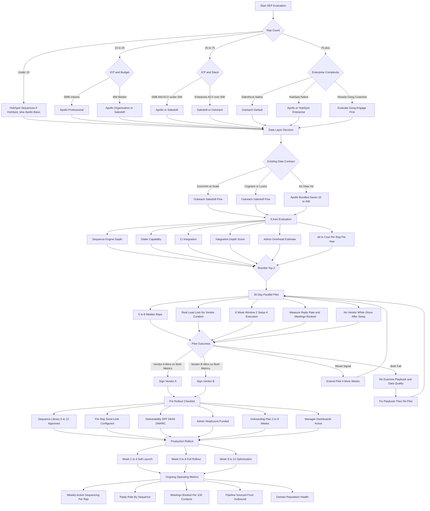

### Direct Answer

**Evaluating [Outreach](https://www.outreach.io/) vs [Salesloft](https://salesloft.com/) vs [Apollo](https://www.apollo.io/) for outbound cadences in 2027 is a four-variable function: (1) company size + rep count, (2) buyer ICP and ACV band, (3) existing CRM + data + dialer stack ([Salesforce](https://www.salesforce.com/) Sales Cloud, [HubSpot](https://www.hubspot.com/), [Microsoft Dynamics 365 Sales](https://dynamics.microsoft.com/), [Pipedrive](https://www.pipedrive.com/)), and (4) all-in budget per rep per year.** **The three dominant vendors map cleanly: Outreach (Manny Medina co-founder, last private valuation $4.4B) is the enterprise default for 50+ reps, $50K+ ACV, Salesforce-native shops with budget for the admin overhead; Salesloft (David Obrand CEO, Vista Equity Partners-backed at ~$2.3B, [Drift](https://www.drift.com/) conversational AI built in post-acquisition) is the mid-market-to-enterprise sweet spot for 15-300 reps, $10K-$250K ACV, multi-team RevOps that wants lower admin overhead; Apollo (Tim Zheng founder, freemium + ~260M-contact B2B database) is the all-in-one SMB-and-mid-market commodity displacer for 5-100 reps, $1K-$30K ACV. Honorable mentions: [Gong Engage](https://www.gong.io/products/engage/) (bundled with Gong CI, the conversation-intelligence-first play), [HubSpot Sequences](https://www.hubspot.com/products/sales/sequences) (included with Sales Hub Pro+, the CRM-native play), and the SMB long tail [Reply.io](https://reply.io/) / [Lemlist](https://lemlist.com/) / [Smartlead](https://www.smartlead.ai/) / [Instantly](https://instantly.ai/) / [MixMax](https://www.mixmax.com/). The commoditized core (multi-channel sequences, A/B testing, send windows, reply detection, basic dialer) is table stakes across all three in 2027 — actual differentiation lives on six load-bearing axes: (1) data layer (Apollo wins on built-in B2B database; the others require [ZoomInfo](https://www.zoominfo.com/) / [Cognism](https://www.cognism.com/) / [Lusha](https://www.lusha.com/) / [Clearbit (HubSpot-acquired)](https://www.clearbit.com/) attach), (2) sequence engine (Outreach deepest variant logic, Salesloft cleanest UX, Apollo fastest setup), (3) dialer + parallel-dial (Outreach Voice + Salesloft Dialer mature; Apollo dialer functional but newer; Orum / Nooks / ConnectAndSell still win for true parallel-dial), (4) conversation intelligence (Outreach has Sameplan-acquired CI, Salesloft has Drift built in, Apollo has basic CI), (5) integration depth (Salesforce-native execution: Outreach > Salesloft > Apollo; HubSpot-native: Apollo > Salesloft > Outreach), (6) admin overhead (Outreach requires dedicated admin headcount, Salesloft middle, Apollo lowest). Plus the two gating filters: rep adoption (the tool reps actually open daily beats the tool with more features 10:1) and playbook + data quality (no SEP fixes broken targeting or generic copy). All-in cost per rep per year: Outreach $1,600-$2,200 + $20-50K onboarding + 0.5-1.0 FTE admin; Salesloft $1,300-$1,900 + $10-25K onboarding + 0.25-0.75 FTE admin; Apollo $0 free → $588-$1,788 + $0-5K onboarding + 0.1-0.4 FTE admin; Gong Engage included with Gong (~$1,500/rep/yr for the Gong side); HubSpot Sequences included with Sales Hub Pro ($90/user/mo) or Enterprise ($150/user/mo). The four failure modes that kill outcomes: under-utilization (only 30% of seats sequence weekly), enterprise-tool-for-SMB (Outreach for 8 reps = wasted spend), spray-and-pray reputation destruction, and no-playbook chaos. Benchmark sources: [Forrester Wave: Sales Engagement Platforms](https://www.forrester.com/), [Gartner Magic Quadrant for Sales Engagement Applications](https://www.gartner.com/), [G2 Grid for Sales Engagement](https://www.g2.com/categories/sales-engagement), [OpenView SaaS Benchmarks](https://openviewpartners.com/expansion-saas-benchmarks/), and the [Bridge Group SDR Metrics Report](https://bridgegroupinc.com/) for the activity-rate context that determines what "good usage" looks like.**

**Bottom line cadence in 2027:** evaluate on adoption + admin + data layer first, features second, vendor relationship third — and run a real 30-day parallel pilot on five live reps before signing anything past 25 seats.

## 🗺️ Table of Contents

**Part 1 — The Decision Framework**
- [The four variables that decide the SEP choice](#the-four-variables-that-decide-the-sep-choice)
- [Why feature checklists are the wrong instrument](#why-feature-checklists-are-the-wrong-instrument)
- [The buyer ICP and ACV gate](#the-buyer-icp-and-acv-gate)
- [The existing stack interaction — Salesforce vs HubSpot vs Microsoft Dynamics](#the-existing-stack-interaction--salesforce-vs-hubspot-vs-microsoft-dynamics)
- [The admin-overhead budget that nobody scopes correctly](#the-admin-overhead-budget-that-nobody-scopes-correctly)

**Part 2 — Vendor Landscape 2027**
- [Outreach — the enterprise-dominant incumbent](#outreach--the-enterprise-dominant-incumbent)
- [Salesloft — Vista-backed, Drift-augmented, mid-market loved](#salesloft--vista-backed-drift-augmented-mid-market-loved)
- [Apollo — the all-in-one freemium displacer](#apollo--the-all-in-one-freemium-displacer)
- [Gong Engage — included with Gong, CI-first](#gong-engage--included-with-gong-ci-first)
- [HubSpot Sequences — included with Sales Hub Pro+](#hubspot-sequences--included-with-sales-hub-pro)
- [The SMB long tail — Reply, Lemlist, MixMax, Smartlead, Instantly](#the-smb-long-tail--reply-lemlist-mixmax-smartlead-instantly)

**Part 3 — The 6-Axis Comparison**
- [Axis 1 — Data layer (built-in database vs attach)](#axis-1--data-layer-built-in-database-vs-attach)
- [Axis 2 — Sequence engine (variants, A/B, branching)](#axis-2--sequence-engine-variants-ab-branching)
- [Axis 3 — Dialer and parallel-dial](#axis-3--dialer-and-parallel-dial)
- [Axis 4 — Conversation intelligence](#axis-4--conversation-intelligence)
- [Axis 5 — Integration depth (Salesforce, HubSpot, Outlook, Gmail)](#axis-5--integration-depth-salesforce-hubspot-outlook-gmail)
- [Axis 6 — Admin overhead and time-to-value](#axis-6--admin-overhead-and-time-to-value)
- [Pricing reality and the cost-per-rep-per-year math](#pricing-reality-and-the-cost-per-rep-per-year-math)

**Part 4 — Failure Modes and Real-World Application**
- [Failure mode 1 — under-utilization (only 30% of seats sequence)](#failure-mode-1--under-utilization-only-30-of-seats-sequence)
- [Failure mode 2 — enterprise tool for an SMB team](#failure-mode-2--enterprise-tool-for-an-smb-team)
- [Failure mode 3 — spray-and-pray destroys domain reputation](#failure-mode-3--spray-and-pray-destroys-domain-reputation)
- [Failure mode 4 — no playbook means no consistency](#failure-mode-4--no-playbook-means-no-consistency)
- [Failure mode 5 — migration cost mis-estimation](#failure-mode-5--migration-cost-mis-estimation)
- [Failure mode 6 — data-attach hidden cost surprise](#failure-mode-6--data-attach-hidden-cost-surprise)
- [Failure mode 7 — buying for AI features that nobody will use](#failure-mode-7--buying-for-ai-features-that-nobody-will-use)
- [Failure mode 8 — confusing pilot success with rollout success](#failure-mode-8--confusing-pilot-success-with-rollout-success)
- [The 30-day pilot construction that actually predicts](#the-30-day-pilot-construction-that-actually-predicts)
- [Reference patterns by company stage](#reference-patterns-by-company-stage)

---

## 🧭 PART 1 — THE DECISION FRAMEWORK

### 1. The four variables that decide the SEP choice

There are roughly thirty SEPs you could shortlist, and a hundred ways to compare them. The signal-to-noise ratio is brutal unless you anchor on the four variables that actually drive outcomes:

- **Company size + rep count** — under 10 reps the rounding error of any platform is dwarfed by the per-seat economics; 10-50 reps is the sweet spot where vendor choice matters most; 50+ reps is where admin overhead and integration depth dominate.
- **Buyer ICP + ACV band** — SMB SDR motion ($1-10K ACV, high-volume) has different tool requirements than enterprise AE motion ($50K+ ACV, low-volume, multi-threaded).
- **Existing CRM + data + dialer stack** — Salesforce-native shops bias toward Outreach; HubSpot-native bias toward Apollo or HubSpot Sequences; companies with existing ZoomInfo bias toward Outreach/Salesloft; companies without existing data bias toward Apollo.
- **All-in budget per rep per year** — the realistic envelope is **$1,000-$2,500/rep/yr** for SEP + dialer + data; budgets under $800 force Apollo or the SMB long tail; budgets over $2,500 unlock Outreach + ZoomInfo + Gong stacks.

These four variables collapse a thirty-vendor universe into a two-or-three-vendor shortlist in under an hour. Everything else is detail.

### 2. Why feature checklists are the wrong instrument

Generic RFP feature checklists from vendor marketing or analyst report templates produce **100% "yes" rates from all three top vendors** on every meaningful row — multi-channel sequences, A/B testing, send windows, reply detection, snooze logic, dialer, CI, CRM sync. The checklist tells you nothing. The real differentiation is **how each feature actually works in your hands**:

- Does Outreach's "AI personalization" actually save your AE 4 minutes per sequence enrollment, or does it produce generic LLM slop that destroys reply rates?
- Does Salesloft's dialer connect cleanly to your existing twilio + RingCentral stack, or does it require ripping out infrastructure?
- Does Apollo's data layer actually identify your ICP accounts at >80% match rate, or does it return noisy garbage you have to manually filter?

The instrument that actually predicts: **30-day parallel pilot with 5 of your reps, doing 4 weeks of real outbound, measured on real reply rates and real meetings booked**. Anything shorter is theater; anything longer wastes calendar time.

### 3. The buyer ICP and ACV gate

Different ICPs need different SEP architectures:

- **SMB (<$10K ACV, transactional)** — volume-and-velocity motion; SDRs send 40-80 emails/day per rep, run 6-8 active sequences, expect 2-4% reply rates; needs cheap data, fast sequencing, basic CI. **Apollo or Reply.io or Smartlead wins**; Outreach is overkill.
- **Mid-market ($10-$50K ACV, multi-stakeholder)** — quality-and-personalization motion; SDRs and AEs send 15-40 emails/day, run 3-5 active sequences, expect 8-15% reply rates; needs decent data, sequence variants, CI integration. **Salesloft or Apollo wins**; Outreach if you have Salesforce-heavy execution discipline.
- **Enterprise ($50K+ ACV, multi-threaded)** — research-and-relationship motion; AEs send 5-20 emails/day, run 2-4 deeply customized sequences per account, expect 15-25% reply rates inside qualified accounts; needs deep CI, account-level orchestration, multi-threaded play execution. **Outreach wins**; Salesloft is the credible alternative if Drift CI matters.

Mixing ICPs in one platform is fine; ignoring the ICP→architecture mapping in the buying decision is how teams end up with a tool that fits one motion and breaks the others.

### 4. The existing stack interaction — Salesforce vs HubSpot vs Microsoft Dynamics

The CRM you already run is the single largest constraint on SEP choice. The native-integration depth ranking is:

- **Salesforce-native execution depth**: Outreach > Salesloft > Apollo > everyone else. Outreach has the most mature **Salesforce-bidirectional sync, opportunity stage triggers, CPQ workflow hooks**, and Salesforce-package admin tooling. If your RevOps lives in Salesforce, Outreach is the path of least resistance.
- **HubSpot-native execution depth**: Apollo > Salesloft > Outreach. Apollo has the cleanest **HubSpot-bidirectional sync, sequence-from-HubSpot-list, and Sales Hub Pro complementarity**. HubSpot Sequences itself wins if you're already paying for Sales Hub Pro/Enterprise and don't need advanced features.
- **Microsoft Dynamics**: all three have integrations but none are best-in-class; **Outreach has the most mature Dynamics package**; the long-tail vendors generally lag.
- **Gong customer**: Gong Engage is included free — this is the gravitational pull most teams underweight. If you already pay for Gong CI ($1,200-$1,800/rep/yr), Gong Engage flips the math against buying a separate SEP.

The decision isn't "which SEP is best" — it's "which SEP is best **given my existing $250K CRM + data + CI investment**."

### 5. The admin-overhead budget that nobody scopes correctly

The most under-budgeted line item in any SEP evaluation is the **ongoing admin headcount required to operate the platform well**. The realistic budgets:

- **Outreach** — **0.5-1.0 FTE** dedicated SEP admin (or a sales-ops manager whose primary load is the SEP) for a 50-rep team. Outreach's depth is its strength and its burden.
- **Salesloft** — **0.25-0.75 FTE** for the same 50-rep team. Lower configuration burden, cleaner UX for end-users, less admin time per change.
- **Apollo** — **0.1-0.4 FTE** for a 50-rep team. The lightest admin lift; the platform is more opinionated and configures itself faster.
- **Gong Engage** — admin load shared with the existing Gong admin; marginal incremental burden if Gong is already in place.
- **HubSpot Sequences** — admin load shared with the existing HubSpot admin; effectively free incremental burden.

A 30-rep team buying Outreach without scoping 0.5 FTE of admin is buying a platform they will use at 40% of capacity — which is the actual root cause of "Outreach didn't work for us" outcomes.

---

## 🏢 PART 2 — VENDOR LANDSCAPE 2027

### 1. Outreach — the enterprise-dominant incumbent

**[Outreach](https://www.outreach.io/)** is the category-defining SEP, co-founded by **Manny Medina** in 2014 (he stepped back from CEO in 2024), last private valuation **$4.4B** (2021 round), post-RIF resetting through 2024-2025 with a sharpened focus on enterprise. Outreach is the **enterprise default** — the SEP that 50+ rep teams with $50K+ ACV deals running Salesforce-native execution naturally end up on.

**Strengths:**
- **Deepest sequence engine** — variant logic, A/B/n testing, branching workflows, opportunity-stage triggers, account-level orchestration
- **Best-in-class Salesforce integration** — bidirectional sync, custom-object support, opportunity-stage automation, CPQ hooks
- **Outreach Voice dialer** — mature, integrated, multi-line capable
- **Outreach Commit** — included forecasting layer (acquired Canopy 2022) that competes with Clari at the SMB/mid-market end
- **Conversation intelligence via Sameplan** (acquired 2024) — Outreach's CI layer now competes with Gong/Chorus directly
- **Largest customer base in enterprise** — the path-of-least-resistance choice for IT and procurement at Fortune 1000

**Weaknesses:**
- **Heaviest admin overhead** of the three top vendors — 0.5-1.0 FTE dedicated admin is realistic for a 50-rep deployment
- **Longest time-to-value** — typical full rollout is 60-90 days, not the 2-week vendor pitch
- **Highest price** — list pricing ~$130-$180/user/mo + $20-50K onboarding
- **Steep learning curve for end-users** — reps need 2-4 weeks of training to use the platform competently
- **Post-RIF organizational instability** — customer-success coverage has thinned through 2024-2025

**Best fit:** **50+ rep enterprise teams on Salesforce, with $50K+ ACV, with dedicated SEP admin headcount, and with a budget over $2,000/rep/yr all-in.**

### 2. Salesloft — Vista-backed, Drift-augmented, mid-market loved

**[Salesloft](https://salesloft.com/)** is the #2 enterprise SEP and the **most-loved mid-market SEP** in 2027, taken private by Vista Equity Partners at **~$2.3B in 2022**, currently led by **David Obrand** (CEO since 2023, ex-Drift). Salesloft acquired **[Drift](https://www.drift.com/)** in 2024, folding Drift's conversational AI into the Salesloft platform as a built-in CI + chat layer.

**Strengths:**
- **Cleanest end-user UX** of the three top vendors — reps adopt faster, training time is shorter
- **Drift conversational AI built-in** — chat-to-rep, AI SDR, meeting booking, all native to the platform
- **Lower admin overhead than Outreach** — 0.25-0.75 FTE for a 50-rep deployment
- **Mid-market sweet spot** — strongest fit for 15-300 rep teams with $10-$250K ACV
- **Salesloft Dialer** — mature, integrated, parallel-dial capable
- **Salesloft Rhythm** (signal-based prioritization) — competes with Outreach Kaia/Sameplan
- **Vista-backed financial stability** — clearer roadmap predictability than Outreach 2024-2025

**Weaknesses:**
- **Sequence engine is less deep than Outreach** — fewer variant/branching options
- **Salesforce integration is solid but not as deep as Outreach** — second-best on this axis
- **Drift integration is still maturing** — the post-acquisition tech debt is real
- **Pricing is close to Outreach** — not a meaningful discount, despite the lower admin load
- **Smaller customer base in Fortune 100** — less "safe choice" weight in enterprise procurement

**Best fit:** **15-300 rep mid-market and enterprise teams on Salesforce or HubSpot, with $10-$250K ACV, with moderate SEP admin capacity, and with a budget of $1,300-$1,900/rep/yr all-in.**

### 3. Apollo — the all-in-one freemium displacer

**[Apollo](https://www.apollo.io/)** is the fastest-growing player in the SEP category, founded by **Tim Zheng** in 2015, currently valued at **~$1.6B (2023)** with usage exploding throughout 2024-2026. Apollo's strategy is the **all-in-one platform play**: SEP + B2B database (~**260M contacts**) + dialer + meeting scheduler + analytics + basic CI, bundled into one contract at a fraction of Outreach pricing.

**Strengths:**
- **Built-in B2B database** — no separate ZoomInfo/Cognism/Lusha contract required; **mandatory adjacent cost saved $15-40K/yr**
- **Freemium model** — free tier with 60 emails/day, paid tiers from $49/user/mo (Basic) to $99 (Professional) to $149 (Organization)
- **Fastest setup of the three** — 1-2 weeks to production rollout vs 4-8 weeks for Outreach/Salesloft
- **Lowest admin overhead** — 0.1-0.4 FTE for a 50-rep deployment
- **HubSpot integration is best-in-class** — cleaner than Outreach's HubSpot integration
- **Aggressive product velocity** — Apollo ships features faster than either Outreach or Salesloft in 2024-2026

**Weaknesses:**
- **Salesforce integration is weaker than Outreach/Salesloft** — third-best on this axis
- **Sequence engine is functional but less sophisticated** — fewer variant/branching options
- **Dialer is newer and less battle-tested** — Outreach Voice and Salesloft Dialer have more enterprise scale
- **CI layer is basic** — no Sameplan/Drift equivalent; teams that want real CI attach Gong/Chorus separately
- **Data quality varies by ICP** — Apollo data is strong for U.S. mid-market, weaker for international/strategic enterprise
- **Brand perception in enterprise** — Apollo is still gaining credibility in Fortune 1000 procurement

**Best fit:** **5-100 rep SMB and lower-mid-market teams, $1-$30K ACV, want all-in-one in one contract, budget-constrained at $600-$1,500/rep/yr all-in.**

### 4. Gong Engage — included with Gong, CI-first

**[Gong Engage](https://www.gong.io/products/engage/)** is Gong's SEP play, launched 2023 and bundled with Gong's core conversation-intelligence license. For existing Gong customers, the marginal cost of Engage is **effectively zero** — which makes it the natural choice for any 50+ rep team already paying for Gong CI.

**Strengths:** included with Gong CI license (no separate SEP contract), tight integration with Gong recording/analysis, leverages call-coaching insights into sequence design, Salesforce integration is solid (Gong-grade).

**Weaknesses:** Engage is newer and less feature-rich than Outreach/Salesloft/Apollo, sequence engine is less mature, dialer is basic, customer base is small (early adopters), no compelling reason to buy Gong specifically to get Engage.

**Best fit:** **existing Gong customers (50+ reps, mid-market/enterprise) who want to consolidate vendors and don't need the depth of Outreach.**

### 5. HubSpot Sequences — included with Sales Hub Pro+

**[HubSpot Sequences](https://www.hubspot.com/products/sales/sequences)** is the SEP module included with HubSpot Sales Hub Pro ($90/user/mo) and Enterprise ($150/user/mo). For existing HubSpot customers it is the **default-no-decision** choice for sub-30-rep teams.

**Strengths:** zero additional cost (if HubSpot is already in place), tight native integration with HubSpot CRM, simple to use, fast to set up, no separate admin.

**Weaknesses:** sequence engine is basic (no real variant/branching), no dialer (attach Aircall/JustCall), no CI (attach Gong/Chorus), no built-in data (attach Apollo/ZoomInfo), volume limits per day per user are low (1,000 emails/day default).

**Best fit:** **<30 rep HubSpot-native teams with simple sequencing needs and no enterprise complexity.**

### 6. The SMB long tail — Reply, Lemlist, MixMax, Smartlead, Instantly

The sub-$50/user/mo SMB and outbound-agency tools:

- **[Reply.io](https://reply.io/)** — solid SMB SEP, ~$59/user/mo for full features, multi-channel sequences, basic data
- **[Lemlist](https://lemlist.com/)** — design-first cold email, ~$59/user/mo, strong personalization tooling (videos, images, dynamic content)
- **[MixMax](https://www.mixmax.com/)** — Gmail-native SEP, ~$49/user/mo, popular with Google Workspace shops
- **[Smartlead](https://www.smartlead.ai/)** — outbound-agency-favorite, ~$39/mo for unlimited mailboxes, focus on deliverability infrastructure
- **[Instantly](https://instantly.ai/)** — outbound-agency-favorite, ~$37/mo for unlimited inboxes, strong on warmup + deliverability

These tools are excellent for **3-10 rep founder-led outbound, marketing agencies, and outbound-as-a-service teams**. They are not credible alternatives for 50+ rep enterprise deployments where integration depth and admin tooling matter.

---

## ⚖️ PART 3 — THE 6-AXIS COMPARISON

### 1. Axis 1 — Data layer (built-in database vs attach)

Without data, no SEP works. The data axis is the single biggest cost-and-architecture decision adjacent to the SEP choice:

- **Apollo** — **built-in ~260M-contact B2B database** included in Basic+ tier; effectively free data attach within the platform
- **Outreach** — **no built-in data**; requires ZoomInfo ($15-25K min), Cognism ($20-40K), Lusha ($5-15K), LeadIQ ($10-20K), or Clay ($5-30K) attach
- **Salesloft** — **no built-in data**; same attach options as Outreach
- **Gong Engage** — no built-in data; same attach options
- **HubSpot Sequences** — no built-in data; HubSpot has minimal company database; same attach options

The math: if you need data, **Apollo's bundled database saves you $15-40K/yr** vs Outreach+ZoomInfo. For SMB and mid-market teams this is often **the single biggest line item that decides the choice**. For enterprise teams that already have ZoomInfo at scale, the savings disappear and Apollo's bundling is no advantage.

### 2. Axis 2 — Sequence engine (variants, A/B, branching)

The depth of sequence logic determines what plays you can actually execute:

- **Outreach** — deepest; variant logic, A/B/n testing, branching by reply behavior, opportunity-stage triggers, account-level orchestration; learning curve is real
- **Salesloft** — solid; A/B testing, multi-step sequences with branching; cleaner UX than Outreach
- **Apollo** — functional; A/B testing, basic branching; less sophisticated than the top two
- **Gong Engage** — basic; multi-step sequences, simple A/B
- **HubSpot Sequences** — basic; linear sequences, no real variant/branching
- **Reply/Lemlist/Smartlead/Instantly** — basic-to-solid; varies by vendor

For complex enterprise plays (multi-threaded account orchestration, opportunity-stage-driven sequence enrollment) Outreach is the only credible choice. For most mid-market and SMB plays, Salesloft and Apollo are sufficient.

### 3. Axis 3 — Dialer and parallel-dial

The dialer is often the difference between a SEP that works and one that doesn't:

- **Outreach Voice** — mature, integrated, multi-line capable; not true parallel-dial
- **Salesloft Dialer** — mature, integrated; some parallel-dial support
- **Apollo Dialer** — functional, newer; basic dialing
- **Specialized parallel-dial** — for **true 3-5 line parallel-dial** (the modern outbound dialing motion), attach **[Orum](https://www.orum.com/)**, **[Nooks](https://nooks.ai/)**, or **[ConnectAndSell](https://www.connectandsell.com/)** alongside the SEP. None of the SEPs match these specialists on raw connect rate.

A 30-rep outbound team running 100+ dials/day should evaluate Orum or Nooks as a **complement to** (not replacement for) their SEP. Cost: $150-$300/user/mo additional.

### 4. Axis 4 — Conversation intelligence

CI captures and analyzes recorded calls and meetings:

- **Gong** ($1,500-$1,800/rep/yr) — category leader; standalone purchase
- **Chorus by ZoomInfo** ($1,200-$1,500/rep/yr) — strong #2; bundled with ZoomInfo Sales OS
- **Outreach (via Sameplan acquisition)** — built into Outreach platform; sufficient for most use cases without standalone Gong/Chorus
- **Salesloft (via Drift acquisition)** — built into Salesloft platform; CI + conversational AI hybrid
- **Apollo** — basic CI; teams that want real CI typically attach Gong/Chorus separately
- **HubSpot** — basic CI built into Sales Hub Enterprise

If CI is a core requirement and budget allows, **buy Gong standalone**. If CI is a "nice to have" and budget is tight, **Outreach or Salesloft built-in CI is sufficient**.

### 5. Axis 5 — Integration depth (Salesforce, HubSpot, Outlook, Gmail)

Native-CRM integration depth determines whether the SEP becomes "the system reps work in" or "yet another tab":

- **Salesforce-native execution depth**: Outreach > Salesloft > Apollo > Gong Engage > HubSpot Sequences > SMB long tail
- **HubSpot-native execution depth**: HubSpot Sequences > Apollo > Salesloft > Outreach > Gong Engage > SMB long tail
- **Microsoft Dynamics depth**: Outreach > Salesloft > Apollo > Gong Engage > others
- **Outlook + Gmail depth**: Outreach ≈ Salesloft ≈ Apollo ≈ MixMax > HubSpot Sequences > SMB long tail

Pair the SEP with the CRM that already runs your business; do not buy a SEP whose strong integration is with a CRM you don't have.

### 6. Axis 6 — Admin overhead and time-to-value

The single most-under-budgeted axis in any SEP evaluation:

- **Time-to-value (signed → reps productively using daily)**: Apollo 1-2 weeks · Salesloft 2-4 weeks · Outreach 4-8 weeks · Gong Engage 2-4 weeks · HubSpot Sequences <1 week · SMB long tail <1 week
- **Ongoing admin headcount (50-rep deployment)**: Apollo 0.1-0.4 FTE · Salesloft 0.25-0.75 FTE · Outreach 0.5-1.0 FTE · Gong Engage 0.1-0.3 FTE shared with Gong · HubSpot Sequences 0 incremental
- **Rep training time to competency**: Apollo 1-3 days · Salesloft 3-7 days · Outreach 1-3 weeks

Budget realistically: **0.5 FTE Outreach admin at $100K loaded = $50K/yr** that doesn't appear in the vendor contract. For a 30-rep deployment this adds **~$1,700/rep/yr** to the Outreach all-in cost — closing the price gap to Salesloft and partly to Apollo.

### 7. Pricing reality and the cost-per-rep-per-year math

Public-facing pricing is a starting position; real deals are negotiated. The realistic ranges in 2027:

- **Outreach** — list **$130-$180/user/mo**; negotiated **$1,600-$2,200/rep/yr** at 50+ seats; **$20-50K onboarding**
- **Salesloft** — list **$110-$160/user/mo**; negotiated **$1,300-$1,900/rep/yr** at 50+ seats; **$10-25K onboarding**
- **Apollo** — Basic **$49/user/mo**, Professional **$99/user/mo**, Organization **$149/user/mo**; annual **$588-$1,788/rep/yr**; **$0-5K onboarding**
- **Gong Engage** — included with Gong CI ($1,200-$1,800/rep/yr for Gong)
- **HubSpot Sequences** — included with Sales Hub Pro ($90/user/mo) or Enterprise ($150/user/mo)

Add to every number: **data attach** (ZoomInfo $15-40K, Cognism $20-40K, Lusha $5-15K, or Apollo bundled) + **admin headcount** (Outreach 0.5-1.0 FTE, Salesloft 0.25-0.75, Apollo 0.1-0.4) + **dialer** (built-in vs Orum/Nooks/ConnectAndSell $150-300/user/mo). The fully-loaded cost-per-rep-per-year is typically **2-3x** the headline license cost.

---

## 🛑 PART 4 — FAILURE MODES AND REAL-WORLD APPLICATION

### 1. Failure mode 1 — under-utilization (only 30% of seats sequence)

The most common SEP failure is **paying for 50 seats and having 15 reps actually use the platform weekly**. Per [Bridge Group SDR Metrics Report](https://bridgegroupinc.com/), median SEP-licensed-but-not-active rate runs **40-60%** across mid-market and enterprise teams. The root causes: no rep accountability (no manager dashboards on sequencing activity), no playbook (reps don't know which sequences to enroll into), poor onboarding (reps trained once at deploy, never refreshed), too-complex UX (Outreach often falls into this trap), or the wrong tool for the motion (high-touch enterprise AEs forced into volume-tool sequencing).

The defense: **measure weekly active sequencing per rep**, enforce a **minimum sequence enrollment SLA** (e.g., every rep enrolls 25+ contacts/week), pull underutilizing seats and re-allocate to where reps will actually use them.

### 2. Failure mode 2 — enterprise tool for an SMB team

The 8-rep startup that buys Outreach because "it's the enterprise standard" is the canonical case. The math: **8 reps × $1,800/rep/yr Outreach = $14,400/yr** + **$30K onboarding** + **0.3 FTE admin at $30K** + **ZoomInfo at $20K** = **~$94K/yr all-in** for a tool the team uses at 40% of capacity. The same team on **Apollo Organization ($149/mo × 8 = $14,304/yr** including data, no admin overhead, 1-week setup) gets **80% of the value at 15% of the cost**.

The defense: **stage-match the tool to the team**. <15 reps = Apollo or HubSpot Sequences. 15-50 reps = Salesloft or Apollo. 50+ reps = Outreach, Salesloft, or Gong Engage if Gong is already in place.

### 3. Failure mode 3 — spray-and-pray destroys domain reputation

A SEP gives reps the ability to send **300+ emails/day** with one click. The temptation is to crank volume, ignore personalization, and watch reply rates drop while **domain reputation craters**. Within 6 months of high-volume + low-personalization sending, a primary corporate domain can be **gray-listed by major mailbox providers** (Gmail, Outlook, ProofPoint), at which point legitimate sales and even support email starts going to spam.

The defense: **enforce per-rep daily send limits** (typical: 40-80/day for SMB volume motion, 15-40/day for enterprise quality motion), **use rotating subdomain mailboxes** for high-volume outbound (smartlead/instantly do this natively; Outreach/Salesloft/Apollo support it via configuration), **mandate per-sequence reply-rate floor** (kill sequences with <2% reply rates after 100 sends), and **invest in deliverability infrastructure** (SPF, DKIM, DMARC, BIMI, dedicated IP warming).

### 4. Failure mode 4 — no playbook means no consistency

A SEP without a playbook is **20 reps inventing 20 different sequences with 20 different cadences**, no compounding learning, no A/B-test signal, no manager visibility into what works. Per [Bridge Group benchmark data](https://bridgegroupinc.com/), teams with a **library of 6-12 manager-approved sequences** that reps choose from outperform teams with rep-created sequences by **30-50% on meetings-booked-per-100-outbound-contacts**.

The defense: **build a sequence library** (6-12 approved sequences mapped to ICP × intent × stage), **mandate enrollment from the library**, **A/B test 2-3 variants per sequence quarterly**, **publish weekly leaderboards** on sequence performance.

### 5. Failure mode 5 — migration cost mis-estimation

Switching SEPs is **always more expensive than the receiving vendor's pitch says**. The realistic costs:

- **Outreach → Salesloft = 6-8 weeks** of pain — sequence mapping, admin retraining, integration rewiring, rep recertification
- **Salesloft → Outreach = 8-10 weeks** — opposite direction is even harder
- **Salesloft → Apollo = 2-3 weeks** — Apollo's import tooling is the strongest in the market
- **Apollo → Outreach = 4-6 weeks** — moving to a more complex tool always takes longer
- **Outreach → Apollo = 3-4 weeks** — simplification migrations are faster
- **HubSpot Sequences → any** = 1-2 weeks (you have nothing complex to migrate)

The defense: **don't switch SEPs without a 3x ROI thesis**. Migration costs typically eat 12-18 months of any incremental ROI from the new vendor. Unless the savings are **6-figure annually** or the existing platform is genuinely broken, switching is rarely the right answer.

### 6. Failure mode 6 — data-attach hidden cost surprise

Teams comparing Outreach vs Salesloft on headline pricing **routinely forget the data attach is mandatory**. ZoomInfo (most common attach) starts at **$15K-$25K minimum** and scales rapidly with seat count and feature tier. For a 50-rep team, ZoomInfo is often a **$60-$120K/yr** line item that shows up after the SEP contract is signed.

The defense: **always evaluate SEP + data + dialer + CI as one bundle**. The Apollo all-in price is genuinely competitive only when compared against the Outreach + ZoomInfo + (optional Gong) bundle, not against the Outreach license alone.

### 7. Failure mode 7 — buying for AI features that nobody will use

Every vendor in 2027 pitches **AI personalization, AI email writing, AI SDR, AI summarization**. Most of these features produce **generic LLM slop** that destroys reply rates if used out-of-the-box. The features that actually move metrics (call summarization, deal-risk scoring, sequence-performance recommendations) are useful; the features that don't (one-click "AI write me an outbound email") are typically harmful at scale.

The defense: **pilot AI features for 30 days with measured A/B comparison** against rep-written baselines before adopting. The reply-rate impact tells you immediately whether the AI feature is signal or noise.

### 8. Failure mode 8 — confusing pilot success with rollout success

A 5-rep, 4-week pilot run by your **best reps** with **dedicated CS attention from the vendor** will always look amazing. The 50-rep rollout 90 days later, with average reps and vendor CS that has moved on to the next deal, often looks nothing like the pilot.

The defense: **stress-test the pilot conditions**. Run the pilot with **median reps** (not top performers), with **only the support you'll actually have at rollout** (no vendor white-glove), for at least **6 weeks** (not 4) to capture the falloff after initial enthusiasm. The pilot that succeeds under realistic conditions predicts rollout success; the pilot that succeeds only under vendor-supported conditions does not.

### 9. The 30-day pilot construction that actually predicts

The pilot design that predicts production outcomes:

- **5 reps minimum, 8 reps ideal** — enough signal to overcome individual variance
- **Median reps, not top performers** — top reps make any tool look good
- **Realistic data and ICP** — use your real lead lists, not vendor-curated demos
- **No vendor white-glove** — vendor CS available for setup, then hands-off for the actual pilot weeks
- **6-week window** — 2 weeks setup + 4 weeks of pure execution measurement
- **Measure on reply rates and meetings booked** — not sent volume, not features used
- **Run two vendors in parallel** — same reps, alternating weeks, A/B compare directly

A pilot constructed this way costs $0-$5K (most vendors give free trial access) and saves 12-24 months of post-purchase regret.

### 10. Reference patterns by company stage

The recurring vendor patterns observed in 2026-2027 by company stage:

- **Pre-seed / seed (<10 reps)** — HubSpot Sequences (if HubSpot) or Apollo Basic ($49/user/mo) — total spend under $10K/yr
- **Series A (10-25 reps)** — Apollo Professional or Reply.io — total spend $15-$30K/yr
- **Series B (25-75 reps)** — Salesloft or Apollo Organization — total spend $40-$120K/yr; this is the inflection band where Outreach starts being credible
- **Series C+ ($75M+ ARR, 75+ reps)** — Outreach or Salesloft — total spend $150-$400K/yr; Outreach more common if Salesforce-native and enterprise ICP
- **Public / late-stage (200+ reps)** — Outreach or Salesloft + ZoomInfo + Gong — total spend $500K-$1.5M/yr; consolidation onto Gong Engage common in 2026-2027

These are reference patterns, not prescriptions — every team should evaluate against its own ICP, stack, and budget.

## Decision Flow: SEP Selection in 2027

## Sources

1. **Outreach — Official platform and pricing** — enterprise-default SEP; Manny Medina co-founder; $4.4B last valuation; Sameplan CI acquisition. https://www.outreach.io/
2. **Salesloft — Official platform** — Vista-backed at ~$2.3B; David Obrand CEO; Drift acquisition for built-in conversational AI. https://salesloft.com/
3. **Apollo — Official platform and pricing** — Tim Zheng founder; freemium model; ~260M-contact B2B database bundled. https://www.apollo.io/
4. **Drift — Conversational AI platform (acquired by Salesloft 2024)** — chat-to-rep + AI SDR + meeting booking now native to Salesloft. https://www.drift.com/
5. **Gong Engage — Gong's SEP module** — included with Gong CI license; consolidation play for existing Gong customers. https://www.gong.io/products/engage/
6. **HubSpot Sequences — included with Sales Hub Pro+** — default SEP for HubSpot-native teams; basic sequence engine. https://www.hubspot.com/products/sales/sequences
7. **Reply.io — SMB SEP** — ~$59/user/mo for full multi-channel sequences. https://reply.io/
8. **Lemlist — Design-first cold email** — ~$59/user/mo with strong personalization tooling. https://lemlist.com/
9. **MixMax — Gmail-native SEP** — ~$49/user/mo; popular with Google Workspace shops. https://www.mixmax.com/
10. **Smartlead — Outbound-agency tool** — ~$39/mo for unlimited mailboxes; deliverability-focused. https://www.smartlead.ai/
11. **Instantly — Outbound-agency tool** — ~$37/mo for unlimited inboxes; warmup and deliverability infrastructure. https://instantly.ai/
12. **Orum — Parallel-dial platform** — 3-5 line parallel dialing; SEP complement, not replacement. https://www.orum.com/
13. **Nooks — Parallel-dial + AI prospecting** — modern parallel-dial with AI rep coaching. https://nooks.ai/
14. **ConnectAndSell — Long-time parallel-dial leader** — enterprise-grade parallel-dial vendor. https://www.connectandsell.com/
15. **Gong — Conversation Intelligence category leader** — $1,500-$1,800/rep/yr for standalone Gong CI license. https://www.gong.io/
16. **Chorus by ZoomInfo — CI #2** — $1,200-$1,500/rep/yr; bundled with ZoomInfo Sales OS. https://www.chorus.ai/
17. **ZoomInfo — B2B data provider** — $15-25K minimum entry; mandatory data attach for Outreach/Salesloft. https://www.zoominfo.com/
18. **Cognism — European-strong B2B data provider** — $20-40K entry; GDPR-clean for European outbound. https://www.cognism.com/
19. **Lusha — Lighter B2B data provider** — $5-15K entry; lower-cost data option. https://www.lusha.com/
20. **LeadIQ — B2B data with prospecting workflow** — $10-20K entry; integrates with all major SEPs. https://leadiq.com/
21. **Clay — Modern data orchestration** — $5-30K depending on usage; enrichment + workflow platform. https://www.clay.com/
22. **G2 Grid for Sales Engagement** — quarterly competitive grid; G2 score, satisfaction, and market presence. https://www.g2.com/categories/sales-engagement
23. **Forrester Wave Sales Engagement Platforms** — analyst evaluation framework; enterprise procurement standard. https://www.forrester.com/
24. **Gartner Magic Quadrant for Sales Engagement Applications** — analyst evaluation; enterprise reference. https://www.gartner.com/
25. **OpenView SaaS Benchmarks (Expansion SaaS Benchmarks)** — SDR productivity metrics; PLG sales motion benchmarks. https://openviewpartners.com/expansion-saas-benchmarks/
26. **Bridge Group SDR Metrics and Compensation Report** — annual SDR productivity and tool-utilization benchmarks. https://bridgegroupinc.com/
27. **Pavilion — GTM benchmarking community** — sales-comp and tool-stack survey data. https://www.joinpavilion.com/
28. **Salesforce — CRM platform** — bidirectional sync target for Outreach, Salesloft, Apollo. https://www.salesforce.com/
29. **HubSpot — CRM platform** — bidirectional sync target; native Sequences module. https://www.hubspot.com/
30. **Microsoft Dynamics 365 — CRM platform** — third-priority CRM target for SEP integration. https://dynamics.microsoft.com/
31. **Vista Equity Partners — Owner of Salesloft (2022 take-private)** — provides financial stability and roadmap predictability. https://www.vistaequitypartners.com/
32. **Craft Ventures — David Sacks's investment fund** — early SaaS efficiency thought leadership; Tunguz-adjacent. https://www.craftventures.com/
33. **Bessemer State of the Cloud — SaaS efficiency benchmarks** — frames the tool-spend-per-rep envelope. https://www.bvp.com/atlas/state-of-the-cloud
34. **TOPO (acquired by Gartner) — sales development research** — historical SDR motion benchmarking. https://www.gartner.com/
35. **SalesHacker — SDR and outbound community** — community sequence and play examples. https://www.saleshacker.com/
36. **RevGenius — RevOps community** — practitioner-level SEP discussion threads. https://www.revgenius.com/
37. **Sales Assembly — RevOps community** — vendor-evaluation working groups. https://www.salesassembly.com/
38. **Modern Sales Pros — community** — peer benchmarking on SEP rollouts. https://www.modernsalespros.com/
39. **OutboundView — outbound consulting** — independent SEP comparison framework. https://www.outboundview.com/
40. **Tomasz Tunguz — RevOps and SaaS analytics** — SEP economics and adoption analysis. https://tomtunguz.com/
41. **SaaStr — SaaS founder community** — vendor evaluation discussions and benchmarking. https://www.saastr.com/
42. **Pavilion State of Sales Comp 2025 + GTM Benchmark Survey** — SDR productivity inputs for SEP ROI math. https://www.joinpavilion.com/
43. **ChartMogul SaaS Retention Report** — frames retention impact of outbound-driven new logos. https://chartmogul.com/
44. **Aircall — voice-as-a-service** — common dialer attach for HubSpot Sequences and lighter SEPs. https://aircall.io/
45. **JustCall — voice-as-a-service** — alternative dialer attach option. https://justcall.io/
46. **Twilio — voice infrastructure** — underlying voice provider for many SEP dialers. https://www.twilio.com/
47. **RingCentral — enterprise voice** — common existing voice stack that SEPs must coexist with. https://www.ringcentral.com/
48. **Postmark / SendGrid / Mailgun — email delivery infrastructure** — deliverability layer adjacent to SEP send infrastructure. https://postmarkapp.com/ + https://sendgrid.com/ + https://www.mailgun.com/
49. **Google Workspace — Gmail-native sending** — primary mailbox provider for SMB outbound. https://workspace.google.com/
50. **Microsoft 365 — Outlook-native sending** — primary mailbox provider for enterprise outbound. https://www.microsoft.com/en-us/microsoft-365

## Numbers

**2027 SEP Pricing Reality (negotiated at 50+ seats)**

| Vendor | List $/user/mo | Negotiated $/rep/yr | Onboarding | Notes |
|---|---|---|---|---|
| Outreach | $130-$180 | $1,600-$2,200 | $20-50K | Heaviest admin overhead |
| Salesloft | $110-$160 | $1,300-$1,900 | $10-25K | Drift CI included |
| Apollo Basic | $49 | $588 | $0 | Data bundled |
| Apollo Professional | $99 | $1,188 | $0-2K | Data + dialer bundled |
| Apollo Organization | $149 | $1,788 | $0-5K | Full feature parity with bundled data |
| Gong Engage | included | $1,500/rep/yr (Gong side) | included | Requires Gong CI license |
| HubSpot Sequences | included | $1,080-$1,800 (Sales Hub) | included | Requires Sales Hub Pro+ |
| Reply.io | $59 | $708 | $0 | SMB outbound |
| Lemlist | $59 | $708 | $0 | Design-first cold email |
| Smartlead | $39 (unlimited mailboxes) | $468 | $0 | Agency tool |

**6-Axis Feature Parity Matrix (1=basic, 5=best-in-class, 2027)**

| Axis | Outreach | Salesloft | Apollo | Gong Engage | HubSpot Seq |
|---|---|---|---|---|---|
| Data layer (built-in) | 1 | 1 | 5 | 1 | 1 |
| Sequence engine depth | 5 | 4 | 3 | 2 | 2 |
| Dialer maturity | 4 | 4 | 3 | 2 | 1 |
| Conversation intelligence | 4 | 4 | 2 | 5 | 2 |
| Salesforce integration | 5 | 4 | 3 | 4 | 3 |
| HubSpot integration | 2 | 3 | 5 | 2 | 5 |
| Admin overhead (lower=better) | 5 (worst) | 3 | 2 | 2 | 1 |
| End-user UX simplicity | 2 | 4 | 4 | 3 | 5 |
| Time-to-value (weeks) | 4-8 | 2-4 | 1-2 | 2-4 | <1 |

**ICP Fit by Company Size (2027)**

| Stage | Reps | ACV | Best Fit | Runner-Up | Avoid |
|---|---|---|---|---|---|
| Pre-seed / seed | <10 | any | HubSpot Seq or Apollo Basic | Reply.io | Outreach |
| Series A | 10-25 | $1-$30K | Apollo Pro or Reply | Salesloft | Outreach |
| Series B | 25-75 | $10-$100K | Salesloft or Apollo Org | Outreach | HubSpot Seq |
| Series C+ | 75-200 | $30K-$250K | Outreach or Salesloft | Gong Engage | Apollo Basic |
| Public / late | 200+ | $50K+ | Outreach + ZoomInfo + Gong | Salesloft + ZoomInfo + Gong | Apollo |
| Existing Gong customer | any | $30K+ | Gong Engage first | Outreach or Salesloft | n/a |

**Time-to-Value and Admin Overhead (50-rep deployment)**

| Vendor | Setup weeks | Rep training | Admin FTE ongoing | Fully-loaded admin cost/yr |
|---|---|---|---|---|
| Outreach | 4-8 | 1-3 wks | 0.5-1.0 | $50-100K |
| Salesloft | 2-4 | 3-7 days | 0.25-0.75 | $25-75K |
| Apollo | 1-2 | 1-3 days | 0.1-0.4 | $10-40K |
| Gong Engage | 2-4 | 3-7 days | 0.1-0.3 (shared) | shared with Gong admin |
| HubSpot Seq | <1 | <1 day | 0 incremental | shared with HubSpot admin |

**Data Attach Cost Comparison (50-rep team annual)**

| Data vendor | Annual cost | Coverage | Best with |
|---|---|---|---|
| ZoomInfo (full) | $60-$120K | U.S.+intl, deep | Outreach, Salesloft |
| Cognism | $40-$80K | Europe-strong, GDPR-clean | Salesloft, Outreach |
| Lusha | $15-$30K | Lighter coverage | Outreach (light teams), Salesloft |
| LeadIQ | $20-$40K | Workflow-strong | All three SEPs |
| Clay | $15-$60K | Orchestration | Outreach, Salesloft (advanced) |
| Apollo (bundled) | included | U.S.-strong, intl OK | Apollo (only) |

**Migration Cost Reality (50-rep team)**

| From → To | Weeks of pain | Direct cost | Productivity loss |
|---|---|---|---|
| Outreach → Salesloft | 6-8 wks | $30-60K (training + admin time) | 20-30% Q1 |
| Salesloft → Outreach | 8-10 wks | $40-80K | 25-35% Q1 |
| Salesloft → Apollo | 2-3 wks | $5-15K | 5-10% Q1 |
| Apollo → Outreach | 4-6 wks | $25-50K | 15-25% Q1 |
| Outreach → Apollo | 3-4 wks | $10-25K | 10-15% Q1 |
| HubSpot Seq → any | 1-2 wks | $0-5K | <5% Q1 |

**Market Share by Segment (estimated 2027, U.S. paid seats)**

| Segment | Outreach | Salesloft | Apollo | Gong Engage | HubSpot Seq | Others |
|---|---|---|---|---|---|---|
| SMB (<25 reps) | 5% | 8% | 35% | 2% | 25% | 25% |
| Mid-market (25-150 reps) | 25% | 30% | 25% | 5% | 5% | 10% |
| Enterprise (150+ reps) | 45% | 30% | 5% | 10% | 2% | 8% |
| All-segments blended | ~25% | ~22% | ~22% | ~6% | ~10% | ~15% |

**Activity Benchmarks for SEP-Productive Reps (Bridge Group 2025-2026)**

| Motion | Emails/day | Calls/day | Sequences active | Reply rate | Meetings/100 contacts |
|---|---|---|---|---|---|
| SMB volume SDR | 40-80 | 30-60 | 6-8 | 2-4% | 1-3 |
| Mid-market hybrid | 15-40 | 15-30 | 3-5 | 8-15% | 3-6 |
| Enterprise quality AE | 5-20 | 5-15 | 2-4 | 15-25% | 5-10 (inside ICP) |

**Failure Mode Frequency (% of SEP rollouts observed)**

| Failure mode | Frequency | Average cost impact |
|---|---|---|
| Under-utilization (<40% active sequencing) | 50-60% of rollouts | 40-60% of license spend wasted |
| Enterprise tool for SMB team | 15-25% of <30-rep buyers of Outreach | 3-5x overspend |
| Spray-and-pray domain damage | 20-30% of high-volume teams | 6-12 mo deliverability recovery |
| No playbook chaos | 60-70% of new rollouts | 30-50% lower meetings-booked |
| Migration cost mis-estimation | 80% of migration projects | 2-4x vendor pitch estimate |
| Data-attach surprise | 30-40% of Outreach/Salesloft buyers | $40-120K unexpected line item |

These quantified comparisons collapse the vendor marketing noise into a decision matrix. The pattern: **Outreach for enterprise depth, Salesloft for mid-market balance, Apollo for SMB+mid-market all-in-one economics**, with **Gong Engage for Gong customers** and **HubSpot Sequences for HubSpot-only teams under 30 reps**.

## Counter-Case: When the Vendor Decision Doesn't Matter

The headline argument — pick the SEP that fits your size + ICP + stack + budget on the 6-axis comparison — is right for most teams, but has serious counter-arguments worth engaging:

**Counter 1 — All SEPs have commoditized; the tool doesn't matter, the playbook does.** A growing chorus of VPs of sales (vocal on LinkedIn, Pavilion, and SalesHacker) argues that the 2027 SEP market has fully commoditized — Outreach, Salesloft, and Apollo all execute the same basic sequence + dial + report loop, and the differentiator that actually drives meetings-booked is the **quality of the playbook + the quality of the data**, not the tool. By this view, the right buying answer is "**pick the cheapest one that doesn't break, invest the savings in playbook design and data quality**." This counter is partially correct — the playbook and data dominate at the margin — but the tool choice still meaningfully affects rep adoption, admin overhead, and integration depth, all of which compound over a 3-year deployment.

**Counter 2 — Apollo specifically wins by default for any team under $50M ARR.** Apollo's bundled data + lowest admin overhead + lowest price + freemium-to-paid expansion path is a structurally stronger economic offer than Outreach or Salesloft for the entire SMB and lower-mid-market band. The counter-argument is that **no thoughtful evaluation under $50M ARR should land anywhere other than Apollo**, and the only reason Outreach and Salesloft still win deals in that band is **vendor sales motion and brand inertia**. This view is gaining traction in 2026-2027 as Apollo's product velocity has closed most of the meaningful feature gaps.

**Counter 3 — Don't buy a SEP at all; buy a parallel-dial + light email tool.** For high-volume SDR motions (40+ dials/day per rep), the differentiator is **connect rate, not sequence sophistication**. Teams that buy **Orum or Nooks for parallel-dial + Smartlead or Instantly for email** ($150-$350/user/mo total) outperform teams running Outreach + ZoomInfo ($350-$500/user/mo) on connect rate and meetings-booked per dial. The SEP is the wrong category; the right category is **dialer-first stack**.

**Counter 4 — AI SDR tools will replace the human-SDR + SEP stack entirely.** The 2026-2027 emergence of AI SDR vendors (11x, Artisan, Regie.ai, AiSDR, Bosh, Relevance AI) is starting to challenge the assumption that the right architecture is "human SDR + SEP." For specific motions (top-of-funnel awareness, very-cold outbound at huge scale), an AI SDR running 24/7 at $1-3K/mo replaces a $90K-loaded SDR + $2K/yr SEP license. This counter is early — AI SDR quality is still uneven — but the trajectory is real, and the SEP buying decision in 2027 should be evaluated against "or buy AI SDR instead."

**Counter 5 — The pilot construction doesn't actually predict at enterprise scale.** A 5-rep, 4-week pilot that works under ideal conditions reliably fails to predict a 200-rep enterprise rollout with messy CRM data, multiple business units, and a 6-month onboarding wave. Some enterprise CROs argue that **pilots are theater at scale** — the real test is a **phased rollout of 25 reps for 90 days** before committing to the next 100 reps. Under this view, the entire pilot construction in the main argument is too small to be predictive for enterprise teams.

**Counter 6 — Gong Engage will eat the entire category in 5 years.** The bundling thesis: every meaningful 50+ rep team already buys Gong CI, and Gong has the engineering velocity + customer relationships + balance-sheet runway to make Engage as good as Outreach/Salesloft within 3-5 years. At that point, the marginal cost of Engage being $0-additional for existing Gong customers makes the dedicated-SEP category economically irrelevant. The counter-argument: this assumes Gong's product velocity actually closes the gap (currently it has not), and assumes the Gong relationship will survive Gong's own competitive challenges from Zoom IQ, MS Teams Premium CI, and AI-native CI startups.

**Counter 7 — The Salesforce-native bias overstates how much execution actually happens in Salesforce.** Reps don't actually work in Salesforce — they work in their **inbox + calendar + the SEP**, and Salesforce is the system-of-record write target, not the daily-workflow tool. The "Salesforce-native depth" advantage of Outreach is real for the **admin and reporting layer** but largely irrelevant for the **rep daily workflow**, where Apollo's UX simplicity actually beats Outreach's depth-but-complexity. Under this view, the Salesforce-native argument is over-weighted in most evaluations.

**Counter 8 — The 2027 macro context (post-RIF, efficiency era) makes Outreach specifically risky.** Outreach's post-RIF organizational instability, customer-success thinning, and uncertain roadmap (no clear next-CEO post-Medina-stepback) make it a riskier 3-year bet than Salesloft (Vista-backed stability) or Apollo (founder-led growth velocity). Some CROs argue that **Outreach specifically should be off the shortlist for new buyers in 2027** until the organizational picture clarifies, regardless of its technical strengths. This is contested — Outreach customers report stable operations through 2025-2026 — but the risk is non-zero.

**Counter 9 — Vendor evaluation discipline matters more than the specific choice.** Whether the buyer picks Outreach, Salesloft, Apollo, Gong Engage, or HubSpot Sequences, the **discipline of rep-by-rep adoption measurement + playbook design + data hygiene + deliverability investment + manager accountability dashboards** matters far more than the specific vendor choice. A great RevOps team with Apollo outperforms a mediocre RevOps team with Outreach. The vendor is a tool; the operating discipline is the work.

**The honest verdict.** The SEP decision is meaningful but bounded: **Outreach for enterprise Salesforce-native, Salesloft for mid-market multi-team, Apollo for SMB+mid-market all-in-one** is the right default mapping. But the actual outcome depends 60-70% on **playbook + data + adoption discipline** and only 30-40% on **vendor choice**. Pick reasonably on the 6-axis framework, run a realistic 30-day pilot, then invest the next 12 months in adoption + playbook + data — not in second-guessing the vendor decision. The tool is a tool; the system is what wins.

## Related Pulse Library Entries

- **q11** — Designing SaaS expansion compensation. (Expansion plays often run through the SEP for renewal-cycle sequencing.)
- **q14** — Sales-comp spend as % of new ARR. (SEP + data attach is part of fully-loaded S&M cost.)
- **q33** — CAC payback by stream and motion. (SEP ROI feeds into CAC payback calculation.)
- **q34** — Outbound vs inbound pipeline mix. (SEP is the execution layer for outbound; mix decision precedes tool choice.)
- **q35** — SDR comp design (base + variable + accelerators). (SDR comp ties to SEP-measured meetings booked.)
- **q36** — SDR ramp curves and quota timing. (SEP onboarding intersects with SDR ramp.)
- **q37** — Standard SDR to AE conversion rate. (SEP analytics feed conversion metrics.)
- **q38** — SDR territory and account assignment. (SEP enrollment ties to territory model.)
- **q40** — Meeting-set quality vs quantity in SDR comp. (Tied directly to SEP-measured meeting outcomes.)
- **q50** — CRM hygiene and data quality benchmarks. (SEP integration depth depends on CRM data quality.)
- **q51** — Salesforce vs HubSpot vs Microsoft Dynamics for SaaS. (Adjacent CRM choice that constrains SEP selection.)
- **q52** — RevOps tool stack consolidation rationale. (Apollo's all-in-one play is direct response to consolidation pressure.)
- **q60** — ZoomInfo vs Cognism vs Lusha vs Apollo data evaluation. (Data attach decision tied to SEP choice.)
- **q70** — Gong vs Chorus for conversation intelligence. (CI layer adjacent to and overlapping with SEP.)
- **q80** — Standard SaaS Rule of 40 definition and benchmarks. (SEP spend efficiency feeds Rule of 40.)
- **q88** — CAC payback period computation. (SEP cost is part of CAC numerator.)
- **q100** — Forecasting SaaS pipeline coverage and conversion. (SEP-driven pipeline is the input.)
- **q103** — Tracking burn multiple alongside efficiency metrics. (SEP spend efficiency feeds whole-company efficiency.)
- **q109** — Standard SDR cost per meeting booked benchmarks. (SEP analytics produce this metric.)
- **q111** — Outbound email deliverability and domain reputation management. (Direct adjacency for spray-and-pray failure mode.)
- **q112** — Parallel-dial vendor selection (Orum, Nooks, ConnectAndSell). (Adjacent dialer-stack decision.)
- **q113** — AI SDR vendor evaluation (11x, Artisan, Regie). (Direct competitor category to traditional SEP.)
- **q114** — Sequence library design and ICP-mapped plays. (Playbook layer that sits on top of any SEP.)
- **q115** — Account-based plays and multi-threaded sequencing. (Advanced SEP usage for enterprise motions.)
- **q120** — Marketing-Qualified Lead (MQL) handoff to SDR sequencing. (Hand-off into the SEP.)
- **q130** — Inbound SDR vs outbound SDR role separation. (Both motions consume SEP differently.)
- **q140** — Renewal motion comp and cadence design. (Renewal sequences run through the SEP.)
- **q150** — Customer success sequencing for expansion. (CS-driven expansion plays run through the SEP.)

