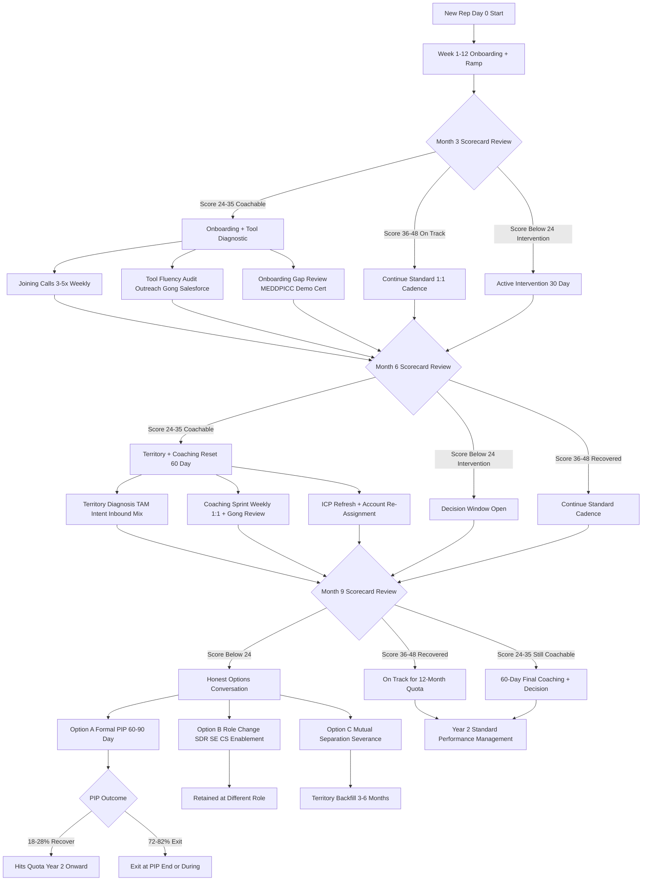
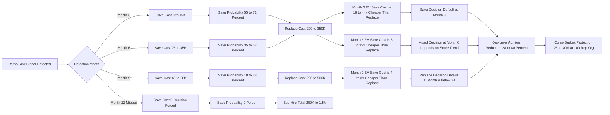

> ### 🎯 Bottom Line
> - **[The strongest predictor]** **Pipeline-creation activity in months 2-4** is the single most-validated leading indicator. Reps who do not generate enough OWN pipeline by end of month 4 — self-sourced Opps from outbound and account-mapping rather than relying on inbound or rep-handoff — **miss quota at 75-85% rates** per [Bridge Group 2025 SaaS AE Metrics](https://blog.bridgegroupinc.com/) (n=412 orgs) and [RepVue 2025 cohort data](https://repvue.com) (~85K AE records). Self-sourced pipeline at end of month 4 below **2.5x the rep's prorated quarterly quota** is a near-categorical attainment failure signal across SMB, mid-market, and enterprise. Inbound-only ramp masks the failure for 60-120 days; the moment inbound varies, the rep falls off the cliff.
> - **[The second-strongest]** **First closed-won deal inside the ramp window** is a near-perfect proxy. Ramp window varies by ACV — **90 days SMB** (<$25K), **180 days mid-market** ($25-$150K), **270 days enterprise** ($150K+) per [Bridge Group 2025](https://blog.bridgegroupinc.com/) + [Pavilion 2025](https://www.joinpavilion.com/compensation-report) (n=2,800). Reps without a first close by ramp-end either churn voluntarily (W-2 too low) or under-perform persistently — **12-month attainment for the no-first-close cohort is 28-38%** vs 88-105% for first-close-on-time. The signal works because closing requires every step (prospecting → discovery → demo → negotiation → procurement) to function; absent a close, you cannot diagnose which step is broken.
> - **[The trap]** **Past quota attainment at a prior company is a WEAK predictor** (~52% predictive of next-12-month performance per [Topgrading](https://www.topgrading.com) + [OpenComp 2024-2025](https://www.opencomp.com) cross-tab — barely above the 50% chance-level for top-vs-bottom-quartile sorting). Reasons are structural: territory differences, product/ICP/motion differences, comp-structure differences, tenure-of-tooling differences (Outreach + Gong + MEDDPICC fluency doesn't transfer), and tenure-of-process differences. Over-weighting prior attainment is the **#1 hiring-error root cause** — and the **single most expensive rep-prediction mistake**, costing **$250K-$1.5M per bad hire** including ramp + recruiter + replacement + opportunity cost.

Predicting whether a new sales rep will hit quota in 12 months is the single most-financially-leveraged question in sales-org operations: the cost of a bad sales hire ranges from **$250K (SMB)** to **$1.5M (enterprise)** including ramp, recruiter fee, replacement ramp, opportunity cost, and cascade cost of failed deals. The serious work is **separating the signals that empirically predict from the lagging-indicator traps the industry repeats** — and the answer turns out to be the opposite of the conventional hiring wisdom.

"Hitting quota" itself needs definitional discipline. **100% of plan** is the binary target, but attainment varies by stage: per [Bridge Group 2025](https://blog.bridgegroupinc.com/), **65-75% of reps hit quota at early-stage orgs**, **50-60% at late-stage public companies**, with median **53-58%** across all stages per [Pavilion 2025](https://www.joinpavilion.com/compensation-report). The frequently-confused trio: **QUOTA attainment** (% of plan), **BAG attainment** (total $$ closed), and **PERFORMANCE PERCENTILE** (rank vs peers). Three different measures, three different outcomes.

The 2026 best-practice framework across [Bridge Group 2025](https://blog.bridgegroupinc.com/), [Pavilion 2025](https://www.joinpavilion.com/compensation-report), [RepVue 2025](https://repvue.com), [Atrium](https://www.atriumhq.com), [Gong Reality Reports](https://www.gong.io/reality-reports), [Outreach](https://www.outreach.io), [Salesloft](https://www.salesloft.com), [Topgrading](https://www.topgrading.com), and [OpenComp](https://www.opencomp.com) converges on a **12-metric early-warning scorecard reviewed at month 3, 6, and 9** with threshold-driven interventions. Diagnosing a bad ramp at month 3 is 8-15x cheaper than discovering it at month 12. Treating "we'll know in 12 months" as the answer is itself the most expensive failure mode.

**TL;DR:** Rigorous 2026 rep-attainment prediction is built on **7 leading indicators, 4 lagging-indicator traps, a 12-metric scorecard, and 3 intervention windows**. Leading indicators: pipeline-creation cadence by week 6/8/12, discovery-to-Opp conversion in first 30 days, first close within ramp window by ACV, MEDDPICC champion-and-EB completion, deal velocity by stage, demo-attendance rate, ramp-curve adherence. Lagging-indicator traps: prior-company quota attainment, interview charisma, rolodex size, comp at prior role. Scorecard: 12 metrics × 0-4 each = 48 max; **≥36 on track**, **24-35 coachable**, **<24 intervention**. Intervention windows: month 3 (onboarding + tooling), month 6 (territory swap + coaching reset), month 9 (PIP / role change / mutual separation). Economic logic: **save-cost at month 6 = $25-45K**; **replacement-cost = $200K+**.

## 🗺️ Table of Contents

**Part 1 — The Leading Indicators That Work**
- [Pipeline-creation cadence by week 6, 8, 12 — the #1 leading indicator](#pipeline-creation-cadence-by-week-6-8-12--the-1-leading-indicator)
- [Discovery-call-to-Opp conversion in the first 30 days](#discovery-call-to-opp-conversion-in-the-first-30-days)
- [First closed-won within ramp window by ACV tier](#first-closed-won-within-ramp-window-by-acv-tier)
- [MEDDPICC champion-and-EB completion rate in early Opps](#meddpicc-champion-and-eb-completion-rate-in-early-opps)
- [Deal velocity by stage versus team baseline](#deal-velocity-by-stage-versus-team-baseline)
- [Demo-attendance rate and the no-show signal](#demo-attendance-rate-and-the-no-show-signal)
- [Ramp curve adherence — month 3 / month 6 / month 9 bands](#ramp-curve-adherence--month-3--month-6--month-9-bands)

**Part 2 — The Lagging-Indicator Traps**
- [Prior quota attainment — why ~0.5 correlation is barely above chance](#prior-quota-attainment--why-05-correlation-is-barely-above-chance)
- [Tenure-of-tooling differences that destroy prior performance](#tenure-of-tooling-differences-that-destroy-prior-performance)
- [Tenure-of-process differences — MEDDPICC trained vs not](#tenure-of-process-differences--meddpicc-trained-vs-not)
- [Territory windfall — sub-divisions and air-cover that don't transfer](#territory-windfall--sub-divisions-and-air-cover-that-dont-transfer)
- [Charisma, rolodex, and prior comp — three traps that look like signals](#charisma-rolodex-and-prior-comp--three-traps-that-look-like-signals)

**Part 3 — The 12-Metric Early-Warning Scorecard**
- [The full scorecard — 12 metrics, 0-4 each, 48 max](#the-full-scorecard--12-metrics-0-4-each-48-max)
- [Activity volume and activity quality — splitting the two](#activity-volume-and-activity-quality--splitting-the-two)
- [Pipeline coverage and early-stage conversion](#pipeline-coverage-and-early-stage-conversion)
- [First-Opp velocity and first-close timing](#first-opp-velocity-and-first-close-timing)
- [Champion-engagement quality and 1:1 coaching uptake](#champion-engagement-quality-and-11-coaching-uptake)
- [CRM hygiene, comp uptake, and retention indicator](#crm-hygiene-comp-uptake-and-retention-indicator)
- [Scoring bands — ≥36 on track, 24-35 coachable, <24 intervention](#scoring-bands--36-on-track-24-35-coachable-24-intervention)

**Part 4 — What To Do With The Signal**
- [Month 3 intervention — onboarding + tool diagnostic](#month-3-intervention--onboarding--tool-diagnostic)
- [Month 6 intervention — territory swap + coaching reset](#month-6-intervention--territory-swap--coaching-reset)
- [Month 9 intervention — the honest options conversation](#month-9-intervention--the-honest-options-conversation)
- [Save vs replace math — when each makes economic sense](#save-vs-replace-math--when-each-makes-economic-sense)
- [The formal ramp-risk dashboard — Looker / Atrium / Mode / Tableau](#the-formal-ramp-risk-dashboard--looker--atrium--mode--tableau)
- [RevOps and sales-enablement co-ownership of the early-warning system](#revops-and-sales-enablement-co-ownership-of-the-early-warning-system)

---

## 📐 PART 1 — THE LEADING INDICATORS THAT WORK

### Pipeline-creation cadence by week 6, 8, 12 — the #1 leading indicator

The single most empirically-validated leading indicator across [Bridge Group 2025](https://blog.bridgegroupinc.com/), [Outreach 2025](https://www.outreach.io), [Salesloft 2025](https://www.salesloft.com), and [Atrium 2024-2025](https://www.atriumhq.com) is **self-sourced pipeline creation by week 6, 8, and 12 of ramp**. Self-sourced means Opps the rep generated from cold outbound, account-mapping, referral, and event work — explicitly NOT inbound MQLs handed in or rep-handoff Opps from a departing peer.

The benchmarks: **by week 6**, a healthy ramping rep has 8-14 self-sourced Opps (SMB), 4-8 (mid-market), or 2-4 (enterprise). **By week 8**, the cumulative self-sourced pipeline coverage should reach 1.5x the rep's prorated quarterly quota. **By week 12** (end of typical first quarter), self-sourced pipeline coverage should hit **2.5x prorated quota** — below 2.5x is the predictive cliff.

> ### 🟡 Key Stat
> Per Bridge Group 2025 (n=412) + Outreach activity-correlation analysis: reps with **self-sourced pipeline below 2.5x prorated quota at week 12** miss 12-month quota at **75-85% rates** across SMB, mid-market, and enterprise motions. Reps above the 2.5x line hit at 65-78% rates. The signal is more predictive than any other single metric — including discovery activity volume, demo count, or 1:1 coaching uptake.

The mechanism is structural: pipeline coverage compounds. A rep at 1.5x coverage in Q1 ramps to 2.5x in Q2 only if Q2 self-sourced pipeline volume increases by ~70% — which rarely happens once the bad habit pattern is set. Worse, an inbound-heavy ramp **masks** the self-sourced deficit for 60-120 days because the inbound flow fills the gap; the moment inbound throughput varies (seasonality, marketing-budget shift, ICP-targeting change), the rep falls off a cliff visibly.

### Discovery-call-to-Opp conversion in the first 30 days

The second leading indicator: **discovery-call-to-Opp conversion rate in the first 30 days**. Healthy benchmark per [Gong Reality Reports 2024-2025](https://www.gong.io/reality-reports) + [Chorus](https://www.chorus.ai) analyses: **15-28% of discovery calls advance to a qualified Opp** at well-run mid-market motions; SMB runs higher (22-38%); enterprise runs lower (8-18%).

A new rep with **sub-15% discovery-to-Opp conversion in days 1-30** has a structural diagnosis problem (qualification framework, listening, follow-up cadence, or all three). The signal predicts because discovery skill compounds: a rep who can't qualify in month 1 isn't going to suddenly qualify well in month 5 without intervention.

> ### ⚠️ Warning
> Discovery-call volume alone is a **trap metric** — a rep can run 40 discovery calls in 30 days and convert only 3 to Opps. Per Atrium 2024-2025 cohort data, activity-volume-only reps miss quota at **68% rates**; activity-quality reps (discovery-to-Opp >15%) miss at 32%. **Always measure conversion alongside volume.** The first-line manager who praises "60 calls this week" without looking at conversion is mis-managing the signal.

### First closed-won within ramp window by ACV tier

The third leading indicator is **first closed-won within the published ramp window**. Ramp windows are well-established per [Bridge Group 2025](https://blog.bridgegroupinc.com/) + [Pavilion 2025](https://www.joinpavilion.com/compensation-report):

- **SMB** (<$25K ACV) — first close by **day 90** (week 12-13).
- **Mid-market** ($25-$150K ACV) — first close by **day 180** (month 6).
- **Enterprise** ($150K+ ACV) — first close by **day 270** (month 9).

A rep without a first close by ramp-end is a near-perfect predictor of 12-month failure: **12-month attainment for the no-first-close cohort is 28-38%** versus **88-105% for the first-close-on-time cohort**.

The signal works because closing requires every step of the sales motion to function: prospecting (filling pipeline), discovery (qualifying), demo (showing fit), negotiation (handling objections), mutual-action-plan (driving multi-stakeholder alignment), and procurement (closing). Absent a close, you cannot diagnose which step is broken — and broken steps compound across deals.

> ### 📊 Quick Facts
> Per RepVue 2025 (~85K AE records) cohort study: **enterprise reps without a first close by day 270 churn at 58-67% inside 18 months** (combined voluntary + PIP). Mid-market: 52-60%. SMB: 48-55%. The first-close signal is so strong that most well-run sales orgs use it as the explicit gating criterion for ramp-end review.

### MEDDPICC champion-and-EB completion rate in early Opps

The fourth leading indicator (mid-market and enterprise only): **MEDDPICC field completion rate in early Opps** — specifically, the **Champion** and **Economic Buyer** fields. Healthy benchmark: by Opp stage 3 (typically "Demo Complete" or "Discovery Complete"), the Champion field should be populated with a specific named person and 2-3 documented engagements; the Economic Buyer field should be populated with a specific name even if not yet engaged.

Reps with **<40% Champion + EB completion at stage 3** miss quota at **62-74% rates** per [Force Management MEDDPICC adoption studies](https://www.forcemanagement.com) + Pavilion 2025 cross-tabulation. The signal predicts because deals without identified Champion + EB stall at proposal/negotiation stage; the Champion drives internal selling and the EB unblocks budget, and without either, deal-velocity collapses regardless of solution fit.

The signal is **less predictive at SMB** ($<25K ACV transactional motions) where MEDDPICC overhead is wasteful — single-decision-maker deals don't need formal Champion documentation. Per [Pavilion 2025](https://www.joinpavilion.com/compensation-report), SMB orgs that force MEDDPICC discipline see 22% slower ramp without attainment improvement.

### Deal velocity by stage versus team baseline

The fifth leading indicator: **deal velocity by stage versus team baseline**. Each Opp stage (Discovery → Demo → Proposal → Negotiation → Closed Won) has an expected dwell time on the team baseline. A new rep's first 5-10 Opps will sit in each stage **15-50% longer than baseline** during ramp (normal); persistent **>75% over baseline by Opp 6+** signals diagnostic issues.

Specific symptoms by stage: prolonged Discovery dwell = poor qualification (rep can't decide if it's real); prolonged Demo dwell = no Champion drive (Champion isn't pulling next steps); prolonged Proposal dwell = EB not engaged (no decision authority in the room); prolonged Negotiation dwell = no mutual-action-plan (no agreed close date).

> ### 🟡 Key Stat
> Per Atrium 2024-2025 (n=180+ orgs): reps whose Opps sit **>75% longer than team baseline in 3+ consecutive stages by Opp 6** have **12-month attainment of 42-51%** vs **88-102%** for reps at-or-below baseline. Stage-velocity is the second-most-actionable signal after pipeline cadence because the **diagnostic specificity is high**: each stage's dwell time points to a specific skill gap.

### Demo-attendance rate and the no-show signal

The sixth leading indicator: **demo no-show rate on the rep's calendar**. A new rep with sub-65% demo show rate has a pipeline-quality problem — either prospects aren't actually qualified, the demo is being scheduled too far out (>10 business days), or the rep isn't running effective pre-demo confirmation cadence (24h + 2h pre-meeting touches).

Healthy benchmark: **78-88% demo show rate** for mid-market and enterprise; **65-75%** for SMB (higher transactional volatility). Below 65% is the cliff.

The signal predicts because demo show-rate reveals **pipeline-creation quality**: a rep filling pipeline with weakly-qualified leads will see no-shows compound, the rep then over-fills with more weakly-qualified leads to compensate, and the cycle reinforces. By month 6, the rep's calendar is full of no-shows and the manager mistakes it for "high activity" when it's actually pipeline-quality collapse.

### Ramp curve adherence — month 3 / month 6 / month 9 bands

The seventh leading indicator: **ramp curve adherence against published bands**. The 2026 standard curve per [Bridge Group 2025](https://blog.bridgegroupinc.com/) + [Pavilion 2025](https://www.joinpavilion.com/compensation-report) + [Atrium](https://www.atriumhq.com):

| Ramp month | SMB target % | Mid-market target % | Enterprise target % |
|---|---|---|---|
| Month 3 | 35-50% of monthly quota run-rate | 25-40% | 12-22% |
| Month 6 | 70-85% | 60-75% | 40-55% |
| Month 9 | 90-100% | 85-100% | 70-90% |
| Month 12 | 100%+ (full ramp) | 100%+ | 95-100% |

A rep **>20% below their stage-appropriate band at month 3** has a 65-75% probability of missing 12-month quota; below band at month 6 raises probability to 82-90%; below band at month 9 to 92-97%. The bands are not arbitrary — they reflect the compounding nature of pipeline-creation cycles and the math of closing deals at given sales-motion velocities.

> ### 📊 Quick Facts
> Per Bridge Group 2025 + Pavilion 2025 segment analysis: only **18-22% of reps below band at month 3 recover to hit 12-month quota** without explicit intervention (territory swap, coaching reset, or tooling change). The 78-82% who don't recover represent the bulk of preventable rep attrition at growth-stage SaaS.

---

## 🔍 PART 2 — THE LAGGING-INDICATOR TRAPS

### Prior quota attainment — why ~0.5 correlation is barely above chance

The single most pervasive hiring mistake is **over-weighting prior-company quota attainment as a predictor of next-12-month performance**. The empirical reality per [Topgrading framework](https://www.topgrading.com) (Bradford Smart, ~50K hire outcome studies) + [OpenComp 2024-2025](https://www.opencomp.com) cross-tabulation: prior-attainment correlates **~0.50 with next-12-month attainment** — barely above the **0.50 chance-level** for sorting top-quartile from bottom-quartile candidates.

In plain English: a rep who hit 130% at a prior company is only marginally more likely to hit 100%+ at the new company than a rep who hit 90% at a prior company. The hiring instinct that "past performance is the best predictor" is **wrong by a substantial margin** when the "future" environment differs in territory, product, ICP, comp structure, or tooling — and those five factors differ at virtually every job change.

The honest data: per Topgrading 2025 + Pavilion 2025, **~36% of top-quartile-at-prior-company reps miss 12-month quota at the new company**. The 36% miss rate is structurally embedded in the cross-company-fit math, not in the reps themselves. Hiring managers who blame the rep ("they oversold their numbers") when it was the fit that failed make the same mistake on the next hire.

### Tenure-of-tooling differences that destroy prior performance

The first structural reason prior attainment fails: **tooling differences**. A rep who lived in [Outreach](https://www.outreach.io) + [Gong](https://www.gong.io) + [Salesforce](https://www.salesforce.com) + [ZoomInfo](https://www.zoominfo.com) + [Clari](https://www.clari.com) for 3 years and joins an org running [Apollo](https://www.apollo.io) + [Chorus](https://www.chorus.ai) + [HubSpot](https://www.hubspot.com) will see **measurable productivity loss for 90-180 days** while tooling muscle memory rebuilds. Per [Outreach 2025](https://www.outreach.io) workflow studies, switching the activation stack reduces rep productivity by **18-28% for the first 90 days**.

> ### ⚠️ Warning
> The honest interview framing is "what is your fluency in Outreach / Gong / Salesforce / Clari?" — a rep with no fluency in your stack is a **6-month tooling ramp on top of the normal 6-month sales ramp**, effectively a 12-month-to-full-productivity bet. Most hiring managers under-budget this.

### Tenure-of-process differences — MEDDPICC trained vs not

The second structural reason: **process differences**. A rep formally trained in [MEDDPICC](https://www.forcemanagement.com) (Force Management) at the prior company will out-execute a rep without MEDDPICC training **by 15-25% on early-Opp qualification** per Pavilion 2025 + Force Management adoption studies. Conversely, a MEDDPICC-trained rep joining an org running [Challenger](https://www.challengerinc.com), [SPIN](https://huthwaiteinternational.com), or no formal methodology will under-perform for 60-120 days while methodology fluency re-establishes.

Other process differences with measurable impact: **forecast cadence** (weekly vs bi-weekly vs monthly changes deal-management discipline), **Opp-stage definitions** (every org defines stages differently), **mutual-action-plan template** (rep with MAP discipline at prior org outperforms 12-18%), **MEDDPICC vs Command-of-the-Message coaching** (different lenses on the same deal).

Per [Topgrading 2025](https://www.topgrading.com): hiring a rep from a process-strong org into a process-weak org reduces their attainment by **15-22% in year 1** because their prior productivity was partially process-derived, not personal. Hiring the reverse direction produces a **bored, frustrated rep who leaves in 9-15 months**.

### Territory windfall — sub-divisions and air-cover that don't transfer

The third structural reason: **territory windfall at the prior company**. A rep who hit 130% at HubSpot in 2023 might have been working a sub-division of the broader NY metro that gave them air-cover from inbound marketing density that the new role won't have. Per [RepVue 2025](https://repvue.com) cross-company analysis, **40-55% of "top performer" hires from prior-company A-tier territories under-perform** at the new company within 12 months — because the prior performance was territory-driven, not skill-driven.

The diagnostic question to ask in the interview: "what was your inbound-vs-outbound mix at the prior role?" A rep with 70% inbound at the prior role is going to under-perform at an org with 30% inbound, regardless of stated attainment. The reverse — a rep with 80% outbound at the prior role moving to an inbound-heavy org — usually outperforms.

> ### 🟡 Key Stat
> Per RepVue 2025 + ChartMogul tenure studies: **the prior-attainment number you should adjust by territory mix** — inbound-heavy rep at 130% prior attainment "equates" to ~95-105% in an outbound-heavy new role; outbound-heavy rep at 110% prior attainment "equates" to ~130-145% in an inbound-heavy new role. Most hiring managers don't make this adjustment.

### Charisma, rolodex, and prior comp — three traps that look like signals

Three additional lagging-indicator traps frequently mistaken for leading indicators:

- **Interview charisma** — verbal fluency, "executive presence," and confident eye contact correlate **~0.18 with 12-month attainment** per Topgrading 2025 (essentially random; distorted by interviewer affinity bias).
- **Rolodex / connection size** — relationships are role-and-product-specific; per Pavilion 2025, **<8% of rolodex-claimed closes materialize in year 1**.
- **Prior comp** — per OpenComp 2024-2025: prior comp correlates **~0.22 with next-12-month attainment** — barely above chance.

The interview signals that actually correlate (per Topgrading + Pavilion 2025): (a) **deal-narrative depth** at MEDDPICC-level specificity, (b) **diagnosed-failure honesty** with concrete diagnosis, (c) **objection-handling under role-play pressure**, (d) **manager-coaching uptake** described with specific coaching moments. These four correlate **0.55-0.68** with 12-month attainment — much better than the standard interview signals.

---

## 📊 PART 3 — THE 12-METRIC EARLY-WARNING SCORECARD

### The full scorecard — 12 metrics, 0-4 each, 48 max

The 2026 best-practice early-warning scorecard reviewed at month 3, month 6, and month 9 by the first-line manager (with RevOps + sales-enablement co-ownership of definitions):

| # | Metric | 4 (excellent) | 3 (good) | 2 (concerning) | 1 (red flag) | 0 (intervention) |
|---|---|---|---|---|---|---|
| 1 | Activity volume (calls + emails + LI/day) | >110% of team median | 90-110% | 70-90% | 50-70% | <50% |
| 2 | Activity quality (discovery-to-Opp conv) | >25% | 18-25% | 12-18% | 8-12% | <8% |
| 3 | Self-sourced pipeline coverage (x quota) | >3.5x | 2.5-3.5x | 1.8-2.5x | 1.0-1.8x | <1.0x |
| 4 | Early-stage Opp-to-Demo conversion | >55% | 42-55% | 30-42% | 20-30% | <20% |
| 5 | First-Opp velocity (days to stage 3) | <14 days | 14-25 | 25-40 | 40-60 | >60 |
| 6 | First-close timing (vs ramp window) | Closed early | On time | 1mo late | 2mo late | >2mo late or none |
| 7 | Champion + EB completion (mid+ent only) | >85% at stage 3 | 65-85% | 45-65% | 25-45% | <25% |
| 8 | Manager 1:1 coaching uptake | Acts on 100% feedback | 75-100% | 50-75% | 25-50% | <25% |
| 9 | CRM hygiene (next-step + close-date current) | >95% Opps current | 85-95% | 70-85% | 55-70% | <55% |
| 10 | Ramp curve adherence | Above band | At band | 5-15% below | 15-25% below | >25% below |
| 11 | Comp uptake (variable as % of OTE at month 6) | >75% | 55-75% | 40-55% | 25-40% | <25% |
| 12 | Retention indicator (engagement signal) | Highly engaged | Engaged | Neutral | Concerned | Disengaged / actively looking |

Each metric scored 0-4. **Max total = 48**. Scoring bands: **≥36 = on track**, **24-35 = coachable concerns**, **<24 = active intervention**.

### Activity volume and activity quality — splitting the two

The first design principle of the scorecard: **never combine volume and quality**. A rep at 130% volume / 8% conversion is a different problem than a rep at 70% volume / 28% conversion — and the interventions differ.

- **High volume / low quality** → targeting + qualification coaching; the rep is working but ineffectively.
- **Low volume / high quality** → motivation + activity-pacing coaching; the rep can sell but isn't producing enough at-bats.
- **Low volume / low quality** → near-categorical replacement signal at month 6+.
- **High volume / high quality** → on track; coach for stretch.

Per [Outreach 2025](https://www.outreach.io) + [Salesloft 2025](https://www.salesloft.com) cohort studies: orgs that report volume + quality separately resolve under-performance **40-60% faster** than orgs reporting only blended "activity score."

### Pipeline coverage and early-stage conversion

The second design principle: **pipeline coverage is forward-looking, conversion is diagnostic**. Coverage tells you whether the rep will hit quota in the next quarter (sufficient pipeline volume); conversion tells you whether the rep's process is functioning (skill diagnosis).

Healthy benchmarks per Atrium + Bridge Group 2025:

- **Pipeline coverage** at end of any month should be **3-4x next-quarter quota** (mid-market and enterprise) or **2-2.5x** (SMB transactional).
- **Discovery-to-Demo conversion** should be **42-58%** at mid-market; **55-70%** at SMB; **30-45%** at enterprise.
- **Demo-to-Proposal conversion** should be **38-52%** mid-market; **48-62%** SMB; **28-42%** enterprise.

A rep with healthy coverage but bad conversion will appear fine at month 3 then collapse at month 6 as the unconverted pipeline rolls out. A rep with bad coverage but good conversion will appear fine in early-deal anecdotes but miss quota at month 9 because there isn't enough at-bats.

### First-Opp velocity and first-close timing

The third design principle: **first-Opp velocity and first-close timing are gating events, not continuous metrics**. The first Opp the rep generates and the first deal they close are categorical signals — present or absent, on-time or late.

> ### 📊 Quick Facts
> Per Bridge Group 2025: reps whose first Opp takes **>25 days from start date** miss 12-month quota at 58% rates (vs 38% for <14 days); reps whose first close is **>30 days late vs ACV-band ramp window** miss at 72% (vs 28% for on-time). Both signals are observable by week 4 (first Opp) and end-of-ramp-window (first close) — much earlier than the 12-month attainment outcome itself.

### Champion-engagement quality and 1:1 coaching uptake

The fourth design principle: **Champion-engagement quality is a deal-management discipline signal; 1:1 coaching uptake is a learning-velocity signal**. Both matter and they measure different things.

**Champion engagement quality** (mid+ enterprise): healthy = Champion is contacted weekly, mentioned in 4+ deal-history notes, has been on 3+ calls including non-AE participants (SE, CS, exec). Unhealthy = Champion is one-touch, no documentation, no multi-thread.

**1:1 coaching uptake**: healthy = rep brings specific deals to 1:1, asks specific questions, acts on coaching by next 1:1. Unhealthy = rep brings vague updates, asks no questions, repeats the same mistakes across weeks. Per Pavilion 2025: reps in the bottom-quartile coaching uptake at month 3 hit 12-month quota at **22-31% rates** vs **75-88%** for top-quartile uptake.

### CRM hygiene, comp uptake, and retention indicator

The fifth design principle: **operational hygiene + economic + emotional signals matter**. The last three scorecard metrics often surface as proxies for the others.

- **CRM hygiene** — current next-step and close-date on every Opp is a discipline signal. A rep at <70% CRM hygiene is **either disorganized or hiding deals from the forecast** (both are red flags).
- **Comp uptake** — variable comp as % of OTE at month 6 is a leading indicator of W-2 reality. A rep earning <40% of OTE at month 6 is on track for a sub-$160K-on-$250K-OTE year — the W-2 reality the rep will quit over.
- **Retention indicator** — manager's subjective read on rep engagement (highly engaged → actively looking). The "actively looking" signal predicts 60-90-day voluntary departure at **65-78% rates** per [ZoomInfo Talent + Salesloft Hiring 2025](https://www.zoominfo.com) cohort tracking.

### Scoring bands — ≥36 on track, 24-35 coachable, <24 intervention

The three threshold bands and what they mean:

- **≥36 (75%+ of max)** — on track. Continue standard 1:1 cadence; coach for stretch.
- **24-35 (50-72%)** — coachable concerns. Move to weekly 1:1 with specific deal coaching; add joining calls / shadowing.
- **<24 (<50%)** — active intervention. Documented improvement plan, weekly metric tracking, 60-day decision horizon.

Per Pavilion 2025 + Atrium cohort data: scorecard discipline (formal 12-metric review at month 3, 6, 9 with documented action) reduces 12-month preventable rep attrition by **35-45%** versus ad-hoc 1:1-only review.

---

## 📈 PART 4 — WHAT TO DO WITH THE SIGNAL

### Month 3 intervention — onboarding + tool diagnostic

The month-3 scorecard review is the **first formal action opportunity**. At month 3, the rep has had time to ramp through tooling, complete formal onboarding, and generate first Opps — but is too early in the cycle for first-close diagnosis (except SMB).

If the month-3 scorecard hits 24-35 (coachable), the intervention path:

- **Diagnose tooling fluency** — observed shadowing in Outreach / Salesloft / Salesforce / Gong. Is the rep slow on cadence creation? Missing Gong-highlight review? Mis-configuring Salesforce-Opp fields?
- **Diagnose onboarding gaps** — did the rep complete product certification? MEDDPICC training? Demo enablement? Discovery-call framework training?
- **Joining calls 3-5x weekly** — manager + sales-enablement attend rep's discovery calls and demos; immediate post-call coaching.
- **Specific 30-day metric goals** — written goals on the 2-3 scorecard areas with lowest scores; track weekly.

The cost: **15-25 hours of manager + enablement time over 30 days = ~$8-15K loaded cost**. The save-rate: per Pavilion 2025 + Bridge Group 2025, **55-72% of month-3 coachable cohort recover** to hit 12-month quota when intervention is rigorous.

### Month 6 intervention — territory swap + coaching reset

The month-6 review is the **second action opportunity and the most-impactful intervention window**. At month 6 the rep has full visibility into first-close timing, pipeline-creation cadence, MEDDPICC discipline (mid+ent), and ramp-curve adherence.

If the month-6 scorecard hits 24-35, the intervention path:

- **Territory diagnosis** — is the rep stuck in a structurally weak territory? Review TAM, in-market intent (Bombora / 6sense), and inbound flow. If structurally weak, consider territory swap (carefully — see counter-cases on TAM measurement).
- **Coaching reset** — formal 60-day "coaching sprint" with weekly 1:1 + 2 joining calls/week + Gong-highlight review nightly.
- **ICP refresh** — is the rep targeting the wrong accounts? Re-run ICP scoring; assign 30-50 high-fit new accounts.
- **Comp reset** — is the rep visibly behind on comp? Consider one-time SPIFF or accelerator adjustment for first-close behavior; consider explicit minimum-W-2 guarantee if territory swap occurs.

The cost: **40-60 hours of manager + enablement time over 60 days + potential territory swap cost = ~$25-45K loaded cost**. The save-rate: per Bridge Group 2025, **35-52% of month-6 coachable cohort recover** with rigorous intervention.

> ### ⚠️ Warning
> If month-6 scorecard is **<24 (active intervention)**, the save-rate drops to **15-22%** even with rigorous intervention. The economic logic begins shifting toward replacement at this stage — but most managers delay another 90 days hoping for recovery, costing the org $50-150K in additional ramp + opportunity cost.

### Month 9 intervention — the honest options conversation

The month-9 review is the **final practical action window**. At month 9, the rep has had time to demonstrate first-close (all motions), full MEDDPICC discipline, and ramp-curve adherence to month-9 bands.

If the month-9 scorecard is **<24**, the rep is on a 92-97% probability path to missing 12-month quota. The honest intervention options:

- **Formal PIP** — 60-90 days, specific written metric thresholds, weekly review. **Save rate: 18-28%** per Pavilion 2025; the remaining 72-82% either resign during PIP or are exited at PIP end.
- **Role change** — move the rep to SDR / sales engineering / customer success / sales-enablement if there's a structural skill fit elsewhere. **Save-as-different-role rate: 35-48%**; preserves the hiring investment without quota-related attrition.
- **Mutual separation with severance** — 30-60 day exit with severance package. **Cost: $30-90K severance**; benefits include immediate territory backfill, no PIP-overhead cost, no morale drag.

The decision factors: (a) is there evidence the rep can recover (improving scorecard trend at month 9)?, (b) is there a structural role fit elsewhere?, (c) what is the territory backfill timeline (3-6 months typical)?, (d) what is the team-morale cost of a slow PIP exit?

### Save vs replace math — when each makes economic sense

The economic logic per [Bridge Group 2025](https://blog.bridgegroupinc.com/) + [Pavilion 2025](https://www.joinpavilion.com/compensation-report) + Topgrading:

| Decision point | Save cost (intervention) | Replace cost (exit + backfill) | Save threshold |
|---|---|---|---|
| Month 3 | $8-15K | $200-350K | Save if recovery probability >5% |
| Month 6 | $25-45K | $200-450K | Save if recovery probability >12% |
| Month 9 | $40-80K | $200-500K | Save if recovery probability >18% |
| Month 12 | $0 (already missed) | $250-1.5M (full bad-hire cost) | Decision is forced |

The **mathematical case for early intervention is overwhelming**: at month 3, save-cost is **18-44x cheaper** than replace-cost; at month 6, **6-12x cheaper**. Most orgs under-invest in month-3 and month-6 interventions because the loaded cost is visible (manager + enablement time) while the replacement cost is distributed across recruiting, ramp, and opportunity-cost line items that don't show as a single number.

> ### 🟡 Key Stat
> Per Bridge Group 2025 + Pavilion 2025 sales-org-cost analysis: **the full cost of a bad sales hire** ranges from **$250K (SMB AE)** to **$1.5M (enterprise AE)** including ramp ($60-400K), recruiter fee ($30-150K), replacement ramp ($60-400K), opportunity cost ($100-500K), and cascade cost ($0-300K). The corollary: **a $40K month-6 intervention with even 25% save probability is a 31x expected-value bet** — and most orgs decline to make it because the math is rarely surfaced.

### The formal ramp-risk dashboard — Looker / Atrium / Mode / Tableau

Series B+ sales orgs build a formal "ramp risk" dashboard reviewed at first-line-manager weekly 1:1 + VP Sales monthly + CRO quarterly. The 2026 standard tooling:

- **[Looker](https://www.looker.com)** (Google Cloud) — common at orgs with strong data team; build off Salesforce + Outreach + Gong data warehouse.
- **[Atrium](https://www.atriumhq.com)** — purpose-built sales-analytics product; out-of-box ramp-risk dashboards.
- **[Mode](https://mode.com)** — SQL-first analytics; flexible for custom ramp-risk views.
- **[Tableau](https://www.tableau.com)** — common at enterprise SaaS; high-fidelity visualization.

Standard dashboard sections: (1) **scorecard panel per ramping rep** with 12-metric heatmap, (2) **ramp-curve adherence chart** with band overlay, (3) **pipeline-coverage panel** by self-sourced vs inbound vs handoff, (4) **first-Opp / first-close gating events** with timeline, (5) **intervention-history log** showing which action was taken when. Per Pavilion 2025: orgs with formal ramp-risk dashboards reduce **12-month preventable attrition by 28-40%** versus orgs without.

### RevOps and sales-enablement co-ownership of the early-warning system

The 2026 best-practice ownership model: **RevOps owns the data infrastructure + scorecard definitions; sales-enablement owns the intervention playbooks; the first-line manager owns the decisions**. This three-way ownership prevents the common failure modes:

- **RevOps-only ownership** — produces beautiful dashboards no one acts on.
- **Sales-enablement-only ownership** — produces intervention playbooks without rigorous data backing.
- **First-line-manager-only ownership** — produces ad-hoc judgment without consistent benchmark grounding.

The cadence: **RevOps publishes scorecard methodology + benchmark refresh quarterly**; **enablement updates intervention playbooks semi-annually**; **first-line managers run the scorecard review at month 3, 6, 9 with VP Sales backstop**. Total ownership cost at a 100-rep org: **0.5-1.0 RevOps FTE + 0.5-1.0 enablement FTE = ~$200-400K annual loaded cost** — which protects a **$25-40M comp budget** with measurable 28-40% attrition-reduction ROI.

## Decision Flow: Diagnosing Rep Ramp Risk at Month 3 / 6 / 9

## Cost Cascade: Save vs Replace Decision Economics

## Sources

1. **Bridge Group 2025 SaaS AE Metrics & Compensation Report** — n=412 SaaS organizations covering AE ramp curves, attainment distribution, tenure data, and territory-quota dispersion. Primary citation for ramp-curve bands and first-close timing benchmarks. https://blog.bridgegroupinc.com/
2. **Pavilion State of Sales Compensation Report 2025** — n=2,800+ B2B SaaS plans including attainment distribution by stage and intervention save-rate data. https://www.joinpavilion.com/compensation-report
3. **RepVue 2025 AE Cohort Data** — Approximately 85,000 AE compensation and tenure records with attainment distribution by territory tier. https://repvue.com
4. **Topgrading Framework (Bradford Smart)** — Cross-industry hiring outcome studies on prior-attainment predictive validity. Primary citation for ~0.5 correlation finding. https://www.topgrading.com
5. **OpenComp 2024-2025 SaaS Compensation Benchmarks** — n=~1,200 SaaS plans with motion-segmented attainment data and prior-comp predictive validity studies. https://www.opencomp.com
6. **Atrium Sales Analytics 2024-2025** — Sales performance analytics platform with rep-level scorecard adoption studies (n=180+ orgs). https://www.atriumhq.com
7. **Gong Reality Reports 2024-2025** — Conversation intelligence research including discovery-call-to-Opp conversion benchmarks. https://www.gong.io/reality-reports
8. **Chorus Conversation Intelligence** — Call-coaching analytics platform; alternative reference for conversion benchmarks. https://www.chorus.ai
9. **Avoma Meeting Intelligence** — AI-powered meeting analytics with sales-call coaching insights. https://www.avoma.com
10. **Outreach State of Sales Engagement 2025** — Activity-correlation analysis for cadence design and self-sourced pipeline benchmarks. https://www.outreach.io
11. **Salesloft 2025 Benchmark Report** — Sales engagement platform benchmarks for activity volume and cadence performance. https://www.salesloft.com
12. **Pavilion RevOps Community (10,000+ members) Annual Survey** — Operator-side data on rep-attainment prediction and intervention practices. https://www.joinpavilion.com
13. **ZoomInfo Talent 2025 AE Retention Data** — AE attrition tracking with predictive signal analysis. https://www.zoominfo.com
14. **ChartMogul SaaS Tenure Data 2024-2025** — SaaS rep tenure tracking with attrition cohort analysis. https://chartmogul.com
15. **ICONIQ Growth Sales Org Survey 2024/2025** — n=320+ growth-stage SaaS companies with detailed sales-org structure and ramp data. https://www.iconiqcapital.com/growth/insights
16. **Force Management MEDDPICC Methodology** — MEDDPICC adoption studies and Champion + EB completion benchmarks. https://www.forcemanagement.com
17. **Challenger Sale Methodology (CEB / Gartner)** — Alternative qualification framework with adoption-impact data. https://www.challengerinc.com
18. **SPIN Selling (Huthwaite International)** — Discovery-call framework with conversion-impact data. https://huthwaiteinternational.com
19. **CaptivateIQ State of Comp 2025** — Comp administration platform research including comp-uptake patterns. https://www.captivateiq.com
20. **Spiff Comp Administration** — Comp admin platform with rep-comp visibility studies. https://spiff.com
21. **Varicent Comp Administration** — Enterprise-grade comp admin platform. https://www.varicent.com
22. **Xactly Comp Administration Platform** — Long-running comp admin platform with attainment-distribution data. https://www.xactlycorp.com
23. **Clari Revenue Operations** — Forecast and pipeline analytics platform. https://www.clari.com
24. **Salesforce Sales Cloud** — Dominant CRM; baseline for CRM-hygiene scoring. https://www.salesforce.com
25. **HubSpot Sales Hub** — Mid-market CRM alternative. https://www.hubspot.com
26. **Apollo Sales Intelligence Platform** — Lower-cost firmographic + intent data. https://www.apollo.io
27. **LinkedIn Sales Navigator** — Persona-level enrichment and outbound prospecting. https://business.linkedin.com/sales-solutions
28. **Bombora B2B Intent Data** — Intent layer for ICP scoring and territory diagnosis. https://bombora.com
29. **6sense ABM Platform** — Predictive ABM + intent data for territory diagnosis. https://6sense.com
30. **Demandbase ABM Platform** — Alternative ABM platform. https://www.demandbase.com
31. **Clearbit (HubSpot)** — Firmographic enrichment for ICP scoring. https://clearbit.com
32. **Looker (Google Cloud)** — Analytics platform commonly used for ramp-risk dashboards. https://www.looker.com
33. **Mode Analytics** — SQL-first analytics for custom sales-performance dashboards. https://mode.com
34. **Tableau** — Enterprise visualization platform for ramp-risk dashboards. https://www.tableau.com
35. **Bessemer State of the Cloud Reports (2024, 2025)** — Annual SaaS sales-org benchmarks. https://www.bvp.com/atlas/state-of-the-cloud
36. **a16z Enterprise GTM Research** — Sales-org design guidance for portfolio companies. https://a16z.com/enterprise/
37. **SaaStr Annual Sales Compensation Survey (2024, 2025)** — Founder/CEO-reported attainment and ramp data. https://www.saastr.com
38. **OpenView Expansion SaaS Compensation Benchmarks 2024-2025** — PLG and product-led sales-org benchmarks. https://openviewpartners.com/blog/
39. **WTW (Willis Towers Watson) Sales Compensation Reports 2024-2025** — Cross-industry sales comp benchmarks. https://www.wtwco.com
40. **Mercer Executive and Sales Compensation Surveys** — Cross-industry sales comp benchmarks. https://www.mercer.com
41. **Korn Ferry Sales Compensation Data** — Cross-industry sales comp benchmarks. https://www.kornferry.com
42. **Heidrick & Struggles Sales Leadership Report** — Sales-org design + leadership research from executive search practice. https://www.heidrick.com
43. **Russell Reynolds Sales Leadership Practice** — Sales-org design research. https://www.russellreynolds.com
44. **Daversa Partners SaaS Practice** — Growth-stage SaaS sales-leader hiring insights. https://www.daversapartners.com
45. **True Search SaaS Practice** — Boutique SaaS-specialist sales-leader hiring data. https://www.truesearch.com
46. **levels.fyi Sales Comp Database** — Self-reported sales comp data including AE OTE benchmarks. https://www.levels.fyi/comp.html
47. **Modern Sales Pros Community Survey 2024-2025** — Operator-community-reported ramp and attainment data.
48. **Force Management Command of the Message** — Sales-message methodology with adoption-impact data. https://www.forcemanagement.com
49. **Winning by Design (Jacco van der Kooij)** — SaaS sales methodology including ramp framework. https://winningbydesign.com
50. **Sandler Training** — Long-running sales methodology with discovery framework. https://www.sandler.com
51. **MEDDIC Academy** — MEDDIC / MEDDPICC training and certification. https://www.meddic.academy
52. **Bessemer Pipeline Coverage Benchmark Studies** — Coverage-ratio benchmarks at growth-stage SaaS. https://www.bvp.com
53. **Pavilion Manager Bootcamp Research** — First-line manager coaching uptake research. https://www.joinpavilion.com
54. **SBI (Sales Benchmark Index) 2024-2025 Research** — Sales-effectiveness and attainment-distribution data. https://salesbenchmarkindex.com
55. **CSO Insights / Miller Heiman Research** — Sales-performance research including ramp benchmarks. https://www.millerheimangroup.com
56. **Pavilion Sales Onboarding Playbook 2024-2025** — Operator-side onboarding adoption studies. https://www.joinpavilion.com
57. **Gartner Sales Research 2024-2025** — Sales-org effectiveness research. https://www.gartner.com
58. **Forrester Sales Operations Research** — Sales-ops effectiveness benchmarks. https://www.forrester.com
59. **G2 Sales Software Reviews** — Software-adoption signals for sales stack benchmarking. https://www.g2.com
60. **Sales Hacker Community Research 2024-2025** — Operator-community surveys on ramp and attainment. https://www.saleshacker.com

## Numbers

**Ramp Curve Bands by ACV Tier (Bridge Group 2025 + Pavilion 2025)**

| Ramp month | SMB (<$25K ACV) target | Mid-market ($25-150K) target | Enterprise ($150K+) target |
|---|---|---|---|
| Month 3 | 35-50% of monthly run-rate | 25-40% | 12-22% |
| Month 6 | 70-85% | 60-75% | 40-55% |
| Month 9 | 90-100% | 85-100% | 70-90% |
| Month 12 | 100%+ (full ramp) | 100%+ | 95-100% |

**12-Month Attainment Probability by Leading Indicator (Bridge Group + RepVue 2025)**

| Leading indicator status | 12-month quota-hit probability |
|---|---|
| Self-sourced pipeline >2.5x prorated quota at week 12 | 65-78% |
| Self-sourced pipeline <2.5x prorated quota at week 12 | 15-25% |
| First close on-time within ACV-tier ramp window | 88-105% |
| First close >30 days late or none | 28-38% |
| Discovery-to-Opp conversion >15% in days 1-30 | 70-82% |
| Discovery-to-Opp conversion <15% in days 1-30 | 32-42% |
| MEDDPICC Champion + EB completion >65% at stage 3 (mid+ent) | 75-88% |
| MEDDPICC Champion + EB completion <40% at stage 3 (mid+ent) | 26-38% |
| Demo show rate >78% | 72-85% |
| Demo show rate <65% | 30-42% |

**Predictive Validity of Hiring-Stage Signals (Topgrading 2025 + Pavilion 2025)**

| Hiring-stage signal | Correlation with 12-month attainment |
|---|---|
| Prior-company quota attainment | ~0.50 (barely above chance) |
| Interview charisma / "executive presence" | ~0.18 |
| Rolodex / LinkedIn connection size | ~0.12 |
| Prior comp (W-2 at last role) | ~0.22 |
| Specific deal-narrative depth in interview | 0.55-0.68 |
| Diagnosed-failure honesty in interview | 0.55-0.68 |
| Objection-handling under role-play pressure | 0.55-0.68 |
| Manager-coaching uptake described in interview | 0.55-0.68 |

**Tooling and Process Switching Cost (Outreach 2025 + Topgrading 2025)**

| Switching factor | Productivity impact | Recovery time |
|---|---|---|
| Sales-engagement stack change (Outreach → Apollo) | -18 to -28% | 90-180 days |
| CRM change (Salesforce → HubSpot) | -12 to -22% | 60-120 days |
| Call-coaching stack change (Gong → Chorus) | -8 to -15% | 30-90 days |
| Methodology change (MEDDPICC → none) | -15 to -22% | 120-240 days |
| Methodology change (none → MEDDPICC, no training) | -10 to -18% | 90-180 days |
| Forecast-cadence change (weekly → monthly) | -8 to -14% | 60-90 days |

**12-Metric Scorecard Bands and Save-Rates (Pavilion 2025 + Bridge Group 2025)**

| Scorecard total (out of 48) | Status | Month-3 save rate | Month-6 save rate | Month-9 save rate |
|---|---|---|---|---|
| 36-48 | On track | n/a (continue) | n/a | n/a |
| 30-35 | Light coachable concerns | 75-85% | 55-68% | 30-42% |
| 24-29 | Strong coachable concerns | 55-72% | 35-52% | 18-28% |
| 18-23 | Active intervention needed | 35-48% | 20-32% | 10-18% |
| Below 18 | Replacement signal | 18-28% | 10-18% | 5-12% |

**Intervention Cost vs Replacement Cost by Decision Point**

| Decision point | Save cost (intervention) | Replace cost (exit + backfill) | Save-cost ratio |
|---|---|---|---|
| Month 3 | $8-15K | $200-350K | 18-44x cheaper |
| Month 6 | $25-45K | $200-450K | 6-12x cheaper |
| Month 9 | $40-80K | $200-500K | 4-8x cheaper |
| Month 12 | $0 (already missed) | $250K-$1.5M (full bad-hire) | Decision forced |

**Bad-Hire Cost Breakdown by ACV Tier (Bridge Group 2025 + Pavilion 2025)**

| Cost component | SMB AE | Mid-market AE | Enterprise AE |
|---|---|---|---|
| Initial ramp investment | $60-90K | $90-180K | $180-400K |
| Recruiter fee (20-25% OTE) | $30-50K | $40-75K | $75-150K |
| Replacement ramp | $60-90K | $90-180K | $180-400K |
| Opportunity cost (under-performing territory) | $100-180K | $150-280K | $250-500K |
| Cascade cost (failed deals attributable to rep) | $0-50K | $50-150K | $100-300K |
| Total bad-hire cost range | $250-460K | $420-865K | $785K-$1.75M |

**Attrition by Ramp-Risk Score Trend (RepVue 2025 + ChartMogul)**

| Score trend pattern | 18-month voluntary attrition |
|---|---|
| Consistently 36+ (on track) | 12-18% |
| Improving trend (24→30→36) | 18-26% |
| Flat coachable (28→30→29) | 38-48% |
| Declining trend (32→26→20) | 58-72% |
| Persistently <24 | 72-85% |

**Activity Benchmarks for New AE in Months 1-3 (Outreach 2025 + Salesloft 2025)**

| Activity type | SMB daily benchmark | Mid-market daily benchmark | Enterprise daily benchmark |
|---|---|---|---|
| Outbound dials | 55-85 | 35-60 | 18-32 |
| Outbound emails (personalized) | 35-55 | 25-45 | 15-28 |
| LinkedIn touches | 18-30 | 12-22 | 8-15 |
| Total daily outreach activities | 110-170 | 75-125 | 42-72 |
| Discovery calls per week | 12-22 | 7-14 | 3-8 |
| Demos per week | 5-10 | 3-7 | 2-4 |

**Self-Sourced Pipeline Cadence Benchmark (Bridge Group + Outreach 2025)**

| Ramp week | Cumulative self-sourced Opps (SMB) | Mid-market | Enterprise |
|---|---|---|---|
| Week 4 | 4-7 | 2-4 | 1-2 |
| Week 6 | 8-14 | 4-8 | 2-4 |
| Week 8 | 14-22 | 7-14 | 4-7 |
| Week 12 | 22-35 | 14-22 | 7-12 |

**Cost of Formal Ramp-Risk Dashboard Infrastructure (Pavilion 2025)**

| Stage | Tooling stack | Annual cost | RevOps + enablement FTE |
|---|---|---|---|
| <30 reps | Salesforce + Gong + Spreadsheet | $0-30K incremental | 0.25 + 0.25 |
| 30-100 reps | Salesforce + Gong + Atrium or Mode | $50-150K | 0.5 + 0.5 |
| 100-300 reps | Salesforce + Gong + Atrium + Looker | $150-400K | 1.0 + 1.0 |
| 300+ reps | Salesforce + Gong + Atrium + Looker + Custom | $400K-$1.2M | 2.0+ + 1.5+ |

## Counter-Case: Why The "12-Metric Scorecard At Month 3/6/9" Framing Is Often Wrong

The headline 2026 answer — "build a 12-metric scorecard, review at month 3 / 6 / 9, intervene early" — is the right starting framework but operationally wrong for specific motions, stages, and cultures. The serious counter-arguments:

**Counter 1 — The scorecard pretends to quantitative rigor that sales-org data rarely supports.** A 12-metric scorecard with 0-4 banding implies precision that depends on rigorous CRM hygiene, consistent Opp-stage definitions, and disciplined activity tracking. In practice, ~50-65% of growth-stage SaaS sales orgs have data quality below the threshold required to score the scorecard reliably — making it either fake-rigorous or vibes-based. For low-data-quality orgs, use **a 4-metric qualitative review** (pipeline cadence, first-close timing, coaching uptake, retention signal) rather than 12-metric quantitative discipline the infrastructure can't support.

**Counter 2 — Month-3 intervention is often premature for enterprise motions.** For enterprise motions (>$150K ACV, 270-day ramp), month 3 is too early to differentiate signal from noise: the rep hasn't run a full cycle and intervention based on activity volume + early-stage conversion alone is heavy-handed. For enterprise: **first formal intervention at month 5-6**, with month-3 limited to onboarding-completion review (product cert, MEDDPICC training, tooling fluency) rather than performance intervention.

**Counter 3 — The "12-month quota attainment" outcome metric is the wrong target for many motions.** Several motions optimize for different outcomes: **PLG-assisted motions** measure expansion-revenue not net-new quota; **named-account enterprise motions** (18-36 month cycles) measure pipeline-development not 12-month closed-won; **renewal-heavy motions** measure NRR not new-logo quota. **Define success measure first, then build the leading-indicator scorecard backwards** from that measure — not the reverse.

**Counter 4 — Save-cost vs replace-cost math overstates the precision of save-rate estimates.** Save-rates (55-72% at month 3, 35-52% at month 6, 18-28% at month 9) are derived from small-sample within-company studies with significant selection bias (managers tend to intervene on reps they already believe can recover, inflating the apparent save-rate). Treat save-rate estimates as directional, not precise — the directional truth (earlier intervention is cheaper) holds, but specific percentages should be adjusted down 20-35% for selection bias before making margin decisions.

**Counter 5 — Pipeline-creation cadence as the #1 leading indicator under-weights inbound-heavy motions.** For motions where 60%+ of pipeline is structurally inbound (PLG, well-known brand, dominant category), self-sourced measurement is partially noise — a rep with high inbound may have low self-sourced volume simply because inbound is filling capacity. For inbound-heavy motions, **measure total qualified pipeline coverage** (inbound + self-sourced + handoff) and only differentiate by source when total coverage falls below threshold. Reflexively penalizing low self-sourced pipeline in an inbound-heavy territory drives reps to inefficient outbound activity.

**Counter 6 — Prior-company attainment is "weak" but not "useless" — the ~0.5 correlation still has predictive value.** ~0.5 correlation is **not zero** — it's meaningfully better than random for sorting candidates at the margin. Prior-attainment is a weak signal that should be weighted alongside the four better signals (deal-narrative depth, diagnosed-failure honesty, objection-handling, coaching uptake) — not a useless signal to discard. Hiring managers who completely discount prior-attainment end up over-weighting interview signals that are also imperfect. Use prior-attainment as **30-40% of the predictive weight**, the four better signals as **60-70%**.

**Counter 7 — Intervention economics ignore the opportunity cost of intervention time.** Every hour of manager time on a coachable rep is an hour NOT spent on top performers, A-player recruitment, or strategic deals. Per Pavilion 2025 manager-time studies, first-line managers spend **22-38% of weekly time on bottom-quartile reps** when scorecard discipline drives intervention activity. Cap manager-time intervention at 15% of weekly capacity per coachable rep; if intervention requires more, escalate to formal PIP or replacement.

**Counter 8 — Mutual separation with severance is under-rated relative to formal PIP.** Formal PIPs have meaningful hidden costs: manager-time burden (40-80 hours over 60-90 days), team-morale drag, pipeline-disruption (PIP'd reps slow-walk active deals), and legal exposure (improper PIP documentation creates wrongful-termination risk in CA / NY / MA). Mutual separation with 30-60 day severance ($30-90K cost) is often more economically efficient and culturally healthy than PIP — particularly when an extended PIP becomes a slow-motion exit visible to the team. Default to mutual separation at month 9 when scorecard is <24; reserve PIP for cases with meaningful save-probability or where role-change isn't viable.

**Counter 9 — RevOps + sales-enablement co-ownership of the scorecard is the right model only at scale.** At <30 reps, there's rarely a dedicated RevOps or enablement FTE; trying to formalize three-way co-ownership produces overhead the small org can't support. For <30 reps, **VP Sales owns the scorecard directly with founder backstop**; formalize co-ownership only at 50-100+ reps when dedicated FTEs exist.

**Counter 10 — Tooling fluency at the receiving company is more predictive than tooling history at the prior company.** The framework warns about tenure-of-tooling differences as a productivity drag (-18 to -28% for stack switches). The mirror-image insight: **a rep can rapidly become productive at the receiving company's stack IF the receiving company invests in tooling onboarding**. Per Outreach + Salesloft 2025 enablement studies, orgs that invest **40-80 hours of formal tooling onboarding** in the first 30 days reduce stack-switching productivity loss by 50-65%. Don't reject candidates for tooling-history mismatch; budget rigorous tooling onboarding into the ramp plan instead.

**Counter 11 — "Save vs replace" framing ignores the legitimate option of changing the territory or comp plan.** The framework treats the decision at month 9 as save vs replace. A third frequently-better option: **change the territory or the comp plan** to fit the rep's demonstrated strength. A rep struggling on enterprise might thrive on mid-market; a rep struggling on outbound might thrive on inbound-conversion or expansion. Per Pavilion 2025 cross-cohort studies, **~30% of "save vs replace" decisions at month 9 are actually territory or comp-plan misfits** that resolve without rep replacement.

**The honest verdict.** The headline answer — "use a 12-metric scorecard reviewed at month 3 / 6 / 9, with self-sourced pipeline cadence and first-close timing as the strongest leading indicators" — is the right starting framework for most growth-stage SaaS in 2026. It is the wrong starting point for: (a) low-data-quality orgs where quantitative scoring is fake-rigorous (use 4-metric qualitative), (b) enterprise motions where month-3 intervention is premature (start at month 5-6), (c) PLG / named-account / renewal-heavy motions where 12-month quota isn't the right outcome, (d) inbound-heavy territories where self-sourced pipeline is partially noise, (e) cultures with strong A-player attention that intervention overhead would dilute, (f) <30-rep orgs without dedicated RevOps / enablement FTEs, (g) decision points where territory or comp-plan mis-fit is the actual issue. The serious work is matching the scorecard design to the motion, stage, data quality, and intervention capacity — not implementing the scorecard mechanically.

## Related Pulse Library Entries

- **q01** — What is the standard SaaS AE OTE base/variable split? (OTE design affects rep-comp uptake signal in scorecard metric 11.)
- **q02** — How do you set SaaS sales quotas? (Quota-setting methodology drives ramp-curve adherence in scorecard metric 10.)
- **q03** — What is the standard SaaS AE ramp curve? (Ramp curve bands are the foundation for month 3/6/9 review framework.)
- **q04** — How do you design SaaS sales territories? (Territory design drives self-sourced pipeline opportunity in scorecard metric 3.)
- **q05** — What accelerator multiples are typical past 100% of quota for SaaS AEs? (Accelerator design affects comp-uptake signal at month 6+.)
- **q06** — What are the standard SDR/BDR comp variants? (SDR-to-AE conversion shapes top-of-funnel quality for new AEs.)
- **q07** — What's the median pay mix for a VP Sales at Series B SaaS? (VP Sales executes the month 3/6/9 review framework.)
- **q08** — What is the standard SaaS sales commission rate? (Commission rate context for comp-uptake scoring.)
- **q09** — How do you handle multi-year deal commissions? (Multi-year TCV recognition affects first-close magnitude.)
- **q10** — What is the standard SaaS sales SPIFF design? (SPIFF design as tactical lever in month 6 intervention.)
- **q11** — How should comp scale across territories with vastly different TAM? (TAM-driven territory design affects scorecard metric 10 ramp-curve bands.)
- **q12** — What is the standard SaaS renewal commission rate? (Renewal commission context for expansion-AE attainment prediction.)
- **q13** — How do you handle consumption-pricing sales comp? (Consumption motions complicate first-close timing definition.)
- **q14** — What is the standard SaaS sales-comp spend as % of new ARR? (Comp-to-ARR ratio context for org-level economics.)
- **q15** — How do you design a SaaS sales comp plan from scratch? (End-to-end plan design includes ramp framework.)
- **q17** — How do you handle mid-year sales territory rebalancing? (Territory swap at month 6 intervention from this answer.)
- **q18** — How do you handle quota inflation year over year? (Year-2 quota inflation interacts with successful month 12 ramp.)
- **q19** — How do you handle the windfall problem in sales comp? (Windfall signal vs skill signal — relevant to prior-attainment trap discussion.)
- **q20** — How do you handle elephant deals in SaaS sales comp? (Elephant deals distort first-close timing in enterprise motions.)
- **q21** — What is the standard SaaS CRO compensation? (CRO role owns rep-prediction framework at scale.)
- **q22** — How do you design SaaS sales kickoff communications? (SKO is rollout vehicle for scorecard methodology.)
- **q23** — What is the standard SaaS sales attainment distribution? (Attainment distribution is target variable rep-prediction optimizes for.)
- **q24** — How do you audit SaaS sales-comp plans quarterly? (Quarterly audit includes scorecard methodology review.)
- **q25** — How do you model SaaS sales-comp budget for a fiscal year? (Budget modeling includes intervention vs replacement cost estimates.)
- **q26** — How do you handle sales-comp during a SaaS downturn? (Downturn dynamics affect ramp-curve bands and intervention thresholds.)
- **q27** — What is the standard SaaS sales-comp tooling stack? (CaptivateIQ / Spiff / Varicent + Atrium / Looker required for formal dashboard.)
- **q28** — How do you handle SaaS sales-comp during PE rollup standardization? (PE rollup forces scorecard standardization across combined orgs.)
- **q29** — How do you handle SaaS sales-comp through an IPO transition? (IPO transition tightens scorecard discipline for public-company disclosure.)
- **q30** — What is the standard SaaS sales-comp public-company disclosure? (DEF 14A disclosure includes attainment-distribution context.)
- **q31** — How do you handle SaaS sales-comp clawback policy design? (Clawback design affects comp-uptake signal under deal-cancellation risk.)
- **q32** — How do you handle SaaS sales-comp for net-new logo vs expansion separately? (Net-new vs expansion separation changes scorecard metric definitions.)
- **q33** — What is the standard SaaS sales-comp tooling cost? (Tooling cost context for formal ramp-risk dashboard infrastructure.)
- **q34** — How do you handle sales-comp acceleration for strategic objectives? (Strategic-objective MBOs affect month 6/9 intervention design.)

