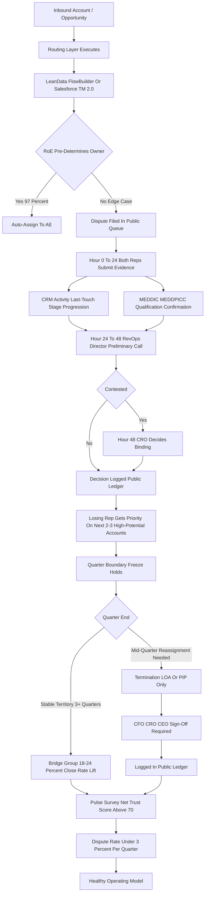
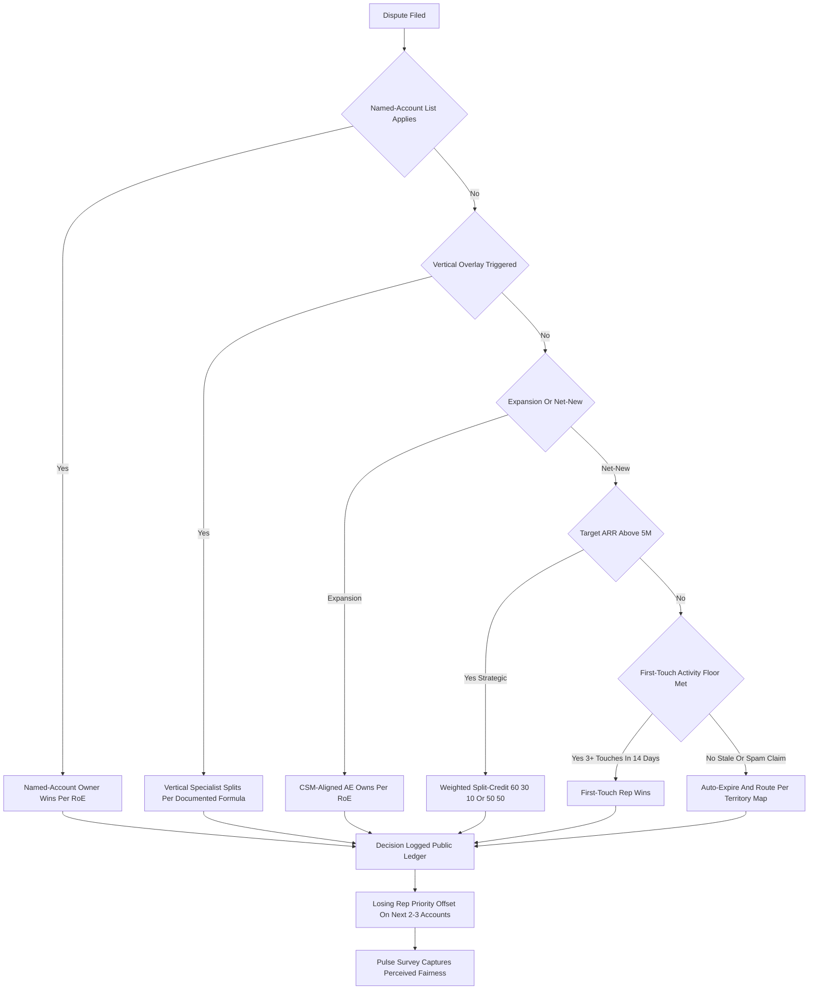

### Direct Answer

**The right way to [handle territory disputes between AEs](https://www.gartner.com/en/sales) without killing morale is to treat the problem as **system design, not interpersonal mediation** — replace politics with a deterministic, transparent, software-encoded operating model built on six pillars: (1) a published **5-7 variable account scoring formula** (ARR potential, ICP fit, growth signal, geography, rep relationship) encoded in [Salesforce (NYSE:CRM) Territory Management 2.0](https://www.salesforce.com/products/sales-cloud/features/territory-management/) or [LeanData](https://www.leandata.com) (founded by Evan Liang, the dominant routing layer for [Salesforce (NYSE:CRM)](https://www.salesforce.com) accounts) with capacity ceilings around **$8M-$10M** current-state ARR per AE; (2) a written, signed **Rules of Engagement (RoE)** that defines named-account vs geographic vs vertical assignment, deal-registration windows (typically **30-90 days**), expansion vs net-new ownership, and split-credit policies per [SaaStr (Jason Lemkin)](https://www.saastr.com) — single-touch 100%, multi-touch 60/30/10, strategic carve-out 50/50; (3) a **CRO-owned 48-hour resolution SLA** with a public ledger (a back-channel decision is the morale killer, not the dispute itself); (4) **quarter-boundary territory freezes** — no mid-quarter reassignments except for termination, LOA, or PIP completion — because [Bridge Group's 2024 SaaS AE Metrics Report](https://www.bridgegroupinc.com) shows median quota attainment drops from **62% to 47%** when territories shift mid-quarter; (5) **comp-plan alignment** so reps have no economic incentive to fight edge cases — accelerators above 100% attainment, SPIFs for under-penetrated segments, **12-month clawback** on accounts that churn, flattened payouts on cross-boundary deals — designed in [Xactly Connect](https://www.xactlycorp.com), [Varicent ICM](https://www.varicent.com) (formerly IBM ICM, now Vista-backed), [Performio](https://www.performio.co), [Spiff (Salesforce-acquired 2023, ~$50M ARR)](https://www.spiff.com), [CaptivateIQ](https://www.captivateiq.com) (Sequoia/ICONIQ-backed), or [QuotaPath](https://www.quotapath.com); and (6) **transparent planning math** built in [Anaplan (NYSE:PLAN, acquired by Thoma Bravo 2022 at ~$10.7B)](https://www.anaplan.com) Connected Planning for territory or [Optymyze](https://www.optymyze.com). The model lives or dies on auditability — per [Pavilion (Sam Jacobs)](https://www.joinpavilion.com) guidance, **every AE should be able to recalculate their own territory score in under 5 minutes**; if they cannot, the model is broken regardless of how mathematically sound it is. Citing real-world precedent: [Snowflake (NYSE:SNOW)](https://www.snowflake.com) post-IPO territory restructure (2020-2021) is the canonical case of running this playbook at scale — a documented named-account + vertical overlay model, public RoE, and CRO-owned dispute SLA enabled segmentation from a single AE pool into Enterprise/Commercial/Mid-Market/SMB without the usual 18-month productivity collapse; [Datadog (NASDAQ:DDOG)](https://www.datadoghq.com) and [ServiceNow (NYSE:NOW)](https://www.servicenow.com) ran similar deterministic-model playbooks during their post-IPO segmentation cycles. The benchmarks are unambiguous: [Forrester Sales Operations](https://www.forrester.com) puts the cost of a regretted AE departure at **6-9 months of fully-loaded comp** plus a **30-40% productivity gap** on orphaned accounts during ramp; [Gartner Sales Force Effectiveness](https://www.gartner.com/en/sales) attributes **~23% of unwanted AE attrition** to perceived territory unfairness; [Xactly](https://www.xactlycorp.com)'s sales performance index shows reps with stable territories hit quota at **~1.4x** the rate of those reassigned within the year; [Anaplan](https://www.anaplan.com) data shows organizations with formal territory governance see **~31% higher** sales productivity year-over-year; [OpenView SaaS Benchmarks](https://openviewpartners.com) flag saturation **above ~150 active accounts** as a churn predictor for both reps and customers; [Bessemer State of the Cloud](https://www.bvp.com/atlas/state-of-the-cloud-2024) and [Tomasz Tunguz](https://tomtunguz.com) data point at **<3% dispute rate** as the healthy ceiling; [David Skok](https://www.forentrepreneurs.com) and [Christoph Janz (Point Nine)](https://christophjanz.com) frame the territory math as a sub-problem of CAC payback discipline. The tooling stack: routing logic in [LeanData (Evan Liang)](https://www.leandata.com) or [Salesforce (NYSE:CRM) Territory Management 2.0](https://www.salesforce.com/products/sales-cloud/features/territory-management/); planning in [Anaplan (NYSE:PLAN)](https://www.anaplan.com) Connected Planning for Sales or [Optymyze](https://www.optymyze.com); commissions in [Xactly Connect](https://www.xactlycorp.com), [Varicent ICM](https://www.varicent.com), [Performio](https://www.performio.co), [Spiff (CRM)](https://www.spiff.com), [CaptivateIQ](https://www.captivateiq.com), [QuotaPath](https://www.quotapath.com); qualification discipline via [MEDDIC / MEDDPICC (Dick Dunkel, ex-PTC)](https://www.meddic.academy); operational benchmarks from [Alexander Group](https://www.alexandergroup.com), [ZS Associates](https://www.zsassociates.com), [Bridge Group](https://www.bridgegroupinc.com), and [Pavilion](https://www.joinpavilion.com). Net verdict: **territory disputes are a system failure, not a personality failure** — they signal that the operating model is opaque, the SLA is missing, the comp plan is misaligned, or the freeze rule is being broken. Build the six pillars in 30-60 days, publish the math, enforce the SLA, freeze the map at quarter boundaries, align the comp, and dispute frequency drops to **<3% of opportunities per quarter** without killing morale — because morale dies from **arbitrariness, not from losing a dispute**.**

## Why Territory Disputes Spike Attrition — And Why The Problem Is Mechanical, Not Interpersonal

### 1. The Real Cost Of A Mishandled Dispute

A single botched territory dispute is one of the most expensive avoidable events in a SaaS sales organization. [Forrester Sales Operations](https://www.forrester.com) benchmarks the cost of a **regretted AE departure** at **6-9 months of fully-loaded comp** ($180K-$420K all-in for a typical $130K-$170K base + commission Enterprise AE), plus a **30-40% productivity gap** on the orphaned book during a 6-9 month replacement ramp. [Bridge Group's 2024 SaaS AE Metrics Report](https://www.bridgegroupinc.com) finds median quota attainment collapses from **62% to 47%** when territories shift mid-quarter, and the new owner of an orphaned book typically takes **two to three quarters** to recover the historical run-rate even with full handoff documentation. [Gartner Sales Force Effectiveness](https://www.gartner.com/en/sales) research attributes **~23% of unwanted AE attrition** to **perceived territory unfairness** — not the dispute outcome itself, but the **perceived legitimacy of the process** that produced it. The compounding effect: every regretted exit triggers **at least one** follow-on departure within 90 days as adjacent reps interpret the exit as a signal about the system. **Reps rarely quit because they lose disputes — they quit because the process feels rigged**, and the cost of that perception is denominated in seven-figure annual recruiting, ramp, and orphaned-pipeline numbers. The problem is not the dispute. The problem is the **opacity of the system that adjudicates it**.

### 2. Why The Problem Is System Design, Not Interpersonal

The instinctive response from a sales leader watching two AEs fight over an account is to **mediate** — to get them in a room, hear both sides, broker a split, restore the relationship. This is exactly wrong. It treats a **system failure** (the operating model did not pre-determine the answer) as an **interpersonal failure** (the two reps cannot get along). Every time a leader mediates a dispute that the system should have answered automatically, the leader is **teaching the entire sales floor that the system does not work** and that adjudication is a function of who has the CRO's ear. The correct mental model: a healthy territory operating system **answers >97% of potential disputes automatically** because the rules are encoded, the data is in the CRM, and the routing logic in [LeanData (Evan Liang)](https://www.leandata.com) or [Salesforce (NYSE:CRM) Territory Management 2.0](https://www.salesforce.com/products/sales-cloud/features/territory-management/) executes deterministically; the remaining **<3%** are genuine edge cases that escalate to a CRO-owned 48-hour SLA with a public ledger. [Pavilion (Sam Jacobs)](https://www.joinpavilion.com) RevOps community guidance is explicit on this: the moment dispute volume exceeds **5% of opportunities per quarter**, the RoE itself is broken and must be rebuilt — patching individual cases will not save the system. The first 30 days of fixing a broken territory program is **almost entirely RevOps + CRO work**, not coaching, not 1:1s, not skip-levels. Build the model, publish the math, enforce the SLA, freeze the map, align the comp. Morale recovers as a **second-order effect** of mechanical fairness — not the other way around.

### 3. The Six-Pillar Operating Model

The six pillars work as an integrated system; gaps in any one pillar produce predictable failure modes (see Counter-Case below). **Pillar 1 — Account scoring model**: a published 5-7 variable formula scoring every account on ARR potential, ICP fit, growth signal, geography, and rep relationship, encoded in [Salesforce (NYSE:CRM) Territory Management 2.0](https://www.salesforce.com/products/sales-cloud/features/territory-management/) or [LeanData](https://www.leandata.com), with **capacity ceilings ~$8M-$10M current-state ARR per AE** and **~150 active account ceilings** per [OpenView SaaS Benchmarks](https://openviewpartners.com). **Pillar 2 — Written Rules of Engagement (RoE)**: signed by every AE on hire and re-acknowledged quarterly, covering named-account vs geographic vs vertical assignment, expansion vs net-new ownership, deal-registration windows (30-90 days), and split-credit policies. **Pillar 3 — CRO-owned 48-hour resolution SLA**: dispute filed → both reps submit evidence (Hour 0-24) → RevOps Director preliminary call from data (Hour 24-48) → if contested, **CRO decides** (Hour 48), binding, logged publicly with one-paragraph rationale. **Pillar 4 — Quarter-boundary freeze**: no mid-quarter territory changes except termination, LOA, or PIP completion. **Pillar 5 — Comp-plan alignment**: accelerators above 100%, SPIFs for under-penetrated segments, **12-month clawback**, flattened payouts on cross-boundary deals — designed in [Xactly Connect](https://www.xactlycorp.com), [Varicent ICM](https://www.varicent.com), [Performio](https://www.performio.co), [Spiff (Salesforce-acquired)](https://www.spiff.com), [CaptivateIQ](https://www.captivateiq.com), or [QuotaPath](https://www.quotapath.com). **Pillar 6 — Transparent planning math**: every input visible, every weighting documented, every score recomputable by the rep in under 5 minutes — built in [Anaplan (NYSE:PLAN)](https://www.anaplan.com) Connected Planning for Sales or [Optymyze](https://www.optymyze.com).

| Pillar | Tool Layer | What It Owns |
|---|---|---|
| 1. Scoring model | [Salesforce (NYSE:CRM) TM 2.0](https://www.salesforce.com), [LeanData](https://www.leandata.com) | Account assignment logic |
| 2. Rules of Engagement | RoE document + CRM enforcement | Pre-determined adjudication |
| 3. 48-hr Resolution SLA | Public ledger + CRO decision log | Edge-case resolution |
| 4. Quarter-boundary freeze | Calendar discipline + CEO commitment | Predictability |
| 5. Comp-plan alignment | [Xactly](https://www.xactlycorp.com), [Varicent](https://www.varicent.com), [CaptivateIQ](https://www.captivateiq.com), [Spiff](https://www.spiff.com) | Economic incentive design |
| 6. Transparent planning | [Anaplan (NYSE:PLAN)](https://www.anaplan.com), [Optymyze](https://www.optymyze.com) | Auditability + capacity math |

### 4. Pillar 1: The Account Scoring Formula

A published **5-7 variable account scoring formula** is the foundation. Keep it simple — anything more than seven inputs becomes opaque AND gameable, both of which destroy the model. A representative formula: `AccountScore = 0.35*ARRpotential + 0.25*ICPfit + 0.20*GrowthSignal + 0.10*Geography + 0.10*RepRelationship`. **ARR potential**: firmographic estimate pulled from [Crunchbase](https://www.crunchbase.com), [LinkedIn Sales Navigator](https://business.linkedin.com/sales-solutions/sales-navigator), [ZoomInfo (NASDAQ:ZI)](https://www.zoominfo.com) intent + employee-count proxies, optionally enriched with [Clearbit (HubSpot-acquired)](https://clearbit.com) and [Apollo.io](https://www.apollo.io). **ICP fit**: industry, size, tech-stack match — [BuiltWith](https://builtwith.com), [G2 (NASDAQ:G2)](https://www.g2.com), [HG Insights](https://hginsights.com) for technographic signals. **Growth signal**: hiring velocity ([LinkedIn](https://www.linkedin.com), [Revealera](https://www.revealera.com)), recent funding ([Crunchbase](https://www.crunchbase.com), [PitchBook](https://pitchbook.com)), tech adds. **Geography**: time-zone alignment, regional regulatory familiarity (relevant for healthcare, fintech, federal). **Rep relationship**: prior touches, alumni connections, prior personal account ownership — sourced from CRM activity history. **Capacity ceilings**: cap each rep at **$8M-$10M current-state ARR ownership** and **~150 active accounts** per [OpenView SaaS Benchmarks](https://openviewpartners.com) saturation research. **Encoding**: live in [Salesforce (NYSE:CRM) Territory Management 2.0](https://www.salesforce.com/products/sales-cloud/features/territory-management/), [LeanData](https://www.leandata.com), or [HubSpot (NYSE:HUBS) territory management](https://www.hubspot.com/products/sales) — never in a RevOps-only spreadsheet, which will always be questioned. **Auditability** per [Pavilion](https://www.joinpavilion.com): every rep should be able to recalculate their own territory score in under 5 minutes. If they cannot, fix the model — do not lecture the reps.

### 5. Pillar 2: Written Rules Of Engagement (RoE)

The RoE document is the **constitution** of the sales organization — every AE signs it on hire, every AE re-acknowledges it quarterly, and every territory decision references it. Core clauses: **Net-new vs expansion**: expansion belongs to the **CSM-aligned AE** (typically the original closer or the named-account owner); net-new follows the territory map. **First-touch-wins** works under ~$5M ARR target accounts; above that, the rule is **weighted split-credit** per [SaaStr (Jason Lemkin)](https://www.saastr.com) and [Tomasz Tunguz](https://tomtunguz.com) compensation guidance — single-touch 100% to closer; multi-touch **60% closer / 30% prospector / 10% AE-of-record**; strategic carve-out **50% named-account owner / 50% closer**. **Deal-registration windows**: a typical SaaS org runs **30-90 day** windows on prospect accounts — once a rep registers a deal with meaningful activity (3+ documented touches), the account is locked for that period. **Documented carve-outs**: named-account lists override geographic territory; the list is **published and version-controlled** — no back-channel exceptions, ever. **Vertical overlays**: if the org runs a vertical overlay (healthcare, financial services, federal), the overlay rules are explicit — which deals trigger the overlay, who closes, how credit splits. **Dispute frequency benchmark**: healthy orgs see **<3% of opportunities disputed per quarter** per [Bessemer State of the Cloud](https://www.bvp.com/atlas/state-of-the-cloud-2024) and [Tomasz Tunguz](https://tomtunguz.com); above **5%** the RoE is broken — rebuild before patching cases. The RoE lives in a shared doc (Notion, Confluence, Google Doc) with a public version history; every change goes through CRO + VP Sales + RevOps + 1 rep representative; no silent edits.

### 6. Pillar 3: The 48-Hour Resolution SLA + Escalation Path

When the rules cannot pre-determine an answer (and a small fraction always will not), the **CRO-owned 48-hour resolution SLA** takes over. The mechanics: **Hour 0-24** — dispute filed in a shared queue (Slack channel, ticketing system, or dedicated RevOps inbox); both reps submit objective evidence (CRM activity, last-touch date, opp stage progression, [MEDDIC / MEDDPICC (Dick Dunkel, ex-PTC)](https://www.meddic.academy) qualification confirmation). **Hour 24-48** — RevOps Director makes a preliminary call **based on data**, not on tenure or personality. **Hour 48** — if contested, the **CRO decides**, binding, no committee, no consensus theater. **Hour 48+** — the decision is logged in a **public territory ledger** (visible to every AE) with a one-paragraph rationale citing the relevant RoE clause. The losing rep gets priority on the **next 2-3 high-potential accounts** that route through the queue, as a documented offset for the morale hit. **Repeated appeals** (>2 in 90 days from the same rep) trigger an HR check-in — not as punishment, but as a signal that something has broken trust between that rep and the system. The CRO **must own** the final call personally — delegating to VP Sales except in genuine recusal cases (CRO has a close personal or comp relationship with one of the reps) is the single most common way the SLA collapses, because the floor reads delegation as **avoidance**. Public ledger publishing is non-negotiable; a hidden decision is functionally a back-channel decision regardless of the rationale.

### 7. Pillar 4: The Quarter-Boundary Freeze

**No mid-quarter territory changes** — period — except for the three exception categories: **termination** (rep leaves, accounts must be reassigned), **LOA** (rep takes leave of absence, accounts assigned to coverage), and **PIP completion** (rep on a Performance Improvement Plan either passes and stays, or exits, triggering reassignment). Every other reassignment waits for the quarter boundary. The data is unambiguous: [Bridge Group's 2024 SaaS AE Metrics Report](https://www.bridgegroupinc.com) finds **stable territories for 3+ consecutive quarters correlate with 18-24% higher close rates**; [Anaplan (NYSE:PLAN)](https://www.anaplan.com) Connected Planning research shows **mid-quarter reassignments destroy attainment 1.5-2x faster than the productivity they intend to recover**. The mental model: **treat territory like the tax code — predictable wins**. Even "obviously fair" mid-quarter reassignments destroy trust faster than the dispute resolution rebuilds it, because every rep on the floor is now wondering whether **their** book is next. The most disciplined SaaS orgs go further and run **6-month freezes** with a CEO-signed commitment, where any exception requires CFO + CRO + CEO sign-off and is published in the ledger. The freeze is the cheapest, most operationally simple lever in the entire system and is almost never the lever that gets broken first — but when it does break (a star rep "just needs" a new account, a CRO "just wants" to test a vertical), it breaks the entire model with it, because reps then know the rules apply only when convenient.

## The Tooling Stack, Comp Design, And First-90-Day Implementation Playbook

### 1. The Routing Layer: LeanData vs Salesforce Territory Management 2.0

The single most important software decision is the **routing layer** — the system that takes an inbound lead, account, or opportunity and assigns it deterministically based on the encoded RoE. Two dominant options. **[LeanData (Evan Liang, founder/CEO)](https://www.leandata.com)** is the category leader for [Salesforce (NYSE:CRM)](https://www.salesforce.com)-native orgs — a visual flowbuilder ("FlowBuilder") that lets RevOps encode arbitrary routing logic (territory + account hierarchy + ICP + capacity + round-robin + bring-your-own-rules) without code, with native dedup, matching, and routing to the right AE, SDR, or pod. Pricing typically **$45-$70/user/month** for Standard and **$80-$150/user/month** for Advanced/BookBuilder tiers, depending on volume and modules. Used by [Snowflake (NYSE:SNOW)](https://www.snowflake.com), [Datadog (NASDAQ:DDOG)](https://www.datadoghq.com), [HubSpot (NYSE:HUBS)](https://www.hubspot.com), [Okta (NASDAQ:OKTA)](https://www.okta.com), and most of the post-IPO SaaS cohort. **[Salesforce (NYSE:CRM) Territory Management 2.0](https://www.salesforce.com/products/sales-cloud/features/territory-management/)** is the native option, included with Enterprise/Unlimited Sales Cloud editions; supports territory hierarchy, multi-criteria assignment rules, manual + automated assignment, and forecasting integration. Strong for orgs with deep Salesforce admin teams and complex territory hierarchies; weaker UI and slower iteration than [LeanData](https://www.leandata.com). **Decision rule**: if RevOps iterates routing logic more than once a quarter, [LeanData](https://www.leandata.com); if the territory map is stable and Salesforce admin headcount is deep, native Territory Management 2.0. Alternatives: [Distribution Engine](https://distributionengine.com), [Chili Piper](https://www.chilipiper.com) (more SDR-routing-focused), [RingLead](https://www.ringlead.com), [Openprise](https://www.openprise.com), and [Traction Complete](https://www.tractioncomplete.com). The routing layer is where the RoE **becomes code** — without it, the RoE is just a document the floor will ignore.

### 2. The Planning Layer: Anaplan, Xactly, And Optymyze

The **planning layer** is where territory design, capacity modeling, quota allocation, and what-if scenario planning live. **[Anaplan (NYSE:PLAN, acquired by Thoma Bravo June 2022 at $10.7B)](https://www.anaplan.com)** Connected Planning for Sales is the category leader for mid-market through Enterprise — multi-dimensional modeling that ties territory, quota, comp, and forecast together, supports geographic optimization, balanced-territory algorithms, and ICP-weighted account allocation. Used by [ServiceNow (NYSE:NOW)](https://www.servicenow.com), [Workday (NASDAQ:WDAY)](https://www.workday.com), [Adobe (NASDAQ:ADBE)](https://www.adobe.com), and most public-company Sales Ops teams. Implementation cost **$80K-$400K** depending on org complexity; annual license typically **$30K-$300K+**. **[Xactly](https://www.xactlycorp.com)** (Vista Equity Partners-acquired, 2017) offers [Xactly AlignStar](https://www.xactlycorp.com/products/alignstar) (territory design and optimization), [Xactly Insights](https://www.xactlycorp.com/products/insights) (benchmarking), and [Xactly Incent](https://www.xactlycorp.com/products/incent) (commission processing) — the most integrated stack for orgs that want planning + commissions from one vendor. **[Optymyze](https://www.optymyze.com)** is the Anaplan/Xactly alternative for orgs that want no-code planning with strong territory + quota + comp integration. Lighter-weight options: [QuotaPath](https://www.quotapath.com) and [Forma.ai](https://www.forma.ai) for early-stage and mid-market planning. The planning layer is where **capacity discipline is enforced** — a ~$8M-$10M per-AE ceiling and ~150 active account ceiling enforced in the model means the territory map will not silently drift into saturation, which [OpenView SaaS Benchmarks](https://openviewpartners.com) identifies as the leading indicator of both AE attrition and customer churn.

### 3. The Commissions Layer: Xactly, Varicent, Performio, Spiff, CaptivateIQ, QuotaPath

The **commissions layer** is where comp-plan logic — accelerators, SPIFs, clawbacks, split-credit, cross-boundary flattening — gets calculated and paid. Six dominant options. **[Xactly Connect / Xactly Incent](https://www.xactlycorp.com)** — the legacy leader, deep integration with Salesforce and Anaplan, strongest for Enterprise; typically **$30-$80/payee/month**. **[Varicent ICM](https://www.varicent.com)** — formerly IBM ICM, spun out 2019 and Vista Equity Partners-backed, used by large Enterprise sales orgs ([IBM (NYSE:IBM)](https://www.ibm.com), [Cisco (NASDAQ:CSCO)](https://www.cisco.com), [Microsoft (NASDAQ:MSFT)](https://www.microsoft.com) historically) for high-complexity comp plans with overlay, splits, and matrix structures. **[Performio](https://www.performio.co)** — mid-market focused, strong for sales orgs of 50-500 payees, fast implementation. **[Spiff (Salesforce-acquired February 2023 at ~$50M ARR)](https://www.spiff.com)** — modern no-code commissions designed for high transparency to reps, native Salesforce integration; popular with PLG and modern B2B SaaS. **[CaptivateIQ (Sequoia + ICONIQ-backed)](https://www.captivateiq.com)** — direct competitor to Spiff, spreadsheet-like authoring, fast iteration on plan changes, strong rep-visibility UI. **[QuotaPath](https://www.quotapath.com)** — the lightweight option for early-stage and growth-stage orgs (Series A through Series C), free tier through ~$25/payee/month. The choice is mostly a function of **org maturity and plan complexity** — Enterprise with overlay/matrix/split go [Xactly](https://www.xactlycorp.com) or [Varicent](https://www.varicent.com); mid-market modern SaaS go [Spiff](https://www.spiff.com) or [CaptivateIQ](https://www.captivateiq.com); early-stage go [QuotaPath](https://www.quotapath.com). All six handle the **comp-plan-as-anti-dispute-design** patterns: accelerators above 100% attainment, SPIFs for under-penetrated segments, **12-month clawbacks** on accounts that churn, and flattened payouts on cross-boundary deals so reps have no economic reason to fight edge cases.

### 4. Comp Design: The Anti-Dispute Compensation Architecture

A well-designed comp plan **prices fighting out of the rep's economic decision-making**. The four levers. **(1) Accelerators above 100% attainment** — payouts ramp from 1.5x to 3x for performance above quota, so the rep's marginal hour is far better spent closing existing pipeline than fighting over an edge-case account; designed per [Alexander Group](https://www.alexandergroup.com) and [ZS Associates](https://www.zsassociates.com) sales comp benchmarks. **(2) SPIFs for under-penetrated segments** — quarterly cash bonuses on segments or verticals the org wants attention shifted toward (e.g., **$2K-$10K per closed-won** on a healthcare vertical push); this **redirects rep focus** to greenfield rather than turf disputes. **(3) Clawback clauses on early churn** — if an account leaves within 12 months, the rep returns the commission; reduces the **grab-and-dump** incentive where a rep claims credit on a marginal-fit account and offloads the support burden. **(4) Flattened payouts on cross-boundary deals** — when a deal crosses territory lines, both reps get the **base commission rate**, no accelerator, on their share; removes the economic reason to fight at the boundary. Implementation lives in [Xactly](https://www.xactlycorp.com), [Varicent](https://www.varicent.com), [Spiff](https://www.spiff.com), [CaptivateIQ](https://www.captivateiq.com), or [QuotaPath](https://www.quotapath.com). The single highest-impact comp move during a dispute reset: **eliminate per-account or per-logo bonuses** if any exist — they are the most direct economic incentive to grab and hold contested accounts. The [Bridge Group Inside Sales Metrics](https://www.bridgegroupinc.com) and [SaaStr (Jason Lemkin)](https://www.saastr.com) consensus: a well-designed comp plan should result in **<2% of comp variance** attributable to disputed accounts; above that, comp design is causing the disputes the territory model is trying to prevent.

### 5. The First-90-Day Implementation Playbook

A founder, CRO, or RevOps leader inheriting a broken territory program runs a structured 90-day reset. **Days 1-14 — Baseline**: audit the current territory map; count active disputes by rep, by quarter, by account size; baseline attainment by rep against benchmarks ([Bridge Group](https://www.bridgegroupinc.com), [OpenView](https://openviewpartners.com)); pulse-survey every AE anonymously on perceived fairness; map current routing logic ([LeanData](https://www.leandata.com) / [Salesforce TM 2.0](https://www.salesforce.com)); audit current comp plans for dispute-amplifying structures. **Days 15-30 — Draft**: design the 5-7 variable account scoring formula with one rep advisor + RevOps; draft the RoE document covering all six core clauses; design the 48-hour resolution SLA with CRO sign-off; publish the freeze rule; design comp adjustments (accelerators, SPIFs, clawbacks, cross-boundary flattening). **Days 31-45 — Build**: encode the scoring formula in [Salesforce TM 2.0](https://www.salesforce.com) or [LeanData](https://www.leandata.com); migrate the planning math into [Anaplan (NYSE:PLAN)](https://www.anaplan.com) or [Optymyze](https://www.optymyze.com); rewrite comp plans in [Xactly](https://www.xactlycorp.com), [Varicent](https://www.varicent.com), [Spiff](https://www.spiff.com), or [CaptivateIQ](https://www.captivateiq.com); stand up the public ledger (Notion, Confluence, or dedicated dashboard). **Days 46-60 — Socialize**: open RoE comment period (every AE reviews, comments, signs); CRO + VP Sales + RevOps roadshow the model in 1:1s, team meetings, and all-hands; explicit Q&A on the freeze rule and SLA. **Days 61-75 — Launch**: publish the model, the RoE, the freeze, the SLA, and the comp adjustments simultaneously at a quarter boundary; first dispute under the new model is resolved publicly within 48 hours as a **proof point**. **Days 76-90 — Reinforce**: weekly compliance check on SLA; monthly RoE audit; quarterly anonymous pulse survey; first quarter-end retrospective with the rep cohort on what worked and what did not.

### 6. Snowflake, Datadog, ServiceNow: Real-World Operating Cases

**[Snowflake (NYSE:SNOW)](https://www.snowflake.com)** post-IPO territory restructure (2020-2022) is the canonical case of running this playbook at scale. Pre-IPO, Snowflake operated with a single AE pool covering an enormous range of account sizes; post-IPO, the company executed a **documented segmentation** into Enterprise, Commercial, Mid-Market, and SMB pods with a **named-account + vertical overlay** model, **public RoE**, and a **CRO-owned dispute SLA** — and reached **~$2.8B revenue by FY2024** with the segmentation intact. The discipline: published rules, quarter-boundary freezes, and CRO ownership of edge cases kept the segmentation from triggering the typical 18-month productivity collapse that mid-flight segmentations produce. **[Datadog (NASDAQ:DDOG)](https://www.datadoghq.com)** ran a similar playbook during its 2019-2022 segmentation, layering vertical overlays (financial services, federal) onto a named-account + size-band model with [LeanData](https://www.leandata.com)-encoded routing and [Anaplan (NYSE:PLAN)](https://www.anaplan.com) territory planning. **[ServiceNow (NYSE:NOW)](https://www.servicenow.com)** scaled from $1B to $10B+ revenue running a multi-vertical, multi-product, multi-segment model with [Varicent ICM](https://www.varicent.com)-managed comp and explicit named-account assignment — territory disputes are public, adjudicated against documented rules, and decided by the CRO with the public ledger discipline. The common thread across all three: the segmentation only worked because the **operating system was built first** — the routing layer, the planning math, the RoE, the SLA, and the comp alignment all in place before the segmentation went live. Companies that segment first and build the operating system later typically lose **two to four quarters of productivity** before recovery, and the regretted-attrition cost compounds throughout.

### 7. Signals Of A Healthy Model — And Of A Failing One

A territory program in good operating health produces a tight set of measurable signals. **Healthy**: **dispute rate <3% of opps per quarter** ([Bessemer State of the Cloud](https://www.bvp.com/atlas/state-of-the-cloud-2024), [Tomasz Tunguz](https://tomtunguz.com) benchmark); **100% of CRO decisions logged within 48 hours**; **zero hidden carve-outs** (verified by quarterly third-party or RevOps audit); **top reps and bottom reps both rate the model as fair** in anonymous pulse surveys (Net Trust Score >70); **AE attrition <15% annualized** with **<5% citing territory** as a top-3 reason; **stable territories for 3+ consecutive quarters** correlate with the [Bridge Group](https://www.bridgegroupinc.com) **18-24% higher close rate** finding; **comp-plan dispute share <2%** of total variable comp variance. **Failing**: dispute rate **>5%** of opps per quarter ([Pavilion](https://www.joinpavilion.com) threshold for "RoE is broken — rebuild"); CRO decisions delayed past 48 hours or delegated without recusal; carve-outs discovered by the floor before they are published; bottom-quartile reps believe the model is rigged toward top reps; AE attrition **>20% annualized** with territory cited by a meaningful share of exits; mid-quarter reassignments occurring; reps spending measurable time on dispute filings rather than pipeline work. The pulse survey is the single most useful instrument — quarterly, anonymous, and run by RevOps (not the CRO's office), with one question framing the entire program: **"Do you believe the territory model is mechanically fair?"** A score below 70 on a 100-point scale is a signal that something is broken regardless of what the dispute-rate number says, because **perceived fairness is what drives morale, not adjudicated outcomes**.

## Failure Modes, Benchmarks, And Operating Discipline

### 1. The Six Common Failure Modes — And How To Recover From Each

**Failure 1 — CRO override theater**: the CRO publicly favors a star rep in a dispute, the RoE becomes performative, trust collapses within one quarter, and tenured reps begin interviewing externally. **Recovery**: the CRO **publicly recuses** from disputes involving the top 3 reps for two quarters, delegating to VP Sales with the recusal log published; rebuilds floor trust by demonstrating the rules apply regardless of producer status. **Failure 2 — First-touch gaming**: reps spam every account with a single LinkedIn touch to claim ownership; the dispute queue floods with bad-faith claims. **Recovery**: add a **minimum-activity floor** to first-touch claims (3+ meaningful touches over 14 days, all logged in CRM with content; [MEDDIC / MEDDPICC (Dick Dunkel)](https://www.meddic.academy)-style qualification minimums), and **auto-expire stale claims at 30 days**. **Failure 3 — Mid-quarter shake-ups**: even "fair" mid-quarter reassignments destroy trust faster than dispute resolution rebuilds it. **Recovery**: a **public 6-month freeze** with a CEO-signed commitment; any exception requires CFO + CRO + CEO sign-off and goes in the public ledger. **Failure 4 — Hidden carve-outs**: strategic accounts assigned via back-channel; once discovered, RoE loses credibility for 2+ quarters. **Recovery**: publish the **full carve-out list** with a one-paragraph rationale per account; written commitment to no future undocumented carve-outs; **quarterly third-party audit**. **Failure 5 — Over-engineered scoring**: a 47-variable model nobody understands is functionally identical to no model. **Recovery**: cut to **5-7 weighted inputs**, re-publish with worked examples, and require any future variable add to **remove an existing one**. **Failure 6 — Comp plan misalignment**: the territory model is fair but comp pays disproportionately for disputed accounts so reps still fight. **Recovery**: audit comp by territory tier, flatten payouts on cross-boundary deals, and **eliminate per-account or per-logo bonuses** if any exist.

### 2. The Benchmark Pack: Forrester, Gartner, Bridge Group, OpenView, Bessemer

The benchmarks behind the operating model. **[Forrester Sales Operations](https://www.forrester.com)** — regretted AE departure cost **6-9 months of fully-loaded comp** + **30-40% productivity gap** on orphaned book during replacement ramp. **[Gartner Sales Force Effectiveness](https://www.gartner.com/en/sales)** — **~23% of unwanted AE attrition** attributed to perceived territory unfairness. **[Bridge Group Inside Sales Metrics / SaaS AE Metrics Report](https://www.bridgegroupinc.com)** — median quota attainment drops from **62% to 47%** with mid-quarter territory shifts; **stable territories 3+ quarters correlate with 18-24% higher close rates**. **[OpenView SaaS Benchmarks](https://openviewpartners.com)** — **saturation above ~150 active accounts** per AE is the leading indicator of both rep attrition and customer churn (under-attention drives logo loss); per-AE current-state ARR ceilings around **$8M-$10M** for healthy capacity. **[Bessemer State of the Cloud 2024](https://www.bvp.com/atlas/state-of-the-cloud-2024)** + **[Tomasz Tunguz (Theory Ventures)](https://tomtunguz.com)** — **<3% of opportunities disputed per quarter** is the healthy ceiling; above 5% the RoE is broken. **[Xactly](https://www.xactlycorp.com) Sales Performance Index** — reps with stable territories hit quota at **~1.4x** the rate of those reassigned within the year. **[Anaplan (NYSE:PLAN)](https://www.anaplan.com) Connected Planning research** — organizations with formal territory governance see **~31% higher** sales productivity year-over-year. **[Alexander Group](https://www.alexandergroup.com)** and **[ZS Associates](https://www.zsassociates.com)** — comp-plan benchmarks for accelerators (1.5x to 3x ramp above 100%), clawback windows (12 months standard), and split-credit norms (60/30/10 multi-touch). **[David Skok (Matrix Partners) — For Entrepreneurs](https://www.forentrepreneurs.com)** + **[Christoph Janz (Point Nine Capital)](https://christophjanz.com)** — territory math as a sub-problem of CAC payback and net-revenue-retention discipline.

### 3. The Operator Checklist

A working monthly checklist that any CRO, VP Sales, or RevOps leader can run.

- [ ] **Account scoring model** published in a shared doc with all weightings visible; refreshed quarterly with CRO + RevOps + 1 rep representative sign-off
- [ ] **RoE document** signed by every AE on hire; re-acknowledged quarterly; version history public
- [ ] **Named-account carve-out list** published and version-controlled with one-paragraph rationale per account
- [ ] **Territory ledger** visible to all sales (every dispute decision + rationale + RoE clause cited)
- [ ] **CRO 48-hour SLA** tracked publicly with monthly compliance percentage published
- [ ] **Quarter-boundary change freeze** enforced — no exceptions without CFO + CRO + CEO sign-off, all exceptions logged
- [ ] **Routing logic** encoded in [LeanData (Evan Liang)](https://www.leandata.com) or [Salesforce (NYSE:CRM) Territory Management 2.0](https://www.salesforce.com/products/sales-cloud/features/territory-management/); audit trail enabled
- [ ] **Planning math** in [Anaplan (NYSE:PLAN)](https://www.anaplan.com) or [Optymyze](https://www.optymyze.com); capacity ceilings ($8M-$10M ARR / 150 accounts per AE) enforced in the model
- [ ] **Comp-plan logic** in [Xactly](https://www.xactlycorp.com), [Varicent](https://www.varicent.com), [Performio](https://www.performio.co), [Spiff](https://www.spiff.com), [CaptivateIQ](https://www.captivateiq.com), or [QuotaPath](https://www.quotapath.com); accelerators + SPIFs + 12-month clawbacks + cross-boundary flattening live
- [ ] **Quarterly RoE audit** by RevOps + CRO + 1 rep representative
- [ ] **Dispute frequency** tracked monthly; alert if **>5% of opps**
- [ ] **Anonymous quarterly pulse survey** on territory fairness perception (one-question score >70 target)
- [ ] **Comp plan annual review** for cross-boundary distortion; **<2% comp variance** from disputed accounts target
- [ ] **AE attrition tracking** with territory-cited share **<5%** of all exits target

### 4. The 30-60-90 Day Quick-Reset For A Broken Program

For a leader who just inherited a broken territory program and needs measurable improvement in one quarter.

**Day 1-7 (diagnose, do not fix yet)**: count active disputes; pulse-survey every AE anonymously; map current routing in [LeanData (Evan Liang)](https://www.leandata.com) / [Salesforce (NYSE:CRM)](https://www.salesforce.com); identify the top 3 dispute-amplifying clauses in the current comp plan; identify the top 3 mid-quarter reassignments that destroyed trust in the last two quarters.

**Day 8-21 (build the framework)**: draft the 5-7 variable scoring formula; draft the new RoE with explicit clauses on named-account / first-touch / split-credit / deal-registration; design the 48-hour SLA with CRO commitment; design comp adjustments; identify the public ledger surface (Notion, Confluence, or dashboard).

**Day 22-45 (encode + socialize)**: build the model in [Salesforce TM 2.0](https://www.salesforce.com), [LeanData](https://www.leandata.com), and [Anaplan (NYSE:PLAN)](https://www.anaplan.com); rewrite comp in [Xactly](https://www.xactlycorp.com), [Varicent](https://www.varicent.com), or [CaptivateIQ](https://www.captivateiq.com); open RoE comment period with every AE; CRO + VP Sales + RevOps roadshow.

**Day 46-60 (launch at quarter boundary)**: publish the model + RoE + freeze + SLA + comp adjustments simultaneously; first dispute under the new model resolved publicly within 48 hours; pulse-survey the floor on the launch.

**Day 61-90 (reinforce + measure)**: weekly SLA compliance check; monthly RoE audit; track dispute rate (target **<3%**), pulse-survey score (target **>70**), and AE-attrition territory-cited share (target **<5%**); publish results to the floor.

### 5. The Vertical-Overlay And Named-Account Patterns

Most organizations above **$50M ARR** run some form of overlay model — vertical specialists (financial services, healthcare, federal, retail), named-account teams (the Fortune 100 or named strategic accounts), or product overlays for multi-product portfolios. Overlay models **multiply the dispute surface** because every account potentially has multiple legitimate claimants — the geographic AE, the vertical specialist, the named-account owner, the product specialist. The discipline: the RoE must be **completely explicit** about overlay precedence. Standard pattern: **named-account ownership trumps everything** (the named-account AE is the orchestrator); **vertical overlay enters when the deal triggers vertical-specific qualification** ([MEDDIC / MEDDPICC (Dick Dunkel)](https://www.meddic.academy) criteria + vertical-specific compliance, contracts, or product configuration); **product overlay enters when the deal includes a product the geographic AE cannot sell competently**; **split-credit follows a documented formula** (typically **40% named-account / 40% closer / 20% specialist** or similar). The overlay model only works if the **routing layer ([LeanData](https://www.leandata.com), [Salesforce TM 2.0](https://www.salesforce.com))** can encode the precedence rules and execute them automatically; manually-routed overlay models collapse into dispute-floods within one quarter. [Snowflake (NYSE:SNOW)](https://www.snowflake.com), [Datadog (NASDAQ:DDOG)](https://www.datadoghq.com), and [ServiceNow (NYSE:NOW)](https://www.servicenow.com) all run multi-vertical, multi-product overlay models with this discipline; the operating signal that the overlay is working is the **<3% dispute rate** even with the multiplied surface area.

### 6. The 12-Month Outlook And Cultural Throughline

The 12-month outlook for a SaaS organization that runs the full six-pillar model with discipline. **Quarter 1 (launch)**: dispute rate spikes briefly as edge cases surface against the new RoE; pulse survey shows mixed reaction; first CRO-decided dispute is the cultural proof point. **Quarter 2 (stabilization)**: dispute rate drops toward **5-7%** as the rules become known; pulse survey trends positive as reps see the SLA hold; first quarter-end retrospective surfaces 3-5 RoE refinements. **Quarter 3 (model maturity)**: dispute rate hits **<3% target**; pulse-survey score **>70**; AE attrition begins to drop measurably; comp variance from disputed accounts drops toward **<2%**. **Quarter 4 (compounding)**: stable territories for 3+ consecutive quarters trigger the [Bridge Group](https://www.bridgegroupinc.com) **18-24% close-rate lift**; capacity discipline begins to show in customer-retention numbers as accounts get appropriate AE attention; recruiting improves as the model becomes a known cultural differentiator. The **cultural throughline** is the most underrated benefit: a sales organization that runs a transparent, deterministic, mechanically-fair operating model **attracts better AEs** because experienced operators read the model as a signal of sales-leadership maturity, and the org compounds talent advantage on top of the productivity advantage. **Morale does not die from losing a dispute — it dies from arbitrariness.** Remove the arbitrariness and morale, productivity, retention, and customer outcomes all compound together as second-order effects of the operating discipline. The work is not glamorous; it is RevOps, CRO, and tooling; and it is the single highest-leverage system any sales org can build.

## The Operating Flow: From Inbound Account To Decided Dispute

## The Decision Matrix: Adjudicating A Live Dispute Under The RoE

## Sources

1. [**LeanData — Lead Routing And Territory Management Platform (Evan Liang, Founder/CEO)**](https://www.leandata.com) — Category-leading routing and territory orchestration layer for Salesforce-native sales orgs
2. [**Salesforce (NYSE:CRM) — Territory Management 2.0**](https://www.salesforce.com/products/sales-cloud/features/territory-management/) — Native territory hierarchy, multi-criteria assignment, and forecasting integration for Sales Cloud Enterprise/Unlimited
3. [**Salesforce (NYSE:CRM) — Sales Cloud**](https://www.salesforce.com) — Underlying CRM platform; Spiff acquisition (2023) closed comp-plan acquisition gap
4. [**Anaplan (NYSE:PLAN, Thoma Bravo-acquired 2022 at $10.7B) — Connected Planning For Sales**](https://www.anaplan.com) — Multi-dimensional territory, quota, comp, and forecast modeling
5. [**Xactly — Sales Performance Management**](https://www.xactlycorp.com) — Xactly AlignStar (territory design), Xactly Insights (benchmarking), Xactly Incent (commissions); Vista Equity Partners-acquired 2017
6. [**Xactly Connect**](https://www.xactlycorp.com) — Commission processing and routing integration for SPM stack
7. [**Varicent — ICM (Incentive Compensation Management)**](https://www.varicent.com) — Formerly IBM ICM; Vista Equity Partners-backed; Enterprise-grade overlay/matrix/split comp
8. [**Performio**](https://www.performio.co) — Mid-market commissions platform; 50-500 payee focus
9. [**Spiff (Salesforce-acquired February 2023 at ~$50M ARR)**](https://www.spiff.com) — Modern no-code commissions with rep-transparency UI; native Salesforce integration
10. [**CaptivateIQ (Sequoia + ICONIQ-backed)**](https://www.captivateiq.com) — Spreadsheet-like comp-plan authoring; fast iteration on plan changes
11. [**QuotaPath**](https://www.quotapath.com) — Lightweight commissions for early-stage and growth-stage sales orgs; free tier through ~$25/payee/month
12. [**Optymyze**](https://www.optymyze.com) — No-code planning + quota + comp integration; alternative to Anaplan/Xactly
13. [**Distribution Engine**](https://distributionengine.com) — Salesforce-native lead routing and territory assignment
14. [**Chili Piper**](https://www.chilipiper.com) — Inbound routing and meeting scheduler; SDR-routing focused
15. [**Forrester — B2B Sales Operations Benchmarks**](https://www.forrester.com) — Regretted-AE-departure cost (6-9 months fully-loaded comp + 30-40% productivity gap on orphaned book)
16. [**Gartner — Sales Force Effectiveness**](https://www.gartner.com/en/sales) — ~23% of unwanted AE attrition attributed to perceived territory unfairness
17. [**Bridge Group — Inside Sales Metrics / SaaS AE Metrics Report**](https://www.bridgegroupinc.com) — Mid-quarter shift attainment drop (62% → 47%); stable-territory 18-24% close-rate lift
18. [**OpenView Partners — SaaS Benchmarks**](https://openviewpartners.com) — Saturation above ~150 active accounts per AE as churn/attrition leading indicator; ~$8M-$10M ARR per-AE ceiling
19. [**Bessemer Venture Partners — State Of The Cloud 2024**](https://www.bvp.com/atlas/state-of-the-cloud-2024) — <3% opps disputed per quarter as healthy ceiling; comp-plan benchmarks
20. [**Pavilion (Sam Jacobs)**](https://www.joinpavilion.com) — RevOps community guidance on auditable territory math; "every rep recalculates score in 5 minutes" rule
21. [**SaaStr (Jason Lemkin)**](https://www.saastr.com) — Compensation guidance on weighted split-credit (60/30/10 multi-touch, 50/50 strategic carve-out)
22. [**Tomasz Tunguz (Theory Ventures)**](https://tomtunguz.com) — SaaS sales benchmarks including dispute-rate ceilings and territory-stability data
23. [**David Skok (Matrix Partners) — For Entrepreneurs**](https://www.forentrepreneurs.com) — Territory math framed as sub-problem of CAC payback and NRR discipline
24. [**Christoph Janz (Point Nine Capital)**](https://christophjanz.com) — SaaS go-to-market and territory-design economics
25. [**MEDDIC / MEDDPICC (Dick Dunkel, ex-PTC) — MEDDIC Academy**](https://www.meddic.academy) — Qualification discipline framework; activity-floor minimums for first-touch claims
26. [**Alexander Group**](https://www.alexandergroup.com) — Sales comp benchmarks: accelerators (1.5x-3x), clawback windows (12 months), split-credit norms
27. [**ZS Associates**](https://www.zsassociates.com) — Sales force effectiveness consulting; territory design and capacity modeling benchmarks
28. [**HubSpot (NYSE:HUBS) — Sales Hub Territory Management**](https://www.hubspot.com/products/sales) — Native territory management for HubSpot CRM customers
29. [**ZoomInfo (NASDAQ:ZI)**](https://www.zoominfo.com) — Firmographic + intent data for ARR-potential scoring inputs
30. [**Crunchbase**](https://www.crunchbase.com) — Funding, growth-signal, and firmographic data for account scoring
31. [**LinkedIn Sales Navigator**](https://business.linkedin.com/sales-solutions/sales-navigator) — Hiring velocity and account intelligence for growth-signal inputs
32. [**Clearbit (HubSpot-acquired)**](https://clearbit.com) — Account enrichment for scoring formula inputs
33. [**Apollo.io**](https://www.apollo.io) — Account intelligence + activity tracking for first-touch validation
34. [**BuiltWith**](https://builtwith.com) — Technographic data for ICP-fit scoring
35. [**G2 (NASDAQ:G2)**](https://www.g2.com) — Intent and technographic signal for account scoring
36. [**HG Insights**](https://hginsights.com) — Technographic and IT-spend data for ICP-fit modeling
37. [**PitchBook**](https://pitchbook.com) — Funding, valuation, and growth data for growth-signal scoring
38. [**Revealera**](https://www.revealera.com) — Hiring-velocity data for account growth-signal inputs
39. [**Snowflake (NYSE:SNOW)**](https://www.snowflake.com) — Post-IPO territory restructure case (2020-2022): documented named-account + vertical overlay model with public RoE and CRO-owned dispute SLA
40. [**Datadog (NASDAQ:DDOG)**](https://www.datadoghq.com) — Multi-vertical overlay model with LeanData-encoded routing and Anaplan planning
41. [**ServiceNow (NYSE:NOW)**](https://www.servicenow.com) — Multi-vertical, multi-product, multi-segment territory model with Varicent ICM-managed comp
42. [**Workday (NASDAQ:WDAY)**](https://www.workday.com) — Enterprise SaaS reference for Anaplan-built territory planning at scale
43. [**Adobe (NASDAQ:ADBE)**](https://www.adobe.com) — Public-company Sales Ops reference for territory + quota + comp integration
44. [**Microsoft (NASDAQ:MSFT)**](https://www.microsoft.com) — Historical reference for Varicent ICM (formerly IBM ICM) at Enterprise scale
45. [**Cisco (NASDAQ:CSCO)**](https://www.cisco.com) — Enterprise reference for matrix/overlay comp structure
46. [**Okta (NASDAQ:OKTA)**](https://www.okta.com) — LeanData routing reference for post-IPO SaaS cohort
47. [**RingLead**](https://www.ringlead.com) — Routing and dedup alternative for territory assignment
48. [**Openprise**](https://www.openprise.com) — Revenue operations and data orchestration platform
49. [**Traction Complete**](https://www.tractioncomplete.com) — Salesforce-native routing and account hierarchy management
50. [**Forma.ai**](https://www.forma.ai) — AI-driven sales comp design and territory planning
51. [**Bessemer Venture Partners — Atlas**](https://www.bvp.com/atlas) — SaaS benchmarks library underlying State of the Cloud research

## Numbers

**Dispute And Attrition Benchmarks**
- **Unwanted AE attrition share attributable to territory unfairness**: **~23%** ([Gartner Sales Force Effectiveness](https://www.gartner.com/en/sales))
- **Regretted AE departure cost**: **6-9 months of fully-loaded comp** ([Forrester](https://www.forrester.com))
- **Productivity gap on orphaned book during ramp**: **30-40%** ([Forrester](https://www.forrester.com))
- **Median quota attainment with mid-quarter shift**: drops from **62% → 47%** ([Bridge Group](https://www.bridgegroupinc.com))
- **Stable-territory close-rate lift (3+ consecutive quarters)**: **18-24% higher** ([Bridge Group](https://www.bridgegroupinc.com))
- **Quota-attainment rate, stable vs reassigned territories**: **~1.4x higher** ([Xactly Sales Performance Index](https://www.xactlycorp.com))
- **Sales productivity lift with formal territory governance**: **~31% higher YoY** ([Anaplan (NYSE:PLAN)](https://www.anaplan.com))
- **Healthy dispute rate**: **<3% of opportunities per quarter** ([Bessemer](https://www.bvp.com/atlas/state-of-the-cloud-2024), [Tomasz Tunguz](https://tomtunguz.com))
- **RoE-broken threshold**: **>5% of opps disputed per quarter** ([Pavilion](https://www.joinpavilion.com))

**Capacity And Saturation Ceilings**
- **Current-state ARR per AE ceiling**: **$8M-$10M** ([OpenView](https://openviewpartners.com))
- **Active-account ceiling per AE**: **~150** ([OpenView](https://openviewpartners.com))
- **AE attrition healthy target**: **<15% annualized**
- **Share of exits citing territory in top-3 reasons**: **<5% target**
- **Pulse-survey Net Trust Score target**: **>70 on 100-point scale**
- **Comp variance attributable to disputed accounts target**: **<2% of total variable comp**

**Tooling Cost Anchors (Approximate)**
- **[LeanData](https://www.leandata.com) routing**: **$45-$70/user/month** (Standard); **$80-$150/user/month** (Advanced/BookBuilder)
- **[Salesforce (NYSE:CRM) Territory Management 2.0](https://www.salesforce.com)**: included with Enterprise/Unlimited Sales Cloud
- **[Anaplan (NYSE:PLAN)](https://www.anaplan.com) implementation**: **$80K-$400K** + annual license **$30K-$300K+**
- **[Xactly](https://www.xactlycorp.com) / [Varicent](https://www.varicent.com) commissions**: **~$30-$80/payee/month**
- **[Spiff](https://www.spiff.com) / [CaptivateIQ](https://www.captivateiq.com)**: typically **$30-$70/payee/month**
- **[QuotaPath](https://www.quotapath.com)**: free tier through **~$25/payee/month**

**Comp Design Anchors**
- **Accelerator ramp above 100% attainment**: **1.5x to 3x** ([Alexander Group](https://www.alexandergroup.com), [ZS Associates](https://www.zsassociates.com))
- **SPIF range on under-penetrated segment push**: **$2K-$10K per closed-won**
- **Clawback window standard**: **12 months** ([Alexander Group](https://www.alexandergroup.com))
- **Multi-touch split-credit**: **60% closer / 30% prospector / 10% AE-of-record** ([SaaStr (Jason Lemkin)](https://www.saastr.com))
- **Strategic carve-out split**: **50% named-account owner / 50% closer**
- **Cross-boundary deal payout**: **base commission rate only** (no accelerator)

**SLA And Process Standards**
- **Dispute resolution SLA**: **48 hours** (CRO-owned)
- **Deal-registration window**: **30-90 days** typical
- **First-touch activity floor**: **3+ meaningful touches over 14 days** (CRM-documented)
- **Stale-claim auto-expiration**: **30 days**
- **Repeated-appeal HR check-in trigger**: **>2 appeals in 90 days from same rep**
- **Quarter-boundary freeze**: **mid-quarter changes only for termination, LOA, or PIP completion**
- **6-month freeze exception**: **CFO + CRO + CEO sign-off required**

**Real-World Operating Case Anchors**
- [**Snowflake (NYSE:SNOW)**](https://www.snowflake.com): post-IPO segmentation to Enterprise/Commercial/Mid-Market/SMB with named-account + vertical overlay; reached **~$2.8B revenue by FY2024** with model intact
- [**Datadog (NASDAQ:DDOG)**](https://www.datadoghq.com): 2019-2022 multi-vertical overlay with [LeanData](https://www.leandata.com) + [Anaplan (NYSE:PLAN)](https://www.anaplan.com)
- [**ServiceNow (NYSE:NOW)**](https://www.servicenow.com): scaled $1B → $10B+ revenue with multi-product, multi-segment, [Varicent ICM](https://www.varicent.com)-managed model

## Counter-Case: When The Six-Pillar Model Is The Wrong Answer

The case above describes the right operating system for most B2B SaaS sales orgs above ~$20M ARR. But a serious operator must consider where it fails.

**Counter 1 — Pre-product-market-fit org**. A 5-AE company still discovering its ICP does not need a 5-7 variable scoring formula, [Anaplan (NYSE:PLAN)](https://www.anaplan.com) Connected Planning, or [Varicent ICM](https://www.varicent.com). It needs a CRO or founder who routes by hand based on direct knowledge of every deal. Heavy operating discipline at this stage is **premature optimization** that slows learning. Build the system at the **first sign of routing breaking** — typically **15-25 AEs** or **$20M-$50M ARR** — not before.

**Counter 2 — Founder-led sales without a CRO**. The 48-hour SLA depends on a CRO who can credibly own binding decisions. A founder-CEO who is also de facto CRO can run a thinner version of the model — RoE + freeze + comp alignment — without the full SLA infrastructure, because everyone knows the founder decides. Pretending to have a CRO-owned SLA when the founder really decides creates worse trust collapse than no SLA at all.

**Counter 3 — Genuinely small TAM**. In a market with **<500 named target accounts** total, the entire model collapses into the named-account list — there is no geographic territory, no vertical overlay, no first-touch dynamic worth modeling. RoE becomes "here is the list of 500 accounts, here is who owns each, here is what happens when one moves" and the SLA is rarely invoked. Over-engineering this is a waste of org energy.

**Counter 4 — Single-rep or two-rep sales team**. Disputes by definition require at least two reps competing. A 1-2 rep team needs sales process discipline, not territory architecture. Wait until the third hire to even draft the RoE.

**Counter 5 — Channel-only or partner-only GTM**. A sales org that sells exclusively through channel partners ([AWS Marketplace](https://aws.amazon.com/marketplace), [Salesforce AppExchange](https://appexchange.salesforce.com), [SI partners](https://www.accenture.com)) has fundamentally different dispute dynamics — partner-vs-partner, partner-vs-direct, and deal-registration with the partner rather than with the AE. The six-pillar model applies in spirit, but the implementation runs through partner programs (PRM) rather than CRM territory management.

**Counter 6 — Strict commission caps regime**. In organizations that cap commissions per deal or per rep (regulated industries, public-sector contractors), the comp-design lever is partially neutralized — accelerators do not exist above the cap, and SPIFs may not be permitted. The model still works but loses the comp-alignment pillar's force; lean harder on freeze + SLA + transparency.

**Counter 7 — The model is being built as theater**. The single most common failure mode of any operating-system overhaul: it is built, published, and ignored. A CRO who continues to make verbal one-off decisions outside the SLA, hidden carve-outs that re-emerge under pressure, and a public ledger that nobody reads — all signal the model is theater rather than operating reality. **Better to keep the messy informal system than to install a fake formal one**, because the fake formal one destroys trust faster than the informal one.

**Counter 8 — Genuinely irreconcilable rep personalities**. The model assumes disputes are about accounts. Occasionally they are actually about two reps who fundamentally cannot work together. The system will not fix that; one of them needs to leave or be moved to a different team. Pretending the operating model can solve a personality problem is itself a morale-killer.

**Counter 9 — Hostile board or CFO that overrides the freeze**. The quarter-boundary freeze only holds if the CRO, CFO, and CEO defend it. A board or CFO who routinely demands mid-quarter reassignments to chase a specific deal will collapse the entire model in two quarters. Without executive air cover, do not promise the floor a freeze that will be broken.

**Honest verdict**. The six-pillar model is the right answer for **B2B SaaS sales orgs at $20M-$200M+ ARR with 15-200 AEs, a credible CRO, a non-cap comp regime, and direct (not channel-only) GTM**. Outside that envelope, run a thinner version, or use direct CRO/founder adjudication, or wait until scale forces the issue. The model is mechanical and powerful where it fits; it is overhead and theater where it does not.

## Related Pulse Library Entries

- **q07** — How long is a typical Enterprise AE ramp curve? (Capacity assumptions in the scoring formula depend on realistic ramp data.)
- **q09** — How should onboarding compensation work for new AEs? (Comp design parallel to territory comp alignment.)
- **q42** — What are the standard commission split mechanics? (60/30/10, 50/50, single-touch — the split logic referenced in the RoE.)
- **q56** — How do you design a healthy SaaS comp plan? (Compensation architecture that makes the territory model viable.)
- **q88** — How do you run an anonymous sales pulse survey? (The instrument used to measure perceived territory fairness.)
- **q133** — What is the right RevOps tooling stack for a $50M-$200M ARR org? (Where LeanData, Anaplan, Xactly, Spiff, CaptivateIQ fit together.)
- **q189** — What is a clean CRO decision framework? (The CRO-owned 48-hour SLA pattern in the broader decision context.)
- **q210** — How do you allocate quotas fairly across an AE pool? (Quota allocation as the planning-layer companion to territory assignment.)
- **q223** — How do you build a named-account list at scale? (Carve-out list mechanics referenced in the RoE.)
- **q225** — How do you run deal-registration in a partner-channel GTM? (Channel adjacency; deal-reg windows parallel territory ownership.)
- **q9501** — How do you start a bookkeeping business in 2027? (Reference for COGS tracking discipline transferable to commission accruals.)
- **q9601** — How do you start a fractional CFO business in 2027? (Financial discipline backing the freeze rule and 6-month commitments.)
- **q9701** — What is the best CRM and revenue stack in 2027? (Salesforce, HubSpot, LeanData, ServiceTitan — broader stack context.)
- **q9702** — How do you build SOPs for a small revenue team? (The RoE is a sales SOP; this entry covers SOP discipline broadly.)
- **q9801** — What is the future of SaaS sales in 2030? (Long-term context for territory, segmentation, and overlay-model evolution.)

