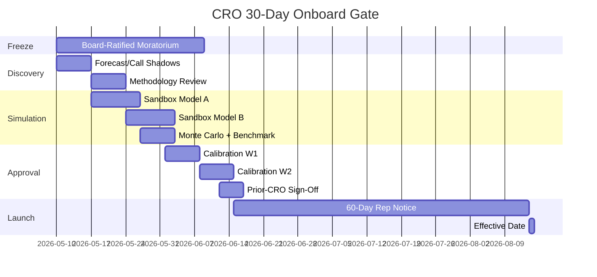

## Quick Answer

Freeze the comp plan for 30 days via a board-ratified moratorium. Give the new CRO a parallel sandbox in [Varicent](https://www.varicent.com) or [CaptivateIQ](https://www.captivateiq.com), weekly calibration with VP Sales and CFO, and a hard cap of three approved changes — each requiring a signed memo and 60-day rep notice. Related governance gates: [/knowledge/q05](https://pulserevops.com/knowledge/q05), [/knowledge/q12](https://pulserevops.com/knowledge/q12), [/knowledge/q1906](https://pulserevops.com/knowledge/q1906), [/knowledge/q1908](https://pulserevops.com/knowledge/q1908), [/knowledge/q1542](https://pulserevops.com/knowledge/q1542).

**For founders:** the question is not whether your new CRO will want to change comp — they will. The question is whether they change it *before* or *after* they've shadowed the system that produced the current plan. This 30-day gate is the difference.

---

## The Detail

New CROs are the single largest source of unplanned comp churn. Per the [Pavilion 2025 CRO Compensation & Tenure Report](https://www.joinpavilion.com/cro-report), **68%** of B2B SaaS CROs hired into companies between $20M–$100M ARR change at least one comp lever inside their first quarter, and **median CRO tenure has compressed to 19 months** (from 26 months in 2022). When that change lands inside the first 30 days — before the CRO has shadowed a single forecast call — reps lose between **$280K and $640K** in cumulative pipeline confidence over the next two quarters, according to [Bessemer's 2026 State of the Cloud](https://www.bvp.com/atlas/state-of-the-cloud-2026) cohort data on rep attrition following mid-year comp shifts. The [Gartner 2025 Chief Sales Officer Survey](https://www.gartner.com/en/sales/insights/chief-sales-officer-research) puts the same risk a different way: **41%** of CSO transitions trigger a quota or accelerator change inside 90 days, and those orgs miss the next quarter's number **2.3x more often** than orgs that ran a freeze-then-simulate cycle. The pattern is consistent with [Harvard Business Review on executive transitions](https://hbr.org/2017/01/the-executive-transition-handbook), which finds that **two-thirds of new executives who fail do so within the first 18 months**, and the proximate cause is almost always a major change made before the new leader has built a baseline.

**Cost of Disruption — what a panicked Day-7 comp rewrite actually costs:**

| Lever | Median impact (per rep, 2 quarters) | Source |
|---|---|---|
| Voluntary rep attrition lift | +18% | Bridge Group 2025 |
| Forecast accuracy slip | -11 pts | Bessemer 2026 |
| Ramp efficiency loss | -22% | OpenView 2025 |
| Pipeline confidence drag | $280K–$640K | Pavilion 2025 |

**Your 30-day CRO Onboard Roadmap:**

1. **Week 1 — Frozen Comp + Shadow Mode**
   - Board-ratified comp moratorium: a one-page resolution stating no changes to quota, accelerator, OTE mix, or SPIF for 30 calendar days. The prior CRO countersigns. **Verbatim resolution template:** *"The Board hereby ratifies a 30-day comp moratorium effective [DATE]. No changes to quota assignments, accelerator structures, OTE mix, SPIFs, or territory boundaries shall be implemented prior to [DATE+30] without unanimous written consent of the Compensation Committee. The new Chief Revenue Officer shall use this period exclusively for discovery and parallel-sandbox simulation."*
   - CRO shadows **5 forecast reviews, 3 customer calls, 2 deal-desk approvals, and 1 QBR rehearsal**.
   - CRO reads the live methodology stack (MEDDPICC, Challenger, Force Management) before proposing a single change. Cross-reference [/knowledge/q1924](https://pulserevops.com/knowledge/q1924) for the Outreach/Salesloft comp tooling ecosystem and [/knowledge/q1927](https://pulserevops.com/knowledge/q1927) for AI-era outbound comp tradeoffs.

2. **Week 2 — Comp Simulation Lab**
   - **Sandbox acceptance checklist (named owners):**
     - Read-only mirror of production comp tables — *RevOps lead*
     - Anonymized rep IDs (PII-stripped) — *Data engineering*
     - 8-quarter historical bookings replay — *FP&A*
     - CFO-signed success-metric memo before any model is built — *CFO*
     - Two distinct model branches (e.g., flatter accelerator vs. steeper accelerator) — *new CRO*
   - CRO builds the two alternative models in [Varicent](https://www.varicent.com) or [CaptivateIQ](https://www.captivateiq.com). No production data overwrites.
   - Run a **12-month Monte Carlo** against the prior 8 quarters. Surface tail risk, not just expected value.
   - Compare against [OpenView's 2025 SaaS Benchmarks](https://openviewpartners.com/expansion-saas-benchmarks/) (target: 4.5x–6.0x OTE-to-quota for AEs in the $20M–$100M ARR band) and [McKinsey's B2B Pulse 2025](https://www.mckinsey.com/capabilities/growth-marketing-and-sales/our-insights/the-multiplier-effect-how-b2b-winners-grow).

3. **Week 3–4 — Calibration Meetings**
   - **Weekly 90-minute sessions**: CRO + VP Sales + CFO + RevOps lead. Documented in writing. No verbal approvals.
   - Any proposal to kill a bonus tier or add an accelerator requires a **signed memo from the prior CRO** (if reachable) or a board sub-committee sign-off (if not).
   - **Three changes maximum** across tiers, quotas, accelerators, or SPIFs. The cap is the discipline.

4. **Month 2 — Rollout Phase**
   - Reps get **60 days advance notice** of any approved change — not 30. The [Bridge Group 2025 SDR Metrics & Compensation Report](https://www.bridgegroupinc.com/blog/sales-development-report) shows comp changes communicated under 45 days lift voluntary attrition by **18%** in the next two quarters.
   - Hold rep Q&A in **groups of 8 or fewer** — not all-hands. Use the [SaaStr commission framework](https://www.saastr.com/9-things-i-wish-someone-had-told-me-about-sales-compensation/) as the neutral reference document.
   - Publish the change in the same channel the original plan lives in (Comp Plan PDF, signed acknowledgment).

**Legal & Clawback Considerations**

Any accelerator change inside an active fiscal quarter intersects [ASC 606](https://www.fasb.org/page/PageContent?pageId=/standards/asc606.html) revenue-recognition rules where commission is treated as a contract-acquisition cost. Clawback language drafted by the prior CRO often does not bind under the new plan unless re-signed. Have outside counsel review any change that touches: (a) deals already booked but not yet collected, (b) deals in legal review at the moment of comp change, (c) reps inside a guarantee window from a prior CRO offer letter. Skipping this step is the most common cause of post-change litigation.

**Comp Stability Score — what the board should track post-rollout:**

| KPI | Target | Trigger to review |
|---|---|---|
| Voluntary AE attrition (trailing 90d) | < 12% | > 16% |
| Forecast accuracy (commit-to-actual) | ± 5% | ± >10% |
| Time-to-first-deal for new hires | < 95 days | > 120 days |
| Comp-related Slack/HR escalations | < 3 / quarter | > 6 / quarter |
| Rep NPS on comp clarity | > 40 | < 25 |

**Counter-Play — what to do if the new CRO refuses the freeze:**

If the incoming CRO insists on changing comp before week 2 is over, the founder/CEO has three options, in order of preference: (a) reinforce the moratorium with the comp committee chair on a same-week call, (b) shorten the freeze from 30 to 14 days but keep the sandbox-and-memo requirements intact, (c) treat the refusal as a hiring signal and re-open the search. Option (c) is unpalatable but cheaper than the comp blow-up.

**Common Traps:**
- New CRO inherits a plan they didn't design → panics and rewrites it inside week 1.
- Finance hasn't run the existing comp through a quota-coverage model — so nobody knows what "healthy" looks like.
- Reps discover changes via Slack instead of an official document with their name on it.

**Bear Case — when this still fails:**
1. The CRO is hired with an explicit board mandate to "fix comp." The moratorium gets vetoed in week 2 and the simulation lab becomes theater.
2. The prior CRO left on bad terms and refuses to countersign the resolution. Without that anchor, the moratorium collapses into negotiation.
3. The company is missing plan inside the first 14 days. The board overrides the freeze to chase a SPIF, and the new CRO inherits a plan they no longer trust.
4. Private-equity-owned companies inside year 4 of a 5-year hold are structurally biased to accept short-term comp changes that lift bookings velocity at the cost of rep retention. The 30-day gate gets compressed to 7 days, and the simulation step is skipped.
5. **Comp data debt:** the existing comp tables have no single owner — they live across spreadsheets, the CRM, and a legacy ICM tool. The sandbox can't be built because the source-of-truth is fragmented. The freeze becomes meaningless because nobody can describe the current plan precisely enough to *not* change it.

**When the gate works:** the new CRO arrives in Month 2 with a signed-off model, board buy-in, prior-CRO countersignature, 60-day rep notice in flight, and a documented rationale that survives the next QBR. Attrition stays under 12%, forecast accuracy holds inside ±5%, and the new CRO has built credibility *before* spending it. That is the entire point.

**Red Flags:**
- CRO is drafting comp changes before the shadow week is finished.
- Finance can't articulate why the current accelerator exists.
- Reps are discovering changes via Slack screenshots.

TAGS: cro-onboard, comp-plan-lock, sales-ops-governance, simulation-testing, calibration-meetings