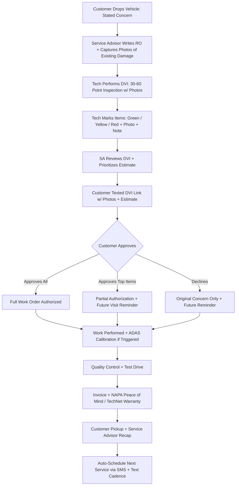
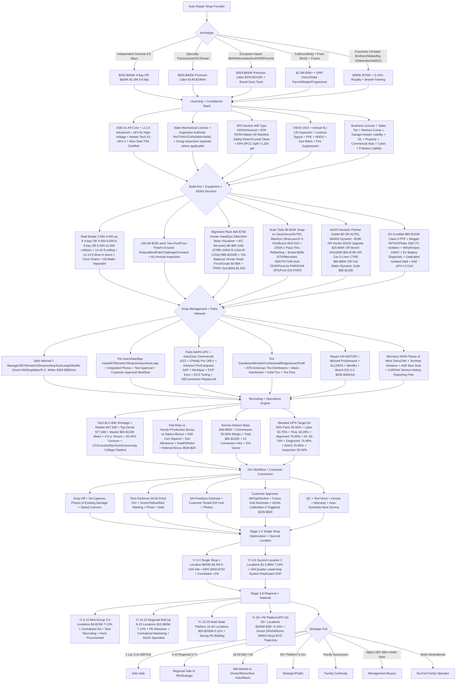

**TL;DR:** Starting an **auto repair shop in 2027** (a.k.a. **automotive service facility, mechanical repair shop, auto care center, body shop, collision center**) -- a **state-licensed mechanical repair facility that diagnoses, repairs, and maintains light-duty passenger vehicles (cars/SUVs/light trucks under 10,000 GVWR) and increasingly performs ADAS calibrations + selective EV service, structured as one of four archetypes: independent general repair (oil/brakes/tires/suspension/diagnostics) + specialty (transmission/AC/Euro-import/diesel/performance) + European-import specialist (BMW/Mercedes/Audi/VW/Porsche/Volvo at $155-$210/hr labor vs $110-$160 generalist) + collision/body shop (paint+frame+ADAS+DRP carrier work); requires owner or hired manager holding ASE A1-A9 mechanical core (engine/transmission/drivetrain/suspension/brakes/electrical/HVAC/engine-performance/light-duty-diesel) plus L-series advanced (L1 engine perf + L2 medium/heavy duty + L3 light-duty hybrid/electric + L4 ADAS) plus xEV cert for high-voltage EV; plus state mechanical-repair license + inspection-station authority (PA/TX/NY/CA/NJ/MA/VA/NC mandates); plus EPA Section 608 refrigerant cert for A/C; plus EPA RCRA waste-oil + filter + coolant manifest disposal (Safety-Kleen/Crystal Clean/Heritage-Crystal Clean); plus EPA SPCC spill prevention if >1,320 gal storage; plus OSHA 1910 + annual ALI lift inspection + lockout-tagout + PPE; plus NAPA AutoCare Peace of Mind 24mo/24K nationwide warranty or TechNet for warranty halo; distinct from dealership service (manufacturer-warranty + factory tools) + quick-lube (Valvoline/Jiffy Lube <$60 ticket avg) + tire-only stores (Discount Tire/America's Tire) + mobile mechanic + big-box (Walmart/Costco Tire)** -- means choosing among **five business models: independent general repair (4-8 bays $650K-$2.5M 8-18% net) + specialty/Euro import (premium labor $500K-$2M 10-22% net) + collision (DRP-driven Geico Auto Repair Xpress/State Farm Select Service/Allstate Good Hands/Progressive Service Center/Liberty Mutual/USAA STARS/Farmers Circle/Nationwide Blue Ribbon + I-CAR Gold Class + manufacturer aluminum+steel certs $1.5M-$8M 6-14%) + franchise (Christian Brothers ~$300K+ liquid + Midas ~$30K + 10% royalty + Big O Tires + Meineke + AAMCO + Take 5 + Maaco + Tuffy + Precision Tune + Honest-1, $300K-$750K launch + 5-10% royalty) + multi-location consolidator (5-50 stores PE-backed roll-up to Driven Brands NASDAQ DRVN/Monro Inc NASDAQ MNRO/Sun Auto Greenbriar/Mavis Tire BayPine+TSG/Caliber Collision Hellman & Friedman+OMERS/Gerber Collision Boyd TSX BYD); equipment Mitchell 1 ManagerSE + Tekmetric + Shopmonkey + AutoLeap + Identifix shop management $300-$900/mo + AutoVitals/Bay-masteR DVI + lifts $4-$15K (Rotary/BendPak/Challenger/Forward) + Hunter HawkEye Elite/John Bean alignment $40-$70K + SAE J2788/J2843 A/C recovery $5-$8K (R-134a + R-1234yf $80-$150/lb) + Hunter Road Force/Coats balancer $3-$6K + Snap-on Zeus/AUTEL MaxiSys Ultra/Launch X-431/Bosch ADS 625 scan $5-$15K + J2534-1 reflashing + brand-specific (BMW ISTA/Mercedes XENTRY/VW-Audi ODIS/Porsche PIWIS/GM SPS/Ford IDS-FDRS) + MOTOR/Mitchell ProDemand/ALLDATA $200-$450/mo + ADAS calibration AUTEL MA600/Hunter ADAS/Bosch DAS3000/Car-O-Liner CTR9/Snap-on ADAS XL $20-$120K static+dynamic; EV-credible upgrade Class 0 PPE + Megger MIT525/Fluke 1587 FC isolation + Wiha/Knipex 1000V + EV battery diagnostic + dedicated isolated stall + ASE xEV+L3 cert $80-$150K; parts NAPA GPC + AutoZone AZO + O'Reilly Pro ORLY + Advance/Carquest AAP + Worldpac + FCP Euro + ECS Tuning + OEConnection RepairLink; tire Goodyear + Michelin + Continental + Bridgestone + Pirelli + ATD + Mavis Distribution + K&M Tire + Tire Pros; capital $250K-$500K 4-bay independent + $500K-$1.5M 6-8 bay + $1.5M-$3M+ collision + $300K-$750K franchise + $1M-$10M+ acquisition 3-5x EBITDA SBA 7(a) Live Oak/Pinnacle/Pursuit/Newtek/Huntington/First Home/Byline + seller financing 10-20%** -- operating against **US auto repair market ~$120B (IBISWorld 2024) + ~280K facilities + ~600K techs (BLS 2024) + ~80K projected tech shortage 2024-2034 + ~290M registered light vehicles (NHTSA) + RECORD 12.6 yr avg US fleet age (S&P Global Mobility 2024 up from 11.4 in 2017) + avg new-car transaction $48K (Kelley Blue Book up from $36K 2019) + 8.4 yr new-car ownership + 7.1 yr used-car + independents capture ~70-75% out-of-warranty + EV ~3% repair revenue 2024 to ~10-15% by 2030 (Auto Care Association) + ADAS-equipped parc ~50% 2024 to ~70%+ 2027; INDUSTRY CONSOLIDATING FAST -- Driven Brands DRVN $2B+ ~5K locations Roark (Take 5/Meineke/Maaco/CARSTAR/ABRA/Auto Glass Now) + Monro MNRO ~1,300 (Monro/Mr Tire/Tire Choice/Car-X/Ken Towery) + Sun Auto Greenbriar ~450+ + Mavis BayPine+TSG ~2K after NTB + Les Schwab Meritage ~490 + Caliber Collision Hellman & Friedman+OMERS ~1,800 + Service King + Boyd/Gerber BYD ~600+ + multiples 1-loc 3-4x + 4-15 regional 5-7x + 50+ platform 9-12x bidding war + ADAS CALIBRATION REVOLUTION every windshield 2018+ = $200-$600 billable per OEM TI Bulletin + collision $4M shop adds $200-$500K ADAS revenue at 70-80% GP%; counter-pressures TECH SHORTAGE 80K BLS + median $47,930 + top decile $77,690 + 4-6 yr tenure + 20-35% turnover + DVI DISCIPLINE shops with DVI ARO $450-$750 vs without $250-$400 + ADAS CAPTURE shops not pricing leave $50-$200K/yr per bay + EV DECISION CLARITY half-measure = liability + insurance gap + OSHA/NFPA 70E violation if >60V DC contact**. The hardest part is **TECHNICIAN RECRUITING + DVI DISCIPLINE + ADAS CALIBRATION CAPTURE trifecta**, not capital or tooling.

> ### 🎯 Bottom Line
> - **[Capital]** **$250K-$500K 4-bay independent general repair** (2,500-4,000 sq ft + 4 in-ground or two-post lifts + alignment rack + A/C recovery + scan tools + tire balancer + shop management software + signage + 3-6 mo working capital). **$500K-$1.5M 6-8 bay full-service** (4,000-6,000 sq ft + 6-8 lifts + ADAS calibration bay + heavier diagnostics + 4-8 tech bays). **$1.5M-$3M+ collision shop** (paint booth + frame rack + Car-O-Liner / Chief / Celette + DRP relationships). **$300K-$750K franchise launch** (Christian Brothers Automotive ~$300K+ liquid + Midas ~$30K fee + 10% royalty + Big O Tires + Meineke + AAMCO). **$1M-$10M+ acquisition** at **3-5x EBITDA** via SBA 7(a) (Live Oak / Pinnacle / Newtek). EV-credible upgrade adds **$80K-$150K** (insulated PPE + isolation testers + EV-specific lifts + ASE xEV cert + isolated stall). State inspection licenses (PA / TX / NY / CA / NJ / MA / VA / NC mandates), EPA RCRA waste-oil + Section 608 refrigerant cert for HVAC, OSHA shop safety, EPA SPCC for spill control.
> - **[Margins]** Independent general repair: **$650K-$2.5M revenue + 8-18% net** at 4-8 bays. Specialty (transmission / AC / Euro import): **$500K-$2M + 10-22% net** premium because labor rate $145-$195/hr vs $110-$160 generalist. Collision: **$1.5M-$8M + 6-14% net** at 4-15 bays, DRP-driven. Franchise market unit: **$1M-$5M + 5-12% net after royalty**. **Industry blended GP% target 50-55%** (parts 35-50% + labor 60-75%). **Top-quartile shop ARO (average repair order) $450-$750**; without DVI (Digital Vehicle Inspection) typically $250-$400. **NAPA Peace of Mind + TechNet + ASE Blue Seal** warranty programs add 5-12% revenue lift. M&A: **3-5x EBITDA** independents, **5-7x** 4-15 location operators, **7-10x** regional groups; Driven Brands + Monro + Sun Auto active acquirers.
> - **[Hardest part]** **NOT capital. NOT tooling.** The trifecta: **(1) TECHNICIAN RECRUITING + RETENTION** -- BLS 2024 reports ~80K technician shortage nationally + average tech wage $48K-$72K + flat-rate vs hourly comp war + every shop in your zip code is hiring. Lose one A-tech and ARO collapses + comeback rate spikes. **(2) DVI DISCIPLINE + SERVICE ADVISOR CONVERSION** -- shops using AutoVitals / Bay-masteR / Tekmetric DVI workflow report **$80-$200 average-ticket lift** vs paper inspection; shops without it leave 25-40% of legitimate revenue on the floor every day. Service advisor is the conversion engine -- comp 35-60% commission + base, the hardest hire in the shop. **(3) ADAS CALIBRATION CAPTURE** -- every windshield replacement on 2018+ vehicle = **$200-$600 calibration billable**; collision shops not pricing it are leaving $50K-$200K/year per bay on the table. ADAS is the highest-margin growth line item in 2027 and most independents miss it.

An **auto repair shop** in 2027 is a **state-licensed mechanical repair facility that diagnoses, repairs, and maintains light-duty passenger vehicles (cars / SUVs / light trucks under 10,000 GVWR) — and increasingly performs ADAS calibrations + selective EV service** — typically structured as one of four archetypes: **(a) independent general repair** (oil / brakes / tires / suspension / diagnostics / batteries / belts / hoses / drivetrain), **(b) specialty shop** (transmission, A/C, Euro import, diesel, performance), **(c) European-import specialist** (BMW / Mercedes / Audi / VW / Porsche / Volvo — premium labor rate), or **(d) collision / body shop** (paint + frame + structural + DRP carrier work). Three regulated pillars: state mechanical-repair license + inspection-station authority (PA / TX / NY / CA / NJ / MA / VA / NC); federal environmental compliance (EPA RCRA waste-oil + Section 608 refrigerant + SPCC spill); OSHA shop safety + lift inspection.

**Distinct from** dealership service department (manufacturer-warranty work + factory tools + dealer-only software), quick-lube (Valvoline Instant Oil Change / Jiffy Lube — oil + filter + wipers, <$60 ticket avg), tire-only stores (Discount Tire / America's Tire — tire + alignment + TPMS), mobile mechanic (1099 / DIY / no facility), and big-box automotive (Walmart Auto Care / Costco Tire — limited scope). Auto repair **shop owners** must hold or hire someone holding **ASE A-series certifications** (A1-A9: engine / transmission / suspension / brakes / electrical / HVAC / engine performance / heating + air / light-truck-diesel) plus advanced **L-series** (L1 advanced engine perf, L2 medium/heavy duty, L3 light-duty hybrid/electric, L4 ADAS) plus **xEV cert** for high-voltage EV work.

The 2027 demand: **total US auto repair market ~$120B annually** (IBISWorld Auto Mechanics in the US 2024), **~280K total auto repair facilities** including independents + chains + dealer service (BLS + Auto Care Association), **~600K active automotive service technicians** (BLS Occupational Outlook 2024) with **~80K projected shortage 2024-2034**, average US light-vehicle fleet age **12.6 years** (S&P Global Mobility 2024 record-high — aging-fleet thesis driving aftermarket demand). NHTSA reports **~290M registered light vehicles** in the US. **Auto Care Association** projects aftermarket parts + service to grow **3-5% CAGR through 2030** despite EV transition.

Five business models: **independent general repair** (most common, 4-8 bays, $650K-$2.5M revenue, 8-18% net); **specialty / Euro import** (premium labor rate, $500K-$2M, 10-22% net); **collision shop** (DRP-driven, $1.5M-$8M, 6-14% net); **franchise** (Christian Brothers / Midas / Meineke / Big O / AAMCO — brand + training + financing, royalty drag); **multi-location consolidator** (5-50 stores, PE-backed roll-up exit path, sells at 5-10x EBITDA to Driven / Monro / Sun Auto).

Five 2027 survival drivers: **(1)** DVI discipline + service advisor conversion (the ARO engine); **(2)** technician recruiting + retention beating every competing shop in your zip code; **(3)** ADAS calibration capture on every collision + windshield + suspension job; **(4)** EV decision clarity (invest now for coastal/urban premium OR stay 100% ICE until 2030); **(5)** consolidator-exit awareness (Driven Brands / Monro / Sun Auto / Greenbriar Equity actively bidding 3-7x EBITDA).

## 🗺️ Table of Contents

**Part 1 -- Foundations**
- Market size, fleet age, demand thesis
- Four shop archetypes
- ASE certification path, state licensing, franchise vs independent
- M&A backdrop and ADAS calibration revolution

**Part 2 -- Build-Out & Capital**
- Real estate + bay configuration + lift selection
- Equipment fundamentals (alignment, A/C, scan tools)
- ADAS calibration tooling decision
- EV tooling threshold
- Shop management software + parts sourcing
- SBA financing

**Part 3 -- Operations**
- Technician recruiting + flat-rate vs hourly comp
- Service advisor role + comp + DVI workflow
- Gross profit model (parts + labor + blended)
- Warranty programs + recall / OEM work
- Compliance: OSHA + EPA + state inspection
- Customer retention + DVI lift mechanics

**Part 4 -- Growth & Exit**
- Marketing realities (Google + Local Pack + reviews)
- Fleet contracts + DOT inspection
- DRP collision insurance programs
- Multi-location expansion + franchise decision
- EBITDA multiples in M&A
- EV decision tree
- Exit options

---

## 📐 PART 1 -- FOUNDATIONS

### Market size, fleet age & demand thesis

US auto repair generates **~$120B annual revenue** (IBISWorld Auto Mechanics in the US 2024) across **~280K facilities** serving **~290M registered light vehicles** (NHTSA). The defining 2024-2027 macro: **average US light-vehicle age at record 12.6 years** (S&P Global Mobility 2024), up from 11.4 in 2017 and 9.6 in 2002. Older fleet means more out-of-warranty repair work flowing to independents rather than dealers.

> ### 📊 Quick Facts
> - **~$120B** US auto repair market (IBISWorld)
> - **~280K** facilities (independents + chains + dealer service)
> - **~600K** active automotive service technicians (BLS 2024)
> - **~80K** projected tech shortage 2024-2034 (BLS)
> - **~290M** registered light vehicles (NHTSA)
> - **12.6 years** average US light-vehicle age (S&P Global Mobility 2024)
> - **~3% of repair revenue** from EVs (rising, ~10-15% by 2030 per Auto Care Association)

**The aging-fleet thesis.** New-car affordability collapsed 2021-2024 — average new-vehicle transaction price hit ~$48K (Kelley Blue Book) versus ~$36K in 2019 — pushing consumers to hold vehicles longer + finance used. Average length of new-car ownership reached **8.4 years** and used-car **7.1 years** (S&P Global Mobility). Vehicles 6-15 years old are the **sweet spot for independent shops** — out of bumper-to-bumper warranty, before economic write-off. Independents capture an estimated **70-75% of out-of-warranty mechanical work** (Auto Care Association); dealers retain warranty + recall + complex software work.

**ICE durability + EV transition timing.** S&P Global Mobility projects **EVs ~3% of US repair revenue in 2024**, rising to **10-15% by 2030**, but ICE still dominant through at least **2032-2035** based on fleet-turnover math (you can't replace 290M vehicles overnight). **2027 shop builds for ICE primarily + EV-aware secondarily** unless serving Tesla-dense / Bay Area / Seattle / LA / NYC / DC market where EV mix already hits 8-15%.

### Four shop archetypes

The single most consequential 2027 decision is **archetype selection** — it dictates capital, labor mix, marketing strategy, and exit multiple.

**Independent general repair.** Oil + brakes + tires + suspension + electrical + diagnostics + batteries + belts + hoses + alignment + transmission services + A/C recharge. **4-8 bays**, **2,500-4,000 sq ft**, **$650K-$2.5M revenue**, **8-18% net**. ASE A1-A9 minimum. Labor rate **$110-$160/hr** depending on market. Most common archetype — and most competitive.

**Specialty shop.** Transmission rebuild (AAMCO / Cottman / local independents), A/C-only, performance / tuner, diesel, classic-car restoration. **Premium labor rate $145-$195/hr** because deep expertise. **$500K-$2M, 10-22% net**. Tight niche means fewer competitors per market — but lower transaction volume and harder customer acquisition.

**European-import specialist.** BMW / Mercedes / Audi / VW / Porsche / Volvo. **Labor rate $155-$210/hr** versus $110-$160 generalist. Premium parts (Worldpac, FCP Euro, ECS Tuning) at higher GP%. **2,500-4,500 sq ft, 4-6 bays, $750K-$2.5M, 12-22% net**. Requires brand-specific scan tools (BMW ISTA, Mercedes XENTRY, Porsche PIWIS, VW/Audi ODIS).

**Collision / body shop.** Paint + frame + structural + ADAS calibration + insurance DRP work. **4-15+ bays**, **paint booth ($75K-$200K)** + **frame rack ($30K-$80K) Car-O-Liner / Chief / Celette**. **$1.5M-$8M, 6-14% net**. **DRP** relationships with Geico / State Farm / Allstate / Progressive / Liberty Mutual / USAA dictate 60-80% of work volume — DRP requires I-CAR Gold Class + manufacturer aluminum / Tesla / ADAS certifications.

### ASE certification, state licensing & franchise vs independent

**ASE (National Institute for Automotive Service Excellence)** is the industry-standard certification body. **A1-A9 series** covers core mechanical: A1 engine repair, A2 automatic transmission/transaxle, A3 manual drivetrain and axles, A4 suspension and steering, A5 brakes, A6 electrical/electronic, A7 heating and air conditioning, A8 engine performance, A9 light vehicle diesel. **L-series advanced**: L1 advanced engine performance, L2 medium/heavy duty diesel, L3 light-duty hybrid/electric, L4 ADAS specialist. **xEV cert** for high-voltage (>60V DC) work. **Master Tech** = A1-A8 + L1. **Blue Seal of Excellence** shop recognition = 75% of techs ASE-certified + at least one Master + recertify every 5 yrs.

**State licensing varies extremely.** **California** requires Bureau of Automotive Repair (BAR) license + bonded + smog inspection separate license. **Texas** has no state mechanical license but most cities require business license + sales-tax permit. **New York** requires DMV Repair Shop Registration + inspection-station license separately. **Florida**: motor vehicle repair registration with FDACS. **Pennsylvania**, **Texas**, **New York**, **Massachusetts**, **Virginia**, **North Carolina**, **New Jersey** all require **state vehicle safety / emissions inspection station** certification to capture inspection revenue. **EPA Section 608** refrigerant-handling cert required for ANY shop touching A/C systems (Type I small appliance, Type II high-pressure, Type III low-pressure, Universal). **EPA RCRA** waste-oil + waste-coolant + used-filter handling rules. **OSHA 1910** general industry + lift inspection annually.

**Franchise vs independent.** Franchise dominates ~25-35% of US auto repair locations. Top brands: **Christian Brothers Automotive** (~270 units, AUV ~$2.5-$3M, ~$300K+ liquid), **Midas** (TBC/Sumitomo, ~1,100, $30K + 10% royalty), **Meineke** (Driven Brands DRVN, ~700, 7% royalty), **Big O Tires** (TBC, ~470, 5% royalty), **AAMCO** (American Driveline, ~530, transmission specialty), **Take 5 Oil Change** (DRVN, ~1,000+), **Maaco** (DRVN, ~430, paint), **Tuffy Tire & Auto** (~190), **Precision Tune** (ICAHN Auto, ~250), **Honest-1** (~50, eco-friendly). Full table in Numbers section below.

**Franchise pros:** brand + corporate training + national fleet account access + SBA-friendly + ADAS / EV training cohort. **Cons:** 5-10% royalty + ad fund + 10-15 yr term + remodel mandates. **Independent pros:** keep 100% profit + own brand + flexibility to specialize. **Cons:** zero brand recognition + DIY everything.

### The M&A backdrop & ADAS calibration revolution

**Industry consolidating fast.** **Driven Brands (NASDAQ: DRVN)** Roark-backed ~$2B+ revenue ~5,000 locations (Take 5 + Meineke + Maaco + CARSTAR + ABRA + Auto Glass Now + 1-800-Radiator). **Monro Inc (NASDAQ: MNRO)** ~1,300 stores (Monro / Mr Tire / Tire Choice / Car-X / Ken Towery). **Sun Auto Tire & Service** Greenbriar Equity ~450+ SW + Mountain West. **Mavis Tire** BayPine + TSG ~2,000 after NTB acquisition. **Les Schwab** Meritage Group ~490 Pacific NW. **Caliber Collision** Hellman & Friedman + OMERS ~1,800 after ABRA merger 2019. **Service King** + **Gerber Collision (Boyd Group TSX: BYD)** also aggressive collision consolidators. Multiples 2024-2026: independents **3-5x EBITDA**, 4-15 location regional **5-7x**, 50+ platform **9-12x** (PE bidding war). Full multiples table in Numbers section.

**The ADAS calibration revolution.** **Advanced Driver-Assistance Systems** (lane-keep, automatic emergency braking, adaptive cruise, blind-spot monitor, 360 camera, parking sensors) became NHTSA-recommended on 2018+ vehicles and now equip **~50% of the US light-vehicle parc** (rising to ~70%+ by 2027 per S&P Global Mobility). **Every windshield replacement** on a 2018+ vehicle with forward-camera ADAS requires **camera + radar calibration** — $200-$600 billable per OEM TI Bulletin (FCA / GM / Ford / Toyota / Honda procedures). Same for collision: bumper R&R, suspension alignment, headlight aim — most require ADAS recalibration. Two modes: **static** (in-shop with targets + level floor + controlled lighting) and **dynamic** (road drive at specified speed); some procedures require both. Equipment ranges $20K (dynamic-only OEM scan tool) to $80K+ (full static + dynamic — Hunter / Bosch DAS3000 / AUTEL MA600 / Car-O-Liner / John Bean / Snap-on ADAS XL).

The opportunity: **collision shops doing $4M revenue can add $200-$500K annual ADAS calibration revenue** at 70-80% GP%. General repair shops capture $200-$600 per windshield-replacement vehicle (~50-150 per month at scale). The threat: shops without ADAS capability ship to glass-shop partners (Safelite / Glass America) or specialized ADAS centers — losing the GP dollars and customer-trust touch point.

---

## 🏗️ PART 2 -- BUILD-OUT & CAPITAL

### Real estate & bay configuration

> ### 📊 Quick Facts
> - **4-bay independent**: $250K-$500K total launch (2,500-4,000 sq ft)
> - **6-8 bay full-service**: $500K-$1.5M (4,000-6,000 sq ft)
> - **Collision shop**: $1.5M-$3M+ (5,000-15,000 sq ft)
> - **Franchise launch**: $300K-$750K (CBA $300K+ liquid)
> - **Acquisition**: $1M-$10M+ at 3-5x EBITDA
> - **EV-credible upgrade**: +$80K-$150K
> - **Lift cost**: $4K-$15K each (two-post to four-post + in-ground)

**Site selection.** Independent shops want **20,000-40,000 daily traffic count**, **visible signage**, **easy left-turn in/out** (right-in/right-out kills volume), **adjacent retail draw**, **2-mile residential density 30,000+ households**. Avoid alleys + industrial parks (low walk-in / drive-by) unless you're Euro-import specialist with destination-customer model.

**Bay configuration.** Standard rule: **4 bays per 2 techs** (one bay in work, one bay loading next job). **2,500 sq ft = 4 bays** comfortable + reception + small office + parts storage + restroom + tech break area. **4,000 sq ft = 6-8 bays**. **6,000 sq ft = 10-12 bays + alignment + ADAS bay**. Ceiling height **14 ft minimum** for two-post lifts, **16 ft** preferred for four-post + alignment + tall trucks. Drive-in doors **12 ft wide x 12 ft tall** minimum, **14 ft x 14 ft** for fleet / dually trucks. Floor drains + oil-water separator (EPA SPCC) + grease trap.

**Lease vs buy.** Lease typical **$1,800-$5,000/month per bay-equivalent** in suburban markets, **$3,500-$9,000** in major metros. Many independent shop owners buy the real estate via separate LLC and lease to operating entity — capturing real-estate appreciation + tax efficiency + future exit flexibility (sell shop separate from real estate).

### Equipment fundamentals

**Lifts.** Two-post **$4,000-$8,000** (Rotary, BendPak, Challenger, Forward), four-post alignment-capable **$8,000-$15,000**, in-ground **$10,000-$18,000** (premium but space-efficient), heavy-duty 12-15K-lb capacity for trucks $12,000-$22,000. **Annual ALI (Automotive Lift Institute) inspection mandatory** for OSHA compliance.

**Alignment rack.** **$40,000-$70,000** for Hunter HawkEye Elite or John Bean Visualiner imaging system. **Mandatory** for any shop doing suspension / tire work — alignment is $89-$199 line item with 75-85% GP%. Pays back in ~12-18 months at 8-15 alignments/week.

**A/C recovery + recharge.** **$5,000-$8,000** for SAE J2788/J2843-certified machine handling both **R-134a** (legacy) and **R-1234yf** (2015+ vehicles, ~$80-$150/lb refrigerant vs $5-$15/lb R-134a). **EPA Section 608 cert required** for any tech handling refrigerant. A/C service averages $185-$425 per ticket.

**Tire balancer + mount.** **$3,000-$6,000** balancer (Hunter Road Force, Coats), **$3,500-$8,000** mounter. TPMS reset tool **$400-$1,500** (mandatory for any tire work on 2008+ vehicles per TREAD Act).

**Scan tools + diagnostic.** **$5,000-$15,000** for shop-grade multi-brand (Snap-on Zeus / Verus, AUTEL MaxiSys Ultra, Launch X-431, Bosch ADS 625). **J2534-1 pass-thru reflashing** capability required for ECU programming — adds $200-$800 per reflash job. **OEM subscriptions** for European import shop: BMW ISTA ($2,500/yr), Mercedes XENTRY ($2,800/yr), VW/Audi ODIS ($2,200/yr), Porsche PIWIS ($3,500/yr), GM SPS ($800/yr), Ford IDS/FDRS ($800/yr). **MOTOR / Mitchell ProDemand / ALLDATA** repair information subscriptions $200-$450/month per shop.

### The ADAS calibration tooling decision

**Three options:** **(1) Partner / sublet** to Safelite / Glass America / mobile ADAS specialist — zero capital, lose the $200-$600 calibration revenue but avoid $20K-$80K + space + training. Default for low-volume general repair (<50 windshields/yr per 4 bays). **(2) Dynamic-only basic setup** — **~$20K-$35K** (AUTEL MA600 ~$18K + procedure access). Adequate for 5-15 calibrations/month from windshield + suspension + bumper work. **(3) Full static + dynamic suite** — **$50K-$120K** (Hunter HawkEye Elite ADAS upgrade + Bosch DAS3000 + AUTEL MA600 + Car-O-Liner CTR9 + targets + level floor + controlled lighting + dedicated 14-ft x 30-ft bay). Justified for collision shops + DRP-participating (Geico / State Farm / Allstate require I-CAR ADAS Gold). Full equipment table in Numbers section.

**The revenue math.** 100 calibrations/month × $350 average = **$35K/mo gross, $25K-$28K GP at 75% margin** = **$300-$340K annual gross profit per 4-bay shop** investing in ADAS. Payback on $60K equipment investment = **~2-3 months**.

### EV tooling threshold

Going EV-credible is a **$80K-$150K decision** plus ASE xEV cert plus dedicated insulated work stall (PPE Class 0 + Megger MIT525/Fluke 1587 FC isolation tester + Wiha/Knipex 1000V insulated tools + EV battery diagnostic + battery handling lift + dedicated isolated stall + insurance rider). Most independents should NOT go full EV-credible before 2027-2028 unless serving high-EV-density markets (Tesla-heavy SF Bay / Seattle / Portland / Austin / LA / NYC / DC). Full line-item table in Numbers section.

**Avoid the half-measure.** Doing EV work WITHOUT proper PPE + xEV cert + isolated stall = liability + insurance gap + potential OSHA / NFPA 70E violation if a tech contacts >60V DC. Either commit or refer to dealer / EV-specialist shop.

### Shop management software & parts sourcing

**Shop management software (SMS)** is the operating system. Major options $300-$900/mo per shop: **Mitchell 1 ManagerSE** (legacy standard + deep parts integration), **Tekmetric** (modern cloud, fastest-growing), **Shopmonkey** (modern UX + integrated DVI), **AutoLeap** (modern + text + payments), **Identifix Direct-Hit** (diagnostic data + SMS combo), **ShopWare**, **R.O. Writer**.

**Parts sourcing.** Independent shops run **multiple supplier accounts**: **NAPA** (Genuine Parts Co NYSE: GPC — broadest coverage + NAPA AutoCare Peace of Mind 24mo/24K nationwide warranty), **AutoZone Commercial** (NYSE: AZO), **O'Reilly Pro** (NASDAQ: ORLY — First Call), **Advance Pro / Carquest** (NYSE: AAP — Worldpac integration), **Worldpac** (European OE / OEM), **FCP Euro** (D2C European + lifetime warranty + B2B), **ECS Tuning** (VW / Audi / BMW / Mercedes performance + OE), **OEConnection (OEC) RepairLink** (dealer-OEM parts e-commerce).

**Tire vendors:** Goodyear, Michelin, Continental, Bridgestone/Firestone, Pirelli + distribution via American Tire Distributors (ATD — also runs Tire Pros marketing program), Mavis Distribution, K&M Tire.

### SBA + acquisition financing

Auto repair has strong SBA financing pathways because of **real estate collateral + recurring service revenue + relatively stable cash flow**.

**Typical 4-bay independent launch 2026:** real estate $0 (lease) to $400K-$1.2M (buy) + build-out + signage $50K-$150K + lifts + equipment $80K-$200K + ADAS + scan tools $20K-$80K + SMS + software $5K-$15K + working capital 3-6 mo $50K-$150K = **total $250K-$500K independent**.

**Acquisition financing (SBA 7(a) buying existing 4-bay shop):** purchase price $750K-$3M (3-5x EBITDA) + down payment 10-15% ($75K-$450K) + SBA 7(a) loan 70-80% (cap $5M) + seller note 10-20% at 6-8% 5-10 yr + working capital reserve $75-$200K.

**SBA-preferred auto repair lenders:** **Live Oak Bank**, **Pinnacle Bank**, **Pursuit Lending**, **Newtek Business Services**, **Huntington National**, **First Home Bank**, **Byline Bank** — all have dedicated automotive verticals.

---

## ⚙️ PART 3 -- OPERATIONS

### Technician recruiting & flat-rate vs hourly comp

**The #1 operational constraint in 2027 auto repair is technicians, not customers.** BLS Occupational Outlook 2024 projects ~80K shortage 2024-2034 — every shop in your zip code is hiring + poaching + retiring techs is shrinking the pool faster than vocational schools (UTI, Lincoln Tech, WyoTech, Universal Technical Institute) replace them.

> ### 🟡 Key Stat
> Per BLS 2024 Occupational Outlook, **median automotive service technician wage $47,930** with top decile **$77,690**; experienced master techs in major metros earn **$80K-$120K+** total comp. Independent shops compete with dealers (often higher base + benefits), aftermarket warehouse / parts vendors (cleaner work), aerospace / industrial maintenance (similar mechanical skills, much higher pay), and the trades pulling young people away. **Median tech tenure ~4-6 years** at independent shops; **20-35% annual turnover** typical, much worse at low-touch / low-tooling shops.

**Wage benchmarks** (BLS 2024 + RepairPal regional): national median $35-$85K entry to Master; West coast metro $48-$120K; Northeast metro $45-$110K; Southeast $32-$80K; Mountain $38-$92K; Midwest $35-$82K. Full table in Numbers section.

**Flat-rate vs hourly comp.** Three models: **flat-rate** (historical standard, tech paid by "book hours" from Mitchell / ALLDATA / Motor labor guide regardless of actual time — top techs love it, beginners struggle, comeback warranties hit pay); **hourly + production bonus** (base $22-$35/hr + $5-$15/hr bonus above ~35 booked hr/wk — lower variance, easier to recruit + retain); **salary + production** (for shop leads + diagnostic specialists where consistency beats speed). **Best practice 2027:** hourly + bonus for B-techs / apprentices; flat-rate for veteran A-techs who prefer it; salary + bonus for diagnostic / EV / ADAS specialists. Avoid pure flat-rate for hires under 5 years experience.

**Recruiting channels:** UTI / Lincoln Tech / WyoTech / community college automotive programs (visit semester before graduation), Indeed / **WrenchWay** / Auto Care Industry Tech Locator, ASE Tech Listings, referral bonus $500-$2K per tech hired staying 90 days, NAPA AutoCare apprenticeship + **TechForce Foundation** scholarships.

### Service advisor & DVI workflow

**The service advisor is the conversion engine** — the single hire that determines whether your shop hits $450 ARO or $750 ARO.

> ### 🟡 Key Stat
> **Top-quartile shops report ARO $450-$750** (RepairPal + Bay-masteR + AutoVitals 2024 benchmarks); **shops without DVI typically run ARO $250-$400**. The DVI ARO lift is **$80-$200 per ticket** because customer sees photos + technician notes + prioritized recommendations and approves more work. Service advisor commission **35-60% of margin on parts + labor sold above base RO**, base $40K-$65K + commission $25K-$60K = **$65K-$125K total comp** for top advisors.

**The DVI (Digital Vehicle Inspection) workflow:**

**Key DVI tools:** **AutoVitals** (most-used standalone DVI), **Bay-masteR**, **Tekmetric** (integrated DVI), **Shopmonkey** (integrated), **AutoLeap** (integrated), **Mitchell 1 ManagerSE + DVI module**. Cost **$50-$200/month per shop + per-tech licenses**. Payback in 2-3 weeks at typical ARO lift.

**Comeback rate target: <2%**. Comeback = customer returns within 30-90 days for same complaint. Industry average ~3-5%. Drivers: rushed work (flat-rate pressure), poor diagnostic process, parts-on-the-shelf shortcuts, weak QC step. Track religiously in SMS.

### Gross profit model

The brutally simple GP% architecture every shop runs: **parts 35-50%** (NAPA AutoCare rebates +2-5 pts), **labor 60-75%** ($110-$210/hr door rate × efficient utilization), **tires 18-28%** (loss-leader for alignment + service attach), **alignment 75-85%** (highest single-service GP, rack pays back in 12 mo), **A/C 55-70%** (R-1234yf $80-$150/lb variable), **diagnostic 75-90%** (pure labor 1.0-2.5 hr), **ADAS calibration 70-85%** (highest growth line item), **state inspection 30-50%** (capped but doorbell driver). **Blended target 50-55%** per RepairPal + Bay-masteR + RIA benchmarks.

**Parts-on-the-shelf metric.** % of jobs where required parts are in stock at time of vehicle arrival. Target **75-85%** for common items (brakes, filters, fluids, common belts). Higher = faster cycle time + better tech utilization. Lower = waiting for parts delivery = lost bay productivity.

**Tech efficiency.** **Productive hours billed ÷ clock hours worked.** Target **0.85-1.10** for B-techs, **1.10-1.50** for A-techs on flat-rate. Below 0.7 = either training problem, parts shortage, or wrong-job assignment.

### Warranty programs, OEM recall & manufacturer work

**NAPA AutoCare Center** program = **NAPA Peace of Mind warranty 24mo/24K mi nationwide** + lead-gen + marketing co-op + parts rebate program. ~17,000 US members. Annual fee ~$1,200-$2,800. **TechNet** (Advance Auto Parts) similar 24mo/24K nationwide warranty program. **ASE Blue Seal of Excellence** = 75% techs ASE-certified shop recognition (no warranty but marketing halo). All three measurably lift conversion + AOV vs no-warranty independent.

**OEM recall + manufacturer warranty work as 2nd-tier revenue.** Independents can perform **recall work** for some OEMs with proper certification + procedure access (Ford, GM, Toyota, Honda). Most OEMs prefer dealer network but accept independent for capacity overflow. Recall labor pays OEM-set rate ($95-$135/hr typical, below shop door rate but high parts margin). **CARFAX Service History reporting** — shop opts in (free) and every service performed shows in vehicle's CARFAX record. **Major customer-acquisition driver** because prospective used-car buyers see shop name on CARFAX.

### Compliance: OSHA, EPA & state inspection

> ### ⚠️ Warning
> **Refrigerant / waste-oil violations = automatic license suspension + EPA fines $5K-$50K+ per incident**. Auto repair shops are EPA inspection targets because waste-oil + refrigerant + brake-fluid + used-filter mishandling is common in low-discipline operators.

**OSHA 1910 General Industry** — annual ALI lift inspection, fire suppression, eye-wash, MSDS / SDS, lockout-tagout, PPE program, hearing conservation above 85 dB.

**EPA RCRA waste-oil program** — accumulate in approved tank, manifest disposal via licensed hauler (Safety-Kleen, Crystal Clean, Heritage-Crystal Clean), used filter drain + crush + dispose. Generator status: CESQG up to 100 kg/mo or SQG 100-1,000 kg/mo — paperwork burden scales.

**EPA Section 608 refrigerant** — Type I/II/III/Universal mandatory for any A/C tech. Recovery + recycling + tracking log required. R-1234yf $80-$150/lb vs R-134a $5-$15/lb drives revenue + loss risk.

**EPA SPCC** — required if total above-ground oil storage >1,320 gal. Written plan + secondary containment + training.

**State inspection program participation** — PA / TX / NY / NJ / MA / VA / NC / CA mandate. Inspection-station authority adds $15-$60/inspection × 30-100/mo + creates door-bell traffic (customer brings in for inspection, you upsell brake/tire/wiper). **15-25% revenue lift** at authorized vs non-authorized shops.

### Customer retention & DVI lift mechanics

Auto repair customer LTV is **driven by frequency × ticket × tenure**. Average customer visits **2-4 times/year** spending **$350-$650 per visit** for **5-9 years tenure** = **$3,500-$23,000 LTV** depending on vehicle age + shop quality.

**Retention drivers:** text appointment reminders (Tekmetric / Shopmonkey / AutoLeap built-in), oil-change cadence reminders (3-mo / 5-mo / 7-mo by vehicle), brake / tire / battery alerts based on previous DVI photos, post-service NPS survey (target NPS 60+ for industry-leading), Google review request automation (target 50-100 reviews/yr at 4.7+ avg). **Customer database hygiene** — every customer in SMS with vehicle VIN + mileage + service history + preferred contact + last service date.

---

## 🚀 PART 4 -- GROWTH & EXIT

### Marketing realities (Google + Local Pack + reviews)

The single dominant 2027 marketing channel for auto repair is **Google Search + Google Local Pack (Map Pack)**. ~75% of customer trust signals come from **(a) Google review count + average rating, (b) before/after photos in Google Business Profile, (c) Local Pack ranking** for "auto repair near me" + "brake shop near me" + "transmission repair [city]" + "[European brand] repair near me". **Google Local Services Ads** $25-$85/lead, **Google Search Ads** $4-$25/click, **Yelp** mostly dead outside SF Bay / NYC / Boston core, **NextDoor** surprisingly strong local + sponsored $200-$800/mo, **Facebook / Meta** moderate $300-$1.5K/mo, **direct mail Money Mailer / Valpak** declining $0.50-$1.20/piece, **local radio + sponsorships** moderate community-trust.

**Reviews are everything.** Goal: **4.7+ stars × 100+ Google reviews** per location. Every customer asked at pickup (via text 2-3 hr later via Tekmetric / Shopmonkey / AutoLeap automation). Negative review response within 24 hrs, owner-tone, no defensive language, offer to make right. Bad-review handling discipline can convert detractors to repeat customers.

**Yelp specifically.** In most US markets Yelp's auto repair traffic has collapsed below 5-10% of Google Search. Exceptions: **SF Bay Area, NYC core, Boston core** where Yelp retains 15-25% share. Outside those markets, decline Yelp Ads sales calls.

### Fleet contracts & DOT inspection

**Fleet accounts** are the 2027 high-margin, predictable-cashflow opportunity that most independents underdevelop. **Well-run shops carry 7-15% of revenue as fleet** — local plumbing / electrical / HVAC / landscaping / delivery / contractor fleets needing 2-15 vehicles serviced regularly.

**Fleet account structure:** monthly invoicing (net-30), preferred pricing ($90-$140/hr discounted from $110-$160 door rate), priority scheduling, dedicated SA contact, mileage + service-interval tracking, oil-change cadence + brake / tire / DOT inspection alerts. **DOT annual inspection** ($65-$150 per vehicle for commercial vehicles 10,001-26,000 GVWR) is recurring + sticky. **CDL pre-trip inspection station authority** required in some states.

**Major fleet account targets:** local government (county / city motor pools — competitive bid), school district transportation, US Postal Service contractor fleets, FedEx / UPS / Amazon DSP (delivery service partners), regional plumbing + HVAC + electrical contractors, landscaping companies, courier services. Lead-gen via direct outreach + LinkedIn + chamber of commerce + local-government RFP monitoring.

### DRP collision insurance programs

**For collision shops only.** **Direct Repair Program (DRP)** = insurance carrier preferred-shop agreement. Carrier sends estimate adjuster + steers claimant to DRP shop. **Geico Auto Repair Xpress**, **State Farm Select Service**, **Allstate Good Hands Repair Network**, **Progressive Service Center**, **Liberty Mutual**, **USAA STARS, Farmers Circle of Dependability**, **Nationwide Blue Ribbon** — most major carriers run DRP programs.

**DRP requirements:** I-CAR Gold Class (collision-repair training), manufacturer aluminum / steel certifications (Tesla, F-150 aluminum, structural steel), ADAS calibration capability (in-house or sub-contract), facility audit (camera + sealed paint booth + measuring system + tooling current), photo-estimate process + carrier-system integration (Mitchell / CCC / Audatex), cycle-time KPIs (4-7 day target average). **DRP cons:** carrier-dictated labor rates ($55-$95/hr — below shop door rate $75-$120), strict cycle-time metrics, photo-estimate friction. **DRP pros:** 60-80% of collision shop volume comes through DRP programs in most markets.

### Multi-location expansion & franchise decision

Auto repair scaling follows a **2-3-5-10-50** trajectory: Yr 0-3 single shop $650K-$2.5M 6-15% net → Yr 3-6 second location $1.5-$5M 7-14% → Yr 6-10 mini-group 3-5 $4-$15M 7-13% → Yr 10-15 regional 6-15 $15-$60M 7-12% → Yr 15-25 multi-state 16-50 $50-$200M 6-11% → Yr 25+ PE platform / IPO 50-2K+ $200M-$2B+ 6-10%.

**Second-location decision** typically triggers when first location runs at 80%+ bay capacity + has a strong service-advisor / lead-tech who can become 2nd-location GM. Common stall point is **Stage 2 → Stage 3** because owner can't replicate themselves; solved by GM-quality leadership system + clear SOP + ATO (As-To-Order) consistency.

**Franchise decision pivot.** Many independents convert to franchise (Christian Brothers / Big O Tires / Midas / Honest-1) at **Stage 1 → 2** for brand-leverage in second-market entry. Others go opposite — franchise unit owner converts to independent after 10-year franchise term expires to escape royalty drag. **Calculation: 6-10% royalty + ad fund × your AUV vs corporate marketing + brand value.**

### EBITDA multiples in M&A

> ### 🟡 Key Stat
> Per Driven Brands public filings + Mavis Tire / Sun Auto private trade press + RIA benchmarks, auto repair M&A multiples **3-5x EBITDA for 1-3 location independents**, **5-7x for 4-15 location regional groups**, **7-10x for 16+ location regional platforms**, **9-12x for 50+ location PE platforms** (bidding war among Driven / Monro / Sun Auto / Mavis / Caliber / Gerber). Multiples expanded **0.5-1.0 turns 2020-2024** as PE roll-up activity intensified; **Driven Brands acquired Auto Glass Now for ~$170M (2021)** + **Sun Auto acquired multiple regional groups annually**.

**M&A advisory channels:** **Caber Hill Advisors** (auto repair specialist), **The Crawford Group**, **Sun Acquisitions**, **Murphy McCormack Capital Advisors**, **Auto Aftermarket Network**, direct outreach to corporate development at Driven Brands / Monro / Sun Auto / Mavis / Caliber / Gerber. Aftermarket-focused PE firms (Greenbriar Equity, Roark Capital, Audax, Charlesbank) all active.

### The EV decision tree

| Market characteristic | EV stance |
|---|---|
| Tesla-heavy (SF Bay, Seattle, Portland, Austin) | INVEST 2025-2027 |
| Major coastal metro (LA, NYC, DC, Boston) | INVEST 2026-2028 |
| Mid-tier metro / suburb | EVALUATE 2027-2029 |
| Rural / oil-state / Southeast | DEFER until 2030+ |
| Specialty shop (transmission, exhaust) | DEFER indefinitely |
| Collision shop | INVEST regardless — Tesla / Rivian / Lucid certs valuable |
| Euro-import specialist | INVEST 2026-2028 — Porsche Taycan, Audi e-tron, BMW iX |

**The conservative play 2027:** stay 100% ICE-focused + offer **EV maintenance only** (tires, wipers, brake fluid, cabin air filter, alignment) without HV battery / inverter / charging system work. Many independents are doing exactly this — capturing EV-customer relationship for low-voltage / low-risk service while refusing high-voltage liability.

### Exit options

**Three primary exit paths:**

**(1) PE consolidator sale.** Sell to Driven Brands / Monro / Sun Auto / Mavis / Caliber / Gerber or PE platform (Greenbriar, Roark, Audax, Charlesbank) at **5-9x EBITDA** for 4-15 location regional groups, **7-12x** for larger platforms. Best for owner-operators who built 3-15 locations and want liquidity event with potential to roll some equity into PE platform.

**(2) Family succession.** Auto repair has the strongest family-business succession tradition in small business (alongside construction + restaurants). Multi-generational shops common — pass to son / daughter / nephew with 5-10 year transition + earnout. Often involves real estate sale to family at favorable terms.

**(3) Employee buyout / management LBO.** Lead tech + service advisor + GM buy out owner via SBA 7(a) financing + seller note at **3-5x EBITDA**. Lower multiple than PE but preserves shop culture + employee continuity + owner stays involved in advisory role. **Increasingly common 2024-2027** as PE multiples occasionally outprice strategic-fit employee buyers.

**The 2027 surviving shop is built deliberately for one of three end-states: (a) sell to PE consolidator at premium EBITDA multiple, (b) family / employee succession at modest multiple with culture preservation, OR (c) multi-generational independent with owner-distribution culture and no exit intention.** Shops drifting without exit clarity get out-recruited, out-tooled, and out-valued.

## The Operating Journey: From Single Bay To Multi-Location Platform + Exit

## Sources

1. **IBISWorld Auto Mechanics in the US 2024** -- ~$120B market, ~280K facilities. https://www.ibisworld.com
2. **BLS Occupational Outlook 2024 -- Automotive Service Technicians** -- ~600K techs, ~80K shortage 2024-2034, median wage $47,930. https://www.bls.gov/ooh/installation-maintenance-and-repair/automotive-service-technicians-and-mechanics.htm
3. **S&P Global Mobility Vehicle Age 2024** -- 12.6 yr avg US fleet age. https://www.spglobal.com/mobility
4. **NHTSA Vehicle Registration Data** -- ~290M registered light vehicles US. https://www.nhtsa.gov
5. **Auto Care Association Industry Outlook 2024** -- aftermarket 3-5% CAGR. https://www.autocare.org
6. **ASE National Institute for Automotive Service Excellence** -- A1-A9, L1-L4, xEV certification programs. https://www.ase.com
7. **NAPA AutoCare** -- ~17K members + Peace of Mind 24mo/24K warranty. https://www.napaautocare.com
8. **TechNet Professional (Advance Auto Parts)** -- nationwide warranty + co-op marketing. https://www.technetprofessional.com
9. **CARFAX Service History** -- shop-opt-in service reporting. https://www.carfax.com
10. **Driven Brands (NASDAQ: DRVN)** -- ~5,000 locations, Take 5 + Meineke + Maaco + CARSTAR + ABRA + Auto Glass Now + 1-800-Radiator. https://www.drivenbrands.com
11. **Monro Inc (NASDAQ: MNRO)** -- ~1,300 stores Monro / Mr Tire / Tire Choice / Tread Quarters / Car-X / Ken Towery. https://www.monro.com
12. **Sun Auto Tire & Service (Greenbriar Equity)** -- ~450+ locations SW + Mountain West. https://www.sunautoservice.com
13. **Mavis Tire (BayPine + TSG)** -- ~2,000 locations after NTB acquisition. https://www.mavistire.com
14. **Caliber Collision (Hellman & Friedman + OMERS)** -- ~1,800 collision after ABRA merger 2019. https://www.caliber.com
15. **Service King** -- collision consolidator. https://www.serviceking.com
16. **Boyd Group / Gerber Collision (TSX: BYD)** -- ~600+ collision locations. https://www.boydgroup.com
17. **Les Schwab Tire Centers (Meritage Group)** -- ~490 stores Pacific NW. https://www.lesschwab.com
18. **Christian Brothers Automotive (private)** -- ~270 franchise, ~$2.5-$3M AUV. https://www.cbac.com
19. **Midas (TBC / Sumitomo)** -- ~1,100 franchise, $30K fee + 10% royalty. https://www.midas.com
20. **Meineke Car Care (Driven Brands DRVN)** -- ~700 franchise. https://www.meineke.com
21. **Big O Tires (TBC / Sumitomo)** -- ~470 franchise. https://www.bigotires.com
22. **AAMCO Transmissions (American Driveline)** -- ~530 franchise transmission. https://www.aamco.com
23. **Take 5 Oil Change (Driven Brands DRVN)** -- ~1,000+ quick-lube. https://www.take5oilchange.com
24. **Maaco (Driven Brands DRVN)** -- ~430 paint + collision. https://www.maaco.com
25. **Tuffy Tire & Auto Service** -- ~190 franchise. https://www.tuffy.com
26. **Precision Tune Auto Care (ICAHN Automotive)** -- ~250 franchise. https://www.precisiontune.com
27. **Honest-1 Auto Care** -- ~50 franchise eco-friendly. https://www.honest-1.com
28. **NAPA (Genuine Parts Co NYSE: GPC)** -- broadest US parts distribution. https://www.napaonline.com
29. **AutoZone Commercial (NYSE: AZO)** -- commercial customer accounts. https://www.autozone.com/commercial
30. **O'Reilly Auto Parts Pro (NASDAQ: ORLY)** -- First Call commercial program. https://www.firstcallonline.com
31. **Advance Auto Parts Pro / Carquest (NYSE: AAP)** -- commercial + Worldpac integration. https://www.advancepro.com
32. **Worldpac (Advance Auto Parts subsidiary)** -- European OE / OEM parts. https://www.worldpac.com
33. **FCP Euro** -- direct-to-consumer European + B2B + lifetime warranty. https://www.fcpeuro.com
34. **ECS Tuning** -- VW / Audi / BMW / Mercedes performance + OE. https://www.ecstuning.com
35. **OEConnection (OEC) RepairLink** -- dealer-OEM parts e-commerce. https://www.oeconnection.com
36. **Goodyear Tire & Rubber (NASDAQ: GT)** -- tire + service network. https://www.goodyear.com
37. **Michelin North America** -- tire + Michelin Service Network. https://www.michelinman.com
38. **Continental Tire** -- tire + Conti360 dealer network. https://www.continentaltire.com
39. **Bridgestone Americas / Firestone Complete Auto Care** -- ~1,700 company-owned + franchise. https://www.bridgestoneamericas.com
40. **Pirelli Tire** -- premium / OEM tire. https://www.pirelli.com
41. **American Tire Distributors (ATD)** -- largest US tire distributor + Tire Pros marketing program. https://www.atd-us.com
42. **K&M Tire** -- tire distribution. https://www.kmtire.com
43. **Mitchell 1 ManagerSE** -- SMS legacy standard. https://www.mitchell1.com
44. **Tekmetric** -- modern cloud SMS fastest-growing. https://www.tekmetric.com
45. **Shopmonkey** -- modern integrated SMS + DVI. https://www.shopmonkey.io
46. **AutoLeap** -- modern integrated SMS + text + payments. https://www.autoleap.com
47. **Identifix Direct-Hit** -- diagnostic data + SMS. https://www.identifix.com
48. **ShopWare / R.O. Writer** -- legacy + mid-market SMS. https://www.shopware.com
49. **AutoVitals** -- most-used standalone DVI. https://www.autovitals.com
50. **Bay-masteR** -- DVI + service-advisor workflow. https://www.bay-master.com
51. **MOTOR Information Systems** -- repair labor guide. https://www.motor.com
52. **Mitchell ProDemand** -- repair info subscription. https://www.mitchell1.com/prodemand
53. **ALLDATA Repair** -- OEM repair info. https://www.alldata.com
54. **Snap-on (Zeus / Verus diagnostic, ADAS XL)** -- shop tools. https://www.snapon.com
55. **AUTEL (MaxiSys Ultra, MA600 ADAS)** -- diagnostic + calibration. https://www.autel.com
56. **Launch Tech USA (X-431)** -- scan tools. https://www.launchtechusa.com
57. **Bosch Automotive Service Solutions (ADS 625, DAS3000 ADAS)** -- diagnostic + calibration. https://www.boschdiagnostics.com
58. **Hunter Engineering (HawkEye Elite alignment + ADAS upgrade)** -- alignment + balancer + ADAS. https://www.hunter.com
59. **John Bean (Visualiner alignment + ADAS)** -- alignment + ADAS. https://www.johnbean.com
60. **Car-O-Liner (CTR9 ADAS + frame measuring)** -- collision + ADAS. https://www.car-o-liner.com
61. **Chief Automotive Technologies** -- collision frame + measuring. https://www.chiefautomotive.com
62. **Celette** -- collision frame benches. https://www.celette.com
63. **I-CAR (Inter-Industry Conference on Auto Collision Repair)** -- Gold Class collision certification. https://www.i-car.com
64. **Geico Auto Repair Xpress DRP** -- carrier DRP program. https://www.geico.com
65. **State Farm Select Service DRP** -- carrier DRP. https://www.statefarm.com
66. **Allstate Good Hands Repair Network DRP** -- carrier DRP. https://www.allstate.com
67. **Progressive Service Center DRP** -- carrier DRP. https://www.progressive.com
68. **Liberty Mutual + USAA STARS + Farmers Circle of Dependability + Nationwide Blue Ribbon** -- DRP programs.
69. **Mitchell / CCC / Audatex** -- collision estimating systems. https://www.cccis.com
70. **Rotary Lift / BendPak / Challenger Lifts / Forward Lift** -- shop lifts (ALI-certified). https://www.rotarylift.com
71. **Coats (tire balancer + mounter)** -- tire equipment. https://www.coatsgarage.com
72. **EPA Section 608 Refrigerant Certification** -- Type I/II/III/Universal mandatory for A/C work. https://www.epa.gov/section608
73. **EPA RCRA Used Oil Management**. https://www.epa.gov/hw/managing-used-oil
74. **EPA SPCC** -- >1,320 gal threshold. https://www.epa.gov/oil-spills-prevention-and-preparedness
75. **OSHA 1910 General Industry**. https://www.osha.gov
76. **ALI (Automotive Lift Institute)** -- annual lift inspection mandate. https://www.autolift.org
77. **Safety-Kleen / Crystal Clean / Heritage-Crystal Clean** -- licensed waste oil haulers.
78. **TechForce Foundation** -- automotive tech scholarship. https://www.techforce.org
79. **WrenchWay** -- automotive tech careers + recruitment. https://www.wrenchway.com
80. **AAA Cost of Owning a Vehicle 2024**. https://www.aaa.com
81. **RepairPal** -- regional labor rate averages. https://www.repairpal.com
82. **Caber Hill Advisors** -- auto repair M&A specialist. https://www.caberhilladvisors.com
83. **Greenbriar Equity / Roark Capital / Audax / Charlesbank / Hellman & Friedman / OMERS / BayPine / TSG** -- PE firms active in auto repair M&A.
84. **Live Oak / Pinnacle / Pursuit / Newtek / Huntington / First Home / Byline** -- SBA auto repair lenders.
85. **UTI / Lincoln Tech / WyoTech / Universal Technical Institute** -- vocational schools.

## Numbers & Benchmarks

### Industry size & demand 2024-2026

| Metric | 2024-2026 Value | Source |
|---|---|---|
| US auto repair market | ~$120B annually | IBISWorld Auto Mechanics 2024 |
| US auto repair facilities (total) | ~280K | BLS + Auto Care Association |
| Active automotive service technicians | ~600K | BLS Occupational Outlook 2024 |
| Projected tech shortage 2024-2034 | ~80K | BLS |
| US registered light vehicles | ~290M | NHTSA |
| Avg US light-vehicle fleet age | 12.6 years RECORD | S&P Global Mobility 2024 |
| Avg new-car transaction price | ~$48K | Kelley Blue Book |
| Avg length new-car ownership | 8.4 years | S&P Global Mobility |
| Avg length used-car ownership | 7.1 years | S&P Global Mobility |
| Independent share of out-of-warranty mechanical | ~70-75% | Auto Care Association |
| EV % of US repair revenue 2024 | ~3% | S&P Global Mobility |
| EV % of US repair revenue projection 2030 | ~10-15% | Auto Care Association |
| ADAS-equipped vehicle parc 2024 | ~50% | S&P Global Mobility |
| ADAS-equipped vehicle parc projection 2027 | ~70%+ | S&P Global Mobility |
| Aftermarket parts + service CAGR | 3-5% through 2030 | Auto Care Association |

### Capital + shop launch benchmarks 2026

| Model | Launch | Monthly Burn |
|---|---|---|
| Independent 4-bay general | $250-$500K | $25-$45K |
| Independent 6-8 bay full-service | $500K-$1.5M | $50-$90K |
| Specialty (transmission/AC/Euro) | $200-$650K | $25-$60K |
| Collision 4-15 bays | $1.5-$3M+ | $80-$200K |
| Franchise unit (CBA/Midas/Big O) | $300-$750K | $30-$70K |
| Acquisition 4-bay shop | $750K-$3M (3-5x EBITDA) | varies |
| Acquisition 4-15 location | $5-$50M (5-7x) | varies |
| EV-credible upgrade | +$80-$150K | -- |
| Real estate lease/bay-equiv | $1.8-$5K suburban / $3.5-$9K metro | -- |

### Equipment cost benchmarks 2026

| Equipment | Cost |
|---|---|
| Two-post lift (Rotary / BendPak / Challenger / Forward) | $4-$8K |
| Four-post alignment-capable lift | $8-$15K |
| Heavy-duty 12-15K lb truck lift | $12-$22K |
| Alignment rack (Hunter HawkEye Elite / John Bean Visualiner) | $40-$70K |
| A/C recovery (R-134a + R-1234yf, SAE J2788/J2843) | $5-$8K |
| Tire balancer + mounter (Hunter / Coats) | $6.5-$14K |
| Scan tool (Snap-on Zeus / AUTEL MaxiSys / Launch X-431) | $5-$15K |
| Brand-specific scan (BMW ISTA / Mercedes XENTRY each) | $2.2-$3.5K/yr |
| Repair info (MOTOR / ProDemand / ALLDATA) | $200-$450/mo |
| Paint booth + frame rack (collision) | $105-$280K |

### ADAS calibration tooling 2026

| Equipment | Cost | Use case |
|---|---|---|
| Partner / sublet to glass shop | $0 | <50 windshields/yr |
| AUTEL MA600 dynamic-only | ~$18K | 5-15 calibrations/mo |
| Hunter HawkEye Elite ADAS upgrade | $25-$45K | existing alignment customer |
| Bosch DAS3000 full | $50-$70K | collision + DRP shops |
| Car-O-Liner CTR9 | $60-$85K | collision frame + ADAS |
| Full static + dynamic suite | $80-$120K | high-volume + Euro-import |
| ADAS billable rate | $200-$600/calibration | per OEM procedure |
| ADAS calibration GP% | 70-85% | highest growth line item |

### EV tooling threshold 2026

| Item | Cost |
|---|---|
| EV-rated insulated PPE (Class 0 gloves, mat, sleeves) | $1.5-$3.5K |
| HV isolation tester (Megger MIT525 / Fluke 1587 FC) | $2.5-$5.5K |
| HV insulated tools (Wiha, Knipex 1000V) | $3-$6K |
| EV-specific scan / battery diagnostic | $8-$18K |
| Battery pack handling table / lift | $15-$35K |
| Dedicated EV-isolated stall + signage + safety | $20-$40K |
| ASE xEV + L3 training (per tech) | $2.5-$5K |
| EV insurance rider | +$2-$5K/yr |
| Total to be EV-credible | $80-$150K |

### Tech wage benchmarks BLS 2024 + RepairPal regional

| Region | Entry tech | Mid (B) | A-tech / Master |
|---|---|---|---|
| National median | $35-$45K | $48-$62K | $65-$85K |
| West coast metro | $48-$60K | $62-$80K | $85-$120K |
| Northeast metro | $45-$58K | $58-$75K | $80-$110K |
| Southeast | $32-$42K | $45-$58K | $60-$80K |
| Mountain / Rocky | $38-$48K | $52-$65K | $68-$92K |
| Midwest | $35-$45K | $48-$60K | $62-$82K |
| Service advisor (base + commission) | $40-$65K base | + $25-$60K comm | $65-$125K total |
| Median tech turnover | 20-35%/yr | -- | -- |

### Gross profit % benchmark by line

| Line | Target GP% |
|---|---|
| Parts | 35-50% (NAPA AutoCare +2-5 pts) |
| Labor | 60-75% ($110-$210/hr door rate) |
| Tires | 18-28% (loss-leader for attach) |
| Alignment | 75-85% (highest single-service) |
| A/C | 55-70% (R-1234yf $80-$150/lb) |
| Diagnostic | 75-90% (pure labor 1-2.5 hr) |
| ADAS calibration | 70-85% (highest-growth line) |
| State inspection | 30-50% (doorbell driver) |
| Blended target | 50-55% |
| Comeback rate target | <2% (vs 3-5% industry) |
| Parts-on-shelf | 75-85% |
| Tech efficiency | 0.85-1.10 B / 1.10-1.50 A |

### M&A multiples by deal size

| Profile | Locations | EBITDA Multiple | Typical EV |
|---|---|---|---|
| Solo shop | 1 | 3-4x | $500K-$1.8M |
| Small group | 2-3 | 3.5-5x | $1.5M-$5M |
| Regional | 4-15 | 5-7x | $5M-$50M |
| Mid-market | 16-50 | 7-9x | $25M-$200M |
| Platform | 50-500 | 9-12x | $100M-$2B+ |
| Public (DRVN / MNRO / BYD) | 500-5K+ | Public market | $500M-$5B+ mkt cap |

### Franchise comparison

| Franchise | Parent | US Units | Init Fee + Royalty | AUV |
|---|---|---|---|---|
| Christian Brothers Automotive | CBA private | ~270 | ~$25K + $300K+ liquid | ~$2.5-$3M |
| Midas | TBC / Sumitomo | ~1,100 | $30K + 10%/5% ad | ~$900K-$1.5M |
| Meineke Car Care | DRVN | ~700 | $45K + 7%/8% ad | ~$700K-$1.2M |
| Big O Tires | TBC / Sumitomo | ~470 | $30K + 5%/4% ad | ~$1.5-$2.5M |
| AAMCO | American Driveline | ~530 | $40K + 7.5%/5% ad | ~$700K-$1.2M |
| Take 5 Oil Change | DRVN | ~1,000+ | $35K + 6%/4% ad | ~$1.5M |
| Maaco | DRVN | ~430 | $40K + 7%/4% ad | ~$900K-$1.5M |
| Tuffy Tire & Auto | Tuffy | ~190 | $30K + 5%/7.5% ad | ~$1M-$1.6M |
| Precision Tune | ICAHN Auto | ~250 | $25K + 7.5%/1.5% ad | ~$700K-$1.1M |
| Honest-1 Auto Care | Honest-1 | ~50 | $45K + 5%/4% ad | ~$1.2M-$1.8M |

## Counter-Case: When An Auto Repair Shop Is A Bad Bet

A serious founder must stress-test against conditions that make 2027 auto repair brutal:

**(1) Technician shortage is a permanent war.** BLS 2024 projects ~80K shortage 2024-2034 — every shop in your zip is hiring + poaching + retiring techs is shrinking the pool faster than UTI / Lincoln Tech / WyoTech can replace them. Median wage $47,930 + top decile $77,690 + master techs $80-$120K+ metro. Independents compete with dealers, aerospace/industrial maintenance (higher pay), and trades pulling young people away. Lose one A-tech + ARO collapses, comeback spikes. **4-6 yr tenure + 20-35% turnover** is the GOOD-shop norm.

**(2) DVI discipline failure leaves 25-40% of revenue on the floor.** Shops with AutoVitals / Bay-masteR / Tekmetric / Shopmonkey / AutoLeap DVI workflow report **ARO $450-$750**; shops without report **ARO $250-$400** — $80-$200 ticket lift on every customer. The math: 30 cars/day × $150 ARO lift × 25 days/mo × 12 mo = **$1.35M annual revenue gap** between DVI-disciplined and paper-inspection shops running identical bay capacity. Owners blame techs when the problem is workflow.

**(3) Service advisor mishire kills the shop.** SA is the single most important hire after lead tech — converts technical DVI findings into customer-approved estimates. Best SAs earn $65-$125K (base + commission); shops paying $40-$50K total get rookies who can't close. Hire from another high-ARO independent or invest in formal SA training (RLO / ATI / RIA programs).

**(4) Missing ADAS calibration revenue.** Every windshield replacement on 2018+ ADAS-equipped vehicle = $200-$600 calibration billable, but most shops ship the windshield to Safelite / Glass America (loses calibration revenue). Collision shops failing to price ADAS on every bumper R&R, suspension alignment, headlight aim leave **$50-$200K/year per bay** on the table. By 2027 the ADAS-equipped parc hits ~70% — highest-growth revenue line item hiding in plain sight.

**(5) EV half-measures = liability + insurance gap.** Doing EV work WITHOUT Class 0 PPE + Megger isolation tester + ASE xEV cert + dedicated isolated stall = potential OSHA / NFPA 70E violation if tech contacts >60V DC + insurance exclusion + civil liability. Commit $80-$150K to be EV-credible OR refuse and refer.

**(6) EPA / state-inspection violations = automatic suspension.** Refrigerant tracking + waste-oil mishandling + improper inspection-station record-keeping are EPA + state-commission inspection targets. **RCRA fines $5-$50K+ per violation**. State inspection-station fraud (passing failing vehicles) = automatic license suspension + criminal exposure. Build compliance discipline Day 1.

**(7) Consolidator pricing pressure.** **Driven ~5K + Monro ~1,300 + Sun Auto ~450 + Mavis ~2K + Caliber ~1,800 + Gerber/Boyd ~600+** run national co-op marketing + fleet contracts + parts procurement at scale you cannot match. They pressure tire prices (-$15-$45/tire), oil change ($24.99 lures), multi-state fleet DSP. Your defensive moat: service quality + ASE bench + customer relationships + DVI workflow + community trust, not price.

**(8) Cyclical revenue + 2020/2022-2024 shocks.** Auto repair appeared "recession-proof" until COVID April 2020 (VMT -40% = revenue -40% overnight) and 2022-2024 (used-car spike + rate spike + discretionary repair postponed -5-15%). **VMT (vehicle miles traveled)** is the best leading indicator — track FHWA monthly with ~3-6 mo lag.

**(9) Insurance + carrier squeeze on collision.** DRP labor rates $55-$95/hr lag shop door rates $75-$120. Carriers push photo-estimate + preferred-vendor parts (LKQ / Keystone aftermarket). Cycle-time 4-7 day targets penalize quality. Collision shop without DRP relationships does 20-40% revenue of DRP shop in same market.

**(10) Real estate + commercial lease creep.** Suburban lease rates rose 25-50% 2021-2024 (Amazon DSP + ghost-kitchen competition). 5-yr renewal at +30-50% rent. Buy-real-estate-via-LLC strategy preserves owner equity + exit flexibility.

**Honest verdict.** Viable IF you (a) **commit to DVI workflow + service advisor discipline Day 1** — paper inspection + flat-rate-only + no SA training = ARO $250-$400 ceiling; (b) **build tech recruiting + retention as #1 owner job** with above-market wage + ASE stipend + tool allowance + culture beating every other shop in zip; (c) **capture ADAS calibration revenue religiously** on every windshield + collision + suspension + headlight job; (d) **decide EV stance clearly** — commit $80-$150K to be EV-credible OR refuse and refer; (e) **maintain EPA + OSHA + state inspection compliance** with documented systems; (f) **track ARO + comeback + GP% + parts-on-shelf religiously** in Tekmetric/Shopmonkey/AutoLeap; (g) **understand consolidator-exit math early** — build to 4-15 location regional sellable at 5-7x EBITDA to Driven/Monro/Sun Auto/Mavis/Caliber/Gerber OR commit to multi-generational independent; (h) **maintain VMT-cycle awareness** to survive 15-30% volume drop. Otherwise 2027 economics grind toward tech-shortage churn + DVI gap + ADAS miss + consolidator pricing + compliance risk.

## Related Pulse Entries

- [[q9681]] -- Real estate brokerage (state-licensed + agent recruiting parallel)
- [[q9680]] -- Funeral home (state-licensed + community-relationship parallel)
- [[q9679]] -- Bookkeeping firm (PE roll-up parallel)
- [[q9678]] -- Landscaping (relationship + fleet + recurring service)
- [[q9676]] -- Solar installer (specialty trade + tech recruiting)

