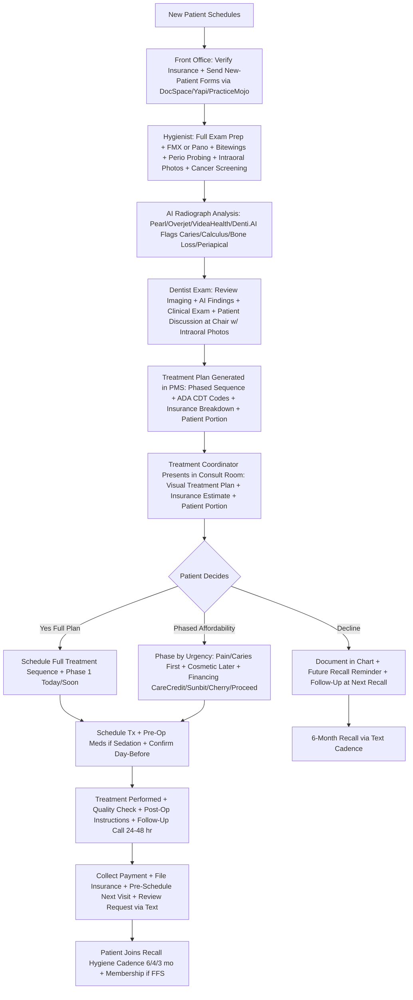
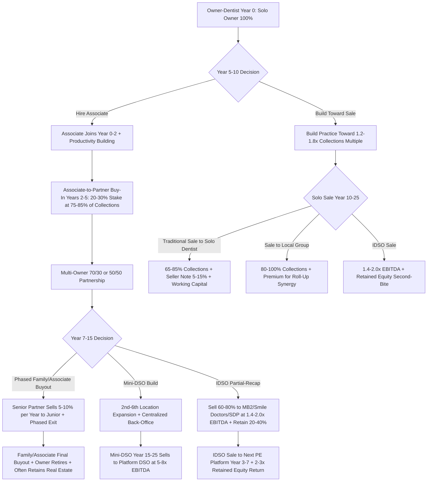
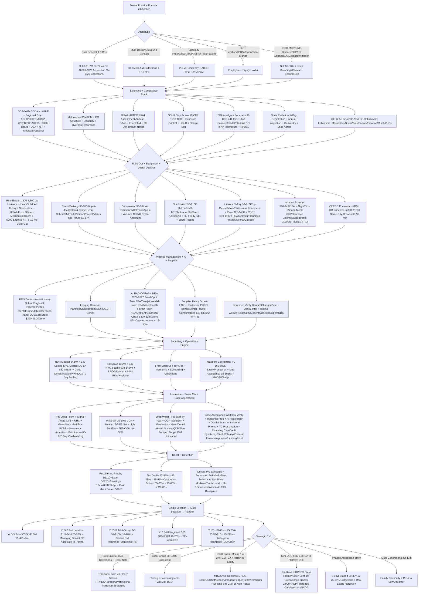

**TL;DR:** Starting a **dental practice in 2027** (a.k.a. **dental office, dental clinic, general dentistry practice, family dentistry practice, dental group practice, specialty dental practice**) -- a **state-licensed dental clinic that diagnoses, prevents, and treats diseases of the teeth, gums, and oral cavity, structured as one of four archetypes: solo-doctor general-dentistry private practice (most common, 3-6 operatories, $650K-$1.5M collections, 25-40% net) + multi-doctor group practice (2-4 dentists + associates + hygienists, $1.5M-$4.5M, 22-35% net) + specialty practice (periodontics/endodontics/orthodontics/oral-and-maxillofacial-surgery/pediatric-dentistry/prosthodontics requiring 2-6 yr CODA-accredited residency + ABDS specialty board cert + higher fee per service) + DSO/IDSO-affiliated practice (clinical autonomy preserved + back-office centralized + equity rollover liquidity event); requires owner holding active DDS (Doctor of Dental Surgery) or DMD (Doctor of Medicine in Dentistry) from CODA-accredited dental school + INBDE Integrated National Board Dental Examination + regional clinical exam ADEX/CRDTS/CDCA-WREB/SRTA/CITA + state dental board license + DEA registration + NPI + optional Medicaid enrollment + malpractice $1M/$3M; plus CE 12-50 hrs per cycle via AGD MasterTrack+Fellowship+Mastership + Spear + Kois + Pankey + Dawson + Misch + Pikos; plus HIPAA Privacy+Security+Breach Notification + OSHA Bloodborne Pathogens 29 CFR 1910.1030 + EPA Dental Amalgam Separator 40 CFR Part 441 + state radiation safety; distinct from orthodontic-only (ortho residency + Invisalign/SureSmile/Spark) + oral surgery (OMFS residency + hospital privileges) + pediatric (pedo residency) + dental hygiene-only (illegal most states) + denturist + dental school clinic** -- means choosing among **five business models: solo general (3-6 ops $650K-$1.5M 25-40% net) + multi-doctor group (2-4 dentists $1.5M-$4.5M 22-35%) + specialty (perio/endo/ortho/OMFS/pedo/prostho $1M-$4M 28-45%) + DSO-affiliated Heartland Dental KKR Pat Bauer ~1,800 offices/Pacific Dental Services Steve Thorne ~1,000+/Aspen Dental Leonard Green American Dental Partners ~1,100/Smile Brands GTCR+ADP Bright Now/Castle/Monarch ~700+/Affordable Care Berkshire+Audax ~400/Western Dental New Mountain ~330/North American Dental Group Jacobs ~250 + IDSO partial-recap MB2 Dental Charlesbank ~700+/Smile Doctors Linden+THL ~400+ orthodontic/Specialized Dental Partners Quad-C ~150+/US Endo Partners Sentinel ~125+/US Oral Surgery Management RiverGlade ~100+/Beacon Oral Trive ~50+/Imagen Dental Partners Trive+Sun/PepperPointe ~75+/Paradigm Oral Health Frazier; equipment chair+delivery $8-$15K A-dec/Pelton & Crane Henry Schein/Midmark/Belmont + compressor $4-$8K + autoclave $5-$10K Midmark M9-M11/Tuttnauer/SciCan + intraoral X-ray $8-$15K/op Dexis/Schick/Carestream/Planmeca + pano $25-$45K + CBCT $80-$180K i-CAT/Vatech/Planmeca ProMax/Sirona Galileos + intraoral scanner $20-$45K iTero Align Technology/Trios 3Shape/Medit/Planmeca Emerald + CEREC Sirona/Dentsply OR Glidewell.io $90-$150K end-to-end for same-day crowns; PMS Dentrix Ascend cloud Henry Schein/Eaglesoft Patterson/Open Dental/Curve/tab32/Denticon Planet DDS/CareStack $300-$1,200/mo; imaging Romexis Planmeca/Carestream/DEXIS Imaging Suite/CDR Schick; AI radiograph layer NEW 2024-2027 Pearl Ophir Tanz FDA/Overjet Wardah Inam FDA/VideaHealth Florian Hillen FDA/Denti.AI/Diagnocat CBCT $300-$1,500/mo lifts case acceptance 15-30%; supplies Henry Schein HSIC + Patterson PDCO + Benco; capital $300-$650K 3-op startup + $500K-$1.2M 4-6 op + $1.2M-$2.5M full-digital w/ CEREC+CBCT + $600K-$2M acquisition at 65-85% of trailing 12-mo collections + SBA 7(a) Live Oak Bank Dental/Bank of America Practice Solutions/Provide.com was Lendeavor/First Citizens/Huntington/US Bank/TD Bank + Patterson Financial/Henry Schein Financial equipment leasing** -- operating against **US dental services market ~$165B annually (ADA HPI + IBISWorld 2024) + ~200K active dentists (135K general + 65K specialists) + ~200K practice locations + ~150M with dental insurance (NADP) + ~75M without (membership target) + avg general practice gross collections ~$857K (ADA Survey of Dental Practice 2023) + 21-35% owner net + top decile 45-55% + 3-5% CAGR through 2030 + DENTAL DEBT CRISIS $307K-$524K avg loan balance class of 2024 (ADEA) drives DSO acceptance + DSO consolidation ~28% 2024 vs <5% in 2010 (ADA HPI) → 35%+ by 2030 + INVISIBLE DSO IDSO model fastest-growing: keep branding+clinical autonomy+employees while back-office centralized + 60-80% equity sold + 20-40% retained + second-bite at next platform recap 3-7 years typically 2-3x return; counter-pressures HYGIENIST SHORTAGE 20-30% recall capacity unfilled post-COVID + RDH wages $42/hr median → $58-$78/hr Bay-Seattle-NYC-Boston-DC-LA + recall hygiene 35-55% of cashflow + lose RDH = recall collapses 60-100% in 60 days + CASE ACCEPTANCE 50-70% top vs 20-30% bottom = $200-$500K/yr on floor + intraoral camera + AI-flagged caries + TC + financing CareCredit Synchrony/Sunbit/Cherry/Proceed Finance/Alphaeon/LendingPoint + PPO/FFS/MEMBERSHIP MIX top decile drops low-reimbursing + dental membership Kleer Pradeep Bansal ~7K practices/Dental Health Society/QDP/Plan Forward targets 75M uninsured + RECALL HYGIENE retention 92-96% × show 92-95% top vs 65-75% × 75-85% bottom via PracticeMojo+Yapi+Solutionreach+Modento+Lighthouse 360+Weave+NexHealth+OperaDDS+Doctible + DIGITAL DENTISTRY REVOLUTION scanner + AI radiograph + CEREC same-day + Invisalign $3,500-$6,500 per case + SureSmile Dentsply + Spark Ormco + implant placement $3,800-$7,100 per implant Misch+Pikos+ICOI**. The hardest part is **HYGIENIST RECRUITING + CASE ACCEPTANCE WORKFLOW + DSO-EXIT CLARITY trifecta**, not capital or chair/CBCT/scanner spend.

> ### 🎯 Bottom Line
> - **[Capital]** **$500K-$1.2M de novo 4-6 operatory general dental practice** (1,800-3,500 sq ft + 4-6 operatories at $200-$350/sq ft TI build-out + A-dec/Pelton & Crane/Midmark chairs $8-$15K each + Belmont compressor $4-$7K + autoclave $5-$10K + panoramic X-ray $25-$45K + CBCT $80-$180K + iTero/Trios/Medit intraoral scanner $20-$45K + practice-management software + 12-18 mo working capital). **$300K-$650K small startup** (3 operatories, no CBCT, no chairside mill). **$1.2M-$2.5M full-digital** with CEREC/Glidewell.io CAD/CAM mill $90-$150K + CBCT + 6-8 operatories. **$600K-$2M acquisition** at **65-85% of trailing 12-month collections** + working capital. SBA 7(a) financing $400K-$2M via dental-specific lenders Live Oak Bank Dental + Bank of America Practice Solutions + Provide.com (was Lendeavor) + First Citizens Practice Solutions + Huntington Practice Finance. State dental board license + DEA + NPI + Medicaid enrollment optional + EPA dental amalgam separator + OSHA bloodborne pathogen + HIPAA + state radiation safety + CE requirements.
> - **[Margins]** Avg general dental practice: **~$857K gross collections, 21-35% net to owner-dentist = $180K-$300K** (ADA Survey of Dental Practice 2023). Top quartile: **$1.2M-$2.5M gross, 35-50% net = $400K-$1.1M owner take-home** (Levin Group + McGill Advisory benchmarks). **Top decile fee-for-service / OON (out-of-network) practices net 45-55%** by minimizing PPO contracts. **PPO write-off compresses net by 25-40 points** at heavy-contract practices. **Production per provider hour $300-$650/hr** generalist; **$500-$1,200/hr** specialist. **Case acceptance rate 30-70%** swing — top practices use intraoral camera + AI-flagged caries images + visual treatment plan; bottom rely on text-only estimate. **Recall hygiene retention 90%+ × 92%+ show rate** at top practices; **collapses to 65-75% × 75-85%** at low-discipline practices. **M&A multiples 0.7-1.2x collections** at traditional dental sale, **1.2-1.8x for top practices to IDSO**, **1.4-2.2x EBITDA-based** for multi-doctor groups to platform DSOs.
> - **[Hardest part]** **NOT capital. NOT chair/CBCT/scanner spend.** The trifecta: **(1) HYGIENIST RECRUITING + RETENTION** -- ADA HPI + BLS 2024 confirm a national RDH shortage 20-30% below pre-COVID capacity at most practices; lose your hygienist and recall revenue (40-60% of practice cashflow) cratERS in 90 days. RDH wages $45-$55/hr most metros, $60-$80/hr Bay Area/Seattle/NYC core. **(2) CASE ACCEPTANCE + INSURANCE NAVIGATION** -- top practices close 50-70% of presented treatment vs bottom 20-30% because of intraoral camera + AI-flagged caries images + visual storytelling + insurance breakdown + financing options (CareCredit/Sunbit/Cherry/LendingPoint/Proceed Finance). Without a structured case-acceptance workflow, dentists leave $200K-$500K/year on the floor. **(3) DSO PRESSURE + EXIT CLARITY** -- Heartland Dental (KKR-backed, ~1,800 offices) + Pacific Dental Services (~1,000+) + Aspen Dental (~1,100) + Smile Brands + Affordable Care + ~250 IDSO platforms (MB2 Dental, Smile Doctors, Specialized Dental Partners, US Endo Partners, US Oral Surgery Management, Beacon, North American Dental Group, Imagen Dental Partners) actively bidding 1.2-1.8x collections for top practices. 2027 owner-dentist must decide IDSO partial-recap vs traditional sale vs family/associate buyout vs multi-generational independent — drifting without exit clarity = sub-optimal valuation event.

A **dental practice** in 2027 is a **state-licensed dental clinic that diagnoses, prevents, and treats diseases of the teeth, gums, and oral cavity for individual patients** — typically structured as one of four archetypes: **(a) solo-doctor general-dentistry private practice** (most common, 3-6 operatories, $650K-$1.5M collections), **(b) multi-doctor group practice** (2-4 dentists + associates + hygienists, $1.5M-$4.5M collections), **(c) specialty practice** (perio, endo, ortho, OMFS, pedo, prosthodontics, requiring 2-6 yr additional residency + board cert + higher per-hour production), or **(d) DSO/IDSO-affiliated practice** (clinical autonomy preserved + back-office centralized + equity rollover liquidity event). Three regulated pillars: state dental board license (with required CE) + DEA registration for controlled substance prescribing + state radiation safety / EPA dental amalgam separator / OSHA bloodborne pathogen / HIPAA compliance stack.

**Distinct from** orthodontic-only practice (ortho residency required + Invisalign/SureSmile/Spark focus + 3-5 yr active treatment cycles), oral surgery practice (OMFS residency + medical hospital privileges common), pediatric dental practice (pedo residency + child-specific facility design), dental hygiene-only practice (illegal in most states — must be dentist-owned), denturist (legal in some states only), and dental school clinic (academic medical center model). Dental practice **owners** must hold an active **DDS or DMD degree** from a CODA-accredited dental school + pass the **INBDE (Integrated National Board Dental Examination)** + a regional clinical exam (ADEX, CRDTS, WREB, SRTA, CITA) + obtain state dental board license + DEA + NPI + (optionally) Medicaid provider enrollment + carry malpractice insurance ($1M/$3M typical).

The 2027 demand: **~200K active dentists in the US** (ADA HPI 2024) of which **~135K general dentists + ~65K specialists**, **~200K dental practice locations**, **~150M Americans with dental insurance** (NADP National Association of Dental Plans), **~75M without** (target market for dental membership programs Kleer, Dental Health Society). **Avg US general dental practice gross collections ~$857K** (ADA Survey of Dental Practice 2023), with **owner-dentist net $180K-$300K (21-35% of collections)** and top-quartile **$400K-$1.1M (35-50%)**. ADA HPI projects dental services market ~$165B annually growing **3-5% CAGR through 2030**.

Five business models: **solo general practice** (most common, 3-6 ops, $650K-$1.5M, 25-40% net to owner); **multi-doctor group** (2-4 dentists + associates, $1.5M-$4.5M, 22-35%); **specialty** (perio/endo/ortho/OMFS/pedo/prostho, $1M-$4M, 28-45% — higher fee per service); **DSO-affiliated** (clinical autonomy + back-office centralized, owner-dentist as employee/equity holder); **IDSO partial-recap** (sell 60-80% equity, retain clinical autonomy + minority, second-bite liquidity at next platform sale).

Five 2027 survival drivers: **(1)** hygienist recruiting + retention beating every practice in your zip code (the recall revenue engine); **(2)** case acceptance workflow with intraoral camera + AI-flagged caries images + structured treatment-plan presentation + financing partners (the production engine); **(3)** PPO/FFS/membership mix decision (top practices net 45-55% by minimizing PPO contracts); **(4)** digital-dentistry investment — intraoral scanner + AI radiograph reader (Pearl/Overjet/VideaHealth/Denti.AI) + chairside CAD/CAM (CEREC/Glidewell.io) for same-day crowns; **(5)** DSO-exit awareness (Heartland/Pacific Dental Services/Aspen/Smile Brands actively rolling up + IDSO platforms MB2/Smile Doctors/Specialized Dental Partners bidding 1.2-1.8x collections).

## 🗺️ Table of Contents

**Part 1 -- Foundations**
- Market size, dentist supply, dental debt crisis
- Four practice archetypes
- DDS/DMD pathway, state licensure, specialty residency
- DSO consolidation reality + IDSO recap model

**Part 2 -- Build-Out & Capital**
- Real estate + operatory build-out
- Chair + equipment fundamentals (compressor, autoclave, pano, CBCT)
- Digital workflow decision (intraoral scanner, CAD/CAM mill, AI radiograph)
- Practice management software + parts/supplies distribution
- SBA + dental-specific financing

**Part 3 -- Operations**
- Hygienist recruiting + RDH/RDA staffing model
- Insurance credentialing + PPO/FFS/membership mix
- Case acceptance workflow + treatment-plan presentation
- Recall hygiene cadence + retention metrics
- Compliance: HIPAA + OSHA + state board + EPA amalgam

**Part 4 -- Growth & Exit**
- Marketing realities (Google Reviews + Healthgrades + referrals)
- Specialty adjuncts (Invisalign, implants, sleep, Botox/TMD)
- Multi-location group + mini-DSO scale
- IDSO partial-recap landscape
- Traditional sale + associate/family succession

---

## 📐 PART 1 -- FOUNDATIONS

### Market size, dentist supply & the debt crisis

US dental services generate **~$165B annual revenue** (ADA HPI + IBISWorld Dentists in the US 2024) across **~200K dental practice locations** serving **~330M Americans** (of whom ~150M carry dental insurance per NADP). The defining 2024-2027 macro: **DSO consolidation accelerating** (~28% of practices in 2024 vs <5% in 2010 per ADA HPI, projected **35%+ by 2030**) + the **dental school debt crisis** ($307K-$524K avg loan balance at graduation per ADEA Educational Debt Survey 2024) which drives new-grad acceptance of DSO employment.

> ### 📊 Quick Facts
> - **~$165B** US dental services market (ADA HPI + IBISWorld 2024)
> - **~200K** active dentists (ADA HPI), ~135K general + ~65K specialists
> - **~200K** dental practice locations (ADA HPI)
> - **~150M** Americans with dental insurance (NADP 2024)
> - **~75M** without dental insurance (membership-program target market)
> - **~$857K** avg general practice gross collections (ADA Survey of Dental Practice 2023)
> - **21-35%** owner-dentist net (ADA Survey); top decile 45-55%
> - **$307K-$524K** avg dental school debt class of 2024 (ADEA)
> - **~28% DSO market share 2024**, **35%+ projected by 2030** (ADA HPI)

**The dental-debt + DSO-acceptance flywheel.** Avg dental grad carries **$307K-$524K educational debt** (ADEA 2024 — private schools NYU/USC/UPenn/Tufts/Boston U/Midwestern at the top), pushing income-driven repayment. Net effect: new grads accept **DSO employment offers $130K-$180K base + production bonus** because immediate cashflow services debt — even though long-term practice-ownership economics run 2-4x better. This grad-funnel is **the structural input** driving DSO market share from <5% in 2010 to ~28% in 2024 to projected 35%+ by 2030 (ADA HPI).

**Demand fundamentals strong + aging.** Adults 45+ retain natural teeth at historically high rates, driving demand for restorations + implants + perio + cosmetic. **65+ population: ~40M in 2010 → ~58M in 2024 → ~78M by 2035** (US Census), creating implant + bridge + denture + perio surge. **35M+ Americans live in dental HPSAs** (HRSA 2024), often rural — opportunity for new-grad practice in underserved zip + NHSC Loan Repayment eligible.

### Four practice archetypes

The single most consequential 2027 decision is **archetype selection** — it dictates capital intensity, payer mix, exit multiple, and lifestyle.

**Solo-doctor general practice.** 1 owner-dentist + 1-2 RDH + 2-3 RDA + 1-2 front office. **3-6 ops, 1,800-3,500 sq ft, $650K-$1.5M collections, 25-40% owner net = $160K-$600K**. Most common — and most exposed to DSO competition + hygienist shortage. Top quartile $1.2M-$2.5M with strong case acceptance + minimized PPO.

**Multi-doctor group.** 2-4 dentists + 3-5 RDH + 4-7 RDA + 2-4 front office. **6-10 ops, 3,500-6,500 sq ft, $1.5M-$4.5M, 22-35% owner net to senior partner = $330K-$1.5M**. Operating-leverage from shared facility + supplies + front office. Common scale point on path to mini-DSO.

**Specialty practice.** Perio / endo (root canals) / ortho / OMFS / pedo / prostho. Higher fee per service ($600-$2,500 ortho, $1,500-$3,500 implant placement, $1,200-$2,000 molar RCT, $5K-$15K+ full-mouth perio). **$1M-$4M, 28-45% net**. Requires **2-6 yr accredited residency + specialty board cert**. Pediatric + ortho + endo highest-volume; OMFS highest-revenue-per-case.

**DSO/IDSO-affiliated practice.** Owner sells 60-80% to traditional DSO (Heartland/Pacific Dental Services/Aspen — full integration) OR an **Invisible DSO** (MB2/Smile Doctors/SDP — branding + clinical autonomy preserved, back-office centralized). Owner retains autonomy + minority equity + second-bite at next platform sale. Best for owners 5-15 years from retirement seeking partial liquidity + reduced operational burden.

### DDS/DMD pathway, state licensure & specialty residency

**The clinical pathway:** 4-yr undergraduate + DAT + 4-yr dental school (~80 CODA-accredited schools — Harvard, UPenn, Columbia, Michigan, UCSF, UNC, NYU, USC, Tufts, Midwestern, etc.) earning **DDS** (Doctor of Dental Surgery) or **DMD** (Doctor of Medicine in Dentistry) — interchangeable. Then **INBDE** (Integrated National Board Dental Examination, replaced Parts I+II in 2022). Then a regional clinical exam — **ADEX** (NE/MidAtlantic), **CRDTS** (Central), **CDCA-WREB** (West), **SRTA/CITA** (Southern). Then state dental board licensure (often plus state jurisprudence + CPR/BLS + background check).

**DEA registration** required for controlled substance prescribing. **NPI** required for any insurance billing. **Medicaid enrollment** optional but state-specific (CHIP/Medicaid pediatric volume drove platforms like Western Dental + Kool Smiles).

**Continuing Education.** State boards require **12-50 CE hours per renewal cycle**. Providers: **ADA CE Online**, **AGD MasterTrack + Fellowship (500 hrs) + Mastership (1,100 hrs)**, **Spear Education**, **Kois Center**, **Pankey Institute**, **Dawson Academy**, **Misch International Implant Institute**, **Pikos Institute**. AGD Fellowship + Mastership are the most-recognized post-graduate credentials for general dentists.

**Specialty residency pathway.** Recognized ADA specialties requiring CODA-accredited residency + ABDS board cert: **Periodontics** (3 yr), **Endodontics** (2-3 yr), **Orthodontics** (2-3 yr), **Oral and Maxillofacial Surgery** (4-6 yr, often w/ MD), **Pediatric Dentistry** (2 yr), **Prosthodontics** (3 yr), **Oral/Maxillofacial Radiology** (2 yr), **Oral Pathology** (3 yr), **Dental Public Health** (1-2 yr), **Oral Medicine** (2-3 yr), **Orofacial Pain** (2-3 yr).

### DSO consolidation reality & the IDSO recap model

**The DSO landscape 2024-2027.** **Heartland Dental** (KKR-backed since 2018, ~1,800 offices, founded Rick Workman + Pat Bauer CEO) is the largest US DSO. **Pacific Dental Services** (Steve Thorne founder, ~1,000+ offices). **Aspen Dental** (American Dental Partners parent, Leonard Green-backed, ~1,100 offices). **Smile Brands** (GTCR+ADP, ~700+ offices, Bright Now/Castle/Monarch brands). **Affordable Care** (Berkshire+Audax, ~400 denture/extraction). **Western Dental** (New Mountain, ~330, CA Medi-Cal heavy). **North American Dental Group** (Jacobs Holding, ~250). Plus Mortenson Dental Partners, Great Expressions, Dental Care Alliance.

**The Invisible DSO (IDSO) model — fastest-growing 2024-2027.** IDSO lets the selling dentist **keep practice branding + clinical autonomy + employees** while centralizing back-office (insurance contracting, HR, payroll, marketing, supply purchasing, IT, compliance). Owner sells **60-80% equity for cash up front** + retains 20-40% + **second-bite at next platform recap in 3-7 years** (typical 2-3x return on retained equity at second sale). Major IDSOs: **MB2 Dental** (Charlesbank, ~700+ affiliated), **Smile Doctors** (Linden+THL, ~400+ orthodontic), **Specialized Dental Partners** (Quad-C, ~150+ multi-specialty), **US Endo Partners** (Sentinel, ~125+ endodontic), **US Oral Surgery Management** (RiverGlade, ~100+ OMFS), **Beacon Oral & Maxillofacial Partners** (Trive, ~50+ OMFS), **Imagen Dental Partners** (Trive/Sun), **PepperPointe Partnerships** (~75+), **Paradigm Oral Health** (Frazier, ~50+ OMFS).

**Why IDSO won 2024-2027.** Traditional DSO sale requires giving up branding + clinical autonomy, which owner-dentists in their 50s often refuse. IDSO preserves both while delivering liquidity + back-office relief + second-bite economics. Typical deal: practice doing **$1.5M collections + $400K EBITDA** sells for **1.4-2.0x EBITDA + 60-80% equity** = **~$450K-$650K cash + 20-40% retained equity becoming ~$250K-$650K at next recap in 3-7 yrs**. Multiple table in Numbers section.

---

## 🏗️ PART 2 -- BUILD-OUT & CAPITAL

### Real estate & operatory build-out

> ### 📊 Quick Facts
> - **3-op startup**: $300-$650K total launch (1,200-2,000 sq ft)
> - **4-6 op general practice**: $500K-$1.2M (1,800-3,500 sq ft)
> - **Full-digital with CEREC + CBCT**: $1.2M-$2.5M (3,500-5,000 sq ft)
> - **Acquisition**: $600K-$2M at 65-85% of trailing 12-mo collections
> - **TI build-out**: $200-$350/sq ft (dental-specific MEP intensive)
> - **Chair + delivery unit**: $8K-$15K each (A-dec/Pelton & Crane/Midmark)
> - **Operatory full equip**: $35K-$75K per op (chair + delivery + cabinets + intraoral X-ray + computer + monitor)

**Site selection.** Dental practices want **2-3 mile residential density 25K+ households**, **median household income $65K+** (higher = more elective + cosmetic + implant uptake), **visible signage**, **easy parking 20-40 spots**, **co-tenant traffic** (grocery / pharmacy / family medical), **demographic match** to chosen specialty (pediatric near schools/young families, cosmetic + implant near 45+ HHI $85K+, perio + endo referrals from network of GP practices). Avoid heavy DSO/corporate-chain saturation — if there's a Heartland + Aspen + Pacific Dental + a Western Dental within 2 miles, the patient-acquisition cost will be 2-3x higher.

**Operatory layout & MEP intensity.** Dental build-out runs **$200-$350/sq ft TI** — among the most expensive of any small business because of: medical-grade plumbing (compressed air, vacuum, water, waste at every chair), medical-grade electrical, **lead-shielded X-ray rooms** (intraoral + pano + CBCT), **sterilization room**, **lab/casting room**, HIPAA-compliant front office layout, ADA-accessible restrooms + operatories, dedicated mechanical room.

**Build-out timeline** runs **6-12 months** lease-to-first-patient: 30-60 day design+permitting, 90-150 day construction, 30-60 day equipment install + IT + training. Dental-specialty contractors (HJT Dental, Jet Dental, Constructive Builders) handle the MEP intensity.

**Lease vs buy.** Lease typical **$2,500-$6,000/mo per 1,000 sq ft** suburban, **$4,500-$10,000** metro. Many dental owners buy via separate LLC + lease to PC (Professional Corporation) — capturing real-estate appreciation + tax efficiency + exit flexibility (sell practice separate from real estate).

### Chair + equipment fundamentals

**Dental chair + delivery + light + assistant arm.** **$8K-$15K per op** new (A-dec Pacific NW gold standard; Pelton & Crane (Henry Schein); Midmark Ohio mid-market; Belmont Japanese; Forest; Marus). Refurb chairs $3K-$7K save $20K-$40K on launch.

**Compressor + vacuum.** **$4K-$8K compressor** (Air Techniques, Belmont, Apollo, Powermatic) oil-free required for medical use. **$3K-$7K vacuum** (dry preferred over wet for amalgam separator compliance).

**Sterilization.** **$5K-$10K autoclave** (Midmark M9/M11, Tuttnauer, SciCan Statim) per CDC Guidelines for Infection Control in Dental. **$2K-$5K ultrasonic**. **$3K-$8K instrument-processing** (Hu-Friedy IMS). Annual spore testing required.

**Intraoral X-ray.** **$8K-$15K per op** digital sensor + X-ray head (Dexis, Schick by Sirona, Carestream, Planmeca) — instant capture + reduced radiation + PMS integration.

**Panoramic X-ray + CBCT.** **$25K-$45K** for digital pano (Vatech, Carestream, Planmeca, Sirona/Dentsply Orthopantomograph). **$80K-$180K for CBCT** (i-CAT, Vatech, Planmeca ProMax, Carestream CS9600, Sirona Galileos) — used for implant treatment planning + complex endo + ortho + OMFS. Generates $50-$250 billable per scan when justified. Increasingly standard of care for implant placement; without CBCT, GPs refer implants to OMFS/perio.

**Intraoral scanner.** **$20K-$45K** digital impression scanner (iTero by Align Technology, Trios by 3Shape, Medit i900/i700, Planmeca Emerald, Carestream CS3700). Eliminates alginate/PVS impressions + integrates with Invisalign + CEREC + lab + same-day crowns. **Highest-ROI digital investment for a 2027 startup** — eliminates remakes + speeds case turnaround + improves patient experience.

**CEREC / Glidewell.io chairside CAD/CAM.** **$90K-$150K end-to-end** (CEREC Primescan + MCXL mill + furnace + software, Sirona/Dentsply; or Glidewell.io). Enables **same-day crowns** in 60-90 min — eliminates 2-wk lab cycle + temp + second appointment. **ROI math**: 8-15 crowns/month chairside vs lab saves $150-$300/crown lab fee + captures full $1,100-$1,800 crown fee = payback 18-30 months at mature volume.

### Practice management software & supplies

**Practice management software (PMS).** **$300-$1,200/month per practice**: **Dentrix Ascend** (cloud, Henry Schein, fastest-growing), **Dentrix** (legacy desktop), **Eaglesoft** (Patterson Companies), **Open Dental** (open-source-ish, low cost, popular w/ independent + tech-savvy), **Curve Dental** (cloud), **tab32** (cloud), **Denticon by Planet DDS** (multi-location enterprise), **CareStack** (cloud + RCM). Choice driven by cloud vs desktop + multi-location need + integration with imaging/scheduling/RCM/texting.

**Digital imaging software.** **Romexis** (Planmeca), **Carestream Imaging**, **DEXIS Imaging Suite**, **CDR DICOM** (Schick) — view + annotate intraoral + pano + CBCT at chair.

**AI radiograph layer (NEW 2024-2027).** **$300-$1,500/mo per practice**: **Pearl** (Ophir Tanz, FDA-cleared — caries/calculus/bone loss/periapical), **Overjet** (Wardah Inam, FDA-cleared + insurance-aligned reporting), **VideaHealth** (Florian Hillen, FDA-cleared caries), **Denti.AI**, **Diagnocat** (CBCT-focused). 2027 argument: AI catches sub-clinical caries the human eye misses + creates patient-facing visual evidence that **lifts case acceptance 15-30%** because patients see the AI-highlighted carious lesion in their own image.

**Supplies distribution.** Three dominant US distributors: **Henry Schein** (NASDAQ: HSIC, broadest), **Patterson Dental** (NASDAQ: PDCO, Eaglesoft owner), **Benco Dental** (private, NE/MidAtlantic). Annual consumables for a 4-op general practice run **$45K-$85K** depending on procedure mix.

### SBA + dental-specific financing

Dental has the **strongest specialty-finance ecosystem of any small-business category** because banks know dental practice cashflow is stable + collateralized by equipment + real estate + recurring revenue + low default rate (sub-1% historically).

**Typical 4-op general practice de novo 2026:** real estate $0 (lease) to $400K-$1.2M (buy) + TI build-out $200-$350/sq ft × 2,500 sq ft = $500K-$875K + equipment + chairs $200K-$400K + CBCT + scanner $100K-$225K + IT + PMS + signage $30K-$60K + working capital 12-18 months $100K-$300K = **total $500K-$1.2M de novo**.

**Acquisition financing (SBA 7(a) buying existing 4-op practice):** purchase price $600K-$2M (65-85% of trailing 12-mo collections) + 10-20% down ($60K-$400K) + SBA 7(a) loan 70-85% (cap $5M, 10-25 yr amortization) + seller note 5-15% at 6-8% 5-7 yr + working capital reserve $50K-$150K.

**Dental-specific lenders:** **Live Oak Bank Dental Lending** (top SBA dental lender nationally), **Bank of America Practice Solutions** (largest non-SBA dental financier), **Provide.com** (was Lendeavor, modern fintech), **First Citizens Practice Solutions** (was Square 1), **Huntington Practice Finance**, **US Bank Practice Finance**, **TD Bank Healthcare Practice**, **Wells Fargo Practice Finance** (closed to new business 2024 but legacy book). Equipment leasing: **Patterson Financial**, **Henry Schein Financial**, **US Bank Equipment Finance**, **Western Equipment Finance**.

---

## ⚙️ PART 3 -- OPERATIONS

### Hygienist recruiting & RDH/RDA staffing model

**The #1 operational constraint in 2027 dental is the registered dental hygienist (RDH).** ADA HPI + BLS 2024 confirm a structural RDH shortage — many practices report **20-30% of recall capacity unfilled** post-COVID because RDHs left clinical practice (toward dental education, industry roles, hygiene supervision in DSOs, or fully out of profession). New-graduate RDH supply from accredited programs (CODA accredits ~330 dental hygiene programs) replenishes ~7,000-8,000/yr but attrition runs higher.

> ### 🟡 Key Stat
> Per BLS 2024 Occupational Outlook + RDH Magazine wage surveys, **median dental hygienist wage $87,530/yr nationally (~$42/hr)** with top decile **$110K+**; major metros pay $50-$80/hr — Seattle, San Francisco Bay Area, NYC core, DC metro, Boston, San Diego, Portland, Denver all running $58-$78/hr. **Recall hygiene revenue = 35-55% of practice cashflow** at mature general practices (prophy + perio maintenance + sealants + fluoride + bitewing + perio probing + cancer screening + scaling). Lose your hygienist + recall column collapses 60-100% within 60 days. **RDH tenure averages 2-4 years** at private practice (faster turnover at DSO).

**Wage benchmarks** (BLS 2024 + RDH Magazine 2024): national median $42/hr; Bay Area / Seattle / NYC core $58-$78/hr; Boston / DC / LA $50-$68/hr; Portland / Denver / Austin / Dallas $48-$58/hr; Southeast metros $40-$52/hr; Midwest $40-$50/hr; rural $35-$45/hr. Many practices add **production bonus** ($5-$15/hr above 8 hygiene patients/day) + benefits + CE allowance + tools.

**RDA (Registered Dental Assistant) staffing.** **$22-$35/hr** most metros, **$28-$45/hr** Bay Area / NYC / Seattle. Pre-licensure CDA (Certified Dental Assistant via DANB) vs state-licensed RDA varies — CA RDA + RDAEF (expanded function) most rigorous. **Staffing ratio: 1 RDA per dentist + 0.5-1 RDA per hygienist** for efficient room turnover + 4-handed dentistry.

**Front office staffing.** 2-4 per 6-op practice depending on insurance verification + scheduling + collections burden. Many practices outsource insurance verification (DentalXChange, Vyne Dental) + RCM (Dental Intel + outsourced billing).

**Recruiting channels:** Indeed + DentalPost (dental-specific) + CODA program career services + RDH Magazine job board + Cloud Dentistry + referral bonus $500-$2K. **Cloud Dentistry / Stynt / Kwikly / GoTu** changed hygiene labor 2022-2024 — many RDHs prefer 1099 temp over W-2 for flexibility + higher per-day rate.

### Insurance credentialing + PPO/FFS/membership mix

**The single most consequential financial decision** for a new practice owner is **payer mix** — PPO contracts vs fee-for-service (FFS) vs out-of-network (OON) vs dental membership programs.

**Big PPO carriers** (each requires separate 60-120 day credentialing): **Delta Dental** (largest US dental insurer, ~80M covered lives, regional state-affiliated plans), **Cigna**, **Aetna** (CVS Health), **UnitedHealthcare** (UHG), **Guardian**, **MetLife**, **BCBS** (state Blues), **Humana** (Medicare Advantage), **Ameritas**, **Principal**.

**PPO write-off math.** Every PPO contract sets a **fee schedule writing off 20-50%** of practice UCR fees. Example: UCR crown $1,500; Delta PPO contracted $950 = **37% write-off**. Heavy PPO practices net **18-28%** to owner; light PPO (3-5 contracts) net **30-45%**; FFS/OON only net **40-55%**.

**The PPO unbundling strategy (top decile play).** Top practices **drop low-reimbursing PPO contracts year by year** (typically MetLife + Cigna + UHC first) + transition existing patients to **out-of-network with insurance reimbursing patient directly** (practice still files as courtesy). Combined with a **dental membership program** ($35-$70/mo covering 2 cleanings + exam + X-rays + procedure discounts) — practices retain volume + capture full UCR + dramatically improve net %.

**Dental membership programs.** **Kleer** (Pradeep Bansal, ~7K practices), **Dental Health Society**, **QDP Quality Dental Plan**, **Plan Forward**. Target the **~75M uninsured Americans** + the insurance-underwhelmed (annual maximums $1,500-$2,500 outdated since the 1970s). Membership = **monthly recurring revenue, no write-off, ~95% retention** — dental's subscription-SaaS analog. **Best 2025-2027 play: open with 2-3 chosen PPO (Delta + 1-2 representing 60%+ zip coverage) + aggressive membership program + intentional FFS for procedures beyond preventive**.

### Case acceptance workflow & treatment-plan presentation

**Case acceptance is the dental version of sales conversion.** A patient comes in for exam + X-rays + hygiene; dentist diagnoses (typically) $1,500-$8,000 of recommended treatment (caries restoration, crown, root canal, perio scaling, implant); the patient decides whether to proceed. **Top practices close 50-70% of presented treatment; bottom 20-30%.** That gap is the difference between a $650K practice and a $1.5M practice on the same dentist hours.

> ### 🟡 Key Stat
> Per Levin Group + Dental Economics Group + Spear Education benchmarks, **top decile general practices report case-acceptance rates 65-75%** vs **bottom quartile 20-35%**; the gap is driven by **(1) intraoral camera + AI-flagged caries image** showing the patient what the dentist sees, **(2) structured treatment-plan presentation** by a trained treatment coordinator (TC) — not the dentist — covering insurance breakdown + financing options, **(3) financing partners** (CareCredit, Sunbit, Cherry, Proceed Finance, LendingPoint) enabling 6-24 month 0% promotional financing on $1K+ treatment.

**The case-acceptance workflow:**

**Treatment coordinator (TC) role.** The TC is the dental version of a service advisor — not a clinician, typically RDH/RDA with extra training in financial conversations + payer navigation + financing. Best-paid TCs earn **$55K-$95K (base + production bonus)** and add **$200K-$500K/yr to practice production** by improving acceptance 15-30 pts. Spear + Pride Institute + Roger Levin + Dental Intel offer TC training.

**Financing partners.** **CareCredit** (Synchrony, ~250K provider network, 6-24 mo deferred-interest), **Sunbit** (modern POS fintech, instant approval, 3-12 mo 0% promo), **Cherry** (similar modern), **Proceed Finance** (up to 60 mo for $5K+ implant/full-mouth/ortho), **LendingPoint**, **Alphaeon Credit**. Offer 2-3 financing options at TC consult so patient never hears "no" because of upfront cash.

### Recall hygiene cadence & retention metrics

**Recall hygiene is the cashflow engine of a dental practice.** Most patients return every **6 months for standard prophy + exam** (D1110 prophylaxis adult + D0120 periodic exam + bitewings every 12 mo + FMX every 3-5 yr). Patients with periodontal disease history return **3-4 months for D4910 periodontal maintenance** — higher fee + higher production per hour + sticker recurring revenue.

> ### 🟡 Key Stat
> Per Dental Intel + Levin Group benchmarks, **top decile practices report recall retention 92-96% × show rate 92-95% = effective recall capture 85-91%**; **bottom quartile 65-75% × 75-85% = 49-64%** — a 25-40 point gap in the highest-margin column of the practice. Every 1% increase in recall retention adds ~$8K-$15K/yr to a $1M general practice. Tools: **PracticeMojo, Yapi, Solutionreach, Modento, Lighthouse 360, Weave, NexHealth, OperaDDS, Doctible** for automated recall texting + email + voicemail.

**Recall drivers:** (1) pre-schedule next visit at end of every appointment (single biggest lever); (2) automated 2-wk + 1-wk + day-before cadence via text+email+voicemail; (3) confirm-or-reschedule short-codes; (4) AI no-show flagging (Modento, Dental Intel); (5) reactivation outreach for 12-18 mo inactive patients (40-60% recapture).

### Compliance: HIPAA + OSHA + state board + EPA amalgam

> ### ⚠️ Warning
> **HIPAA breach + state board complaint + amalgam separator violation = automatic civil penalty + potential license suspension**. Dental practices are HHS OCR + state board + EPA inspection targets because of patient health data + radiation + biological waste + amalgam.

**HIPAA + HITECH** — Privacy + Security + Breach Notification. Required: annual Risk Assessment, Privacy/Security Officer designation, BAAs with every vendor touching PHI (PMS, AI radiograph, billing, IT, cloud, texting), encrypted email/storage/transmission, 60-day breach notification. Civil penalty **$100-$50K per record per incident** (capped $1.5M/yr per category).

**OSHA + Bloodborne Pathogens 29 CFR 1910.1030** — exposure control plan, annual training, sharps log, Hep B offered, post-exposure follow-up. PPE + barrier + sterilization + surface disinfection + sharps disposal.

**State board + CE.** State dental board complaint = mandatory investigation + potential license suspension. Most-cited issues: standard-of-care, sedation incidents, billing fraud, advertising violations, infection control. CE renewal must stay current.

**EPA Dental Amalgam Separator Rule** (40 CFR Part 441) — required since 2017 for amalgam-handling practices. **ISO 11143-compliant separator** captures 95%+ of particles before wastewater (SolmeteX, R&D Services, Sterisil, ECO II, Air Techniques). NPDES + sewer authority reporting required.

**State radiation safety + X-ray inspection.** Most states require X-ray registration + annual inspection + dosimetry badges + lead apron + thyroid collar.

---

## 🚀 PART 4 -- GROWTH & EXIT

### Marketing realities (Google + reviews + referrals)

Dominant 2027 dental marketing channels: **Google + Google Reviews + patient referrals + Healthgrades/Vitals trust signals + Google Business Profile photos + local NextDoor**. Direct mail still works for new-mover acquisition. Insurance-provider directories (Delta + Cigna + Aetna) drive patients in heavy-PPO zips. Facebook/Instagram moderate for cosmetic + Invisalign + pediatric.

**Reviews are everything.** Goal: **4.7+ stars × 150+ Google reviews** per practice. Every patient asked at checkout (text 2-3 hr post-visit via Weave/NexHealth/Modento/Doctible). Negative review response within 24 hrs, owner-tone, no PHI disclosure (HIPAA), offer to make right offline.

**Patient referrals** are the #1 acquisition channel at mature practices — **35-55% of new-patient volume**. Drivers: refer-a-friend programs ($25-$50 gift card), patient-experience excellence, automated review-request workflow.

**Specialist referrals** — reciprocal relationships with OMFS + periodontist + endodontist + orthodontist + pediatric dentist. 2027 GPs reduce outbound referrals by upskilling (sedation, implant via Misch/Pikos, ortho via Invisalign).

### Specialty adjuncts that scale a GP practice

**Invisalign clear aligner therapy.** **$3,500-$6,500 per case**. Align Technology trained-provider tiers (Diamond / Diamond Plus). Competes with **SureSmile** (Dentsply Sirona) + **Spark Aligners** (Ormco) + D2C (SmileDirectClub closed 2024). Most GPs add Invisalign as 8-15% of total production at maturity.

**Implant placement (vs refer to OMFS).** **$1,500-$3,500 surgical placement + $1,200-$1,800 abutment + $1,100-$1,800 crown = $3,800-$7,100 per implant total**. GPs trained via Misch International + Pikos Institute + ICOI + 1-2 yr implant CE residency-equivalent. CBCT + guided surgery + experienced surgical mentor essential.

**Sleep dentistry.** **$1,800-$3,500 per oral appliance** (SomnoMed, ProSomnus, Whole You) — CPAP alternative for mild-moderate OSA. Requires physician referral + sleep study + medical billing (E0486 HCPCS code).

**Botox + fillers for TMD/cosmetic.** Now legal for dentists in most states with appropriate training. Therapeutic for TMJ + bruxism + migraine. **$300-$800 per area**. Training: American Academy of Facial Esthetics.

**Whitening + cosmetic + sedation.** ZOOM/KöR/Opalescence whitening $400-$1,200, veneers $1,200-$2,500. Oral conscious sedation + nitrous + IV sedation (state permits required) adds **$300-$1,500 per sedated case** + enables larger treatment plans.

### Multi-location expansion & mini-DSO scale

Dental scaling: Yr 0-3 solo $650K-$1.5M 25-40% net → Yr 3-7 2-location $1.5-$4M 20-32% → Yr 7-12 mini-group 3-6 $4-$15M 18-28% → Yr 12-20 regional 7-25 $15-$80M 16-25% → Yr 20+ platform 25-200+ $50M-$1B+ 15-22% (PE) → IPO/strategic.

**Second-location decision** triggers at 80%+ chair-time utilization + strong associate-dentist ready as managing dentist OR an attractive acquisition in adjacent zip. **Stage 1 → Stage 2** is the common stall point — solved by **clear associate-to-partner pathway** (3-5 yr buy-in at agreed multiple) OR by IDSO-style partial sale funding 2nd location.

**Partnership structures.** Solo → 50/50 at 5 yrs → 3rd partner at 10 yrs is traditional ladder. Modern: associate-to-partner buy-in at 2-3 yr for 10-30%, multi-owner LLC, PC + DSO arrangement (most states require PC owned by licensed dentist).

### IDSO partial-recap landscape

> ### 🟡 Key Stat
> Per Group Dentistry Now + Imagen Dental Partners IDSO research + McGill Advisory benchmarks, **IDSO partial-recap multiples 2024-2026 run 1.4-2.0x EBITDA for $250K-$750K EBITDA practices**, **2.0-2.8x for $750K-$1.5M EBITDA multi-doctor groups**, **3.0-5.0x EBITDA for $1.5M+ EBITDA platforms**. Owner sells **60-80% equity for cash up front** + retains 20-40% **rolled into IDSO platform equity** + **second-bite at next recap in 3-7 years** typically returns **2-3x on retained equity** when the IDSO sells to next PE platform. Multiples expanded **0.5-1.0 turns 2020-2024** as IDSO competition intensified.

**IDSO platform landscape (2024-2026 active):**

| IDSO | PE Backer | Focus | Affiliated |
|---|---|---|---|
| MB2 Dental | Charlesbank Capital | General + multi-specialty | ~700+ |
| Smile Doctors | Linden Capital + Thomas H. Lee | Orthodontic | ~400+ |
| Specialized Dental Partners | Quad-C Management | Multi-specialty | ~150+ |
| US Endo Partners | Sentinel Capital | Endodontic | ~125+ |
| US Oral Surgery Management | RiverGlade Capital | OMFS | ~100+ |
| Beacon Oral & Maxillofacial Partners | Trive Capital | OMFS | ~50+ |
| Imagen Dental Partners | Trive + Sun Capital | Multi-specialty | ~80+ |
| PepperPointe Partnerships | private | Regional GP + multi | ~75+ |
| Paradigm Oral Health | Frazier Healthcare | OMFS | ~50+ |
| Dental Heroes | (recent entrant) | General | <50 |
| North American Dental Group | Jacobs Holding | Multi-specialty (traditional DSO mid-point) | ~250+ |
| Mortenson Dental Partners | various | General + multi | ~80+ |

**IDSO deal structure typical.** Practice doing **$1.5M collections + $400K EBITDA** sells for **1.8x EBITDA = $720K EV** + IDSO buys **70% = $504K cash** + owner retains **30% = $216K** platform equity + 3-5 yr management contract + clinical autonomy + branding retained. At next recap (3-5 yr later) IDSO sells at **3-5x EBITDA** = retained equity worth **$432K-$720K** = **2-3.3x return on retained** = total to owner ~**$936K-$1.2M** vs traditional sale at **0.7-1.0x collections = $1.0-$1.5M one-time**.

**Best IDSO advisory firms:** Group Dentistry Now, Professional Transition Strategies, Henry Schein Practice Transitions, Paragon, Practice Transitions Group, ADS Dental Transitions, CEO Dental Solutions, Imagen Dental Partners (advisor + IDSO).

### Traditional sale + associate/family succession

**Three exit paths beyond IDSO:**

**(1) Traditional sale to single buyer.** Sell to another solo dentist (often new-grad with SBA + dental-specific lender) at **65-85% of trailing 12-mo collections** + working capital. Best when local relationships + clean books + transferable goodwill. Practice broker (Henry Schein Practice Transitions / ADS / Paragon / Professional Transition Strategies) lists + qualified pool + 6-18 mo timeline + seller note 5-15%. Region varies: Pacific NW + Bay + NYC premium 80-100%+; rural Midwest 55-70%.

**(2) Associate-to-partner buyout.** Owner sells to long-time associate over 5-10 yr staged equity transfer. Year 1-3 associate buys 20-30% at 75-80% of collections-based valuation; later tranches. Slight discount vs outside buyer but preserves continuity + mentorship transition.

**(3) Family succession.** Dental has strong family-business tradition (~30%+ of practices have child following parent into dentistry per ADA). Pass to son/daughter via gradual ownership transfer + favorable financing + real-estate retention.

**The ownership-equity transition flow:**

**The 2027 surviving dental practice is built deliberately for one of four end-states: (a) IDSO partial-recap with second-bite economics at 1.4-2.0x EBITDA + retained equity rolling to next PE platform, (b) traditional sale to solo dentist or local group at 65-100% of collections, (c) phased associate/family succession with continuity + real-estate retention, OR (d) multi-generational independent with no exit intention.** Practices drifting without exit clarity get under-valued at transaction OR forced into rushed sale to whichever buyer appears first.

## The Operating Journey: From Solo Operatory To Multi-Location Group + IDSO Recap Exit

## Sources

1. **ADA Health Policy Institute (HPI)** -- DSO market share + dentist supply. https://www.ada.org/resources/research/health-policy-institute
2. **ADA Survey of Dental Practice 2023** -- $857K avg gross + 21-35% net. https://www.ada.org/resources/research/health-policy-institute/survey-of-dental-practice
3. **ADEA Educational Debt Survey 2024** -- $307-$524K class of 2024. https://www.adea.org
4. **BLS Occupational Outlook 2024** -- Dentists + Hygienists ($87,530/yr) + Assistants. https://www.bls.gov/ooh/healthcare/dentists.htm
5. **IBISWorld Dentists in the US 2024** -- ~$165B market. https://www.ibisworld.com
6. **NADP National Association of Dental Plans** -- ~150M w/ insurance. https://www.nadp.org
7. **HRSA Dental HPSAs** -- 35M+. https://data.hrsa.gov/topics/health-workforce/shortage-areas
8. **CODA + INBDE + ADEX/CRDTS/CDCA-WREB/CITA** -- accreditation + boards + regional exams. https://www.ada.org/coda
9. **AGD Academy of General Dentistry** -- Fellowship + Mastership. https://www.agd.org
10. **Spear Education / Kois Center / Pankey Institute / Dawson Academy** -- clinical CE. https://www.speareducation.com
11. **Misch International / Pikos Institute / ICOI** -- implant training. https://www.misch.com
16. **Heartland Dental** -- KKR-backed ~1,800 offices, Pat Bauer CEO. https://www.heartland.com
17. **Pacific Dental Services** -- Steve Thorne founder ~1,000+ offices. https://www.pacificdentalservices.com
18. **Aspen Dental (American Dental Partners)** -- Leonard Green ~1,100. https://www.aspendental.com
19. **Smile Brands** -- GTCR+ADP ~700+ (Bright Now/Castle/Monarch). https://www.smilebrands.com
20. **Affordable Care** -- Berkshire+Audax ~400 denture/extraction. https://www.affordablecare.com
21. **Western Dental & Orthodontics** -- New Mountain ~330. https://www.westerndental.com
22. **North American Dental Group** -- Jacobs Holding ~250. https://www.nadentalgroup.com
23. **Mortenson Dental Partners / Great Expressions / Dental Care Alliance** -- multi-state DSOs. https://www.mortensondental.com
24. **MB2 Dental** -- Charlesbank ~700+ affiliated IDSO. https://www.mb2dental.com
25. **Smile Doctors** -- Linden+THL ~400+ orthodontic IDSO. https://www.smiledoctors.com
26. **Specialized Dental Partners** -- Quad-C Management ~150+ multi-specialty IDSO. https://www.specializeddentalpartners.com
27. **US Endo Partners** -- Sentinel Capital ~125+ endodontic. https://www.usendopartners.com
28. **US Oral Surgery Management (USOSM)** -- RiverGlade ~100+ OMFS. https://www.usosm.com
29. **Beacon Oral & Maxillofacial Partners** -- Trive Capital ~50+. https://www.beaconoms.com
30. **Imagen Dental Partners** -- Trive+Sun multi-specialty + IDSO research. https://www.imagendentalpartners.com
31. **PepperPointe Partnerships / Paradigm Oral Health** -- regional IDSOs. https://www.pepperpointe.com
32. **Group Dentistry Now** -- DSO+IDSO industry publication + research. https://www.groupdentistrynow.com
33. **Henry Schein (NASDAQ: HSIC)** -- broadest dental distribution + Dentrix + Pelton & Crane. https://www.henryschein.com
34. **Patterson Dental (NASDAQ: PDCO)** -- 2nd-largest + Eaglesoft + Patterson Financial. https://www.pattersondental.com
35. **Benco Dental** -- private family-owned NE/MidAtlantic distribution. https://www.benco.com
36. **A-dec Inc** -- Pacific NW dental chair gold standard. https://www.a-dec.com
37. **Pelton & Crane / Midmark / Belmont / Forest / Marus** -- dental chair manufacturers. https://www.pelton.net
38. **Dentsply Sirona (NASDAQ: XRAY)** -- CEREC + Orthopantomograph + Schick. https://www.dentsplysirona.com
39. **Align Technology (NASDAQ: ALGN)** -- iTero scanner + Invisalign. https://www.aligntech.com
40. **3Shape** -- Trios intraoral scanner (Danish). https://www.3shape.com
41. **Medit Corp** -- Korean intraoral scanner i900/i700. https://www.medit.com
42. **Planmeca** -- Finnish CBCT + chair + Emerald scanner + Romexis. https://www.planmeca.com
43. **Carestream Dental** -- imaging + CS9600 CBCT + CS3700 scanner. https://www.carestreamdental.com
44. **Vatech America** -- Korean CBCT + pano. https://www.vatechamerica.com
45. **i-CAT (KaVo) / DEXIS (Envista)** -- CBCT + intraoral sensor. https://www.i-cat.com
46. **Glidewell Dental** -- Glidewell.io chairside CAD/CAM + lab. https://www.glidewelldental.com
47. **Dentrix Ascend / Dentrix (Henry Schein)** -- cloud + legacy PMS. https://www.dentrix.com/ascend
48. **Eaglesoft (Patterson)** -- legacy mid-market PMS. https://www.pattersondental.com/eaglesoft
49. **Open Dental** -- open-source low-cost PMS. https://www.opendental.com
50. **Curve Dental / tab32 / Denticon (Planet DDS) / CareStack** -- cloud PMS. https://www.curvedental.com
51. **Pearl (Ophir Tanz)** -- FDA-cleared AI radiograph caries/calculus/bone loss. https://www.hellopearl.com
52. **Overjet (Wardah Inam)** -- FDA-cleared AI radiograph + insurance-aligned. https://www.overjet.ai
53. **VideaHealth (Florian Hillen)** -- FDA-cleared caries detection AI. https://www.videahealth.com
54. **Denti.AI** -- AI radiograph caries + periodontal + endodontic. https://www.denti.ai
55. **Diagnocat** -- CBCT-focused AI. https://www.diagnocat.com
56. **Kleer (Pradeep Bansal)** -- ~7K practices dental membership platform. https://www.kleer.com
57. **Dental Health Society / QDP Quality Dental Plan / Plan Forward** -- dental membership programs. https://www.dentalhealthsociety.org
58. **CareCredit (Synchrony NYSE: SYF)** -- dominant healthcare financing ~250K provider network. https://www.carecredit.com
59. **Sunbit / Cherry / Proceed Finance / Alphaeon Credit / LendingPoint** -- patient financing. https://www.sunbit.com
60. **Delta Dental** -- largest US dental insurer ~80M covered lives. https://www.deltadental.com
61. **Cigna + Aetna + UnitedHealthcare + Guardian + MetLife + BCBS + Humana + Ameritas + Principal Dental** -- commercial PPO carriers.
62. **DentalXChange / Vyne Dental** -- insurance verification + claims clearinghouse. https://www.dentalxchange.com
63. **Dental Intel** -- analytics + recall + reactivation + retention. https://www.dentalintel.com
64. **Weave / NexHealth / Modento / Doctible** -- patient communication + texting + reviews. https://www.getweave.com
65. **PracticeMojo / Solutionreach / Lighthouse 360 / Yapi / OperaDDS** -- recall + reactivation. https://www.practicemojo.com
66. **Cloud Dentistry / Stynt / Kwikly / GoTu** -- gig-economy hygiene staffing. https://www.clouddentistry.com
67. **DentalPost / DANB** -- dental job board + CDA credential. https://www.dentalpost.net
68. **SomnoMed / ProSomnus / Whole You** -- sleep dentistry oral appliances. https://www.somnomed.com
69. **American Academy of Facial Esthetics** -- Botox/fillers training for dentists. https://www.facialesthetics.org
70. **EPA Dental Amalgam Separator Rule 40 CFR Part 441** -- ISO 11143-compliant separator. https://www.epa.gov/eg/dental-effluent-guidelines
71. **OSHA Bloodborne Pathogens 29 CFR 1910.1030**. https://www.osha.gov/bloodborne-pathogens
72. **HHS OCR HIPAA Privacy + Security + Breach Notification Rules**. https://www.hhs.gov/ocr
73. **CDC Guidelines for Infection Control in Dental Health-Care Settings**. https://www.cdc.gov/oralhealth/infectioncontrol
74. **SolmeteX / R&D Services / Sterisil / ECO II / Air Techniques** -- amalgam separator manufacturers.
75. **Live Oak Bank Dental Lending** -- top SBA dental lender nationally. https://www.liveoakbank.com
76. **Bank of America Practice Solutions** -- largest non-SBA dental financier. https://www.bankofamerica.com/smallbusiness/business-financing/practice-solutions
77. **Provide.com (was Lendeavor)** -- modern fintech dental practice loans. https://www.provide.com
78. **First Citizens Practice Solutions / Huntington Practice Finance / US Bank Practice Finance / TD Bank Healthcare** -- dental lenders.
79. **Patterson Financial Services / Henry Schein Financial Services / US Bank Equipment Finance** -- equipment leasing.
80. **Levin Group (Roger Levin)** -- practice management consulting + benchmarks. https://www.levingroup.com
81. **McGill Advisory (Blair-McGill)** -- practice valuation + transition. https://www.bmhgroup.com
82. **Dental Economics Group / RDH Magazine** -- benchmarks + workforce data. https://www.dentaleconomics.com
83. **Henry Schein Practice Transitions / ADS / Paragon / Professional Transition Strategies / Practice Transitions Group / CEO Dental Solutions** -- practice broker advisory.

## Numbers & Benchmarks

### Industry size & dental supply 2024-2026

| Metric | Value | Source |
|---|---|---|
| US dental services market | ~$165B annually | ADA HPI + IBISWorld 2024 |
| Active US dentists | ~200K (135K GP + 65K spec) | ADA HPI |
| US dental practice locations | ~200K | ADA HPI |
| Adults w/ dental insurance | ~150M | NADP 2024 |
| Adults without | ~75M | NADP |
| 65+ population (implant/perio demand) | ~58M 2024 → ~78M 2035 | US Census |
| Avg general practice gross | ~$857K | ADA Survey 2023 |
| Owner net % | 21-35% (top 45-55%) | ADA Survey |
| Avg dental school debt class 2024 | $307-$524K | ADEA 2024 |
| RDH median wage | $87,530/yr (~$42/hr) | BLS 2024 |
| Dental services CAGR | 3-5% through 2030 | ADA HPI |

### DSO consolidation trajectory (per ADA HPI)

| Year | DSO market share |
|---|---|
| 2010 | <5% |
| 2015 | ~12% |
| 2020 | ~22% |
| 2024 | ~28% |
| 2027 (projected) | ~31-32% |
| 2030 (projected) | 35%+ |

### Top DSOs + IDSOs by office count

| Organization | Type | Backer | Offices |
|---|---|---|---|
| Heartland Dental | DSO | KKR | ~1,800 |
| Aspen Dental | DSO | Leonard Green | ~1,100 |
| Pacific Dental Services | DSO | Founder | ~1,000+ |
| Smile Brands | DSO | GTCR + ADP | ~700+ |
| MB2 Dental | IDSO | Charlesbank | ~700+ |
| Smile Doctors (ortho) | IDSO | Linden + THL | ~400+ |
| Affordable Care | DSO | Berkshire + Audax | ~400 |
| Western Dental | DSO | New Mountain | ~330 |
| North American Dental Group | DSO | Jacobs Holding | ~250 |
| Specialized Dental Partners | IDSO | Quad-C | ~150+ |
| US Endo Partners (endo) | IDSO | Sentinel | ~125+ |
| US Oral Surgery Mgmt (OMFS) | IDSO | RiverGlade | ~100+ |
| Mortenson / Imagen / PepperPointe | DSO/IDSO | various | ~75-80 each |
| Beacon / Paradigm (OMFS) | IDSO | Trive / Frazier | ~50+ each |

### Dental school debt by class (ADEA Educational Debt Survey)

| Class | Public | Private | Range |
|---|---|---|---|
| 2020 | ~$252K | ~$385K | $200-$450K |
| 2022 | ~$282K | ~$435K | $230-$490K |
| 2024 | ~$307K | ~$494K | $250-$524K |

### Capital + practice launch benchmarks 2026

| Model | Launch | Monthly Burn |
|---|---|---|
| Small startup 3-op | $300-$650K | $35-$60K |
| Standard 4-6 op | $500K-$1.2M | $55-$95K |
| Full-digital w/ CEREC+CBCT | $1.2-$2.5M | $75-$140K |
| Specialty (perio/endo/ortho/pedo) | $400K-$1.5M | $40-$110K |
| OMFS (high equipment) | $1-$3M+ | $80-$200K |
| Acquisition 4-op | $600K-$2M (65-85% coll) | varies |
| IDSO partial recap | $0 + 60-80% equity sold | varies |
| TI build-out | $200-$350/sq ft | -- |
| Lease per 1K sq ft | $2.5-$6K suburban / $4.5-$10K metro | -- |

### Equipment cost benchmarks by tier

| Equipment | Basic | Digital | Full CEREC |
|---|---|---|---|
| Chair + delivery (per op) | $3-$7K refurb | $8-$15K new | $8-$15K |
| Intraoral X-ray + sensor (per op) | $5-$8K | $8-$15K | $8-$15K |
| Compressor + vacuum (practice) | $7-$15K | $10-$18K | $12-$20K |
| Sterilization (autoclave + ultrasonic) | $10-$20K | $12-$22K | $15-$25K |
| Panoramic X-ray | $25-$45K | $30-$55K | $30-$55K |
| CBCT (optional basic) | -- | $80-$180K | $80-$180K |
| Intraoral scanner | -- | $20-$45K | $20-$45K |
| CEREC / Glidewell.io chairside CAD/CAM | -- | -- | $90-$150K |
| AI radiograph subscription | -- | $300-$1,500/mo | $300-$1,500/mo |
| PMS license | $300-$900/mo | $500-$1,200/mo | $700-$1,500/mo |

### SBA + dental-specific financing 2026

| Lender | Type | Cap | Use |
|---|---|---|---|
| Live Oak Bank Dental | SBA 7(a) + conv | $5M SBA | De novo + acquisition |
| Bank of America Practice Solutions | Conv | $5M+ | Acquisition + expansion |
| Provide.com (was Lendeavor) | Fintech conv | $1.5M | De novo + equip |
| First Citizens Practice Solutions | Conv + SBA | $5M+ | Acquisition |
| Huntington / US Bank / TD Bank Practice | Conv + SBA | $5M | De novo + acquisition |
| Patterson Financial / Henry Schein Financial | Equipment lease | varies | Chairs + CBCT + CEREC |

### PPO write-off vs FFS net comparison

| Payer mix | UCR write-off | Owner net % | Net on $1M |
|---|---|---|---|
| 5+ PPO heavy | 25-40% | 18-25% | $180-$250K |
| 3 PPO moderate | 18-30% | 25-32% | $250-$320K |
| 2 PPO light + membership | 12-22% | 32-40% | $320-$400K |
| 1 PPO + heavy membership | 8-15% | 38-45% | $380-$450K |
| FFS/OON + heavy membership | 3-8% | 45-55% | $450-$550K |
| FFS/OON concierge | <3% | 50-60% | $500-$600K |

### IDSO vs traditional sale multiples 2024-2026

| Sale type | Profile | Multiple | Typical EV |
|---|---|---|---|
| Traditional solo | $650K-$1.5M coll | 0.65-0.85x coll | $420K-$1.3M |
| Premium solo (PacNW/Bay/NYC) | $1.5M-$3M coll | 0.80-1.0x coll | $1.2-$3M |
| Local group strategic | $1.5M-$4.5M coll | 0.85-1.1x coll | $1.3-$5M |
| IDSO recap small | $250K-$750K EBITDA | 1.4-2.0x | $350K-$1.5M |
| IDSO recap mid | $750K-$1.5M EBITDA | 2.0-2.8x | $1.5-$4.2M |
| IDSO recap platform | $1.5M+ EBITDA | 3.0-5.0x | $4.5-$25M+ |
| Traditional DSO (mature multi-loc) | $5M+ EBITDA | 5-8x | $25-$200M+ |
| OMFS/specialty premium | varies | 4-7x | premium to GP |

### RDH wage benchmarks (BLS 2024 + RDH Magazine + Cloud Dentistry)

| Region | Median hourly | Top decile | 1099 temp |
|---|---|---|---|
| National median | $42/hr | $53/hr+ | -- |
| Bay Area / SF Peninsula | $58-$78/hr | $85/hr+ | $90-$120/day |
| Seattle / Portland | $50-$72/hr | $80/hr+ | -- |
| NYC core / Manhattan | $55-$75/hr | $85/hr+ | $80-$110/day |
| Boston / DC | $50-$68/hr | $75/hr+ | -- |
| LA / San Diego | $50-$68/hr | $75/hr+ | $75-$100/day |
| Denver / Austin / Dallas / Phoenix | $48-$58/hr | $68/hr+ | -- |
| Atlanta / Charlotte / Miami | $40-$52/hr | $62/hr+ | -- |
| Midwest metros | $40-$50/hr | $58/hr+ | -- |
| Rural | $35-$45/hr | $55/hr+ | -- |
| RDA median | $22-$35/hr | $40/hr+ | -- |

## Counter-Case: When A Dental Practice Is A Bad Bet

A serious founder must stress-test against conditions that make 2027 dental brutal:

**(1) Hygienist shortage is a permanent constraint.** RDH supply from ~330 CODA programs replenishes ~7-8K/yr but attrition runs higher; many practices report **20-30% recall capacity unfilled** post-COVID. Lose your hygienist + recall column (35-55% of cashflow) collapses 60-100% in 60 days. Bay Area / Seattle / NYC core $58-$78/hr + 1099 temp $90-$120/day via Cloud Dentistry / Stynt / Kwikly / GoTu — many RDHs prefer flexibility over W-2. The 2027 owner must build hygiene retention as the #1 operational job or watch the practice slow-bleed.

**(2) Case acceptance failure leaves $200K-$500K/yr on the floor.** Top-decile closes **50-70%** via intraoral camera + AI-flagged caries + TC + financing; bottom-quartile closes **20-30%** via verbal estimate + paper plan + no financing. On a $1M practice presenting $1.5M annually, the gap between 65% and 30% = **$525K/yr** on the same dentist hours. Owners blame patients when the problem is workflow.

**(3) Dental debt + DSO pressure squeeze new-grad ownership.** $307K-$524K debt class 2024 pushes 70%+ of new grads into DSO employment ($130-$180K base + bonus) because immediate cashflow services debt. The structural input driving DSO from <5% in 2010 → ~28% in 2024 → 35%+ by 2030 (ADA HPI). New-grad ownership requires conviction + savings + family support + right zip.

**(4) PPO contract avalanche compresses net 25-40 points.** Reflexive credentialing with every carrier → 18-25% net % three years later vs 35-50% achievable with selective PPO + heavy membership. **The fix: intentional PPO unbundling** (drop worst-paying year-by-year + transition patients to OON + add membership program). Without intentionality, write-offs compound.

**(5) Failing to credential before opening = 90-day insurance gap.** Credentialing runs **60-120 days per carrier**. Opening doors without completed credentialing means front-billing 100% to patient (collections drop 30-50%) or OON billing for 60-120 days before in-network reimbursement flows. Start credentialing 4-6 months before grand opening.

**(6) Under-investing in digital when competing against AI-equipped DSO.** Heartland + Pacific Dental Services + Aspen + Smile Brands increasingly equip ops with scanners + AI radiograph + CBCT + chairside CAD/CAM. Independent opening 2027 on 1995 tech (film X-ray + PVS impression) against 2025-equipped DSO 2 miles away is upside-down. **2027 minimum: intraoral scanner ($20-$45K) + AI radiograph ($300-$1,500/mo) + cloud PMS + texting/recall automation**.

**(7) Hygienist turnover craters recall revenue.** Lose your hygienist mid-year + cancellations compound + revenue drops 25-40% in recall column for 3-6 months until replacement hired + trained + rapport built. Fix: **2 hygienists minimum + 1.5 cross-trained RDA + above-market wage + retention bonuses + flexible scheduling**.

**(8) HIPAA + EPA amalgam + OSHA + state board violations = automatic license risk.** HHS OCR HIPAA fines **$100-$50K per record per incident** (capped $1.5M/yr per category). EPA Amalgam Separator + OSHA bloodborne + state board complaints carry license-risk consequences. Build compliance Day 1: annual Risk Assessment + Exposure Control Plan + Amalgam Separator + BAAs + encrypted email + sharps log + training.

**(9) Over-leveraging de novo with no patient base.** 1st-time owners underestimate the **12-18 month ramp** on de novo (vs 0-3 mo acquisition). $500K-$1.2M startup + $50-$95K monthly burn + 12-18 mo ramp = $600K-$1.7M cash burn before profitability. Family cashflow / spousal income bridge often required.

**(10) Drifting without exit clarity.** Owners 50s-60s without an exit plan end up with **suboptimal valuation event** — rushed traditional sale at 65-75% collections OR forced IDSO at uncompetitive multiple OR family disappointment. Plan exit 5-10 years in advance: IDSO recap 1.4-2.0x EBITDA + second-bite OR mini-DSO 5-8x EBITDA OR phased associate/family OR multi-generational.

**Honest verdict.** Viable IF you (a) commit to **hygienist recruiting + retention as #1 operational priority Day 1** — above-market wage + bonus + CE + culture; (b) build **structured case-acceptance workflow** with intraoral camera + AI radiograph + TC + financing; (c) make **payer-mix decision intentionally** — 2-3 chosen PPO + membership program + transition to FFS/OON over 5-10 yrs; (d) invest in **digital workflow at startup** — scanner + AI radiograph + cloud PMS + texting are the 2027 minimum; (e) maintain **HIPAA + OSHA + EPA amalgam + state board compliance** documented; (f) **track case acceptance + recall + show rate + production + GP%** in Dental Intel; (g) understand **DSO/IDSO landscape early** — IDSO recap 1.4-2.0x EBITDA + second-bite OR mini-DSO 5-8x OR phased family/associate OR multi-generational; (h) **size working capital correctly** for 12-18 mo de novo ramp or 0-3 mo acquisition; spousal/family bridge. Otherwise 2027 economics grind toward DSO competition + hygienist churn + PPO compression + case-acceptance gap + compliance risk.

## Related Pulse Entries

- [[q9682]] -- Auto repair shop (tech recruiting + consolidator parallel)
- [[q9681]] -- Real estate brokerage (state-licensed + recruiting parallel)
- [[q9680]] -- Funeral home (community-relationship parallel)
- [[q9679]] -- Bookkeeping firm (PE roll-up parallel)
- [[q9676]] -- Solar installer (specialty trade + financing parallel)

