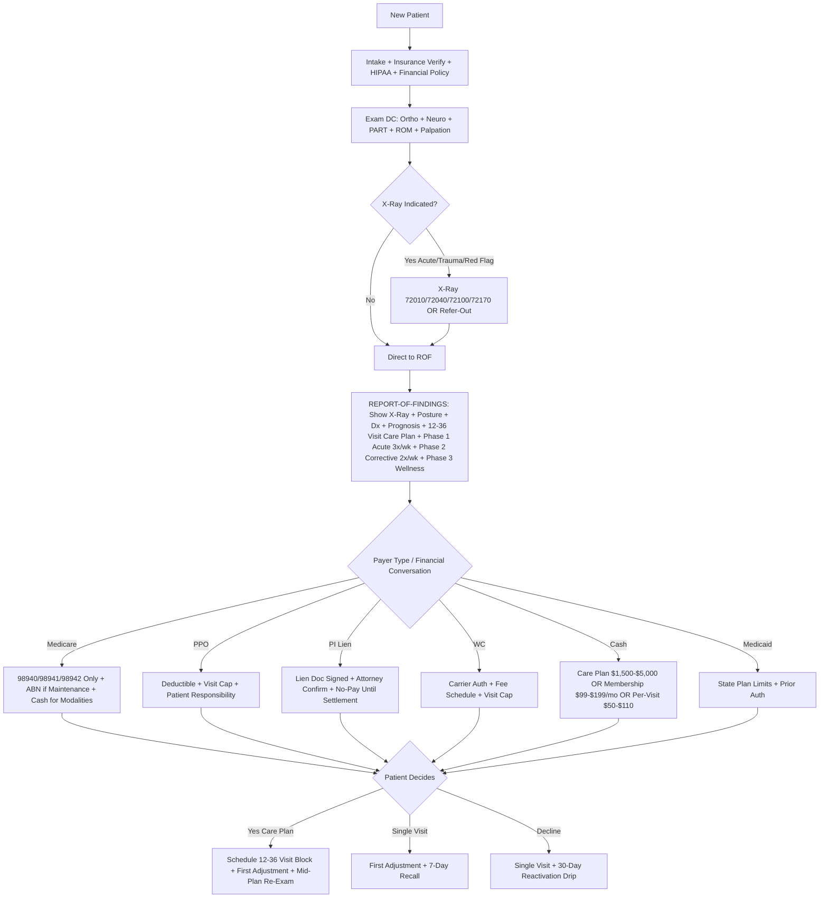
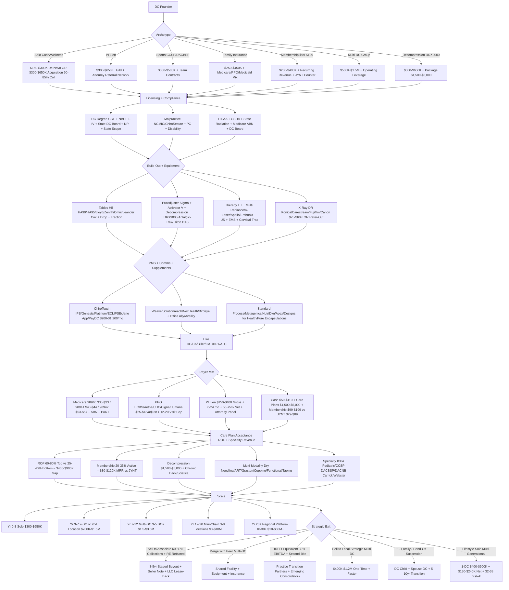

### Direct Answer

**Starting a [chiropractic practice](https://www.acatoday.org) in 2027 means launching a state-licensed musculoskeletal-and-neurological clinic — spinal manipulation (98940/98941/98942), extremity adjusting, therapeutic modalities (ultrasound, EMS, traction, decompression, LLLT), corrective rehab, and ancillaries — built as one of seven archetypes (solo cash/wellness, PI lien, sports/post-surgical CCSP/DACBSP, family insurance, $99-$199/mo own-brand membership, multi-DC group, or DRX9000 decompression niche). Capital: $150-$450K solo de novo, $300-$650K decompression fit-out, or $300-$800K acquisition at 60-85% of trailing collections, financed by [Live Oak Bank Chiropractic Lending](https://www.liveoakbank.com), [Bank of America Practice Solutions](https://www.bankofamerica.com/smallbusiness/business-financing/practice-solutions), [First Citizens Practice Solutions](https://www.firstcitizens.com), [Provide.com](https://www.provide.com), or [NCMIC Finance](https://www.ncmic.com). Owners hold a DC degree from one of ~17 [CCE](https://www.cce-usa.org)-accredited schools ([Palmer](https://www.palmer.edu), [Logan](https://www.logan.edu), [Life](https://www.life.edu), [Sherman](https://www.sherman.edu), [Parker](https://www.parker.edu), NUHS, Northwestern, [Texas Chiropractic](https://www.txchiro.edu), [Cleveland KC](https://www.cleveland.edu), [SCU](https://www.scuhs.edu), [UWS](https://www.uws.edu), [Keiser](https://www.keiseruniversity.edu), [NYCC/Northeast](https://www.nycc.edu), [D'Youville](https://www.dyc.edu)), pass [NBCE](https://www.nbce.org) Parts I-IV, and clear state DC board + scope (acupuncture/PT/X-ray varies). Avg solo gross $350-$550K and owner net $98-$160K per the [ACA Salary & Expense Survey 2024](https://www.acatoday.org); top quartile $220-$420K. The trifecta that decides the outcome is NOT capital — it is (1) [Report-of-Findings](https://www.patientmedia.com) care-plan acceptance (60-80% top vs 25-40% bottom), (2) Medicare 98940/98941/98942 RVU compression + ABN compliance per [CMS Physician Fee Schedule](https://www.cms.gov/medicare/payment/fee-schedules/physician) + [OIG](https://oig.hhs.gov) audit defense, and (3) positioning against [The Joint Chiropractic NASDAQ:JYNT](https://www.thejoint.com) (~1,000 locations, Peter Holt CEO, $29-$89/mo membership) plus [ChiroOne / Tilden Wellness](https://www.chiroonewellness.com) (~150) and Hand & Stone Chiropractic via PI lien, [DRX9000](https://www.excitemedical.com) decompression, multi-modality stacking, specialty creds (ICPA Webster, CCSP/DACBSP, DACNB Carrick), and own-brand $99-$199/mo membership.**

## Foundations — Market, Archetypes, Licensure

### 1. The $20B+ US chiropractic landscape and the 2027 macro

US chiropractic generates **~$20B+ annual revenue** per [IBISWorld](https://www.ibisworld.com) and the [American Chiropractic Association](https://www.acatoday.org) across **~38K independent practice owners + ~1,000 [The Joint JYNT](https://www.thejoint.com) clinics + ~150 [ChiroOne / Tilden Wellness](https://www.chiroonewellness.com) + emerging Hand & Stone Chiropractic locations + ~70K active DCs** ([ACA](https://www.acatoday.org) + [NBCE](https://www.nbce.org) 2024). The defining 2024-2027 macro:

- **JYNT membership-model consolidation** — Peter Holt CEO, ~1,000 locations, $29-$89/mo unlimited or per-discounted adjustments, non-DC franchise-owner permitted, employed DCs at $75-$120K + production bonus
- **Medicare RVU real-dollar compression** on 98940/98941/98942 per [CMS Physician Fee Schedule](https://www.cms.gov/medicare/payment/fee-schedules/physician) — ~15-25% per decade per [F4CP](https://www.f4cp.org) analysis
- **PI lien attorney-gating tightening** in CA (2021-2024 cost-containment), FL (PIP $10K cap since 2012), and NY (no-fault scrutiny)
- **Demand floor** — **~25-28% of US adults** report low-back pain in any 3-month window per [NIH NCCIH](https://www.nccih.nih.gov); lifetime ~80%. Awareness 90%+ but utilization only **~10-12%** — market floor 2-3x current. The [American College of Physicians 2017 low-back-pain guideline](https://www.acponline.org) + [NIH HEAL Initiative](https://heal.nih.gov) endorsement of non-pharmacologic first-line drove PCP/PA-C/NP referrals up **+12-18% from 2018-2024**

> ### Quick Facts
> - **~$20B+** US chiropractic industry (IBISWorld + ACA 2024)
> - **~70K** active US DCs ([ACA](https://www.acatoday.org) + [NBCE](https://www.nbce.org))
> - **~38K** independent practice owners
> - **~75%** solo or 2-DC (trending corporate per [ACA](https://www.acatoday.org))
> - **$350-$550K** avg solo DC gross collections
> - **$98-$160K** owner-DC net (top quartile **$220-$420K**)
> - **The Joint JYNT ~1,000 locations** (Peter Holt CEO, $29-$89/mo membership)
> - **~1.1M Americans** receive chiropractic care monthly
> - **New-patient LTV $700-$2,400** (cash-relief $400-$700 → PI $1,500-$3,500)
> - **Avg cash-pay $50-$110/adjustment**, **PPO $25-$45**, **PI lien $150-$400 gross**

**JYNT threat math.** $29-$89/mo = **$360-$1,068/yr/patient** floor. Independent cash-pay $60-$80/adjustment × 1-2/mo = $720-$1,920/yr — but JYNT **locks in price expectations** + erodes cash-pay 30-50% in its 5-mile radius over 24-36 months. The independent counter is an **own-brand $99-$199/mo membership** with longer visits, multi-modality, decompression, and an exam-based intake (not walk-in).

**Debt-and-corporate-acceptance flywheel.** DC-school debt averages **$200K-$310K at graduation** per [ACA](https://www.acatoday.org) + [CCE](https://www.cce-usa.org). New grads accept [JYNT](https://www.thejoint.com) / [ChiroOne](https://www.chiroonewellness.com) / multi-DC group employment at **$75-$120K + bonus** because the cashflow services debt — expanding corporate share from negligible in 2010 to **~3-5% in 2024** and projected **~8-12% by 2030** in the cash market.

### 2. The seven archetypes — pick before the lease is signed

The single most consequential 2027 decision is **archetype selection** — it dictates capital intensity, payer mix, exit multiple, and lifestyle.

- **Solo cash/wellness DC** — 1 owner-DC + 1 CA + 1 part-time biller. **1-2 adjusting rooms, 1,200-1,800 sq ft, $300-$650K gross, 22-35% net = $98K-$200K**. Highest cash-pay mix (60-90%); most exposed to JYNT membership pressure. Top quartile $700K-$1.2M with strong membership + multi-modality.
- **PI lien practice** — 1-2 DCs + CA + biller + LMT. **2-4 adjusting rooms + therapy bay + X-ray, 1,800-3,000 sq ft, $500K-$1.5M gross, 18-32% net post-haircut**. Highest per-visit gross ($150-$400) but slow-pay 6-24 months + attorney-gated. Attorney referral relationships are everything.
- **Sports / post-surgical specialty** — 1-2 DCs (CCSP or DACBSP via [ACBSP](https://www.acbsp.com)) + ATC + LMT. **1-3 adjusting rooms + functional rehab + soft-tissue room, 1,500-2,800 sq ft, $400K-$900K, 28-40% net**. Team/college/club/pro contracts + post-surgical orthopedic referrals.
- **Family-practice insurance-heavy** — 1-2 DCs + 2 CAs + dedicated biller. **2-3 adjusting rooms + therapy + X-ray, 1,800-2,800 sq ft, $400K-$900K, 18-26% net**. Heavy Medicare + Medicaid + PPO. Most exposed to Medicare RVU compression.
- **Membership-model own-brand** — 1-2 DCs + 1-2 CAs. **2-3 adjusting rooms, 1,500-2,400 sq ft, $350K-$1.2M, 25-38% net**. Subscription $99-$199/mo. Positioned against [The Joint JYNT](https://www.thejoint.com) as "DC-owned, longer visits, exam-based, multi-modality."
- **Multi-DC group** — 2-5 DCs + 3-6 CAs + 1-2 LMTs + 1 DPT + 1 ATC + biller. **3-6 adjusting rooms + therapy + functional rehab + X-ray, 2,800-5,500 sq ft, $1M-$4M, 18-32%**. Operating leverage; common path to associate buyout or corporate roll-up.
- **Decompression + spinal-rehab niche** — 1-2 DCs + 1-2 CAs + LMT + rehab tech. **2-3 adjusting rooms + 1-2 decompression units + functional rehab, 1,800-3,000 sq ft, $500K-$1.2M, 25-40% net**. [DRX9000](https://www.excitemedical.com) / [Antalgic-Trak](https://www.antalgic-trak.com) / [Triton DTS](https://www.djoglobal.com) centerpiece + $1,500-$5,000 program packages cash-pay or PI/PPO mixed.

### 3. DC pathway, NBCE, state scope, and continuing education

**Clinical pathway.** ~3 yr undergraduate (90+ credits, sciences-heavy) + **DC degree** from one of ~17 [CCE](https://www.cce-usa.org)-accredited colleges — a 4-yr clinical doctorate covering anatomy, physiology, neurology, radiology, diagnosis, technique (Diversified, Gonstead, Activator, Thompson Drop, Logan Basic, Cox flexion-distraction, Pierce, NUCCA, Webster prenatal), nutrition, and rehab. Then [NBCE](https://www.nbce.org) Parts I/II/III/IV (+ Physiotherapy if the state requires) + state DC board license + jurisprudence + (state-dependent) acupuncture/PT modality/X-ray privileges.

- **The CCE-accredited US college list** — [Palmer Davenport](https://www.palmer.edu) (founding) + Palmer Florida + Palmer West + [Logan](https://www.logan.edu) + [Life](https://www.life.edu) + Life West + [Sherman](https://www.sherman.edu) + [Parker](https://www.parker.edu) + [NUHS](https://www.nuhs.edu) + [Northwestern](https://www.nwhealth.edu) + [Texas Chiropractic](https://www.txchiro.edu) + [Cleveland KC](https://www.cleveland.edu) + [SCU](https://www.scuhs.edu) + [UWS](https://www.uws.edu) + [Keiser](https://www.keiseruniversity.edu) + [NYCC / Northeast College](https://www.nycc.edu) + [D'Youville](https://www.dyc.edu)
- **State scope varies dramatically** — **OR, CO, IA, NM, MO, KS, AZ** permissive (nutrition + acupuncture cert + PT modalities + minor surgery in some). **NJ, NY, MI** restrictive on nutrition/PT outside narrow scope. **TX** permits needle EMG with cert. Most states grant X-ray ordering/taking/interpretation — check the state board publication before site selection; scope dictates revenue mix.
- **DEA registration optional** (DCs don't prescribe controlled substances). **NPI required** for any insurance billing. **Medicaid optional** — low reimbursement + heavy documentation.
- **Continuing Education** — state boards require **12-50 CE hrs/cycle (typically 12-24 hrs/yr)** with mandated topics (ethics, X-ray safety, opioids). Providers: [ACA](https://www.acatoday.org), [ICA](https://www.chiropractic.org), [F4CP](https://www.f4cp.org), state associations (CCA + FCA + NYSCA), [Parker Seminars](https://www.parkerseminars.com), NCMIC Speakers Bureau, Cleveland CE, Logan CE.

### 4. Chain consolidation and Medicare compression — the structural moats

- **[The Joint Chiropractic NASDAQ:JYNT](https://www.thejoint.com)** — ~1,000 clinics; Peter Holt CEO; **$29-$89/mo membership**; non-DC franchise-owner permitted; employed DCs at $75-$120K + production. Per JYNT 10-K filings, **~3% national market share targeting 5%+ by 2030**. Standard visit 6-10 min; most do not run X-ray on-site; no insurance billing; intake-only exam. Disruption pattern: enters market → 5-mile cash-pay erodes **30-50% over 24-36 months**.
- **[ChiroOne / Tilden Wellness](https://www.chiroonewellness.com)** — ~150 locations; corrective-care + decompression model + longer 24-36 visit care plans; insurance-friendly + PI-friendly.
- **Hand & Stone Chiropractic** — the established Hand & Stone Massage and Facial Spa franchise (~600 spa locations) added chiropractic to select sites.
- **Medicare RVU compression** — Medicare allows only **98940 (1-2 region adjustment, ~$30-$33), 98941 (3-4 region, ~$40-$44), 98942 (5-region, ~$53-$57)** for spinal manipulation per [CMS Physician Fee Schedule](https://www.cms.gov/medicare/payment/fee-schedules/physician). Real-dollar reimbursement has compressed **15-25% over the last decade** per [F4CP](https://www.f4cp.org). Medicare does NOT cover exam, X-ray, therapy modalities, or nutritional counseling under chiropractic provider type — only the adjustment when "active treatment" is documented. **ABN GA modifier required when adjustments aren't medically necessary** (maintenance/wellness). [OIG](https://oig.hhs.gov) audits flag routine 98942 5-region billing + missing ABN + lack of active-treatment-plan documentation. Heavy-Medicare practices net **18-25%**; PI/cash/membership-heavy **35-50%**.

## Build-Out and Capital

### 1. Site selection, real estate, and adjusting-room MEP

- **Demographic target** — **2-3 mile residential density 20K+ households + median HHI $55K+ + visible signage + 10-20 parking spots + co-tenant traffic** (grocery, pharmacy, gym, medical). Match the focus: PI practices near accident corridors + Spanish-language signage where relevant; sports practices near gyms/Crossfit/youth athletics; family/wellness near schools/young families; decompression near 35-65 demographic with chronic back pain.
- **AVOID heavy JYNT saturation** — if [The Joint](https://www.thejoint.com) sits within 3 miles, cash-pay erodes; either pick a different zip OR commit Day 1 to differentiation (PI + decompression + multi-modality + specialty + premium membership).
- **Adjusting room MEP** — DC build-out runs **$150-$300/sq ft TI** with medical-grade plumbing at the therapy bay + medical-grade electrical (X-ray suite 30A dedicated + decompression 20A) + HIPAA-compliant front office + ADA-accessible rooms + X-ray suite (lead-lined per state radiation safety + control booth + warning light) + therapy bay + waiting room + optional functional-rehab gym + optional supplement retail display.
- **Build-out timeline** runs **4-8 months** lease-to-first-patient: 30-60 day design + permitting (longer if X-ray suite requires state radiation health approval) + 60-90 day construction + 30 day equipment install + insurance credentialing + soft launch.
- **Lease vs buy** — Lease **$1,500-$4,000/mo per 1,000 sq ft** suburban, **$3,000-$7,500** metro. Many DC owners buy real estate via a separate LLC + lease to the PC for tax + appreciation + retirement income.

> ### Quick Facts — Capital tiers
> - **Solo cash/wellness startup**: $150-$300K (1,200-1,800 sq ft)
> - **Family/insurance 2-3 room**: $250-$450K (1,800-2,500 sq ft)
> - **PI + decompression fit-out**: $300-$650K (2,000-3,500 sq ft)
> - **Acquisition**: $300K-$800K at 60-85% trailing 12-mo collections
> - **TI build-out**: $150-$300/sq ft
> - **Adjustment table**: $4-$15K each (2-3 needed)
> - **Decompression unit**: $15-$45K ([DRX9000](https://www.excitemedical.com) / [Antalgic-Trak](https://www.antalgic-trak.com) / [Triton DTS](https://www.djoglobal.com))

### 2. Adjustment tables, drop tables, traction, and decompression

- **Adjustment tables — $4-$15K each new** — [Hill HA90 / HA95 Air-Flex](https://www.hilllabs.com) **$7-$15K** is the gold standard (electric elevation + drop sections + flexion-distraction option). [Lloyd Galaxy McManis](https://www.lloydtable.com) **$5-$12K** (electric, drop-piece). Lloyd 402 **$4-$8K** (basic stationary). [Zenith / Williams Medical](https://www.zenith-cox.com) **$4-$10K**. Omni / Atlas / Leander 950 **$6-$15K** (specialty Cox flexion-distraction). **Refurb $2-$7K saves 40-60%**.
- **Drop table — $3-$8K** dedicated drop-piece table (Thompson Drop technique). Williams Drop, Hill Drop, Zenith 460-440 common.
- **Intersegmental traction roller — $2-$5K** Williams / SpineX / Chattanooga — baseline therapy modality; 80%+ practices have one.
- **[ProAdjuster Sigma Instruments](https://www.sigmainstruments.com) — $5-$8K** Sigma ProAdjuster Genesis — low-force computerized adjusting (geriatric, pediatric, acute, needle-shy patients). Bills as adjustment per state scope.
- **Activator Methods — $300** Activator V handheld — low-force; common with ICPA pediatric scope.
- **Flexion-distraction table (Cox)** — included in some Hill/Leander tables OR standalone Lloyd 402-FD **$5-$10K**. [Cox Technic Resource Center](https://www.coxtechnic.com) cert for disc + radiculopathy cases.
- **Decompression unit — the cash-pay package magnet — $15-$45K** — [DRX9000 (Excite Medical)](https://www.excitemedical.com) **$30-$45K** original brand, marketing-heavy. DRX9000C cervical **$25-$40K**. [Antalgic-Trak](https://www.antalgic-trak.com) **$20-$35K** spinal/cervical/extremity multi-axis. [Triton DTS (DJO Chattanooga)](https://www.djoglobal.com) **$15-$25K** entry-level. [Hill DT](https://www.hilllabs.com) **$18-$28K**. [SpineMED](https://www.spinemed.com) **$20-$32K**. Programs typical **$1,500-$5,000 for 20-30 sessions** cash-pay or PI/PPO mixed; **ROI 6-18 months** at 1-2 enrollments/mo.

### 3. Therapy bay — laser, ultrasound, EMS, cervical-trac

- **Low-Level Laser Therapy (LLLT) / cold laser — $4-$12K** — [Multi Radiance MR4](https://www.multiradiance.com) **$5-$10K**. K-Laser Cube **$8-$15K** Class IV. Apollo Class IV **$6-$12K**. Erchonia FX-405 **$7-$14K** FDA-cleared. [LightForce Pro](https://www.djoglobal.com) **$8-$14K**. Bills as **97026 infrared light** (low reimbursement OR cash $30-$60/session OR bundled).
- **Ultrasound — $1-$3K** [Mettler Sonicator](https://www.mettlerelectronics.com) / Chattanooga Intelect Mobile / Dynatron 25. Bills **97035 ultrasound therapy ($10-$18/unit Medicare/PPO)**.
- **EMS / Interferential / NMES — $1-$3K** [Chattanooga Intelect Mobile Combo](https://www.djoglobal.com) / Mettler 240 / Dynatron Solaris. Bills **97014 unattended** or **97032 attended e-stim** ($12-$22).
- **Cervical traction — $400-$1.5K** Saunders Cervical Traction $400-$700; Chattanooga Intelect TX Traction $1.2-$1.5K; ComforTrac $600-$800. In-office + home-unit dispense $200-$400 cash retail.
- **Vibration plate** — $2-$8K Power Plate / Hypervibe / Vibe Plate — recovery, balance, neuro rehab adjunct.

### 4. X-ray decision — digital DR vs CR vs analog vs refer-out

- **Digital DR sensor (direct) — $25-$60K** — [Konica Minolta AeroDR](https://www.konicaminolta.com/medical), Carestream DRX-Revolution, Fujifilm FDR D-EVO II, Canon CXDI, Sound-Eklin. Highest-quality, fastest workflow, no chemicals. AI-augmented analysis emerging via [PostureRay](https://www.postureray.com) and Chiro Imaging Plus. Drives **72010 spine series ($45-$65)**, 72040 cervical ($30-$45), 72100 lumbar ($35-$55), 72170 pelvis ($30-$45) billing.
- **Digital CR (cassette + reader) — $15-$30K** — Konica CR + cassettes. Cheaper; phasing out 2025+ in favor of DR.
- **Analog film — $5-$12K** — chemical processing, slower, lower quality, harder to share. Most new practices skip.
- **Refer-out to imaging center — $0 capital + $0 monthly** but lose **$150-$350/new-patient X-ray revenue** + lose same-day diagnostic workflow + Report-of-Findings is delayed. Pros: skip lead-lining + state radiation safety + tech wages. Cons: care-plan acceptance drops 10-20% without same-day films during ROF.
- **The X-ray decision is the single most expensive build-out choice.** Heavy-PI + decompression + insurance-heavy practices typically install DR ($25-$60K) for full reimbursement + ROF workflow. Pure cash/wellness + sports/membership often refer-out and save $25-$60K + $5-$8K state radiation compliance + $3-$5K/yr maintenance.

### 5. PMS, EHR, billing, clearinghouse, communications

- **Practice Management Software — $200-$1,200/mo** — [ChiroTouch (IPS)](https://www.chirotouch.com) (legacy + cloud; largest installed base **~20K+ practices**); [Genesis Chiropractic Software](https://www.genesischiropracticsoftware.com) (cloud-native, fastest-growing independent); [Platinum System](https://www.platinumsystem.com) (cloud, modern UI); [ECLIPSE Practice Management](https://www.eclipsepractice.com) (legacy desktop); [Jane App](https://www.jane.app) (cloud, multi-discipline chiro+PT+massage+acupuncture); [PayDC](https://www.paydc.com) (cloud, ABN compliance focus); ChiroSpring; ChiroFusion; Atlas / Vagaro / Mindbody (membership + scheduling adjuncts).
- **Posture analysis** — [PostureScreen Mobile (PostureCo)](https://www.posturescreen.com) **$30-$80/mo** iPad/iPhone posture analysis + reports. **CBP (Corrective Biomechanics of the Spine)** software for spinal-rehab + correction-focused.
- **Billing / clearinghouse** — [Office Ally](https://www.officeally.com) (free clearinghouse + low-cost PMS), [Availity](https://www.availity.com) (BCBS-heavy), [ChangeHealthcare / Optum](https://www.changehealthcare.com) (legacy), Trizetto / CMS-1500 alternatives. [ChiroTouch](https://www.chirotouch.com), Genesis, Platinum integrate directly.
- **Patient communications + recall** — [Weave](https://www.getweave.com) (PMS-integrated text + voice + reviews + payments — fastest-growing chiro), [Solutionreach](https://www.solutionreach.com), [NexHealth](https://www.nexhealth.com), Doctible, [Birdeye](https://birdeye.com) (reviews-focused).
- **Patient education library** — [Patient Media (Bill Esteb)](https://www.patientmedia.com) "The Chiropractic Hour" video library + [Renaissance Chiropractic](https://www.renaissance-mgt.com) + Strategies for Success (Joel Bohling).

### 6. SBA + chiropractic-specific financing

Chiropractic has built a **dedicated specialty-finance ecosystem — second tier behind dental and eyecare** — low historical default rate (~2-4%).

- **Typical solo de novo 2026** — lease $0 + TI $200-$450K + tables (2-3) $12-$30K + therapy modalities $8-$25K + traction/decompression optional $15-$45K + X-ray optional DR $25-$60K + PMS/IT/signage $15-$30K + working capital $40-$120K = **$150-$450K solo de novo**, **$300-$650K decompression fit-out**, or **$300-$800K acquisition**.
- **Acquisition financing** — $200K-$650K (60-85% trailing collections) + 10-20% down + SBA 7(a) 75-90% + seller note 5-15% at 6-8% over 5-7 yr + working capital reserve $30-$80K.
- **Chiropractic-specific lenders** — [Live Oak Bank Chiropractic Lending](https://www.liveoakbank.com) (top SBA chiro lender), [Bank of America Practice Solutions](https://www.bankofamerica.com/smallbusiness/business-financing/practice-solutions) (largest non-SBA practice financier), [First Citizens Practice Solutions](https://www.firstcitizens.com) (formerly Square 1; strong chiro book), [Provide.com](https://www.provide.com) (formerly Lendeavor; expanded to chiropractic 2022), Huntington Practice Finance, US Bank Practice Finance, TD Bank Healthcare. Equipment leasing: [NCMIC Finance](https://www.ncmic.com) (chiropractic-mutual-owned), [Hill Labs](https://www.hilllabs.com) Financing, [DJO/Chattanooga](https://www.djoglobal.com) Financial, Western Equipment Finance.

## Operations — Hiring, Payer Mix, Care Plans, Compliance

### 1. Hiring the team (DC, CA, biller, LMT, DPT, ATC, rehab tech)

- **Associate DC** — **$65-$110K starting** new-grad; **$95-$160K experienced 5+ yr + production bonus** (25-35% of personal collections above base). Highest-paying associate roles: PI-heavy multi-DC group $110-$170K + bonus; sports/specialty groups $95-$140K + team-contract distribution.
- **Chiropractic Assistant (CA)** — **$15-$22/hr** (no formal cert required in most states; some states require CA registration). Trained on insurance verification + phone scheduling + intake forms + room turnover + modality setup (ultrasound, EMS, traction, laser, decompression) + Report-of-Findings prep + financial-conversation handoff + recall. **The most important non-DC role** — 60-80% of operational throughput.
- **Biller / billing manager** — **$20-$32/hr** in-house OR **outsourced 5-8% of net** to [ChiroBackOffice](https://www.chirobackoffice.com), Outsource Strategies International (OSI), Aspen Practice Network, [Cash Practice Systems](https://www.cashpractice.com), The Hub Chiropractic Billing. Outsourced better for solo/family; in-house better for multi-DC + heavy PI.
- **Licensed Massage Therapist (LMT)** — **$18-$30/hr OR commission 40-55%** of LMT collections. Adjunct revenue + multi-modality stack + retention driver. Most states require LMT licensure.
- **Doctor of Physical Therapy (DPT)** — **$65-$95K** in DC-owned multi-discipline practice OR contract. Enables wider scope billing + cross-referral. Common in sports/post-surgical specialty + PI.
- **Athletic Trainer (ATC)** — **$45-$65K** in sports specialty practices for performance + injury prevention + team-contract execution.
- **Rehab tech / exercise physiologist** — **$15-$24/hr** for functional rehab + corrective-exercise + decompression-session supervision.

### 2. Insurance landscape and payer mix decision

The single most consequential financial decision is **payer mix** — which payers to credential with, which to drop, how aggressively to pursue PI / cash / membership.

- **Medicare** (~30% of US 65+ adults seek chiropractic per [CMS](https://www.cms.gov)) — credential as chiropractic provider type (33). Bills ONLY 98940/98941/98942; NO E&M, NO X-ray, NO therapy modalities, NO maintenance. Allowed **98940 ~$30-$33, 98941 ~$40-$44, 98942 ~$53-$57** (2024 CMS Physician Fee Schedule). **ABN GA modifier required when not active-treatment**. PART exam (Pain, Asymmetry, Range-of-motion, Tone) + acute/chronic + measurable functional outcomes + plan documented. [OIG](https://oig.hhs.gov) audits flag routine 98942 + maintenance-as-active + missing ABN.
- **Medicaid** — coverage varies wildly by state. TX, OH, IL, NY cover with limits. CA Medi-Cal coverage restored 2022. Most states cover 12-30 visits/yr + prior auth. Low reimbursement ($15-$30/visit) + heavy documentation.
- **PPO / commercial** — BCBS / [Aetna](https://www.aetna.com) / [UHC](https://www.uhc.com) / [Cigna](https://www.cigna.com) / [Humana](https://www.humana.com) with **chiropractic riders** typically **$25-$45 per adjustment after deductible**, often 12-20 visit annual max + medical-necessity documentation. Heavy-PPO practices net **22-30%**.
- **Personal Injury (PI) lien** — **highest gross per visit $150-$400** (cervical adjust $80-$150 + lumbar $80-$150 + therapy $40-$100 + X-ray $200-$400) but **slow-pay or no-pay 6-24 months**. DC takes lien against the patient's eventual settlement. Net collect typically **55-75% of gross** after attorney negotiation + lien-buyer haircut + write-offs. Heavy-PI practices net **18-32%**. **CA tightened PI 2021-2024**, **FL PIP $10K cap** unchanged since 2012, **NY no-fault scrutiny** ongoing. Attorney referral relationships = the entire game.
- **Workers' compensation** — state fee schedules + WC carrier credentialing + utilization review. **CA WC, TX WC, NY WC** are the largest markets; fees 50-90% of usual + visit caps + treatment authorization required.
- **Cash-pay / self-pay** — avg **$50-$110/adjustment** regional + market + positioning. Membership $99-$199/mo unlimited or discounted. Care-plan packages $1,200-$3,600 for 12-36 visits prepaid + 5-15% discount. **[The Joint JYNT](https://www.thejoint.com) $29-$89/mo** is the cash-pay benchmark independents counter against.
- **Care plans** — typical **12-36 visits over 6-12 weeks** (acute 3×/wk → corrective 2×/wk → wellness 1×/wk or 2×/mo). Packaged **$1,500-$5,000** depending on visit count + therapies + decompression + modalities. Ongoing wellness **$99-$199/mo membership** post-acute.

### 3. Report-of-Findings — the case acceptance engine

**Care-plan acceptance is the entire game.** New patient finishes exam + X-ray; DC has 15-25 min in Report-of-Findings (ROF) to convert a single-visit relief seeker into a 12-36 visit committed patient. **Top closes 60-80%; bottom 25-40%.** The 30-40 point gap = the difference between a $400K and a $900K practice on the same DC-hours.

> ### Key Stat
> Per [ACA](https://www.acatoday.org) Practice Survey + [Parker University](https://www.parker.edu) benchmarks + [F4CP](https://www.f4cp.org) studies, **top decile DCs convert 65-80% of new patients to 12+ visit care plans** vs **bottom quartile 25-35%**. The gap is driven by ROF structure: **(1)** show X-ray + posture analysis visually + plain-language explanation of subluxation/biomechanics/neurology, **(2)** connect findings to the patient's specific functional complaint + lifestyle goal, **(3)** lay out the 3-phase care plan (acute → corrective → wellness), **(4)** set expectations on visit frequency + timeline + outcome milestones, **(5)** hand off to the CA for financial conversation + plan selection + payment + scheduling. Bottom DCs adjust and say "come back if it hurts" — a relief-only model that never builds a practice.

### 4. Membership model build-out vs The Joint JYNT

**The Joint JYNT model**: $29 intro → $29-$89/mo unlimited OR 4-pack/8-pack discounted. No insurance, no exam beyond intake, 6-10 min visits, walk-in. Independent counter — own-brand tiers:

- **Basic $99-$129/mo** — 2 adjustments + 1 modality + 10% supplement
- **Premium $149-$179/mo** — 4 adjustments + unlimited modalities + 15% supplement + 10% decompression
- **Family $199-$249/mo** — 8 adjustments family-shared + modalities + supplements
- **Decompression $299-$399/mo** — 8 sessions + adjustments + therapy + posture review

Positioning vs JYNT: **"DC-owned. 20-30 min visits. Exam-based. Multi-modality. Decompression included. Same DC every visit."** Retention 70-85%/yr (vs JYNT churn 15-25%/yr). Target: **20-35% of active patient base** = **$30-$120K MRR**.

### 5. Multi-modality stack, nutrition retail, and compliance

The 2027 surviving independent stacks complementary modalities to lift per-visit value + retention + cash-pay. Per [ChiroEco](https://www.chiroeco.com) and Practice Insights / IDOC-equivalent benchmarks, top practices add **$15-$60/visit lift** via modality stacking:

- **Dry needling** $40-$80 (cert required by state — DC vs PT scope contested in some states)
- **Active Release Technique (ART)** $40-$90 (Dr. Mike Leahy cert)
- **[Graston Technique](https://www.grastontechnique.com)** instrument-assisted soft-tissue $40-$80
- **Cupping** $30-$60 (low-cost add-on)
- **Functional rehab + corrective exercise** $40-$80 (DC, DPT, or trained tech)
- **[RockTape](https://www.rocktape.com) / KT Tape kinesiology taping** $15-$30
- **Nutrition counseling** $75-$150 (state scope-dependent)
- **Class IV laser** $30-$60 (or bundled in package)

Nutrition supplement retail. [Standard Process](https://www.standardprocess.com) (Wisconsin, family-owned, whole-food, DC-exclusive distribution); [Metagenics](https://www.metagenics.com) (functional medicine line); NutriDyn (DC-focused); Apex Energetics; [Designs for Health](https://www.designsforhealth.com); [Pure Encapsulations](https://www.pureencapsulations.com). Retail markup typically **2-3× wholesale**. Well-run practices generate **3-7% of net** from supplement retail. Compliance — state scope-of-practice on nutrition counseling + recommendation + sales varies (NJ + NY restrictive vs CO + OR + IA permissive).

> ### Warning
> **Medicare ABN paperwork failure + missing maintenance documentation + routine 98942 over-coding = [OIG](https://oig.hhs.gov) audit + recoupment. PI lien without signed lien doc = no-pay collection. State radiation safety violation = fine + facility shutdown.**

Compliance checklist — **[HIPAA + HITECH](https://www.hhs.gov/ocr)** (annual Risk Assessment, BAAs with every vendor — PMS, billing, IT, texting — encrypted email/storage, 60-day breach notification; civil penalty **$100-$50K per record** capped $1.5M/yr per category); **[OSHA Bloodborne Pathogens 29 CFR 1910.1030](https://www.osha.gov/bloodborne-pathogens)** (disinfection of tables + traction equipment + after dry needling + radiation safety; annual training + sharps log if dry needling); **state radiation safety** (lead-lined X-ray suite + control booth + warning light + annual machine inspection + tech registry + dose-tracking + state radiation health certificate; violation = $500-$10K + facility shutdown); **[Medicare ABN compliance](https://www.cms.gov)** (GA modifier when ABN signed for non-covered service expected; GZ when no ABN, not expected to be covered; active-treatment plan documentation + measurable functional outcomes + PART exam); **state DC board** (standard-of-care, missed fracture / cauda equina / stroke, billing fraud, scope violations, advertising claims, CE current); **[OIG](https://oig.hhs.gov) Medicare audit risk areas** (routine 98942 5-region without 5-region documentation, maintenance-as-active without ABN, missing PART exam, lack of measurable outcomes, missing treatment plan, billing during pre-payment / non-covered periods).

## Growth, Exit, and the Independent Moats

### 1. Marketing realities — GBP, attorney panels, MD referrals, screenings

Dominant 2027 acquisition channels: **[Google Business Profile](https://business.google.com) + Google Reviews + Google Search + Facebook for decompression/PI/chronic-pain + community spinal screenings + attorney referral relationships (PI) + PCP/PA-C/NP referrals (acute back/neck/headache) + corporate health fairs**.

- **Google Reviews + GBP dominance** — goal **4.7+ stars × 100+ Google reviews**. Asked at checkout via [Weave](https://www.getweave.com) / [Solutionreach](https://www.solutionreach.com) / [NexHealth](https://www.nexhealth.com) / [Birdeye](https://birdeye.com). Negative response within 24 hrs, no PHI disclosure. **Single highest-ROI marketing investment.**
- **Facebook + Meta ads for decompression / sciatica / low-back** — lead-magnet: "Free Decompression Consultation + Posture Analysis." CAC **$80-$200/lead, $300-$700/converted patient**, LTV $1,500-$4,500 (decompression package).
- **Spinal screenings at corporate health fairs + Crossfit / running clubs / yoga studios** — free posture scan + spinal screening + lead capture; yields **5-15 new patients/event**. [F4CP](https://www.f4cp.org) + [Parker Seminars](https://www.parkerseminars.com) provide screening kits/templates.
- **Attorney referral relationships (PI)** — THE entire PI engine. Built through CLE presentations to plaintiff PI bar associations + golf outings + steady-state communication + clean lien-collection track record + cooperation on IME defense. A single attorney can drive **30-80% of PI volume**. CATASTROPHIC if relationship ends — diversify across **3-7 attorney referrers minimum**.
- **PCP / PA-C / NP referrals** — slow-build over 12-36 months. MD referrals trigger when (a) low-back/neck pain isn't responding to PT + medication, (b) acute injury without surgical indication, (c) chronic headache, (d) opioid-avoidance per [ACP guideline](https://www.acponline.org). Build via reciprocal communication letters + shared ROF + integrated record + lunch presentations.
- **TikTok DC adjustment-crack content (controversial)** — pro: massive reach + brand awareness + young patient acquisition. Con: state board scrutiny on misleading claims + technique demonstration without indication + risk content creating unrealistic expectations.
- **Patient referrals** = **#1 mature channel — 35-50% of new-patient volume**. Refer-a-friend $25 supplement credit + experience excellence + automated review request.

### 2. Specialty niches that scale revenue

> ### Key Stat
> Per [Parker Seminars](https://www.parkerseminars.com), [ICPA](https://www.icpa4kids.com), [ACBSP](https://www.acbsp.com), and Practice Insights data, **specialty-certified DCs out-earn general-practice peers by 25-60%** via higher per-patient LTV + insurance/PI premium rates + niche marketing efficiency + referral concentration.

- **Pediatric chiropractic (Webster + DACCP)** — [International Chiropractic Pediatric Association (ICPA)](https://www.icpa4kids.com) + **DACCP (Diplomate of American Chiropractic Pediatric Boards)** + **Webster Technique cert** for prenatal in-utero positioning. Pediatric LTV $400-$1,200/yr/child + family-stickiness driver + parent network effect. **~$1,500-$3,000 ICPA cert investment.**
- **Sports chiropractic (CCSP + DACBSP)** — [CCSP](https://www.acbsp.com) (Certified Chiropractic Sports Physician) 100-hr postgrad + **DACBSP** 300-hr advanced. High school / college / club / pro team contracts **$5K-$50K/yr per contract** + cash-pay active-population base + post-surgical orthopedic referrals.
- **Decompression-focused practice** — [DRX9000](https://www.excitemedical.com) / [Antalgic-Trak](https://www.antalgic-trak.com) / [Triton DTS](https://www.djoglobal.com) centerpiece + program packages **$1,500-$5,000** + heavy Facebook marketing + chronic-back/sciatica/herniated-disc demographic.
- **Chiropractic neurology (DACNB)** — [American Chiropractic Neurology Board (ACNB)](https://www.acnb.org) + [Carrick Institute](https://carrickinstitute.com) training. Post-concussion management + vestibular rehab + functional neurology + TBI. Packages **$1,500-$4,500**.
- **Prenatal chiropractic (Webster + DACCP)** — OB/midwife referrals + pre-pregnancy + 3rd-trimester optimal-positioning. $400-$1,200/pregnancy LTV + family conversion.
- **Functional medicine + nutrition (state scope-permitted)** — lab testing + supplement programs + chronic-illness management. Higher ticket per patient ($1,200-$4,500/program) but state scope-dependent + heavy documentation.
- **Golf / runner / triathlete niche** — demographic-specific marketing + biomechanical analysis + cash-pay performance focus + premium pricing.

### 3. Scale model — solo to multi-DC to mini-chain

Yr 0-3 solo $300K-$650K 22-35% net → Yr 3-7 2-DC associate or 2nd location $700K-$1.5M 20-30% → Yr 7-12 multi-DC group 3-5 DCs $1.5-$3.5M 18-28% → Yr 12-20 mini-chain 3-8 locations $3-$10M 15-22% → Yr 20+ regional platform 10-30+ locations $10M-$50M+.

The **second-location decision** triggers at **80%+ chair-time + strong associate-DC ready as managing doctor** OR an attractive adjacent acquisition (often $300K-$650K at 60-75% collections). Stage 1→2 stall is solved by a **clear associate-to-partner pathway** + 3-5 yr equity vesting + management training.

### 4. IDSO-equivalent + corporate roll-up multiples

> ### Key Stat
> Per [Practice Transition Partners](https://www.practicetransitionpartners.com) + [IBISWorld](https://www.ibisworld.com) Chiropractors 2024, **chiropractic IDSO-equivalent partial-recap multiples run 3-5× EBITDA for $150-$500K EBITDA practices**, **4-6× for $500K-$1M EBITDA multi-DC groups**, **5-7× for $1M+ EBITDA platforms**. Owner sells **60-80% equity** + retains 20-40% **rolled into platform equity** + **second-bite at next recap in 3-7 yrs** typically returns **2-3× on retained**. The chiropractic IDSO market is **less mature than dental DSO or eyecare IDSO** — thinner buyer pool + lower multiples — but accelerating 2024-2027 as PE recognizes recurring-revenue + membership models.

- **[The Joint Chiropractic NASDAQ:JYNT](https://www.thejoint.com)** — franchise + corporate; membership cash; ~1,000 locations
- **[ChiroOne / Tilden Wellness](https://www.chiroonewellness.com)** — corporate roll-up; corrective-care + decompression; ~150 locations
- **Hand & Stone Chiropractic** — franchise add-on; spa + chiropractic; growing
- **Emerging IDSO-equivalents** — PE roll-up of multi-DC groups; early-stage
- **Multi-DC regional groups** — local consolidation; region-specific

**Deal structure typical.** $700K collections + $180K EBITDA → 4× EBITDA = $720K EV + buyer takes 70% = $504K cash + owner retains 30% = $216K + 3-5 yr contract + clinical autonomy + branding initially preserved. At next recap (3-5 yr) platform sells at 6-8× EBITDA → retained worth $400K-$600K = 2-3× = total to owner **$900K-$1.1M** vs traditional sale 0.65-0.85× collections = $455K-$595K one-time.

Best chiropractic M&A advisory: [Practice Transition Partners](https://www.practicetransitionpartners.com), Strategic Chiropractor, ChiroSale, Premier Practice Consultants, Strategic Practice Solutions. Traditional broker timeline 6-18 months.

### 5. Six exit paths the owner should pick on Day 1

- **(1) Sell to associate at 60-80% of collections** — most common DC exit. Often 3-5 yr staged buyout (associate buys 20-30% yr 1, 30-40% yr 3, balance yr 5). Seller financing 5-15% at 6-8% common. Real estate retained in a separate LLC + leased back = appreciation + retirement income.
- **(2) Merge with multi-DC group** — two adjacent solo DCs combine into a 2-3 DC group sharing facility + equipment + insurance contracts + administrative leverage.
- **(3) Sell to corporate roll-up / IDSO-equivalent at 3-5× EBITDA** — emerging exit path. Sell 60-80% equity + retain 20-40% + clinical autonomy + 3-5 yr contract + second-bite at next recap. Best for DCs 5-15 yr from retirement seeking partial liquidity + reduced ops burden.
- **(4) Sell to local strategic multi-DC group** — $400K-$1.2M one-time. Faster, simpler than IDSO + less retained-equity complexity but no second-bite upside.
- **(5) Lifestyle solo / multi-generational independent** — stay 1-DC at $400K-$900K, take home $130-$240K, work 32-38 hr/wk. Dominant choice for **~40-55% of independent DCs** per [ACA](https://www.acatoday.org).
- **(6) Family / hand-off succession** — pass to DC child + spouse-DC + extended-family DC. Real estate retained, practice income transitioned over 5-10 yr.

### 6. The independent moats vs JYNT + ChiroOne + chains

[The Joint JYNT](https://www.thejoint.com) + [ChiroOne / Tilden Wellness](https://www.chiroonewellness.com) + Hand & Stone Chiropractic compete on **price + walk-in convenience + brand recognition + scale buying + insurance-free simplicity**. Independents counter with **clinical depth + relationships + specialty**:

- **PI lien work** — JYNT/chains don't do PI (no exam, no X-ray, no lien negotiation, no attorney relationships); independents own this market
- **Decompression** — JYNT/chains don't invest $15-$45K in [DRX9000](https://www.excitemedical.com) / [Antalgic-Trak](https://www.antalgic-trak.com) / [Triton DTS](https://www.djoglobal.com) capital + $1,500-$5,000 program packages
- **Specialty creds** — pediatric/prenatal Webster ([ICPA](https://www.icpa4kids.com)), sports [CCSP/DACBSP](https://www.acbsp.com), neurology DACNB ([ACNB](https://www.acnb.org)), post-concussion
- **Multi-modality stack** — chiro + dry needling + ART + [Graston](https://www.grastontechnique.com) + cupping + functional rehab + nutrition
- **Premium relationship care** — 20-30 min visits + same-DC continuity + ROF + family-practice-style; JYNT runs 6-10 min walk-ins
- **Membership counter-positioning** — $99-$199/mo own-brand with DC ownership + exam-based + multi-modality vs JYNT $29-$89/mo

The 2027 surviving independent chiropractic practice is built deliberately for one of six end-states: **(a)** sale to associate 60-80% collections + real estate retention, **(b)** merge with adjacent multi-DC peer, **(c)** corporate roll-up / IDSO-equivalent 3-5× EBITDA + second-bite, **(d)** sale to local strategic multi-DC group, **(e)** family/hand-off succession, **(f)** lifestyle solo independent. **Drifting without exit clarity = under-valued or rushed sale at distressed multiples.**

## The Operating Journey — Cold Start to IDSO-Equivalent Exit

## Sources

1. **[American Chiropractic Association (ACA)](https://www.acatoday.org)** — Salary & Expense Survey 2024 + practice benchmarks.
2. **[International Chiropractors Association (ICA)](https://www.chiropractic.org)** — traditional principled chiropractic association.
3. **[NBCE (National Board of Chiropractic Examiners)](https://www.nbce.org)** — Parts I/II/III/IV + Job Analysis of Chiropractic.
4. **[CCE (Council on Chiropractic Education)](https://www.cce-usa.org)** — DC degree accreditation, ~17 US colleges.
5. **[F4CP (Foundation for Chiropractic Progress)](https://www.f4cp.org)** — opioid-alternative + cost-effectiveness research.
6. **[Palmer College of Chiropractic](https://www.palmer.edu)** — Davenport founding campus + Florida + West.
7. **[Logan University](https://www.logan.edu)** — St Louis, MO.
8. **[Life University + Life West](https://www.life.edu)** — Marietta, GA + Hayward, CA.
9. **[Sherman College of Chiropractic](https://www.sherman.edu)** — Spartanburg, SC.
10. **[Parker University + Parker Seminars CE](https://www.parker.edu)** — Dallas, TX.
11. **[National University of Health Sciences (NUHS)](https://www.nuhs.edu)** — Lombard, IL.
12. **[Northwestern Health Sciences University](https://www.nwhealth.edu)** — Bloomington, MN.
13. **[Texas Chiropractic College](https://www.txchiro.edu)** — Pasadena, TX.
14. **[Cleveland University Kansas City](https://www.cleveland.edu)**.
15. **[Southern California University of Health Sciences (SCU)](https://www.scuhs.edu)** — Whittier, CA.
16. **[University of Western States (UWS)](https://www.uws.edu)** — Portland, OR.
17. **[Keiser University College of Chiropractic Medicine](https://www.keiseruniversity.edu)** — W Palm Beach, FL.
18. **[Northeast College of Health Sciences (NYCC)](https://www.nycc.edu)** — Seneca Falls, NY.
19. **[D'Youville University](https://www.dyc.edu)** — Buffalo, NY.
20. **[The Joint Chiropractic NASDAQ:JYNT](https://www.thejoint.com)** — Peter Holt CEO + ~1,000 locations + $29-$89/mo membership + 10-K SEC filings.
21. **[ChiroOne Wellness Centers / Tilden Wellness](https://www.chiroonewellness.com)** — ~150 locations corrective-care + decompression.
22. **Hand & Stone Massage and Facial Spa** — parent franchise (~600 spa locations) adding chiropractic.
23. **[CMS Physician Fee Schedule](https://www.cms.gov/medicare/payment/fee-schedules/physician)** — 98940/98941/98942 chiropractic manipulation codes.
24. **[OIG (HHS Office of Inspector General)](https://oig.hhs.gov)** — chiropractic Medicare audit + maintenance recoupment reports.
25. **[BLS Occupational Outlook 2024 — Chiropractors](https://www.bls.gov/ooh/healthcare/chiropractors.htm)**.
26. **[IBISWorld — Chiropractors in the US](https://www.ibisworld.com)** — $20B+ market sizing.
27. **[NIH NCCIH](https://www.nccih.nih.gov)** — low-back pain prevalence + chiropractic evidence.
28. **[American College of Physicians 2017 Guideline](https://www.acponline.org)** — non-pharmacologic first-line for low-back pain.
29. **[NIH HEAL Initiative](https://heal.nih.gov)** — non-opioid pain management research.
30. **[ChiroEco (Chiropractic Economics)](https://www.chiroeco.com)** — trade publication + practice management.
31. **[Dynamic Chiropractic](https://www.dynamicchiropractic.com)** — trade + clinical publication.
32. **[Hill Laboratories](https://www.hilllabs.com)** — HA90 + HA95 Air-Flex tables + Hill DT decompression.
33. **[Lloyd Tables](https://www.lloydtable.com)** — Galaxy + McManis + 402 + 402-FD Cox flexion-distraction.
34. **[Zenith Chiropractic Tables](https://www.zenith-cox.com)** — 460 + 440 + drop tables.
35. **Williams Healthcare + Omni + Leander Health (950)** — drop + adjustment + Cox.
36. **[Sigma Instruments ProAdjuster Genesis](https://www.sigmainstruments.com) + Activator Methods** — low-force instruments.
37. **[Cox Technic Resource Center](https://www.coxtechnic.com)** — Cox flexion-distraction technique + seminars.
38. **[Excite Medical (DRX9000 + DRX9000C)](https://www.excitemedical.com)** — spinal decompression.
39. **[Antalgic-Trak](https://www.antalgic-trak.com)** — multi-axis spinal/cervical/extremity decompression.
40. **[DJO / Chattanooga (Enovis)](https://www.djoglobal.com)** — Triton DTS decompression + Intelect EMS + TX Traction + ultrasound + LightForce Pro.
41. **[SpineMED](https://www.spinemed.com)** — spinal decompression unit.
42. **[Multi Radiance Medical (MR4)](https://www.multiradiance.com) + K-Laser USA + Apollo + Erchonia + LightForce Pro** — LLLT / Class IV lasers.
43. **[Mettler Electronics](https://www.mettlerelectronics.com) (Sonicator/240) + Dynatron (25/Solaris)** — ultrasound + EMS.
44. **Saunders Cervical Traction (Empi/DJO) + ComforTrac** — cervical traction units.
45. **[Konica Minolta AeroDR](https://www.konicaminolta.com/medical) + Carestream DRX-Revolution + Fujifilm FDR D-EVO II + Canon CXDI + Sound-Eklin** — digital DR X-ray.
46. **[PostureRay](https://www.postureray.com) + Chiro Imaging Plus** — AI X-ray analysis + radiology reading.
47. **[Integrated Practice Solutions (IPS) ChiroTouch](https://www.chirotouch.com)** — largest installed-base chiro PMS (~20K+ practices).
48. **[Genesis Chiropractic Software](https://www.genesischiropracticsoftware.com) + Platinum System + ChiroSpring + ChiroFusion** — cloud chiro PMS.
49. **[ECLIPSE Practice Management Software](https://www.eclipsepractice.com)** — legacy desktop PMS.
50. **[Jane App](https://www.jane.app)** — cloud multi-discipline PMS.
51. **[PayDC Chiropractic Software](https://www.paydc.com)** — cloud PMS, ABN compliance focus.
52. **[PostureCo PostureScreen Mobile](https://www.posturescreen.com) + CBP NonProfit Ideal Spine** — posture + spinal-rehab software.
53. **[Patient Media (Bill Esteb)](https://www.patientmedia.com)** — "The Chiropractic Hour" patient education library.
54. **[Renaissance Chiropractic](https://www.renaissance-mgt.com) + Strategies for Success (Joel Bohling)** — practice mgmt + ROF training.
55. **[Office Ally](https://www.officeally.com) + [Availity](https://www.availity.com) + ChangeHealthcare/Optum** — clearinghouse + payer connectivity.
56. **[Weave](https://www.getweave.com) + [Solutionreach](https://www.solutionreach.com) + [NexHealth](https://www.nexhealth.com) + [Birdeye](https://birdeye.com) + Doctible** — patient comms + recall + reviews.
57. **[NCMIC Group](https://www.ncmic.com) + ChiroSecure** — chiropractic-mutual malpractice + equipment financing.
58. **[Standard Process](https://www.standardprocess.com) + [Metagenics](https://www.metagenics.com) + NutriDyn + Apex + [Designs for Health](https://www.designsforhealth.com) + [Pure Encapsulations](https://www.pureencapsulations.com)** — practitioner-channel supplements.
59. **[RockTape](https://www.rocktape.com) + KT Tape + [Graston Technique](https://www.grastontechnique.com) + Active Release (Dr. Mike Leahy)** — soft-tissue + taping certs.
60. **[ICPA — International Chiropractic Pediatric Association](https://www.icpa4kids.com)** — pediatric + Webster + DACCP prenatal.
61. **[American Chiropractic Board of Sports Physicians (ACBSP)](https://www.acbsp.com)** — CCSP + DACBSP sports certifications.
62. **[ACNB — American Chiropractic Neurology Board](https://www.acnb.org) + [Carrick Institute](https://carrickinstitute.com)** — DACNB + functional neurology + post-concussion.
63. **[Parker Seminars](https://www.parkerseminars.com)** — DC practice management + clinical + business CE.
64. **[Cash Practice Systems](https://www.cashpractice.com)** — cash-pay + membership program software + consulting.
65. **[ChiroBackOffice](https://www.chirobackoffice.com) + OSI + Aspen Practice Network** — billing outsource.
66. **[Practice Transition Partners](https://www.practicetransitionpartners.com) + Strategic Chiropractor + ChiroSale + Premier Practice Consultants** — chiropractic M&A advisory.
67. **[Live Oak Bank Chiropractic Lending](https://www.liveoakbank.com)** — top SBA chiropractic lender.
68. **[Bank of America Practice Solutions](https://www.bankofamerica.com/smallbusiness/business-financing/practice-solutions) + [First Citizens Practice Solutions](https://www.firstcitizens.com) + [Provide.com](https://www.provide.com) + Huntington Practice Finance** — chiropractic practice lenders.
69. **[HHS OCR — HIPAA Privacy + Security + Breach Notification](https://www.hhs.gov/ocr)**.
70. **[OSHA Bloodborne Pathogens 29 CFR 1910.1030](https://www.osha.gov/bloodborne-pathogens)**.

## Numbers and Benchmarks

### 1. Industry size and DC supply 2024-2026

| Metric | Value | Source |
|---|---|---|
| US chiropractic industry | ~$20B+ | [IBISWorld](https://www.ibisworld.com) + [ACA](https://www.acatoday.org) 2024 |
| Active US DCs | ~70K | [ACA](https://www.acatoday.org) + [NBCE](https://www.nbce.org) |
| Independent practice owners | ~38K | [ACA](https://www.acatoday.org) |
| Solo or 2-DC | ~75% trending down | [ACA](https://www.acatoday.org) |
| Avg solo gross | $350-$550K | [ACA](https://www.acatoday.org) 2024 |
| Owner net solo | $98-$160K (top $220-$420K) | [ACA](https://www.acatoday.org) |
| Low-back pain past 3 mo | ~25-28% | [NIH NCCIH](https://www.nccih.nih.gov) |
| US chiropractic utilization | ~10-12% | [NIH NCCIH](https://www.nccih.nih.gov) |
| New-patient LTV | $700-$2,400 | [ACA](https://www.acatoday.org) |
| Avg cash adjustment | $50-$110 | [ChiroEco](https://www.chiroeco.com) |
| Avg PPO adjustment | $25-$45 post-deductible | industry |
| Avg PI lien gross/visit | $150-$400 | industry |
| Medicare RVU compression | 15-25%/decade | [F4CP](https://www.f4cp.org) |

### 2. Insurance reimbursement by code 2024 (Medicare / PPO / Cash)

| Code | Description | Medicare | PPO | Cash UCR |
|---|---|---|---|---|
| 98940 | Manipulation 1-2 region | $30-$33 | $25-$40 | $50-$80 |
| 98941 | Manipulation 3-4 region | $40-$44 | $35-$50 | $60-$95 |
| 98942 | Manipulation 5-region | $53-$57 | $45-$65 | $75-$110 |
| 98943 | Extra-spinal manipulation | $20-$24 | $18-$30 | $40-$70 |
| 97014/97032 | E-stim unattended/attended | $12-$22 | $10-$25 | $25-$50 |
| 97035 | Ultrasound therapy | $10-$14 | $10-$18 | $25-$45 |
| 97012 | Mechanical traction | $14-$18 | $12-$22 | $30-$55 |
| 97026 | Infrared / low-level laser | $8-$14 | $10-$25 | $30-$60 |
| 97110/97530 | Therapeutic exercise / activities | $25-$36 | $22-$40 | $50-$90 |
| 97140 | Manual therapy | $25-$30 | $22-$35 | $50-$80 |
| 72010/72040 | Spine / cervical X-ray | $30-$65 | $28-$80 | $80-$250 |
| 72100/72170 | Lumbar / pelvis X-ray | $30-$55 | $28-$65 | $80-$180 |

### 3. PI lien gross-vs-net and collection timeline

| Stage | % of Gross | Cumulative Timeline |
|---|---|---|
| Service rendered at full lien rate | 100% | 0 |
| Attorney negotiation reduction | -10 to -25% | 6-12 mo |
| Lien-buyer discount (if sold) | -15 to -30% | 6-18 mo |
| Insurance / liability cap | -5 to -15% | 12-24 mo |
| Bad-debt (no settlement) | -5 to -15% | 18-36 mo |
| **Net collect realized** | **40-65%** | **6-24 mo avg** |

### 4. Equipment cost tier (basic / intermediate / decompression-fit-out)

| Equipment | Basic | Intermediate | Decompression-Fit |
|---|---|---|---|
| Adjustment table | $2-$4K refurb | $5-$8K Lloyd/Zenith | $7-$15K Hill HA90/HA95 |
| Drop table | $2-$4K refurb | $4-$6K Williams | $5-$8K Hill/Thompson |
| Intersegmental traction | $2-$3K | $3-$4K Williams/SpineX | $4-$5K Chattanooga |
| ProAdjuster + Activator | — | $5-$8K Sigma + $300 | $5-$8K + $300 |
| Decompression unit | — | — | $15-$45K DRX9000/Antalgic-Trak/Triton DTS |
| LLLT / cold laser | — | $4-$8K Multi Radiance | $8-$14K K-Laser/Apollo/Erchonia |
| Ultrasound + EMS | $2-$4K combined | $3-$6K Mettler/Chattanooga | $4-$6K |
| Cervical-trac | $400-$700 Saunders | $800-$1.2K | $1.2-$1.5K Chattanooga TX |
| Digital X-ray DR | — | $25-$40K | $40-$60K Konica/Carestream/Fujifilm |
| PMS license | $200-$400/mo | $500-$800/mo Genesis/Platinum | $800-$1,200/mo ChiroTouch/PayDC |
| Posture analysis | — | $30-$80/mo PostureScreen | $80-$150/mo + CBP |

### 5. Average DC income by setting (ACA Salary & Expense Survey 2024)

| Setting | Starting | Mid-career | Top decile |
|---|---|---|---|
| Solo independent owner | n/a | $130-$200K | $300K+ |
| Multi-DC group owner | n/a | $180-$320K | $450K+ |
| PI-heavy owner | n/a | $200-$420K | $550K+ |
| Decompression-focused owner | n/a | $180-$340K | $450K+ |
| [The Joint JYNT](https://www.thejoint.com) employed | $75-$100K | $90-$120K | $140K+ |
| [ChiroOne / Tilden](https://www.chiroonewellness.com) employed | $85-$110K | $100-$140K | $170K+ |
| Multi-DC group associate | $65-$95K | $90-$140K | $180K+ |
| Sports/specialty group | $75-$110K | $100-$160K | $200K+ |

### 6. Membership-model patient LTV vs traditional

| Patient Type | Visits/Yr | Annual Revenue | 3-Yr LTV |
|---|---|---|---|
| Cash relief-only | 2-4 | $120-$320 | $250-$700 |
| Insurance care-plan acute | 12-20 | $400-$1,100 | $900-$1,800 |
| Membership $99/mo Basic | 18-24 | $1,188 | $3,200-$3,500 |
| Membership $149/mo Premium | 24-36 | $1,788 | $5,000-$5,400 |
| Membership $199/mo Family | 36-60 shared | $2,388 | $6,500-$7,200 |
| Decompression program | 20-30 / 8-12 wks | $1,500-$5,000 | $1,800-$5,500 |
| PI lien single accident | 25-40 | $2,500-$8,000 net | episodic |

### 7. IDSO-equivalent vs traditional sale multiples 2024-2026

| Sale type | Profile | Multiple | Typical EV |
|---|---|---|---|
| Traditional solo | $300-$650K coll | 0.60-0.80× | $180-$520K |
| Premium solo (PI/decomp/membership) | $650K-$1.2M | 0.75-0.90× | $490K-$1.08M |
| Local multi-DC group strategic | $1-$3M | 0.85-1.05× | $850K-$3.15M |
| IDSO-equivalent small | $150-$500K EBITDA | 3-5× | $450K-$2.5M |
| IDSO-equivalent mid | $500K-$1M EBITDA | 4-6× | $2-$6M |
| IDSO-equivalent platform | $1M+ EBITDA | 5-7× | $5-$15M+ |

## Counter-Case — When a Chiropractic Practice Is a Bad Bet

A serious founder must stress-test against conditions that make 2027 chiropractic brutal:

### 1. JYNT saturation kills cash-pay volume
If [The Joint JYNT](https://www.thejoint.com) (or [ChiroOne](https://www.chiroonewellness.com) or Hand & Stone Chiropractic) sits within 3 miles, cash-pay erodes 30-50% over 24-36 months as patients accept the $29-$89/mo membership floor as the price benchmark. Scout zip-level JYNT density before signing the lease, OR commit Day 1 to differentiation (PI + decompression + multi-modality + premium membership + specialty).

### 2. Heavy Medicare without ABN discipline = recoupment audit
Medicare allows ONLY 98940/98941/98942 + requires ABN GA when not active-treatment + PART exam + active-treatment documentation. Bottom-quartile Medicare-heavy DCs routinely bill 98942 every visit, skip ABN, and document boilerplate maintenance = [OIG](https://oig.hhs.gov) audit + 3-5 yr recoupment + state board referral. Fix: cap Medicare 25-40% of mix + monthly internal audit + transition to PI/cash/membership.

### 3. Under-pricing care plans to win the close = margin death
Discounting care plans 40-60% to "commit the patient" destroys margin, sets expectations low, and erodes exit value. Hold full UCR + 5-15% prepay discount only + walk from price-shoppers + invest in ROF + financial-conversation training.

### 4. PI lien with a single attorney referrer = catastrophic dependency
A single attorney driving 30-80% of PI volume is catastrophic if the relationship ends. Diversify across **3-7 attorney referrers minimum** + steady CLE presentations + clean lien-collection track + cooperate on IME defense + monthly check-in cadence.

### 5. Over-billing 98942 = OIG audit trigger
[OIG](https://oig.hhs.gov) reports flag practices billing 98942 >70% of visits + lacking 5-region indication + missing PART exam = 100% recoupment of overcoded visits + statistical-sampling extrapolation + 3-5 yr lookback. Document regions adjusted + bill 98942 only when truly 5-region per CMS LCD.

### 6. Missing PI lien doc = no-pay collection
PI patient signs the care plan but never signs the lien — attorney has no obligation, uninsured patient has no contractual obligation, practice eats the bill. **PI lien signed at first visit** + verified attorney + verified case status + reasonable case-load limits per attorney.

### 7. Skipping X-ray + skipping ROF = case acceptance collapses 20-40%
Refer-out X-ray + verbal-only ROF loses 20-40 acceptance points vs DCs showing X-ray + posture + diagnosis + plan in structured ROF. Install DR X-ray $25-$60K + train scripted ROF + [PostureScreen](https://www.posturescreen.com) + financial conversation OR commit to a high-quality next-day ROF post-refer-out.

### 8. Multi-modality without scope verification = state board complaint
Adding dry needling, nutrition, acupuncture, or advanced modalities without verifying state DC scope + cert = cease-and-desist + fine. NJ/NY restrictive on nutrition/PT; TX needle EMG cert; state acupuncture rules vary. Read the state DC board scope publication BEFORE adding + get the cert + document.

### 9. Over-leveraging de novo = 12-24 mo cash burn
Cold-start $150-$450K capital + $20-$50K/mo overhead + 12-24 mo ramp = **$250K-$900K total cash before profitability**. Spousal bridge typical. Acquisition (0-4 mo ramp) preferable + SBA 7(a) $200K-$650K at 60-85% collections + reserve $30-$80K.

### 10. Drifting without exit clarity
50s-60s no plan = rushed 0.50-0.65× OR forced corporate uncompetitive multiple OR sold to the first [JYNT](https://www.thejoint.com)/Tilden/IDSO buyer at a distressed multiple. Plan 5-10 yr ahead: IDSO-equivalent 3-5× EBITDA + second-bite, OR multi-DC 4-6×, OR sale to associate 60-80% + real estate, OR family/hand-off, OR lifestyle solo.

**Honest verdict.** Viable IF you (a) commit to **ROF + care-plan acceptance as #1 priority Day 1** (60-80% target); (b) **manage Medicare 98940/98941/98942 with strict ABN + active-treatment discipline** + cap to 25-40% of mix; (c) **build PI lien correctly** — signed lien + diversified attorney panel + state compliance (CA/FL/NY); (d) **counter JYNT** if within 3 miles via differentiation Day 1 (PI + decompression + multi-modality + premium $99-$199/mo membership + specialty); (e) **install decompression if positioning** with $1,500-$5,000 programs + Facebook + chronic-back demographic; (f) maintain **HIPAA + OSHA + state radiation + DC board + Medicare ABN compliance**; (g) **track acceptance + payer mix + recall + production/DC-hour + membership MRR + PI net-collect %**; (h) plan exit early — [IDSO-equivalent 3-5×](https://www.practicetransitionpartners.com) OR multi-DC 4-6× OR associate buyout 60-80% OR family OR lifestyle solo; (i) **size working capital** for 12-24 mo de novo or 0-4 mo acquisition. Otherwise 2027 grinds toward [JYNT](https://www.thejoint.com) cash-pay compression + Medicare RVU compression + PI attorney-gating + 98942 audit risk + corporate consolidation.

## Related Pulse Entries

- [[q9684]] — How do you start an optometry practice in 2027?
- [[q9683]] — How do you start a dental practice in 2027?
- [[q9682]] — How do you start an auto repair shop in 2027?
- [[q9681]] — How do you start a real estate brokerage in 2027?
- [[q9680]] — How do you start a funeral home in 2027?
