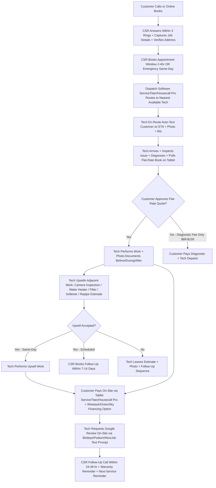
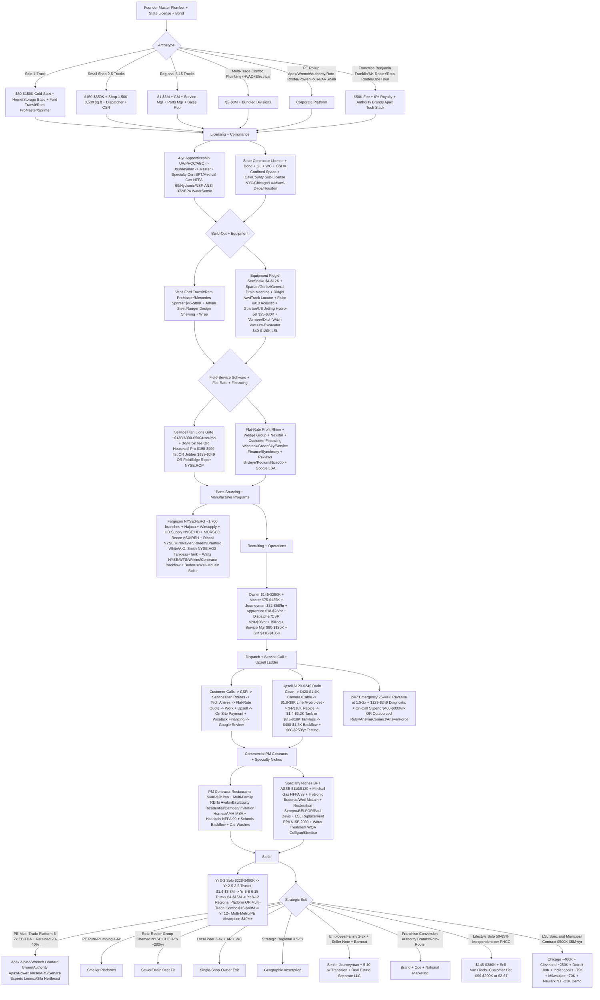

**TL;DR:** Starting a **plumbing business in 2027** (a.k.a. **plumbing contractor, residential + commercial plumbing shop**) -- a **state-licensed contractor (master plumber license + journeyman + apprentice team) providing residential + commercial service + new-construction + specialty work (sewer/drain, water heater, tankless, repipe, gas, backflow prevention BFT/BPT ASSE 5110/5130, medical gas NFPA 99, hydronic/boiler, hydro-jet, restoration 24/7 water damage, LSL lead service line replacement EPA $15B program) through dispatched Ford Transit/Ram ProMaster/Mercedes Sprinter service vans + flat-rate pricing book (Profit Rhino + Reliable Plumbing Solutions + The Wedge Group + Nexstar Network) + field-service software (ServiceTitan Ara Mahdessian+Vahe Kuzoyan KKR+Bain+TCV Lions Gate ~$13B $300-$500/user/mo + 3-5% transaction fee ~35-45% share OR Housecall Pro Roland Ligtenberg $199-$499/mo flat OR Jobber Sam Pillar Canadian $199-$349/mo OR FieldEdge dESCO/FieldRoutes Roper NYSE:ROP $200-$300/mo)** -- means choosing among **six models against PE-rollup competition (Apex Service Partners Alpine Investors HVAC+plumbing+electrical multi-trade bundler ~200+ acquisitions / Wrench Group Leonard Green PE / Authority Brands Apax Partners owns Benjamin Franklin Plumbing $50K+6% royalty + Mr. Rooter + One Hour Heating & Air / Roto-Rooter Group NYSE:CHE Chemed Tom Hutton ~200 plumbers/yr / ARS Rescue Rooter / Service Experts Lennox NYSE:LII / PowerHouse / Sila Heating & Air Northeast) plus boomer retirement wave (avg plumber age 47 BLS, 30%+ retire by 2030, ~50K unfilled jobs/yr, 18K independents for-sale at 3-5x EBITDA per BizBuySell) plus IIJA $1.2T + IRA $369B Section 50133 + EPA Lead and Copper Rule Revisions LCRR Oct 2024 + LCRI by 2027 = $15B federal money through 2030 for 10M+ US homes with lead service lines at $2,500-$8K/line federally reimbursed for plumbers with NSF/ANSI 372 + EPA WaterSense Partner + vacuum-excavator Vermeer/Ditch Witch/VacAll = sticky 5-10 yr municipal contracts (Chicago ~400K LSLs, Cleveland ~250K, Detroit ~80K, Indianapolis ~75K, Milwaukee ~70K, Newark NJ ~23K demo); requires state master license (TX/FL/CA/NY strict, GA/TN/IL/WA/OR moderate, NH/VT/ME light-touch + city/county sub-licenses) + 4-yr apprenticeship via UA/PHCC/ABC; equipment Ridgid Tool Emerson NYSE:EMR (SeeSnake camera $4-$12K, NaviTrack locator) + Milwaukee Tool Techtronic Industries HKG:0669 + Spartan/Gorlitz/General Pipe Cleaners drain machines + Fluke ii910 acoustic imager + Spartan/US Jetting hydro-jet $25-$80K; parts sourcing Ferguson NYSE:FERG Kevin Murphy ~1,700 branches $30B largest US plumbing wholesaler + Hajoca ~450 employee-owned + Winsupply ~600 + HD Supply NYSE:HD + MORSCO Reece ASX:REH; customer financing Wisetack Bobby Tzekin + GreenSky Sixth Street + Service Finance Truist + Synchrony Bank Project Loan; capital $80K-$350K cold-start + $400K-$2M acquisition + SBA 7(a) via Live Oak Bank Trades Lending + First Citizens + BMO + Pawnee Leasing equipment + Federated Insurance trades-specialty $8-$18K/yr/van** -- operating against **$128B+ US plumbing services industry (IBISWorld + PHCC 2024) + ~480K licensed plumbers (BLS SOC 47-2152) + ~50K unfilled jobs/yr + ~38K shops + 6-9% YoY growth + 4-6 calls/day/truck mature + $385-$925 avg residential ticket + $145-$280K solo owner take-home + 12-22% T&M net / 22-38% flat-rate net + 25-40% revenue from 24/7 emergency at 1.5-2x daytime + 10M+ US homes with LSLs + $15B EPA LSL Replacement through 2030; counter-pressures PE-rollup talent poaching at $90-$130K + signing bonus + path-to-equity + ServiceTitan transaction-fee compression + boomer journeyman wage inflation 6-9%/yr + commercial-contractor referral lockout)**. Hardest part is the **LICENSURE GAUNTLET + FIELD-SERVICE SOFTWARE LOCK-IN + PE-ROLLUP REFERRAL+WAGE PRESSURE trifecta**, not capital or van spend.

> ### Direct Answer
> **Starting a plumbing business in 2027 is a $80K-$350K cold-start (1-2 truck owner-operator) or $400K-$2M acquisition at 3-5x EBITDA play into a $128B+ US industry with ~480K plumbers (BLS SOC 47-2152 2024), ~50K unfilled jobs/yr, avg owner-operator nets $145-$280K -- but only viable if you (a) navigate the state licensure gauntlet (journeyman 4-yr apprenticeship + master 2-5 yr + state exam -- TX/FL/CA strict, OR/WA reciprocity, NH/VT easier), (b) pick correct field-service software Day 1 (ServiceTitan Lions Gate ~$13B $300-$500/user/mo + 3-5% transaction fee vs Housecall Pro Roland Ligtenberg $199-$499/mo flat vs Jobber $199-$349/mo vs FieldEdge/FieldRoutes Roper NYSE:ROP $200-$300/mo -- wrong fit = 12-18 mo switch pain at $30-$80K), (c) run FLAT-RATE not T&M via Profit Rhino + Wedge Group + Nexstar (40-55% gross parts + 65-80% labor at top shops), (d) build sticky moats (commercial backflow BFT, medical gas NFPA 99, hydronic boiler, restoration 24/7, LSL replacement), (e) survive PE-rollup pressure (Apex Service Partners Alpine, Wrench Group Leonard Green, Authority Brands Apax — Benjamin Franklin+Mr. Rooter+One Hour, Roto-Rooter Group NYSE:CHE Chemed Tom Hutton ~200/yr, ARS, Service Experts Lennox, PowerHouse, Sila) plus EPA LCRR Oct 2024 deadline + $15B federal LSL replacement money through 2030 = sticky municipal-utility opportunity with clear 3-7 yr exit at 4-7x EBITDA (PE), 3-5x (Roto-Rooter), 3-4x (local peer).**

> ### Bottom Line
> - **[Capital]** **$80K-$350K cold-start 1-2 truck owner-operator** (Ford Transit / Ram ProMaster / Mercedes Sprinter $45-$75K new + Adrian Steel / Ranger Design shelving + tools + $8-$15K parts/van + Ridgid SeeSnake $4-$12K + Spartan/Gorlitz drain machine + Ridgid NaviTrack locator + dispatch software + insurance bond + 3-6 mo working capital). **$400K-$2M acquisition** at **3-5x EBITDA** -- 18K independents for-sale per BizBuySell. Shop + warehouse 1,500-3,500 sq ft at 3+ vans ($80-$200K fit-out + $40-$80K/yr lease). SBA 7(a) **$200K-$700K cold-start, $500K-$2M acquisition** via **Live Oak Bank Trades Lending + First Citizens + BMO Practice Finance + Pawnee Leasing**. Customer financing via **Wisetack + GreenSky + Service Finance + Synchrony Project Loan**.
> - **[Margins]** Solo 1-truck grosses **$220K-$480K** + nets **$145-$280K take-home**. 3-5 truck shop grosses **$1.4M-$3.8M** + nets **$280-$760K**. **12-22% T&M, 22-38% flat-rate** (Profit Rhino / Wedge Group / Nexstar). **$385-$925** avg residential service ticket, **$120-$240** drain clean, **$420-$1.4K** sewer camera + cable, **$1.8-$8K** repipe/heater, **$3.5-$18K** tankless (Rinnai/Navien/Rheem). 24/7 emergency = **25-40% revenue** at 1.5-2x daytime. Break-even **~3-6 mo** at 4-6 calls/day/truck. Commercial PM contracts = sticky 15-30% moat.
> - **[Hardest part]** **NOT capital. NOT vans.** Trifecta: **(1) LICENSURE GAUNTLET** -- journeyman 4-yr apprenticeship (8K+ OJT hr + 600-1K classroom) + master 2-5 yr + state exam + state reciprocity + city/county sub-license. **(2) FIELD-SERVICE SOFTWARE LOCK-IN** -- ServiceTitan vs Housecall Pro vs Jobber vs FieldEdge, 3-yr contract typical, switch cost $30-$80K + customer-data migration nightmare. **(3) PE-ROLLUP REFERRAL + WAGE PRESSURE** -- Apex/Wrench/Authority/Roto-Rooter/PowerHouse/ARS/Sila absorb top talent at $90-$130K + signing bonus + path-to-equity AND lock municipal/MEP/commercial-contractor referral pipelines via scale + integrated billing + payer leverage. Independents counter via specialty niche (BFT, medical gas, hydronic, restoration, LSL) + flat-rate discipline + Google Local Service Ads + hyper-local brand.**

A **2027 plumbing business** is a **state-licensed contractor (master plumber + journeyman team) providing residential + commercial service + new-construction + specialty work (sewer/drain, water heater, tankless, repipe, gas, backflow, medical gas, hydronic, hydro-jet, restoration 24/7) through dispatched service vans + flat-rate pricing book + field-service software (ServiceTitan / Housecall Pro / Jobber / FieldEdge)**. Six archetypes: solo 1-truck owner-operator, small shop 2-5 trucks, regional 6-15 trucks, multi-trade combo (plumbing+HVAC+electrical), PE rollup brand, franchise. **Distinct from** plumbing wholesale (Ferguson NYSE:FERG / Hajoca / Winsupply / HD Supply / MORSCO Reece), new-construction MEP sub, municipal water utility, septic-only, well drilling.

**2027 demand:** ~480K plumbers (BLS SOC 47-2152), ~50K unfilled jobs/yr, $145-$280K solo owner take-home, 6-9% YoY growth, $128B+ US industry (IBISWorld + PHCC), 4-6 calls/day/truck mature, 12-22% T&M / 22-38% flat-rate net.

**Five 2027 survival drivers:** (1) Day-1 state master license + journeyman bench + city/county sub-license + bond + GL + WC; (2) flat-rate pricing (Profit Rhino / Wedge / Nexstar) NOT T&M; (3) ServiceTitan or Housecall Pro or Jobber chosen Day-1 + 3-yr commitment; (4) sticky moats (BFT, medical gas, hydronic, restoration, LSL); (5) clean Day-1 exit positioning -- Apex/Wrench/Authority/Roto-Rooter 4-7x EBITDA, Chemed Roto-Rooter Group 3-5x, local peer 3-4x, employee/family 2-3x + earnout.

## Table of Contents

**Part 1 -- Foundations** -- $128B+ market, 6 archetypes, licensure path, retirement wave, PE rollup landscape
**Part 2 -- Build-Out & Capital** -- Shop, vans, equipment, ServiceTitan vs Housecall Pro stack, financing
**Part 3 -- Operations** -- Hiring, dispatch workflow, flat-rate vs T&M, on-call rotation, upsell ladder, permits
**Part 4 -- Growth & Exit** -- Marketing (LSA + GBP + reviews), specialty niches, scale, exit options, LSL opportunity

---

## PART 1 -- FOUNDATIONS

### 1. $128B+ market, ~480K plumbers & the boomer retirement wave

US plumbing services generate **$128B+ annual revenue** (IBISWorld Plumbers in the US 2024 + PHCC industry statistics) across **~480,000 licensed plumbers** (BLS Plumbers Pipefitters Steamfitters SOC 47-2152 2024), **~50,000 unfilled jobs/yr** (BLS + PHCC chronic shortage estimate), **6-9% YoY growth**. The defining 2024-2027 macro: **boomer-plumber retirement wave** + **PE rollup consolidation** + **IIJA / IRA / EPA LSL replacement federal infrastructure tsunami**.

> ### Quick Facts
> - **$128B+** US plumbing services industry (IBISWorld + PHCC 2024)
> - **~480K** licensed plumbers (BLS Plumbers Pipefitters Steamfitters SOC 47-2152 2024)
> - **~50K** unfilled plumber jobs annually (BLS + PHCC)
> - **Avg plumber age 47** (BLS) -- 30%+ retire by 2030
> - **18,000** independent plumbing shops currently for-sale (BizBuySell estimate)
> - **6-9% YoY** growth (vs ~3-4% general construction)
> - **4-6 calls/day/truck** mature shop
> - **$385-$925** avg residential service call ticket
> - **$145K-$280K** solo owner-operator take-home
> - **12-22% net** T&M shop / **22-38% net** flat-rate shop
> - **25-40%** of well-run shop revenue from 24/7 on-call emergency
> - **10M+** US homes with lead service lines (EPA LCRR 2024)
> - **$15B** EPA Lead Service Line Replacement program through 2030

**The boomer retirement wave.** Per BLS 2024 + PHCC: avg plumber age **47** (vs ~42 general construction), **30%+ retire by 2030**, ~50K unfilled jobs/yr (apprentice pipeline can't backfill -- 4-yr apprenticeship + 2-5 yr to master = 6-9 yr to fully credentialed). Result: ~18K independents for-sale at 3-5x EBITDA per BizBuySell.

**PE rollup landscape.** **Apex Service Partners** (Alpine Investors PE) -- multi-trade HVAC+plumbing+electrical, ~200+ acquisitions since 2018, $1-$15M EBITDA bolt-ons. **Wrench Group** (Leonard Green PE). **PowerHouse Plumbing/Heating/A/C** regional. **Authority Brands** (Apax Partners) -- Benjamin Franklin Plumbing ($50K + 6% royalty) + Mr. Rooter + One Hour Heating & Air + Mr. Electric + 12 brands. **Roto-Rooter Group** (NYSE:CHE Chemed, Tom Hutton, $1.4B revenue 2023) buys ~200 plumbers/yr. **ARS Rescue Rooter** PE-backed. **Service Experts** (Lennox NYSE:LII). **Sila Heating & Air** Northeast.

**IIJA + IRA + EPA LSL = federal money tsunami.** **IIJA $1.2T** (Nov 2021): $55B water + $15B specifically LSL. **IRA $369B** (Aug 2022) Section 50133 supplements + per-home rebate. **EPA LCRR Oct 2024 + LCRI by 2027** mandates utilities inventory + plan replacement within 10 yr. **10M+ US homes** have LSLs. **$15B through 2030** flowing to certified plumber contracts at **$2,500-$8K/line** federally reimbursed (NSF/ANSI 372 + EPA WaterSense Partner cert required).

**Hospital + multi-family + commercial.** HCA Healthcare + Cleveland Clinic + Mayo Clinic + Banner Health + AdventHealth = medical gas NFPA 99 cert. Multi-family REITs (AvalonBay NYSE:AVB, Equity Residential NYSE:EQR, Camden NYSE:CPT) + SFR REITs (Invitation Homes NYSE:INVH, AMH NYSE:AMH) = MSA at scale. **Share:** ~62-68% independent / ~12-18% PE/franchise / ~14-20% hospital/commercial-MEP; corporate growing ~3-5 pp/yr → ~22-28% by 2030.

### 2. Six business models / archetypes

**Solo owner-operator 1 truck.** 1 master/journeyman + 0-1 apprentice + dispatcher/spouse + outsourced bookkeeping. 1 Ford Transit / Ram ProMaster / Mercedes Sprinter service van + Ridgid SeeSnake sewer camera + Spartan/Gorlitz drain machine. **$220K-$480K gross, 12-22% T&M / 22-38% flat-rate net + clinical income = $145-$280K take-home**.

**Small shop 2-5 trucks.** 1-2 master + 3-5 journeymen + 2-3 apprentices + dispatcher + CSR + bookkeeper. 2-5 service vans + tow trailer for hydro-jet. Shop/warehouse 1,500-3,500 sq ft. **$1.4-$3.8M gross, 14-25% net = $280-$760K**. Common PE roll-up exit path at $500K-$1.5M EBITDA.

**Regional 6-15 trucks.** Owner-operator + GM + service manager + dispatch lead + 12-25 journeymen + 5-12 apprentices + parts manager + billing + sales rep. **$4-$15M gross, 12-20% net = $480K-$3M**. Eligible for PE platform deal at 5-7x EBITDA.

**Multi-trade combo (plumbing+HVAC+electrical).** Bundled home-service shop with separate plumbing + HVAC + electrical divisions sharing dispatch + back-office + customer database. **$8-$40M gross, 10-18% net = $800K-$7.2M**. Prime PE platform target (Apex Service Partners model -- bundles HVAC + plumbing + electrical + roofing under one brand by metro).

**PE-backed rollup brand.** Standardized ops + brand consistency (Apex Service Partners, Wrench Group, Authority Brands, Roto-Rooter Group, ARS Rescue Rooter, PowerHouse, Sila). **Per-shop 10-16% net w/ growth focus**.

**Franchise.** **Benjamin Franklin Plumbing** ($50K franchise fee + 6% royalty + ~$3K/mo Authority Brands tech stack), **Mr. Rooter** (Authority Brands), **Roto-Rooter independent franchise** (Chemed corporate-owned outpaces independents but franchise still available), **One Hour Plumbing & Drain**, **Plumbing Heroes**. **$300K-$900K/location, 10-18% net post-royalty**.

### 3. State licensure: journeyman + master + reciprocity

**Clinical pathway.** Owner-plumber: **4-yr apprenticeship** state-mandated (typically 8,000+ on-the-job hours + 600-1,000 classroom hours through union UA United Association of Plumbers Pipefitters Steamfitters or merit-shop PHCC apprenticeship or ABC Associated Builders & Contractors or local community college) → **journeyman plumber license** (state exam) → **2-5 yr field experience as journeyman** → **master plumber license** (state exam, allows pulling permits + employing journeymen + owning a plumbing business in most states).

**State licensure spectrum.** **Strict 2-test states (TX, FL, CA, NY, MA, MI, OH, NC, VA)** -- separate journeyman + master exams, strict experience verification, state-board CE 6-16 hr/yr. **Moderate (GA, TN, KY, IN, IL, WA, OR, AZ, NV, CO, MN, MO)** -- single combined exam OR reciprocity from neighboring state. **Light-touch (NH, VT, ME, WV, KS, NE, ND, SD, MT, ID, WY, AK, HI)** -- minimal state-level licensure, often local county/city license dominant. **Reciprocity agreements** -- 25+ states have bilateral reciprocity with neighbors (TX-OK-AR, CA-NV-OR, FL-GA-AL, NY-NJ-CT, OH-PA-MI).

**City/county sub-licenses.** Above + below state license: **NYC Master Plumber separate exam + bond + insurance**, **Chicago Plumbing Contractor**, **LA City Plumbing**, **Miami-Dade Plumbing Contractor**, **Houston Plumbing License Bureau**. ~80 major US metros require additional municipal license atop state.

**Specialty certifications.** **Backflow Prevention Tester BPT/BFT** (ASSE 5110/5130, state-specific) for commercial backflow assemblies $2-$15K/yr recurring testing contracts. **Medical Gas Installer + Brazer NFPA 99** for hospital/lab/dental construction. **Hydronic Boiler Specialty** (state boiler license layered atop plumbing). **Cross-Connection Control Specialist CCS**. **Water Quality Association WQA** for water treatment/softener/RO. **NSF/ANSI 372 Lead-Free + EPA WaterSense Partner** for LSL replacement contracts.

**Business + facility requirements.** State contractor license + EIN + state sales/use tax + local business license + commercial GL + commercial auto + workers' comp + plumbing contractor bond ($5-$25K typical) + state-specific surety bond + OSHA confined-space training certification for sewer work + NFPA 99 for medical gas + IRS Form 2848 if employing apprentices.

### 4. Three structural tailwinds: retirement, PE rollup, LSL replacement

**PE rollup consolidation** typically pays **4-7x EBITDA + retained equity 20-40% + 3-5 yr operator contract + second-bite**. **Multiples compressed 2022-2024** post-rate-hike but recovering 2025-2026 as Apex/Wrench/Authority resume bolt-on cadence. Acquisition deal structure typical: $400K-$2M + 10-15% down + SBA 7(a) 75-90% + seller note 10-25% at 7-9% 5-7 yr + 6-24 mo seller transition + non-compete 3-5 yr + customer-list retention earnout. Secondary-metro opportunity (Tampa, Charlotte, Nashville, Boise, SLC, Spokane, Indianapolis, Columbus, KC, Tulsa) where PE hasn't saturated.

**Independent moat.** (a) specialty niche (BFT, medical gas NFPA 99, hydronic, restoration 24/7, LSL replacement) PE chains under-serve OR can't credential fast; (b) flat-rate pricing discipline (Profit Rhino / Wedge / Nexstar) -- T&M = margin death; (c) Day-1 ServiceTitan/Housecall Pro/Jobber commitment; (d) Google Local Service Ads "Google Guaranteed" + GBP + Birdeye/Podium/NiceJob review dominance; (e) MD-style relationships with general contractors, MEP engineers, property managers, municipal water utility.

---

## PART 2 -- BUILD-OUT & CAPITAL

### 1. Shop + warehouse + 1-6 service vans

> ### Quick Facts
> - **1-truck cold-start**: $80K-$150K
> - **2-5 truck cold-start**: $150K-$350K
> - **Shop + warehouse 1,500-3,500 sq ft** if scaling to 3+ vans
> - **$80-$200K shop fit-out** + **$40-$80K/yr lease** (varies metro)
> - **2-6 service vans** + tow trailer for drain machines + storage yard
> - **Acquisition**: $400K-$2M at 3-5x EBITDA (BizBuySell)

**Solo 1-truck cold-start ($80K-$150K).** Operate out of home garage or self-storage unit + 1 service van + tools + parts inventory + ServiceTitan/Housecall Pro/Jobber + commercial GL + commercial auto + workers' comp + bond + 3-6 mo working capital. No physical shop needed until 3+ vans.

**Small shop 2-5 trucks ($150K-$350K).** Lease 1,500-3,500 sq ft shop + warehouse (parts storage + dispatch desk + 2-6 van bay + storage yard for hydro-jet trailer). **$15-$35/sq ft/yr** suburban industrial, **$25-$60** metro. **$80-$200K fit-out** (shelving Adrian Steel / Ranger Design industrial racks + parts counter + dispatch desk + lockers + bathroom + paved storage yard for vans + outdoor storage container for drain machines/hydro-jet).

**Site selection.** Want industrial zoned + 2-5 mi from suburban service density + 12-25 parking + truck-access + fenced storage yard + 3-phase electrical if compressor/welder. AVOID PE-chain saturation (Apex/Wrench/Authority/Roto-Rooter within 5 mi sharing referral MEP-engineers + property managers); differentiate via niche.

**Service vans.** **Ford Transit 250/350** ($45-$70K new) most common. **Ram ProMaster 1500/2500/3500** ($45-$72K) front-wheel drive lower load floor. **Mercedes Sprinter** ($55-$80K) premium, common with PE brands. **GMC Savana / Chevy Express** ($42-$60K) legacy. **Shelving (Adrian Steel / Ranger Design / American Van Equipment)** $4-$8K/van + wrap $3-$8K. Total per-van fit-out **$52-$88K** turnkey new.

**Tow trailer + hydro-jet.** Hydro-jet trailer-mounted **$25-$80K** (Spartan / US Jetting / Sewer Equipment Co), 2,000-4,000 PSI. **Vacuum-excavator** $40-$120K (Vermeer / Ditch Witch / VacAll) for LSL replacement + commercial utility.

### 2. Equipment (sewer camera + drain machine + locator + leak detection)

**Sewer-line camera (the bread-and-butter upsell tool).** **Ridgid SeeSnake Compact M40 / MAX rM200** $4-$12K -- industry-standard. **Insight Vision** $5-$10K. **Wohler VIS 700** $6-$15K. Camera identifies cracks/roots/collapses → customer sees on monitor → upsells from $120 drain clean to $420-$1.4K camera + cable OR $3.5-$18K liner/repair/repipe. **Single highest-ROI equipment purchase.**

**Drain machine.** **Spartan Tool 1065** $3-$8K, **Gorlitz Sewer & Drain GO 68HD** $2.5-$6K, **General Pipe Cleaners Speedrooter 92** $2-$7K.

**Pipe locator.** **Ridgid NaviTrack II** $2-$5K (tracks SeeSnake transmitter). **Schonstedt GA-92XTd** magnetic $1.5-$3K.

**Acoustic leak detection.** **Fluke ii910 Precision Acoustic Imager** $10-$22K, **SDT 270/340 ultrasonic** $5-$12K, **GoldAk 777** $3-$6K. Critical for slab-leak + repipe diagnosis.

**Pipe thawer.** **Hot Shot Mfg 320** $2-$4K (Northeast/Midwest/Mountain markets).

**Vacuum-excavator (specialty LSL/utility work).** **Vermeer VX30/VX50/VX70** $40-$120K, **Ditch Witch FXT30** $50-$110K, **VacAll** $80-$200K. Soft-dig excavation for LSL replacement + commercial utility work without damaging buried infrastructure.

**Tankless + tank water heater authorized-installer programs.** **Rinnai NYSE:RIN / Navien / Rheem / Bosch / Noritz** tankless + **Bradford White** (independent dealer-only) + **A.O. Smith NYSE:AOS** + **Rheem** tank -- factory training $0-$500 + co-op marketing + extended warranty + drop-ship.

**Standard tool kit per van.** **Ridgid Tool (Emerson NYSE:EMR)** pipe wrenches + cutters + threader. **Milwaukee Tool (Techtronic Industries HKG:0669)** M18 cordless. **Klein Tools** electrical. **Channellock** + **Knipex** pliers. **Reed Mfg** soil pipe cutters. Total per van: $8-$15K.

**Parts inventory per van.** $8-$15K PAR -- copper + PEX + PVC/ABS fittings + brass nipples + ball valves (Apollo / Watts NYSE:WTS) + supply lines (Fluidmaster) + wax rings + P-traps + water heater straps + anode rods + expansion tanks + PRVs + backflow preventers + faucet cartridges (Delta / Moen / Kohler / American Standard / TOTO / Pfister) + disposals (InSinkErator NYSE:WSE / Waste King). Annual consumables $12-$28K/truck. CA-mandatory earthquake straps + heat trace + Watts/Wilkins/Conbraco DCDA + RPZ backflow assemblies per BFT spec.

### 3. Field-service software: ServiceTitan vs Housecall Pro vs Jobber vs FieldEdge

**Wrong fit = 12-18 month switch pain + $30-$80K + customer-data migration nightmare.**

**ServiceTitan** (Ara Mahdessian + Vahe Kuzoyan 2007, KKR+Bain+TCV PE 2014-2022, Lions Gate PE-backed ~$13B valuation 2024) -- dominant trades platform, **~35-45% market share** in $5M+ shops. **$300-$500/user/mo + 3-5% transaction fee**. Tight workflows (Profit Rhino flat-rate auto-apply, dispatch + route optimization, tech mobile app, on-site signature+payment, Wisetack/GreenSky/Service Finance native financing, KPI dashboard). 3-yr contract typical.

**Housecall Pro** (Roland Ligtenberg 2013) -- mid-market, **$199-$499/mo flat per company**, no transaction fee. Best 1-15 trucks. Native Wisetack + Synchrony Bank Project Loan.

**Jobber** (Sam Pillar + Forrest Zeisler Canadian 2011) -- **$199-$349/mo flat**, best 1-5 trucks. Simpler UI.

**FieldEdge** (dESCO → FieldRoutes → Roper Technologies NYSE:ROP) -- **$200-$300/user/mo**. Mid-market HVAC+plumbing 5-20 truck shops.

**mHelpDesk** $169-$249, **Service Fusion** (Roper NYSE:ROP) $149-$299, **Workiz** $65-$165, **Smart Service / iFleet** legacy QuickBooks-integrated $80-$200.

**Customer financing.** **Wisetack** (Bobby Tzekin 2018) $500-$25K 0-29.99% APR native ServiceTitan + Housecall Pro. **GreenSky** (Goldman Sachs → Sixth Street 2024) $5K-$65K. **Service Finance Company** (Truist subsidiary) $1K-$55K. **Synchrony Bank Project Loan** $500-$55K. **EnerBank** (Regions Bank) $1K-$75K.

**Reviews + marketing software.** **Birdeye** $299-$599/mo. **Podium NASDAQ:PODU** (Eric Rea) $299-$899/mo SMS + reviews + payments. **NiceJob** $79-$199/mo. **Reputation.com** enterprise. **Yext** listings.

### 4. Parts sourcing: Ferguson / Hajoca / Winsupply / HD Supply / MORSCO Reece / Heritage

**Ferguson Enterprises NYSE:FERG** (CEO **Kevin Murphy**) -- **largest US plumbing wholesaler** ~1,700 branches, $30B+ revenue, dominant in commercial + residential service contractor distribution. Net 30 trade credit common (after 3-6 mo relationship), plumber-loyalty program with co-op marketing $$ + Bradford White exclusive partnership + extended warranty programs.

**Hajoca Corporation** -- 2nd-largest US plumbing wholesaler, ~450 branches, privately held + employee-owned, strong service-contractor focus + flexible local-branch trade credit.

**Winsupply** -- ~600 local-partnership branches across plumbing + HVAC + electrical, employee-owned local-partnership model.

**HD Supply** (Home Depot NYSE:HD subsidiary) -- multi-family + facilities maintenance focus, MRO catalog.

**MORSCO / Reece USA** (Australia-listed parent Reece ASX:REH acquired MORSCO 2018) -- South + Southwest + Midwest US plumbing wholesaler.

**Heritage Distribution Holdings** -- Midwest plumbing wholesaler.

**Big-box backup.** **Home Depot NYSE:HD Pro Xtra** + **Lowe's NYSE:LOW Pro** for emergency stock-out runs (10-25% premium vs wholesale + zero trade credit).

### 5. SBA + trades-specific financing

Plumbing has dedicated specialty-finance ecosystem (low default rate ~4-6%, recession-resistant service work).

**Typical solo 1-truck cold-start 2026:** lease $0 (home/storage) + van $45-$70K + shelving + tools + parts $20-$45K + camera/drain machine/locator $10-$25K + software/IT/insurance $8-$15K + working capital $20-$50K = **$80K-$150K solo 1-truck** or **$150K-$350K small 2-5 truck shop** or **$400K-$2M acquisition** at 3-5x trailing EBITDA.

**Acquisition financing.** $400K-$2M + 10-15% down + SBA 7(a) 75-90% + seller note 10-25% at 7-9% 5-7 yr + working capital reserve $50-$200K + customer-list retention earnout 6-36 mo.

**Trades-specific lenders.** **Live Oak Bank Trades Lending** (top SBA trades lender + plumbing-active), **First Citizens Bank Practice Solutions** (was Square 1), **BMO Practice Finance** (was Harris), **Huntington Practice Finance**, **U.S. Bank Practice Finance**, **Bank of America Practice Solutions**, **Wells Fargo Small Business**, **PNC Healthcare & Trades**. **Pawnee Leasing** (equipment lease specialist) + **Crest Capital** + **Western Equipment Finance** + **CIT Healthcare** + **EverBank Commercial Finance** for vans + equipment.

**Equipment leasing.** **Ford Pro Commercial Vehicle** lease/finance (Ford Motor Credit) -- 5-yr typical $700-$1,300/mo per van. **Mercedes-Benz Vans Commercial Financial Services**. **Spartan Tool + Gorlitz + Ridgid Tool equipment financing**. **Vermeer / Ditch Witch / VacAll** for vacuum-excavator. **Hydro-jet trailer financing** via Sewer Equipment Co + US Jetting.

**Insurance partner.** **Federated Insurance** (trades-specialty) + **The Hartford** + **Travelers** + **Nationwide** + **Liberty Mutual** + **Chubb** + **Cincinnati Insurance Group** typically $8-$18K/yr/van for commercial GL + commercial auto + workers' comp + plumbing contractor bond + umbrella.

---

## PART 3 -- OPERATIONS

### 1. Hiring (master + journeyman + apprentice + dispatcher + CSR + billing)

**Owner-plumber (master).** Runs jobs 25-35 hr/wk + ops 10-20 hr/wk early. Take-home **$145-$280K solo**.

**Master plumber (employed).** **$75-$135K + bonus + truck + benefits** -- pulls permits + signs off on apprentice work + handles commercial bids. Usually promoted from journeyman.

**Journeyman plumber.** **$32-$58/hr ($66-$120K)** (CA/NY/MA/NJ premium $45-$75/hr, TX/FL/AZ $30-$50/hr, rural $26-$40/hr) per BLS 2024 + PHCC Comp Survey. Productivity 4-6 calls/day mature.

**Apprentice plumber.** **$18-$28/hr + state-mandated training** (8K OJT + 600-1K classroom over 4 yr) via UA / PHCC / ABC / community college.

**Dispatcher / CSR.** **$20-$28/hr ($42-$58K)** -- answers calls + schedules + dispatches via ServiceTitan/Housecall Pro/Jobber + RoadWarrior/Routific. Most under-valued hire in plumbing -- great dispatcher = 15-25% more revenue from same trucks.

**Billing / Office.** $22-$30/hr ($46-$62K) -- invoicing + AR + payroll + permit tracking. Outsourced bookkeeper $400-$1.5K/mo at <5 trucks. **Service manager (5+ trucks)** $80-$130K + bonus. **GM (10+ trucks)** $110-$185K + bonus + equity.

### 2. Dispatch + call workflow (CSR -> tech -> on-site sale -> upsell)

**Standard service call workflow:**

**The flat-rate book.** **Profit Rhino** (ServiceTitan-owned, $249-$499/mo) industry-standard. **Reliable Plumbing Solutions** alternative. **The Wedge Group** PE-backed consultancy. **Nexstar Network** elite trade coaching $5-$25K/yr. **Service Roundtable** $89/mo low-cost. **Service Nation** coaching + pricing.

**Flat-rate vs T&M.** Flat-rate = fixed price upfront, **40-55% gross parts + 65-80% labor** at top shops = **22-38% net** vs **12-22% T&M**. Single biggest margin lever in residential plumbing -- shops switching T&M → flat-rate typically see 20-50% net margin lift within 12 mo.

### 3. On-call 24/7 emergency rotation + upsell ladder

**24/7 emergency.** **25-40% of well-run shop's revenue** from after-hours emergency at **1.5-2x daytime rate** + premium diagnostic fee $129-$249. Rotation: 1 tech on-call 7 days at a time rotating weekly + paid stipend $400-$800/wk + per-call bonus $50-$150. Burnout-risk -- some shops outsource to 24/7 answering service (Ruby Receptionists, AnswerConnect, AnswerForce) that text/forward only true emergencies.

**The upsell ladder.** **(1)** Drain clean $120-$240 → **(2)** Sewer camera inspection $240-$420 → **(3)** Sewer liner / spot repair / hydro-jet $1,800-$8K → **(4)** Repipe $4-$18K (water service line) or $8-$35K (whole-house) → **(5)** Water heater swap $1,400-$3,200 tank or $4-$8K tankless → **(6)** Tankless installation Rinnai/Navien/Rheem $3.5-$18K → **(7)** Whole-house water softener + RO filter $2-$6K → **(8)** Backflow assembly install + annual testing $400-$1,200 install + $80-$250/yr testing → **(9)** Whole-house repipe + slab leak repair $12-$45K. Each rung 2-5x ticket of prior; the camera at step 2 is the single highest-leverage upsell tool.

### 4. Commercial preventive-maintenance contracts (sticky 15-30% revenue moat)

**Commercial PM contracts** = sticky recurring revenue at premium margin. Targets: **restaurants** (grease trap + line clearing $400-$2K/mo), **office + property managers** ($200-$1.5K/mo), **multi-family REITs** (AvalonBay/Equity Residential/Camden/Invitation Homes/AMH MSA $5-$50K/mo), **hospitals** (NFPA 99 medical gas + plumbing $2-$15K/mo), **schools + government** (annual backflow + plumbing $1-$10K/mo), **car washes** ($300-$1.5K/mo), **gyms + hotels** ($1-$8K/mo).

**Backflow BFT/BPT recurring testing** = state-mandated annual testing for every commercial assembly + many residential (irrigation/fire sprinkler/boiler). $80-$250/test + $400-$1.2K install/repair. ASSE 5110/5130 cert + state registration = recurring contract dominance.

### 5. Permits + OSHA + NFPA 99 + state plumbing board complaint

> ### Warning
> **Missing state license = state-board action + fines $1K-$25K + business closure. City/county sub-license = additional $500-$5K fines + permit revocation. Work without permit = $250-$5K per violation + customer suit. Missing OSHA confined-space training = $14K-$160K fines + worker injury liability. Medical gas without NFPA 99 = hospital lawsuit + state-board action. Slip-and-fall or water damage = GL claim.**

**Permits.** Every fixture replacement + water heater swap + repipe + gas line + sewer line = **permit + inspection** in most jurisdictions. **Inspector Cloud / PermitFlow / Buildr** + ServiceTitan/Housecall Pro integration.

**OSHA.** Confined Space 29 CFR 1910.146 (sewer manhole/lift station/tank) + Trenching 29 CFR 1926 Subpart P (>5 ft) + Bloodborne 29 CFR 1910.1030 (restoration) + Hazard Comm 29 CFR 1910.1200.

**NFPA 99 Medical Gas.** Hospital/lab/dental medical gas (O2, N2O, N2, vacuum, medical air) requires NFPA 99 Health Care Facilities Code certified installer + brazer. $50-$250/linear foot installed.

**State plumbing board complaint / malpractice.** Unlicensed work + fraud + workmanship complaints + water damage + mold lawsuits + commercial GL claim. **Commercial GL + plumber bond $5-$25K** covers most.

---

## PART 4 -- GROWTH & EXIT

### 1. Marketing (LSA + GBP + reviews + Angi + HomeAdvisor + NextDoor)

Dominant 2027 plumbing acquisition channels: **Google Local Service Ads "Google Guaranteed" badge, Google Business Profile + Reviews, Angi NASDAQ:ANGI Service Pro tier, HomeAdvisor pay-per-lead, Thumbtack pay-per-bid, NextDoor + Facebook + Instagram for local trust, branded vehicles + uniforms = rolling billboard**.

**Google Local Service Ads (LSA) "Google Guaranteed" badge.** $20-$60 per qualified call. Google background-checks + license-verifies + insurance-verifies the plumber + bonds Google's name. Top 3 LSA spots dominate "plumber near me" SERP above organic + paid. **Single highest-conversion channel for residential service plumbing 2024-2027.**

**Google Business Profile (GBP) + Reviews.** **4.8+ stars x 100+ reviews per location** target via Birdeye / Podium NASDAQ:PODU (Eric Rea) / NiceJob / Reputation.com tablet-prompt automation. Tech sends review-text on-site immediately after job. Negative response within 24 hrs.

**Angi NASDAQ:ANGI Service Pro** (IAC-owned, formerly Angie's List + HomeAdvisor) -- pay-per-lead $15-$95 OR Service Pro $300-$800/mo featured placement. **Thumbtack** pay-per-bid $5-$45/quote. **Yelp Ads** pay-per-click.

**Facebook + Instagram + TikTok** content (educational "what NOT to flush", "shut off your water main", "tankless vs tank") + before/after photos build trust. **NextDoor** surprisingly powerful for residential.

**Branded vehicles + uniforms.** Service van wrap $3-$8K = rolling billboard. Embroidered uniforms + clean truck = trust signal worth 10-30% conversion lift. Community sponsorships (youth sports, 5K races, chamber, Rotary) = referral compound.

### 2. Specialty niches (commercial backflow / medical gas / hydronic / restoration / LSL)

> ### Key Stat
> Per ServiceTitan customer data + PHCC compensation surveys + Apex Service Partners public M&A statements + Authority Brands franchisee benchmarks: **specialty niche plumbing lifts gross 30-60% vs generalist** + commands per-job premium 15-40% + insulates from PE-chain commoditization + builds defensible recurring revenue pipeline.

**Commercial backflow prevention BFT/BPT.** ASSE 5110/5130 cert + state registration. State-mandated annual testing for every commercial assembly + many residential (irrigation, fire sprinkler, boiler). $80-$250/test + $400-$1.2K install/repair. **Watts NYSE:WTS / Wilkins / Conbraco / Febco / Apollo** brand stocking. Recurring sticky 5-15 yr.

**Medical gas NFPA 99.** Hospital/lab/dental medical gas (O2, N2O, N2, vacuum, medical air) requires NFPA 99 certified installer + brazer. **$50-$250/linear foot installed**.

**Hydronic / boiler specialty.** State boiler license layered atop plumbing. Hot-water heating, radiant floor, snowmelt. **Buderus / Weil-McLain / Burnham / Lochinvar / HTP / Triangle Tube / Viessmann** brand expertise.

**Sewer/drain.** Hydro-jet + camera + spot-repair + trenchless liner (**Nu Flow / Perma-Liner / LMK**) = $1.8-$18K avg ticket + commercial property recurring.

**Restoration plumber 24/7 water damage.** Pair with **Servpro / BELFOR / Paul Davis / Rainbow International** -- emergency call → plumber stops leak → restoration dries out. Insurance-paid premium emergency rate.

**LSL replacement (EPA $15B opportunity).** NSF/ANSI 372 + EPA WaterSense Partner + state municipal-contractor registration. Sticky 5-10 yr municipal contracts at $2.5-$8K/line federally reimbursed. **Top metros:** Chicago, Cleveland, Detroit, Indianapolis, Milwaukee, Cincinnati, Buffalo, St Louis, Pittsburgh, Newark NJ.

**Water treatment + softener + RO.** **WQA** cert. **Culligan / Kinetico / EcoWater / Pelican / Rainsoft / Watts Premier / Pentair / Aqua-Pure** dealer. $2-$6K install + recurring $40-$120/qtr.

**Tankless specialty.** Rinnai NYSE:RIN / Navien / Rheem / Bosch / Noritz authorized installer + factory training + co-op marketing. $3.5-$18K install + extended warranty.

### 3. Scale model (1 truck -> 2-5 truck -> 6-15 -> regional -> PE)

**Yr 0-2 solo 1 truck.** $220K-$480K gross + 12-22% T&M / 22-38% flat-rate net = $145-$280K take-home. Owner-operator + 0-1 apprentice + dispatch spouse + outsourced bookkeeping.

**Yr 2-5 2-5 truck small shop.** $1.4-$3.8M + 14-25% net = $280-$760K. Shop/warehouse 1,500-3,500 sq ft + dispatcher + CSR + bookkeeper + parts inventory + tow trailer for hydro-jet.

**Yr 5-8 6-15 truck regional.** $4-$15M + 12-20% net = $480K-$3M. GM + service manager + multi-truck dispatch + parts manager + sales rep + commercial PM contract bench. Eligible for PE platform deal at 5-7x EBITDA.

**Yr 8-12 regional platform 15+ trucks OR multi-trade combo.** $15-$40M + 10-18% net = $1.5-$7.2M. CFO + COO + multi-divisional GMs + commercial bid team. Add HVAC + electrical divisions for multi-trade platform = PE primary target.

**Yr 12+ multi-metro platform or PE-rollup absorption.** $40M+. PE platform sale to Apex/Wrench/Authority/Roto-Rooter/PowerHouse at 5-8x EBITDA + retained equity + earnout.

**Second-truck trigger** at sustained 6+ calls/day/truck + cash reserves + dispatcher capacity OR attractive acquisition of retiring 1-truck plumber for $80-$300K at 2-4x trailing seller's discretionary earnings.

**Franchise.** **Benjamin Franklin Plumbing (Authority Brands / Apax)** -- $50K franchise fee + 6% royalty + ~$3K/mo tech stack + national marketing co-op + brand recognition. **Mr. Rooter (Authority Brands)** -- similar. **Roto-Rooter independent franchise (Chemed NYSE:CHE)** -- mostly corporate-owned now, limited franchise opportunities. **One Hour Plumbing & Drain**. **Plumbing Heroes**.

### 4. Exit options + PE-rollup precedent

> ### Key Stat
> Per Chemed NYSE:CHE 10-K (Roto-Rooter Group $1.4B revenue 2023) + Apex Service Partners Alpine Investors public M&A statements + Wrench Group Leonard Green + Authority Brands Apax Partners + PHCC industry data + BizBuySell aggregate data: **plumbing M&A multiples run 4-7x EBITDA for PE rollups** (compressed 2022-2024 post-rate-hike, recovering 2025-2026), **3-5x for Roto-Rooter Group acquisition**, **3-4x trailing EBITDA for local peer buyers**, **2-3x + seller note + earnout for employee/family buyout**.

| Buyer Type | Multiple | Profile | Best For |
|---|---|---|---|
| PE multi-trade platform (Apex/Wrench/Authority/PowerHouse/ARS/Sila) | 5-7x EBITDA | $1M-$10M+ EBITDA multi-trade or large pure-plumbing | Multi-trade combos w/ EBITDA $1M+ |
| PE pure-plumbing rollup | 4-6x EBITDA | $500K-$3M EBITDA single-trade | Plumbing-only platforms |
| Roto-Rooter Group Chemed NYSE:CHE | 3-5x EBITDA | Strong sewer/drain franchise territory | Sewer/drain-heavy shops |
| Local peer plumber | 3-4x trailing EBITDA + AR + WC | Local master plumber buyer | Single-shop owner exit |
| Strategic regional plumber | 3.5-5x EBITDA | Regional consolidator absorbing adjacent | Small 2-5 truck shop |
| Employee / family buyout | 2-3x + seller note + earnout | Senior journeyman or family-member master | Multi-generational hand-off |
| Franchise rollup absorption | Brand-conversion + retained ops | Authority Brands / Roto-Rooter conversion | Existing independent flipping to franchise |

**(1) PE multi-trade platform 5-7x EBITDA + retained 20-40% + 3-5 yr operator contract + second-bite.** Best for $1M+ EBITDA multi-trade combo. Apex Service Partners (Alpine) most active. Wrench Group (Leonard Green). Authority Brands (Apax). PowerHouse. ARS. Sila Northeast. Owner retains 20-40% + 3-5 yr contract + second-bite 2-3x at next recap.

**(2) PE pure-plumbing rollup 4-6x.** Smaller platforms.

**(3) Roto-Rooter Group (Chemed NYSE:CHE) 3-5x.** Tom Hutton buys ~200/yr. Sewer/drain-heavy shops best fit.

**(4) Local peer plumber 3-4x trailing EBITDA + AR + WC.** Common single-shop exit, faster + simpler than PE. Master-plumber buyer same metro.

**(5) Strategic regional plumber 3.5-5x.** Regional 5-15 truck operator absorbing adjacent.

**(6) Employee/family buyout 2-3x + seller note + earnout.** Senior journeyman or family master takes over. 5-10 yr transition + real estate in separate LLC + non-compete.

**(7) Franchise rollup conversion.** Flip independent to Benjamin Franklin / Mr. Rooter / Roto-Rooter = brand + ops manual + national marketing co-op.

**(8) Lifestyle solo independent.** 1-truck indefinitely + $145-$280K take-home + 40-55 hr/wk. 50-65% of independent plumbers per PHCC + BLS. Sell van+tools+customer list to apprentice for $50-$200K at 62-67.

### 5. The EPA LSL replacement opportunity ($15B federal money through 2030)

**Emerging 2027 opportunity** unique to plumbing among home-service trades. **EPA Lead and Copper Rule Revisions LCRR Oct 2024 deadline** + final **Lead and Copper Rule Improvements LCRI by 2027** mandate **all US water utilities inventory + identify lead service lines + plan replacement within 10 yr**. **10M+ US homes still have lead service lines** per EPA. **$15B federal money through 2030** (IIJA $15B + IRA Section 50133 supplement) flowing to municipal utility + certified plumber contracts.

**The economics.** Per-LSL replacement reimbursement **$2,500-$8,000** federally funded (varies by metro + complexity). Plumber with **NSF/ANSI 372 lead-free cert** + **EPA WaterSense Partner** + **state municipal-contractor registration** + **vacuum-excavator equipment** (Vermeer / Ditch Witch / VacAll $40-$120K) can win sticky 5-10 yr municipal utility replacement contracts at thousands of LSLs per metro per year.

**Top LSL opportunity metros 2024-2030.** **Newark NJ** (replaced ~23K LSLs 2019-2022, demo of accelerated program), **Detroit** (~80K LSLs), **Chicago** (~400K LSLs largest US count), **Cleveland** (~250K), **Milwaukee** (~70K), **Pittsburgh** (~25K), **Buffalo** (~40K), **St. Louis** (~40K), **New Orleans** (~5K), **Cincinnati** (~40K), **Indianapolis** (~75K), **Madison WI** (replaced 8K 2017-2020, model program).

**Federal grant program tracking.** **EPA Drinking Water State Revolving Fund (DWSRF) LSL set-aside** + **HUD CDBG-LSL** + **USDA Rural Development LSL replacement loans/grants**. **AWWA American Water Works Association** + **WaterSMART** track program funding flows.

**Strategic positioning.** Plumber who positions as "Municipal LSL Replacement Specialist" with vacuum-excavator + NSF/ANSI 372 cert + EPA WaterSense + insurance for municipal-grade work + city council relationships can win **multi-year contracts worth $500K-$5M+ annually** -- often higher margin than retail service plumbing + sticky federal-money-backed recurring revenue.

## The Operating Journey: From Solo 1-Truck To PE-Rollup / Multi-Trade Combo Exit

## Sources

1. **PHCC Plumbing-Heating-Cooling Contractors Association** -- industry statistics + apprenticeship + compensation surveys. https://www.phccweb.org
2. **ASPE American Society of Plumbing Engineers + IAPMO International Association of Plumbing and Mechanical Officials Uniform Plumbing Code UPC**. https://www.aspe.org
3. **BLS Occupational Outlook 2024 Plumbers Pipefitters and Steamfitters SOC 47-2152** -- ~480K plumbers + ~50K unfilled jobs/yr + wages + avg age 47. https://www.bls.gov/ooh/construction-and-extraction/plumbers-pipefitters-and-steamfitters.htm
4. **IBISWorld Plumbers in the US** -- $128B+ industry sizing + 6-9% YoY growth. https://www.ibisworld.com
5. **UA United Association of Plumbers Pipefitters and Sprinkler Fitters** -- union apprenticeship. https://www.ua.org
6. **EPA Lead and Copper Rule Revisions LCRR Oct 2024 + LCRI by 2027 + Lead Service Line Inventory** -- 10M+ LSLs + $15B replacement program through 2030. https://www.epa.gov/dwreginfo/lead-and-copper-rule
7. **IIJA Infrastructure Investment and Jobs Act $1.2T (Nov 2021) + $55B Water Infrastructure + $15B LSL Replacement + IRA Inflation Reduction Act $369B Section 50133**. https://www.epa.gov/infrastructure
8. **Apex Service Partners + Alpine Investors PE** -- multi-trade HVAC+plumbing+electrical bundler ~200+ acquisitions since 2018. https://www.apexsp.com
9. **Wrench Group + Leonard Green PE** -- HVAC+plumbing rollup. https://www.wrenchgroup.com
10. **Authority Brands + Apax Partners PE** -- Benjamin Franklin Plumbing $50K+6% + Mr. Rooter + One Hour Heating & Air + Mr. Electric + 12 brands. https://www.authoritybrands.com
11. **Roto-Rooter Group + Chemed NYSE:CHE + Tom Hutton CEO** -- $1.4B revenue 2023 buys ~200 plumbers/yr. https://www.rotorooter.com
12. **PowerHouse Plumbing + ARS Rescue Rooter American Residential Services + Service Experts Lennox NYSE:LII + Sila Heating & Air Northeast**. https://www.powerhouseusa.com
13. **ServiceTitan + Ara Mahdessian + Vahe Kuzoyan 2007 + KKR + Bain + TCV PE → Lions Gate ~$13B 2024 valuation** -- $300-$500/user/mo + 3-5% txn fee ~35-45% trades share + Profit Rhino integration. https://www.servicetitan.com
14. **Housecall Pro + Roland Ligtenberg 2013** -- $199-$499/mo flat + Wisetack/Synchrony native + no transaction fee. https://www.housecallpro.com
15. **Jobber + Sam Pillar + Forrest Zeisler Canadian 2011** -- $199-$349/mo flat owner-operator. https://www.getjobber.com
16. **FieldEdge dESCO → FieldRoutes → Roper Technologies NYSE:ROP + mHelpDesk + Service Fusion + Workiz + Smart Service + iFleet**. https://www.fieldedge.com
17. **Profit Rhino ServiceTitan-owned + Reliable Plumbing Solutions + The Wedge Group + Nexstar Network + Service Roundtable + Service Nation** -- flat-rate books + coaching. https://www.profitrhino.com
18. **Wisetack Bobby Tzekin 2018 + GreenSky (Goldman→Sixth Street 2024) + Service Finance Truist + Synchrony Bank Project Loan + EnerBank Regions Bank** -- customer financing. https://www.wisetack.com
19. **Ferguson Enterprises NYSE:FERG + Kevin Murphy CEO** -- largest US plumbing wholesaler ~1,700 branches $30B+ revenue + Bradford White exclusive. https://www.ferguson.com
20. **Hajoca Corporation 2nd-largest ~450 branches employee-owned + Winsupply ~600 + HD Supply NYSE:HD + MORSCO Reece USA (parent Reece ASX:REH) + Heritage Distribution Holdings**. https://www.hajoca.com
21. **Ford Transit 250/350 + Ford Pro + Ford Motor Credit + Ram ProMaster (Stellantis NYSE:STLA) + Mercedes-Benz Sprinter + GMC Savana + Chevy Express (GM NYSE:GM)**. https://www.ford.com/commercial-trucks/transit
22. **Adrian Steel + Ranger Design + American Van Equipment** -- van shelving $4-$8K. https://www.adriansteel.com
23. **Ridgid Tool (Emerson NYSE:EMR)** -- pipe wrenches + SeeSnake camera + NaviTrack locator + drain machines + presses. https://www.ridgid.com
24. **Milwaukee Tool (Techtronic Industries HKG:0669) + Klein Tools + Channellock + Knipex + Reed Mfg** -- hand + power tools. https://www.milwaukeetool.com
25. **Spartan Tool + Gorlitz Sewer & Drain + General Pipe Cleaners + Insight Vision + Wohler VIS 700** -- drain machines + cameras. https://www.spartantool.com
26. **Fluke ii910 Precision Acoustic Imager + SDT 270/340 Ultrasonic + GoldAk 777 + Schonstedt GA-92XTd + Hot Shot Mfg 320 thawer**. https://www.fluke.com
27. **Vermeer VX30/VX50/VX70 + Ditch Witch FXT30 + VacAll** -- vacuum-excavator $40-$200K. https://www.vermeer.com
28. **US Jetting + Sewer Equipment Company** -- hydro-jet trailer-mounted 2,000-4,000 PSI $25-$80K. https://www.usjetting.com
29. **Rinnai NYSE:RIN + Navien + Rheem + Bosch + Noritz** -- tankless water heater authorized installer. https://www.rinnai.us
30. **Bradford White + A.O. Smith NYSE:AOS + Rheem** -- tank water heater authorized installer. https://www.bradfordwhite.com
31. **Apollo Valves + Watts NYSE:WTS + Wilkins + Conbraco + Febco** -- backflow assemblies. https://www.apollovalves.com
32. **Delta + Moen (Fortune Brands NYSE:FBIN) + Kohler + American Standard + TOTO + Pfister + InSinkErator NYSE:WSE + Waste King**. https://www.deltafaucet.com
33. **Buderus + Weil-McLain + Burnham + Lochinvar + HTP + Triangle Tube + Viessmann** -- hydronic boiler brands. https://www.buderus.us
34. **Live Oak Bank Trades Lending + First Citizens Practice Solutions + BMO Practice Finance + Huntington + US Bank + BoA Practice Solutions + Wells Fargo Small Business + PNC Healthcare & Trades + Pawnee Leasing + Crest Capital + Western Equipment + CIT + EverBank**. https://www.liveoakbank.com
35. **Federated Insurance (trades-specialty) + The Hartford + Travelers + Nationwide + Liberty Mutual + Chubb + Cincinnati Insurance Group** -- commercial GL + auto + WC + bond $8-$18K/yr/van. https://www.federatedinsurance.com
36. **OSHA Confined Space 29 CFR 1910.146 + Trenching 29 CFR 1926 Subpart P + Bloodborne 29 CFR 1910.1030 + Hazard Comm 29 CFR 1910.1200**. https://www.osha.gov
37. **NFPA 99 Health Care Facilities Code Medical Gas Installer + Brazer + ASSE 5110/5130 Backflow Prevention Tester BPT/BFT + WQA Water Quality Association + NSF/ANSI 372 Lead-Free + EPA WaterSense Partner**. https://www.nfpa.org/codes-and-standards/all-codes-and-standards/list-of-codes-and-standards/detail?code=99
38. **Inspector Cloud + PermitFlow + Buildr** -- permit + inspection tracking. https://www.inspectorcloud.com
39. **Servpro + BELFOR + Paul Davis + Rainbow International** -- restoration contractor partnerships. https://www.servpro.com
40. **AvalonBay NYSE:AVB + Equity Residential NYSE:EQR + Camden Property NYSE:CPT + Invitation Homes NYSE:INVH + American Homes 4 Rent NYSE:AMH** -- multi-family + SFR REIT MSA opportunities. https://www.avalonbay.com
41. **HCA Healthcare NYSE:HCA + Cleveland Clinic + Mayo Clinic + Banner Health + AdventHealth** -- hospital commercial + medical gas NFPA 99 base. https://www.hcahealthcare.com
42. **Culligan + Kinetico + EcoWater + Pelican + Rainsoft + Watts Premier + Pentair NYSE:PNR + Aqua-Pure (3M NYSE:MMM)** -- water treatment + softener + RO. https://www.culligan.com
43. **Birdeye + Podium NASDAQ:PODU (Eric Rea) + NiceJob + Reputation.com + Yext** -- review + marketing automation. https://www.birdeye.com
44. **Google Local Service Ads Google Guaranteed + Google Business Profile** -- $20-$60/qualified call. https://localservices.google.com
45. **Angi NASDAQ:ANGI (formerly Angie's List + HomeAdvisor + IAC) + Thumbtack + Yelp Ads + NextDoor + Facebook + Instagram + TikTok**. https://www.angi.com
46. **Ruby Receptionists + AnswerConnect + AnswerForce** -- 24/7 answering for after-hours emergency. https://www.ruby.com
47. **Nu Flow + Perma-Liner + LMK Technologies** -- trenchless sewer liner. https://www.nuflow.com
48. **AWWA American Water Works Association + WaterSMART + EPA DWSRF LSL Set-Aside + HUD CDBG-LSL + USDA Rural Development LSL**. https://www.awwa.org

## Numbers & Benchmarks

### Industry size & plumber supply 2024-2026

| Metric | Value | Source |
|---|---|---|
| US plumbing services industry | $128B+ | IBISWorld + PHCC 2024 |
| Licensed plumbers | ~480K | BLS Plumbers Pipefitters Steamfitters SOC 47-2152 2024 |
| Unfilled plumber jobs/yr | ~50K | BLS + PHCC chronic shortage |
| Avg plumber age | 47 | BLS Occupational Outlook 2024 |
| % retire by 2030 | 30%+ | BLS + PHCC demographic data |
| Independents for-sale | ~18,000 | BizBuySell aggregate |
| YoY growth | 6-9% | IBISWorld + PHCC |
| Plumbing shops | ~38,000 | IBISWorld |
| Calls/day/truck mature | 4-6 | ServiceTitan benchmarking |
| Avg residential service ticket | $385-$925 | ServiceTitan + PHCC |
| Solo owner take-home | $145K-$280K | PHCC Compensation Survey |
| Net well-run T&M | 12-22% | PHCC + Nexstar |
| Net well-run flat-rate | 22-38% | Nexstar + Service Roundtable |
| 24/7 emergency revenue share | 25-40% | PHCC + ServiceTitan |
| Lead service lines in US | 10M+ | EPA LCRR 2024 |
| EPA LSL Replacement program | $15B through 2030 | IIJA + IRA Section 50133 |

### Top 10 PE rollup acquirers + chains

| Operator | Type | Owner | Profile |
|---|---|---|---|
| Apex Service Partners | PE multi-trade rollup (HVAC+plumbing+electrical+roofing) | Alpine Investors | ~200+ acquisitions since 2018, $1-$15M EBITDA bolt-ons |
| Authority Brands | PE franchise platform | Apax Partners | Benjamin Franklin Plumbing + Mr. Rooter + One Hour Heating & Air + Mr. Electric + 12 brands |
| Roto-Rooter Group | Corporate consolidator | Chemed NYSE:CHE Tom Hutton | $1.4B revenue 2023, buys ~200 plumbers/yr |
| Wrench Group | PE HVAC+plumbing | Leonard Green | Sister to AireServ |
| ARS Rescue Rooter | PE plumbing+HVAC | PE-backed | American Residential Services |
| Service Experts | Corporate consumer division | Lennox NYSE:LII | Plumbing+HVAC |
| PowerHouse Plumbing/Heating/A/C | Regional PE | PE-backed | Multi-region |
| Sila Heating & Air | Northeast multi-trade | PE-backed | Plumbing+HVAC |
| Benjamin Franklin Plumbing | Franchise (Authority Brands) | Apax | $50K fee + 6% royalty |
| Mr. Rooter | Franchise (Authority Brands) | Apax | Drain specialty |

### Field-service software cost tier

| Platform | Owner | Cost | Txn Fee | Best For |
|---|---|---|---|---|
| ServiceTitan | KKR+Bain+TCV → Lions Gate ~$13B 2024 | $300-$500/user/mo | 3-5% | $5M+ shops, ~35-45% market share |
| Housecall Pro | Roland Ligtenberg 2013 | $199-$499/mo flat | None | 1-15 trucks owner-operator |
| Jobber | Sam Pillar Canadian 2011 | $199-$349/mo flat | None | 1-5 trucks |
| FieldEdge / FieldRoutes | dESCO → Roper NYSE:ROP | $200-$300/user/mo | RCM | 5-20 truck HVAC+plumbing |
| mHelpDesk / Service Fusion / Workiz / Smart Service / iFleet | Mainstreet / Roper / Independent | $65-$300/user/mo | None | Micro-shop to mid |

### Flat-rate vs T&M (time + materials) margin comparison

| Pricing Model | Gross Margin Parts | Gross Margin Labor | Net Margin | Customer Trust | Risk |
|---|---|---|---|---|---|
| T&M time + materials | 25-40% parts | 35-55% labor | 12-22% net | Lower (perceived "running clock") | High (estimate disputes + write-offs) |
| Flat-rate (Profit Rhino + Nexstar + Wedge) | 40-55% parts | 65-80% labor | 22-38% net | Higher (fixed-price upfront) | Lower (no estimate disputes) |
| Membership-based service plan | Bundled | Bundled | 28-42% net + recurring | Highest | Lowest (sticky base + sunk-cost bias) |
| Cost-plus commercial bid | 10-20% parts | 15-30% labor | 8-15% net | Neutral | High (change-order risk) |

### Customer financing partnership comparison

| Lender | Founder/Owner | Loan Range | APR | Native Integration | Best For |
|---|---|---|---|---|---|
| Wisetack | Bobby Tzekin 2018 | $500-$25K | 0-29.99% | ServiceTitan + Housecall Pro | Mid-ticket service ($1-$10K) |
| GreenSky | Sixth Street (bought Goldman 2024) | $5K-$65K | 0-29.99% | ServiceTitan partial | Larger tickets ($5-$30K repipe/tankless) |
| Service Finance Company | Truist subsidiary | $1K-$55K | 6.99-29.99% | ServiceTitan + Housecall Pro | HVAC+plumbing combo tickets |
| Synchrony Bank Project Loan | Synchrony Financial NYSE:SYF | $500-$55K | 9.99-29.99% | Direct API | Home-service generalist |
| EnerBank | Regions Bank NYSE:RF | $1K-$75K | 6.99-26.99% | Direct API | High-ticket whole-house |

### SBA / trades financing tier (Plumbing)

| Tier | Use | Amount | Down | Term |
|---|---|---|---|---|
| SBA 7(a) solo cold start | De novo 1-truck | $80K-$200K | 10-15% | 10-15 yr |
| SBA 7(a) small shop cold start | De novo 2-5 trucks | $200K-$700K | 10-15% | 10-25 yr |
| SBA 7(a) acquisition | Buy at 3-5x EBITDA | $400K-$2M | 10-15% | 10-25 yr |
| SBA 504 real estate | Owner-occupied shop | $400K-$3M | 10-15% | 20-25 yr |
| Conventional trades | Live Oak / BoA / Provide / First Citizens / BMO | $300K-$3M | 15-25% | 5-15 yr |
| Equipment leasing | Spartan/Ridgid/Vermeer/Ditch Witch | $15K-$200K | 0-15% | 3-7 yr |
| Van leasing | Ford Motor Credit / Mercedes-Benz Vans Financial | $45K-$80K/van | 0-15% | 5 yr |
| Working capital line | Bank revolver | $25K-$200K | n/a | 1-3 yr |

### M&A multiples by deal size (Plumbing 2024-2026)

| Buyer Type | Multiple | Profile | Best For |
|---|---|---|---|
| PE multi-trade platform (Apex/Wrench/Authority/PowerHouse/ARS/Sila) | 5-7x EBITDA | $1M-$10M+ EBITDA | Multi-trade combos |
| PE pure-plumbing rollup | 4-6x EBITDA | $500K-$3M EBITDA | Pure-plumbing platforms |
| Roto-Rooter Group Chemed NYSE:CHE | 3-5x EBITDA | Sewer/drain-heavy | Sewer/drain shops |
| Local peer plumber | 3-4x EBITDA + AR + WC | Local master buyer | Single-shop owner exit |
| Strategic regional plumber | 3.5-5x EBITDA | Regional consolidator | Small 2-5 truck shop |
| Employee / family buyout | 2-3x + seller note + earnout | Senior journeyman or family | Multi-generational |
| Franchise conversion | Brand + ops manual + retained ops | Authority Brands or Roto-Rooter | Existing independent flipping |

### EPA Lead Service Line Replacement program timeline + per-line reimbursement

| Milestone | Date | Detail |
|---|---|---|
| EPA LCRR Lead and Copper Rule Revisions final | Jan 2021 | First federal mandate to inventory LSLs |
| IIJA $15B LSL appropriation | Nov 2021 | $15B over 5 yr through DWSRF set-aside |
| IRA Section 50133 LSL supplement | Aug 2022 | Per-home rebate + supplemental funding |
| EPA LCRR Compliance deadline | Oct 16, 2024 | All US water utilities must submit inventory + plan |
| EPA LCRI Lead and Copper Rule Improvements final | Oct 2024 | 10-yr mandatory replacement timeline |
| Federal money runs through | 2030 | $15B + supplemental |
| Per-LSL federal reimbursement | $2,500-$8,000 | Varies by metro + complexity |
| Top opportunity metros | Chicago ~400K LSLs / Cleveland ~250K / Detroit ~80K / Indianapolis ~75K / Milwaukee ~70K / Newark NJ ~23K demo | Plus Cincinnati/Buffalo/St Louis/Pittsburgh ~25-40K each |
| Required cert | NSF/ANSI 372 + EPA WaterSense Partner + state municipal-contractor reg + vacuum-excavator | |
| Multi-year contract value | $500K-$5M+/yr | Per LSL-specialist plumber |

### Staffing cost comparison (Master / Journeyman / Apprentice / Dispatch / Billing / GM)

| Role | Hourly/Salary | Total w/ Benefits |
|---|---|---|
| Owner-plumber take-home | $145-$280K | clinical + distribution |
| Master plumber (employed) | $75-$135K + bonus + truck + benefits | $95-$165K |
| Journeyman new ($32-$42/hr) | $66-$87K | $80-$108K |
| Journeyman experienced ($45-$58/hr) | $93-$120K | $115-$148K |
| Journeyman CA/NY/MA/NJ premium ($55-$75/hr) | $114-$156K | $140-$192K |
| Apprentice ($18-$28/hr) | $37K-$58K | $44-$70K |
| Dispatcher / CSR ($20-$28/hr) | $42-$58K | $50-$72K |
| Billing / Office ($22-$30/hr) | $46-$62K | $55-$76K |
| Service manager (5+ trucks) | $80-$130K + bonus | $98-$160K |
| GM (10+ trucks) | $110-$185K + bonus + equity | $135-$228K |
| 24/7 on-call rotation stipend | $400-$800/wk + $50-$150/call bonus | Add to base |

### Per-job ticket benchmarks (residential service)

| Service | Ticket | Margin |
|---|---|---|
| Diagnostic / trip fee | $89-$249 | 70-85% |
| Drain clean basic | $120-$240 | 60-78% |
| Sewer camera + cable | $420-$1,400 | 60-75% |
| Sewer liner / spot repair / hydro-jet | $1,800-$8,000 | 50-65% |
| Tank water heater swap | $1,400-$3,200 | 35-50% |
| Tankless install (Rinnai/Navien/Rheem) | $3,500-$18,000 | 30-45% |
| Water service line repipe | $4,000-$18,000 | 28-42% |
| Whole-house repipe | $8,000-$35,000 | 25-40% |
| Slab leak repair | $2,500-$12,000 | 30-50% |
| Backflow install + annual testing | $400-$1,200 + $80-$250/yr | 45-60% recurring |
| Medical gas NFPA 99 install | $50-$250/linear foot | 35-50% |
| Hydronic boiler (Buderus/Weil-McLain) | $8,000-$35,000 | 25-40% |
| LSL replacement (federal-reimbursed) | $2,500-$8,000/line | 30-45% + sticky 5-10 yr municipal |

## Counter-Case: When A Plumbing Business Is A Bad Bet

A serious founder must stress-test against conditions that make 2027 plumbing brutal:

**(1) Running T&M instead of flat-rate -> margin death.** T&M (time + materials) shops net 12-22%; flat-rate shops (Profit Rhino + Nexstar + Wedge Group) net 22-38%. The 10-16 pp gap = $200K-$1.5M/yr on a mid-sized shop. T&M creates estimate disputes + clock-anxiety + customer write-offs + tech reluctance to upsell. Fix: adopt flat-rate book Day 1 via Profit Rhino ($249-$499/mo ServiceTitan-integrated) or Reliable Plumbing Solutions or Wedge Group; train techs on kitchen-table sale w/ tablet; track per-call avg ticket weekly.

**(2) Choosing wrong field-service software then locked in for 3 years.** Wrong-fit ServiceTitan (Lions Gate ~$13B, $300-$500/user/mo + 3-5% transaction fee) for a 2-truck shop = $20-$40K/yr overhead vs Housecall Pro $199-$499/mo flat or Jobber $199-$349. Conversely, outgrowing Housecall Pro/Jobber to ServiceTitan at 8+ trucks = 6-12 mo dual-system pain + $30-$80K migration cost + customer-data risk. Fix: match software to scale Day 1 (Jobber/Housecall Pro for 1-5 trucks, ServiceTitan for 5+ trucks especially multi-trade) + 3-yr contract negotiation w/ migration escape clause.

**(3) Under-stocking truck parts -> multiple-trip job kills margin.** Plumber arrives, diagnoses, doesn't have part, drives 40 min to Ferguson/Hajoca/Winsupply for $14 fitting, customer waits, return trip eats 90 min, job that should net $385 nets $120 after labor cost. 3+ multi-trip jobs/wk = $40-$120K/yr margin leakage. Fix: $8-$15K per-van PAR with weekly truck audit + ServiceTitan/Housecall Pro parts-usage analytics + dispatcher pre-confirms job type before tech departs.

**(4) Not capturing Google reviews on every call -> invisible online.** 80% of residential plumbing customers Google "plumber near me" + filter by rating. Shops with <50 reviews / <4.5 stars = invisible. Top shops have 200-2,000+ reviews / 4.8+ stars via Birdeye/Podium/NiceJob tablet-prompt at job completion. Each missed review = $50-$150 lost lifetime customer value. Fix: tablet-prompt review-text from tech on-site immediately after job + tie tech bonus to weekly review collection + respond to every review within 24 hr.

**(5) Ignoring permit requirements -> state license action.** TX/CA/FL/NY strict permit jurisdictions = $250-$5K fine per violation + permit revocation + state-board complaint + customer can sue for unpermitted work damages. Repeat violations = master license suspension. Fix: Inspector Cloud / PermitFlow software + dedicated permit-tracker dispatcher + 100% permit-on-applicable-jobs policy + GC/MEP-engineer relationship for commercial work.

**(6) Price-cutting against franchised competitor (Roto-Rooter/Benjamin Franklin/Mr. Rooter) -> race to zero.** PE-backed franchise has scale + brand + national marketing co-op + bulk parts pricing + Wisetack/GreenSky/Service Finance financing leverage. Pure price-competition = sustained 5-15% under-pricing = -8 to -2% net margin = bankruptcy in 12-24 mo. Fix: differentiate via specialty niche (commercial backflow BFT, medical gas NFPA 99, hydronic, restoration, LSL replacement) + hyper-local Google + customer-reviews + flat-rate book + relationship-quality.

**(7) Apex/Wrench/Authority Brands talent poaching -> losing top journeymen to PE-rollup at $90-$130K + benefits + signing bonus + path-to-equity.** PE-rollup pays 15-30% above independent + signing bonus $5-$25K + benefits + 401(k) match + potential equity. Independent loses 1-2 top journeymen/yr = $200K-$600K revenue gap. Fix: pay 90-110% market + offer real path-to-ownership (partner equity, employee stock plan, eventual sell-to-employee buyout) + non-compete (state-enforceable) + tools + truck-takhome + flexible schedule + culture.

**(8) ATI-bankruptcy lesson -> over-leveraged PE rollup is fragile.** ATI Physical Therapy NYSE:ATIP filed Chapter 11 2023, emerged 2024 Advent-backed after equity wipeout. Adjacent plumbing PE rollup risk -- Apex/Wrench/Authority over-leveraged in 2022 rate-hike cycle, multiples compressed 2022-2024. Lesson: don't assume "exit to PE at 5-8x EBITDA always available." Fix: plan multiple exit paths (PE multi-trade OR PE pure-plumbing OR Roto-Rooter Group Chemed 3-5x OR local peer 3-4x OR strategic regional 3.5-5x OR employee/family 2-3x + seller note + earnout OR franchise conversion OR lifestyle solo).

**(9) Generalist plumber in PE-chain-saturated metro -> killing field.** PE chains (Apex/Wrench/Authority Brands/Roto-Rooter/PowerHouse/ARS) dominate generalist residential service in top 50 MSAs via scale + brand + integrated billing + marketing budget + financing leverage. Fix: niche specialty Day 1 -- commercial backflow BFT (ASSE 5110/5130 recurring testing) + medical gas NFPA 99 (hospital/lab/dental) + hydronic boiler + restoration plumber 24/7 (Servpro/BELFOR partnership) + LSL replacement (EPA $15B opportunity 2024-2030) + multi-family REIT MSA (AvalonBay/Equity Residential/Camden/Invitation Homes/AMH) -- where PE chains can't credential fast or under-serve.

**(10) Patient injury / water damage -> commercial GL + state PT board complaint.** Slip-and-fall in shop or customer property, water damage from leak repair gone wrong, slab leak misdiagnosis, sewage backup, frozen pipe burst, gas line leak, water heater explosion. Customer lawsuits + state plumbing board complaints + commercial GL claims. Fix: commercial GL + commercial auto + workers' comp + plumbing contractor bond $5-$25K + umbrella + clean documentation + photo before/during/after + signed work-authorization + state-mandated licensure compliance + OSHA confined-space training + NFPA 99 medical gas cert.

**Honest verdict.** Viable IF you (a) state master license + specialty cert (BFT/medical gas/hydronic/LSL) Day 1 + (b) flat-rate book NOT T&M (Profit Rhino + Nexstar + Wedge = 22-38% vs 12-22% net) + (c) match field-service software to scale (Jobber/Housecall Pro 1-5 trucks, ServiceTitan 5+ trucks) + (d) specialty moat (BFT recurring + medical gas NFPA 99 + hydronic + restoration Servpro + LSL EPA $15B 2030) + (e) dominate Google LSA + GBP 4.8+ stars 100+ reviews via Birdeye/Podium/NiceJob + (f) stock truck $8-$15K PAR multi-trip prevention + (g) 24/7 on-call rotation w/ stipend + 1.5-2x daytime premium for 25-40% revenue + (h) commercial PM contracts (restaurants/REITs/hospitals/schools) for 15-30% sticky + (i) HIPAA + OSHA + NFPA 99 + GL + bond + customer-financing partnership + (j) track per-call ticket + calls/day/truck + upsell rate + review velocity + DAR + CAC/LTV + retention + (k) plan exit 5-10 yr ahead (PE multi-trade 5-7x OR Roto-Rooter 3-5x OR local peer 3-4x OR strategic 3.5-5x OR family 2-3x + earnout OR franchise conversion OR lifestyle solo) + (l) leverage IIJA+IRA+EPA LSL Replacement $15B federal money 2024-2030 (NSF/ANSI 372 + EPA WaterSense + state municipal-contractor reg + vacuum-excavator = sticky $500K-$5M+/yr municipal contract). Otherwise 2027 grinds toward T&M margin death + PE-chain referral lockout + journeyman wage inflation + Google-invisible review absence + multi-trip job kills + permit-violation state action + franchise-competitor race-to-zero.

## Related Pulse Entries

- [[q9687]] -- Physical therapy practice
- [[q9686]] -- Urgent care clinic
- [[q9685]] -- Chiropractic practice
- [[q9684]] -- Optometry practice
- [[q9683]] -- Dental practice

