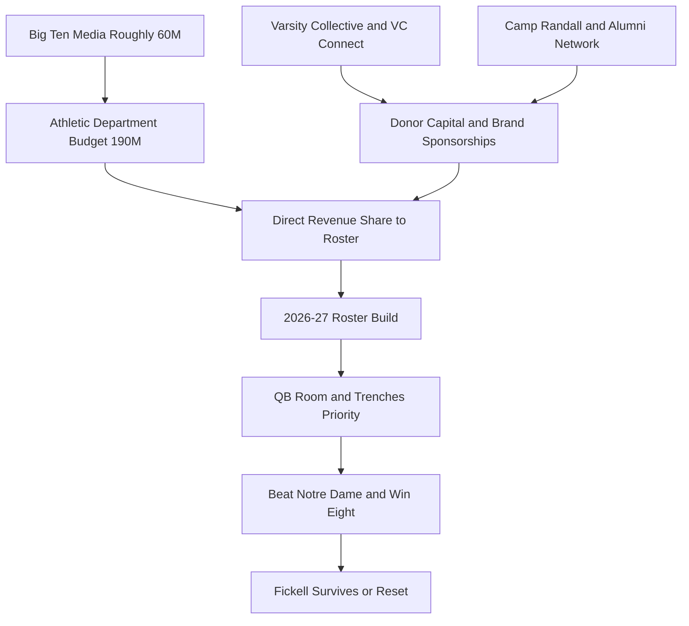
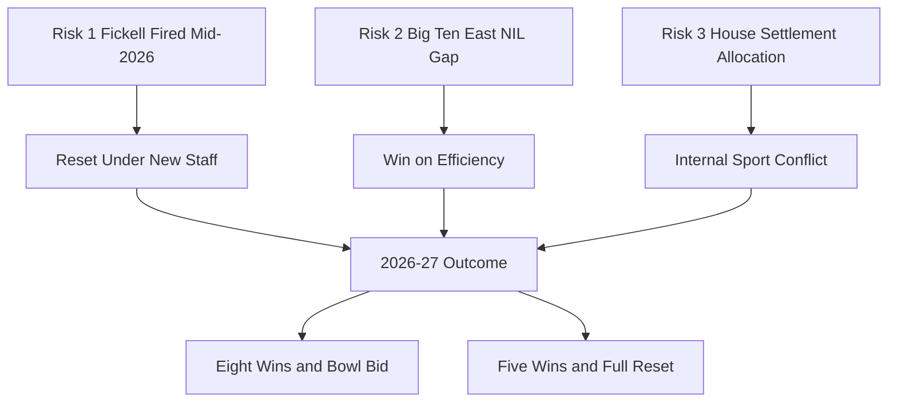

## Direct Answer

Wisconsin Badgers football heads into the upcoming 2026-27 season with the most pressure-cooker NIL situation in the Big Ten West footprint. Luke Fickell returns for a fourth full season after a 4-8 (2-7 Big Ten) 2025 campaign that pushed his cumulative Wisconsin record to 17-21 and landed him near the top of national hot-seat lists, rated at the CBS Sports "win or be fired" threshold alongside Auburn's Hugh Freeze. AD Chris McIntosh publicly committed Fickell to 2026 while announcing increased financial commitment to the roster, and VC Connect — the for-profit LLC subsidiary of The Varsity Collective, Wisconsin's first donor-led NIL organization — sits at the center of that commitment. The portal class headlined by QB Colton Joseph from Old Dominion, RB Abu Sama III from Iowa State, and WR Shamar Rigby from Oklahoma State signals the direction for 2026-27: bigger, faster, more strategic. Whether that group actually lifts the floor is still to be determined — it depends on how the new pieces fit and which late transfers land. With Big Ten media revenue near $60M per school and Wisconsin's athletic budget around $190M, the Badgers have the resources. They just have not deployed them well, and 2026-27 is the year that changes or Fickell is gone and the NIL architecture gets rebuilt under a new staff.

**TL;DR** — Wisconsin's 2026-27 NIL strategy is survival: VC Connect must convert Big Ten media and alumni capital into a roster that beats the 4-8 floor, or the Fickell era ends and the collective resets.

## 1. Where Wisconsin Stands — 2026-27 NIL Math

Wisconsin's baseline is healthy on paper and fragile in practice. The athletic department runs a roughly $190M annual budget, anchored by Big Ten media that pays each full-share member around $60M per year under the Fox-CBS-NBC package. Camp Randall sells out at over 77,000, ticket and premium-seating revenue clears nine figures, and the alumni base across Madison, Milwaukee, Chicago, and the Twin Cities is one of the wealthier mid-tier Power Four donor pools. The problem is that this revenue has historically been deployed on facilities and coordinator salaries rather than front-loaded NIL packages.

The Fickell era exposed the gap. Hired at roughly $7.6M per year on a seven-year deal in late 2022, Fickell was supposed to drag Wisconsin's roster strategy into the modern NIL era. Instead the Badgers finished 7-6, 7-6, and 4-8 across his first three seasons, and the quarterback room churned through four primary starters in three years. The pivot to Colton Joseph is an admission that the Tyler Van Dyke and Billy Edwards Jr. experiments failed and that NIL dollars need to chase developmental upside rather than splashy transfer names. Whether Joseph holds the job all season is itself an open question heading into fall camp.

VC Connect is the vehicle that has to fix this. It coordinates branded sponsorships, handles tax filing, and operates as the turnkey layer between Badger athletes and commercial partners. The lawsuit against Miami over the Xavier Lucas tampering allegations signaled that VC Connect is willing to use legal infrastructure as a competitive tool, not just a back-office function.

| Lever | Wisconsin 2026-27 | Big Ten peer |
| --- | --- | --- |
| Athletic budget | Roughly 190M | Ohio State at 280M, Michigan at 240M |
| Big Ten media share | Roughly 60M | Same across full-share members |
| Coach salary | Fickell at 7.6M | Day at 12.5M, Moore at 10.5M |
| Collective vehicle | Varsity Collective and VC Connect | Buckeye Sports Group, Champions Circle |
| Portal additions | 30-plus newcomers | Ohio State more targeted |

Treat every dollar figure here as a moving estimate — roster NIL numbers are not public and shift week to week as deals are signed and the portal reopens.

## 2. Real 2026-27 Strategy — 5 Moves

**Move 1: Front-load the QB room with two real packages.** The Colton Joseph signing is a start but 2026-27 cannot rest on one transfer. VC Connect needs a layered package — an estimated starter-tier deal in the $1.2M to $1.8M range, a developmental deal near $400K for a freshman or sophomore backup, and a third-string insurance arm — modeled on how Indiana and Ohio State structured their rooms. Wisconsin lost the Van Dyke and Edwards bets because the room had no real second option.

**Move 2: Pay the offensive line like Wisconsin used to develop it.** The Badgers' identity was built on five-star-trajectory line play, and 2025 broke the offense at the trenches. A 2026-27 strategy that puts an estimated $2.5M to $3M across the starting five, with VC Connect packaging position-specific deals through Madison auto, insurance, and ag-equipment sponsors, restores the advantage that defined the Alvarez-Bielema-Chryst era.

**Move 3: Treat the Miami tampering lawsuit as a recruiting tool.** The public legal action over Xavier Lucas told every recruit that Wisconsin will defend its contracts. VC Connect should lean into that — sign-and-stay incentive structures, escrow clauses, and contractual language that makes Wisconsin the hardest program in the conference to poach from.

**Move 4: Build a Camp Randall premium-seat NIL flywheel.** Tie premium-seating renewals directly to collective contribution tiers, so the alumni base already paying for the suite is auto-routed into the NIL engine. Done well, this is a recurring estimated $8M to $12M line that does not depend on one big-donor whale.

**Move 5: Make Olympic-sport NIL a feeder, not a tax.** The Varsity Collective portfolio cannot be football-only or the Title IX exposure under the new revenue-share framework gets ugly. Olympic-sport deals through Madison businesses cost little and protect football legally and politically.

## 3. Top 3 Risks

**Risk 1: Fickell loses early and the architecture resets.** Wisconsin opens 2026 against Notre Dame in Green Bay — a coin-flip-to-likely loss — and the broader schedule is favorable but unforgiving if the offense looks like 2025 again. Whether Fickell survives is genuinely unsettled: a 5-7-or-worse finish would likely end the tenure by December 2026, the 2026-27 NIL strategy would get rewritten in February under a new staff, and every multi-year contract VC Connect signed becomes a sunk cost or renegotiation. Collectives that bet heavily on a fired coach tend to lose 25-40 percent of committed roster within 90 days, based on Texas A&M after Jimbo Fisher and Nebraska after Scott Frost.

**Risk 2: VC Connect cannot match Big Ten East ceilings.** Ohio State, Michigan, and Penn State operate collectives estimated to clear $20M to $30M in committed annual football spend. Wisconsin's ceiling, even with aggressive growth, is estimated in the $12M to $15M range. The gap is structural — population, corporate concentration, and donor density all favor the East. The 2026-27 strategy has to win on construction efficiency and player development, not raw dollar matching, and that is a coaching question more than a collective question.

**Risk 3: House settlement revenue-share creates internal fights.** With direct revenue sharing now layered on top of NIL collectives, every athletic dollar going to football is a dollar not going to men's basketball, women's basketball, or hockey. The Greg Gard and Mark Johnson programs are politically protected at Wisconsin in ways that do not exist at most peers, and any 2026-27 plan that quietly starves them will trigger a board-level fight that bleeds into football's messaging and recruiting.

## FAQ

**Q: Is Fickell actually getting fired after 2026?**
A: Unsettled, but he is on the highest hot-seat tier in the Big Ten — national lists place him among the most endangered coaches, and CBS Sports rates him at the "win or be fired" threshold alongside Auburn's Hugh Freeze. McIntosh publicly committed him to 2026, but a sub-.500 finish or a third straight losing season would almost certainly end the tenure by December. The outcome depends entirely on how 2026-27 plays out.

**Q: How big is VC Connect compared to peer collectives?**
A: Figures are not public, but VC Connect plus the Varsity Collective ecosystem is estimated in the $8M to $12M annual football range, with growth targets toward $12M to $15M. Ohio State's Buckeye Sports Group and Michigan's Champions Circle are estimated in the $20M to $30M tier, so Wisconsin tracks closer to Iowa and Minnesota. These numbers move constantly.

**Q: What does the Miami lawsuit mean for 2026-27 strategy?**
A: It signals Wisconsin and VC Connect will litigate contract interference, raising the friction cost for rival collectives trying to poach signed Badgers. Expect 2026-27 NIL agreements to include tighter buyout, escrow, and stay-bonus language as a direct result of the Lucas case.

## Sources

- ESPN, Fickell back against the wall amid Wisconsin's struggles
- ESPN, Wisconsin coach Luke Fickell to return in 2026, AD says
- The Athletic, Wisconsin beat coverage on Fickell and the 2025 season
- Sports Business Journal, Big Ten media rights distribution detail
- USA Today NCAA Athletic Department Financial Database, Wisconsin entry
- 247Sports, Wisconsin transfer portal class and Colton Joseph signing
- Front Office Sports, House settlement revenue share and collective allocation
- Wisconsin State Journal, Varsity Collective and VC Connect Miami tampering lawsuit coverage
