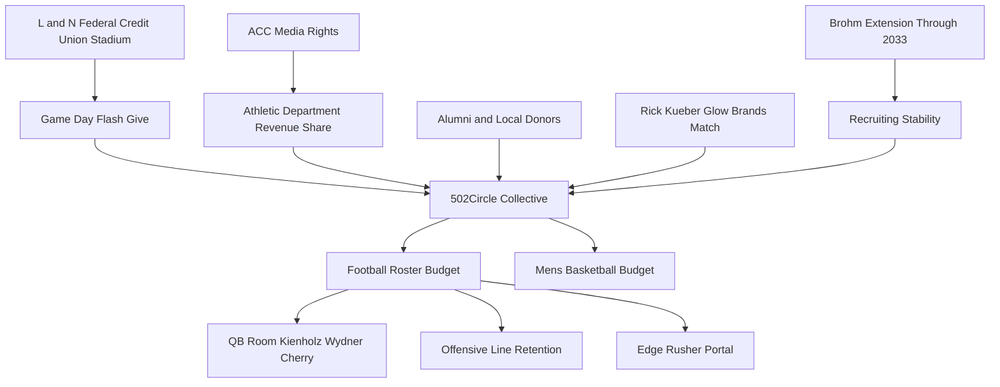
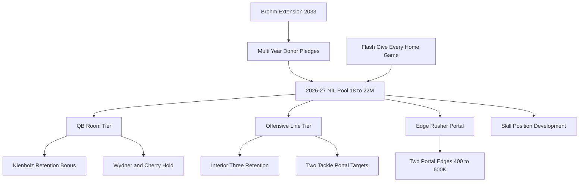

## Direct Answer

Louisville Cardinals football enters the upcoming 2026-27 season as one of the ACC's most surprising NIL success stories. Jeff Brohm, now in his fourth season at his alma mater after signing an eight-year, roughly sixty-five million dollar extension reported to run through 2033, has stacked multiple winning seasons including a recent nine-win campaign capped by a bowl win, and carries that momentum into 2026-27. The flagship collective, 502Circle, has built a roughly twenty million dollar combined football-and-men's-basketball war chest under former Cardinal Athletic Fund staffer Dan Furman, cracking the national top ten and signing roughly one hundred twenty-five to one hundred fifty athletes. The 2026-27 NIL need is not survival money — it is precision spending on a transfer-portal-built quarterback room led by Ohio State transfer Lincoln Kienholz, premium offensive line retention to keep Brohm's pro-style attack functional, and ACC-tier edge rusher acquisition to keep pace with Clemson and Miami. How far that spending stretches depends on which portal and high-school targets actually sign, which is not yet settled.

**TL;DR:** Louisville's 2026-27 NIL strategy is "Brohm tax + Kienholz insurance + trench premium" — extend the staff, protect the QB1 investment, and outspend ACC mid-tier on linemen. All dollar figures are moving estimates, not public hard numbers.

## 1. Where Louisville Stands — Brohm Era 2026-27 NIL Math

Louisville's NIL ceiling is now defined by a four-leg stool: 502Circle revenue, the House v. NCAA revenue share pool, ACC media distributions, and Brohm's recruiting gravity. 502Circle alone is reported at roughly twenty million combined for football and men's basketball, with football pulling the larger share given roster size — though every one of these figures is a private estimate that moves week to week, not a published fact. Layer on the projected revenue-share cap of roughly twenty to twenty-two million per athletic department and Louisville is estimated to be operating with a usable football pool in the eighteen to twenty-two million range for 2026-27 — competitive with Pitt and North Carolina, behind Clemson and Miami, ahead of Wake Forest and Boston College. The Brohm extension matters here because contract stability gets translated into recruit confidence; when Brohm re-upped through 2033, on-campus visits accelerated and the Kienholz commitment closed quickly.

| 2026-27 NIL Lever | Estimated Pool | Primary Use |
|---|---|---|
| 502Circle football share | $12-14M (est.) | Roster retention + portal QB and OL |
| Revenue share allocation | $5-7M football (est.) | Direct athlete payments under House settlement |
| Flash Give game-day | $50K per major game (est.) | Visibility + small-dollar donor base |
| Rick Kueber match program | $1M anchor | Multiplier on mid-tier donors |
| Brohm extension halo | Recruiting confidence | Closes 4-star portal targets faster |

The math says Louisville does not need to win an arms race — it needs to win the precision race. Brohm's offense burns through experienced quarterbacks and offensive linemen, so spending must skew toward those rooms even at the cost of skill positions, where the staff has historically developed under-recruited talent.

## 2. Real 2026-27 Strategy — 5 Moves

**Move 1: Build a Kienholz insurance package.** Lincoln Kienholz arrives from Ohio State as the projected QB1 with a national title ring, and behind him sit West Georgia transfer Davin Wydner and four-star freshman Briggs Cherry. Whether Kienholz actually wins and holds the job is still to be determined. Louisville should structure a tiered NIL contract that pays Kienholz starter money in 2026-27 with a real retention bonus to keep him from re-entering the portal after one season, plus enough on Wydner and Cherry to prevent either from leaving when reps go to Kienholz.

**Move 2: Pay the offensive line first.** Brohm's pro-style scheme falls apart without veteran linemen. The 2026-27 plan should commit twenty to twenty-five percent of the football NIL pool to retaining the interior starters and aggressively portal-shopping tackles, even if it means under-investing at receiver, where Brohm's coaching has historically over-delivered relative to recruiting rankings.

**Move 3: Cash the Brohm-extension halo.** The long-term deal through 2033 is the single biggest recruiting asset Louisville has. Sales messaging to recruits and donors should anchor every pitch on coaching stability — most ACC programs cannot promise the same head coach in 2030, let alone 2033, and 502Circle should run a multi-year donor pledge campaign tied to the extension.

**Move 4: Buy edge rushers in the portal.** Louisville's pass rush has graded out below ACC median in recent seasons. Two portal edge rushers in the four-to-six hundred thousand dollar range per player could lift the defense into the ACC top five and protect Kienholz's win total — assuming the staff can actually land them, which depends on a contested portal market.

**Move 5: Double the Flash Give cadence.** 502Circle has shown the Flash Give model can raise twenty-eight to fifty thousand dollars in a single in-stadium moment, with a marquee game reportedly generating just under fifty-one thousand dollars in a single second-quarter timeout window. Running it at every home game — six to seven games — could convert what is now a special-occasion stunt into a quarter-million dollar annual donor pipeline, a renewable visibility play, and a data-collection mechanism for identifying mid-tier donors who can be upgraded to monthly recurring givers over the following twelve months.

## 3. Top 3 Risks

**Risk 1: Kienholz portal flight after one season.** Quarterback portal flight is now the modal outcome for transfer starters. If Kienholz plays well in 2026-27, every SEC school with a quarterback need will tampering-recruit him. If he plays poorly, he may transfer for a third start. Louisville must price the QB1 contract assuming both scenarios are roughly equally likely and build buy-out protection into the NIL agreement, mirroring what Tennessee and Florida State have started doing.

**Risk 2: ACC distribution shrinkage.** ACC media rights are under structural pressure as marquee members litigate exits and the conference renegotiates with ESPN. If the per-school distribution drops by even ten percent in the next cycle, Louisville's revenue-share funding ceiling drops with it. The mitigation is front-loading donor cash now while 502Circle has momentum, rather than assuming the conference number stays flat. Louisville's athletic department should also model two distinct scenarios — current ACC and reduced ACC — and pre-commit which roster moves get cut first if the lower scenario materializes.

**Risk 3: Donor concentration around a single match.** Rick Kueber's one-million-dollar match through Glow Brands is a wonderful gift, but heavy reliance on a single anchor donor is fragile. If Kueber steps back for any reason — business cycle, personal, redirected to a different cause — 502Circle loses both the dollar and the matching multiplier on smaller donors. The fix is to recruit two additional anchor donors at the same tier by mid-2027 and publicly cap any single donor's match commitment at twenty-five percent of any one campaign.

## FAQ

**Q: Is 502Circle actually a top-ten NIL collective?**
A: Reporting from On3 and Sports Illustrated has placed 502Circle inside the national top ten, with SI putting it around number nine overall — a notable mark for a non-SEC, non-Big-Ten program. Collective rankings are estimates and shift as other programs spend.

**Q: How long is Jeff Brohm contractually committed to Louisville?**
A: Reported through 2033. The extension is an eight-year deal worth roughly sixty-five million dollars, with built-in annual raises and a retention bonus.

**Q: Who is Louisville's 2026-27 starting quarterback?**
A: Ohio State transfer Lincoln Kienholz is the projected QB1 — a former four-star recruit from Pierre, South Dakota, who won a national title with the Buckeyes before transferring. The job is not formally locked, so the depth chart is still to be determined.

## How the House Settlement Resets the Louisville Math

Every figure in the Louisville plan now runs through the House v. NCAA settlement, which Judge Claudia Wilken approved on June 6, 2025, with revenue sharing live as of July 1, 2025. Each school may now pay athletes directly from a pool that opened at roughly $20.5 million, set at 22% of average Power Four athletic revenue and projected to rise toward $32.9 million by the early 2030s. Most ACC programs that want to win allocate the clear majority of that pool — commonly 70% to 75% — to football, which puts Louisville's in-house football line in the estimated $14 million to $16 million range before a single 502Circle dollar is added.

That is the structural shift Jeff Brohm's staff has to manage. School-paid revenue share is now the base layer, and 502Circle becomes the multiplier that lifts a retention target like Lincoln Kienholz from a cap-funded base into true portal-market range. The two-bucket model is the right read for 2026-27: fund the quarterback room and the interior offensive line primarily through the revenue-share cap, then route 502Circle collective money — which must clear the NIL Go review — toward the portal edge rushers and tackle targets where the open-market price is most volatile.

NIL Go is the Deloitte-operated clearinghouse that vets every third-party deal above $600 for fair-market value and a genuine business purpose; contracts that look like pay-for-play can be denied or sent to arbitration, with the College Sports Commission, the power-conference enforcement body, handling the policing. For 502Circle, that means the Rick Kueber match dollars and the Flash Give home-game campaigns have to be papered as legitimate endorsement and appearance deals rather than flat roster payments. A collective that builds that discipline in keeps its commitments clearing on the first review and avoids the mid-window stalls that have tripped up programs treating the clearinghouse as an afterthought.

The practical takeaway is that Louisville's real 2026-27 spending power is the revenue-share cap plus a disciplined, NIL-Go-compliant 502Circle top-up — not the collective alone — and the programs that win the ACC will be the ones that stack both layers cleanly.

**Q: How does the House settlement revenue-share cap change Louisville's football budget?**
A: The settlement created a school-paid pool of about $20.5 million for 2025-26, climbing toward a projected $32.9 million by the early 2030s. Football typically receives 70% to 75% of a Power Four school's pool, which places Louisville's in-house football allocation near an estimated $14 million to $16 million. That base lets the staff fund core retention like Kienholz directly and reserve 502Circle dollars for the portal edge and tackle targets.

**Q: What is NIL Go and how does it affect 502Circle's deals?**
A: NIL Go is the Deloitte-run clearinghouse that reviews every third-party NIL contract over $600 to confirm fair-market value and a real business purpose; failing deals can be denied or arbitrated, with the College Sports Commission enforcing. For 502Circle, the Kueber match and Flash Give campaigns must be structured as genuine endorsement and appearance agreements so they clear review on the first pass and keep Louisville's roster build on schedule.

## Sources

- CBS Sports — [Louisville signs Jeff Brohm to contract extension](https://www.cbssports.com/college-football/news/louisville-jeff-brohm-contract-extension/)
- ESPN — [Louisville, coach Jeff Brohm agree to 8-year, $64.8M extension](https://www.espn.com/college-football/story/_/id/48571414/louisville-coach-jeff-brohm-agree-8-year-648m-extension)
- 502Circle — [Official NIL Collective of the Louisville Cardinals](https://502circle.com/)
- On3 — [502 Circle plays central role in renewed enthusiasm for Louisville Cardinals](https://www.on3.com/nil/news/502-circle-nil-collective-plays-central-role-in-renewed-enthusiasm-for-louisville-cardinals/)
- Sports Illustrated — [Louisville's 502 Circle Named a Top-10 NIL Collective](https://www.si.com/college/louisville/other-sports/502-circle-named-a-top-10-nil-collective)
- 247Sports — [QB Lincoln Kienholz adds an extra element to Louisville's offense](https://247sports.com/college/louisville/article/jeff-brohm-brian-brohm-qb-lincoln-kienholz-adds-an-extra-element-to-louisvilles-offense-278806980/)
- Wikipedia — [2025 Louisville Cardinals football team](https://en.wikipedia.org/wiki/2025_Louisville_Cardinals_football_team)
- UofL News — [L&N Federal Credit Union inks naming rights deal to rename Cardinal Stadium](https://news.louisville.edu/news/ln-federal-credit-union-inks-naming-rights-deal-rename-cardinal-stadium)
