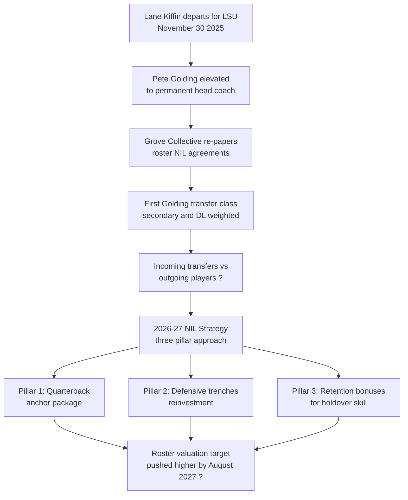
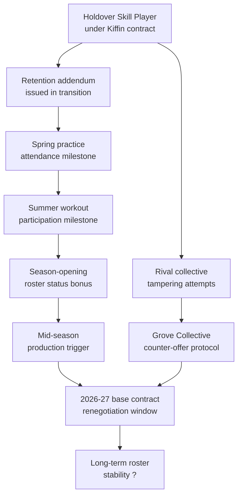

## Direct Answer

Ole Miss enters the 2026-27 cycle with an estimated roster valuation in the mid-$30 millions (figures here are estimates that move week to week, not public hard numbers), a head coach in Pete Golding now into his first full offseason, and a Grove Collective that has steadied after the most violent leadership transition in recent SEC history. Lane Kiffin walked out the door for LSU on November 30, 2025, hours after the Rebels clinched their first College Football Playoff berth, and Ole Miss elevated defensive coordinator Pete Golding to the permanent job that same week. Athletic director Keith Carter denied Kiffin the chance to coach the playoff run, and the Grove Collective was forced to re-paper roughly two dozen NIL deals in a single weekend. The 2026-27 strategy is now built around three priorities: settle the quarterback room with a market-resetting NIL package, fund a defense-first roster that matches Golding's identity, and protect the holdovers and incoming transfers through an offseason where rival collectives will absolutely keep calling. Exactly which recruits and transfers ultimately stick is still to be determined.

## TL;DR

Ole Miss closed the 2025 season near the top third of the SEC in estimated roster valuation — call it the mid-$30 millions, an estimate that shifts weekly — with the Grove Collective as the operational backbone. Golding's first transfer haul brought in roughly two dozen incoming players, weighted toward the secondary and defensive line. The 2026-27 NIL plan centers on a quarterback anchor deal, a defensive-trenches reinvestment thesis that mirrors Golding's Alabama pedigree, and retention bonuses for the holdover skill players who watched their head coach leave mid-playoff. The Rebels will not outspend Texas or Georgia, but they can outmaneuver them by paying for fit instead of stars. Whether that approach holds the roster together is the open question of the cycle.

## 1. The Quarterback Anchor Deal Defines Everything

Ole Miss cannot finish rebuilding the post-Kiffin identity without a publicly known, fully funded starting quarterback locked in for 2026-27. The Grove Collective has spent this offseason navigating a quarterback room whose pecking order is not yet settled, and the plan requires picking one name and pouring an estimated $2.5 million to $3.5 million into a single deal — both to reward production and to signal market discipline to every receiver and offensive lineman watching how the Rebels handle their most important contract. That dollar figure is an estimate, not a published number, and the room itself depends on which arms stay and whose eligibility clears.

The obvious anchor candidate is whichever quarterback the staff can confirm for the full season, and at least one option's eligibility for an additional year remains officially unresolved (?). Familiarity with the system reduces schematic risk under new offensive staff, so a returning option carries an edge. If the incumbent does not return, the strategic fallback is a quarterback whose commitment was made directly to Golding rather than inherited from Kiffin, which carries cultural weight inside a building still healing from the November exit.

| Quarterback Scenario | Estimated 2026-27 NIL Package | Strategic Logic |
|---|---|---|
| Incumbent returns with extra year (eligibility ?) | $3.0M to $3.5M (est.) | Production proven, marketing already built, lowest schematic risk |
| Direct-Golding commit wins job | $2.2M to $2.8M (est.) | Direct Golding commitment, cultural reset, longer runway |
| Developmental transfer wins job | $2.0M to $2.5M (est.) | Pedigree present, youngest option, requires development investment |

The decision should land by spring 2026 because the receiver room and offensive line will price their own deals against whoever wears the starting helmet, and a delayed quarterback announcement creates retention risk across every other position group.

## 2. Defensive Trenches Match Golding's Identity

Pete Golding spent five seasons as Nick Saban's defensive coordinator at Alabama before joining Ole Miss in the same role, and his first transfer class already reflected his fingerprints. The incoming group leaned heaviest in the secondary and defensive line — exactly the position groups that defined the Saban era and that Kiffin's offensive-leaning roster construction historically underfunded. The 2026-27 NIL strategy will continue this rebalancing by allocating a larger share of the Grove Collective budget toward defensive tackles, edge rushers, and safeties.

This is not just a personnel preference. It is a financial efficiency argument. Defensive line and secondary deals at Ole Miss have historically run below quarterback and receiver pricing despite being equally critical to SEC competitiveness, which means each marginal dollar invested in those rooms produces more on-field value than another skill-position upgrade. Golding has publicly described his recruiting approach as trajectory over tradition, emphasizing tough, competitive players who love football, which translates directly into the kind of unflashy lineman deals that compound over a full season.

The pattern showed up across this signing cycle. Rather than chasing a single headline transfer, the staff layered multiple mid-tier defensive deals that built depth instead of star power. Expect 2026-27 to extend this pattern with several new defensive line deals in the estimated $400,000 to $700,000 range and a continued emphasis on portal experience over high school projection in the secondary — though exactly which targets sign is still to be determined.

## 3. Retention Bonuses Protect the Holdover Skill Players

The most overlooked piece of the post-Kiffin NIL plan is the retention layer for players who chose to stay rather than follow their head coach to Baton Rouge. Multiple Ole Miss assistants followed Kiffin to LSU, and rival collectives spent the winter calling Oxford skill players to test whether their NIL deals were enforceable under the new staff. The Grove Collective responded by quietly issuing what amount to retention bonuses, structured as performance-tied addenda to existing contracts, with milestones tied to spring practice attendance, summer workout participation, and season-opening roster status.

The current extension of this approach formalizes what the transition weekend improvised. Expect the Grove Collective to publish standardized retention tier language, tied to position group and class year, that gives players clear earning paths without requiring panic negotiations every time a competing program calls. Ole Miss cannot match Texas dollar for dollar, but it can offer contract certainty that the bigger budgets often fail to deliver.

## 4. Funding the Roster Under the Revenue-Share Cap

The post-Kiffin NIL plan does not exist in a vacuum — it runs inside the House v. NCAA settlement framework that took effect July 1, 2025, which lets opted-in schools share roughly $20.5 million directly with athletes across all sports. For an SEC football program like Ole Miss, that direct revenue-share pool funds the bulk of the football roster, with the Grove Collective layering third-party NIL on top to reach an estimated mid-$30 millions total valuation — a figure that moves weekly and is not publicly disclosed. The strategic consequence of the cap is that Ole Miss can no longer simply outspend on stars; every opt-in SEC rival operates under the identical $20.5 million ceiling, so the differentiator becomes how cleanly and creatively the Grove Collective stacks third-party deals above the cap line.

This is where the settlement's NIL Go clearinghouse — the Deloitte-run review that vets third-party deals above $600 for fair-market value — directly shapes Golding's strategy. The retention addenda the Grove Collective improvised during the Kiffin-exit weekend, with milestones tied to spring practice attendance and season-opening roster status, are exactly the kind of documented, deliverable-based agreements that survive a fair-market-value review. A quarterback anchor deal in the estimated $2.5-3.5 million range cannot all run through opaque collective payments anymore; a meaningful share has to be revenue-share base plus legitimate endorsement work, which is why Golding's public emphasis on trajectory over tradition doubles as a compliance posture — unflashy, deliverable-heavy deals clear NIL Go with far less friction than headline booster bags.

The defensive-trenches reinvestment thesis also benefits from the cap math. Because edge rushers and defensive linemen price below quarterbacks and receivers on the open market, each revenue-share dollar spent in the front seven buys more cap-efficient on-field value, letting Ole Miss build a Golding-identity defense without exhausting the pool on a single skill position. Any target of pushing the roster valuation higher by August 2026 assumes the Grove Collective grows its third-party layer through Oxford-area businesses and national brand activations while the university maxes its football share of the revenue-share cap. Hitting a higher number while staying clean through NIL Go is the real operational test of the post-Kiffin front office — and whether the Rebels get there is not yet known.

## FAQ

**Who is Ole Miss head coach for 2026-27?** Pete Golding, who was elevated from defensive coordinator to permanent head coach in early December 2025 after Lane Kiffin departed for LSU.

**What is the Ole Miss roster valuation?** An estimate in the mid-$30 millions that moves weekly — NIL/roster figures are not public, so treat any single number as a moving estimate rather than a hard fact.

**How did Ole Miss do in the transfer portal under Golding?** Golding's first cycle brought in roughly two dozen incoming transfers weighted toward the secondary and defensive line. Final retention of that group is still to be determined.

**What is the Grove Collective?** Ole Miss's NIL collective, established in 2021 immediately after the NCAA approved name, image, and likeness compensation, and considered one of the earliest fully operational SEC collectives.

**Will the quarterback room be settled for 2026-27?** Not yet — at least one option's eligibility for an additional year remains officially unresolved (?), and the depth chart depends on which arms stay.

**What is Pete Golding's recruiting philosophy?** Trajectory over tradition, with a stated preference for tough, competitive players who love football and a balanced approach between portal experience and high school development.

**How does the revenue-share cap affect Ole Miss's NIL spending?**
Under the House settlement effective July 1, 2025, opt-in schools share roughly $20.5 million directly with athletes across all sports, with football taking the dominant share. The Grove Collective layers third-party NIL on top to reach the estimated total roster valuation. Because every SEC rival shares the same cap, Ole Miss competes on how cleanly it stacks third-party deals, not on raw cap room.

**What is NIL Go and why does it matter for the Grove Collective?**
NIL Go is the Deloitte-run clearinghouse created by the House settlement that reviews third-party NIL deals above $600 for fair-market value. The Grove Collective's retention addenda and deliverable-based endorsement deals are structured to clear this review, which is why Golding's trajectory-over-tradition, deliverable-heavy approach also functions as a compliance strategy.

## Sources

- [The Lane Kiffin LSU Ole Miss Saga - The Ringer](https://www.theringer.com/2025/12/01/college-football/lane-kiffin-lsu-ole-miss-college-football)
- [Lane Kiffin leaving Ole Miss for LSU - CBS Sports](https://www.cbssports.com/college-football/news/lsu-hires-lane-kiffin-head-coach-ole-miss/)
- [Ole Miss elevates Pete Golding to head coach - CBS Sports](https://www.cbssports.com/college-football/news/ole-miss-hires-pete-golding-head-coach-lane-kiffin-lsu/)
- [Inside Ole Miss landmark NIL victories after Kiffin exit - CBS Sports](https://www.cbssports.com/college-football/news/ole-miss-roster-stronger-portal-king-lane-kiffin-exit/)
- [Ole Miss roster valuation - On3](https://www.on3.com/teams/ole-miss-rebels/news/what-is-the-estimated-valuation-for-the-2026-ole-miss-football-roster/)
- [Ole Miss Transfer Portal Tracker - The Rebel Walk](https://therebelwalk.com/2026/01/ole-miss-football-transfer-portal-tracker-2026/)
- [Pete Golding spring presser - The Rebel Walk](https://therebelwalk.com/2026/03/inside-ole-miss-head-coach-pete-goldings-first-spring-presser-chambliss-tampering-and-a-new-look-roster/)
- [Ole Miss assistants following Kiffin to LSU - Yahoo Sports](https://sports.yahoo.com/articles/ole-miss-football-coaches-following-110408976.html)
