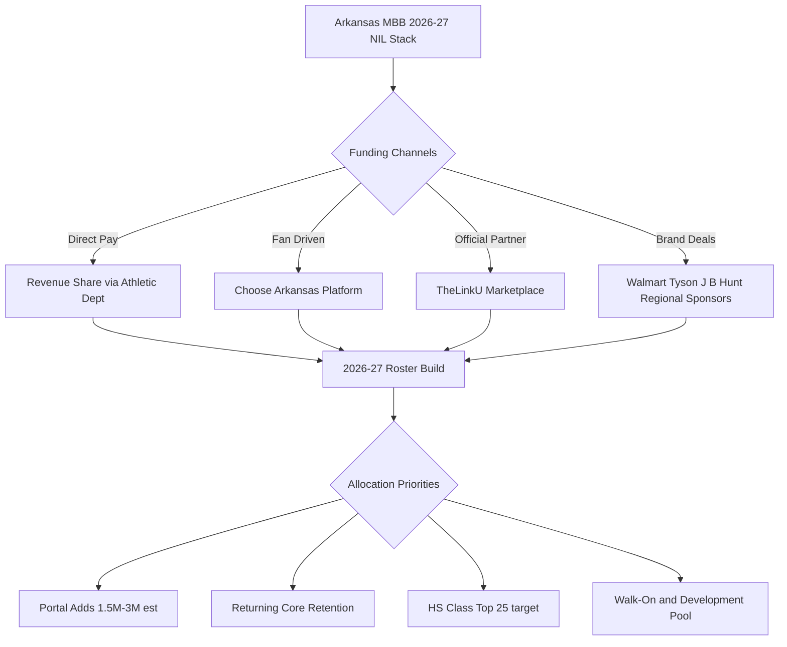
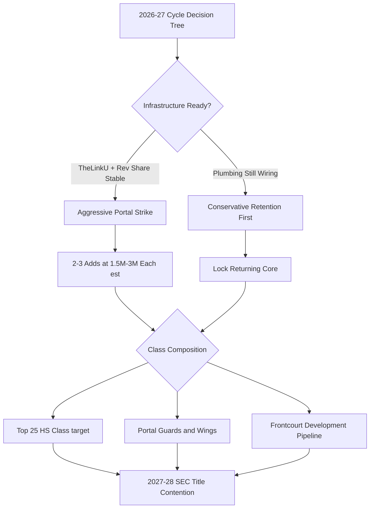

## Direct Answer

Arkansas Razorbacks men's basketball enters the upcoming 2026-27 cycle in a structurally unusual NIL position for an SEC blue-chip program. Head coach John Calipari, hired April 10, 2024 on a five-year deal, came off a 2026 SEC Tournament championship and a Sweet Sixteen run, and now has to turn that momentum into a stable funding model. That on-court success arrives in the middle of a complete rebuild of the school's NIL apparatus: the official Arkansas Edge collective was shut down on October 6, 2025 after the university cut ties with Blueprint Sports, athletics transitioned to a platform partnership with TheLinkU announced December 30, 2025, and fan-run Choose Arkansas (formerly Pig Pen Collective) relaunched January 5, 2026 to fill the gap. For 2026-27, Calipari needs a clean, in-house revenue-share stack tied to the House v. NCAA settlement (final-approved June 6, 2025), which lets schools pay athletes directly under a first-year cap of roughly $20.5 million per school. He needs two to three priced-up portal additions in an estimated $1.5M-$3M range, four to six retention deals to lock in the returning core, and a high school class budget that can compete with Duke, Kentucky, and Houston without the collective scaffolding most of his SEC peers still operate. Exactly which of those targets land is still to be determined — the roster math below is a plan, not a settled result.

**TL;DR**
Calipari's 2026-27 strategy hinges on rebuilding NIL infrastructure post-Edge, funding 2-3 portal additions, retaining the returning core, and competing on a tight HS class through TheLinkU plus House-settlement revenue share. Final allocations depend on which recruits and transfers actually commit.

## 1. The Post-Edge Infrastructure Problem

The single biggest variable in Arkansas's 2026-27 NIL position is not the budget — it is the plumbing. Arkansas Edge, the official collective branded into the athletic department from 2023 through fall 2025, was wound down on October 6, 2025 when the university severed its Blueprint Sports relationship. The stated reason was that the House settlement's revenue-sharing framework made traditional collectives structurally redundant: schools can now pay athletes directly through institutional contracts, eliminating the laundering function that collectives originally provided. The practical reason, reported by Talk Business and Politics, also included a long-running vacancy at Edge's executive director seat and broader scrutiny of Blueprint Sports' deal structures at peer schools.

Arkansas filled that vacuum twice. First, on December 30, 2025, athletics announced a partnership with TheLinkU as its official NIL marketplace platform. Second, in the fan-driven lane, Payton Dunn relaunched the former Pig Pen Collective as Choose Arkansas on January 5, 2026, broadening it from a Razorback-only operation into a multi-school in-state platform serving Arkansas, Arkansas State, and others. For Calipari's 2026-27 cycle, that means three distinct funding rails — direct institutional revenue share, TheLinkU marketplace deals, and Choose Arkansas fan dollars — that need to be coordinated rather than competing. Programs at Houston, Duke, and Kentucky already run unified stacks; Arkansas is still wiring its replacement, and the speed at which it consolidates will shape every recruiting conversation through the upcoming signing windows.

There is a compliance wrinkle that is now the operating reality. Under the House settlement, any third-party NIL deal of $600 or more must be cleared through the NIL Go clearinghouse run by Deloitte and overseen by the new College Sports Commission, which checks each deal against a "fair market value" range and a valid business purpose. That means Choose Arkansas and TheLinkU deals are not automatically approved the way pre-2025 collective payments were. Calipari's staff has to assume that any seven-figure portal package routed through a fan platform will be scrutinized, while direct revenue-share dollars from the athletic department sit cleanly inside the cap and clear without clearinghouse review. The strategic implication for 2026-27 is that the bulk of guaranteed money should flow through revenue share, with the collective rails reserved for genuine, defensible brand activations.

## 2. What 2026-27 Roster Math Actually Costs

Calipari's stated portal philosophy at Arkansas has been transparent from his Kentucky exit forward: build around three to five high-ceiling veteran portal additions, surround them with one or two top-15 freshmen, and keep enough institutional money to retain the returning core. Public reporting from 247Sports' roster tracker and Whole Hog Sports indicates Arkansas is actively evaluating elite prospects, with Calipari and his staff scouting the top of the class in person. That timing matters because the elite portal tier — five-star transfers with NBA Draft buzz — is estimated to price in the $1.5M to $3M annual range, and the top three to five freshmen in any class are estimated to command $1M-plus packages before they ever set foot on campus. These figures are not public and move week to week, so treat them as live estimates rather than fixed numbers.

A workable 2026-27 Arkansas men's basketball NIL budget probably lands in an estimated $8M-$12M range to stay competitive with the top SEC peers, though the exact number depends on how aggressively athletics deploys revenue-share dollars against football's claim on the same roughly $20.5M pool. Most Power Four schools are allocating the large majority of the cap to football, leaving men's basketball with a slice that, at Arkansas, must be supplemented heavily by uncapped collective NIL to reach the figures above. A reasonable allocation looks like this: $4M-$6M for two to three portal additions at the headline tier, $1.5M-$2M for retention of the returning core, $2M-$3M for the high school class targeting top-25 talent, and $500K-$1M held back for in-season replacement signings, walk-on upgrades, and the development pool. Whether Arkansas actually lands the headline portal tier is unsettled (?) — it depends on which transfers choose Fayetteville. The headline risk is that Calipari's historical pattern at Kentucky was to spend heavily on incoming talent and relatively little on retention, and that pattern in a revenue-share era leaves Arkansas exposed to spring portal raids by Duke, Kansas, and Houston.

## 3. Calipari's 2026-27 Recruiting Strategy

Whole Hog Sports has noted Calipari's recent Arkansas classes among his strongest, and the staff has been on the road scouting elite prospects, with reporting suggesting the pitch will lean on continuity, NBA development, and the recent SEC championship banner as social proof. The harder question is whether Arkansas can match the brand-deal infrastructure of Duke (Jordan Brand, Cameron Indoor halo) or Kentucky (Adidas, Rupp Arena, alumni in every NBA front office) when stacked against the lighter-weight Razorback footprint. Arkansas's regional answer is real money from Walmart, Tyson Foods, and J.B. Hunt — three Fortune 500 anchors headquartered within an hour of campus in Northwest Arkansas — but those relationships need to be translated into player-specific deals through TheLinkU rather than treated as generic athletic-department sponsorships.

The other strategic lever is the upcoming portal class. Calipari's track record indicates he will lean heavily on guards and wings in the portal and use the high school class for frontcourt development. That means 2026-27 NIL allocation should skew toward two proven SEC or Big 12 guards in the transfer market, paired with a top-50 high school big who can develop over two seasons. Which specific names land is not yet known — and the risk Athlon Sports has flagged before, of losing a priced target late, is exactly the kind of fumble that gets more expensive in a revenue-share market, because losing a priced target forces emergency spending against the next available tier.

## 4. The Bud Walton Arena Revenue Reality

Arkansas's ability to fund any of the above ultimately traces back to one of the most valuable home-court environments in college basketball. Bud Walton Arena seats 19,368 and Arkansas consistently ranks among the top five nationally in average men's basketball attendance, regularly drawing north of 18,000 per game during the Calipari era. That demand is the foundation of the revenue-share pool, because ticket revenue, premium seating, and the Razorback Foundation's annual giving feed directly into the athletic-department budget that now writes athlete checks. The Razorback Foundation, the school's primary donor arm, has historically raised tens of millions annually for athletics, and a meaningful share of that capacity can be redirected toward the revenue-share cap rather than purely facilities.

The strategic point for 2026-27 is that Arkansas does not have a demand problem — it has a coordination problem. Few SEC programs can claim a 19,000-seat building that sells out for a non-blueblood schedule. Translating that proven fan intensity into recurring NIL dollars through Choose Arkansas's $100-tier memberships and TheLinkU's marketplace is the cleanest path to closing the gap with Kentucky and Duke. If even a fraction of Bud Walton's 18,000-plus regular attendees convert into recurring collective contributors, Arkansas's fan-driven rail becomes one of the deepest in the league, and the program's budget stops depending on a handful of whale donors.

## FAQ

**Q: Is Arkansas Edge actually gone for good?**
A: Yes. The university formally ended Arkansas Edge on October 6, 2025 and cut ties with Blueprint Sports. TheLinkU partnership announced December 30, 2025 is the official replacement, and fan-driven Choose Arkansas filled the grassroots lane on January 5, 2026.

**Q: How much does Arkansas need to spend on men's basketball NIL in 2026-27?**
A: A competitive SEC-tier budget is estimated in the $8M-$12M range across portal, retention, high school class, and reserve, gated by how athletics splits the roughly $20.5M House-settlement revenue-share cap between football and basketball. These are moving estimates, not public figures.

**Q: Where does Calipari's track record create the biggest risk this cycle?**
A: Retention. His historical pattern leans toward heavy spending on incoming talent and lighter spending on returning players, which in a revenue-share era invites spring portal raids on the returning core.

**Q: What is NIL Go and how does it affect Arkansas deals?**
A: NIL Go is the Deloitte-run clearinghouse created by the House settlement that must approve any third-party NIL deal of $600 or more, checking it against a fair-market-value range and a valid business purpose. Arkansas collective and marketplace deals are now subject to that review, while direct revenue-share dollars inside the cap clear without it.

**Q: How does Bud Walton Arena factor into Arkansas's NIL funding?**
A: It is the foundation. Arkansas regularly draws 18,000-plus per game in the 19,368-seat building, ranking top-five nationally in attendance, and that demand feeds the ticket, premium-seat, and Razorback Foundation revenue that funds the revenue-share cap and gives Choose Arkansas a massive potential membership base.

## Sources

1. Whole Hog Sports — John Calipari and Arkansas basketball coverage
2. 247Sports — Arkansas Basketball Roster Tracker
3. Athlon Sports — Calipari and Arkansas transfer portal reporting
4. Sports Illustrated — Arkansas Razorbacks recruiting coverage
5. Arkansas Razorbacks official — Arkansas Edge collective announcements
6. Talk Business and Politics — UA to end the Arkansas Edge NIL program (October 2025)
7. Front Office Sports — Arkansas and the NIL buyout crackdown
8. Wikipedia — John Calipari coaching record and contract details
9. NCAA / House v. NCAA settlement — final approval June 6, 2025, revenue-share cap and NIL Go clearinghouse
10. College Sports Commission — NIL Go deal-review framework
