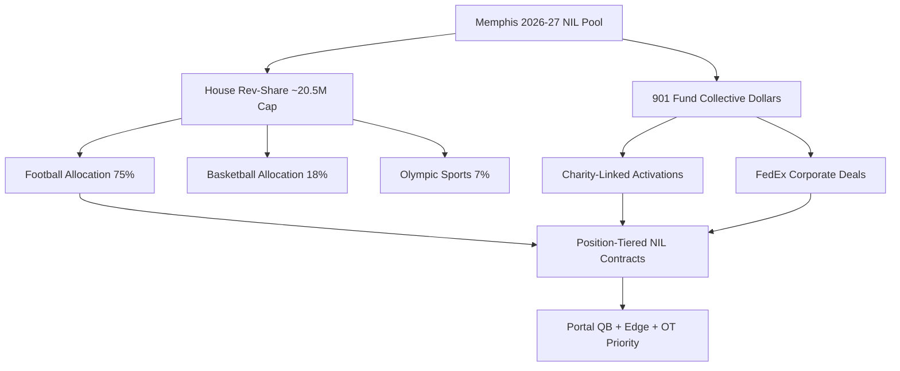
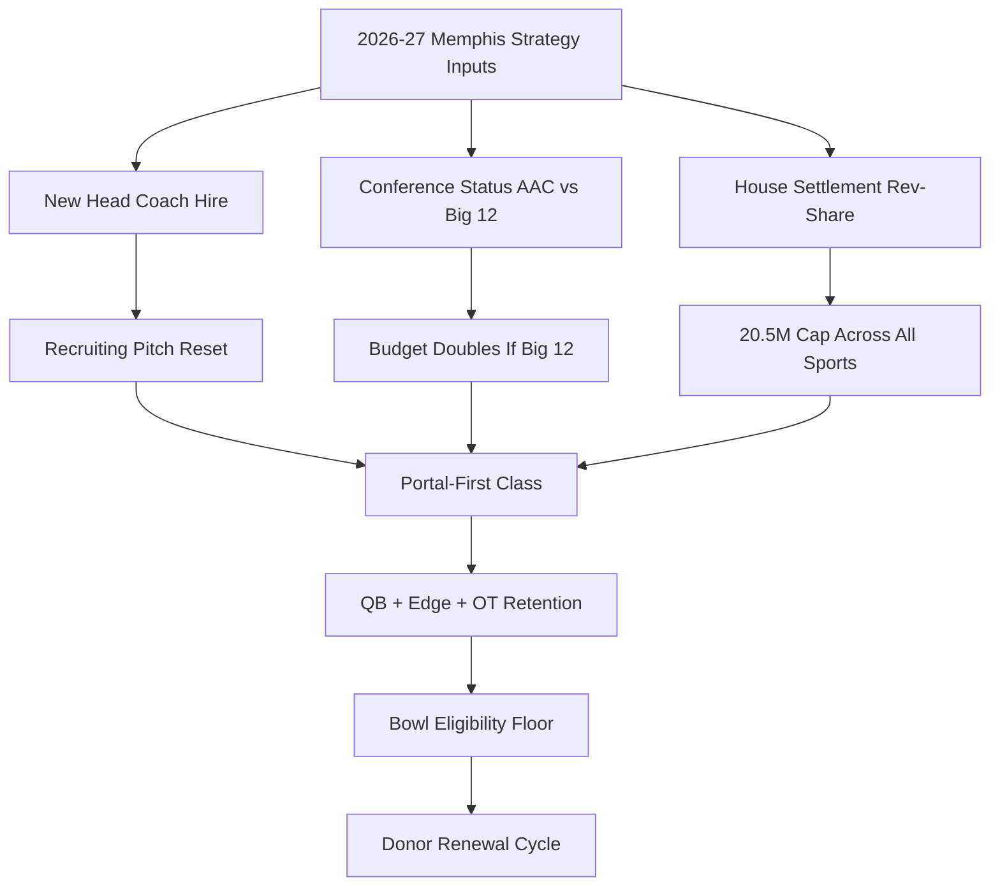

## Direct Answer

Memphis Tigers football enters the upcoming 2026-27 cycle in a coaching transition window after Ryan Silverfield departed to take the Arkansas head job following six straight bowl appearances and a 50-25 record. With interim coach Reggie Howard bridging the gap and a national search underway, the Tigers' NIL strategy hinges on the 901 Fund collective stabilizing the roster through the transfer portal, retaining a quarterback room capable of holding the AAC standard, and pitching a Group of Five model where Memphis remains the most fundable, most televised non-Power-4 program in the South. The needs are concrete, even if the dollar figures are moving estimates rather than hard numbers: roughly $4.5M to $6M in estimated football NIL spend, a portal-first QB and pass-rusher class, and a brand pitch that converts Memphis's FedEx-anchored corporate base into per-position deal flow. Exactly which recruits and transfers land — and therefore how much of that spend gets committed where — is still to be determined and depends heavily on who gets the head job.

## 1. The Coaching Vacuum Reshapes The NIL Pitch

### 1.1 Why Silverfield's Exit Matters

Silverfield went 50-25 at Memphis and beat West Virginia and Iowa State in back-to-back bowls, which means he was selling NIL recruits a "we beat Power 4 teams" pitch. That pitch leaves with him to Fayetteville. The 2026-27 class is being recruited by a coach who, as of the search window, has not yet been named, so 901 Fund and athletic director Ed Scott have to do something rare in modern college football: sell the program before they can sell the staff. The bridge figure is interim coach Reggie Howard, a Memphis alum and former NFL player, whose credibility with the local base is real but whose recruiting runway is short.

### 1.2 The Pitch Has To Be Institutional

Because the coaching identity is in flux, the NIL pitch for 2026-27 has to lean on what does not change. That means three pillars: the 901 Fund's corporate Memphis network, the Simmons Bank Liberty Stadium footprint, and the Tigers' standing as the AAC program with the most consistent bowl pipeline in the last decade. Recruits this cycle will hear less about scheme and more about earning power, NFL pass-through history, and the city's logistics-and-medical employer base. The pitch deck for portal visits has to feature recurring sponsors, on-camera training-room footage, and a clean five-year roster outcomes report rather than the personality of a not-yet-hired coordinator.

### 1.3 The Search Itself Is A Recruiting Tool

Ed Scott's national search is being run with NIL implications in mind. Every candidate is being asked, in effect, whether they can fundraise. A coach who arrives with a portal book and existing collective relationships shortens the cycle by months, while a developmental hire forces 901 Fund to backstop the first signing class out of pocket. The most valuable trait Scott can buy is a head coach who already understands the post-House revenue-share cap and can run a quasi-NFL front office, because Memphis cannot afford to spend its first season teaching a coach how the new financial system works.

## 2. The 901 Fund Is The Whole Operation

### 2.1 What 901 Fund Actually Is

The 901 Fund is the official Memphis NIL collective, founded by Bob Byrd of the Bank of Bartlett. It started as a football-and-basketball vehicle and has since expanded to cover all 17 Memphis varsity sports, which is both a strength and a budgeting headache. The fund is structured as a non-profit and routes most of its activations through local charity partnerships rather than pure pay-for-play, which means the 2026-27 strategy will likely be a hybrid of revenue-share dollars (post-House settlement) plus charity-linked appearance fees.

### 2.2 The Budget Reality

Memphis is not Texas. A realistic 2026-27 football NIL pool is estimated in the $4.5M to $6M range — and because none of these collective figures are public, that number should be read as an estimate that moves week to week. The House revenue-share cap provides a reference ceiling of roughly $20.5M shared across all sports in year one and escalating about 4% annually. Football's slice is the obvious priority, but basketball has historically commanded equal attention from donors. The open question is whether 901 Fund can push football's share toward 75% of the revenue-share allocation without bleeding basketball goodwill. Complicating that math is the fact that Memphis, as a Group of Five program, is not actually required to fund the full power-conference cap — many G5 schools are choosing to opt into revenue sharing at a fraction of the $20.5M ceiling because their athletic budgets cannot absorb the full figure. Memphis's strategic choice is how close to the cap it dares to fund football, knowing that every dollar it commits is a dollar a Power 4 rival commits more easily.

### 2.3 The NIL Go Compliance Layer

The 901 Fund's charity-linked, deliverable-based model is unusually well positioned for the current rules. Since July 2025, any collective or booster deal of $600 or more must pass NIL Go, the Deloitte-run clearinghouse, which screens for fair-market value and can void deals that look like disguised recruiting payments. Because 901 Fund built its model around real appearances, real charity events, and real FedEx-anchored corporate sponsors rather than flat cash transfers, more of its deals are structured to survive that review than a typical pure pay-for-play collective. That becomes a quiet competitive advantage now: Memphis's deals are less likely to be flagged, which means less roster uncertainty in the weeks before signing day.

## 3. Position Needs Driving 2026-27 Spend

### 3.1 Quarterback Is The Whole Ballgame

Memphis has run a high-tempo offense for a decade, and the quarterback room is the single most NIL-sensitive position on the roster. Whoever the new head coach is, the strategy has to budget an estimated $700K to $1.1M for a portal-veteran QB, paired with a developmental high-school commit on a smaller deal. Whether Memphis actually lands an AAC-caliber starter is not yet known and depends on which portal arms the new staff can close — without one, the rest of the NIL spend underperforms because the offense cannot show the skill positions on national TV.

### 3.2 Edge Rusher And Offensive Tackle

The two positions that have historically leaked to Power 4 raids out of Memphis are edge rusher and offensive tackle. The plan needs retention NIL packages for any rising junior edge or tackle on the roster, estimated at roughly $300K to $500K each, to keep them out of the December portal window. This is cheaper than replacing them and signals to the locker room that production gets paid.

### 3.3 Receiver Depth And The DB Room

Memphis traditionally over-recruits at receiver and corner because the AAC schedule rewards skill speed. The NIL allocation should fund a three-deep receiver room with mid-tier deals (estimated $75K to $150K) and a deep defensive back rotation, given the conference's pass-heavy slate. Targeted Group of Five portal additions at corner are among the highest-ROI NIL spend Memphis can make.

## 4. The Memphis Pitch In The Transfer Portal Era

### 4.1 Why Memphis Still Wins Portal Battles

The Tigers' portal pitch has been remarkably durable: a fast offense, a major media market by Group of Five standards, FedExForum-adjacent NFL exposure, and a city where players can build personal brands without competing with a pro team for attention. The 901 Fund leans into this by structuring deals that pay for content and appearances rather than flat sums, which extends the dollar and builds NIL portfolios that travel with the athlete.

### 4.2 The FedEx Factor

No Group of Five program in the country has a corporate anchor like FedEx, headquartered in Memphis and a longtime athletics partner that put its name on FedExForum. That relationship gives the 901 Fund a template for what a genuine, NIL Go-compliant corporate deal looks like: a Fortune 100 company with national advertising reach signing real athletes for real campaigns. The strategy should treat the broader Memphis logistics and medical corporate base — the freight, healthcare, and distribution employers clustered in the metro — as a pipeline of mid-tier deals that no other AAC program can replicate, because no other AAC city has that concentration of national-brand headquarters.

### 4.3 The Big-12 Question

The single largest strategy variable is conference realignment. Memphis has been mentioned in Big 12 expansion conversations for years, and any movement there would roughly double the football NIL ceiling because of the media-rights step-up. Whether that move actually happens is still unsettled, so the 901 Fund's budget is essentially being built in two versions: an AAC version at the estimated $5M football floor and a Big 12 version at an estimated $10M-plus. Donors are being asked to commit to the higher tier conditionally.

## 5. What Has To Happen By Signing Day

The 2026-27 NIL playbook for Memphis comes down to four executable moves. First, name the head coach by mid-December so 901 Fund can rebuild the recruiting pitch around a real person. Second, lock a portal quarterback before the January window closes, ideally a multi-year starter from a Power 4 backup room. Third, retain the top three returning defensive contributors with extension-style NIL deals announced publicly to set a market floor. Fourth, publish a transparent 901 Fund donor tier sheet so the corporate base in Memphis knows exactly what each dollar level buys in terms of roster impact.

If those four moves land, Memphis enters the season with a stabilized roster, a credible bowl floor, and a Big 12 application that does not depend on hope. Whether they land is the open question of the cycle. The Tigers have built six straight bowls on a Group of Five budget by being smarter than richer programs, and the 901 Fund era is the test of whether that operational edge can survive the revenue-share era intact.

## 6. Frequently Asked Questions

**Does a Group of Five school like Memphis have to spend the full revenue-share cap?**

No. The roughly $20.5M cap set by the House settlement is a ceiling, not a requirement. Power-conference programs routinely fund close to it, but Group of Five schools like Memphis can opt into revenue sharing at whatever level their budgets allow, and many are funding only a fraction of the cap because their athletic departments do not generate power-conference revenue. That is precisely why Memphis's realistic football NIL pool is estimated in the $4.5M-$6M range rather than at $15M. The strategic risk is competitive: every dollar Memphis cannot fund is a dollar a Big 12 or SEC rival funds easily, which is also why a conference move to the Big 12 — and its larger media payout — is the variable that would most change the math.

**Why does losing the head coach hurt Memphis NIL more than it would hurt a blue-blood program?**

Because Memphis's recruiting pitch was tied to demonstrated results rather than brand prestige. Ryan Silverfield sold recruits on a coach who went 50-25 and beat Power 4 teams in bowls; when he left for Arkansas, that specific proof of concept left with him. A blue-blood program sells decades of tradition and NFL production that survive any single coaching change, but a Group of Five program leans heavily on its current staff's track record. With the upcoming class being recruited before a permanent coach is even named, the 901 Fund has to sell the institution — the corporate base, the bowl pipeline, the media market — instead of the staff, which is a harder and more expensive pitch to land.

Sources: gotigersgo.com, espn.com, cbssports.com, on3.com, 901fund.org, NCAA House settlement filings
