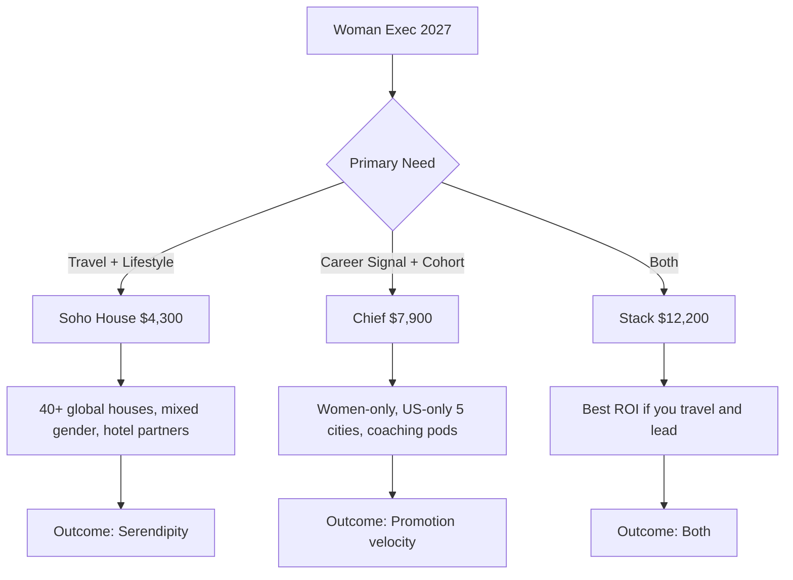
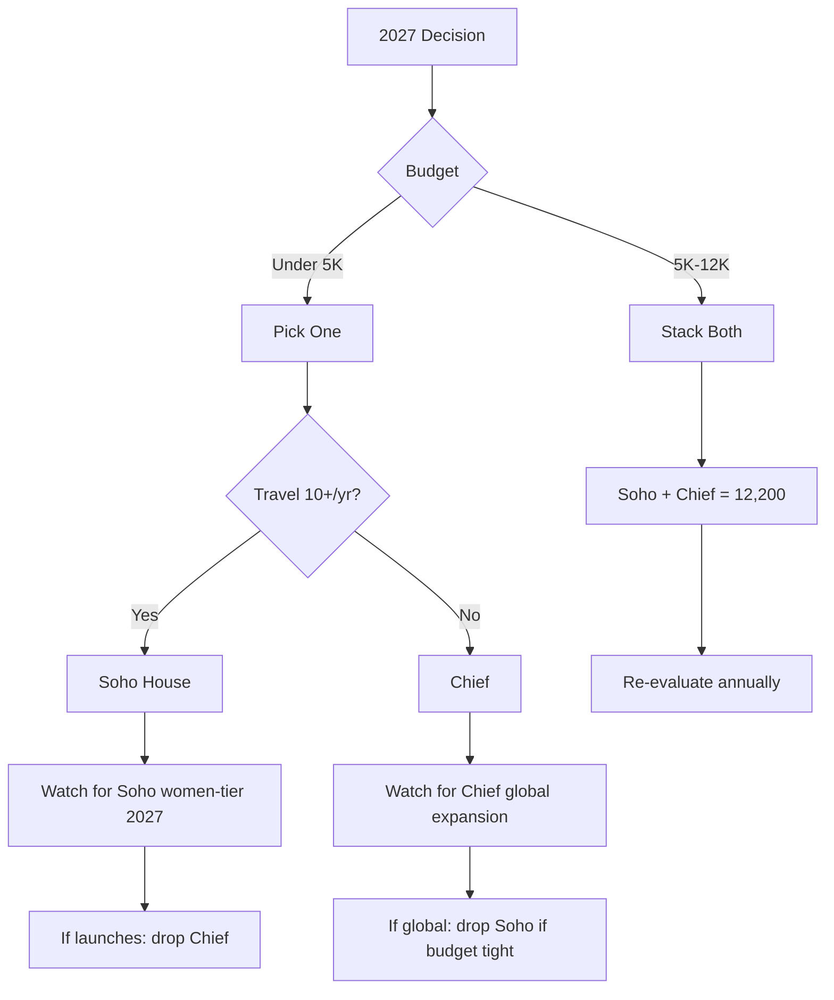

## Direct Answer

Soho House (~$3,800–$4,300/yr Every House) wins for global travel, lifestyle, and serendipitous executive mixing across 40+ cities. Chief ($7,900/yr at the C-suite tier) wins for a curated women-only cohort, executive coaching pods, and a career-specific signal that lands inside your bio. The honest verdict for a woman executive in 2027: if budget allows, **stack them — roughly $12K/yr total — and they are complementary, not redundant**. If you must choose one, the deciding question is whether you travel for work more than ten times a year (Soho House) or whether you need a structured cohort of women peers and an executive coach (Chief). And there is a third option lurking: pressure Chief to copy Soho House's global model, because the vacation-club pivot is exactly what would future-proof Chief against the women-exec sub-tier that Soho House is almost certainly building post-MCR take-private.

**TL;DR** — Soho House for global lifestyle and travel; Chief for women-only career signal and coaching; stack both at ~$12K/yr if you have the budget; expect Chief's moat to shrink unless it goes global.

## 1. Soho House's Edge

Soho House charges roughly $3,800–$4,300/yr for Every House membership in 2026, plus a one-time induction fee around $630. For that money you get keys to 40+ clubhouses across London, New York, Los Angeles, Mumbai, Berlin, Mexico City, Istanbul, Tel Aviv, Hong Kong, and most other cities where executive deals actually get done. The 2025 take-private deal led by MCR Hotels at a $2.7 billion valuation was telling: the buyer is a hotel operator, not a media or co-working company. That signals where the brand is heading — deeper hotel integration, more bedrooms, more vacation-club-style benefits, and a likely women-exec sub-tier within the next eighteen months.

The under-discussed strength is the gender mix. Soho House is roughly 45–50% women in most major houses, and a meaningful slice of those women are senior operators, founders, fund partners, and creative leads. Unlike a women-only network, the mixed environment means the men you meet are also potential investors, co-founders, board members, and clients — not just the supportive-peer category. For a woman executive whose career is bottlenecked by access to capital allocators rather than peer support, that mix is the more valuable graph.

The travel anchor matters more than people admit. If you take ten business trips a year, Soho House effectively replaces a WeWork day pass, a hotel lounge, and a dinner reservation in each city — and the rooms above the houses (where they exist) book at member rates that often beat comparable boutique hotels. The membership pays for itself on travel utility alone before you count a single networking outcome.

## 2. Chief's Edge

Chief charges $7,900/yr at the C-suite tier and $5,900/yr at the VP tier in 2026, with grants down to $3,800 for VPs whose employers will not sponsor. About 70% of members have their dues covered by their company, which is the single most important pricing fact: Chief is largely a B2B leadership-development line-item, not a personal lifestyle expense. If your employer will pay, the personal-cost comparison to Soho House collapses entirely and Chief becomes effectively free.

The product is a curated, women-only cohort of senior leaders. Core Groups of 10–12 women, matched by seniority and stage, meet monthly with a trained executive coach. That structure is the moat — it is the closest thing to a paid peer board that an exec can buy without a multi-year YPO or Vistage commitment, and it is the only one of those built specifically around the patterns women face at the top. The signal value is real too: "Chief member" in a bio reads like a credential, while "Soho House member" reads like a lifestyle choice.

The weakness is geography. Chief operates clubhouses in roughly five US cities (New York, Los Angeles, Chicago, San Francisco, and Washington DC, with partnerships filling other markets via Industrious and, notably, Soho House itself). If you live outside those metros or travel internationally, the physical product evaporates and you are paying $7,900 for a Zoom-and-summit experience. Post-2024 layoffs at Chief, the in-person cadence has also thinned — Chief never recovered its pandemic peak operating intensity, and the waitlist that once topped 60,000 has shortened to almost nothing.

## 3. The Stack Strategy and Chief's Existential Threat

The stack works because the two products almost do not overlap. Soho House gives you a physical footprint in 40+ cities, mixed-gender executive mixing, and travel/hotel utility. Chief gives you a women-only structured cohort, monthly coached peer-board meetings, and a credential. At roughly $12,200/yr combined — less if your employer covers Chief — the stack is cheaper than a single YPO chapter and meaningfully broader than either product alone. The honest read for any woman executive earning $400K+ is that this is a rounding error against a single missed promotion cycle.

| Dimension | Chief | Soho House |
|---|---|---|
| Cost | $7,900/yr (C-suite) | $4,300/yr (Every House) |
| Locations | 5 US cities + partners | 40+ globally |
| Gender | Women-only | Mixed (~45–50% women) |
| Career signal | High (credential) | Medium (lifestyle) |
| Travel utility | Low | High |
| Coaching | Yes (monthly pods) | No |
| Employer-paid rate | ~70% of members | <10% |

Here is the strong opinion: **Chief has roughly 24 months to go global or it loses the war.** Soho House under MCR is almost certainly building a women-exec sub-tier — a curated, members-within-members track with coaching partners and women-only programming inside the existing 40+ houses. The moment that launches at a price point under $6K/yr, Chief's value proposition collapses to "the coaching pod," which is replicable by any of a dozen executive-coaching firms at half the price. Chief's existential play is the vacation-club pivot — open international houses (London, Mexico City, Singapore), bolt a hospitality layer onto the cohort product, and become the women's Soho House before Soho House becomes the women's Soho House. If Chief's board reads only one comp this year, it should be the Soho House take-private deck.

## FAQ

**Q: Will my employer reimburse Soho House the way they reimburse Chief?**
A: Almost never. Chief is positioned as leadership development and lands in HR/L&D budgets. Soho House reads as lifestyle and lands in your personal AmEx. Run Chief through your employer first, then layer Soho House personally.

**Q: Is the Chief waitlist still a real signal in 2026?**
A: No. The waitlist that hit 60,000 in 2022–2023 has effectively cleared. Most qualified applicants get an offer within weeks. Treat scarcity claims with skepticism.

**Q: What about Soho Friends as a cheaper Soho House entry?**
A: At ~$130/yr it gets you bookings into rooms and restaurants but not clubhouse access. Useful as a sampling tier, useless as an executive network.

## Sources

- [Soho House Membership Pricing](https://www.sohohouse.com/en-us/pricing)
- [How Much Does a Soho House Membership Cost? (2026) — Candace Abroad](https://candaceabroad.com/soho-house-membership-cost/)
- [Soho House & Co Announces Board Changes Effective January 29, 2026 — MarketScreener](https://www.marketscreener.com/news/soho-house-co-inc-announces-board-changes-effective-january-29-2026-ce7e5ad9dc8ef024)
- [What's Next for Soho House and Its Members After Its Go-Private Deal — The Caterer](https://www.thecaterer.com/indepth/whats-next-for-soho-house-and-its-members-after-its-go-private-deal)
- [Chief Membership and Community Platform for Senior Women Leaders](https://chief.com/)
- [Chief, the $5,800-per-year women's networking startup, is worth $1 billion — Yahoo Finance](https://finance.yahoo.com/news/chief-5-800-per-women-113000590.html)
- [Chief members question $1B women network's fast growth — Fortune](https://fortune.com/2023/03/16/chief-womens-network-startup-price-valuation-waitlist-members/)
- [Inside Chief L.A., a Private Club That Offers Female Execs Coaching and Community — Hollywood Reporter](https://www.hollywoodreporter.com/lifestyle/lifestyle-news/inside-chief-l-a-private-club-1235544654/)
