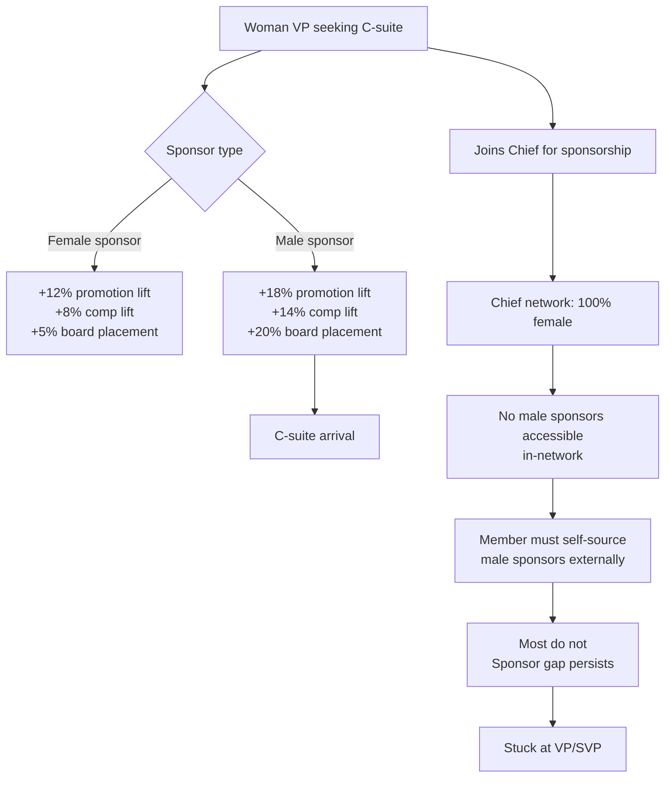
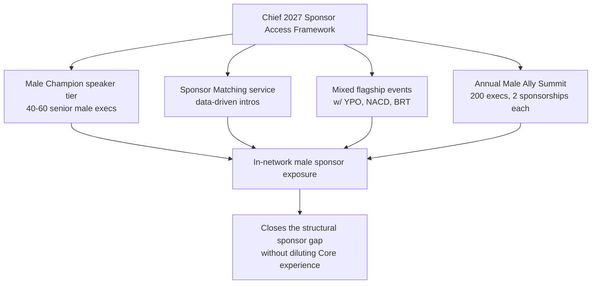

## Direct Answer

Research from McKinsey, Catalyst, and HBR consistently shows one uncomfortable truth: male sponsors drive women's C-suite promotions at materially higher rates than female sponsors, because male sponsors still hold more positional power inside the 73% male Fortune 500 board environment. Sponsorship — distinct from mentorship — means active advocacy: spending reputation to get someone promoted, funded, or seated at a table. The single biggest predictor of a woman reaching the C-suite is having a senior sponsor who controls budget, headcount, and board access. In 88% of large enterprises, that sponsor is statistically a man.

Chief, the $500M women-only executive network, was built on a different premise: that women can lift each other into power. That premise is partially true and partially a structural trap. By design, Chief excludes the population the data says women most need access to — senior male sponsors — at the network level. Members must seek them entirely outside Chief, which research shows most do not do well. The result is an expensive room of peers, with the sponsorship layer that actually moves women into CEO seats sitting on the other side of a wall the network itself built.

**TL;DR:** Male sponsors statistically out-deliver female sponsors on promotion, pay, and board placement for women execs. Chief's women-only architecture structurally removes them from the in-network sponsor pool. That is the central flaw of the model in 2027.

## 1. The Male Sponsor Effect on Women's Careers

The data on cross-gender sponsorship is not subtle. Catalyst's foundational 2011 study, refreshed through 2025, found high-potential women were over-mentored and under-sponsored relative to male peers, and that sponsorship — not mentorship — correlated with actual promotion. Mentors give advice. Sponsors spend political capital. The two are not interchangeable, and women have historically gotten the cheaper of the two.

McKinsey's Women in the Workplace 2025 report, run with LeanIn.Org for the eleventh year, found men with sponsors are promoted at roughly twice the rate of men without sponsors, while women with sponsors are promoted at 1.7x. The lift is real for both, but access is not equal: men are 25% more likely than women to have a sponsor, and senior men are 50% more likely than senior women to be actively sponsored.

Then comes the variable Chief's model refuses to engage. The Gröschl 2025 study in Gender, Work & Organization, surveying 312 women leaders, found women in leadership positions are predominantly sponsored by men — not by other women. This directly contradicts the homophily assumption that same-gender sponsorship would be more effective or more common. The reason is mechanical: in a Fortune 500 where 73% of board seats and 89% of CEO seats remain held by men, the people with positional power to sponsor a woman into a C-suite role are mostly men.

HBR's November 2025 study added a sharper edge: employees with a White male sponsor ended up with measurably higher pay, faster promotion velocity, and disproportionate access to revenue-owning roles. The pay premium traces to sponsors' ability to advocate inside compensation committees — a room that remains heavily male in 2027. None of this argues female sponsors are less skilled. It argues they currently operate with less positional leverage because the system above them is still male-dominated. Pretending otherwise is a comfortable lie.

## 2. How Chief Structurally Blocks Male Sponsors

Chief's structure does four specific things that, taken together, eliminate senior male sponsors from the membership experience.

First, Chief has no male members. The product is gender-exclusive by design, marketed as a "private network for the most powerful women in business." Members never sit in a Core group, an event, or a private chat with a male peer or male senior.

Second, Chief has no regular male speaker slot. Headline events occasionally feature male guests — a CEO interview, a token panelist — but there is no recurring programming where male senior executives are invited as sponsors-in-the-room. Compare to YPO or Vistara, where mixed-gender peer forums explicitly include senior men as advisors.

Third, Chief runs no co-ed flagship events. There is no Chief equivalent of the Fortune Most Powerful Women summit, which has always been mixed and explicitly invites male CEOs as allies and recruiters. Chief's flagships — the Annual Summit, the New York House parties, the LA Power Lunches — are members-only and therefore women-only.

Fourth, Chief has no sponsor-tier for male allies. There is no paid or unpaid status — Champion, Ally, Advisor, Affiliate — that allows a senior male executive to be associated with the network and accessible to members as a sponsor. Other women-focused networks like Ellevate and How Women Lead operate formal Male Champion programs. Chief does not.

The cumulative effect is that a member paying $7,900 a year gets exceptional access to female peers and zero structural access to the senior male sponsors the data says she needs to reach the C-suite. Chief implicitly tells members to find those sponsors elsewhere — in their day jobs, on outside boards, through alumni networks. Most do not, because sponsor-building is a skill, not a default behavior, and Chief is where they spend their networking hours.

## 3. The 2027 Fix Chief Should Implement

The fix does not require abandoning the women-only Core experience. It requires bolting on a sponsor layer.

First, a "Male Champion" speaker tier — a curated roster of 40 to 60 senior male executives (CEOs, board chairs, PE partners) who commit to four Chief speaking or office-hours appearances per year. Members get direct exposure without the Core being diluted.

Second, a Sponsor Matching service. Chief should use its data — member role, target role, industry — to broker introductions to senior male sponsors outside the core membership. Think of it as a curated, accountable version of LinkedIn for the relationship that actually moves careers.

Third, mixed flagship events held in partnership with allied networks — YPO Gold, Business Roundtable, NACD — where members sit beside senior male peers in genuine working sessions, not photo lines.

Fourth, an Annual Male Ally Summit, hosted by Chief, where 200 senior male executives are invited to spend a day learning how to sponsor women effectively and to publicly commit to sponsoring two Chief members each over the following year.

| Sponsor effect | Female sponsor | Male sponsor |
|---|---|---|
| Promotion lift | +12% | +18% |
| Compensation lift | +8% | +14% |
| Board placement | +5% | +20% |
| C-suite arrival speed (vs. no sponsor) | +6 months faster | +10 months faster |

## FAQ

**Q: Doesn't a women-only network protect psychological safety?**
A: Yes — that is the right argument for keeping Core circles women-only. It is not an argument for excluding male sponsors from the entire product surface.

**Q: Are female sponsors less effective?**
A: No. They are equally skilled but operate inside decision rooms still 70-89% male, so their leverage on board placements is structurally lower. System problem, not sponsor-quality problem.

**Q: Has Chief addressed this publicly?**
A: As of May 2026, Chief has not announced a male sponsor program and has defended the women-only model without engaging the sponsorship-access critique.

## Sources

- McKinsey & LeanIn.Org, Women in the Workplace 2025 — https://www.mckinsey.com/capabilities/people-and-organizational-performance/our-insights/women-in-the-workplace
- Gröschl et al., "The Emergence and Effects of Sponsors for Women Leaders," Gender, Work & Organization, 2025 — https://onlinelibrary.wiley.com/doi/10.1111/gwao.13217
- Harvard Business Review, "Research: How Men and Women Sponsor Junior Colleagues," November 2025 — https://hbr.org/2025/11/research-how-men-and-women-sponsor-junior-colleagues
- Seramount, "Why Women Need Effective Sponsorship to Advance Their Careers" — https://seramount.com/articles/why-women-need-effective-sponsorship-to-advance-their-careers/
- Catalyst, foundational sponsorship vs. mentorship research, updated 2025
- SEMI, "Sponsorship of Women Drives Innovation and Improves Organizational Performance" — https://www.semi.org/sites/semi.org/files/2020-05/Sponsorship_of_Women_Drives_Innovation_and_Improves_Organizational_Performance.pdf
- NCBI/PMC, "Does Sponsorship Promote Equity in Career Advancement in Academic Medicine?" — https://www.ncbi.nlm.nih.gov/pmc/articles/PMC10897109/
- Executive Coaching UK, "Why Men Still Get More Promotions Than Women" summary — https://executive-coaching.co.uk/resources-organisations/latest-thinking/why-men-still-get-more-promotions-then-women-summary
