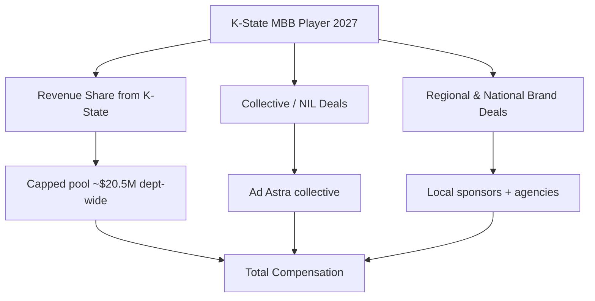
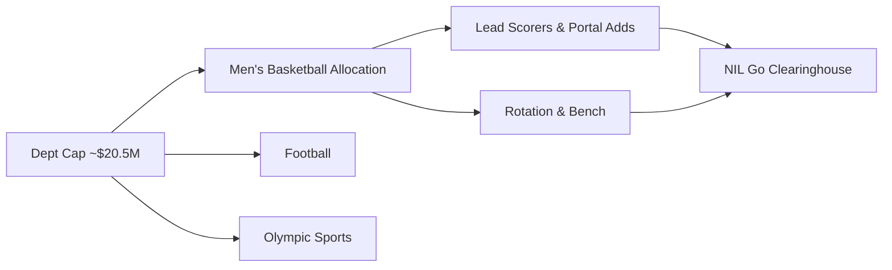

# How much do Kansas State men’s basketball players earn from NIL in 2027?

## Direct Answer

A **Kansas State men's basketball** player in 2027 earns anywhere from low five-figure deals to roughly **$300K–$700K** for the program's top-end starters, with a marquee transfer-portal addition or featured scorer occasionally reaching the **$800K–$1 million+** range in a single year. K-State is a **solid high-major program in the Big 12** — historically a tournament team rather than a blue-blood — so its NIL economy is **collective-and-portal driven** rather than recruiting-gravity driven. After the **House v. NCAA settlement** took effect for 2025–26, Kansas State can now pay players directly from a **revenue-sharing pool capped near $20.5 million department-wide**, and basketball receives a meaningful slice of that pool. On top of that sits the **third-party NIL layer**: the **Ad Astra collective**, regional sponsors, and brand deals. The biggest earners stack a strong revenue-share allocation with collective support and local endorsements; rotation players land in the low-to-mid five figures.

## 1. Why Kansas State Basketball NIL Is Valued Where It Is

Kansas State's NIL value reflects a **strong-but-not-blue-blood** profile:

- **Big 12 membership.** K-State competes in the **deepest basketball conference in the country**, which forces a competitive NIL spend to stay relevant against Houston, Kansas, Baylor, and Arizona.
- **Loyal regional base.** Wildcat fans and Manhattan-area donors fund a real collective, though the donor pool is smaller than that of a national brand.
- **Portal-first roster building.** Coach **Jerome Tang** rebuilt the program around the transfer portal, where NIL money is the primary lever.
- **Tournament upside.** A 2023 Elite Eight run under Tang showed the ceiling and energized collective giving.

These assets make K-State a **mid-tier high-major spender** — well above mid-majors, below the blue bloods.

## 2. The Two Layers of Earnings

**Layer one — direct revenue sharing.** Since the **House settlement**, Kansas State can pay players directly. Basketball receives a meaningful share of the capped department pool, weighted toward starters and high-priority portal additions. Because K-State's football program also competes for Big 12 relevance, basketball must share the pool — but hoops remains a marquee revenue sport in Manhattan.

**Layer two — third-party NIL.** Collective payments from **Ad Astra**, regional endorsements (auto dealers, restaurants, agriculture brands), autograph and appearance deals, and social content. Deals route through platforms like **Opendorse**, and the **NIL Go clearinghouse (run with Deloitte)** reviews third-party deals of **$600 or more** for fair-market value.

A player's total is the sum of both, which is why a featured portal scorer can far out-earn a similarly-talented bench player.

## 3. What Different Players Earn

- **Marquee portal addition / lead scorer:** **$400K–$1M+** in a strong year, anchoring the revenue-share allocation plus collective top-ups.
- **Established starters:** **$150K–$500K**.
- **Rotation players:** **$40K–$150K**.
- **Deep-bench/role players:** **$10K–$40K**, often collective-driven appearance and social deals.

These bands shift with the cap, the roster's portal-recruiting needs, and how aggressively **Ad Astra** fundraises in a given cycle. A single transfer-portal bidding war can spike one player's number well above the rest of the roster.

## 4. Real Kansas State Earners and What They Prove

K-State's recent history shows how the program's NIL works in practice. **Markquis Nowell**, the undersized point guard who led the 2023 Elite Eight run, became the face of K-State's early NIL era — his March Madness heroics turned him into a national name and a magnet for appearance and brand deals during and after that season, proving that **on-court production plus a viral moment** is the K-State path to a big number, rather than pre-arrival recruiting hype. Alongside him, **Keyontae Johnson**, a graduate transfer whose comeback story drew national attention, showed how the **portal delivers ready-made marketability** to Manhattan. More recently, **Coleman Hawkins**, the **Illinois** transfer who reportedly commanded a deal in the **$2 million** range to join K-State in 2024, became the clearest signal that the Wildcats will spend at the top of the market for a single difference-making veteran when the roster needs it. The pattern is consistent: K-State's biggest checks go to **proven, experienced transfers** who can immediately raise the team's ceiling, not to unproven freshmen.

## 5. How The House Settlement Reshaped K-State's Math

Before 2025, every dollar a Kansas State player earned came from collectives and brands; the school could not pay players. The **House v. NCAA settlement**, approved in June 2025 and effective for 2025–26, changed that with direct institutional revenue sharing under a cap that started near **$20.5 million per department** and rises roughly 4 percent per year toward the **$22–23 million** range by 2027–28. Because the cap is department-wide, K-State's basketball roster competes with football and Olympic sports for share. For a program of K-State's size, the settlement is a **leveler** — it raised the floor by letting the school pay rotation players directly, but it also capped the high-end spending that previously let well-funded collectives stockpile talent. The settlement also created the **NIL Go** clearinghouse, operated with **Deloitte**, which reviews third-party deals of **$600 or more** for fair-market value, pushing the **Ad Astra collective** toward structuring legitimate endorsements rather than disguised recruiting payments. The net effect: a more predictable, salary-cap-like environment where K-State's competitiveness depends on smart allocation rather than out-raising the blue bloods.

## 6. The Organizations in K-State's NIL Economy

- **Ad Astra** — the primary Kansas State NIL collective channeling Wildcat donor money into player deals.
- **Opendorse** and similar platforms manage and disclose deals (Opendorse is itself Nebraska-rooted but serves the region).
- **NIL Go / Deloitte** clearinghouse reviews third-party deals ($600+) for fair-market value.
- **Regional sponsors** — Manhattan and Kansas auto dealers, restaurants, and agriculture-sector brands that value local-hero athletes.
- **National agencies** handle endorsements for the program's most marketable players.

A savvy K-State player treats NIL like a business — representation, disclosure workflow, tax planning, and a personal-brand strategy built around the Wildcat fanbase.

## 7. How a Kansas State Player Maximizes Earnings

1. **Earn a featured on-court role** — minutes and production drive the revenue-share allocation and collective interest.
2. **Create a signature moment** — K-State's biggest NIL winners (Nowell) built value through memorable March performances.
3. **Build a genuine social following** — regional brands pay for authentic reach within the Wildcat market.
4. **Get real representation** that understands clearinghouse rules.
5. **Stack all three layers** — revenue share, **Ad Astra** collective money, and regional endorsements.
6. **Manage taxes and eligibility** — NIL income is taxable and deals must clear fair-market-value review.

## 8. How Kansas State Stacks Up Against Big 12 Peers in 2027

Kansas State plays in what is widely regarded as **the toughest basketball conference in America**, and the NIL gap between its rivals is real. **Kansas**, the in-state blue blood, runs a far larger collective and national brand, routinely out-resourcing K-State in recruiting and portal battles. **Houston** and **Baylor** pair strong collectives with elite coaching to sit in the conference's upper NIL tier, while **Arizona** and **Texas Tech** also spend aggressively. Against this field, K-State is a **mid-pack Big 12 spender** — competitive enough to win specific portal battles (as the Coleman Hawkins deal proved) but unable to consistently outbid the conference's heavyweights across a full roster. Every one of these schools now operates under the same roughly **$20.5 million department-wide revenue-share cap**, so the differentiator is increasingly how much of that pool each funnels into basketball and how strong its collective remains on top. K-State's edge is **coaching and player development under Jerome Tang** plus a fiercely loyal regional donor base — the Wildcats win by identifying undervalued veterans and maximizing them, not by outspending Kansas or Houston dollar for dollar.

## Frequently Asked Questions

**How much can a Kansas State basketball star make in 2027?** A featured starter or marquee portal addition is frequently in the **$400K–$1M+** range combining revenue share, **Ad Astra** collective money, and regional endorsements. The reported ~$2 million deal that brought Coleman Hawkins to Manhattan shows the program's top-end ceiling for a single difference-maker.

**Does Kansas State pay players directly now?** Yes. Since the **House settlement** (effective 2025–26), K-State can pay players from a revenue-sharing pool capped near **$20.5 million department-wide**, with basketball receiving a meaningful share.

**Do role players earn NIL money at K-State?** Yes — typically **$10K–$150K** depending on role, much of it from **Ad Astra** appearance and social deals plus regional sponsorships within the loyal Wildcat market.

**What is the Ad Astra collective?** It is the primary Kansas State NIL collective, which raises donor money and channels it into player deals, increasingly structured as legitimate endorsements that can pass clearinghouse review.

**What is the NIL Go clearinghouse?** The settlement-mandated review process, operated with **Deloitte**, that vets third-party deals of **$600 or more** for fair-market value to prevent disguised pay-for-play.

**How does K-State's NIL compare to Kansas or Houston?** All compete under the same roughly **$20.5 million department-wide cap**, but Kansas, Houston, and Baylor run larger collectives and out-resource K-State on the high end. K-State competes by **developing undervalued transfers under Jerome Tang** rather than outbidding its blue-blood rivals.

## Sources

- House v. NCAA settlement terms and revenue-sharing cap documentation (effective 2025–26)
- NIL Go clearinghouse (Deloitte) fair-market-value review documentation ($600 threshold)
- On3 and Opendorse NIL valuation reporting for college basketball, 2026–2027 (Coleman Hawkins reported deal)
- Ad Astra collective public reporting and Kansas State athletics NIL disclosures
- NCAA and Big 12 revenue-sharing implementation guidance, 2026–2027
- Sportico and Front Office Sports reporting on Big 12 basketball NIL values
- ESPN coverage of Kansas State's 2023 Elite Eight run (Markquis Nowell, Keyontae Johnson)

Kansas State basketball NIL review / reviews / rating / review 2027 / review of Kansas State NIL earnings
