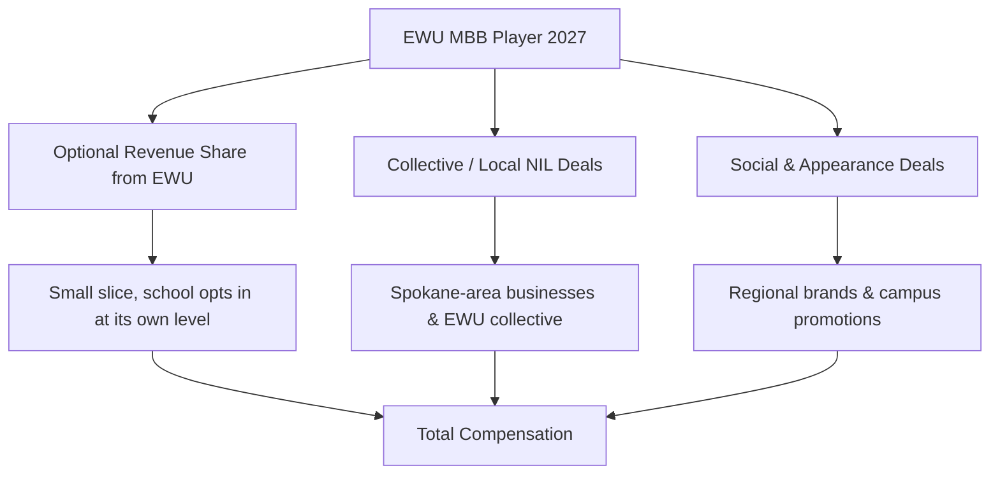
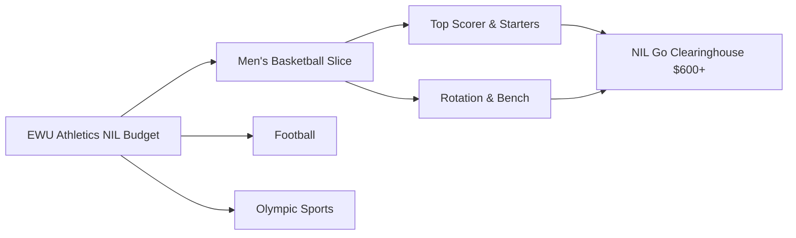

# How much do Eastern Washington men’s basketball players earn from NIL in 2027?

## Direct Answer

An **Eastern Washington men's basketball** player in 2027 earns far less than a power-conference star, with most of the roster landing in the **low four to low five figures** and the program's best player or two reaching the **$20,000 to $60,000** range in a strong year. EWU is a **Big Sky** program in Cheney, Washington, without a blue-blood brand, a large donor base, or heavy national TV exposure, so the multi-million-dollar deals seen at Duke or Kentucky simply do not exist here. After the **House v. NCAA settlement** took effect for 2025–26, EWU — as a non-autonomous-conference school — is **not required to share the full ~$20.5 million cap** and realistically distributes a small fraction across all sports if it opts in at all. Most player money therefore comes from the **third-party NIL layer**: modest collective support, local Spokane-area businesses, and social or appearance deals. The ceiling is set by a player who can draw a transfer offer or a pro look, not by national endorsements.

## 1. Why Eastern Washington Basketball NIL Sits Where It Does

EWU's NIL value is shaped by the realities of a smaller-budget mid-major:

- **Conference tier.** The **Big Sky** is a one-bid league in most years, which limits national exposure and the brand dollars that follow it.
- **Market size.** Cheney is a small college town near **Spokane**, a modest regional market rather than a major metro with deep corporate sponsors.
- **Donor base.** EWU's athletic donor pool is a fraction of a power program's, so collective funding is limited.
- **Pro pipeline.** EWU produces occasional pros — most notably **Tyler Harvey** and the **Bogdanovic-era** scorers — but not the steady NBA-draft flow that front-loads marketability.

The result is a program where NIL supplements a scholarship rather than rivaling a pro salary.

## 2. The Two Layers of Earnings

**Layer one — optional revenue sharing.** Since the **House settlement**, EWU *may* pay players directly, but the **~$20.5 million cap is a ceiling, not a requirement**, and mid-majors rarely fund anywhere near it. A Big Sky school that opts in typically commits a small, athletics-wide amount, with men's basketball receiving a modest share weighted toward key starters.

**Layer two — third-party NIL.** This is where most EWU money lives: collective payments, local-business endorsements, autograph and appearance deals, and social content. Deals are disclosed and, when **$600 or more**, reviewed by the **NIL Go clearinghouse (run with Deloitte)** for fair-market value.

A player's total is the sum of both layers, which at EWU is dominated by the third-party side rather than a big school check.

## 3. What Different Players Earn

- **Star scorer / all-conference candidate:** **$20K–$60K** combined in a strong year — the program's realistic ceiling.
- **Established starters:** **$8K–$25K**, mostly collective and local deals.
- **Rotation players:** **$2K–$10K**, appearance and social-driven.
- **Deep-bench/role players:** **a few hundred to ~$3K**, often one-off promotions or group team deals.

These bands shift with whether EWU opts into revenue sharing, how active its collective is, and whether a breakout player draws transfer-portal interest that raises his market value.

## 4. Real Eastern Washington Earners and What They Prove

EWU's history shows the program's true ceiling sits in production-driven, transfer-leveraged money rather than national fame. The Eagles built a reputation as a **high-scoring, three-point-heavy offense** under longtime coaching tenures, producing draws like **Tyler Harvey**, a national scoring champion who turned EWU production into a pro career overseas, and **Mason Peatling** and **Jacob Davison**, who carried heavy offensive loads in the Big Sky. In the NIL era, the lesson from these names is consistent: an EWU player builds value by **becoming the focal point of a winning, watchable offense**, which generates local marketability and — crucially — **transfer-portal leverage**. A standout EWU guard who averages 18-plus points can parlay that season into a far larger NIL package at a power program, making EWU a **proving ground** more than a final destination for earnings. The biggest checks tied to an EWU career are often *earned at the next school*. For players who stay, the money is real but modest: local sponsorships, a collective stipend, and the exposure of leading a Big Sky contender.

## 5. How The House Settlement Reshaped EWU's Math

Before 2025, every dollar an EWU player earned came from collectives and local brands; the school could not pay players. The **House v. NCAA settlement**, approved in June 2025 and effective for 2025–26, allowed direct institutional revenue sharing under a cap that started near **$20.5 million per department**. The critical nuance for EWU is that the cap is a **maximum, not a mandate**, and mid-major budgets cannot approach it — a Big Sky athletic department's entire annual budget is often smaller than a single power-conference revenue-share pool. So while a school like Texas pushes toward the cap, EWU realistically commits a small, deliberate amount if it participates, prioritizing roster retention over headline deals. The settlement also created the **NIL Go** clearinghouse, operated with **Deloitte**, which reviews third-party deals of **$600 or more** for fair-market value. For EWU players, the net effect is a slightly higher floor *if* the school funds revenue share, but the practical reality is that the **transfer portal and collective money still drive most earnings** at this level.

## 6. The Organizations in Eastern Washington's NIL Economy

- **EWU-affiliated collective / fan-funded NIL groups** channel donor and booster money into player deals on a modest scale.
- **Spokane-area and regional businesses** provide most local endorsement deals.
- **Opendorse** and similar platforms manage and disclose deals.
- **NIL Go / Deloitte** clearinghouse reviews third-party deals ($600+) for fair-market value.

A savvy EWU player treats NIL as a real but supplemental income stream — local relationships, a disciplined social presence, and clean disclosure matter more than national agency representation at this tier.

## 7. How an Eastern Washington Player Maximizes Earnings

1. **Become the offense** — minutes and scoring drive local marketability and any revenue-share priority.
2. **Build a regional social following** — Spokane-area brands pay for genuine local reach.
3. **Win in the Big Sky** — a conference title and **NCAA Tournament** appearance multiply exposure and deal flow.
4. **Use the portal wisely** — a breakout EWU season is leverage; staying or moving is itself an earnings decision.
5. **Disclose and plan taxes** — NIL income is taxable, and deals must clear fair-market-value review.

## 8. How Eastern Washington Stacks Up Against Peer Programs in 2027

EWU competes for recruits and transfers within the **Big Sky** and against other mid-majors, where NIL is measured in tens of thousands rather than millions. League rivals like **Montana**, **Montana State**, and **Weber State** operate on similar budgets, so the difference between programs is often a few active boosters or one well-run collective rather than a structural spending gap. Against larger mid-major brands such as **Gonzaga** in the neighboring **West Coast Conference**, EWU is firmly outmatched — Gonzaga's national profile and NCAA Tournament pedigree generate collective and endorsement money an order of magnitude larger. The honest framing for 2027 is that EWU's NIL is **regional and modest**: every Big Sky school now technically operates under the same **~$20.5 million revenue-share ceiling**, but none come close to funding it, so the real differentiator is **collective energy and on-court watchability**. EWU's edge is its offensive identity and its track record of turning scorers into pros, which keeps it a credible destination for a player who wants minutes, development, and a springboard — even if the biggest NIL checks of his career arrive elsewhere.

## Frequently Asked Questions

**How much can an Eastern Washington basketball star make in 2027?** The program's best player realistically reaches the **$20K–$60K** range in a strong year, combining any revenue share, collective money, and local endorsements. That is the ceiling at a Big Sky school, not a starting point.

**Does Eastern Washington pay players directly now?** Potentially. Since the **House settlement** (effective 2025–26), EWU *may* share revenue, but the **~$20.5 million cap is a maximum, not a requirement**, and a mid-major typically funds only a small, athletics-wide amount if it opts in.

**Do role players earn NIL money at EWU?** Yes, but modestly — typically **a few hundred dollars to ~$10K** depending on role, mostly from local appearance, social, and group team deals.

**What is the NIL Go clearinghouse?** The settlement-mandated review process, operated with **Deloitte**, that vets third-party deals of **$600 or more** for fair-market value to prevent disguised pay-for-play.

**Why might an EWU player earn more by transferring?** A breakout EWU scorer builds **transfer-portal leverage**. Power-conference programs pay far more, so a standout Big Sky season can convert into a much larger NIL package at the next school — historically the largest checks tied to an EWU career are earned after leaving.

**How does EWU's NIL compare to Gonzaga or power programs?** It is far smaller. Gonzaga's national profile and power programs' multi-million-dollar pools dwarf EWU's regional, tens-of-thousands NIL economy, even though all technically share the same revenue-share ceiling.

## Sources

- House v. NCAA settlement terms and revenue-sharing cap documentation (effective 2025–26)
- NIL Go clearinghouse (Deloitte) fair-market-value review documentation ($600 threshold)
- On3 and Opendorse NIL valuation reporting for mid-major college basketball, 2026–2027
- NCAA and Big Sky Conference revenue-sharing implementation guidance, 2026–2027
- Eastern Washington University athletics and Big Sky historical scoring/roster records (Tyler Harvey, Jacob Davison, Mason Peatling)
- Sportico and Front Office Sports reporting on mid-major NIL budgets and the revenue-share opt-in landscape

Eastern Washington basketball NIL review / reviews / rating / review 2027 / review of Eastern Washington NIL earnings
