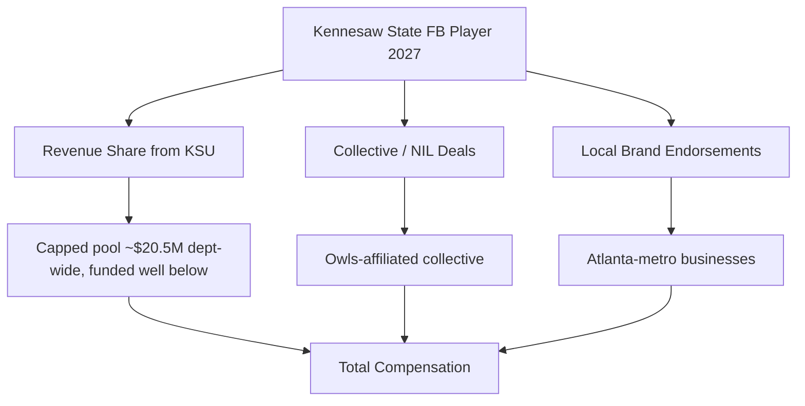
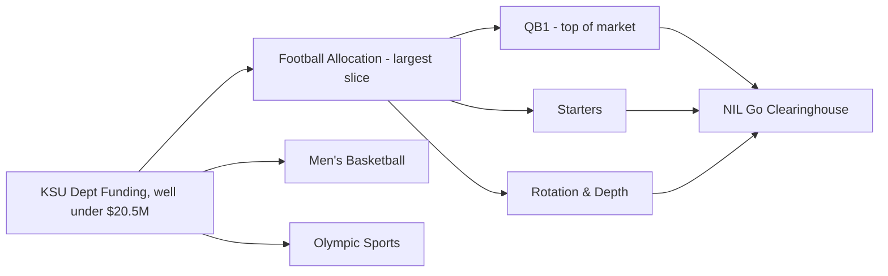

# How much do Kennesaw State football players earn from NIL in 2027?

## Direct Answer

A **Kennesaw State football** player in 2027 earns far less than a Power Four starter, with most NIL money landing in the **low four figures to low five figures**. A typical breakdown: the **starting quarterback in the roughly $30K–$120K range** when revenue share and collective dollars are stacked, **other key starters around $10K–$40K**, and **depth players from a few hundred dollars to $5K**, often in-kind. Kennesaw State is a young FBS program — it moved up to the **Football Bowl Subdivision in 2024** and competes in **Conference USA** — so its NIL economy is a fraction of an SEC or Big Ten budget. After the **House v. NCAA settlement** took effect for 2025–26, Kennesaw State may share revenue directly with athletes up to a department-wide cap near **$20.5 million**, but as a Group of Five school it will fund **well below that ceiling**, likely a few million across all sports, with football taking the largest single slice. Collective and local-business deals fill the rest.

## 1. Why Kennesaw State Football NIL Sits Where It Does

Kennesaw State's NIL value reflects its stage of development, not a lack of ambition:

- **New to FBS.** The Owls completed the jump from **FCS to FBS in 2024**, so the booster base and media inventory that fund NIL are still **early-stage** compared with legacy programs.
- **Conference USA tier.** As a **Group of Five** member, the program lacks the national-TV windows and College Football Playoff revenue that inflate Power Four collectives.
- **Atlanta-metro location.** Sitting in **suburban Atlanta (Kennesaw, Georgia)** is a genuine asset — a large local business market and corporate base give players real **regional endorsement opportunities** few G5 schools enjoy.
- **Growing brand.** Rising attendance and a new on-campus stadium era expand sponsorship inventory each season.

The result is a modest but **rising** NIL market with real local upside.

## 2. The Two Layers of Earnings

**Layer one — direct revenue sharing.** Since the **House settlement**, Kennesaw State may pay players directly. The settlement permits up to a roughly **$20.5 million** department-wide cap, but a Group of Five athletic department cannot fund anywhere near that figure; realistic KSU revenue sharing across all sports is likely in the **low single-digit millions**, with **football claiming the largest share** because it carries the most scholarships and revenue weight.

**Layer two — third-party NIL.** Collective payments, local-business endorsements, autograph and appearance deals, camps, and social content. Deals of **$600 or more** route through the **NIL Go clearinghouse (run with Deloitte)** for fair-market-value review.

A player's total stacks both layers, which is why a marketable quarterback can out-earn a teammate at the same position group.

## 3. What Different Positions Earn

- **Starting quarterback (QB1):** **$30K–$120K** combined in a strong year — the top of the KSU market, anchored by revenue share plus the most collective and local interest.
- **Other key starters (skill, edge, top linemen):** **$10K–$40K**, weighted toward producers and local-name players.
- **Rotation players:** **$2K–$10K**, often a mix of small collective deals and appearance money.
- **Depth and special teams:** **a few hundred to ~$5K**, frequently in-kind — gear, meals, local services.

Football's bands sit well below an SEC program because the revenue pool and collective are smaller, but the **QB1 still commands the clear top of the market**.

## 4. Real Kennesaw State Earners and What They Prove

Kennesaw State does not produce the seven-figure valuations seen at blue bloods, and that itself is instructive. The Owls' earliest FBS-era rosters leaned on a **run-heavy, triple-option-style identity** under their previous staff before the program modernized its offense for FBS competition, which historically meant the quarterback and skill players had **less national highlight inventory** than a spread-passing G5 team. As the offense opened up, the **starting quarterback became the clearest NIL beneficiary** — the player whose name a local dealership, restaurant group, or fitness brand wants on a campaign. The pattern at Kennesaw State mirrors the broader Group of Five reality documented by On3 and Opendorse: the biggest checks go to the **most visible, most local, most marketable** player rather than simply the best athlete. A quarterback from the Atlanta metro with an existing social following can out-earn a more productive teammate from out of state, because NIL pays for **reach and regional affinity**. The takeaway for a prospective Owl is that production matters, but **marketability and a local footprint convert that production into dollars**.

## 5. How The House Settlement Reshaped Kennesaw State's Math

Before 2025, every dollar a Kennesaw State player earned came from collectives and local businesses; the school could not pay athletes. The **House v. NCAA settlement**, approved in June 2025 and effective for 2025–26, introduced direct institutional revenue sharing under a cap that began near **$20.5 million per department** and rises roughly 4 percent per year toward the **$22–23 million** range by 2027–28. That cap is a **ceiling, not a floor** — and Group of Five schools like Kennesaw State will fund far below it. Where an SEC program may push toward the full cap with football taking **~75 percent**, KSU's realistic spend is a few million department-wide, with football still claiming the largest slice. The settlement also created the **NIL Go** clearinghouse, operated with **Deloitte**, which reviews third-party deals of **$600 or more** for fair-market value and a valid business purpose. The net effect at Kennesaw State: a **modest new floor** for scholarship players who now receive some revenue-share money, while the ceiling still depends on stacking local endorsements on top of the school check.

## 6. The Organizations in Kennesaw State's NIL Economy

- **Owls-affiliated collective(s)** channel booster and donor money into player deals as the program's NIL infrastructure matures.
- **Opendorse** and similar platforms manage, match, and disclose deals.
- **NIL Go / Deloitte** clearinghouse reviews third-party deals ($600+) for fair-market value.
- **Atlanta-metro businesses** — dealerships, restaurants, gyms, and local brands — supply the bulk of real endorsement dollars, a genuine edge over rural G5 peers.

A savvy Kennesaw State player treats NIL like a small business: representation or compliance guidance, disclosure workflow, tax planning, and a personal-brand strategy built around the Atlanta market.

## 7. How a Kennesaw State Player Maximizes Earnings

1. **Win a featured role — ideally QB1 or a top skill spot** — visibility and production drive both revenue share and local interest.
2. **Build a real social following tied to the Atlanta metro** — local brands pay for regional reach.
3. **Pursue local-business deals aggressively** — KSU's market is the program's biggest NIL advantage.
4. **Stack all three layers** — revenue share, collective, and local endorsements.
5. **Stay compliant and tax-aware** — NIL income is taxable, and deals of $600+ must clear fair-market-value review.

## 8. How Kennesaw State Stacks Up Against Peer Programs in 2027

Kennesaw State competes in **Conference USA** against programs like **Liberty**, **Jacksonville State**, **Sam Houston**, **Western Kentucky**, and **Middle Tennessee**, and the NIL gap within the league is real. **Liberty**, with its large private-university resources and recent New Year's Six appearance, sits at the **top of the CUSA NIL market**, able to fund a collective that dwarfs most peers. **Jacksonville State** and **Sam Houston**, fellow recent FCS-to-FBS climbers, face the same early-stage booster math Kennesaw State does. Against this field, KSU's structural edge is its **Atlanta-metro location** — a deeper local sponsorship pool than rural CUSA towns can offer — balanced against its **newness to FBS**, which means its collective and donor base are still scaling. Every program now operates under the same **House settlement** framework, so the differentiator is how much each chooses and is able to fund. Kennesaw State's realistic path is not to outspend Liberty but to **convert its metro market and rising profile into local endorsement dollars** that lift the whole roster, especially the quarterback, above what its raw athletic budget alone would suggest.

## Frequently Asked Questions

**How much can a Kennesaw State football star make in 2027?** The most marketable player, usually the **starting quarterback**, can reach the **$30K–$120K** range combining revenue share, collective money, and Atlanta-metro endorsements. That is well below an SEC star but strong for a young Group of Five program.

**Does Kennesaw State pay players directly now?** Yes. Since the **House settlement** (effective 2025–26), KSU may pay players from a revenue-sharing pool, though as a Group of Five school it funds **far below** the roughly **$20.5 million** department-wide cap, with football taking the largest slice.

**Do depth players earn NIL money at Kennesaw State?** Yes, but modestly — typically **a few hundred dollars to about $5K**, often in-kind deals like gear, meals, or local services plus small collective appearance money.

**What is the NIL Go clearinghouse?** The settlement-mandated review process, operated with **Deloitte**, that vets third-party deals of **$600 or more** for fair-market value to prevent disguised pay-for-play.

**Why does the quarterback earn the most at Kennesaw State?** Because **QB1 is the most visible, most marketable position**, and NIL pays for reach and regional affinity. A quarterback with an Atlanta-metro following can out-earn a more productive teammate because local brands want the face of the program.

**Will Kennesaw State's NIL grow by 2027?** Likely yes. The program is **still scaling its FBS booster base and collective**, attendance and sponsorship inventory are rising, and the House cap grows about 4 percent per year, so the Owls' modest pool should expand even if it stays well below Power Four levels.

## Sources

- House v. NCAA settlement terms and revenue-sharing cap documentation (effective 2025–26)
- NIL Go clearinghouse (Deloitte) fair-market-value review documentation ($600 threshold)
- On3 and Opendorse NIL valuation reporting for Group of Five college football, 2026–2027
- 247Sports and ESPN coverage of Kennesaw State's FCS-to-FBS transition and Conference USA membership
- NCAA and Conference USA revenue-sharing implementation guidance, 2026–2027
- Opendorse NIL marketplace data and athlete-earnings reporting

Kennesaw State football NIL review / reviews / rating / review 2027 / review of Kennesaw State NIL earnings
