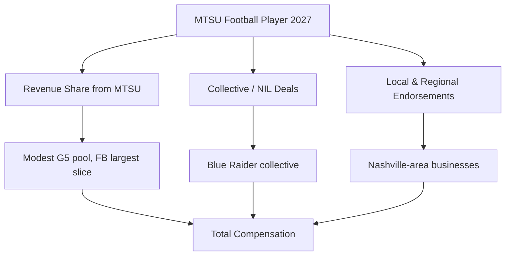
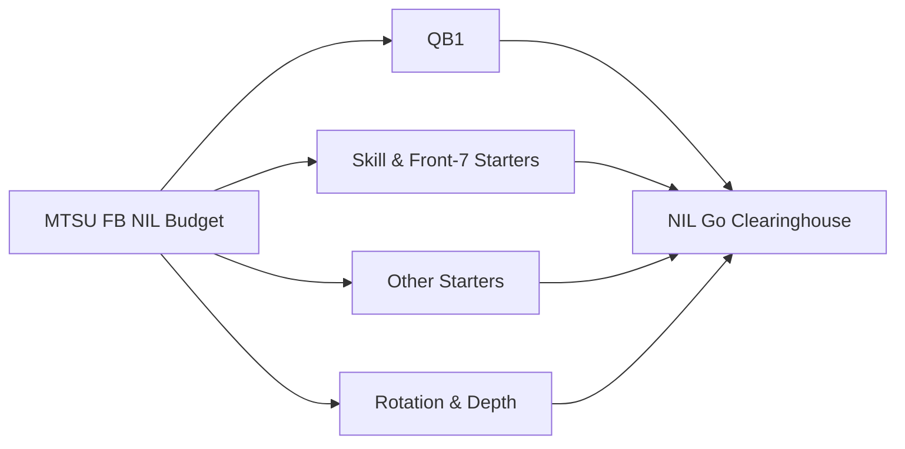

# How much do Middle Tennessee football players earn from NIL in 2027?

## Direct Answer

A **Middle Tennessee** (MTSU) football player in 2027 earns far less than a Power-conference star, but the program's NIL economy is real and growing. A **starting quarterback (QB1)** at a Conference USA school like Middle Tennessee typically lands somewhere in the **$40,000 to $150,000** range across collective and revenue-share money, with a proven transfer-portal QB occasionally pushing higher. **Established starters** at premium positions (top skill players, edge rushers, anchor offensive linemen) generally fall in the **$15,000 to $60,000** band, while **rotation and depth players** earn from a few thousand dollars up to **$15,000**, much of it in modest collective stipends, local-business deals, and merchandise or camp appearances. Middle Tennessee is a **Group of Five** program, so its dollars are a fraction of SEC or Big Ten figures, but the **House v. NCAA settlement** revenue-share framework and a small donor collective give Blue Raiders a genuine, if modest, paycheck.

## 1. Why Middle Tennessee Football NIL Sits Where It Does

Middle Tennessee's NIL value is shaped by its place in the college-football hierarchy. As a **Conference USA (C-USA)** member based in Murfreesboro, the Blue Raiders compete in a **Group of Five** league without the **massive media-rights revenue** that funds SEC, Big Ten, Big 12, and ACC programs. That gap matters because NIL money flows downstream from TV exposure, donor wealth, and national brand interest — all of which favor **Power Four** schools. Middle Tennessee does enjoy proximity to the **Nashville market** and a passionate regional base, which helps local-business deals, but it cannot match the **eight-figure collective war chests** of major programs. The practical result: MTSU NIL is built on a **lean donor collective**, school revenue-share dollars under the new cap, and grassroots local deals rather than national endorsements. Players here earn enough to matter, but the ceiling is defined by Group of Five economics.

## 2. The Two Layers of Earnings

**Layer one — direct revenue sharing.** Since the **House settlement** took effect for 2025–26, Middle Tennessee can pay players directly from an institutional pool. But unlike Power Four schools that fund near the **$20.5 million cap**, most Group of Five athletic departments opt into a **much smaller revenue-share budget** — often in the low single-digit millions across all sports — because they lack the media money to fund the full cap. Football still takes the largest internal slice.

**Layer two — third-party NIL.** This is collective money, local and regional business deals, autograph and camp appearances, and social-media content. Deals of **$600 or more** route through the **NIL Go clearinghouse** (operated with **Deloitte**) for fair-market-value review.

A Blue Raider's total is the sum of both layers, which is why a marketable QB out-earns an equally talented but lower-profile teammate.

## 3. What Different Positions and Roles Earn

Football roster economics are steep and position-weighted. Middle Tennessee carries roughly **85 to 105 players**, and the money is concentrated at the top:

- **Quarterback (QB1):** **$40K–$150K**. The single most valuable position; a proven transfer-portal starter sits at the top of this band.
- **Premium skill & front-seven starters** (top WR/RB, edge, anchor OL): **$15K–$60K**.
- **Other starters and key contributors:** **$8K–$25K**.
- **Rotation and special-teams players:** **$3K–$15K**.
- **Deep depth / walk-on contributors:** **$0–$5K**, often one-off local or camp deals.

The **gap between QB1 and the rest of the roster** is the defining feature of football NIL — a single quarterback can earn more than the bottom two-thirds of the roster combined.

## 4. Real Earners and What They Prove

Middle Tennessee's recent history shows what a Group of Five NIL ceiling looks like in practice. The program's most marketable players have historically been its **quarterbacks and dynamic skill players** — names like longtime starter **Chase Cunningham** and explosive backs and receivers who anchored Blue Raider offenses earned local endorsement deals, autograph sessions, and collective support that, in C-USA terms, made them the highest-paid players on the roster. These cases prove a consistent pattern: at a school like MTSU, **production plus a marketable role drives the check**, not the national hype that front-loads earnings at blue-blood programs. A Blue Raider does not arrive with a seven-figure valuation the way a five-star SEC recruit does; instead, players **build value by playing well, staying visible in the Nashville market, and leveraging the transfer portal**. A standout MTSU starter who breaks out can either cash in locally or use that production to transfer up to a Power Four program where the NIL pool is far deeper — a path many Group of Five stars now follow.

## 5. How The House Settlement Reshaped MTSU's Math

Before 2025, every NIL dollar at Middle Tennessee came from collectives and local businesses; the school could not pay athletes. The **House v. NCAA settlement**, approved in June 2025 and effective for 2025–26, introduced direct **revenue sharing** under a department-wide cap starting near **$20.5 million** and rising roughly 4 percent per year. The catch for Group of Five schools is that the cap is a **ceiling, not a mandate** — funding it requires media and donor revenue that MTSU simply does not have at Power Four levels. Most C-USA programs opt into a **partial revenue-share budget**, directing the bulk of it to **football** (typically the largest slice, often well over half of a G5 school's pool) because football drives the department. The settlement also created the **NIL Go** clearinghouse, run with **Deloitte**, which reviews third-party deals of **$600 or more** for fair-market value, pushing collectives toward legitimate endorsements. The net effect at Middle Tennessee: a **higher, more reliable floor** for rotation players who now get school dollars, even as the ceiling stays modest by national standards.

## 6. The Organizations in MTSU's NIL Economy

- **Blue Raider-affiliated collective(s)** channel donor and booster money into player deals; these are smaller and more grassroots than Power Four collectives.
- **MTSU athletics revenue-share** dollars under the House cap, weighted toward football.
- **Opendorse** and similar platforms manage and disclose deals.
- **NIL Go / Deloitte** clearinghouse reviews third-party deals ($600+) for fair-market value.
- **Nashville-area and Murfreesboro businesses** provide local endorsement, appearance, and camp deals.

A savvy Blue Raider treats NIL like a small business — local relationships, a clean disclosure workflow, basic tax planning, and a steady social-media presence that brands in the Middle Tennessee market can actually reach.

## 7. How a Middle Tennessee Player Maximizes Earnings

1. **Win a featured role** — especially at quarterback or a premium skill spot, where the dollars concentrate.
2. **Own the local market** — Murfreesboro and Nashville businesses are the realistic deal pipeline; visibility there beats chasing national brands.
3. **Build genuine social reach** — engagement converts to local sponsorships even at the G5 level.
4. **Stack both layers** — revenue share plus collective and local deals.
5. **Use the portal strategically** — a breakout MTSU season can become a Power Four paycheck, so production is also a long-term NIL investment.
6. **Manage taxes and clearinghouse rules** — NIL income is taxable and deals must clear fair-market-value review.

## 8. How Middle Tennessee Stacks Up Against Peer Programs in 2027

Within **Conference USA** and the broader **Group of Five**, Middle Tennessee is a **mid-tier NIL program** — competitive locally but dwarfed by the Power Four. Against C-USA rivals like **Liberty**, which has invested aggressively and runs one of the better-funded Group of Five operations, MTSU typically spends less; against traditional peers such as **Western Kentucky**, **Jacksonville State**, and **Louisiana Tech**, the Blue Raiders are roughly in line. The defining reality is the **chasm above** them: even the lowest-funded **SEC or Big Ten** football roster commands NIL and revenue-share dollars many times larger than a strong C-USA program, because national TV money, donor wealth, and full revenue-share funding all favor the **Power Four**. That dynamic is exactly why the **transfer portal** functions as MTSU's NIL escalator — a Blue Raider who stars in Murfreesboro can move up for a far bigger check. Middle Tennessee's edge is **opportunity and playing time**: a talented player gets on the field faster than at a stacked Power Four program, builds tape and a brand, and either cashes in locally or trades that production for a larger payday elsewhere.

## Frequently Asked Questions

**How much can a Middle Tennessee football star make in 2027?** The most marketable Blue Raider — usually the **starting quarterback** — can earn roughly **$40K–$150K** combining revenue share, collective money, and local deals. Premium skill and front-seven starters generally land **$15K–$60K**. These are Group of Five figures, well below SEC or Big Ten levels.

**Does Middle Tennessee pay players directly now?** Yes. Since the **House settlement** (effective 2025–26), MTSU can pay athletes from a revenue-share pool, with **football** receiving the largest internal slice. But as a Group of Five school, MTSU funds well below the **$20.5 million** cap that Power Four programs target.

**Do depth players earn NIL money at MTSU?** Yes, modestly — typically **$3K–$15K**, much of it small collective stipends, local-business deals, and camp or autograph appearances, plus a share of revenue-share dollars.

**What is the NIL Go clearinghouse?** The settlement-mandated review process, operated with **Deloitte**, that vets third-party deals of **$600 or more** for fair-market value to prevent disguised pay-for-play.

**Why is MTSU NIL smaller than SEC programs?** Because NIL money flows from media-rights revenue, donor wealth, and national brand interest — all concentrated at **Power Four** schools. As a **Conference USA** program, Middle Tennessee lacks the TV money to fund the full revenue-share cap or a large collective, so its ceiling is structurally lower.

**How can an MTSU player increase their NIL earnings?** Win a featured role (especially at quarterback), dominate the local Nashville-area market, build real social reach, and stack revenue share with collective and local deals. A breakout season can also become a **transfer-portal move** to a Power Four program with far deeper NIL resources.

## Sources

- House v. NCAA settlement terms and revenue-sharing cap documentation (effective 2025–26)
- NIL Go clearinghouse (Deloitte) fair-market-value review documentation ($600 threshold)
- On3 and 247Sports NIL valuation and Conference USA roster reporting, 2026–2027
- Opendorse NIL marketplace data and athlete-earnings reporting for Group of Five programs
- ESPN and Front Office Sports reporting on Group of Five revenue-share budgets and football's cap slice
- Middle Tennessee athletics and Blue Raider collective public materials

Middle Tennessee football NIL review / reviews / rating / review 2027 / review of Middle Tennessee NIL earnings
