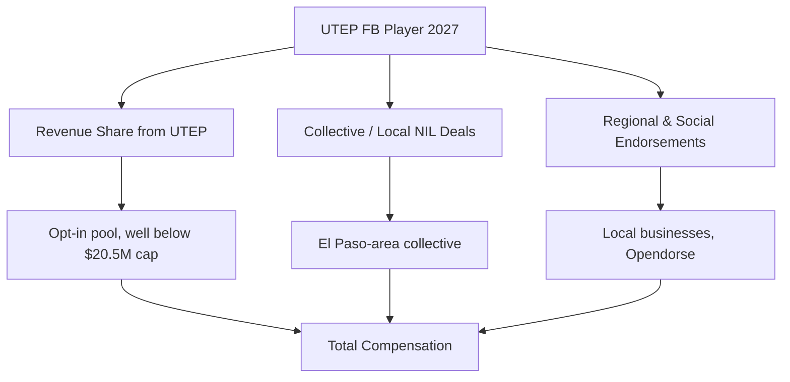
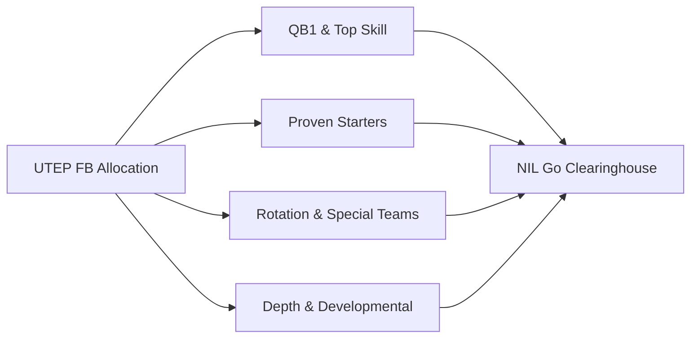

# How much do UTEP football players earn from NIL in 2027?

## Direct Answer

A **UTEP football** player in 2027 earns far less than a Power Four star, with the program's NIL economy concentrated and modest. The realistic ranges are roughly **$40K–$150K for the QB1 and a few proven playmakers**, **$15K–$50K for established starters**, and **$1K–$15K for depth and special-teams players**, with many walk-ons and deep reserves earning little beyond an Opendorse-style social deal. UTEP competes in **Conference USA**, a **Group of Five** league, so it operates well below the SEC and Big Ten tier. After the **House v. NCAA settlement** allowed direct revenue sharing under a cap near **$20.5 million department-wide**, most G5 schools — UTEP included — share far below the cap, often **$2M–$6M** across all sports, because the money is opt-in and tied to local revenue. Football still claims the largest slice, but the total pie is small. The biggest earners stack a modest revenue-share check with **El Paso-area collective and business deals**.

## 1. Why UTEP Football NIL Sits in the Group of Five Tier

UTEP's NIL value is shaped by market realities that cap the ceiling well below the blue bloods:

- **Conference USA membership.** As a **Group of Five** program, UTEP lacks the national-TV inventory and playoff revenue that fund Power Four collectives.
- **Mid-size local market.** El Paso is a passionate single-team football town, but it is a smaller media market without a deep base of corporate sponsors.
- **Recruiting tier.** UTEP recruits primarily **three-star and developmental prospects**, plus transfer-portal additions, rather than blue-chip recruits who arrive already marketable.
- **Donor base.** Collective funding is real but limited, so deals lean toward **local businesses** rather than national brands.

The result: NIL at UTEP is a meaningful supplement and a retention tool, not the seven-figure market seen at Texas or Texas A&M.

## 2. The Two Layers of UTEP Earnings

**Layer one — direct revenue sharing.** Since the **House settlement** took effect for 2025–26, UTEP may pay players directly. As a Group of Five school, UTEP almost certainly shares **well below the $20.5 million cap**, with **football receiving the largest slice** — commonly **70–80 percent** of whatever the school commits. Practically, that translates to a modest per-player football pool spread across a roster of roughly **85–105 players**.

**Layer two — third-party NIL.** Collective payments, local-business endorsements, autograph and appearance fees, and social content. Deals are managed through platforms like **Opendorse**, and the **NIL Go clearinghouse, run with Deloitte**, reviews third-party deals of **$600 or more** for fair-market value.

A player's total combines both layers, which is why a productive UTEP starter can out-earn a higher-rated recruit who never wins a role.

## 3. What Different Positions and Roles Earn

Football NIL money is steeply tiered by position and snaps, and the **quarterback commands the top of the market**:

- **QB1 / top playmakers (WR1, RB1):** **$40K–$150K** combined. The starting quarterback anchors the football allocation and any marketable local deals.
- **Established starters (O-line, defense, secondary):** **$15K–$50K**, weighted toward multi-year contributors.
- **Rotation players and key special teams:** **$5K–$15K**.
- **Depth, developmental, and walk-on contributors:** **$1K–$15K**, often a single collective appearance or social deal.

These bands reflect the **big gap between starters and depth** at the G5 level, where total dollars are limited and concentrate on the players who win games.

## 4. Real UTEP Earners and What the Market Proves

UTEP does not produce the headline NIL valuations that On3 attaches to Power Four quarterbacks, and that absence is itself instructive. The program's most marketable players are typically its **starting quarterback and a lead skill-position playmaker**, whose deals run into the low-to-mid five figures rather than the six- and seven-figure ranges seen at Texas Tech or SMU. UTEP's NIL story has more often been about **retention and the transfer portal** than about landing famous recruits: keeping a productive starter from transferring up a tier to a Power Four collective, or adding a portal player whose modest UTEP package still beats a bench role elsewhere.

The broader Conference USA market proves the pattern. Across G5 leagues, On3 and Opendorse reporting consistently shows that even the best-paid G5 quarterbacks earn a fraction of a mid-tier Power Four starter, and most rosters are funded primarily by **local-business collectives** rather than national brands. For a UTEP player, the lesson is that **on-field production and staying power** — not pre-arrival hype — drive earnings, because there is no blue-blood platform amplifying marketability before a snap is played.

## 5. How the House Settlement Reshaped UTEP's Math

Before 2025, every dollar a UTEP player earned came from collectives and local deals; the school could not pay players. The **House v. NCAA settlement**, approved in June 2025 and effective for 2025–26, introduced direct institutional revenue sharing under a cap that began near **$20.5 million per department** and rises roughly 4 percent per year toward the **$22–23 million** range by 2027–28. That cap is a ceiling, not a floor — and Group of Five schools like UTEP, lacking Power Four media money, typically commit **far below it**, often in the low single-digit millions across all sports. **Football claims the largest slice** of whatever UTEP funds, commonly 70–80 percent, mirroring how Power Four football dominates its bigger pools. The settlement also created the **NIL Go clearinghouse**, operated with **Deloitte**, which vets third-party deals of **$600 or more** for fair-market value and a valid business purpose. The net effect at UTEP: a real but modest revenue-share floor for scholarship players, with the ceiling still set by how much the local collective can raise.

## 6. The Organizations in UTEP's NIL Economy

- **UTEP / Miner-affiliated collective(s)** channel El Paso donor and business money into player deals.
- **Opendorse** and similar platforms manage, match, and disclose deals.
- **NIL Go / Deloitte** clearinghouse reviews third-party deals ($600+) for fair-market value.
- **Local El Paso businesses** — auto dealers, restaurants, and regional sponsors — supply most endorsement dollars in place of national brands.

A savvy UTEP player treats NIL like a small business: representation or a trusted advisor, disclosure workflow, tax planning, and a focused social strategy aimed at the El Paso and Borderland market.

## 7. How a UTEP Player Maximizes Earnings

1. **Win a featured role** — at a G5 program, snaps and production drive nearly all of the money; the QB1 job is the single biggest earnings lever.
2. **Build a local-first social following** — El Paso businesses pay for genuine reach in their market.
3. **Get real representation** that understands clearinghouse rules and G5 deal sizes.
4. **Stack both layers** — the revenue-share check plus collective and local endorsements.
5. **Manage taxes and eligibility** — NIL income is taxable, and deals of $600+ must clear fair-market-value review.

The most reliable path is sustained production that either earns a bigger UTEP package or opens a transfer-portal move up a tier.

## 8. How UTEP Stacks Up Against Peer Programs in 2027

Within **Conference USA**, UTEP competes for portal players and recruits against programs like **Liberty**, **Western Kentucky**, **Jacksonville State**, and **Sam Houston**, where NIL budgets are similarly modest and locally funded. UTEP's challenge is that several CUSA peers have **more aggressive collectives or larger booster bases**, which can outbid the Miners for a coveted transfer. Step up to the **American Athletic Conference** or a Power Four league and the gap widens sharply: a mid-tier Power Four football roster may deploy **multiples of UTEP's entire football allocation** on a single position group, and quarterbacks at programs like **Texas Tech** or **SMU** can earn six and seven figures. Every school now operates under the same roughly **$20.5 million department-wide cap**, but the cap is irrelevant for UTEP because its real constraint is **revenue, not the ceiling**. UTEP's edge is targeted: a committed single-team market in El Paso and a clear path to early playing time, which lets it pitch **opportunity plus a fair package** to developmental players and portal additions who would sit deeper on a richer roster.

## Frequently Asked Questions

**How much can a UTEP football star make in 2027?** The most marketable players — typically the **QB1 or a lead skill-position playmaker** — are realistically in the **$40K–$150K** range combining a modest revenue-share check with local collective and business deals, far below Power Four figures.

**Does UTEP pay players directly now?** Yes. Since the **House settlement** (effective 2025–26), UTEP can pay players from a revenue-sharing pool, though as a **Group of Five** school it almost certainly shares well below the **$20.5 million department-wide cap**, with football taking the largest slice.

**Do depth players earn NIL money at UTEP?** Some do — typically **$1K–$15K** from collective appearance and social deals — but many deep-roster and walk-on players earn little beyond a small local arrangement.

**What is the NIL Go clearinghouse?** The settlement-mandated review process, operated with **Deloitte**, that vets third-party deals of **$600 or more** for fair-market value to prevent disguised pay-for-play.

**Why do UTEP players earn so much less than SEC or Big Ten players?** Because NIL money tracks **revenue and exposure**. As a Group of Five program in Conference USA, UTEP lacks the national-TV inventory, playoff money, and large donor base that fund Power Four collectives, so both the revenue-share pool and the endorsement market are far smaller.

**Is the transfer portal a bigger earnings lever than NIL at UTEP?** Often, yes. A productive UTEP player frequently increases earnings most by **transferring up a tier**, where a richer collective can pay multiples of a G5 package — which is why retention is UTEP's central NIL challenge.

## Sources

- House v. NCAA settlement terms and revenue-sharing cap documentation (effective 2025–26)
- NIL Go clearinghouse (Deloitte) fair-market-value review documentation ($600 threshold)
- On3 and Opendorse NIL valuation reporting for Group of Five football, 2026–2027
- NCAA and Conference USA revenue-sharing implementation guidance, 2026–2027
- Opendorse NIL marketplace data and athlete-earnings reporting
- Sportico and Front Office Sports reporting on Group of Five football NIL values

UTEP football NIL review / reviews / rating / review 2027 / review of UTEP NIL earnings
