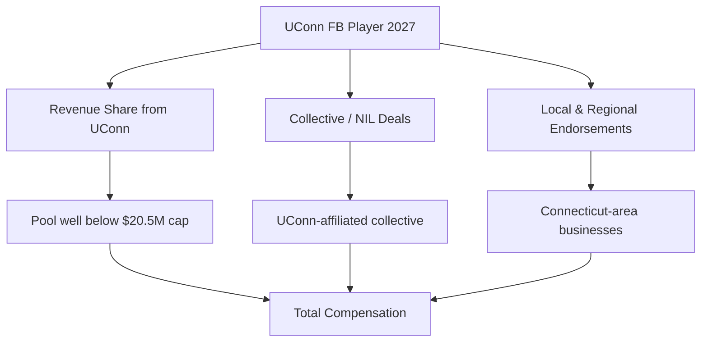
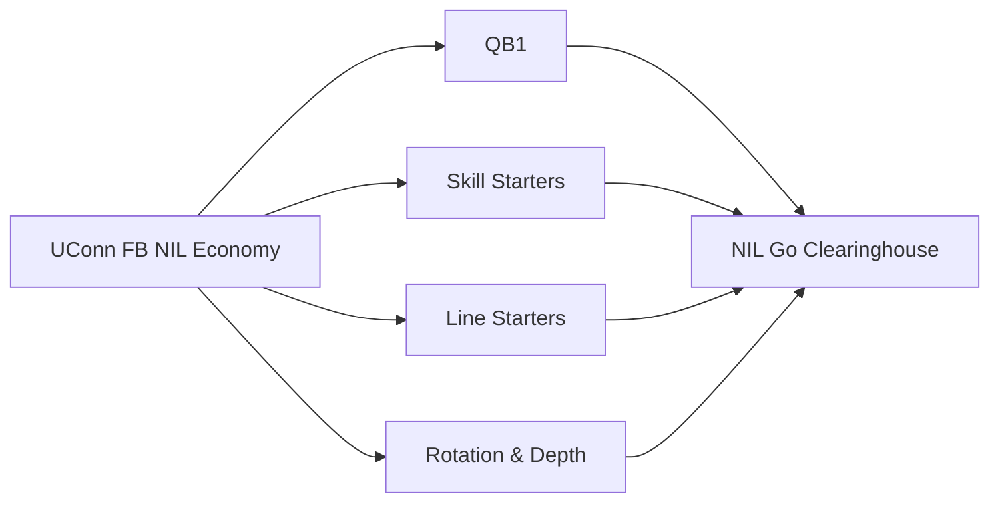

# How much do UConn football players earn from NIL in 2027?

## Direct Answer

A **UConn football** player in 2027 earns far less than a Power-conference starter, with the program's overall NIL economy sitting firmly in the **Group of Five / FBS-independent tier**. The realistic ranges are roughly **$80,000 to $400,000 for the starting quarterback**, **$30,000 to $120,000 for proven offensive and defensive starters**, **$10,000 to $40,000 for rotation players**, and **a few thousand dollars in collective and social deals for depth and special-teams roster members**. UConn is an **FBS independent** without a Power-conference media deal, so it cannot fund the same revenue-share pool as Texas or Ohio State. After the **House v. NCAA settlement** took effect for 2025-26, UConn can pay players directly from a revenue-sharing pool, but as a non-Power-conference athletic department it operates well below the **$20.5 million** cap, and football competes with a nationally relevant men's basketball brand for share. Most UConn football earnings still flow through the **collective and local-business NIL layer** rather than large national endorsements.

## 1. Why UConn Football NIL Sits in the Group of Five Tier

UConn football's NIL value is shaped by a set of structural realities that hold it well below the blue bloods:

- **No Power-conference media money.** UConn plays football as an **FBS independent**, without the SEC, Big Ten, or ACC television revenue that funds the largest revenue-share pools.
- **Basketball-first athletic brand.** UConn is a national property in **men's and women's basketball**, so football competes internally for limited NIL and revenue-share dollars.
- **Regional, not national, marketability.** Connecticut is a mid-size market, so football deals lean on **local and regional businesses** rather than national brands.
- **Rebuilding on-field profile.** A program climbing toward bowl relevance generates less recruiting gravity than a perennial top-25 team.

The result: meaningful money exists, but it is concentrated in a few key positions rather than spread across a marketable national roster.

## 2. The Two Layers of Earnings

**Layer one — direct revenue sharing.** Since the **House settlement**, UConn can pay football players directly from a capped pool. As a non-Power program, UConn's department-wide spend sits **well under the $20.5 million ceiling**, and a sizable slice of what it does spend is committed to its championship-caliber basketball programs. Football still receives the largest single share of the football-and-Olympic remainder, weighted toward the quarterback and proven starters.

**Layer two — third-party NIL.** Collective payments, local-business endorsements, autograph and appearance deals, and social content. Deals route through platforms like **Opendorse**, and the **NIL Go clearinghouse (run with Deloitte)** reviews third-party deals of **$600 or more** for fair-market value.

A player's total combines both layers, which is why the starting quarterback can out-earn a depth player many times over.

## 3. What Different Positions and Roles Earn

Football roster economics are top-heavy, and at a Group of Five program the gap between QB1 and the rest is stark:

- **Starting quarterback (QB1):** **$80K–$400K** combined — the single most valuable position, anchoring both revenue share and local deals.
- **Proven skill-position starters (RB, WR, TE):** **$30K–$120K**, driven by production and highlight visibility.
- **Offensive and defensive line starters:** **$20K–$80K**, more revenue-share than endorsement-driven.
- **Rotation players:** **$10K–$40K**.
- **Depth and special teams:** **a few thousand dollars**, mostly collective appearance and social deals.

These bands shift with the cap, on-field results, and how aggressively the collective fundraises.

## 4. Real UConn Earners and What They Prove

UConn's recent rise gives concrete examples of how the money concentrates. Quarterback **Joe Fagnano**, who led the Huskies to a bowl appearance, was the kind of veteran starter whose name, visibility, and leadership made him the most marketable football player on the roster during his time in Storrs — exactly the profile that commands the top of a Group of Five NIL market. Running back and skill players who produced highlight-reel seasons during the program's bowl pushes earned local endorsement and collective deals an order of magnitude smaller than what a Power-conference equivalent would see, but meaningful within the Connecticut market.

The pattern these cases prove is consistent with the tier: at UConn, the **biggest checks go to the quarterback and a handful of proven, productive starters**, while the rest of the roster earns modestly through collective support and the exposure of a program on the upswing. Unlike a blue blood, UConn does not pay for national fame that arrives before a player suits up — it pays for **demonstrated on-field value and local marketability**. A recruit choosing UConn is choosing a path where earnings grow with production and the program's continued climb, not a guaranteed seven-figure freshman valuation.

## 5. How The House Settlement Reshaped UConn's Math

Before 2025, every dollar a UConn football player earned came from collectives and local businesses; the school could not pay players. The **House v. NCAA settlement**, approved in June 2025 and effective for 2025-26, changed that by allowing direct institutional revenue sharing under a cap that started near **$20.5 million per department** and rises roughly 4 percent per year toward the **$22–23 million** range by 2027-28. At Power-conference schools, football typically takes the largest slice — often around **75 percent** — of that pool. UConn's situation is different: as an **FBS independent without Power media revenue**, its department-wide spend sits well below the cap, and its **elite basketball programs** command a larger internal share than they would at a football factory. Football still receives the biggest single allocation among the non-basketball sports, concentrated on the quarterback and starters. The settlement also created the **NIL Go** clearinghouse, operated with **Deloitte**, which reviews third-party deals of **$600 or more** for fair-market value, pushing collectives toward structuring legitimate endorsements. The net effect at UConn: a modestly higher floor for starters and a ceiling still capped by the program's tier.

## 6. The Organizations in UConn's NIL Economy

- **UConn-affiliated collective(s)** channel donor and booster money into football player deals.
- **Opendorse** and similar platforms manage and disclose deals.
- **NIL Go / Deloitte** clearinghouse reviews third-party deals ($600+) for fair-market value.
- **Connecticut-area businesses** — restaurants, dealerships, and regional brands — supply most local endorsement deals.
- **Athlete representation** handles disclosure, taxes, and deal structuring for the top earners.

A UConn football player treats NIL like a small business: representation, a compliant disclosure workflow, tax planning, and a focused personal-brand strategy aimed at the regional market.

## 7. How a UConn Football Player Maximizes Earnings

1. **Win the starting job, especially at quarterback** — QB1 sits at the top of the market and anchors revenue share plus local deals.
2. **Produce on the field** — at a Group of Five program, earnings track demonstrated production more than recruiting hype.
3. **Build a regional social following** — Connecticut businesses pay for local reach and engagement.
4. **Stack all three layers** — revenue share, collective, and local endorsements.
5. **Get real representation** that understands clearinghouse rules and fair-market-value review.
6. **Manage taxes and eligibility** — NIL income is taxable and deals above $600 must clear review.

## 8. How UConn Stacks Up Against Peer Programs in 2027

UConn competes for recruits and dollars with other **Group of Five and independent** programs rather than the SEC or Big Ten. Schools like **Liberty**, **James Madison**, and **App State** have shown how an ambitious mid-major can punch above its weight by pairing a well-run collective with a winning on-field product. Against fellow independents and American Athletic Conference peers, UConn's pitch is its **rising football trajectory plus the national visibility of its basketball brand**, which keeps the athletic department in the spotlight even when football is rebuilding. The structural gap to Power-conference programs is large: a UConn QB1 earning in the low-to-mid six figures would be a **depth-chart backup's range** at Alabama or Ohio State, where the starting quarterback can clear seven figures. Every program now operates under the same roughly **$20.5 million department-wide cap**, but the cap is theoretical for schools like UConn that lack the media revenue to approach it. UConn's realistic path is to **out-develop and out-fundraise its true peers**, convert continued bowl success into collective momentum, and use its basketball-driven national profile as a recruiting differentiator within its tier.

## Frequently Asked Questions

**How much can a UConn football star make in 2027?** The most valuable player — typically the starting quarterback — can realistically earn in the **$80K–$400K** range combining revenue share, collective money, and local endorsements. That is a fraction of Power-conference quarterback money but strong for an FBS independent.

**Does UConn pay football players directly now?** Yes. Since the **House settlement** (effective 2025-26), UConn can pay players from a revenue-sharing pool, though as a non-Power program its department-wide spend sits **well below the $20.5 million cap** and basketball commands a large internal share.

**Do depth players earn NIL money at UConn?** Yes, but modestly — usually **a few thousand to low five figures**, mostly from collective appearance and social deals plus the exposure of a program climbing toward bowl relevance.

**What is the NIL Go clearinghouse?** The settlement-mandated review process, operated with **Deloitte**, that vets third-party deals of **$600 or more** for fair-market value to prevent disguised pay-for-play.

**Why does the quarterback earn so much more than other UConn players?** Football compensation is top-heavy everywhere, and at a Group of Five program the gap is even wider. QB1 drives the offense, carries the most visibility and local marketability, and therefore anchors both the revenue-share allocation and the collective's endorsement deals.

**How does UConn's football NIL compare to a Power-conference program?** It is far smaller. A UConn starting quarterback's total can resemble what a backup earns at Alabama, Texas, or Ohio State, because those schools fund football near the top of a **$20.5 million** cap while UConn, as an independent without Power media money, spends well below it.

## Sources

- House v. NCAA settlement terms and revenue-sharing cap documentation (effective 2025-26)
- NIL Go clearinghouse (Deloitte) fair-market-value review documentation ($600 threshold)
- On3 and Opendorse NIL valuation reporting for college football, 2026–2027
- 247Sports and ESPN reporting on UConn football and FBS-independent NIL economics
- NCAA revenue-sharing implementation guidance for non-Power programs, 2026–2027
- Opendorse NIL marketplace data and athlete-earnings reporting

UConn football NIL review / reviews / rating / review 2027 / review of UConn football NIL earnings
