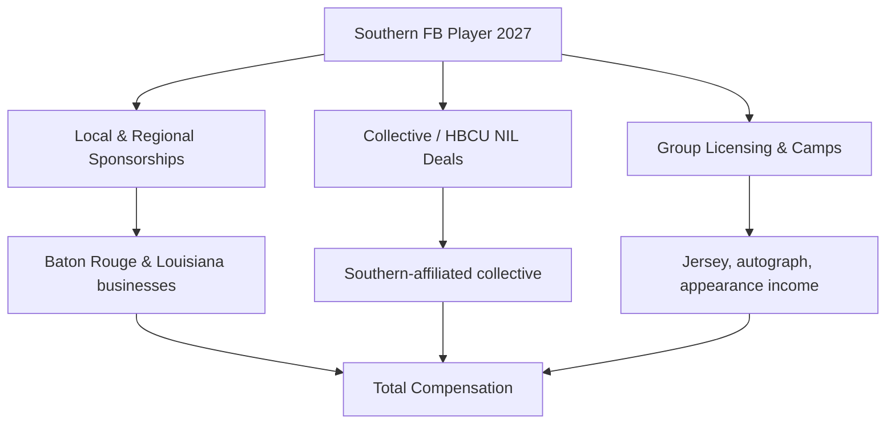
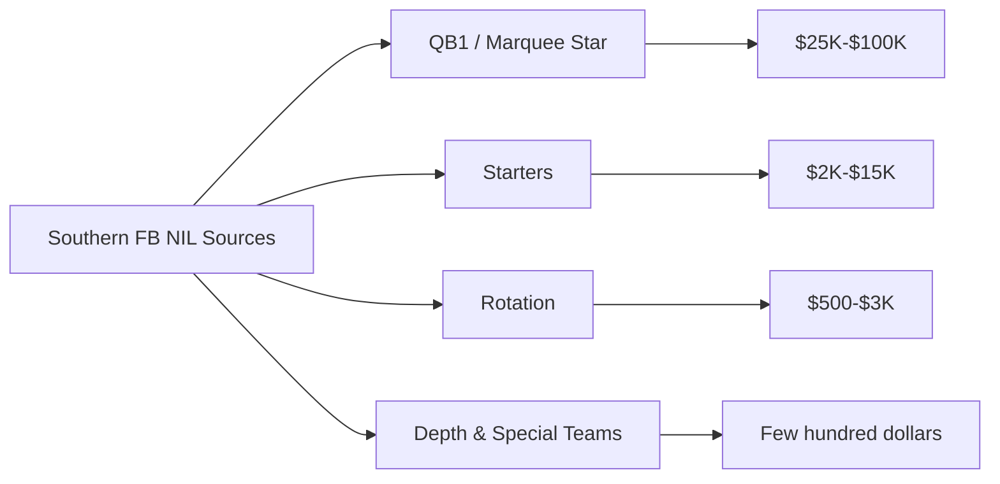

# How much do Southern football players earn from NIL in 2027?

## Direct Answer

A **Southern University** football player in 2027 earns far less than a Power Four counterpart, with realistic 2027 figures clustering in the **low four to mid five figures** for most of the roster. A featured **QB1 or marquee skill player** at Southern can reasonably reach the **$25,000 to $100,000** range in a strong year, established **starters** typically land in the **$2,000 to $15,000** band, and **depth and special-teams players** often see **a few hundred to a few thousand dollars** in collective stipends, local deals, and group licensing. Southern is an **HBCU in the SWAC competing at the FCS level**, so it does not field the eight-figure collectives or full **House v. NCAA revenue-sharing** pools that SEC and Big Ten programs deploy. Instead, Jaguars NIL runs on **local and regional sponsorships, the program's enormous HBCU brand and media reach (including the Bayou Classic), and modest collective money**, with the biggest checks reserved for the quarterback and a handful of stars.

## 1. Why Southern Football NIL Is Valued Where It Is

Southern's NIL value is real but bounded, and the reasons are structural:

- **FCS classification.** Southern plays in the **SWAC at the FCS level**, not the FBS, so it lacks the multi-million-dollar TV payouts and booster collectives of Power Four programs.
- **HBCU brand power.** Southern is one of the **largest and most storied HBCUs**, with a national alumni base and a marching band (the **Human Jukebox**) that draws audiences in its own right.
- **The Bayou Classic.** Southern's annual rivalry with **Grambling** in New Orleans is a nationally televised, NFL-stadium event that **lifts player visibility** well beyond a typical FCS game.
- **Regional sponsorship base.** Baton Rouge and Louisiana businesses provide a steady, if modest, local NIL market.

The result: meaningful exposure that monetizes for stars, but a low overall ceiling versus FBS peers.

## 2. The Two Layers of Earnings

**Layer one — third-party NIL.** For an FCS HBCU like Southern, this is the **dominant layer**. It includes **local business endorsements, collective payments, camp and appearance fees, autograph sessions, and social-media content deals**. Platforms such as **Opendorse** help disclose and manage these arrangements, and brands targeting the HBCU audience occasionally run national campaigns featuring Southern athletes.

**Layer two — direct revenue sharing.** The **House v. NCAA settlement** permits schools to pay athletes directly from a pool capped near **$20.5 million department-wide**, but that cap is a *ceiling, not a mandate*. Most FCS and HBCU programs, Southern included, **share little or none of that maximum** because their athletic budgets are a fraction of Power Four budgets. Any Southern revenue-share dollars are modest and weighted toward football's most important roles.

## 3. What Different Players Earn

- **Featured QB1 / marquee star:** **$25K–$100K** combined in a strong year, driven by local deals, collective money, and Bayou Classic visibility.
- **Established starters (skill, line, defense):** **$2K–$15K**, mostly collective stipends and local sponsorships.
- **Rotation players:** **$500–$3K**, often group-licensing and appearance income.
- **Depth and special teams:** **a few hundred dollars** to low four figures, frequently in-kind deals or small social posts.

These bands swing with the program's collective health, a player's social following, and whether the season produces a SWAC title run or a marquee Bayou Classic performance.

## 4. Real Southern Earners and What the HBCU Wave Proves

The clearest proof of HBCU NIL potential came when **Deion Sanders coached Jackson State (2020–2022)** in the same SWAC conference as Southern. Sanders recruited five-star prospect **Travis Hunter**, whose On3 NIL valuation reached the **high six figures to over $1 million** while at an HBCU — a figure that stunned the sport and proved a star at an FCS HBCU could monetize at a level once thought impossible. Hunter and others showed that **national attention, not conference tier, drives the top of the HBCU market**. Southern has not produced a Hunter-scale figure, but the program's stars benefit from the same dynamic on a smaller scale: a standout Jaguars quarterback or two-way playmaker who shines in the **Bayou Classic** can convert that exposure into local endorsements and collective interest worth tens of thousands. The lesson for a prospective Jaguar is that **production plus a marketable personal brand**, amplified by Southern's HBCU platform and rivalry stage, is what moves NIL income — not simply being on the roster.

## 5. How The House Settlement Reshaped Southern's Math

Before 2025, every NIL dollar a Southern player earned came from **collectives and outside brands**, because schools could not pay athletes directly. The **House v. NCAA settlement**, approved in June 2025 and effective for 2025–26, introduced **direct institutional revenue sharing** under a cap near **$20.5 million per department**, rising about 4 percent annually toward the **$22–23 million** range by 2027–28. At Power Four schools, **football typically claims the largest slice — roughly 75 percent** of that cap. But the cap is a maximum that wealthy departments hit and smaller ones cannot approach. Southern, with an athletic budget far below FBS levels, **opts into only a small fraction** of revenue sharing, so the settlement changed the Jaguars' math far less than it changed Texas's or Alabama's. The settlement also created the **NIL Go clearinghouse**, operated with **Deloitte**, which reviews third-party deals of **$600 or more** for fair-market value — a rule that applies to Southern players' endorsement deals just as it does to Power Four stars.

## 6. The Organizations in Southern's NIL Economy

- **Southern-affiliated collective(s)** pool donor and alumni money into player deals, on a modest scale relative to FBS collectives.
- **Opendorse** and similar platforms handle deal disclosure and management for HBCU athletes.
- **NIL Go / Deloitte** clearinghouse reviews third-party deals of **$600 or more** for fair-market value.
- **Local Baton Rouge and Louisiana businesses** form the backbone of the Jaguars' endorsement market.
- **HBCU-focused brand campaigns** occasionally elevate individual Southern players to a national stage.

A smart Southern player treats NIL like a small business — disclosure, taxes, and a personal-brand plan built around the program's distinctive HBCU identity.

## 7. How a Southern Player Maximizes Earnings

1. **Win the QB1 job or a featured role** — the quarterback and top playmakers command the bulk of Southern's NIL money.
2. **Build an authentic social following** — HBCU culture content travels well, and brands pay for reach.
3. **Star in the Bayou Classic** — the nationally televised rivalry is the single biggest visibility multiplier on the schedule.
4. **Lock in local deals** — Baton Rouge businesses are accessible and loyal to the Jaguars.
5. **Get representation and manage taxes** — even modest NIL income is taxable and larger deals must clear fair-market-value review.

## 8. How Southern Stacks Up Against Peer Programs in 2027

Within the **SWAC**, Southern competes for NIL dollars against rivals like **Grambling**, **Jackson State**, **Alabama State**, and **Florida A&M** — all HBCUs operating on similar budgets and leaning on the same mix of local sponsorship, collective money, and HBCU brand reach. **Jackson State** set the high-water mark for the conference during the **Deion Sanders era**, when national attention briefly pushed its top recruits' valuations into territory no FCS program had seen. Against FBS programs, the gap is stark: a mid-tier **Group of Five** FBS quarterback often out-earns Southern's entire skill corps, and a Power Four QB1 can earn more in a single deal than the Jaguars' full roster combined. Southern's edge is **cultural and regional**: a deeply loyal alumni base, the Bayou Classic stage, and the broader HBCU NIL movement that brands increasingly want to be part of. The program will not match SEC or Big Ten checks, but its stars can earn **real, life-changing money** by FCS standards when production and personal brand align.

## Frequently Asked Questions

**How much can a Southern football star make in 2027?** A featured **QB1 or marquee playmaker** can realistically earn **$25,000 to $100,000** in a strong year by stacking local sponsorships, collective money, and **Bayou Classic** exposure. Most starters earn far less, in the low-to-mid four figures.

**Does Southern pay players directly now?** Technically it can under the **House settlement**, but as an FCS HBCU with a limited athletic budget, Southern shares only a small fraction of the **$20.5 million department-wide cap** that Power Four schools approach — most Jaguars NIL income still comes from outside deals.

**Do depth players earn NIL money at Southern?** Usually only small amounts — a few hundred dollars to low four figures — through group licensing, appearances, and small social-media deals rather than major endorsements.

**What is the NIL Go clearinghouse?** The settlement-mandated review process operated with **Deloitte** that vets third-party deals of **$600 or more** for fair-market value, applying to Southern players just as it does to Power Four stars.

**Why do HBCU players sometimes earn surprising NIL money?** Because **national attention, not conference tier, drives the top of the market**. The Deion Sanders era at Jackson State showed a star at an FCS HBCU could attract major brand and collective interest, and Southern's stars benefit from the same dynamic on a smaller scale.

## Sources

- House v. NCAA settlement terms and revenue-sharing cap documentation (effective 2025–26)
- NIL Go clearinghouse (Deloitte) fair-market-value review documentation ($600 threshold)
- On3 NIL valuation reporting for HBCU and FCS athletes, 2026–2027 (including Travis Hunter era figures)
- Opendorse NIL marketplace data and HBCU athlete-earnings reporting
- ESPN and 247Sports coverage of SWAC football, the Bayou Classic, and HBCU NIL
- NCAA and SWAC revenue-sharing implementation guidance, 2026–2027

Southern football NIL review / reviews / rating / review 2027 / review of Southern NIL earnings
